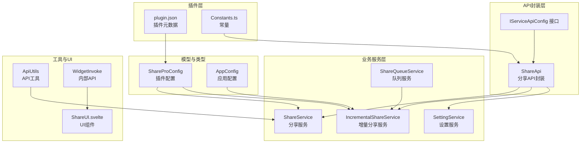
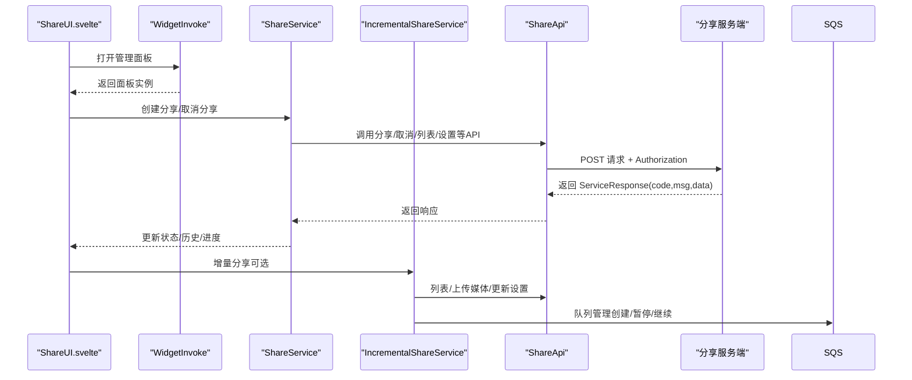
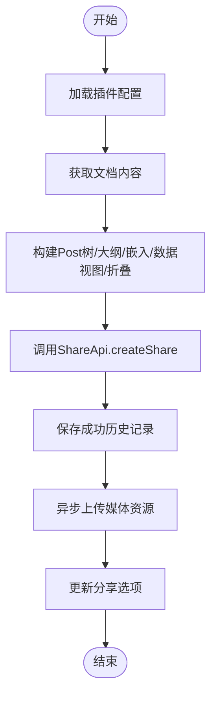
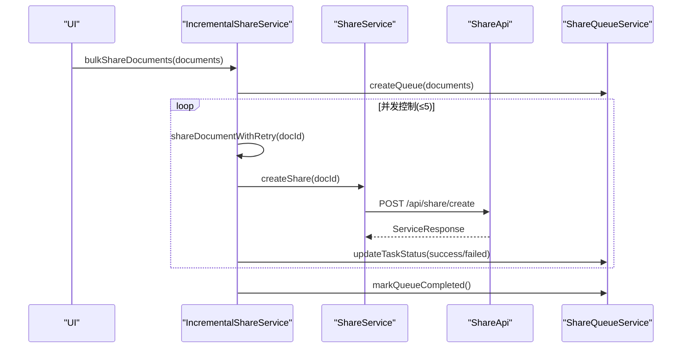
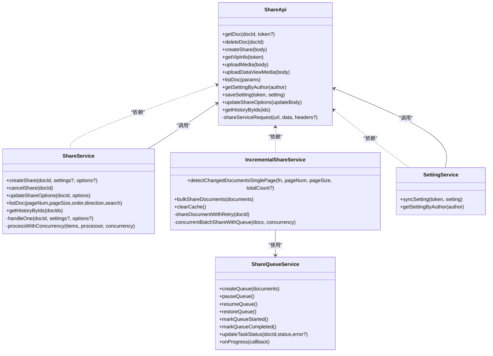

# API参考文档

<cite>
**本文档引用的文件**
- [plugin.json](file://plugin.json)
- [share-api.ts](file://src/api/share-api.ts)
- [ShareService.ts](file://src/service/ShareService.ts)
- [IncrementalShareService.ts](file://src/service/IncrementalShareService.ts)
- [SettingService.ts](file://src/service/SettingService.ts)
- [ShareProConfig.ts](file://src/models/ShareProConfig.ts)
- [AppConfig.ts](file://src/models/AppConfig.ts)
- [IServiceApiConfig 接口](file://src/types/service-api.d.ts)
- [Constants.ts](file://src/Constants.ts)
- [ShareQueueService.ts](file://src/service/ShareQueueService.ts)
- [ApiUtils.ts](file://src/utils/ApiUtils.ts)
- [widgetInvoke.ts](file://src/invoke/widgetInvoke.ts)
- [ShareUI.svelte](file://src/libs/pages/ShareUI.svelte)
- [README.md](file://README.md)
- [TESTING_CHECKLIST.md](file://TESTING_CHECKLIST.md)
</cite>

## 目录
1. [简介](#简介)
2. [项目结构](#项目结构)
3. [核心组件](#核心组件)
4. [架构总览](#架构总览)
5. [详细组件分析](#详细组件分析)
6. [依赖关系分析](#依赖关系分析)
7. [性能考量](#性能考量)
8. [故障排查指南](#故障排查指南)
9. [结论](#结论)
10. [附录](#附录)

## 简介
本文件为“思源笔记分享专业版”的全面API参考文档，覆盖分享API、增量分享API、设置API等核心接口，详细说明HTTP方法、URL模式、请求/响应模式与认证方式；并包含协议特定示例、错误处理策略、安全考虑、速率限制与版本信息；同时提供常见用例、客户端实现指南、性能优化技巧、调试工具与监控方法，以及widgetInvoke等内部API的使用说明。

## 项目结构
该项目采用前端插件架构，核心由以下层次组成：
- 插件入口与配置：插件元数据、常量与配置模型
- API封装层：统一的分享服务API调用封装
- 业务服务层：分享服务、增量分享服务、设置服务、队列服务
- 工具与模型：配置模型、类型定义、工具类
- UI与交互：Svelte页面组件与widgetInvoke内部API

**图表来源**
- [plugin.json:1-35](file://plugin.json#L1-L35)
- [Constants.ts:1-20](file://src/Constants.ts#L1-L20)
- [share-api.ts:16-240](file://src/api/share-api.ts#L16-L240)
- [ShareService.ts:40-1195](file://src/service/ShareService.ts#L40-L1195)
- [IncrementalShareService.ts:98-690](file://src/service/IncrementalShareService.ts#L98-L690)
- [SettingService.ts:18-39](file://src/service/SettingService.ts#L18-L39)
- [ShareProConfig.ts:13-40](file://src/models/ShareProConfig.ts#L13-L40)
- [AppConfig.ts:12-88](file://src/models/AppConfig.ts#L12-L88)
- [IServiceApiConfig 接口:13-16](file://src/types/service-api.d.ts#L13-L16)
- [ApiUtils.ts:15-27](file://src/utils/ApiUtils.ts#L15-L27)
- [widgetInvoke.ts:17-80](file://src/invoke/widgetInvoke.ts#L17-L80)
- [ShareUI.svelte:43-166](file://src/libs/pages/ShareUI.svelte#L43-L166)

**章节来源**
- [plugin.json:1-35](file://plugin.json#L1-L35)
- [Constants.ts:1-20](file://src/Constants.ts#L1-L20)

## 核心组件
- ShareApi：封装所有服务端API调用，统一POST请求与Authorization头注入
- ShareService：分享业务编排，负责文档聚合、资源处理、历史记录与进度管理
- IncrementalShareService：增量分享，支持分页、并发控制、智能重试、队列管理
- SettingService：应用设置同步与读取
- ShareQueueService：分享队列的创建、暂停/继续、持久化与进度回调
- ShareProConfig/AppConfig：插件与应用配置模型
- WidgetInvoke：内部API，用于打开分享管理对话框/标签页

**章节来源**
- [share-api.ts:16-240](file://src/api/share-api.ts#L16-L240)
- [ShareService.ts:40-1195](file://src/service/ShareService.ts#L40-L1195)
- [IncrementalShareService.ts:98-690](file://src/service/IncrementalShareService.ts#L98-L690)
- [SettingService.ts:18-39](file://src/service/SettingService.ts#L18-L39)
- [ShareProConfig.ts:13-40](file://src/models/ShareProConfig.ts#L13-L40)
- [AppConfig.ts:12-88](file://src/models/AppConfig.ts#L12-L88)
- [ShareQueueService.ts:24-298](file://src/service/ShareQueueService.ts#L24-L298)
- [widgetInvoke.ts:17-80](file://src/invoke/widgetInvoke.ts#L17-L80)

## 架构总览
下图展示从插件UI到服务端API的整体调用链路与关键组件交互：

**图表来源**
- [ShareUI.svelte:128-166](file://src/libs/pages/ShareUI.svelte#L128-L166)
- [widgetInvoke.ts:26-76](file://src/invoke/widgetInvoke.ts#L26-L76)
- [ShareService.ts:235-674](file://src/service/ShareService.ts#L235-L674)
- [IncrementalShareService.ts:269-351](file://src/service/IncrementalShareService.ts#L269-L351)
- [ShareApi.ts:173-209](file://src/api/share-api.ts#L173-L209)
- [ShareQueueService.ts:38-100](file://src/service/ShareQueueService.ts#L38-L100)

## 详细组件分析

### 分享API（ShareApi）
- 统一请求方法：POST
- 请求头：
  - Content-Type: application/json
  - Authorization: Bearer <token>（当存在token时）
- 响应结构：ServiceResponse
  - code: 数字状态码
  - msg: 文本消息
  - data: 任意数据
- 关键接口枚举（URL模式）：
  - 获取文档：/api/share/getDoc
  - 删除分享：/api/share/delete
  - 创建分享：/api/share/create
  - 更新分享选项：/api/share/updateOptions
  - VIP信息：/api/license/vipInfo
  - 上传媒体：/api/asset/upload
  - 上传DataViews媒体：/api/asset/uploadDataView
  - 分享列表：/api/share/listDoc
  - 按作者获取设置：/api/settings/byAuthor
  - 更新设置：/api/settings/update
  - 黑名单列表：/api/share/blacklist/list
  - 黑名单新增：/api/share/blacklist/add
  - 黑名单删除：/api/share/blacklist/delete
  - 黑名单检查：/api/share/blacklist/check
  - 历史记录查询：/api/share/history/getByDocIds

请求/响应模式示例（基于现有实现）：
- 创建分享
  - 方法：POST
  - URL：/api/share/create
  - 请求体：包含文档ID、HTML内容、文档属性等
  - 响应：ServiceResponse
- 获取VIP信息
  - 方法：POST
  - URL：/api/license/vipInfo
  - 请求头：Authorization
  - 响应：ServiceResponse
- 上传媒体
  - 方法：POST
  - URL：/api/asset/upload
  - 请求体：包含媒体分组、是否还有下一批等
  - 响应：ServiceResponse

认证方式
- Authorization: Bearer <token>（通过配置注入）

错误处理策略
- 未配置服务端地址时提示初始化
- 开发模式下打印请求/响应日志
- 对4xx直接失败，5xx延迟重试，网络错误指数退避

**章节来源**
- [share-api.ts:25-209](file://src/api/share-api.ts#L25-L209)
- [Constants.ts:16-17](file://src/Constants.ts#L16-L17)

### 分享服务（ShareService）
- 功能概述
  - 单文档分享：聚合文档树、大纲、嵌入块、数据视图、折叠块，提交分享
  - 多文档分享：扁平化子文档与引用文档，批量处理
  - 媒体资源处理：图片与DataViews媒体异步上传
  - 历史记录：本地存储与缓存
  - 进度管理：单文档与批量处理的进度跟踪
- 关键流程
  - handleOne：单文档处理与历史记录写入
  - flattenDocumentsForSharing：子文档/引用文档聚合
  - processWithConcurrency：批量并发控制
  - processShareMedia：媒体分批上传

**图表来源**
- [ShareService.ts:531-674](file://src/service/ShareService.ts#L531-L674)

**章节来源**
- [ShareService.ts:235-674](file://src/service/ShareService.ts#L235-L674)

### 增量分享服务（IncrementalShareService）
- 核心能力
  - 变更检测：分页拉取文档，使用Web Worker进行变更对比
  - 并发控制：最多5个并发
  - 智能重试：区分4xx/5xx/网络错误，分别处理
  - 队列管理：创建/暂停/继续/断点续传/进度回调
  - 缓存：5分钟内复用检测结果
- 关键接口
  - detectChangedDocumentsSinglePage：单页变更检测
  - bulkShareDocuments：批量分享（带队列与并发）
  - shareDocumentWithRetry：带重试的单文档分享
  - clearCache：清空缓存

**图表来源**
- [IncrementalShareService.ts:269-351](file://src/service/IncrementalShareService.ts#L269-L351)
- [IncrementalShareService.ts:479-577](file://src/service/IncrementalShareService.ts#L479-L577)
- [ShareService.ts:235-258](file://src/service/ShareService.ts#L235-L258)
- [ShareQueueService.ts:38-100](file://src/service/ShareQueueService.ts#L38-L100)

**章节来源**
- [IncrementalShareService.ts:98-690](file://src/service/IncrementalShareService.ts#L98-L690)
- [ShareQueueService.ts:24-298](file://src/service/ShareQueueService.ts#L24-L298)

### 设置服务（SettingService）
- 同步设置：POST /api/settings/update
- 按作者获取设置：POST /api/settings/byAuthor

**章节来源**
- [SettingService.ts:18-39](file://src/service/SettingService.ts#L18-L39)
- [share-api.ts:79-102](file://src/api/share-api.ts#L79-L102)

### 配置模型（ShareProConfig/AppConfig）
- ShareProConfig
  - siyuanConfig：思源API地址、Token、Cookie及偏好
  - serviceApiConfig：服务端API地址与Token
  - appConfig：应用配置（主题、域名、文档树/大纲、子文档/引用分享、增量分享配置等）
- AppConfig
  - 主题、站点信息、密码保护、子文档/引用分享开关、增量分享配置等

**章节来源**
- [ShareProConfig.ts:13-40](file://src/models/ShareProConfig.ts#L13-L40)
- [AppConfig.ts:12-88](file://src/models/AppConfig.ts#L12-L88)
- [IServiceApiConfig 接口:13-16](file://src/types/service-api.d.ts#L13-L16)

### 内部API（widgetInvoke）
- showShareManageDialog：打开分享管理对话框
- showShareManageTab：打开分享管理标签页
- 用途：在UI中触发内部面板渲染

**章节来源**
- [widgetInvoke.ts:17-80](file://src/invoke/widgetInvoke.ts#L17-L80)
- [ShareUI.svelte:128-136](file://src/libs/pages/ShareUI.svelte#L128-L136)

## 依赖关系分析

**图表来源**
- [share-api.ts:16-240](file://src/api/share-api.ts#L16-L240)
- [ShareService.ts:40-1195](file://src/service/ShareService.ts#L40-L1195)
- [IncrementalShareService.ts:98-690](file://src/service/IncrementalShareService.ts#L98-L690)
- [SettingService.ts:18-39](file://src/service/SettingService.ts#L18-L39)
- [ShareQueueService.ts:24-298](file://src/service/ShareQueueService.ts#L24-L298)

**章节来源**
- [share-api.ts:16-240](file://src/api/share-api.ts#L16-L240)
- [ShareService.ts:40-1195](file://src/service/ShareService.ts#L40-L1195)
- [IncrementalShareService.ts:98-690](file://src/service/IncrementalShareService.ts#L98-L690)
- [SettingService.ts:18-39](file://src/service/SettingService.ts#L18-L39)
- [ShareQueueService.ts:24-298](file://src/service/ShareQueueService.ts#L24-L298)

## 性能考量
- 并发控制：批量分享默认并发数为5，避免对服务端造成过大压力
- 分页加载：文档列表与子文档分页获取，限制最大数量
- 缓存机制：增量分享检测结果缓存5分钟，减少重复计算
- 媒体分批上传：图片按批次上传，降低单次请求负载
- Web Worker：变更检测异步执行，避免阻塞主线程
- 断点续传：队列持久化，支持暂停/继续

**章节来源**
- [IncrementalShareService.ts:310-351](file://src/service/IncrementalShareService.ts#L310-L351)
- [IncrementalShareService.ts:244-265](file://src/service/IncrementalShareService.ts#L244-L265)
- [ShareService.ts:1030-1089](file://src/service/ShareService.ts#L1030-L1089)
- [TESTING_CHECKLIST.md:1-240](file://TESTING_CHECKLIST.md#L1-L240)

## 故障排查指南
- 常见错误与处理
  - 4xx错误：立即失败，记录详细日志，不重试
  - 5xx错误：延迟30秒后重试，最多3次
  - 网络错误：指数退避重试（1s、2s、4s）
- 日志与调试
  - 开发模式下打印请求/响应日志
  - 控制台查看进度与错误信息
- 队列问题
  - 暂停/继续：通过队列服务控制
  - 重试失败任务：将失败任务状态重置为待处理后重试
- UI与交互
  - 通过WidgetInvoke打开管理面板，检查面板状态与错误提示

**章节来源**
- [IncrementalShareService.ts:585-659](file://src/service/IncrementalShareService.ts#L585-L659)
- [IncrementalShareService.ts:664-681](file://src/service/IncrementalShareService.ts#L664-L681)
- [ShareQueueService.ts:72-93](file://src/service/ShareQueueService.ts#L72-L93)
- [ShareQueueService.ts:223-253](file://src/service/ShareQueueService.ts#L223-L253)

## 结论
本API参考文档梳理了分享专业版的核心接口与实现细节，涵盖分享、增量分享、设置与内部API。通过统一的ShareApi封装、严谨的错误处理与重试策略、并发与缓存优化，以及完善的队列与进度管理，系统在保证稳定性的同时兼顾性能与用户体验。建议在生产环境中结合日志与监控工具持续观察接口表现，并根据实际负载调整并发与分页参数。

## 附录

### API定义与示例

- 获取文档
  - 方法：POST
  - URL：/api/share/getDoc
  - 请求体：fdId
  - 响应：ServiceResponse
- 删除分享
  - 方法：POST
  - URL：/api/share/delete
  - 请求体：fdId
  - 响应：ServiceResponse
- 创建分享
  - 方法：POST
  - URL：/api/share/create
  - 请求体：docId、html、docAttrs
  - 响应：ServiceResponse
- 更新分享选项
  - 方法：POST
  - URL：/api/share/updateOptions
  - 请求体：docId、options
  - 响应：ServiceResponse
- VIP信息
  - 方法：POST
  - URL：/api/license/vipInfo
  - 请求头：Authorization
  - 响应：ServiceResponse
- 上传媒体
  - 方法：POST
  - URL：/api/asset/upload
  - 请求体：docId、medias、hasNext
  - 响应：ServiceResponse
- 上传DataViews媒体
  - 方法：POST
  - URL：/api/asset/uploadDataView
  - 请求体：同上传媒体
  - 响应：ServiceResponse
- 分享列表
  - 方法：POST
  - URL：/api/share/listDoc
  - 请求体：pageNum、pageSize、order、direction、search
  - 响应：ServiceResponse
- 按作者获取设置
  - 方法：POST
  - URL：/api/settings/byAuthor
  - 请求体：group、key、author
  - 响应：ServiceResponse
- 更新设置
  - 方法：POST
  - URL：/api/settings/update
  - 请求体：group、key、value（JSON字符串）
  - 请求头：Authorization
  - 响应：ServiceResponse
- 黑名单列表
  - 方法：POST
  - URL：/api/share/blacklist/list
  - 请求体：pageNum、pageSize、type?
  - 响应：ServiceResponse
- 黑名单新增
  - 方法：POST
  - URL：/api/share/blacklist/add
  - 请求体：同黑名单列表
  - 响应：ServiceResponse
- 黑名单删除
  - 方法：POST
  - URL：/api/share/blacklist/delete
  - 请求体：id
  - 响应：ServiceResponse
- 黑名单检查
  - 方法：POST
  - URL：/api/share/blacklist/check
  - 请求体：docIds
  - 响应：ServiceResponse
- 历史记录查询
  - 方法：POST
  - URL：/api/share/history/getByDocIds
  - 请求体：docIds
  - 响应：ServiceResponse

认证方式
- Authorization: Bearer <token>

版本信息
- 插件版本：来自插件元数据
- 最低应用版本：来自插件元数据

**章节来源**
- [share-api.ts:212-231](file://src/api/share-api.ts#L212-L231)
- [plugin.json:5-6](file://plugin.json#L5-L6)

### 安全与速率限制
- 安全
  - 使用Authorization头传递令牌
  - 服务端应校验令牌有效性与权限
- 速率限制
  - 客户端默认并发数为5，避免过度请求
  - 5xx错误采用延迟重试策略
  - 建议服务端实施合理的限流与熔断策略

**章节来源**
- [IncrementalShareService.ts:310-351](file://src/service/IncrementalShareService.ts#L310-L351)
- [IncrementalShareService.ts:585-659](file://src/service/IncrementalShareService.ts#L585-L659)

### 常见用例与最佳实践
- 单文档分享：直接调用创建分享接口，随后上传媒体与更新选项
- 多文档分享：先聚合子文档/引用文档，再批量处理
- 增量分享：分页检测变更，使用队列与并发控制进行批量分享
- 设置同步：按作者获取设置后，更新本地配置并同步到服务端

**章节来源**
- [ShareService.ts:235-258](file://src/service/ShareService.ts#L235-L258)
- [IncrementalShareService.ts:160-210](file://src/service/IncrementalShareService.ts#L160-L210)
- [SettingService.ts:29-35](file://src/service/SettingService.ts#L29-L35)

### 客户端实现指南
- 初始化
  - 加载插件配置，确保服务端API地址与令牌有效
- 调用流程
  - 通过ShareApi封装统一发起请求
  - 根据返回的ServiceResponse处理成功/失败
- 错误处理
  - 区分4xx/5xx/网络错误，采用不同策略
  - 使用队列与进度回调提升用户体验

**章节来源**
- [share-api.ts:173-209](file://src/api/share-api.ts#L173-L209)
- [IncrementalShareService.ts:585-659](file://src/service/IncrementalShareService.ts#L585-L659)

### 调试工具与监控
- 浏览器开发者工具：Network面板观察请求/响应
- 控制台日志：查看进度、错误与缓存状态
- 队列监控：通过进度回调获取实时进度与剩余时间
- 测试清单：参考测试检查清单进行功能验证

**章节来源**
- [TESTING_CHECKLIST.md:1-240](file://TESTING_CHECKLIST.md#L1-L240)
- [ShareQueueService.ts:271-297](file://src/service/ShareQueueService.ts#L271-L297)

### 内部API（widgetInvoke）
- showShareManageDialog：打开分享管理对话框
- showShareManageTab：打开分享管理标签页
- 参数：KeyInfo（用于管理面板渲染）

**章节来源**
- [widgetInvoke.ts:26-76](file://src/invoke/widgetInvoke.ts#L26-L76)
- [ShareUI.svelte:128-136](file://src/libs/pages/ShareUI.svelte#L128-L136)