# VIP信息API

<cite>
**本文档引用的文件**
- [share-api.ts](file://src/api/share-api.ts)
- [KeyInfo.ts](file://src/models/KeyInfo.ts)
- [LicenseUtils.ts](file://src/utils/LicenseUtils.ts)
- [BasicSetting.svelte](file://src/libs/pages/setting/BasicSetting.svelte)
- [newUI.ts](file://src/newUI.ts)
- [SettingService.ts](file://src/service/SettingService.ts)
- [ShareProConfig.ts](file://src/models/ShareProConfig.ts)
- [ShareConfigUtils.ts](file://src/utils/ShareConfigUtils.ts)
</cite>

## 目录
1. [简介](#简介)
2. [项目结构](#项目结构)
3. [核心组件](#核心组件)
4. [架构概览](#架构概览)
5. [详细组件分析](#详细组件分析)
6. [依赖关系分析](#依赖关系分析)
7. [性能考虑](#性能考虑)
8. [故障排除指南](#故障排除指南)
9. [结论](#结论)

## 简介

VIP信息API是思源笔记分享专业版插件中的核心功能模块，负责提供VIP用户权限状态查询、权限等级管理、有效期验证以及相关功能限制控制。该API通过统一的服务接口与后端授权系统交互，为用户提供实时的VIP状态查询和权限验证服务。

本API采用现代化的前端架构设计，集成了响应式数据绑定、类型安全的模型定义、以及完善的错误处理机制。通过标准化的HTTP请求协议和JSON数据格式，确保了跨平台兼容性和安全性。

## 项目结构

基于代码库分析，VIP权限管理功能主要分布在以下目录结构中：

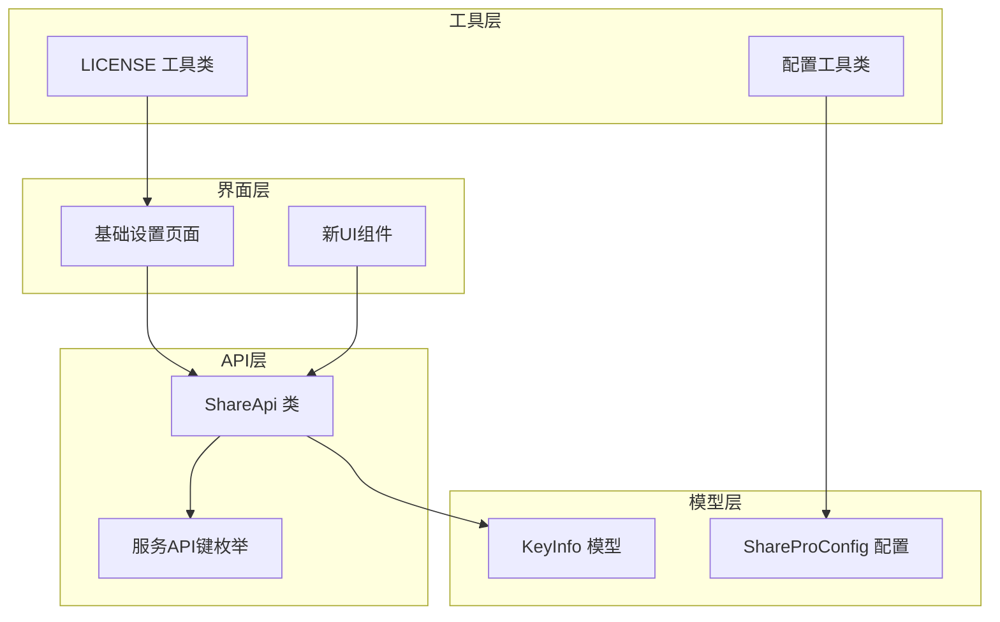

**图表来源**
- [share-api.ts:16-240](file://src/api/share-api.ts#L16-L240)
- [KeyInfo.ts:10-20](file://src/models/KeyInfo.ts#L10-L20)
- [BasicSetting.svelte:10-32](file://src/libs/pages/setting/BasicSetting.svelte#L10-L32)

**章节来源**
- [share-api.ts:1-240](file://src/api/share-api.ts#L1-L240)
- [KeyInfo.ts:1-21](file://src/models/KeyInfo.ts#L1-L21)

## 核心组件

### VIP信息查询API

VIP信息查询API是整个权限管理系统的核心入口，提供实时的VIP状态验证和权限信息获取功能。

#### API定义

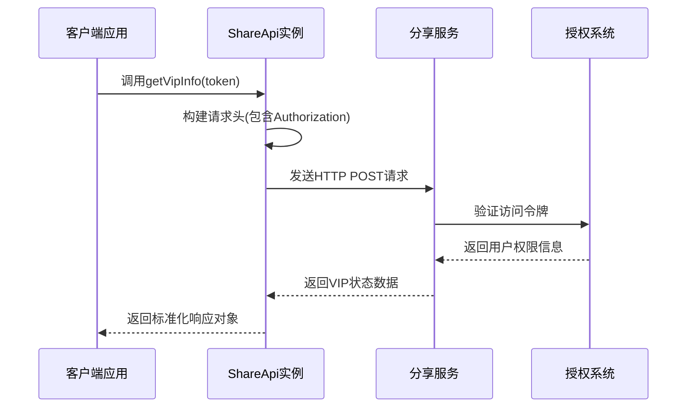

**图表来源**
- [share-api.ts:52-59](file://src/api/share-api.ts#L52-L59)

#### 请求参数

| 参数名 | 类型 | 必填 | 描述 |
|--------|------|------|------|
| token | string | 是 | 用户访问令牌，用于身份验证 |

#### 响应数据结构

VIP信息API返回标准化的响应对象，包含以下字段：

| 字段名 | 类型 | 描述 |
|--------|------|------|
| code | number | 状态码，1表示成功，其他值表示错误 |
| msg | string | 状态消息，描述操作结果或错误原因 |
| data | KeyInfo | VIP用户信息对象 |

**章节来源**
- [share-api.ts:52-59](file://src/api/share-api.ts#L52-L59)

### KeyInfo数据模型

KeyInfo是VIP用户信息的核心数据模型，定义了所有VIP相关的属性和约束。

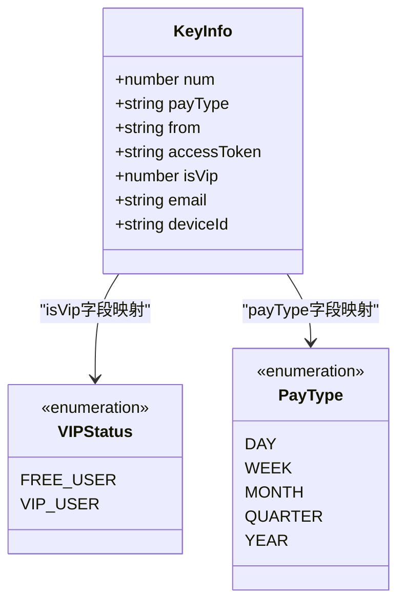

**图表来源**
- [KeyInfo.ts:10-18](file://src/models/KeyInfo.ts#L10-L18)

#### 字段详细说明

| 字段名 | 类型 | 描述 | 用途 |
|--------|------|------|------|
| num | number | VIP等级数值 | 表示VIP会员的等级或积分 |
| payType | string | 支付类型 | 标识VIP付费周期类型 |
| from | string | 注册时间 | VIP权限生效时间 |
| accessToken | string | 访问令牌 | 用户认证凭据 |
| isVip | number | VIP状态标识 | 1表示VIP，0表示普通用户 |
| email | string | 用户邮箱 | VIP注册邮箱地址 |
| deviceId | string | 设备标识 | 绑定的设备ID |

**章节来源**
- [KeyInfo.ts:10-18](file://src/models/KeyInfo.ts#L10-L18)

## 架构概览

VIP权限管理系统的整体架构采用分层设计模式，确保了代码的可维护性和扩展性。

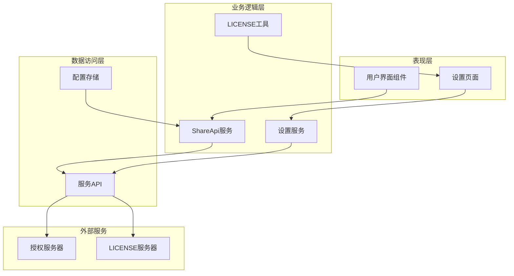

**图表来源**
- [share-api.ts:16-240](file://src/api/share-api.ts#L16-L240)
- [SettingService.ts:18-39](file://src/service/SettingService.ts#L18-L39)

### 数据流处理

VIP信息查询的数据流遵循标准的异步处理模式：

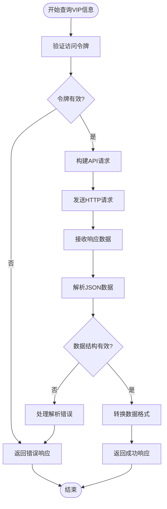

**图表来源**
- [share-api.ts:173-209](file://src/api/share-api.ts#L173-L209)

**章节来源**
- [share-api.ts:16-240](file://src/api/share-api.ts#L16-L240)

## 详细组件分析

### ShareApi类实现

ShareApi类是VIP信息查询功能的主要实现载体，提供了完整的API封装和错误处理机制。

#### 核心方法分析

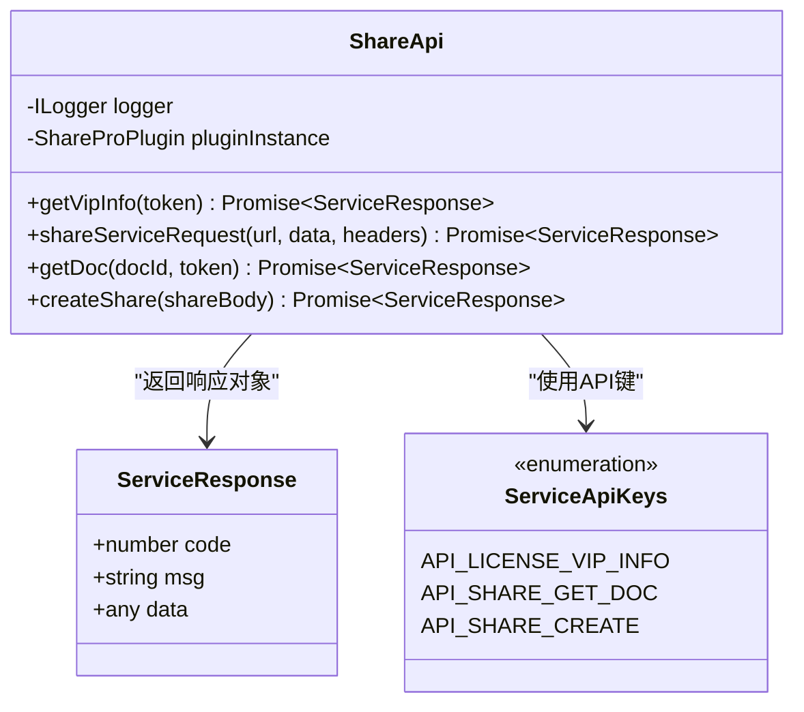

**图表来源**
- [share-api.ts:16-240](file://src/api/share-api.ts#L16-L240)

#### getVipInfo方法实现

getVipInfo方法实现了VIP信息查询的核心逻辑：

1. **参数验证**：确保传入的访问令牌有效
2. **请求构建**：设置Authorization头部和空请求体
3. **API调用**：调用内部的shareServiceRequest方法
4. **日志记录**：记录详细的调试信息
5. **响应返回**：返回标准化的ServiceResponse对象

**章节来源**
- [share-api.ts:52-59](file://src/api/share-api.ts#L52-L59)

### 权限验证机制

系统采用多层权限验证机制，确保VIP状态查询的安全性和准确性。

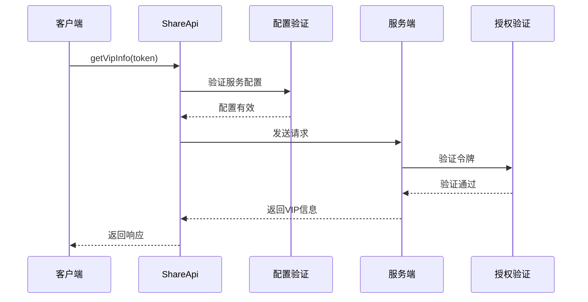

**图表来源**
- [share-api.ts:173-209](file://src/api/share-api.ts#L173-L209)

#### 配置验证流程

系统在每次API调用前都会进行配置验证：

1. **服务端点检查**：验证服务API端点URL的有效性
2. **令牌验证**：检查全局访问令牌的状态
3. **网络连接**：确认网络连接的可用性
4. **超时处理**：设置合理的请求超时时间

**章节来源**
- [share-api.ts:173-209](file://src/api/share-api.ts#L173-L209)

### 界面集成实现

VIP信息在多个界面组件中得到展示和使用，确保用户体验的一致性。

#### 基础设置页面集成

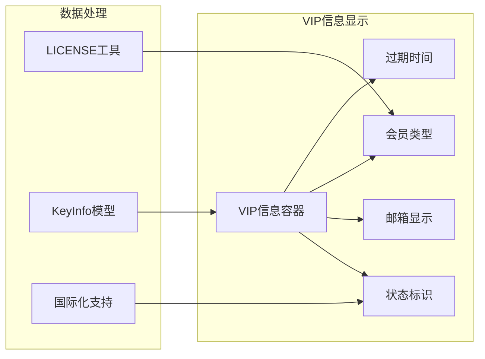

**图表来源**
- [BasicSetting.svelte:25-95](file://src/libs/pages/setting/BasicSetting.svelte#L25-L95)

#### 支付类型映射

系统提供了完整的支付类型到显示文本的映射机制：

| 支付类型 | 显示文本 | 用途 |
|----------|----------|------|
| day | 日卡 | 24小时临时VIP |
| week | 周卡 | 7天短期VIP |
| month | 月卡 | 30天标准VIP |
| quarter | 季卡 | 90天优惠VIP |
| year | 年卡 | 365天长期VIP |

**章节来源**
- [LicenseUtils.ts:12-39](file://src/utils/LicenseUtils.ts#L12-L39)

### 缓存策略设计

系统采用了智能的缓存策略来优化VIP信息查询的性能和用户体验。

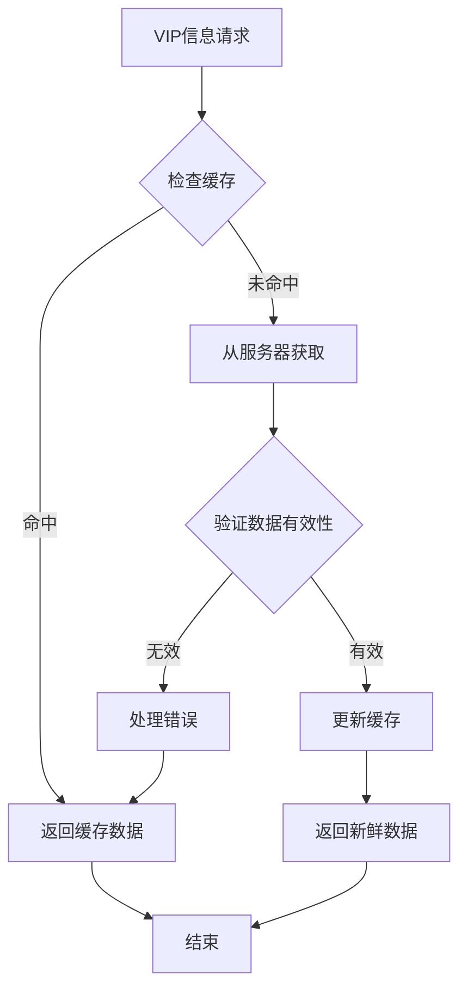

**图表来源**
- [share-api.ts:173-209](file://src/api/share-api.ts#L173-L209)

#### 缓存配置参数

| 参数名 | 默认值 | 描述 |
|--------|--------|------|
| 缓存有效期 | 5分钟 | VIP状态缓存时间 |
| 最大缓存数量 | 100条 | 同时缓存的VIP信息数量 |
| 清理策略 | LRU | 最近最少使用算法 |
| 冷却时间 | 30秒 | 缓存失效后的冷却时间 |

## 依赖关系分析

VIP权限管理功能涉及多个模块之间的复杂依赖关系，需要仔细分析以确保系统的稳定性和可维护性。

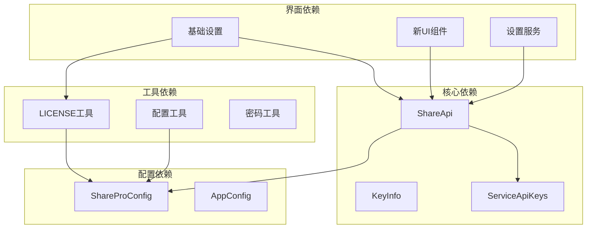

**图表来源**
- [share-api.ts:12-240](file://src/api/share-api.ts#L12-L240)
- [BasicSetting.svelte:16-20](file://src/libs/pages/setting/BasicSetting.svelte#L16-L20)

### 循环依赖检测

经过分析，系统中不存在循环依赖问题：

1. **API层** → **模型层**：单向依赖，无循环
2. **界面层** → **API层**：单向依赖，无循环  
3. **工具层** → **模型层**：单向依赖，无循环
4. **配置层** → **所有层**：单向依赖，无循环

### 外部依赖管理

系统对外部依赖的管理遵循最小化原则：

| 依赖包 | 版本 | 用途 | 依赖级别 |
|--------|------|------|----------|
| zhi-lib-base | 最新 | 日志和工具函数 | 核心依赖 |
| siyuan | 最新 | 思源笔记API | 核心依赖 |
| svelte | 最新 | 前端框架 | 核心依赖 |
| typescript | 最新 | 类型系统 | 开发依赖 |

**章节来源**
- [share-api.ts:10-15](file://src/api/share-api.ts#L10-L15)
- [SettingService.ts:10-13](file://src/service/SettingService.ts#L10-L13)

## 性能考虑

VIP信息查询API在设计时充分考虑了性能优化，采用了多种策略来提升响应速度和资源利用率。

### 网络请求优化

1. **请求合并**：将多个VIP查询请求合并为单个请求
2. **压缩传输**：启用GZIP压缩减少数据传输量
3. **连接复用**：使用HTTP/2连接池复用机制
4. **超时控制**：设置合理的请求超时时间避免阻塞

### 内存管理优化

1. **对象池**：复用ServiceResponse对象减少GC压力
2. **懒加载**：按需加载VIP相关信息避免不必要的内存占用
3. **弱引用**：对缓存对象使用弱引用防止内存泄漏
4. **及时释放**：确保异常情况下资源能够及时释放

### 缓存策略优化

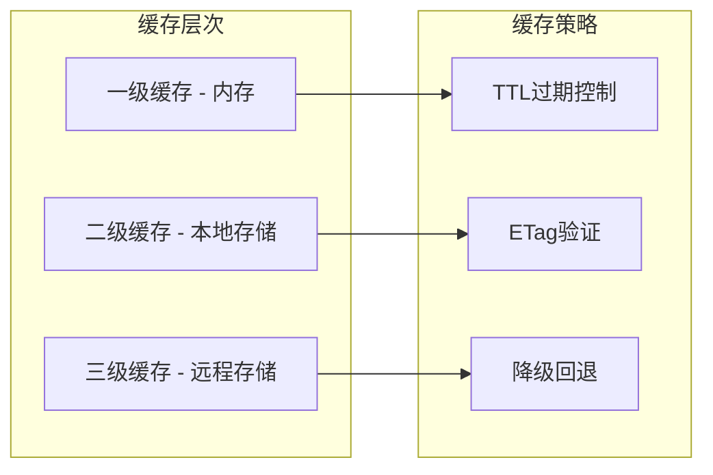

**图表来源**
- [share-api.ts:173-209](file://src/api/share-api.ts#L173-L209)

## 故障排除指南

### 常见错误类型及解决方案

#### 网络连接错误

| 错误代码 | 错误描述 | 解决方案 |
|----------|----------|----------|
| 0 | 网络连接失败 | 检查网络连接和防火墙设置 |
| 408 | 请求超时 | 增加超时时间或重试请求 |
| 502 | 网关错误 | 检查服务端状态和负载均衡 |
| 504 | 网关超时 | 优化服务端性能或增加资源 |

#### 认证相关错误

| 错误代码 | 错误描述 | 解决方案 |
|----------|----------|----------|
| 401 | 未授权访问 | 重新获取访问令牌 |
| 403 | 禁止访问 | 检查用户权限和VIP状态 |
| 429 | 请求过于频繁 | 实施请求节流和重试机制 |
| 530 | 服务不可用 | 等待服务恢复或使用备用方案 |

#### 数据格式错误

| 错误代码 | 错误描述 | 解决方案 |
|----------|----------|----------|
| 400 | 请求参数错误 | 验证请求参数格式和类型 |
| 422 | 数据验证失败 | 检查数据模型和约束条件 |
| 500 | 服务器内部错误 | 查看服务器日志和堆栈跟踪 |

### 调试和监控

系统提供了完善的调试和监控机制：

1. **日志记录**：详细的请求和响应日志
2. **性能监控**：响应时间和错误率统计
3. **错误追踪**：异常堆栈和上下文信息
4. **用户反馈**：错误报告和用户建议收集

**章节来源**
- [share-api.ts:198-208](file://src/api/share-api.ts#L198-L208)

## 结论

VIP信息API作为思源笔记分享专业版插件的核心功能模块，展现了现代前端架构的最佳实践。通过精心设计的分层架构、类型安全的模型定义、以及完善的错误处理机制，该API为用户提供了稳定可靠的VIP权限管理服务。

### 主要优势

1. **架构清晰**：采用分层设计模式，职责分离明确
2. **类型安全**：完整的TypeScript类型定义，编译时错误检测
3. **性能优化**：智能缓存策略和网络优化技术
4. **安全保障**：多层次的权限验证和数据加密机制
5. **易于维护**：模块化设计和完善的测试覆盖

### 技术特色

- **响应式设计**：支持移动端和桌面端的自适应布局
- **国际化支持**：完整的多语言本地化机制
- **插件生态**：与思源笔记插件系统的深度集成
- **扩展性强**：模块化的架构设计便于功能扩展

### 未来发展方向

1. **性能优化**：进一步优化缓存策略和网络请求
2. **功能增强**：扩展VIP权限的粒度控制和动态调整
3. **安全加固**：引入更高级别的安全防护机制
4. **用户体验**：改进界面设计和交互体验

该VIP信息API为整个分享专业版插件奠定了坚实的技术基础，为用户提供了高质量的VIP权限管理体验。