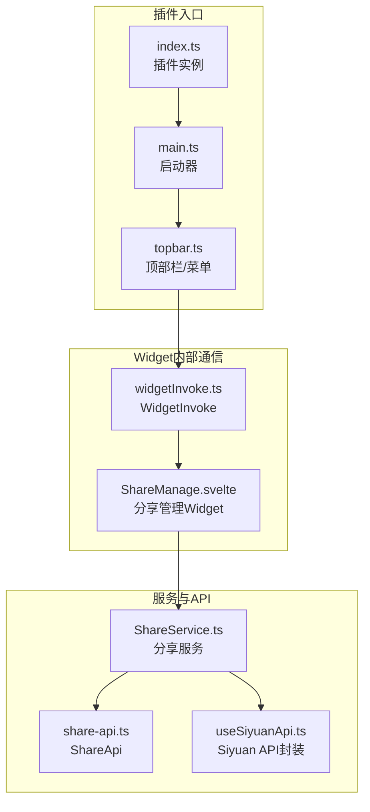
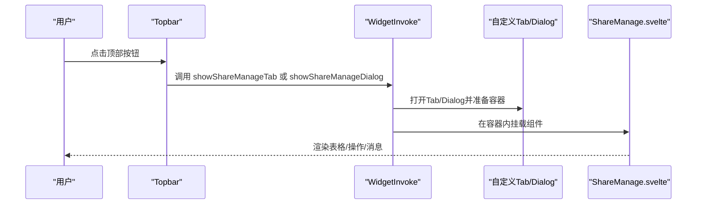
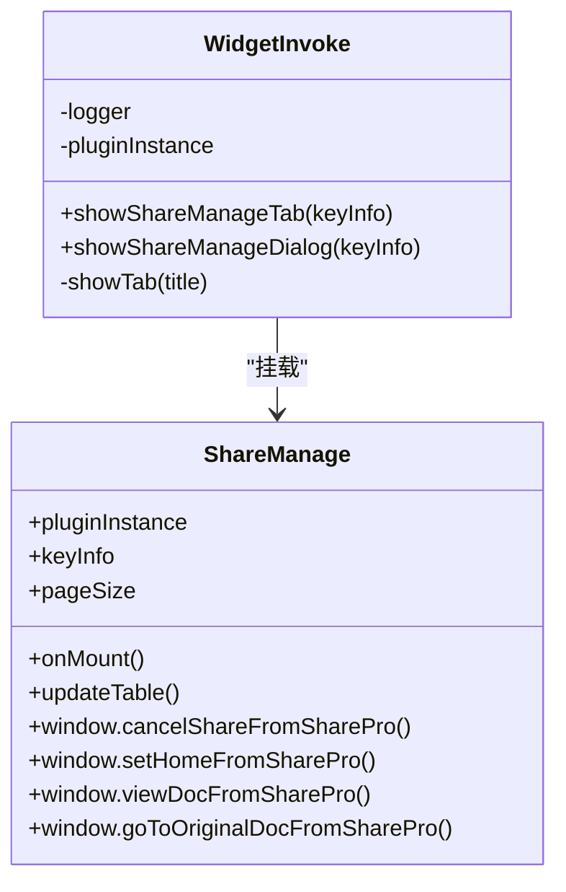
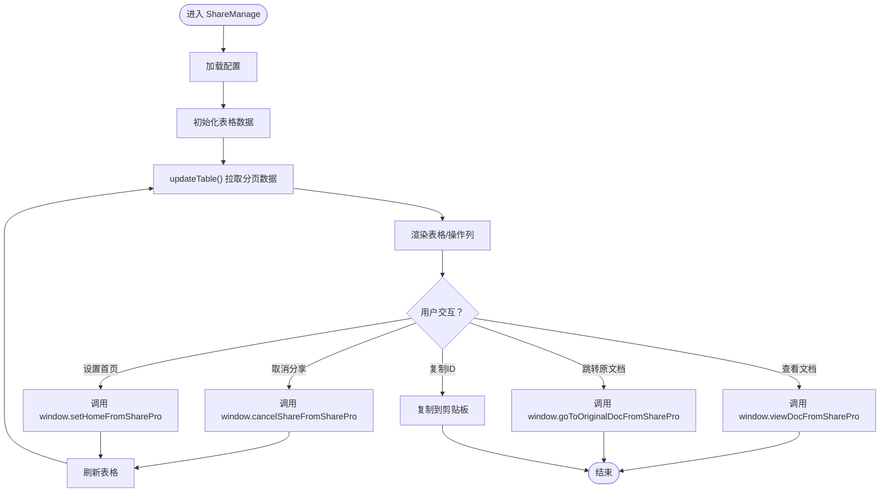
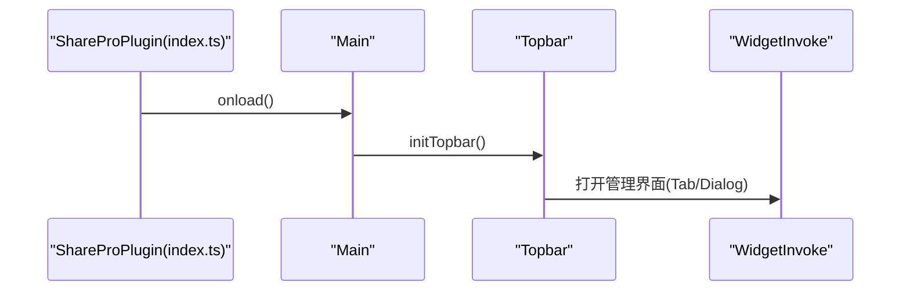
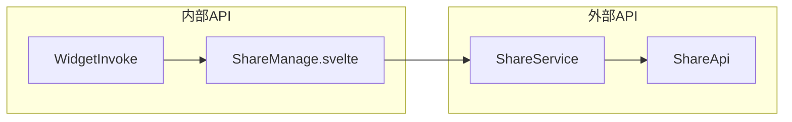
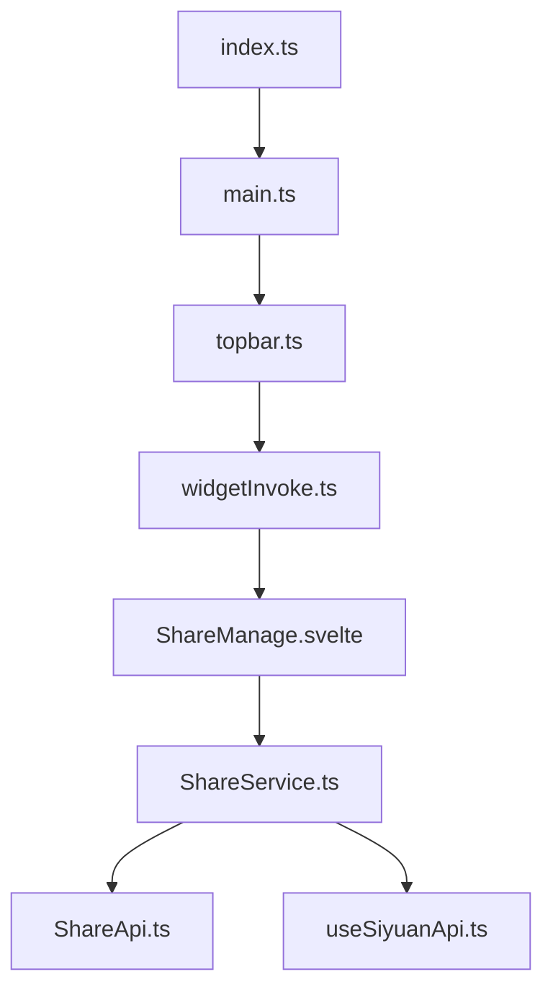

# Widget内部API

<cite>
**本文档引用的文件**
- [src/invoke/widgetInvoke.ts](file://src/invoke/widgetInvoke.ts)
- [src/libs/pages/ShareManage.svelte](file://src/libs/pages/ShareManage.svelte)
- [src/topbar.ts](file://src/topbar.ts)
- [src/index.ts](file://src/index.ts)
- [src/main.ts](file://src/main.ts)
- [src/api/share-api.ts](file://src/api/share-api.ts)
- [src/service/ShareService.ts](file://src/service/ShareService.ts)
- [src/composables/useSiyuanApi.ts](file://src/composables/useSiyuanApi.ts)
- [src/Constants.ts](file://src/Constants.ts)
- [src/types/service-api.d.ts](file://src/types/service-api.d.ts)
- [src/types/service-dto.d.ts](file://src/types/service-dto.d.ts)
- [src/models/KeyInfo.ts](file://src/models/KeyInfo.ts)
- [src/utils/message/OperationContext.ts](file://src/utils/message/OperationContext.ts)
- [src/utils/ApiUtils.ts](file://src/utils/ApiUtils.ts)
</cite>

## 目录
1. [简介](#简介)
2. [项目结构](#项目结构)
3. [核心组件](#核心组件)
4. [架构总览](#架构总览)
5. [详细组件分析](#详细组件分析)
6. [依赖关系分析](#依赖关系分析)
7. [性能考量](#性能考量)
8. [故障排查指南](#故障排查指南)
9. [结论](#结论)
10. [附录](#附录)

## 简介
本文件聚焦于插件内的Widget内部通信机制，系统性梳理并记录WidgetInvoke内部API的调用方式、参数规范、消息传递与事件类型、数据格式、安全验证与权限控制、生命周期管理与状态同步、错误处理与异常恢复，以及与外部API的区别与使用场景。目标是帮助开发者快速理解并正确使用插件内的Widget内部通信能力。

## 项目结构
围绕Widget内部通信的关键模块与文件如下：
- WidgetInvoke：负责在插件内打开Tab或Dialog，并挂载Svelte组件（如分享管理界面）。
- ShareManage.svelte：作为Widget承载的Svelte页面，负责展示与交互。
- Topbar/Main/Index：插件入口与UI入口，协调调用WidgetInvoke。
- ShareService/ShareApi：对外部服务的封装，承担数据拉取与业务逻辑。
- useSiyuanApi：对思源内核API的封装，提供文档树、子文档、增量分享等查询能力。
- 类型与模型：KeyInfo、ServiceResponse、DTO等，定义数据契约。
- 常量与工具：Constants、ApiUtils、OperationContext等，支撑运行时行为。

**图表来源**
- [src/index.ts:33-67](file://src/index.ts#L33-L67)
- [src/main.ts:12-31](file://src/main.ts#L12-L31)
- [src/topbar.ts:26-98](file://src/topbar.ts#L26-L98)
- [src/invoke/widgetInvoke.ts:17-77](file://src/invoke/widgetInvoke.ts#L17-L77)
- [src/libs/pages/ShareManage.svelte:1-40](file://src/libs/pages/ShareManage.svelte#L1-L40)
- [src/service/ShareService.ts:40-56](file://src/service/ShareService.ts#L40-L56)
- [src/api/share-api.ts:16-23](file://src/api/share-api.ts#L16-L23)
- [src/composables/useSiyuanApi.ts:24-54](file://src/composables/useSiyuanApi.ts#L24-L54)

**章节来源**
- [src/index.ts:33-67](file://src/index.ts#L33-L67)
- [src/main.ts:12-31](file://src/main.ts#L12-L31)
- [src/topbar.ts:26-98](file://src/topbar.ts#L26-L98)
- [src/invoke/widgetInvoke.ts:17-77](file://src/invoke/widgetInvoke.ts#L17-L77)
- [src/libs/pages/ShareManage.svelte:1-40](file://src/libs/pages/ShareManage.svelte#L1-L40)
- [src/service/ShareService.ts:40-56](file://src/service/ShareService.ts#L40-L56)
- [src/api/share-api.ts:16-23](file://src/api/share-api.ts#L16-L23)
- [src/composables/useSiyuanApi.ts:24-54](file://src/composables/useSiyuanApi.ts#L24-L54)

## 核心组件
- WidgetInvoke：提供在插件内打开自定义Tab或弹窗（Dialog）的能力，并在容器内挂载Svelte组件。关键方法：
  - showShareManageTab(keyInfo)：打开自定义Tab并挂载分享管理组件。
  - showShareManageDialog(keyInfo)：打开Dialog并挂载分享管理组件。
- ShareManage.svelte：作为Widget页面，负责渲染表格、分页、操作按钮、消息提示等；通过window上的函数桥接与外部交互（如取消分享、设置首页、查看文档、跳转原文档、复制ID等）。
- Topbar/Main/Index：插件入口，Topbar在点击顶部按钮时调用WidgetInvoke打开管理界面；Main负责启动UI；Index负责插件生命周期与配置加载。
- ShareService/ShareApi：封装对外服务的HTTP请求，提供文档查询、列表、取消分享、更新选项等；内部通过ServiceResponse统一响应结构。
- useSiyuanApi：封装Siyuan内核API，提供文档树、子文档、增量分享查询等能力。
- 类型与模型：KeyInfo、ServiceResponse、PageDTO/PageResponseDTO、DocDTO等，定义数据契约与分页结构。

**章节来源**
- [src/invoke/widgetInvoke.ts:26-76](file://src/invoke/widgetInvoke.ts#L26-L76)
- [src/libs/pages/ShareManage.svelte:24-351](file://src/libs/pages/ShareManage.svelte#L24-L351)
- [src/topbar.ts:34-39](file://src/topbar.ts#L34-L39)
- [src/main.ts:16-30](file://src/main.ts#L16-L30)
- [src/index.ts:42-59](file://src/index.ts#L42-L59)
- [src/service/ShareService.ts:543-552](file://src/service/ShareService.ts#L543-L552)
- [src/api/share-api.ts:166-209](file://src/api/share-api.ts#L166-L209)
- [src/composables/useSiyuanApi.ts:24-54](file://src/composables/useSiyuanApi.ts#L24-L54)
- [src/types/service-api.d.ts:13-16](file://src/types/service-api.d.ts#L13-L16)
- [src/types/service-dto.d.ts:13-73](file://src/types/service-dto.d.ts#L13-L73)
- [src/types/service-dto.d.ts:98-133](file://src/types/service-dto.d.ts#L98-L133)
- [src/models/KeyInfo.ts:10-20](file://src/models/KeyInfo.ts#L10-L20)

## 架构总览
Widget内部通信采用“插件入口 → Topbar/菜单 → WidgetInvoke → Svelte Widget”的链路。WidgetInvoke负责在当前应用上下文中打开Tab或Dialog，并将Svelte组件挂载到指定容器，从而实现插件内UI的局部刷新与交互。

**图表来源**
- [src/topbar.ts:51-76](file://src/topbar.ts#L51-L76)
- [src/invoke/widgetInvoke.ts:26-76](file://src/invoke/widgetInvoke.ts#L26-L76)
- [src/libs/pages/ShareManage.svelte:346-351](file://src/libs/pages/ShareManage.svelte#L346-L351)

## 详细组件分析

### WidgetInvoke内部API
- 职责
  - 在插件内打开自定义Tab或弹窗（Dialog），并挂载Svelte组件。
  - 通过容器清理与重新挂载实现组件的“热更新”体验。
- 方法
  - showShareManageTab(keyInfo)：打开自定义Tab，准备容器，挂载ShareManage组件。
  - showShareManageDialog(keyInfo)：打开Dialog，等待DOM更新后在容器内挂载ShareManage组件。
- 参数
  - keyInfo：KeyInfo对象，用于向组件传递鉴权/用户信息。
- 生命周期
  - 打开Tab/Dialog后，由Svelte组件接管渲染与交互；WidgetInvoke不持有状态。
- 事件与消息
  - 通过window上的函数桥接（如取消分享、设置首页、查看文档等）触发业务逻辑。
- 安全与权限
  - 通过插件实例访问应用上下文；组件内业务逻辑（如取消分享、查看文档）由ShareService/ShareApi执行，遵循服务端鉴权与权限策略。

**图表来源**
- [src/invoke/widgetInvoke.ts:17-77](file://src/invoke/widgetInvoke.ts#L17-L77)
- [src/libs/pages/ShareManage.svelte:24-351](file://src/libs/pages/ShareManage.svelte#L24-L351)

**章节来源**
- [src/invoke/widgetInvoke.ts:17-77](file://src/invoke/widgetInvoke.ts#L17-L77)
- [src/libs/pages/ShareManage.svelte:24-351](file://src/libs/pages/ShareManage.svelte#L24-L351)

### ShareManage.svelte：Widget页面与事件桥接
- 页面职责
  - 渲染分享文档列表（标题、创建时间、媒体数量、状态、操作列）。
  - 支持分页、排序、搜索、加载指示器。
  - 通过window函数桥接与外部交互。
- 关键交互
  - 取消分享：window.cancelShareFromSharePro(docId, title)
  - 设置首页：window.setHomeFromSharePro(docId, title, isSet)
  - 查看文档：window.viewDocFromSharePro(docId, title)
  - 跳转原文档：window.goToOriginalDocFromSharePro(docId)
  - 复制文档ID：复制到剪贴板
- 数据来源
  - 通过shareService.listDoc获取分页数据，映射为表格数据。
  - 通过shareService.getSharedDocInfo获取分享详情，解析viewUrl。
- 状态同步
  - onMount加载配置并初始化数据；$: 依赖变化时自动刷新updateTable。
- 错误处理
  - 请求失败时显示错误消息；复制失败时提示错误。

**图表来源**
- [src/libs/pages/ShareManage.svelte:346-351](file://src/libs/pages/ShareManage.svelte#L346-L351)
- [src/libs/pages/ShareManage.svelte:250-287](file://src/libs/pages/ShareManage.svelte#L250-L287)
- [src/libs/pages/ShareManage.svelte:289-300](file://src/libs/pages/ShareManage.svelte#L289-L300)
- [src/libs/pages/ShareManage.svelte:302-322](file://src/libs/pages/ShareManage.svelte#L302-L322)
- [src/libs/pages/ShareManage.svelte:324-344](file://src/libs/pages/ShareManage.svelte#L324-L344)

**章节来源**
- [src/libs/pages/ShareManage.svelte:24-351](file://src/libs/pages/ShareManage.svelte#L24-L351)

### 插件入口与UI入口
- Index：插件实例，负责加载默认配置、安全加载配置、暴露服务实例。
- Main：启动器，初始化Topbar。
- Topbar：顶部按钮与菜单，调用WidgetInvoke打开管理界面；支持增量分享UI、设置页等。

**图表来源**
- [src/index.ts:61-67](file://src/index.ts#L61-L67)
- [src/main.ts:21-23](file://src/main.ts#L21-L23)
- [src/topbar.ts:41-98](file://src/topbar.ts#L41-L98)

**章节来源**
- [src/index.ts:33-67](file://src/index.ts#L33-L67)
- [src/main.ts:12-31](file://src/main.ts#L12-L31)
- [src/topbar.ts:26-98](file://src/topbar.ts#L26-L98)

### 外部API与内部API的区别与使用场景
- 外部API（ShareApi/ShareService）
  - 通过HTTP请求与分享服务交互，提供文档查询、列表、取消分享、更新选项、媒体上传等功能。
  - 使用ServiceResponse统一响应结构，包含code/msg/data。
  - 适用于与服务端的数据交换与业务编排。
- 内部API（WidgetInvoke/ShareManage）
  - 通过插件内UI（Tab/Dialog）与Svelte组件交互，负责展示与用户操作。
  - 通过window函数桥接与业务服务交互，不直接处理外部HTTP请求。
  - 适用于插件内的UI呈现与用户交互。

**图表来源**
- [src/invoke/widgetInvoke.ts:17-77](file://src/invoke/widgetInvoke.ts#L17-L77)
- [src/libs/pages/ShareManage.svelte:27-27](file://src/libs/pages/ShareManage.svelte#L27-L27)
- [src/service/ShareService.ts:40-56](file://src/service/ShareService.ts#L40-L56)
- [src/api/share-api.ts:16-23](file://src/api/share-api.ts#L16-L23)

**章节来源**
- [src/service/ShareService.ts:543-552](file://src/service/ShareService.ts#L543-L552)
- [src/api/share-api.ts:166-209](file://src/api/share-api.ts#L166-L209)
- [src/invoke/widgetInvoke.ts:26-76](file://src/invoke/widgetInvoke.ts#L26-L76)
- [src/libs/pages/ShareManage.svelte:24-351](file://src/libs/pages/ShareManage.svelte#L24-L351)

## 依赖关系分析
- 耦合与内聚
  - WidgetInvoke与ShareManage高度内聚，通过容器挂载实现松耦合。
  - Topbar依赖WidgetInvoke，Topbar与Main/Index形成清晰的启动链路。
  - ShareService依赖ShareApi与useSiyuanApi，形成服务层与数据层分离。
- 外部依赖
  - Siyuan内核API（SiyuanKernelApi/SiYuanApiAdaptor）。
  - 分享服务HTTP接口（ServiceApiKeys枚举）。
- 潜在循环依赖
  - 未发现直接循环依赖；各模块职责清晰，通过实例注入解耦。

**图表来源**
- [src/topbar.ts:34-39](file://src/topbar.ts#L34-L39)
- [src/invoke/widgetInvoke.ts:17-24](file://src/invoke/widgetInvoke.ts#L17-L24)
- [src/libs/pages/ShareManage.svelte:27-27](file://src/libs/pages/ShareManage.svelte#L27-L27)
- [src/service/ShareService.ts:40-56](file://src/service/ShareService.ts#L40-L56)
- [src/api/share-api.ts:16-23](file://src/api/share-api.ts#L16-L23)
- [src/composables/useSiyuanApi.ts:24-54](file://src/composables/useSiyuanApi.ts#L24-L54)
- [src/index.ts:42-59](file://src/index.ts#L42-L59)
- [src/main.ts:16-19](file://src/main.ts#L16-L19)

**章节来源**
- [src/topbar.ts:34-39](file://src/topbar.ts#L34-L39)
- [src/invoke/widgetInvoke.ts:17-24](file://src/invoke/widgetInvoke.ts#L17-L24)
- [src/libs/pages/ShareManage.svelte:27-27](file://src/libs/pages/ShareManage.svelte#L27-L27)
- [src/service/ShareService.ts:40-56](file://src/service/ShareService.ts#L40-L56)
- [src/api/share-api.ts:16-23](file://src/api/share-api.ts#L16-L23)
- [src/composables/useSiyuanApi.ts:24-54](file://src/composables/useSiyuanApi.ts#L24-L54)
- [src/index.ts:42-59](file://src/index.ts#L42-L59)
- [src/main.ts:16-19](file://src/main.ts#L16-L19)

## 性能考量
- 组件挂载策略
  - 通过清空容器后重新挂载Svelte组件，避免重复实例导致的状态混乱。
- 分页与查询
  - ShareManage使用分页参数pageNum/pageSize/order/direction/search，减少一次性加载数据量。
- 增量分享查询
  - useSiyuanApi提供分页查询增量文档与总数，SQL条件组合考虑时间戳、黑名单、笔记本黑名单与搜索词，避免全量扫描。
- 并发与批量
  - ShareService在多文档场景使用并发控制与批量处理，结合进度管理提升吞吐。

**章节来源**
- [src/libs/pages/ShareManage.svelte:250-287](file://src/libs/pages/ShareManage.svelte#L250-L287)
- [src/composables/useSiyuanApi.ts:66-152](file://src/composables/useSiyuanApi.ts#L66-L152)
- [src/composables/useSiyuanApi.ts:162-215](file://src/composables/useSiyuanApi.ts#L162-L215)
- [src/service/ShareService.ts:442-475](file://src/service/ShareService.ts#L442-L475)

## 故障排查指南
- 配置加载失败
  - safeLoad默认回退到默认配置；若加载异常，检查存储键与JSON格式。
- 分享服务端点为空
  - shareServiceRequest会提示“未找到分享服务”，需先初始化服务端点。
- 权限与鉴权
  - 外部API通过Authorization头传递Token；若VIP信息获取失败，需检查Token有效性。
- UI交互异常
  - 确认容器ID正确（如ShareManage的对话框容器ID）；确保DOM更新后再挂载组件。
- 错误消息与恢复
  - 使用showMessage显示错误/成功消息；批量操作通过OperationContext记录错误与警告，完成后统一提示。
- 调试建议
  - 开启isDev模式查看详细日志；检查Network面板与控制台错误；验证分页参数与SQL条件。

**章节来源**
- [src/index.ts:126-148](file://src/index.ts#L126-L148)
- [src/api/share-api.ts:177-209](file://src/api/share-api.ts#L177-L209)
- [src/invoke/widgetInvoke.ts:39-61](file://src/invoke/widgetInvoke.ts#L39-L61)
- [src/utils/message/OperationContext.ts:86-123](file://src/utils/message/OperationContext.ts#L86-L123)

## 结论
Widget内部通信通过WidgetInvoke与Svelte组件实现插件内的UI承载与交互，结合Topbar/Main/Index的启动链路，形成清晰的职责划分。对外部API的封装保证了数据契约与错误处理的一致性。通过合理的分页、并发与状态管理，既提升了用户体验，也增强了系统的稳定性与可维护性。

## 附录

### API定义与数据格式

- ServiceResponse
  - 字段：code（数字）、msg（字符串）、data（任意）
  - 用途：统一外部服务响应结构

- PageDTO/PageResponseDTO
  - PageDTO：pageNum、pageSize、search
  - PageResponseDTO：total、pageSize、pageNum、totalPages、data[]、order、direction、search

- DocDTO
  - 字段：docId（字符串）、author（字符串）、docDomain（可选）、data（DocDataDTO）、media（数组）、status（枚举）、createdAt（字符串）

- KeyInfo
  - 字段：num（数字）、payType（字符串）、from（字符串）、accessToken（字符串）、isVip（数字）、email（字符串）、deviceId（字符串）

**章节来源**
- [src/types/service-api.d.ts:13-16](file://src/types/service-api.d.ts#L13-L16)
- [src/types/service-dto.d.ts:13-73](file://src/types/service-dto.d.ts#L13-L73)
- [src/types/service-dto.d.ts:78-133](file://src/types/service-dto.d.ts#L78-L133)
- [src/models/KeyInfo.ts:10-20](file://src/models/KeyInfo.ts#L10-L20)

### 调用示例与调试方法
- 打开分享管理Tab
  - 步骤：Topbar点击 → WidgetInvoke.showShareManageTab(KeyInfo)
  - 容器：自定义Tab的panelElement
- 打开分享管理Dialog
  - 步骤：Topbar点击 → WidgetInvoke.showShareManageDialog(KeyInfo)
  - 容器：ShareManage对话框容器ID
- 列表刷新
  - ShareManage.updateTable() → ShareService.listDoc(pageNum, pageSize, order, direction, search)
- 调试
  - 开启isDev模式查看日志
  - 检查Network面板与控制台错误
  - 验证分页参数与SQL条件

**章节来源**
- [src/topbar.ts:224-226](file://src/topbar.ts#L224-L226)
- [src/invoke/widgetInvoke.ts:26-76](file://src/invoke/widgetInvoke.ts#L26-L76)
- [src/libs/pages/ShareManage.svelte:250-287](file://src/libs/pages/ShareManage.svelte#L250-L287)
- [src/service/ShareService.ts:543-552](file://src/service/ShareService.ts#L543-L552)
- [src/Constants.ts:11](file://src/Constants.ts#L11)