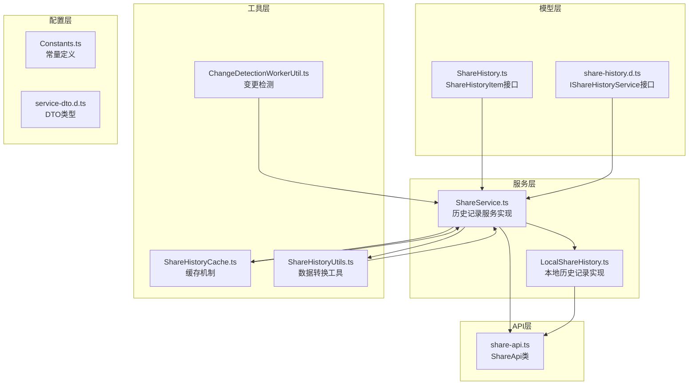
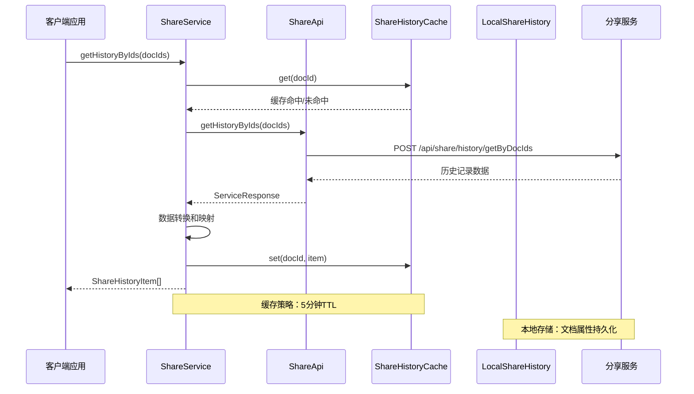
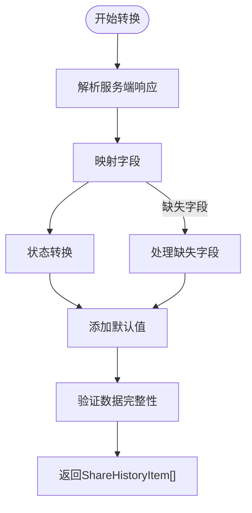
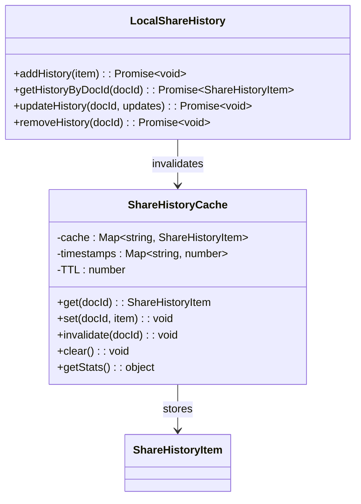
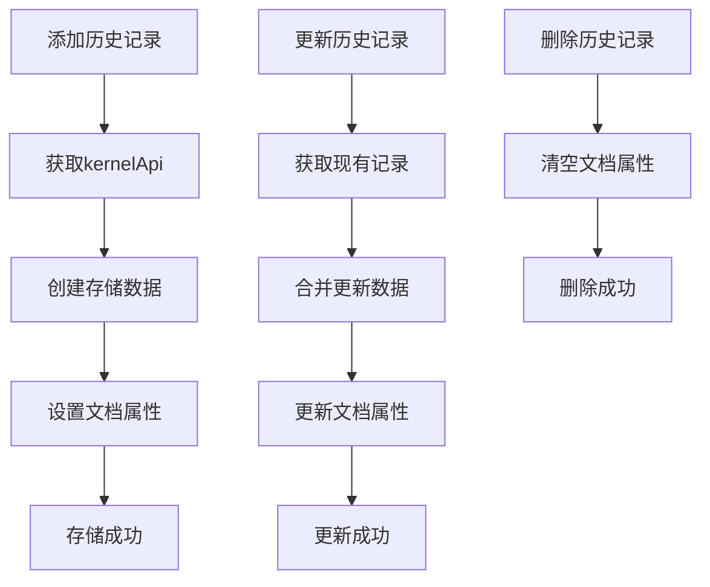
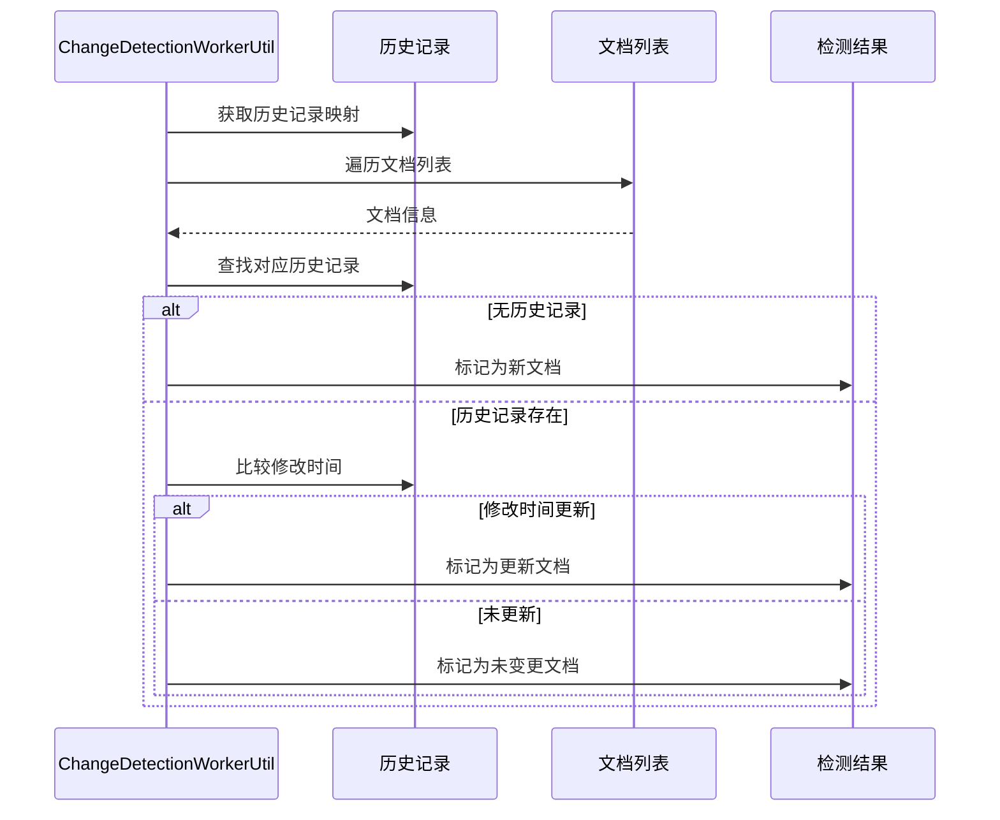
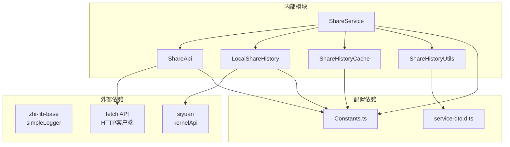
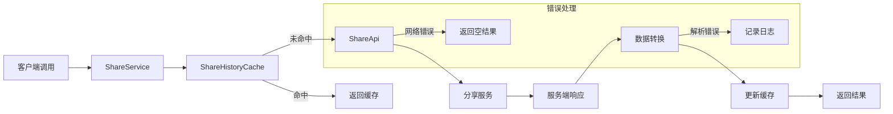

# 历史记录API

<cite>
**本文档引用的文件**
- [ShareHistory.ts](file://src/models/ShareHistory.ts)
- [share-history.d.ts](file://src/types/share-history.d.ts)
- [LocalShareHistory.ts](file://src/service/LocalShareHistory.ts)
- [ShareService.ts](file://src/service/ShareService.ts)
- [share-api.ts](file://src/api/share-api.ts)
- [ShareHistoryCache.ts](file://src/utils/ShareHistoryCache.ts)
- [ShareHistoryUtils.ts](file://src/utils/ShareHistoryUtils.ts)
- [ChangeDetectionWorkerUtil.ts](file://src/utils/ChangeDetectionWorkerUtil.ts)
- [incremental-share-context-2025-12-08.md](file://docs/incremental-share-context-2025-12-08.md)
- [spec.md](file://openspec/changes/archive/add-incremental-sharing/specs/share/spec.md)
- [Constants.ts](file://src/Constants.ts)
- [service-dto.d.ts](file://src/types/service-dto.d.ts)
</cite>

## 目录
1. [简介](#简介)
2. [项目结构](#项目结构)
3. [核心组件](#核心组件)
4. [架构概览](#架构概览)
5. [详细组件分析](#详细组件分析)
6. [依赖分析](#依赖分析)
7. [性能考虑](#性能考虑)
8. [故障排除指南](#故障排除指南)
9. [结论](#结论)
10. [附录](#附录)

## 简介
本文档详细描述了历史记录功能的API规范，重点涵盖 `getHistoryByIds` 历史记录查询API。该功能允许用户批量查询文档的分享历史记录，支持时间范围过滤、状态筛选和排序选项，并提供统计分析和聚合查询能力。

历史记录系统采用多层架构设计，包括本地存储、缓存机制和服务端API集成，确保高性能和数据一致性。系统支持增量分享功能，能够智能检测文档变更并更新历史记录状态。

## 项目结构
历史记录相关的代码分布在以下关键目录中：



**图表来源**
- [ShareHistory.ts:1-74](file://src/models/ShareHistory.ts#L1-L74)
- [share-history.d.ts:50-58](file://src/types/share-history.d.ts#L50-L58)
- [ShareService.ts:40-56](file://src/service/ShareService.ts#L40-L56)
- [LocalShareHistory.ts:23-128](file://src/service/LocalShareHistory.ts#L23-L128)

**章节来源**
- [ShareHistory.ts:1-74](file://src/models/ShareHistory.ts#L1-L74)
- [share-history.d.ts:1-59](file://src/types/share-history.d.ts#L1-L59)
- [ShareService.ts:1-1251](file://src/service/ShareService.ts#L1-L1251)

## 核心组件
历史记录系统由以下核心组件构成：

### 数据模型
历史记录采用统一的数据结构，包含文档标识、状态信息和元数据：

- **ShareHistoryItem**: 标准历史记录项，包含文档ID、标题、时间戳、状态等
- **IShareHistoryService**: 历史记录服务接口，定义查询方法
- **PageDTO/PageResponseDTO**: 分页查询支持

### 存储策略
系统采用混合存储策略：
- **本地存储**: 使用思源笔记文档属性存储历史记录
- **缓存机制**: 内存级别缓存减少重复查询
- **服务端同步**: 与分享服务保持数据一致性

### 查询机制
支持多种查询方式：
- **批量查询**: 通过 `getHistoryByIds` 方法批量获取历史记录
- **单个查询**: 通过 `getHistoryByDocId` 方法获取单个文档历史
- **条件过滤**: 支持状态筛选、时间范围过滤

**章节来源**
- [ShareHistory.ts:13-48](file://src/models/ShareHistory.ts#L13-L48)
- [share-history.d.ts:53-58](file://src/types/share-history.d.ts#L53-L58)
- [service-dto.d.ts:13-73](file://src/types/service-dto.d.ts#L13-L73)

## 架构概览
历史记录API的整体架构采用分层设计，确保功能模块的清晰分离和高内聚低耦合。



**图表来源**
- [ShareService.ts:554-574](file://src/service/ShareService.ts#L554-L574)
- [share-api.ts:156-160](file://src/api/share-api.ts#L156-L160)
- [ShareHistoryCache.ts:19-90](file://src/utils/ShareHistoryCache.ts#L19-L90)

**章节来源**
- [ShareService.ts:554-574](file://src/service/ShareService.ts#L554-L574)
- [share-api.ts:156-160](file://src/api/share-api.ts#L156-L160)

## 详细组件分析

### getHistoryByIds API 规范

#### 接口定义
```typescript
public async getHistoryByIds(docIds: string[]): Promise<Array<ShareHistoryItem> | undefined>
```

#### 请求参数
- **docIds** (string[]): 必需，文档ID数组，支持批量查询
- **限制**: 单次查询最多支持100个文档ID

#### 响应数据结构
历史记录项包含以下字段：

| 字段名 | 类型 | 必需 | 描述 |
|--------|------|------|------|
| docId | string | 是 | 文档唯一标识符 |
| docTitle | string | 是 | 文档标题 |
| shareTime | number | 是 | 分享时间戳（毫秒） |
| shareStatus | "success" \| "failed" \| "pending" | 是 | 分享状态 |
| shareUrl | string | 否 | 分享链接（成功时提供） |
| errorMessage | string | 否 | 错误信息（失败时提供） |
| docModifiedTime | number | 是 | 文档修改时间戳 |

#### 状态枚举说明
- **success**: 分享成功
- **failed**: 分享失败
- **pending**: 处理中或未分享

#### 错误处理
- **网络错误**: 返回标准ServiceResponse格式
- **解析错误**: 记录日志并返回空结果
- **权限错误**: 通过服务端认证机制处理

**章节来源**
- [share-history.d.ts:57](file://src/types/share-history.d.ts#L57)
- [ShareService.ts:554-574](file://src/service/ShareService.ts#L554-L574)

### 数据转换机制

#### 服务端到客户端的转换


**图表来源**
- [ShareService.ts:557-571](file://src/service/ShareService.ts#L557-L571)

#### 时间戳处理
- **shareTime**: 使用服务端提供的创建时间戳
- **docModifiedTime**: 使用文档更新时间戳
- **时间格式**: 统一为毫秒级时间戳

**章节来源**
- [ShareService.ts:557-571](file://src/service/ShareService.ts#L557-L571)

### 缓存机制

#### 缓存策略


**图表来源**
- [ShareHistoryCache.ts:19-90](file://src/utils/ShareHistoryCache.ts#L19-L90)
- [LocalShareHistory.ts:23-128](file://src/service/LocalShareHistory.ts#L23-L128)

#### 缓存特性
- **TTL**: 5分钟自动过期
- **内存存储**: 使用Map数据结构
- **LRU行为**: 基于时间戳的简单淘汰机制
- **线程安全**: 单例模式确保全局一致性

**章节来源**
- [ShareHistoryCache.ts:19-90](file://src/utils/ShareHistoryCache.ts#L19-L90)

### 本地存储实现

#### 存储策略
历史记录采用以下存储策略：



**图表来源**
- [LocalShareHistory.ts:31-127](file://src/service/LocalShareHistory.ts#L31-L127)

#### 属性存储
- **属性名称**: `custom-share-history`
- **数据格式**: JSON字符串序列化
- **版本控制**: `_version` 和 `_updatedAt` 字段
- **兼容性**: 支持版本升级和向后兼容

**章节来源**
- [LocalShareHistory.ts:31-127](file://src/service/LocalShareHistory.ts#L31-L127)

### 增量分享集成

#### 变更检测机制


**图表来源**
- [ChangeDetectionWorkerUtil.ts:108-147](file://src/utils/ChangeDetectionWorkerUtil.ts#L108-L147)

#### 状态更新流程
- **新增文档**: 标记为 `pending` 状态
- **更新文档**: 更新状态为 `pending` 并刷新修改时间
- **未变更文档**: 保持原有状态

**章节来源**
- [ChangeDetectionWorkerUtil.ts:108-147](file://src/utils/ChangeDetectionWorkerUtil.ts#L108-L147)

## 依赖分析

### 组件依赖关系



**图表来源**
- [ShareService.ts:24-32](file://src/service/ShareService.ts#L24-L32)
- [share-api.ts:10-14](file://src/api/share-api.ts#L10-L14)
- [LocalShareHistory.ts:10-15](file://src/service/LocalShareHistory.ts#L10-L15)

### 数据流分析

#### 查询流程


**图表来源**
- [ShareService.ts:554-574](file://src/service/ShareService.ts#L554-L574)
- [ShareHistoryCache.ts:31-44](file://src/utils/ShareHistoryCache.ts#L31-L44)

**章节来源**
- [ShareService.ts:554-574](file://src/service/ShareService.ts#L554-L574)
- [ShareHistoryCache.ts:31-44](file://src/utils/ShareHistoryCache.ts#L31-L44)

## 性能考虑

### 缓存优化
- **TTL设置**: 5分钟平衡数据新鲜度和性能
- **批量查询**: 支持一次性查询多个文档的历史记录
- **内存管理**: 自动清理过期缓存，防止内存泄漏

### 网络优化
- **请求合并**: 批量查询减少网络往返次数
- **错误重试**: 网络异常时的自动重试机制
- **超时控制**: 合理的请求超时设置

### 存储优化
- **属性存储**: 使用文档属性避免额外数据库查询
- **JSON序列化**: 高效的数据序列化和反序列化
- **版本控制**: 支持数据格式升级和兼容性处理

## 故障排除指南

### 常见问题及解决方案

#### 缓存相关问题
- **症状**: 历史记录显示过期
- **原因**: 缓存TTL过期或缓存失效
- **解决**: 调用 `shareHistoryCache.invalidate(docId)` 清除特定缓存

#### 网络连接问题
- **症状**: 查询超时或返回空结果
- **原因**: 服务端不可达或网络异常
- **解决**: 检查服务端URL配置和网络连接

#### 数据格式问题
- **症状**: 历史记录解析失败
- **原因**: 服务端数据格式变化
- **解决**: 检查版本兼容性和数据转换逻辑

**章节来源**
- [ShareHistoryCache.ts:72-76](file://src/utils/ShareHistoryCache.ts#L72-L76)
- [LocalShareHistory.ts:123-127](file://src/service/LocalShareHistory.ts#L123-L127)

## 结论
历史记录API提供了完整的批量查询能力，支持高效的历史记录管理和分析。通过缓存机制和本地存储策略，系统实现了高性能和高可靠性的历史记录管理。

主要优势包括：
- **批量查询**: 支持一次性查询多个文档的历史记录
- **智能缓存**: 5分钟TTL确保数据新鲜度和性能平衡
- **状态管理**: 完整的状态跟踪和变更检测
- **扩展性**: 支持未来功能扩展和性能优化

## 附录

### API 使用示例

#### 基本查询示例
```typescript
// 批量查询历史记录
const docIds = ["doc1", "doc2", "doc3"];
const history = await shareService.getHistoryByIds(docIds);
console.log(history);
```

#### 错误处理示例
```typescript
try {
    const history = await shareService.getHistoryByIds(["doc1"]);
    if (history && history.length > 0) {
        // 处理历史记录
    }
} catch (error) {
    // 处理查询错误
    console.error("查询历史记录失败:", error);
}
```

### 配置选项
- **缓存TTL**: 5分钟（可通过 `ShareHistoryCache` 调整）
- **批量查询限制**: 最多100个文档ID
- **服务端URL**: 通过 `Constants.ts` 配置

### 相关文档
- 增量分享功能规范：参见 `docs/incremental-share-context-2025-12-08.md`
- 历史记录统计需求：参见 `openspec/changes/archive/add-incremental-sharing/specs/share/spec.md`