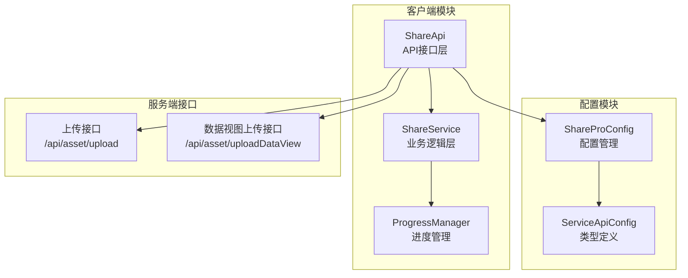
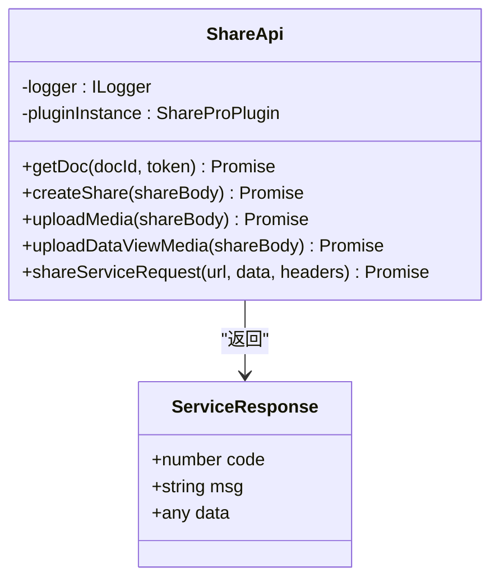
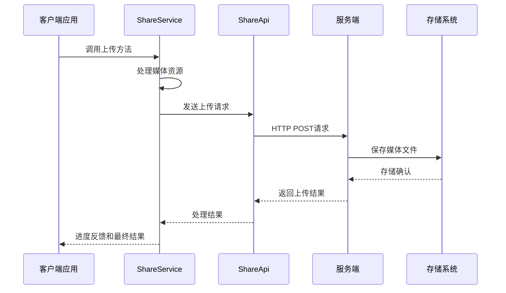
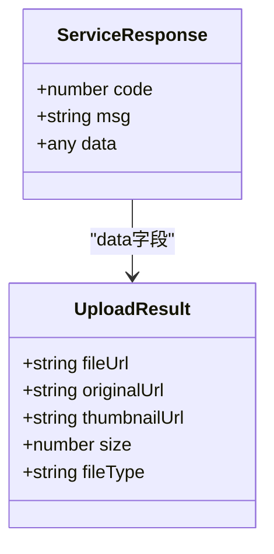
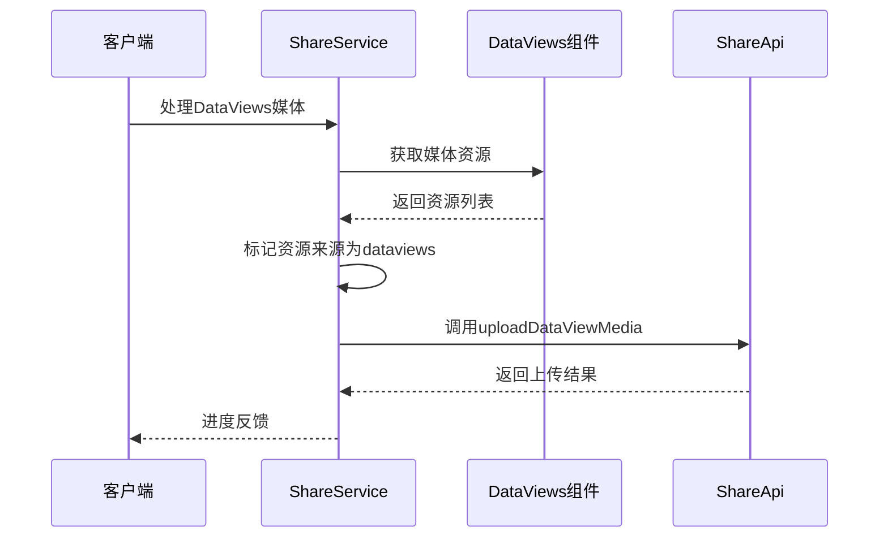
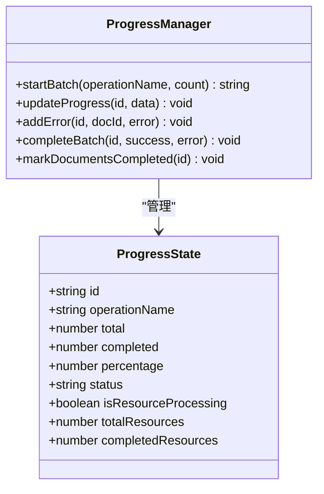
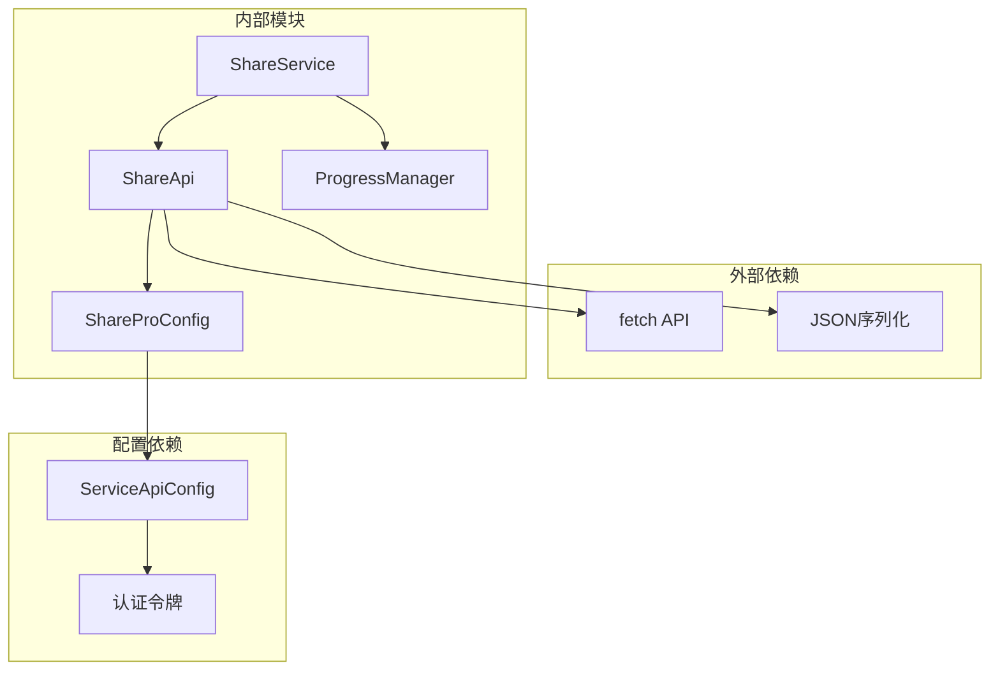

# 媒体上传API

<cite>
**本文档引用的文件**
- [share-api.ts](file://src/api/share-api.ts)
- [ShareService.ts](file://src/service/ShareService.ts)
- [ProgressManager.ts](file://src/utils/progress/ProgressManager.ts)
- [ShareProConfig.ts](file://src/models/ShareProConfig.ts)
- [service-api.d.ts](file://src/types/service-api.d.ts)
- [service-dto.d.ts](file://src/types/service-dto.d.ts)
- [spec.md](file://openspec/changes/archive/dataviews-resource-handling/specs/share-service/spec.md)
- [tasks.md](file://openspec/changes/archive/dataviews-resource-handling/tasks.md)
</cite>

## 目录
1. [简介](#简介)
2. [项目结构](#项目结构)
3. [核心组件](#核心组件)
4. [架构概览](#架构概览)
5. [详细组件分析](#详细组件分析)
6. [依赖关系分析](#依赖关系分析)
7. [性能考虑](#性能考虑)
8. [故障排除指南](#故障排除指南)
9. [结论](#结论)

## 简介

本文档详细介绍了思源笔记分享插件中的媒体资源上传功能，重点涵盖两个核心API：`uploadMedia`（普通媒体文件上传）和`uploadDataViewMedia`（数据视图媒体上传）。该功能支持将文档中的图片资源转换为Base64格式并通过HTTP接口上传到服务端，实现了完整的媒体资源处理流程，包括进度反馈、错误处理和批量上传优化。

## 项目结构

媒体上传功能主要分布在以下模块中：

**图表来源**
- [share-api.ts:16-240](file://src/api/share-api.ts#L16-L240)
- [ShareService.ts:727-1076](file://src/service/ShareService.ts#L727-L1076)
- [ProgressManager.ts:1-238](file://src/utils/progress/ProgressManager.ts#L1-L238)

**章节来源**
- [share-api.ts:16-240](file://src/api/share-api.ts#L16-L240)
- [ShareService.ts:727-1076](file://src/service/ShareService.ts#L727-L1076)

## 核心组件

### ShareApi类 - API接口层

ShareApi类提供了统一的API访问接口，封装了与服务端的所有通信逻辑：

**图表来源**
- [share-api.ts:16-240](file://src/api/share-api.ts#L16-L240)

### ShareService类 - 业务逻辑层

ShareService类负责具体的媒体资源处理逻辑，包括两种不同的上传流程：

**普通媒体上传流程**：
- 识别图片资源（type必须为"IMAGE"）
- 获取Base64编码和内容类型
- 分组批量上传（每组5个资源）

**数据视图媒体上传流程**：
- 处理DataViews组件中的媒体资源
- 标识资源来源为"dataviews"
- 支持单元格ID跟踪

**章节来源**
- [ShareService.ts:732-1026](file://src/service/ShareService.ts#L732-L1026)

## 架构概览

媒体上传系统的整体架构采用分层设计，确保了良好的可维护性和扩展性：

**图表来源**
- [share-api.ts:61-71](file://src/api/share-api.ts#L61-L71)
- [ShareService.ts:832-832](file://src/service/ShareService.ts#L832-L832)

## 详细组件分析

### uploadMedia API - 普通媒体文件上传

#### 请求参数结构

| 参数名称 | 类型 | 必填 | 描述 | 示例值 |
|---------|------|------|------|--------|
| docId | string | 是 | 文档唯一标识符 | "20240101120000-abcd1234" |
| medias | array | 是 | 媒体资源数组 | [] |
| hasNext | boolean | 是 | 是否还有下一批数据 | true/false |

#### 媒体资源参数

| 参数名称 | 类型 | 必填 | 描述 | 示例值 |
|---------|------|------|------|--------|
| file | string | 是 | Base64编码的文件内容 | "iVBORw0KGgoAAAANSUhEUgAAAAEAAAABCAYAAAAfFcSJAAAADUlEQVR42mP8/5+hHgAHggJ/PchI7wAAAABJRU5ErkJggg==" |
| originalUrl | string | 否 | 原始文件URL | "assets/image.jpg" |
| alt | string | 否 | 替代文本描述 | "示例图片" |
| title | string | 否 | 图片标题 | "标题" |
| type | string | 是 | 文件类型 | "image/jpeg" |

#### 响应格式

**图表来源**
- [share-api.ts:233-237](file://src/api/share-api.ts#L233-L237)

#### 上传流程

**图表来源**
- [ShareService.ts:741-865](file://src/service/ShareService.ts#L741-L865)

**章节来源**
- [ShareService.ts:732-878](file://src/service/ShareService.ts#L732-L878)

### uploadDataViewMedia API - 数据视图媒体上传

#### 特殊参数

| 参数名称 | 类型 | 必填 | 描述 | 示例值 |
|---------|------|------|------|--------|
| source | string | 是 | 资源来源标识 | "dataviews" |
| cellId | string | 否 | 数据视图单元格ID | "view_abc123" |

#### 数据视图处理流程

**图表来源**
- [ShareService.ts:885-1026](file://src/service/ShareService.ts#L885-L1026)

**章节来源**
- [ShareService.ts:885-1026](file://src/service/ShareService.ts#L885-L1026)

### 进度管理系统

#### 进度跟踪机制

**图表来源**
- [ProgressManager.ts:8-238](file://src/utils/progress/ProgressManager.ts#L8-L238)

#### 资源事件处理

| 事件类型 | 触发条件 | 处理逻辑 |
|---------|----------|----------|
| START | 开始处理资源 | 更新总资源数，标记资源处理开始 |
| PROGRESS | 资源处理进度 | 累加已完成资源数 |
| ERROR | 处理错误 | 记录错误信息到资源错误列表 |
| COMPLETE | 资源处理完成 | 检查是否可以完成批次操作 |

**章节来源**
- [ProgressManager.ts:36-100](file://src/utils/progress/ProgressManager.ts#L36-L100)

## 依赖关系分析

### 核心依赖关系

**图表来源**
- [share-api.ts:173-209](file://src/api/share-api.ts#L173-L209)
- [ShareProConfig.ts:13-37](file://src/models/ShareProConfig.ts#L13-L37)

### 错误处理依赖

| 错误类型 | 处理方式 | 依赖模块 |
|---------|----------|----------|
| 网络请求失败 | 重试机制，错误记录 | ShareApi |
| 资源处理失败 | 分组处理，不影响整体 | ShareService |
| 配置加载失败 | 用户提示，停止操作 | ShareProConfig |
| 进度更新失败 | 降级处理，继续执行 | ProgressManager |

**章节来源**
- [share-api.ts:173-209](file://src/api/share-api.ts#L173-L209)
- [ShareService.ts:808-810](file://src/service/ShareService.ts#L808-L810)

## 性能考虑

### 批量上传优化

系统采用了智能的批量上传策略来优化性能：

1. **分组上传**：每批最多5个媒体资源，平衡网络效率和内存使用
2. **异步处理**：使用Promise.all实现并行处理，提高整体吞吐量
3. **进度反馈**：实时更新上传进度，提升用户体验
4. **错误隔离**：单个资源失败不影响整个批次的处理

### 内存管理

- Base64编码的媒体文件在内存中处理，避免频繁的磁盘I/O
- 处理完成后及时清理临时变量，释放内存空间
- 支持大文件的分批处理，避免内存溢出

### 网络优化

- 使用HTTP持久连接减少连接建立开销
- 响应数据采用JSON格式，解析效率高
- 支持断点续传和重试机制

## 故障排除指南

### 常见问题及解决方案

#### 1. 上传失败问题

**症状**：上传过程中出现错误，部分或全部资源上传失败

**可能原因**：
- 网络连接不稳定
- 服务端存储空间不足
- 文件格式不支持
- Base64编码错误

**解决步骤**：
1. 检查网络连接状态
2. 验证服务端存储空间
3. 确认文件格式符合要求
4. 重新生成Base64编码

#### 2. 进度不更新问题

**症状**：上传进度卡住不动

**可能原因**：
- 进度回调函数未正确设置
- 资源处理时间过长
- 事件监听器被意外移除

**解决步骤**：
1. 检查进度回调函数的绑定
2. 增加超时处理机制
3. 重新注册事件监听器

#### 3. 资源丢失问题

**症状**：某些媒体资源在上传后丢失

**可能原因**：
- 资源类型过滤错误（仅处理IMAGE类型）
- 数据视图资源标识丢失
- 上传批次处理异常

**解决步骤**：
1. 验证资源类型检测逻辑
2. 检查DataViews资源标识设置
3. 实施资源完整性校验

### 调试工具和日志

系统提供了完善的日志记录机制：

**章节来源**
- [ShareService.ts:808-810](file://src/service/ShareService.ts#L808-L810)
- [share-api.ts:198-208](file://src/api/share-api.ts#L198-L208)

## 结论

媒体上传API为思源笔记分享插件提供了完整、可靠的媒体资源处理解决方案。通过区分普通媒体文件和数据视图媒体的不同处理流程，系统能够灵活应对各种复杂的文档分享场景。

### 主要优势

1. **双模式支持**：同时支持普通媒体文件和数据视图媒体的上传
2. **智能分组**：优化的批量上传策略提升处理效率
3. **完善的错误处理**：多层次的错误捕获和恢复机制
4. **实时进度反馈**：用户友好的进度展示和状态更新
5. **可扩展架构**：清晰的模块划分便于功能扩展和维护

### 未来改进方向

1. **文件大小限制**：建议在API层面增加文件大小验证
2. **格式验证**：增强对媒体格式的支持和验证
3. **并发控制**：根据网络状况动态调整并发数量
4. **缓存机制**：实现本地缓存减少重复上传
5. **监控指标**：增加详细的性能监控和统计信息

该API设计充分考虑了实际使用场景的需求，在保证功能完整性的同时，也注重了性能优化和用户体验的提升。