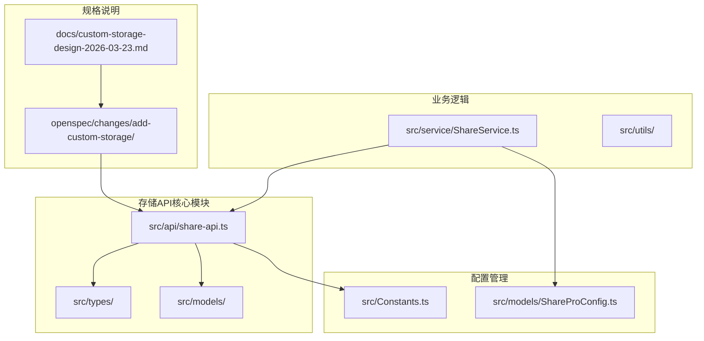
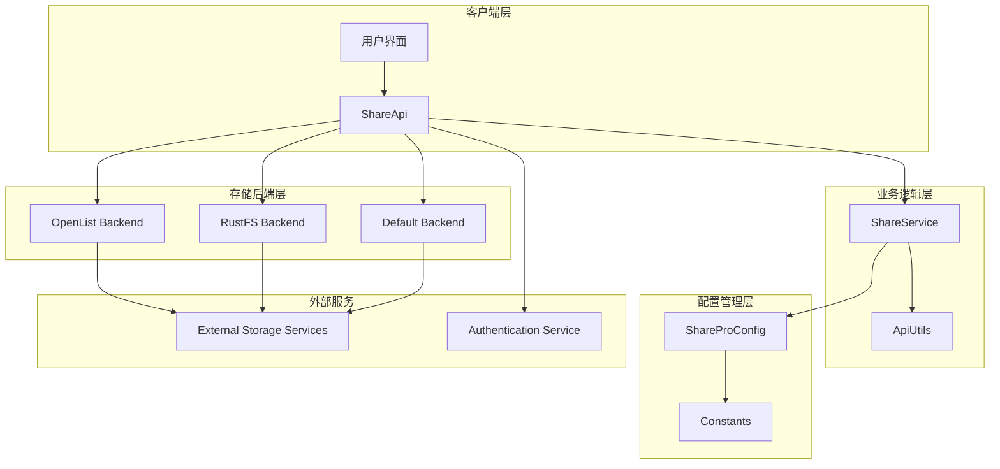
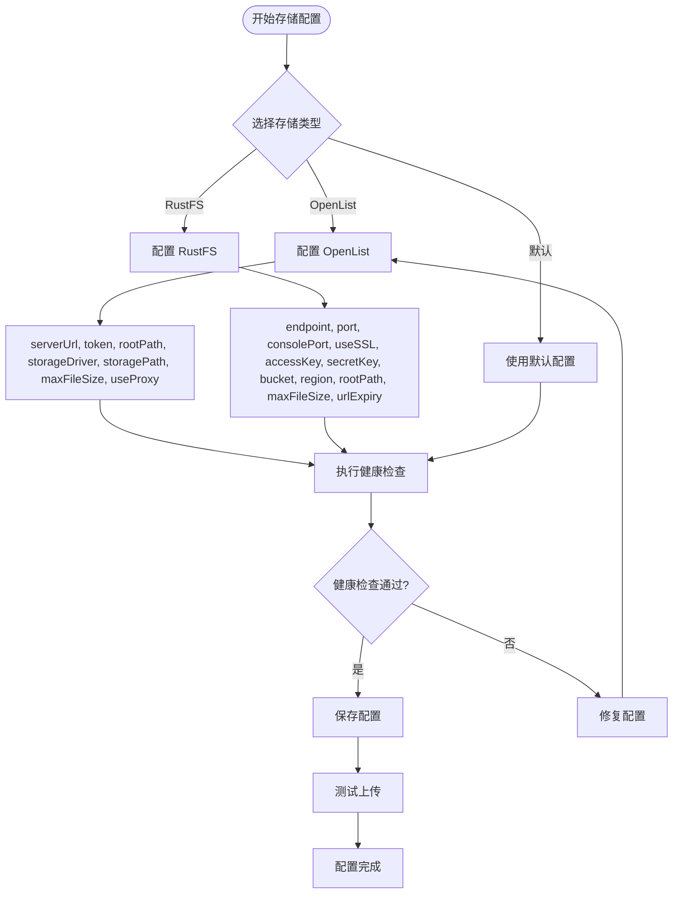
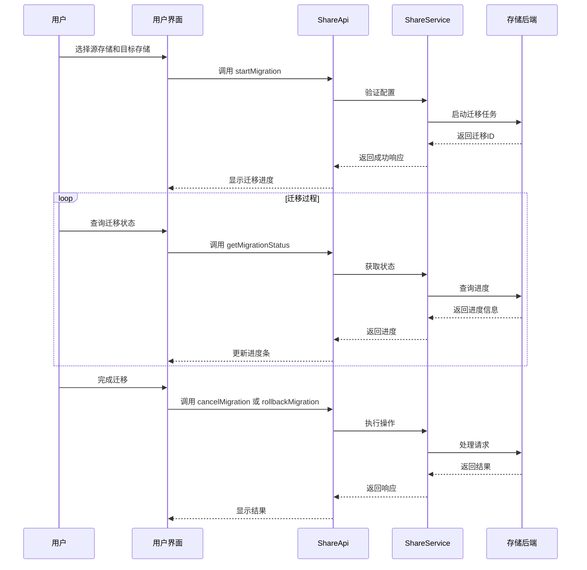
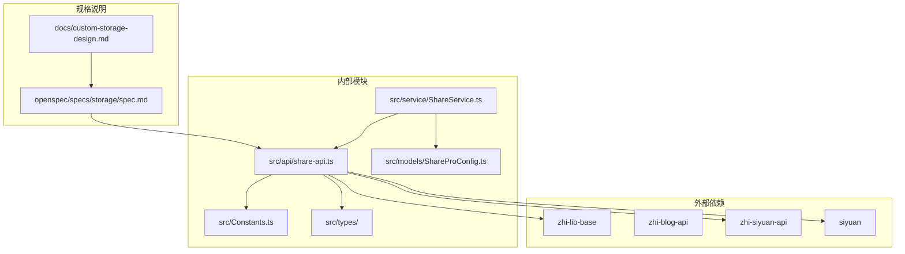

# 存储API端点

<cite>
**本文档引用的文件**
- [src/api/share-api.ts](file://src/api/share-api.ts)
- [src/Constants.ts](file://src/Constants.ts)
- [src/models/ShareProConfig.ts](file://src/models/ShareProConfig.ts)
- [src/types/service-api.d.ts](file://src/types/service-api.d.ts)
- [src/types/service-dto.d.ts](file://src/types/service-dto.d.ts)
- [src/types/index.d.ts](file://src/types/index.d.ts)
- [src/service/ShareService.ts](file://src/service/ShareService.ts)
- [src/utils/ApiUtils.ts](file://src/utils/ApiUtils.ts)
- [openspec/changes/add-custom-storage/specs/storage/spec.md](file://openspec/changes/add-custom-storage/specs/storage/spec.md)
- [openspec/changes/add-custom-storage/design.md](file://openspec/changes/add-custom-storage/design.md)
- [docs/custom-storage-design-2026-03-23.md](file://docs/custom-storage-design-2026-03-23.md)
- [plugin.json](file://plugin.json)
- [package.json](file://package.json)
</cite>

## 目录
1. [简介](#简介)
2. [项目结构](#项目结构)
3. [核心组件](#核心组件)
4. [架构概览](#架构概览)
5. [详细组件分析](#详细组件分析)
6. [依赖分析](#依赖分析)
7. [性能考虑](#性能考虑)
8. [故障排除指南](#故障排除指南)
9. [结论](#结论)

## 简介

本文档详细介绍了 SiYuan 笔记插件的存储API端点系统。该系统提供了完整的存储后端管理功能，支持多种存储解决方案，包括 OpenList 和 RustFS 等自定义存储后端。系统采用模块化设计，通过统一的 API 接口管理存储配置、健康检查和数据迁移等功能。

该存储API端点系统是在线分享专业版插件的重要组成部分，为用户提供了灵活的数据存储选择和管理能力。系统设计遵循安全性和可扩展性的原则，确保用户数据的安全存储和高效管理。

## 项目结构

项目采用模块化的组织方式，主要分为以下几个核心部分：



**图表来源**
- [src/api/share-api.ts:1-240](file://src/api/share-api.ts#L1-L240)
- [src/Constants.ts:1-30](file://src/Constants.ts#L1-L30)
- [openspec/changes/add-custom-storage/specs/storage/spec.md:1-176](file://openspec/changes/add-custom-storage/specs/storage/spec.md#L1-L176)

**章节来源**
- [src/api/share-api.ts:1-240](file://src/api/share-api.ts#L1-L240)
- [src/Constants.ts:1-30](file://src/Constants.ts#L1-L30)
- [plugin.json:1-35](file://plugin.json#L1-L35)

## 核心组件

存储API端点系统的核心组件包括以下关键模块：

### ShareApi 类
ShareApi 是存储API的主要入口点，提供了完整的存储后端管理功能。该类封装了所有与存储相关的HTTP请求，包括存储配置管理、健康检查和数据迁移等操作。

### 存储配置模型
系统定义了完整的存储配置模型，支持多种存储后端类型：
- **OpenList 存储后端**：基于 HTTP API 的存储解决方案
- **RustFS 存储后端**：S3 兼容的对象存储
- **默认存储后端**：系统内置的存储方案

### API 接口规范
系统提供了标准化的API接口规范，确保不同存储后端的一致性和互操作性。

**章节来源**
- [src/api/share-api.ts:16-240](file://src/api/share-api.ts#L16-L240)
- [src/models/ShareProConfig.ts:13-40](file://src/models/ShareProConfig.ts#L13-L40)
- [src/types/service-api.d.ts:13-16](file://src/types/service-api.d.ts#L13-L16)

## 架构概览

存储API端点系统采用分层架构设计，确保了良好的可维护性和扩展性：



**图表来源**
- [src/api/share-api.ts:16-240](file://src/api/share-api.ts#L16-L240)
- [src/service/ShareService.ts:45-200](file://src/service/ShareService.ts#L45-L200)
- [src/models/ShareProConfig.ts:13-40](file://src/models/ShareProConfig.ts#L13-L40)

系统架构的关键特点：
- **分层设计**：清晰的职责分离，便于维护和扩展
- **接口抽象**：统一的API接口，支持多种存储后端
- **配置驱动**：通过配置文件管理存储设置
- **安全考虑**：敏感信息加密存储，防止泄露

## 详细组件分析

### ShareApi 类详细分析

ShareApi 类是存储API端点系统的核心，提供了完整的存储后端管理功能：

```mermaid
classDiagram
class ShareApi {
-logger : ILogger
-pluginInstance : ShareProPlugin
+getDoc(docId : string, token? : string)
+deleteDoc(docId : string)
+createShare(shareBody : any)
+getVipInfo(token : string)
+uploadMedia(shareBody : any)
+uploadDataViewMedia(shareBody : any)
+listDoc(params : any)
+getSettingByAuthor(author : string)
+saveSetting(token : string, setting : any)
+updateShareOptions(updateBody : any)
+getBlacklistList(params : {pageNum : number, pageSize : number, type? : string})
+addBlacklist(params : any)
+deleteBlacklist(params : {id : number})
+checkBlacklist(params : {docIds : string[]})
+getHistoryByIds(docIds : string[])
-shareServiceRequest(url : string, data : object, headers? : Record<string, any>)
}
class ServiceApiKeys {
<<enumeration>>
API_SHARE_GET_DOC
API_SHARE_DELETE_DOC
API_SHARE_CREATE
API_SHARE_UPDATE_OPTIONS
API_LICENSE_VIP_INFO
API_UPLOAD_MEDIA
API_UPLOAD_DATA_VIEW_MEDIA
API_LIST_DOC
API_GET_SETTING_BY_AUTHOR
API_UPDATE_SETTING
API_BLACKLIST_LIST
API_BLACKLIST_ADD
API_BLACKLIST_DELETE
API_BLACKLIST_CHECK
API_HISTORY_GET_BY_IDS
}
class ServiceResponse {
+code : number
+msg : string
+data : any
}
ShareApi --> ServiceApiKeys : uses
ShareApi --> ServiceResponse : returns
```

**图表来源**
- [src/api/share-api.ts:16-240](file://src/api/share-api.ts#L16-L240)

#### API 端点分类

系统提供的API端点可以分为以下几类：

**文档管理端点**
- `/api/share/getDoc` - 获取文档信息
- `/api/share/delete` - 删除文档
- `/api/share/create` - 创建分享
- `/api/share/listDoc` - 列表文档
- `/api/share/updateOptions` - 更新分享选项

**媒体管理端点**
- `/api/asset/upload` - 上传媒体文件
- `/api/asset/uploadDataView` - 上传数据视图媒体

**设置管理端点**
- `/api/settings/byAuthor` - 按作者获取设置
- `/api/settings/update` - 更新设置

**黑名单管理端点**
- `/api/share/blacklist/list` - 获取黑名单列表
- `/api/share/blacklist/add` - 添加黑名单项
- `/api/share/blacklist/delete` - 删除黑名单项
- `/api/share/blacklist/check` - 检查黑名单

**历史记录端点**
- `/api/share/history/getByDocIds` - 按ID获取历史记录

**章节来源**
- [src/api/share-api.ts:25-231](file://src/api/share-api.ts#L25-L231)

### 存储后端管理

系统支持多种存储后端类型，每种后端都有其特定的配置要求和功能特性：



**图表来源**
- [openspec/changes/add-custom-storage/specs/storage/spec.md:18-45](file://openspec/changes/add-custom-storage/specs/storage/spec.md#L18-L45)

#### OpenList 存储后端

OpenList 是一个基于 HTTP API 的存储解决方案，具有以下特性：

**配置参数**
- `serverUrl`: OpenList 服务器地址
- `token`: 认证令牌
- `rootPath`: 根路径
- `storageDriver`: 存储驱动
- `storagePath`: 存储路径
- `maxFileSize`: 最大文件大小（默认 50MB）
- `useProxy`: 是否使用代理

**健康检查功能**
系统提供完整的健康检查机制，包括：
- 连接状态检测
- 延迟测量
- 可用空间检查
- 总容量统计
- 最后检查时间记录

#### RustFS 存储后端

RustFS 是一个 S3 兼容的对象存储解决方案，支持以下配置：

**核心配置**
- `endpoint`: 服务端点
- `port`: 端口号
- `consolePort`: 控制台端口
- `useSSL`: 是否使用SSL
- `accessKey`: 访问密钥
- `secretKey`: 秘密密钥
- `bucket`: 存储桶
- `region`: 区域
- `rootPath`: 根路径

**高级配置**
- `maxFileSize`: 最大文件大小（默认 50MB）
- `urlExpiry`: URL 过期时间

**章节来源**
- [openspec/changes/add-custom-storage/specs/storage/spec.md:18-45](file://openspec/changes/add-custom-storage/specs/storage/spec.md#L18-L45)
- [openspec/changes/add-custom-storage/design.md:30-56](file://openspec/changes/add-custom-storage/design.md#L30-L56)

### 数据迁移功能

系统提供了完整的数据迁移功能，支持在不同存储后端之间迁移数据：



**图表来源**
- [docs/custom-storage-design-2026-03-23.md:285-421](file://docs/custom-storage-design-2026-03-23.md#L285-L421)

**章节来源**
- [docs/custom-storage-design-2026-03-23.md:285-421](file://docs/custom-storage-design-2026-03-23.md#L285-L421)

## 依赖分析

存储API端点系统的依赖关系如下：



**图表来源**
- [package.json:22-30](file://package.json#L22-L30)
- [src/api/share-api.ts:10-14](file://src/api/share-api.ts#L10-L14)

**章节来源**
- [package.json:22-30](file://package.json#L22-L30)
- [src/api/share-api.ts:10-14](file://src/api/share-api.ts#L10-L14)

## 性能考虑

存储API端点系统在设计时充分考虑了性能优化：

### 缓存策略
- **配置缓存**：存储配置信息缓存，减少重复加载
- **响应缓存**：常用API响应缓存，提高响应速度
- **连接池**：HTTP连接复用，减少连接开销

### 错误处理
- **重试机制**：网络请求失败时自动重试
- **超时控制**：合理的超时设置，避免长时间阻塞
- **降级策略**：服务不可用时的降级处理

### 安全考虑
- **敏感信息加密**：Token和密钥等敏感信息加密存储
- **访问控制**：严格的权限验证和访问控制
- **输入验证**：完整的输入验证和清理机制

## 故障排除指南

### 常见问题及解决方案

**存储连接失败**
- 检查网络连接和防火墙设置
- 验证存储服务器地址和端口配置
- 确认认证信息的正确性

**健康检查失败**
- 检查存储服务器状态
- 验证磁盘空间和权限
- 查看服务器日志获取详细错误信息

**迁移过程中断**
- 检查源存储和目标存储的可用性
- 验证网络连接稳定性
- 查看迁移日志获取具体原因

**性能问题**
- 检查系统资源使用情况
- 优化存储配置参数
- 考虑增加硬件资源

**章节来源**
- [openspec/changes/add-custom-storage/design.md:57-66](file://openspec/changes/add-custom-storage/design.md#L57-L66)

## 结论

存储API端点系统为 SiYuan 笔记插件提供了强大而灵活的存储管理能力。通过支持多种存储后端、提供完整的配置管理功能和健壮的迁移机制，系统满足了用户对数据存储的各种需求。

系统的设计充分体现了模块化、可扩展和安全性的原则，为未来的功能扩展和技术演进奠定了坚实的基础。通过标准化的API接口和完善的错误处理机制，系统确保了良好的用户体验和稳定的性能表现。