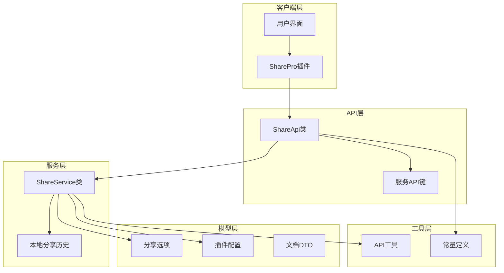
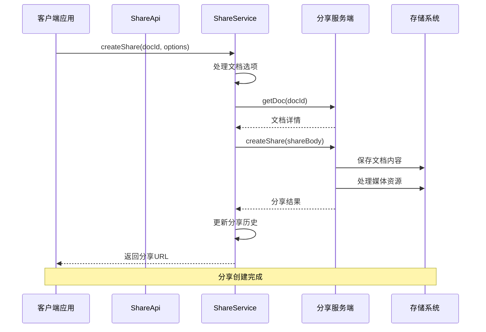
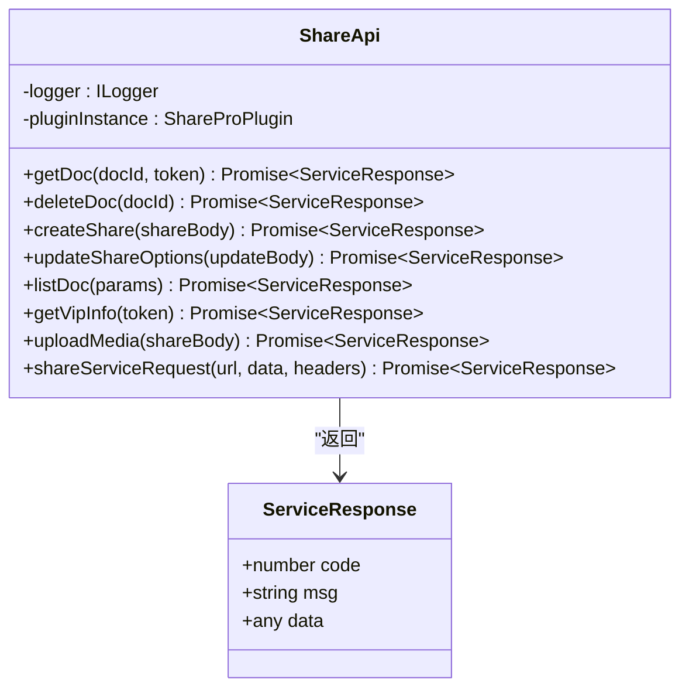
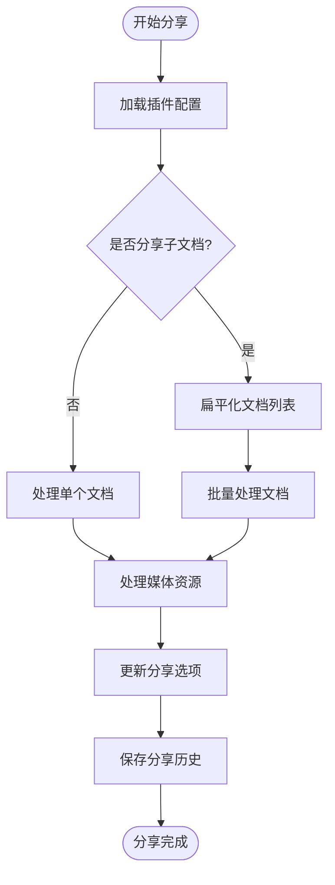
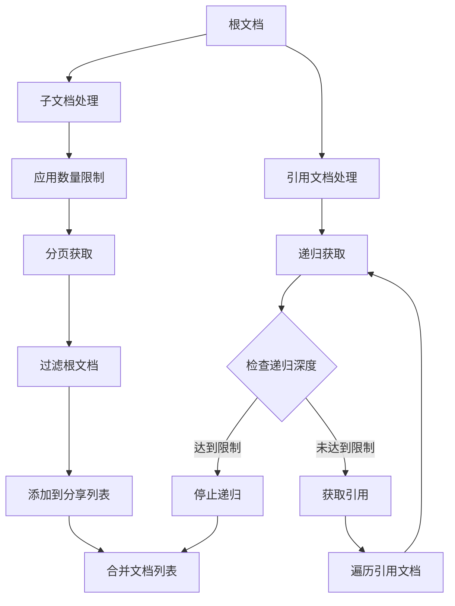
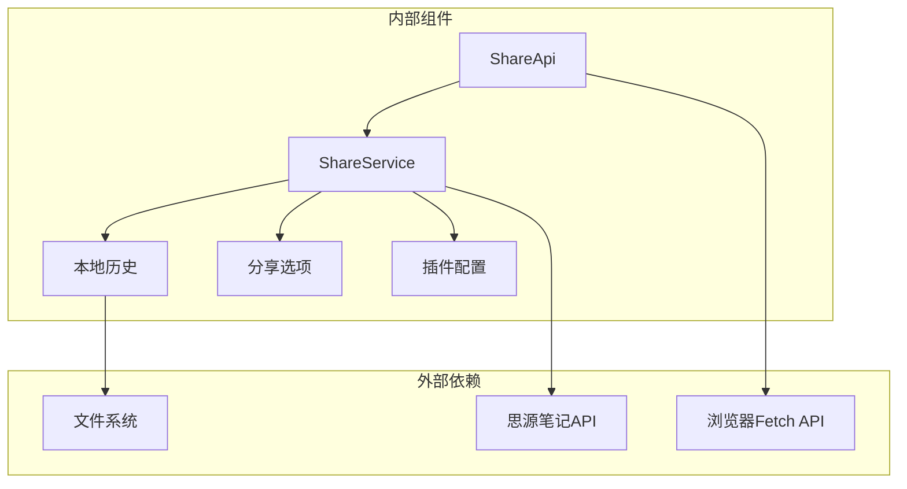

# 文档分享API

<cite>
**本文档引用的文件**
- [src/api/share-api.ts](file://src/api/share-api.ts)
- [src/service/ShareService.ts](file://src/service/ShareService.ts)
- [src/models/ShareOptions.ts](file://src/models/ShareOptions.ts)
- [src/types/service-dto.d.ts](file://src/types/service-dto.d.ts)
- [src/types/service-api.d.ts](file://src/types/service-api.d.ts)
- [src/models/ShareProConfig.ts](file://src/models/ShareProConfig.ts)
- [src/types/share-history.d.ts](file://src/types/share-history.d.ts)
- [src/utils/ApiUtils.ts](file://src/utils/ApiUtils.ts)
- [src/Constants.ts](file://src/Constants.ts)
- [openspec/changes/archive/dataviews-resource-handling/specs/share-service/spec.md](file://openspec/changes/archive/dataviews-resource-handling/specs/share-service/spec.md)
- [openspec/changes/add-referenced-doc-sharing/specs/share/spec.md](file://openspec/changes/add-referenced-doc-sharing/specs/share/spec.md)
</cite>

## 目录
1. [简介](#简介)
2. [项目结构](#项目结构)
3. [核心组件](#核心组件)
4. [架构概览](#架构概览)
5. [详细组件分析](#详细组件分析)
6. [依赖分析](#依赖分析)
7. [性能考虑](#性能考虑)
8. [故障排除指南](#故障排除指南)
9. [结论](#结论)
10. [附录](#附录)

## 简介
本文档详细描述了文档分享功能的API规范，涵盖从文档获取到分享创建的完整工作流程。重点记录以下核心API的完整规范：
- createShare：创建文档分享
- getDoc：获取文档信息
- deleteDoc：删除文档分享
- updateShareOptions：更新分享选项（如密码等）

同时包含API的参数结构、请求格式、响应数据结构、错误码说明、权限要求、频率限制、最佳实践以及数据流转和状态变化的详细解释。

## 项目结构
该项目采用模块化架构，围绕分享功能的核心组件包括API层、服务层、模型层和工具层：



**图表来源**
- [src/api/share-api.ts:16-240](file://src/api/share-api.ts#L16-L240)
- [src/service/ShareService.ts:40-56](file://src/service/ShareService.ts#L40-L56)

**章节来源**
- [src/api/share-api.ts:1-240](file://src/api/share-api.ts#L1-L240)
- [src/service/ShareService.ts:1-1251](file://src/service/ShareService.ts#L1-L1251)

## 核心组件
本节详细介绍文档分享API的核心组件及其职责分工：

### ShareApi类
ShareApi类是客户端API的统一入口，负责：
- 封装所有分享相关的HTTP请求
- 处理认证头信息
- 统一的错误处理和日志记录
- 与服务端的通信协调

### ShareService类
ShareService类是业务逻辑的核心实现，承担以下职责：
- 文档分享的完整生命周期管理
- 子文档和引用文档的递归处理
- 媒体资源的上传和处理
- 分享历史的记录和管理
- 批量操作的并发控制

### 数据模型
系统使用多种数据模型来描述分享过程中的不同实体：
- ShareOptions：分享选项配置
- ShareProConfig：插件整体配置
- DocDTO：服务端返回的文档信息结构

**章节来源**
- [src/api/share-api.ts:16-240](file://src/api/share-api.ts#L16-L240)
- [src/service/ShareService.ts:40-56](file://src/service/ShareService.ts#L40-L56)
- [src/models/ShareOptions.ts:16-27](file://src/models/ShareOptions.ts#L16-L27)
- [src/models/ShareProConfig.ts:13-40](file://src/models/ShareProConfig.ts#L13-L40)

## 架构概览
文档分享系统的整体架构采用分层设计，确保各层职责清晰分离：



**图表来源**
- [src/service/ShareService.ts:235-258](file://src/service/ShareService.ts#L235-L258)
- [src/api/share-api.ts:46-50](file://src/api/share-api.ts#L46-L50)

系统架构的关键特点：
- **分层设计**：API层、服务层、模型层职责明确
- **异步处理**：媒体资源上传采用异步方式
- **错误恢复**：支持重试机制和错误处理
- **历史记录**：完整的分享历史追踪

## 详细组件分析

### ShareApi类详细分析

#### 核心API方法
ShareApi类提供了完整的分享API接口，所有方法都遵循统一的请求模式：



**图表来源**
- [src/api/share-api.ts:16-240](file://src/api/share-api.ts#L16-L240)
- [src/api/share-api.ts:233-237](file://src/api/share-api.ts#L233-L237)

#### 服务API键定义
系统使用枚举定义所有可用的API端点：

| API名称 | 端点路径 | HTTP方法 | 用途描述 |
|---------|----------|----------|----------|
| API_SHARE_GET_DOC | /api/share/getDoc | POST | 获取文档信息 |
| API_SHARE_DELETE_DOC | /api/share/delete | POST | 删除文档分享 |
| API_SHARE_CREATE | /api/share/create | POST | 创建文档分享 |
| API_SHARE_UPDATE_OPTIONS | /api/share/updateOptions | POST | 更新分享选项 |
| API_LICENSE_VIP_INFO | /api/license/vipInfo | POST | 获取VIP信息 |
| API_UPLOAD_MEDIA | /api/asset/upload | POST | 上传媒体资源 |
| API_UPLOAD_DATA_VIEW_MEDIA | /api/asset/uploadDataView | POST | 上传DataViews媒体 |
| API_LIST_DOC | /api/share/listDoc | POST | 列出分享文档 |
| API_GET_SETTING_BY_AUTHOR | /api/settings/byAuthor | POST | 按作者获取设置 |
| API_UPDATE_SETTING | /api/settings/update | POST | 更新设置 |

**章节来源**
- [src/api/share-api.ts:212-231](file://src/api/share-api.ts#L212-L231)

### ShareService类详细分析

#### 分享创建流程
ShareService的createShare方法是分享流程的核心入口：



**图表来源**
- [src/service/ShareService.ts:235-258](file://src/service/ShareService.ts#L235-L258)
- [src/service/ShareService.ts:587-730](file://src/service/ShareService.ts#L587-L730)

#### 文档扁平化处理
系统支持复杂的文档关系处理，包括子文档和引用文档的递归处理：



**图表来源**
- [src/service/ShareService.ts:101-226](file://src/service/ShareService.ts#L101-L226)

**章节来源**
- [src/service/ShareService.ts:235-730](file://src/service/ShareService.ts#L235-L730)

### 数据模型详细分析

#### ShareOptions模型
分享选项模型定义了文档分享的各种配置参数：

| 字段名 | 类型 | 默认值 | 描述 |
|--------|------|--------|------|
| passwordEnabled | boolean | false | 是否启用密码保护 |
| password | string | "" | 分享密码 |

#### ShareProConfig模型
插件配置模型包含了分享功能所需的所有配置信息：

| 字段名 | 类型 | 描述 |
|--------|------|------|
| siyuanConfig | object | 思源笔记客户端配置 |
| serviceApiConfig | IServiceApiConfig | 服务端API配置 |
| appConfig | object | 应用程序配置 |
| isCustomCssEnabled | boolean | 是否启用自定义CSS |
| isNewUIEnabled | boolean | 是否启用新UI |
| inited | boolean | 是否已初始化 |

#### DocDTO模型
服务端返回的文档信息结构：

| 字段名 | 类型 | 描述 |
|--------|------|------|
| docId | string | 文档ID |
| author | string | 作者 |
| docDomain | string | 文档域名 |
| data | DocDataDTO | 文档数据 |
| media | any[] | 媒体文件列表 |
| status | enum | 分享状态 |
| createdAt | string | 创建时间 |

**章节来源**
- [src/models/ShareOptions.ts:16-27](file://src/models/ShareOptions.ts#L16-L27)
- [src/models/ShareProConfig.ts:13-40](file://src/models/ShareProConfig.ts#L13-L40)
- [src/types/service-dto.d.ts:98-134](file://src/types/service-dto.d.ts#L98-L134)

## 依赖分析

### 组件间依赖关系
系统采用松耦合的设计，各组件间的依赖关系清晰明确：



**图表来源**
- [src/api/share-api.ts:10-23](file://src/api/share-api.ts#L10-L23)
- [src/service/ShareService.ts:10-32](file://src/service/ShareService.ts#L10-L32)

### 外部依赖分析
系统对外部依赖的使用遵循最小化原则：

| 依赖名称 | 用途 | 版本要求 | 说明 |
|----------|------|----------|------|
| siyuan | 思源笔记客户端API | ^1.0.0 | 核心文档操作 |
| zhi-lib-base | 日志和工具库 | ^1.0.0 | 基础功能支持 |
| zhi-blog-api | 博客API | ^1.0.0 | 博客相关功能 |

**章节来源**
- [src/api/share-api.ts:10-13](file://src/api/share-api.ts#L10-L13)
- [src/service/ShareService.ts:10-29](file://src/service/ShareService.ts#L10-L29)

## 性能考虑
基于代码分析，系统在性能方面采用了多项优化策略：

### 并发控制
- **批量处理**：支持最多10个并发的文档分享操作
- **分页获取**：子文档分页获取，避免一次性加载过多数据
- **媒体资源分组**：媒体资源按5个一组进行批量处理

### 缓存策略
- **本地缓存**：分享历史使用内存缓存提高访问速度
- **配置缓存**：插件配置信息缓存减少重复读取

### 错误处理机制
- **指数退避**：网络错误采用1s、2s、4s的重试策略
- **服务端错误处理**：5xx错误延迟30秒重试
- **最大重试次数**：防止无限重试导致资源浪费

**章节来源**
- [src/service/ShareService.ts:442-475](file://src/service/ShareService.ts#L442-L475)
- [src/service/IncrementalShareService.ts:625-656](file://src/service/IncrementalShareService.ts#L625-L656)

## 故障排除指南

### 常见错误及解决方案

#### 1. 分享服务未初始化
**错误表现**：提示"未找到分享服务，请先初始化"
**解决方案**：
- 检查插件配置中的serviceApiConfig.apiUrl
- 确认服务端地址配置正确
- 验证网络连接状态

#### 2. 认证失败
**错误表现**：API返回认证相关错误
**解决方案**：
- 检查Authorization头信息
- 验证token的有效性
- 确认VIP权限状态

#### 3. 文档不存在
**错误表现**：getDoc返回文档不存在错误
**解决方案**：
- 验证docId的正确性
- 检查文档是否已被删除
- 确认用户是否有访问权限

#### 4. 媒体资源上传失败
**错误表现**：processAllMediaResources执行失败
**解决方案**：
- 检查媒体文件格式和大小
- 验证网络连接稳定性
- 查看服务端存储空间

### 调试建议
- 启用开发模式查看详细日志
- 使用浏览器开发者工具监控网络请求
- 检查服务端日志获取更多信息

**章节来源**
- [src/api/share-api.ts:180-183](file://src/api/share-api.ts#L180-L183)
- [src/service/ShareService.ts:692-730](file://src/service/ShareService.ts#L692-L730)

## 结论
本文档详细描述了文档分享API的完整规范，包括：

1. **完整的API规范**：涵盖了createShare、getDoc、deleteDoc、updateShareOptions等核心API
2. **详细的数据结构**：提供了所有相关模型的字段定义和用途说明
3. **完整的流程分析**：从文档获取到分享创建的每个步骤都有详细说明
4. **最佳实践指导**：包含权限要求、频率限制和性能优化建议
5. **故障排除方案**：提供了常见问题的诊断和解决方法

该系统采用模块化设计，具有良好的扩展性和维护性，能够满足复杂文档分享场景的需求。

## 附录

### API使用示例

#### 成功场景示例
```javascript
// 创建文档分享
const shareResult = await shareService.createShare('20231201103000-abc123', {
  shareSubdocuments: true,
  shareReferences: true
});

// 更新分享选项
const updateResult = await shareService.updateShareOptions('20231201103000-abc123', {
  passwordEnabled: true,
  password: 'securePassword'
});
```

#### 失败场景示例
```javascript
// 处理分享失败
if (shareResult.code !== 0) {
  console.error('分享失败:', shareResult.msg);
  // 记录失败历史
  await localShareHistory.addHistory({
    docId: '20231201103000-abc123',
    shareStatus: 'failed',
    errorMessage: shareResult.msg
  });
}
```

### 权限要求
- **基本权限**：需要思源笔记的文档读取权限
- **分享权限**：需要调用分享服务的权限
- **媒体权限**：需要访问和上传媒体资源的权限

### 频率限制
- **单文档分享**：无硬性限制，建议合理控制请求频率
- **批量分享**：并发数限制为10个，避免对服务端造成压力
- **重试机制**：网络错误最多重试3次，服务端错误最多重试1次

### 最佳实践
1. **渐进式分享**：优先分享单个文档验证流程
2. **媒体优化**：压缩媒体文件大小，提高传输效率
3. **错误监控**：建立完善的错误监控和日志记录
4. **性能优化**：合理设置并发数和重试策略
5. **用户体验**：提供清晰的进度反馈和状态指示