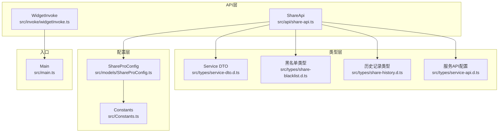
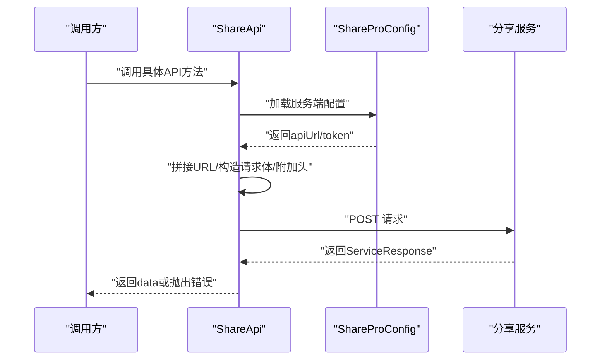
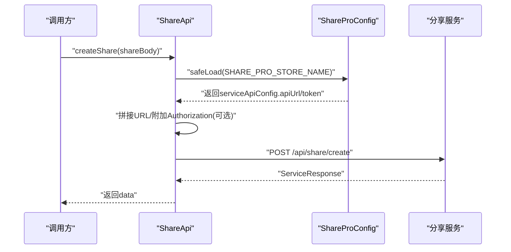
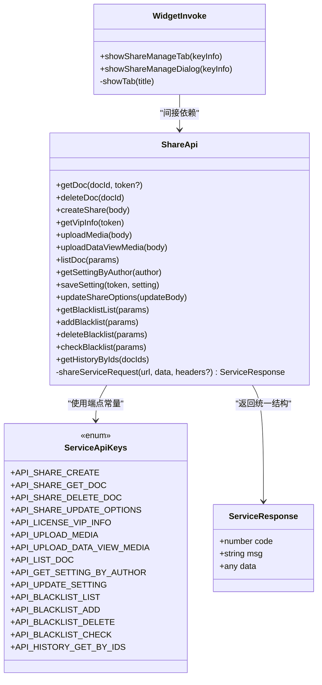

# 核心API接口

<cite>
**本文引用的文件**
- [src/api/share-api.ts](file://src/api/share-api.ts)
- [src/invoke/widgetInvoke.ts](file://src/invoke/widgetInvoke.ts)
- [src/types/service-api.d.ts](file://src/types/service-api.d.ts)
- [src/types/service-dto.d.ts](file://src/types/service-dto.d.ts)
- [src/types/share-blacklist.d.ts](file://src/types/share-blacklist.d.ts)
- [src/types/share-history.d.ts](file://src/types/share-history.d.ts)
- [src/Constants.ts](file://src/Constants.ts)
- [src/models/ShareProConfig.ts](file://src/models/ShareProConfig.ts)
- [src/models/SingleDocSetting.ts](file://src/models/SingleDocSetting.ts)
- [src/service/SettingService.ts](file://src/service/SettingService.ts)
- [src/main.ts](file://src/main.ts)
- [package.json](file://package.json)
</cite>

## 目录
1. [简介](#简介)
2. [项目结构](#项目结构)
3. [核心组件](#核心组件)
4. [架构总览](#架构总览)
5. [详细组件分析](#详细组件分析)
6. [依赖关系分析](#依赖关系分析)
7. [性能考虑](#性能考虑)
8. [故障排查指南](#故障排查指南)
9. [结论](#结论)
10. [附录](#附录)

## 简介
本文件为“思源笔记分享专业版”的核心API接口文档，聚焦于 ShareApi 类提供的全部公共方法与 ServiceApiKeys 枚举中的 API 端点常量，覆盖以下能力域：
- 文档分享：创建分享、获取文档、删除分享
- 媒体上传：通用媒体上传、DataView 资源上传
- 设置管理：按作者获取设置、保存设置
- VIP 信息：查询授权用户信息
- 黑名单管理：分页列表、新增、删除、批量检查
- 历史记录：按文档 ID 批量查询分享历史
- 内部 widgetInvoke：展示分享管理面板（Tab/Dialog）

文档同时给出参数结构、返回值格式、错误处理机制与最佳实践，并提供请求/响应示例与调用流程图。

## 项目结构
围绕核心 API 的主要模块如下：
- API 层：对外暴露 ShareApi 与 ServiceApiKeys
- 类型层：服务端 DTO、分页模型、黑名单与历史记录类型
- 配置层：ShareProConfig、IServiceApiConfig
- 内部调用：widgetInvoke 提供 UI 展示能力
- 常量与入口：Constants、main.ts

图表来源
- [src/api/share-api.ts:16-240](file://src/api/share-api.ts#L16-L240)
- [src/invoke/widgetInvoke.ts:17-80](file://src/invoke/widgetInvoke.ts#L17-L80)
- [src/types/service-dto.d.ts:10-134](file://src/types/service-dto.d.ts#L10-L134)
- [src/types/share-blacklist.d.ts:10-114](file://src/types/share-blacklist.d.ts#L10-L114)
- [src/types/share-history.d.ts:10-59](file://src/types/share-history.d.ts#L10-L59)
- [src/types/service-api.d.ts:10-17](file://src/types/service-api.d.ts#L10-L17)
- [src/models/ShareProConfig.ts:13-40](file://src/models/ShareProConfig.ts#L13-L40)
- [src/Constants.ts:10-20](file://src/Constants.ts#L10-L20)
- [src/main.ts:12-34](file://src/main.ts#L12-L34)

章节来源
- [src/api/share-api.ts:16-240](file://src/api/share-api.ts#L16-L240)
- [src/invoke/widgetInvoke.ts:17-80](file://src/invoke/widgetInvoke.ts#L17-L80)
- [src/types/service-dto.d.ts:10-134](file://src/types/service-dto.d.ts#L10-L134)
- [src/types/share-blacklist.d.ts:10-114](file://src/types/share-blacklist.d.ts#L10-L114)
- [src/types/share-history.d.ts:10-59](file://src/types/share-history.d.ts#L10-L59)
- [src/types/service-api.d.ts:10-17](file://src/types/service-api.d.ts#L10-L17)
- [src/models/ShareProConfig.ts:13-40](file://src/models/ShareProConfig.ts#L13-L40)
- [src/Constants.ts:10-20](file://src/Constants.ts#L10-L20)
- [src/main.ts:12-34](file://src/main.ts#L12-L34)

## 核心组件
- ShareApi：封装所有分享服务的 HTTP 请求，统一处理鉴权头、请求体、错误提示与日志输出；提供文档分享、媒体上传、设置管理、VIP 查询、黑名单与历史记录等方法。
- ServiceApiKeys：集中定义所有服务端 API 的端点路径常量，便于维护与调用。
- ServiceResponse：统一的服务端响应结构（code、msg、data）。
- WidgetInvoke：内部 UI 调用工具，负责打开分享管理 Tab 或 Dialog 并挂载 Svelte 组件。
- 类型系统：PageDTO/PageResponseDTO、DocDTO/DocDataDTO、黑名单与历史记录类型，确保前后端契约一致。
- 配置系统：ShareProConfig/IServiceApiConfig 提供服务端地址与令牌配置。

章节来源
- [src/api/share-api.ts:16-240](file://src/api/share-api.ts#L16-L240)
- [src/invoke/widgetInvoke.ts:17-80](file://src/invoke/widgetInvoke.ts#L17-L80)
- [src/types/service-dto.d.ts:10-134](file://src/types/service-dto.d.ts#L10-L134)
- [src/types/share-blacklist.d.ts:10-114](file://src/types/share-blacklist.d.ts#L10-L114)
- [src/types/share-history.d.ts:10-59](file://src/types/share-history.d.ts#L10-L59)
- [src/types/service-api.d.ts:10-17](file://src/types/service-api.d.ts#L10-L17)
- [src/models/ShareProConfig.ts:13-40](file://src/models/ShareProConfig.ts#L13-L40)

## 架构总览
ShareApi 通过读取插件配置中的服务端地址与令牌，拼接 ServiceApiKeys 中的端点路径，构造标准的 JSON 请求体与可选的 Authorization 头，最终以 POST 方式调用服务端。内部统一的日志与开发模式调试输出有助于问题定位。

图表来源
- [src/api/share-api.ts:173-209](file://src/api/share-api.ts#L173-L209)
- [src/models/ShareProConfig.ts:13-40](file://src/models/ShareProConfig.ts#L13-L40)

## 详细组件分析

### ShareApi 公共方法与 ServiceApiKeys 端点

- 文档分享
  - createShare(shareBody: any)
    - 功能：创建新的分享
    - 参数：任意对象，建议包含文档ID、分享选项等
    - 返回：ServiceResponse.data 通常为分享结果标识
    - 示例：见“请求/响应示例”
    - 最佳实践：确保 shareBody 结构与服务端约定一致
  - getDoc(docId: string, token?: string)
    - 功能：根据文档ID获取分享详情
    - 参数：docId 必填；token 可选（若需要鉴权）
    - 返回：ServiceResponse.data 通常为 DocDTO
    - 示例：见“请求/响应示例”
  - deleteDoc(docId: string)
    - 功能：删除指定分享
    - 参数：docId 必填
    - 返回：ServiceResponse.data 通常为删除确认
    - 示例：见“请求/响应示例”

- 媒体上传
  - uploadMedia(shareBody: any)
    - 功能：上传通用媒体资源
    - 参数：任意对象，建议包含文件流、元数据等
    - 返回：ServiceResponse.data 通常为上传结果
  - uploadDataViewMedia(shareBody: any)
    - 功能：上传 DataView 相关资源
    - 参数：任意对象，建议包含文件流、元数据等
    - 返回：ServiceResponse.data 通常为上传结果

- 设置管理
  - getSettingByAuthor(author: string)
    - 功能：按作者维度获取设置
    - 参数：author 必填
    - 返回：ServiceResponse.data 通常为设置JSON字符串
  - saveSetting(token: string, setting: any)
    - 功能：保存设置（需鉴权）
    - 参数：token 必填；setting 为对象，会被序列化为字符串存储
    - 返回：ServiceResponse.data 通常为保存确认

- VIP 信息
  - getVipInfo(token: string)
    - 功能：查询授权用户的 VIP 信息
    - 参数：token 必填
    - 返回：ServiceResponse.data 通常为 VIP 详情

- 黑名单管理
  - getBlacklistList(params: { pageNum: number; pageSize: number; type?: string })
    - 功能：分页获取黑名单列表
    - 参数：pageNum、pageSize 必填；type 可选（如 notebook/document）
    - 返回：ServiceResponse.data 通常为 PageResponseDTO<BlacklistItem>
  - addBlacklist(params: any)
    - 功能：新增黑名单项
    - 参数：任意对象，建议包含 id、name、type、note 等
    - 返回：ServiceResponse.data 通常为新增确认
  - deleteBlacklist(params: { id: number })
    - 功能：删除黑名单项（数据库ID）
    - 参数：id 必填
    - 返回：ServiceResponse.data 通常为删除确认
  - checkBlacklist(params: { docIds: string[] })
    - 功能：批量检查文档ID是否在黑名单中
    - 参数：docIds 必填（数组）
    - 返回：ServiceResponse.data 通常为映射表或布尔数组

- 历史记录
  - getHistoryByIds(docIds: string[])
    - 功能：按文档ID批量查询分享历史
    - 参数：docIds 必填（数组）
    - 返回：ServiceResponse.data 通常为 ShareHistoryItem[]

- ServiceApiKeys 端点常量
  - API_SHARE_CREATE
  - API_SHARE_GET_DOC
  - API_SHARE_DELETE_DOC
  - API_SHARE_UPDATE_OPTIONS
  - API_LICENSE_VIP_INFO
  - API_UPLOAD_MEDIA
  - API_UPLOAD_DATA_VIEW_MEDIA
  - API_LIST_DOC
  - API_GET_SETTING_BY_AUTHOR
  - API_UPDATE_SETTING
  - API_BLACKLIST_LIST
  - API_BLACKLIST_ADD
  - API_BLACKLIST_DELETE
  - API_BLACKLIST_CHECK
  - API_HISTORY_GET_BY_IDS

章节来源
- [src/api/share-api.ts:25-160](file://src/api/share-api.ts#L25-L160)
- [src/api/share-api.ts:212-231](file://src/api/share-api.ts#L212-L231)

### ServiceResponse 统一响应结构
- 字段
  - code: number
  - msg: string
  - data: any
- 说明
  - code=200 通常表示成功；非200时应视为失败
  - msg 提供人类可读的描述
  - data 包含实际业务数据

章节来源
- [src/api/share-api.ts:233-237](file://src/api/share-api.ts#L233-L237)

### 类型系统与数据模型

- 分页模型
  - PageDTO：pageNum、pageSize、search
  - PageResponseDTO：total、pageSize、pageNum、totalPages、data[]、order、direction、search

- 文档模型
  - DocDataDTO：title、dateCreated、dateUpdated
  - DocDTO：docId、author、docDomain、data、media[]、status、createdAt

- 黑名单模型
  - BlacklistItemType：notebook | document
  - BlacklistItem：id、name、type、addedTime、note、dbId
  - ShareBlacklist 接口：getAllItems、addItem、removeItem、isInBlacklist、areInBlacklist、clearBlacklist、getItemsByType、searchItems
  - BlacklistConfig：notebookBlacklist、docBlacklist、enabled

- 历史记录模型
  - ShareHistoryItem：docId、docTitle、shareTime、shareStatus、shareUrl、errorMessage、docModifiedTime
  - IShareHistoryService：getHistoryByIds(docIds: string[]): Promise<Array<ShareHistoryItem> | undefined>

章节来源
- [src/types/service-dto.d.ts:10-134](file://src/types/service-dto.d.ts#L10-L134)
- [src/types/share-blacklist.d.ts:10-114](file://src/types/share-blacklist.d.ts#L10-L114)
- [src/types/share-history.d.ts:10-59](file://src/types/share-history.d.ts#L10-L59)

### 配置与常量

- ShareProConfig
  - siyuanConfig.apiUrl/token/cookie 及偏好设置
  - serviceApiConfig.apiUrl/token
  - appConfig、isNewUIEnabled、inited

- IServiceApiConfig
  - apiUrl?: string
  - token?: string

- Constants
  - SHARE_PRO_STORE_NAME、SHARE_SERVICE_ENDPOINT_DEV/PRO、默认语言与开发模式开关等

章节来源
- [src/models/ShareProConfig.ts:13-40](file://src/models/ShareProConfig.ts#L13-L40)
- [src/types/service-api.d.ts:10-17](file://src/types/service-api.d.ts#L10-L17)
- [src/Constants.ts:10-20](file://src/Constants.ts#L10-L20)

### widgetInvoke 内部API
- showShareManageTab(keyInfo: KeyInfo)
  - 功能：打开自定义 Tab 并挂载分享管理组件
  - 参数：keyInfo 传入组件所需上下文
  - 实现：通过 openTab 创建 Tab，清空 panelElement 后挂载 ShareManage
- showShareManageDialog(keyInfo: KeyInfo)
  - 功能：创建 Dialog 并挂载分享管理组件
  - 参数：keyInfo 传入组件所需上下文
  - 实现：创建 Dialog，延时等待 DOM 更新后挂载 ShareManage
- 依赖：依赖插件实例的 i18n 与移动端判断逻辑

章节来源
- [src/invoke/widgetInvoke.ts:26-76](file://src/invoke/widgetInvoke.ts#L26-L76)

### 调用流程与最佳实践

- 调用流程（以 createShare 为例）

图表来源
- [src/api/share-api.ts:46-50](file://src/api/share-api.ts#L46-L50)
- [src/api/share-api.ts:173-209](file://src/api/share-api.ts#L173-L209)
- [src/models/ShareProConfig.ts:13-40](file://src/models/ShareProConfig.ts#L13-L40)

- 最佳实践
  - 统一鉴权：有鉴权需求的接口（如 saveSetting、getVipInfo、deleteDoc）务必提供 token
  - 参数校验：黑名单与历史记录接口对数组参数进行长度与格式校验
  - 分页策略：黑名单列表使用 PageDTO，合理设置 pageNum/pageSize
  - 错误处理：关注 ServiceResponse.code 非200的情况，结合 msg 判断
  - 开发调试：开启 isDev 时可查看详细日志与请求/响应体

## 依赖关系分析

图表来源
- [src/api/share-api.ts:16-240](file://src/api/share-api.ts#L16-L240)
- [src/invoke/widgetInvoke.ts:17-80](file://src/invoke/widgetInvoke.ts#L17-L80)

章节来源
- [src/api/share-api.ts:16-240](file://src/api/share-api.ts#L16-L240)
- [src/invoke/widgetInvoke.ts:17-80](file://src/invoke/widgetInvoke.ts#L17-L80)

## 性能考虑
- 请求合并：批量接口（如 checkBlacklist、getHistoryByIds）建议减少调用次数，尽量一次传入多个 ID
- 分页优化：黑名单列表使用合理的 pageSize，避免一次性拉取过多数据
- 缓存策略：前端可对 getDoc、getSettingByAuthor 的结果进行短期缓存，降低重复请求
- 体积控制：媒体上传建议压缩后再传，避免超大文件导致网络拥塞
- 超时与重试：在网络不稳定场景下，建议增加超时与指数退避重试

## 故障排查指南
- 未找到分享服务
  - 现象：提示“未找到分享服务，请先初始化”
  - 原因：配置中 serviceApiConfig.apiUrl 为空
  - 处理：在插件设置中正确填写服务端地址
- 鉴权失败
  - 现象：VIP 查询、设置保存、删除分享等接口返回鉴权错误
  - 原因：缺少或错误的 Authorization 头
  - 处理：确保 token 正确传递且未过期
- 参数错误
  - 现象：黑名单/历史记录接口返回参数非法
  - 处理：核对参数类型与必填字段（如 docIds、pageNum、pageSize、id）
- 网络异常
  - 现象：请求超时或返回非 JSON
  - 处理：检查网络连通性、服务端状态与代理配置

章节来源
- [src/api/share-api.ts:180-183](file://src/api/share-api.ts#L180-L183)
- [src/api/share-api.ts:194-196](file://src/api/share-api.ts#L194-L196)

## 结论
ShareApi 将分享服务的所有能力以统一的接口形式暴露，配合 ServiceApiKeys 端点常量与 ServiceResponse 统一响应结构，使调用方能够稳定地集成文档分享、媒体上传、设置管理、VIP 查询、黑名单与历史记录等功能。widgetInvoke 则提供了便捷的 UI 展示能力。遵循本文的最佳实践与排错建议，可显著提升集成效率与稳定性。

## 附录

### 请求/响应示例（示意）
- createShare
  - 请求体：包含文档ID与分享选项的对象
  - 成功响应：code=200，msg 为成功描述，data 为分享标识
- getDoc
  - 请求体：{ fdId: "文档ID" }
  - 成功响应：code=200，data 为 DocDTO
- saveSetting
  - 请求头：Authorization: "Bearer TOKEN"
  - 请求体：{ group: "GENERAL", key: "static.app.config.json", value: "{...}" }
  - 成功响应：code=200，msg 为成功描述
- getVipInfo
  - 请求头：Authorization: "Bearer TOKEN"
  - 成功响应：code=200，data 为 VIP 信息对象
- uploadMedia / uploadDataViewMedia
  - 请求体：包含文件与元数据的对象
  - 成功响应：code=200，data 为上传结果
- getBlacklistList
  - 请求体：{ pageNum: 0, pageSize: 10, type?: "document" }
  - 成功响应：code=200，data 为 PageResponseDTO<BlacklistItem>
- checkBlacklist
  - 请求体：{ docIds: ["id1","id2"] }
  - 成功响应：code=200，data 为映射或布尔数组
- getHistoryByIds
  - 请求体：{ docIds: ["id1","id2"] }
  - 成功响应：code=200，data 为 ShareHistoryItem[]

章节来源
- [src/api/share-api.ts:25-160](file://src/api/share-api.ts#L25-L160)
- [src/types/service-dto.d.ts:10-134](file://src/types/service-dto.d.ts#L10-L134)
- [src/types/share-blacklist.d.ts:10-114](file://src/types/share-blacklist.d.ts#L10-L114)
- [src/types/share-history.d.ts:10-59](file://src/types/share-history.d.ts#L10-L59)