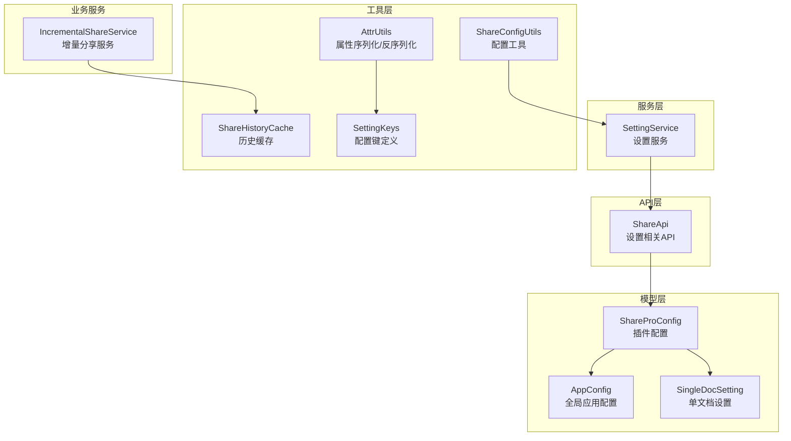
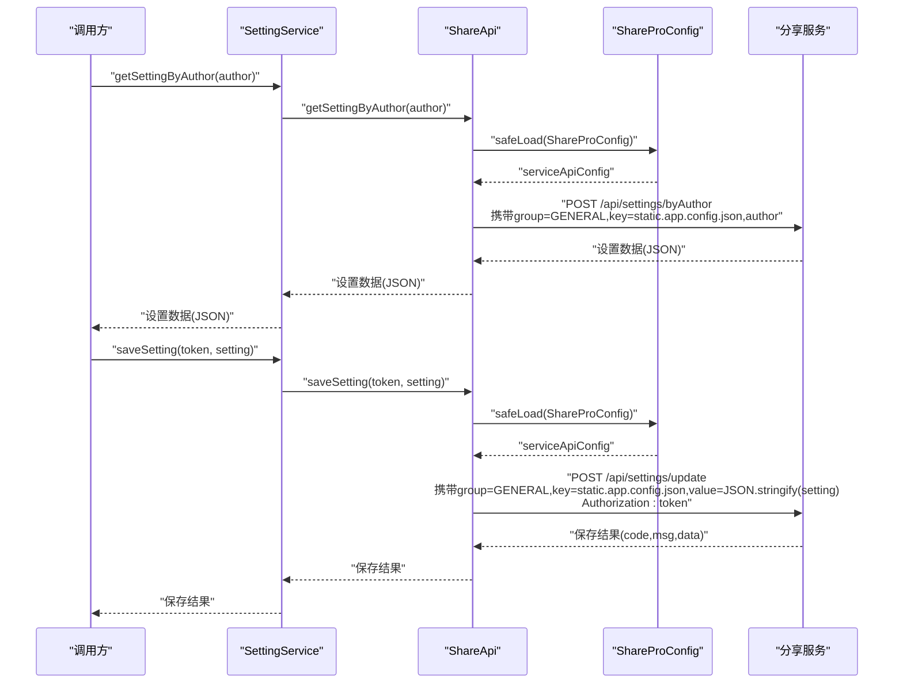
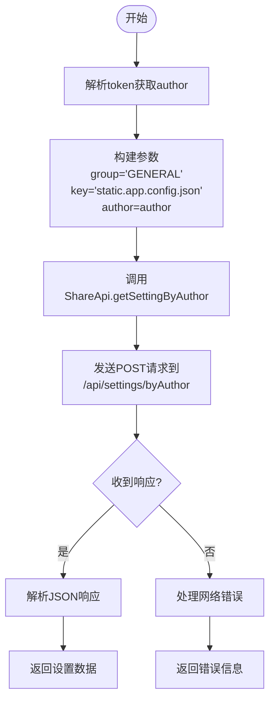
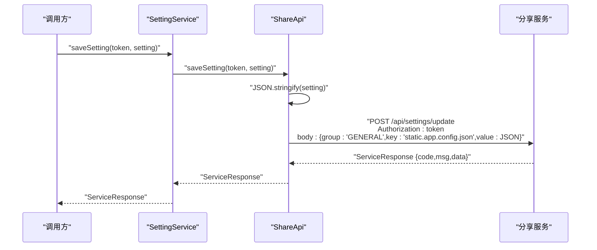
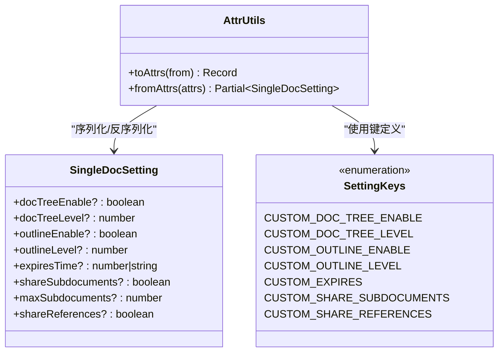
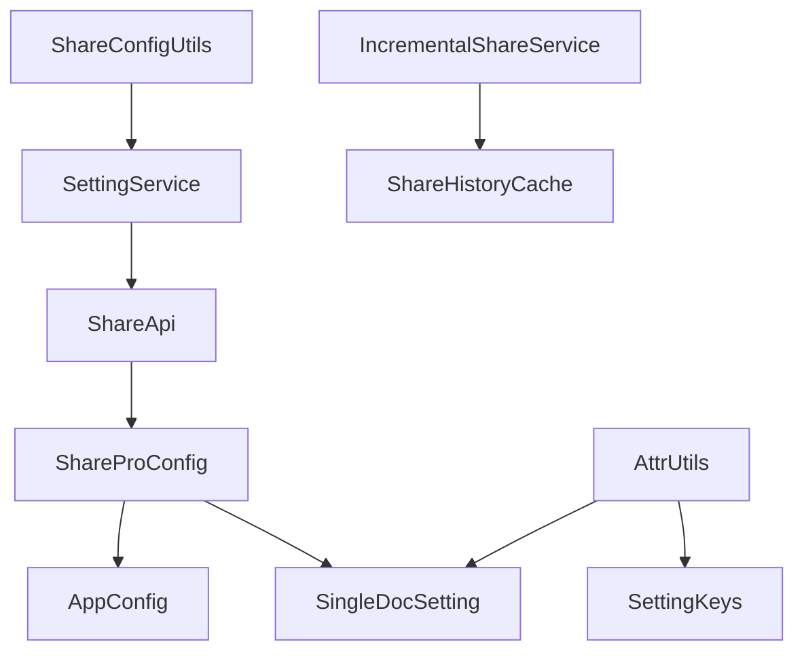

# 设置管理API

<cite>
**本文档引用的文件**
- [src/api/share-api.ts](file://src/api/share-api.ts)
- [src/service/SettingService.ts](file://src/service/SettingService.ts)
- [src/models/ShareProConfig.ts](file://src/models/ShareProConfig.ts)
- [src/models/AppConfig.ts](file://src/models/AppConfig.ts)
- [src/models/SingleDocSetting.ts](file://src/models/SingleDocSetting.ts)
- [src/utils/SettingKeys.ts](file://src/utils/SettingKeys.ts)
- [src/utils/AttrUtils.ts](file://src/utils/AttrUtils.ts)
- [src/utils/ShareConfigUtils.ts](file://src/utils/ShareConfigUtils.ts)
- [src/utils/ShareHistoryCache.ts](file://src/utils/ShareHistoryCache.ts)
- [src/service/IncrementalShareService.ts](file://src/service/IncrementalShareService.ts)
- [docs/incremental-share-context-2025-12-04.md](file://docs/incremental-share-context-2025-12-04.md)
- [openspec/changes/add-subdocument-sharing/specs/share/spec.md](file://openspec/changes/add-subdocument-sharing/specs/share/spec.md)
- [openspec/changes/archive/add-incremental-sharing/specs/share/spec.md](file://openspec/changes/archive/add-incremental-sharing/specs/share/spec.md)
- [TESTING_CHECKLIST.md](file://TESTING_CHECKLIST.md)
</cite>

## 目录
1. [简介](#简介)
2. [项目结构](#项目结构)
3. [核心组件](#核心组件)
4. [架构概览](#架构概览)
5. [详细组件分析](#详细组件分析)
6. [依赖分析](#依赖分析)
7. [性能考虑](#性能考虑)
8. [故障排除指南](#故障排除指南)
9. [结论](#结论)
10. [附录](#附录)

## 简介
本文件为设置管理功能的详细API文档，重点记录以下两个核心API的完整规范：
- `getSettingByAuthor`：按作者获取设置配置
- `saveSetting`：保存设置配置

文档涵盖作者设置的获取流程、配置参数结构、保存机制、序列化与反序列化过程、版本管理与冲突解决策略、权限控制与安全验证机制、缓存策略与同步机制，以及完整的配置示例和最佳实践。

## 项目结构
设置管理功能主要分布在以下模块：
- API层：负责与服务端交互，封装HTTP请求与响应
- 服务层：协调API调用与业务逻辑
- 模型层：定义配置数据结构（全局配置、单文档配置）
- 工具层：提供配置键定义、属性转换、默认配置等
- 缓存层：提供内存级缓存以优化性能

**图表来源**
- [src/api/share-api.ts:16-240](file://src/api/share-api.ts#L16-L240)
- [src/service/SettingService.ts:18-36](file://src/service/SettingService.ts#L18-L36)
- [src/models/ShareProConfig.ts:13-39](file://src/models/ShareProConfig.ts#L13-L39)
- [src/models/AppConfig.ts:12-85](file://src/models/AppConfig.ts#L12-L85)
- [src/models/SingleDocSetting.ts:18-82](file://src/models/SingleDocSetting.ts#L18-L82)
- [src/utils/SettingKeys.ts:13-72](file://src/utils/SettingKeys.ts#L13-L72)
- [src/utils/AttrUtils.ts:23-201](file://src/utils/AttrUtils.ts#L23-L201)
- [src/utils/ShareConfigUtils.ts:16-83](file://src/utils/ShareConfigUtils.ts#L16-L83)
- [src/utils/ShareHistoryCache.ts:19-90](file://src/utils/ShareHistoryCache.ts#L19-L90)
- [src/service/IncrementalShareService.ts:196-248](file://src/service/IncrementalShareService.ts#L196-L248)

**章节来源**
- [src/api/share-api.ts:16-240](file://src/api/share-api.ts#L16-L240)
- [src/service/SettingService.ts:18-36](file://src/service/SettingService.ts#L18-L36)
- [src/models/ShareProConfig.ts:13-39](file://src/models/ShareProConfig.ts#L13-L39)
- [src/models/AppConfig.ts:12-85](file://src/models/AppConfig.ts#L12-L85)
- [src/models/SingleDocSetting.ts:18-82](file://src/models/SingleDocSetting.ts#L18-L82)
- [src/utils/SettingKeys.ts:13-72](file://src/utils/SettingKeys.ts#L13-L72)
- [src/utils/AttrUtils.ts:23-201](file://src/utils/AttrUtils.ts#L23-L201)
- [src/utils/ShareConfigUtils.ts:16-83](file://src/utils/ShareConfigUtils.ts#L16-L83)
- [src/utils/ShareHistoryCache.ts:19-90](file://src/utils/ShareHistoryCache.ts#L19-L90)
- [src/service/IncrementalShareService.ts:196-248](file://src/service/IncrementalShareService.ts#L196-L248)

## 核心组件
本节深入分析设置管理的核心组件及其职责与交互关系。

### ShareApi（设置相关API）
- 职责：封装与服务端的设置交互，提供获取与保存设置的能力
- 关键方法：
  - `getSettingByAuthor(author)`：按作者获取设置配置
  - `saveSetting(token, setting)`：保存设置配置
- 请求构造：统一通过内部`shareServiceRequest`方法发送POST请求，自动携带Authorization头与JSON数据体
- 响应处理：返回标准ServiceResponse结构，包含code、msg、data字段

**章节来源**
- [src/api/share-api.ts:79-102](file://src/api/share-api.ts#L79-L102)
- [src/api/share-api.ts:173-209](file://src/api/share-api.ts#L173-L209)

### SettingService（设置服务）
- 职责：作为业务层协调者，向上层暴露简洁的设置管理接口
- 关键方法：
  - `getSettingByAuthor(author)`：委托ShareApi获取设置
  - `syncSetting(token, setting)`：委托ShareApi保存设置
- 依赖：ShareApi实例，用于实际的网络请求

**章节来源**
- [src/service/SettingService.ts:18-36](file://src/service/SettingService.ts#L18-L36)

### ShareProConfig（插件配置）
- 职责：承载插件运行所需的配置信息，包括服务端API配置、应用配置等
- 关键字段：
  - `serviceApiConfig`：服务端API配置（包含apiUrl、token等）
  - `appConfig`：应用全局配置
  - `siyuanConfig`：思源笔记客户端配置
- 作用：作为ShareApi发起请求时的配置来源

**章节来源**
- [src/models/ShareProConfig.ts:13-39](file://src/models/ShareProConfig.ts#L13-L39)

### AppConfig（全局应用配置）
- 职责：定义应用的全局配置结构，支持主题、域名、文档树、大纲、密码保护、子文档分享、引用文档分享、增量分享等配置
- 关键字段：
  - 主题配置：mode、lightTheme、darkTheme、themeVersion
  - 域名与路径：domains、domain、basePaths、docPath
  - 文档树与大纲：docTreeEnabled、docTreeLevel、outlineEnabled、outlineLevel
  - 密码保护：passwordEnabled、showPassword
  - 子文档分享：shareSubdocuments（专业版专属）
  - 引用文档分享：shareReferences（专业版专属）
  - 增量分享：incrementalShareConfig（包含enabled、lastShareTime、notebookBlacklist等）

**章节来源**
- [src/models/AppConfig.ts:12-85](file://src/models/AppConfig.ts#L12-L85)

### SingleDocSetting（单文档设置）
- 职责：定义单个文档级别的分享设置
- 关键字段：
  - 文档树：docTreeEnable、docTreeLevel
  - 大纲：outlineEnable、outlineLevel
  - 有效期：expiresTime（单位秒，0表示永久）
  - 子文档分享：shareSubdocuments
  - 子文档数量限制：maxSubdocuments（-1表示无限制）
  - 引用文档分享：shareReferences

**章节来源**
- [src/models/SingleDocSetting.ts:18-82](file://src/models/SingleDocSetting.ts#L18-L82)

### SettingKeys（配置键定义）
- 职责：统一管理设置配置的键名常量，确保前后端一致性
- 关键键值：
  - 文档树：CUSTOM_DOC_TREE_ENABLE、CUSTOM_DOC_TREE_LEVEL
  - 大纲：CUSTOM_OUTLINE_ENABLE、CUSTOM_OUTLINE_LEVEL
  - 有效期：CUSTOM_EXPIRES
  - 历史记录：CUSTOM_SHARE_HISTORY
  - 黑名单：CUSTOM_SHARE_BLACKLIST_DOCUMENT
  - 子文档分享：CUSTOM_SHARE_SUBDOCUMENTS
  - 引用文档分享：CUSTOM_SHARE_REFERENCES

**章节来源**
- [src/utils/SettingKeys.ts:13-72](file://src/utils/SettingKeys.ts#L13-L72)

### AttrUtils（属性序列化/反序列化）
- 职责：提供SingleDocSetting与文档属性之间的双向转换
- 序列化（对象→属性）：`toAttrs(partialSetting)` 将部分SingleDocSetting对象转换为键为SettingKeys枚举值的Record
- 反序列化（属性→对象）：`fromAttrs(attrs)` 将文档属性键值对转换为Partial<SingleDocSetting>对象
- 数字字段校验：对数值字段进行有效性检查，确保序列化后的字符串可正确解析
- 移除标记：当字段值无效或为空时，使用NULL_VALUE_FOR_SIYUAN_ATTR_REMOVE标记以触发属性移除

**章节来源**
- [src/utils/AttrUtils.ts:55-129](file://src/utils/AttrUtils.ts#L55-L129)
- [src/utils/AttrUtils.ts:136-197](file://src/utils/AttrUtils.ts#L136-L197)

### ShareConfigUtils（配置工具）
- 职责：提供默认配置、主题支持、版本映射以及配置同步工具
- 默认配置：DefaultAppConfig定义了应用的默认值，包括语言、站点信息、主题、增量分享默认启用、子文档分享默认禁用等
- 配置同步：`syncAppConfig(settingService, settingConfig)` 将appConfig通过SettingService同步到服务端
- 主题支持：提供明暗主题下的主题列表及版本映射

**章节来源**
- [src/utils/ShareConfigUtils.ts:16-83](file://src/utils/ShareConfigUtils.ts#L16-L83)

### ShareHistoryCache（历史缓存）
- 职责：提供内存级缓存，减少重复查询开销
- 缓存策略：5分钟TTL，支持get、set、invalidate、clear、getStats等操作
- 适用场景：增量分享服务中对分享历史记录的缓存

**章节来源**
- [src/utils/ShareHistoryCache.ts:19-90](file://src/utils/ShareHistoryCache.ts#L19-L90)

## 架构概览
设置管理的端到端流程如下：

**图表来源**
- [src/service/SettingService.ts:29-35](file://src/service/SettingService.ts#L29-L35)
- [src/api/share-api.ts:79-102](file://src/api/share-api.ts#L79-L102)
- [src/api/share-api.ts:173-209](file://src/api/share-api.ts#L173-L209)
- [src/models/ShareProConfig.ts:13-39](file://src/models/ShareProConfig.ts#L13-L39)

## 详细组件分析

### getSettingByAuthor API
- 功能：按作者标识获取设置配置
- 请求参数：
  - group：固定为"GENERAL"
  - key：固定为"static.app.config.json"
  - author：作者标识（从token中解析）
- 响应数据：服务端返回的设置数据（JSON格式）
- 安全与权限：
  - 通过Authorization头传递token，服务端基于token进行身份验证
  - 仅授权作者可访问其设置
- 错误处理：
  - 服务端返回非成功code时，调用方需根据msg进行处理
  - 网络异常时，调用方需进行重试或降级处理

**图表来源**
- [src/api/share-api.ts:79-88](file://src/api/share-api.ts#L79-L88)
- [docs/incremental-share-context-2025-12-04.md:103-131](file://docs/incremental-share-context-2025-12-04.md#L103-L131)

**章节来源**
- [src/api/share-api.ts:79-88](file://src/api/share-api.ts#L79-L88)
- [docs/incremental-share-context-2025-12-04.md:103-131](file://docs/incremental-share-context-2025-12-04.md#L103-L131)

### saveSetting API
- 功能：保存设置配置
- 请求参数：
  - group：固定为"GENERAL"
  - key：固定为"static.app.config.json"
  - value：JSON.stringify(setting)
  - Authorization：token
- 响应数据：标准ServiceResponse，包含code、msg、data
- 版本管理与冲突解决：
  - 服务端基于key进行覆盖式更新
  - 若存在并发更新，建议调用方在保存前先拉取最新配置，合并后再提交
- 权限控制：
  - 必须提供有效的Authorization token
  - 仅授权作者可修改其设置

**图表来源**
- [src/service/SettingService.ts:29-31](file://src/service/SettingService.ts#L29-L31)
- [src/api/share-api.ts:90-102](file://src/api/share-api.ts#L90-L102)

**章节来源**
- [src/service/SettingService.ts:29-31](file://src/service/SettingService.ts#L29-L31)
- [src/api/share-api.ts:90-102](file://src/api/share-api.ts#L90-L102)

### 配置参数结构
- 全局配置（AppConfig）：
  - 主题配置：mode、lightTheme、darkTheme、themeVersion
  - 域名与路径：domains、domain、basePaths、docPath
  - 文档树与大纲：docTreeEnabled、docTreeLevel、outlineEnabled、outlineLevel
  - 密码保护：passwordEnabled、showPassword
  - 子文档分享：shareSubdocuments（专业版专属）
  - 引用文档分享：shareReferences（专业版专属）
  - 增量分享：incrementalShareConfig（包含enabled、lastShareTime、notebookBlacklist等）
- 单文档配置（SingleDocSetting）：
  - 文档树：docTreeEnable、docTreeLevel
  - 大纲：outlineEnable、outlineLevel
  - 有效期：expiresTime（单位秒，0表示永久）
  - 子文档分享：shareSubdocuments
  - 子文档数量限制：maxSubdocuments（-1表示无限制）
  - 引用文档分享：shareReferences

**章节来源**
- [src/models/AppConfig.ts:12-85](file://src/models/AppConfig.ts#L12-L85)
- [src/models/SingleDocSetting.ts:18-82](file://src/models/SingleDocSetting.ts#L18-L82)

### 序列化与反序列化
- 序列化（对象→属性）：
  - 使用AttrUtils.toAttrs将部分SingleDocSetting对象转换为键为SettingKeys枚举值的Record
  - 数字字段进行有效性检查，无效值使用NULL_VALUE_FOR_SIYUAN_ATTR_REMOVE标记
- 反序列化（属性→对象）：
  - 使用AttrUtils.fromAttrs将文档属性键值对转换为Partial<SingleDocSetting>对象
  - 支持布尔值、数字、字符串的自动类型转换
- 适用场景：
  - 单文档设置的持久化与读取
  - 与思源笔记块属性的交互

**图表来源**
- [src/utils/AttrUtils.ts:55-129](file://src/utils/AttrUtils.ts#L55-L129)
- [src/utils/AttrUtils.ts:136-197](file://src/utils/AttrUtils.ts#L136-L197)
- [src/models/SingleDocSetting.ts:18-82](file://src/models/SingleDocSetting.ts#L18-L82)
- [src/utils/SettingKeys.ts:13-72](file://src/utils/SettingKeys.ts#L13-L72)

**章节来源**
- [src/utils/AttrUtils.ts:55-129](file://src/utils/AttrUtils.ts#L55-L129)
- [src/utils/AttrUtils.ts:136-197](file://src/utils/AttrUtils.ts#L136-L197)
- [src/models/SingleDocSetting.ts:18-82](file://src/models/SingleDocSetting.ts#L18-L82)
- [src/utils/SettingKeys.ts:13-72](file://src/utils/SettingKeys.ts#L13-L72)

### 版本管理与冲突解决
- 版本管理：
  - 采用基于key的覆盖式更新策略（GENERAL+static.app.config.json）
  - 建议在保存前先拉取最新配置，合并后再提交，以避免覆盖丢失
- 冲突解决：
  - 并发更新时，最后写入者覆盖先前写入者
  - 建议引入乐观锁或版本号机制（当前实现未包含）
- 增量分享配置的时间戳：
  - incrementalShareConfig.lastShareTime用于增量检测的时间基准
  - 首次分享时为undefined，分享完成后更新为当前时间戳

**章节来源**
- [src/models/AppConfig.ts:71-81](file://src/models/AppConfig.ts#L71-L81)
- [TESTING_CHECKLIST.md:578-606](file://TESTING_CHECKLIST.md#L578-L606)

### 权限控制与安全验证
- 身份验证：
  - 通过Authorization头携带token进行身份验证
  - 服务端基于token解析author，仅授权作者可访问其设置
- 数据安全：
  - 敏感配置（如密码保护）通过独立字段管理
  - 服务端对请求进行参数校验与权限检查
- 最佳实践：
  - token应妥善保管，避免泄露
  - 定期轮换token，降低风险

**章节来源**
- [src/api/share-api.ts:26-28](file://src/api/share-api.ts#L26-L28)
- [src/api/share-api.ts:90-99](file://src/api/share-api.ts#L90-L99)
- [docs/incremental-share-context-2025-12-04.md:121-128](file://docs/incremental-share-context-2025-12-04.md#L121-L128)

### 缓存策略与同步机制
- 缓存策略：
  - ShareHistoryCache提供5分钟TTL的内存级缓存
  - 适用于增量分享服务中的历史记录查询
- 同步机制：
  - 本地缓存与服务端配置同步
  - 分享成功后主动清除相关缓存，确保下次检测结果准确
- 性能优化：
  - 首次检测时可能进行全量扫描，后续检测利用lastShareTime进行增量检测
  - 缓存命中时几乎瞬时完成，提升用户体验

**章节来源**
- [src/utils/ShareHistoryCache.ts:19-90](file://src/utils/ShareHistoryCache.ts#L19-L90)
- [src/service/IncrementalShareService.ts:196-248](file://src/service/IncrementalShareService.ts#L196-L248)
- [TESTING_CHECKLIST.md:303-350](file://TESTING_CHECKLIST.md#L303-L350)

## 依赖分析
设置管理模块的依赖关系如下：

**图表来源**
- [src/service/SettingService.ts:18-36](file://src/service/SettingService.ts#L18-L36)
- [src/api/share-api.ts:16-240](file://src/api/share-api.ts#L16-L240)
- [src/models/ShareProConfig.ts:13-39](file://src/models/ShareProConfig.ts#L13-L39)
- [src/models/AppConfig.ts:12-85](file://src/models/AppConfig.ts#L12-L85)
- [src/models/SingleDocSetting.ts:18-82](file://src/models/SingleDocSetting.ts#L18-L82)
- [src/utils/AttrUtils.ts:23-201](file://src/utils/AttrUtils.ts#L23-L201)
- [src/utils/SettingKeys.ts:13-72](file://src/utils/SettingKeys.ts#L13-L72)
- [src/utils/ShareConfigUtils.ts:16-83](file://src/utils/ShareConfigUtils.ts#L16-L83)
- [src/utils/ShareHistoryCache.ts:19-90](file://src/utils/ShareHistoryCache.ts#L19-L90)
- [src/service/IncrementalShareService.ts:196-248](file://src/service/IncrementalShareService.ts#L196-L248)

**章节来源**
- [src/service/SettingService.ts:18-36](file://src/service/SettingService.ts#L18-L36)
- [src/api/share-api.ts:16-240](file://src/api/share-api.ts#L16-L240)
- [src/models/ShareProConfig.ts:13-39](file://src/models/ShareProConfig.ts#L13-L39)
- [src/models/AppConfig.ts:12-85](file://src/models/AppConfig.ts#L12-L85)
- [src/models/SingleDocSetting.ts:18-82](file://src/models/SingleDocSetting.ts#L18-L82)
- [src/utils/AttrUtils.ts:23-201](file://src/utils/AttrUtils.ts#L23-L201)
- [src/utils/SettingKeys.ts:13-72](file://src/utils/SettingKeys.ts#L13-L72)
- [src/utils/ShareConfigUtils.ts:16-83](file://src/utils/ShareConfigUtils.ts#L16-L83)
- [src/utils/ShareHistoryCache.ts:19-90](file://src/utils/ShareHistoryCache.ts#L19-L90)
- [src/service/IncrementalShareService.ts:196-248](file://src/service/IncrementalShareService.ts#L196-L248)

## 性能考虑
- 缓存命中率：增量分享场景下，合理利用缓存可显著降低响应时间
- 网络请求：批量操作时建议合并请求，减少网络往返
- 数据传输：仅传输必要的配置字段，避免冗余数据
- 重试策略：网络异常时采用指数退避策略，避免雪崩效应

## 故障排除指南
- 常见问题：
  - 无法连接服务端：检查serviceApiConfig.apiUrl与网络连通性
  - 认证失败：确认token有效且未过期
  - 配置未生效：确认配置已正确序列化并保存
- 调试建议：
  - 开启调试日志，观察请求与响应详情
  - 检查缓存状态，必要时手动清除缓存
  - 验证配置键值是否符合预期

**章节来源**
- [src/api/share-api.ts:173-209](file://src/api/share-api.ts#L173-L209)
- [src/utils/ShareHistoryCache.ts:61-86](file://src/utils/ShareHistoryCache.ts#L61-L86)

## 结论
设置管理API提供了完整的作者设置获取与保存能力，结合序列化/反序列化工具、缓存策略与安全验证机制，能够满足复杂场景下的配置管理需求。建议在生产环境中遵循本文档的最佳实践，确保配置的一致性、安全性与性能。

## 附录

### 配置示例与最佳实践
- 全局配置示例：
  - 主题配置：明暗主题切换、主题版本管理
  - 域名与路径：多域名支持、路径规划
  - 文档树与大纲：层级控制、展示开关
  - 子文档分享：默认关闭，按需开启
  - 增量分享：默认启用，合理设置黑名单
- 单文档配置示例：
  - 有效期设置：根据内容重要性设置有效期
  - 子文档数量限制：防止过度分享
- 最佳实践：
  - 保存前先拉取最新配置，避免覆盖丢失
  - 合理使用缓存，提升响应速度
  - 定期轮换token，保障安全

**章节来源**
- [src/utils/ShareConfigUtils.ts:16-83](file://src/utils/ShareConfigUtils.ts#L16-L83)
- [src/models/AppConfig.ts:12-85](file://src/models/AppConfig.ts#L12-L85)
- [src/models/SingleDocSetting.ts:18-82](file://src/models/SingleDocSetting.ts#L18-L82)

### 相关规范与要求
- 子文档分享扩展：
  - SettingKeys新增CUSTOM_SHARE_SUBDOCUMENTS键
  - ShareProConfig与ShareOptions支持shareSubdocuments字段
- 增量分享要求：
  - 支持智能重试、分页保护、UI集成等特性
  - 提供完整的国际化支持

**章节来源**
- [openspec/changes/add-subdocument-sharing/specs/share/spec.md:21-45](file://openspec/changes/add-subdocument-sharing/specs/share/spec.md#L21-L45)
- [openspec/changes/archive/add-incremental-sharing/specs/share/spec.md:75-112](file://openspec/changes/archive/add-incremental-sharing/specs/share/spec.md#L75-L112)