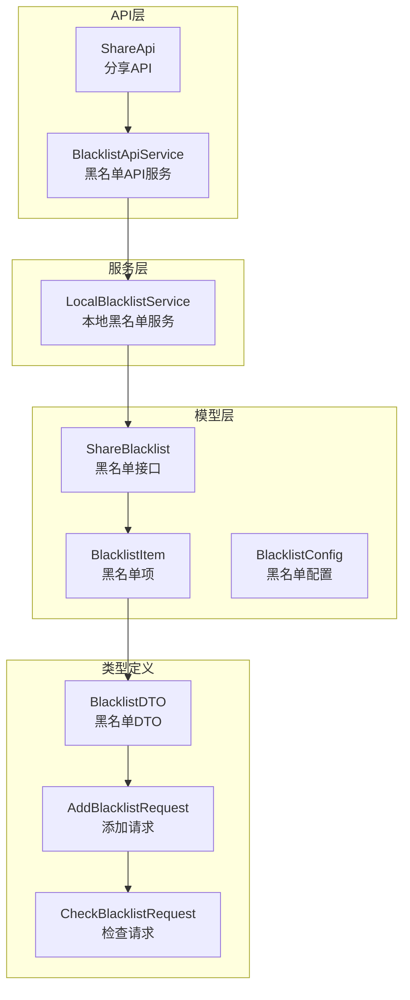
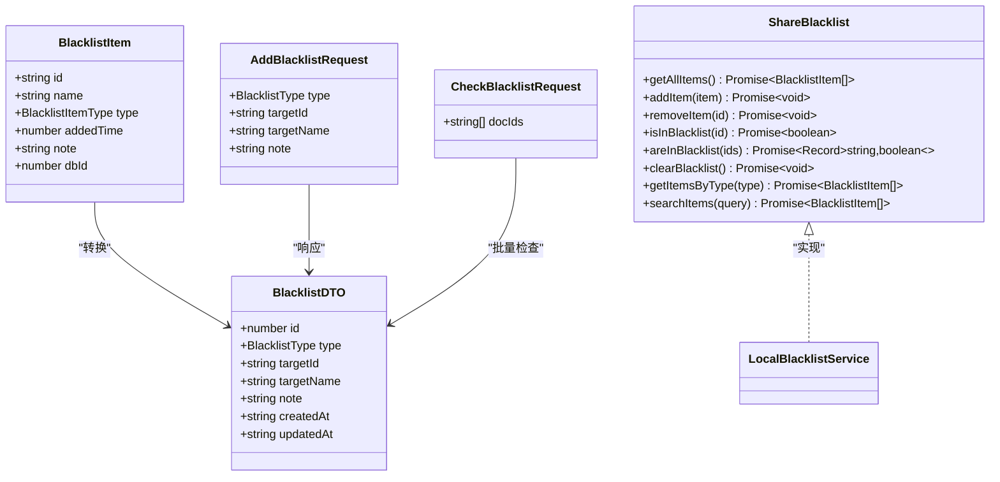
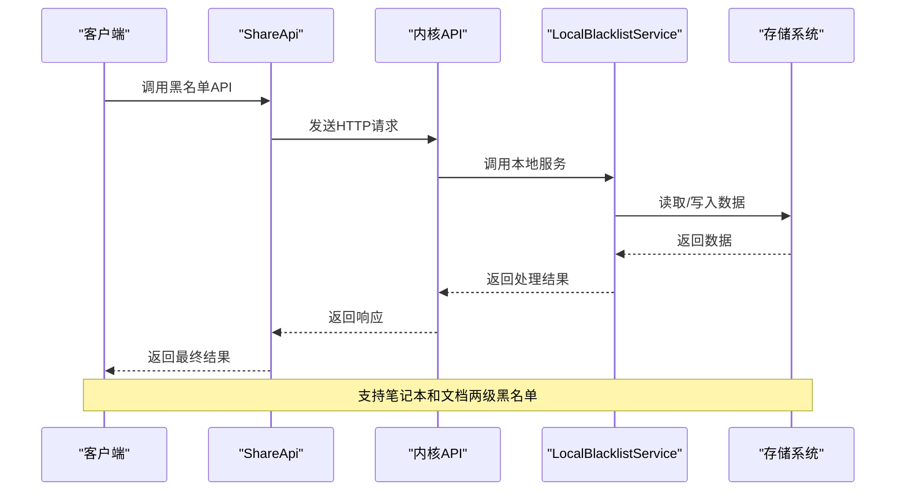
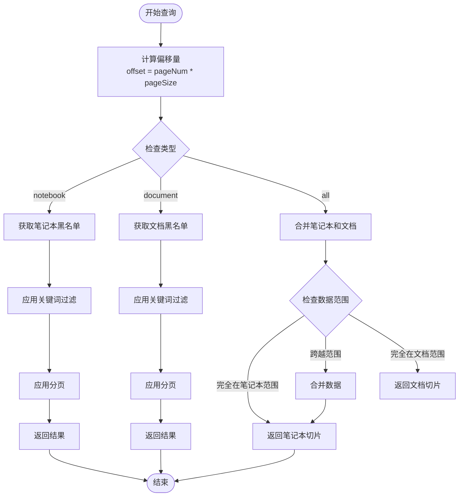
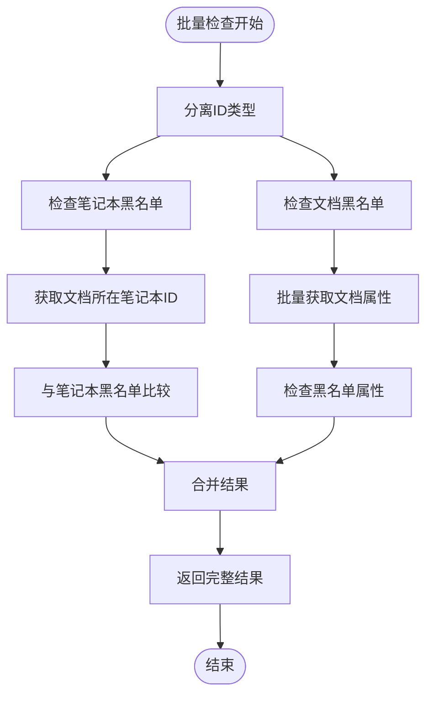
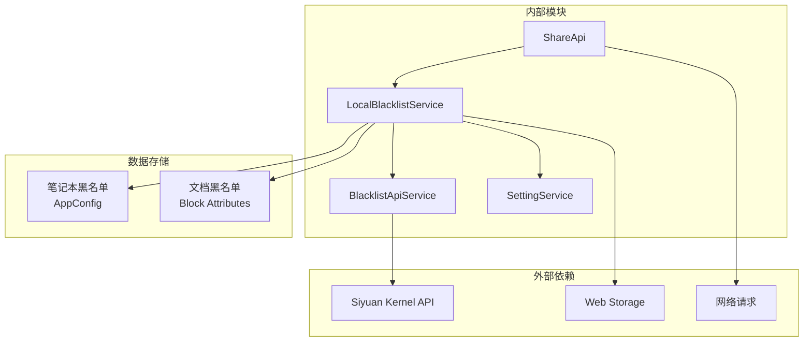

# 黑名单管理API

<cite>
**本文引用的文件**
- [share-api.ts](file://src/api/share-api.ts)
- [BlacklistApiService.ts](file://src/service/BlacklistApiService.ts)
- [LocalBlacklistService.ts](file://src/service/LocalBlacklistService.ts)
- [ShareBlacklist.ts](file://src/models/ShareBlacklist.ts)
- [share-blacklist.d.ts](file://src/types/share-blacklist.d.ts)
- [blacklist-api.d.ts](file://src/types/blacklist-api.d.ts)
- [SettingKeys.ts](file://src/utils/SettingKeys.ts)
- [AppConfig.ts](file://src/models/AppConfig.ts)
- [ShareProConfig.ts](file://src/models/ShareProConfig.ts)
- [BlacklistSetting.svelte](file://src/libs/pages/setting/BlacklistSetting.svelte)
</cite>

## 目录
1. [简介](#简介)
2. [项目结构](#项目结构)
3. [核心组件](#核心组件)
4. [架构概览](#架构概览)
5. [详细组件分析](#详细组件分析)
6. [依赖关系分析](#依赖关系分析)
7. [性能考虑](#性能考虑)
8. [故障排除指南](#故障排除指南)
9. [结论](#结论)
10. [附录](#附录)

## 简介

黑名单管理功能是思源笔记分享插件中的重要安全控制机制，用于限制特定笔记本和文档的分享权限。该功能提供了完整的黑名单管理API，包括黑名单列表查询、添加、删除和批量检查功能，支持分页查询和智能搜索，并集成了用户通知机制。

## 项目结构

黑名单管理功能涉及以下关键文件和模块：



**图表来源**
- [share-api.ts:117-151](file://src/api/share-api.ts#L117-L151)
- [LocalBlacklistService.ts:31-41](file://src/service/LocalBlacklistService.ts#L31-L41)
- [ShareBlacklist.ts:48-98](file://src/models/ShareBlacklist.ts#L48-L98)

**章节来源**
- [share-api.ts:117-151](file://src/api/share-api.ts#L117-L151)
- [LocalBlacklistService.ts:31-41](file://src/service/LocalBlacklistService.ts#L31-L41)
- [ShareBlacklist.ts:48-98](file://src/models/ShareBlacklist.ts#L48-L98)

## 核心组件

### 黑名单数据结构

黑名单系统采用统一的数据模型，支持两种类型的目标对象：



**图表来源**
- [ShareBlacklist.ts:18-48](file://src/models/ShareBlacklist.ts#L18-L48)
- [share-blacklist.d.ts:18-48](file://src/types/share-blacklist.d.ts#L18-L48)
- [blacklist-api.d.ts:18-98](file://src/types/blacklist-api.d.ts#L18-L98)

### 黑名单配置

黑名单功能通过增量分享配置进行管理：

| 配置项 | 类型 | 描述 | 默认值 |
|--------|------|------|--------|
| enabled | boolean | 是否启用黑名单功能 | false |
| notebookBlacklist | string[] | 笔记本黑名单列表 | [] |
| docBlacklist | string[] | 文档黑名单列表 | [] |

**章节来源**
- [ShareBlacklist.ts:83-98](file://src/models/ShareBlacklist.ts#L83-L98)
- [AppConfig.ts:71-81](file://src/models/AppConfig.ts#L71-L81)

## 架构概览

黑名单管理采用分层架构设计，实现了前后端分离和数据持久化：



**图表来源**
- [share-api.ts:173-209](file://src/api/share-api.ts#L173-L209)
- [LocalBlacklistService.ts:326-360](file://src/service/LocalBlacklistService.ts#L326-L360)

## 详细组件分析

### ShareApi - 主要API接口

ShareApi类提供了完整的黑名单管理API接口：

#### getBlacklistList - 获取黑名单列表

**功能描述**: 分页获取黑名单项列表，支持类型筛选和关键词搜索

**请求参数**:
- pageNum: number - 页码（从0开始）
- pageSize: number - 每页大小
- type: string - 类型筛选（可选："notebook"|"document"|"all"）

**响应数据**:
- code: number - 状态码
- msg: string - 消息
- data: BlacklistDTO[] - 黑名单项数组

**章节来源**
- [share-api.ts:120-124](file://src/api/share-api.ts#L120-L124)

#### addBlacklist - 添加黑名单项

**功能描述**: 添加新的黑名单项，支持笔记本和文档两种类型

**请求参数**:
- type: BlacklistType - 类型（"NOTEBOOK"|"DOCUMENT"）
- targetId: string - 目标ID（笔记本ID或文档ID）
- targetName: string - 目标名称
- note: string - 备注说明（可选）

**响应数据**:
- code: number - 状态码
- msg: string - 消息
- data: BlacklistDTO - 新增的黑名单项

**章节来源**
- [share-api.ts:129-133](file://src/api/share-api.ts#L129-L133)

#### deleteBlacklist - 删除黑名单项

**功能描述**: 删除指定的黑名单项

**请求参数**:
- id: number - 黑名单项ID

**响应数据**:
- code: number - 状态码
- msg: string - 消息
- data: any - 删除结果

**章节来源**
- [share-api.ts:138-142](file://src/api/share-api.ts#L138-L142)

#### checkBlacklist - 批量检查黑名单

**功能描述**: 批量检查多个文档ID是否在黑名单中

**请求参数**:
- docIds: string[] - 文档ID数组

**响应数据**:
- code: number - 状态码
- msg: string - 消息
- data: Record<string, boolean> - 检查结果映射

**章节来源**
- [share-api.ts:147-151](file://src/api/share-api.ts#L147-L151)

### LocalBlacklistService - 本地服务实现

LocalBlacklistService实现了完整的黑名单管理逻辑：

#### 分页查询机制



**图表来源**
- [LocalBlacklistService.ts:50-118](file://src/service/LocalBlacklistService.ts#L50-L118)

#### 批量检查优化算法

LocalBlacklistService采用了高效的批量检查算法：



**图表来源**
- [LocalBlacklistService.ts:221-249](file://src/service/LocalBlacklistService.ts#L221-L249)

**章节来源**
- [LocalBlacklistService.ts:221-249](file://src/service/LocalBlacklistService.ts#L221-L249)

### BlacklistApiService - 内核API服务

BlacklistApiService封装了与思源内核的交互：

#### 搜索功能

- **searchDocuments**: 搜索文档，支持关键词匹配
- **searchNotebooks**: 搜索笔记本，支持关键词匹配

这些方法使用SQL查询和内核API来实现高效的搜索功能。

**章节来源**
- [BlacklistApiService.ts:34-74](file://src/service/BlacklistApiService.ts#L34-L74)

## 依赖关系分析

黑名单管理系统的依赖关系如下：



**图表来源**
- [LocalBlacklistService.ts:37-41](file://src/service/LocalBlacklistService.ts#L37-L41)
- [BlacklistApiService.ts:37-49](file://src/service/BlacklistApiService.ts#L37-L49)

**章节来源**
- [LocalBlacklistService.ts:37-41](file://src/service/LocalBlacklistService.ts#L37-L41)
- [BlacklistApiService.ts:37-49](file://src/service/BlacklistApiService.ts#L37-L49)

## 性能考虑

### 查询优化策略

1. **批量操作**: 批量检查黑名单时，使用批量获取文档属性的方式减少API调用次数
2. **分页机制**: 支持大数据量的分页查询，避免一次性加载过多数据
3. **缓存策略**: 利用Set数据结构进行快速查找和去重
4. **SQL优化**: 使用合适的SQL查询语句和LIMIT/OFFSET进行分页

### 内存管理

- 使用流式处理避免大量数据同时驻留内存
- 及时释放不再使用的临时变量
- 对于大型查询结果进行适当的截断处理

## 故障排除指南

### 常见问题及解决方案

#### API调用失败

**症状**: 调用黑名单API时返回错误

**可能原因**:
1. 分享服务URL未配置
2. Token验证失败
3. 网络连接异常

**解决方法**:
- 检查ShareProConfig中的serviceApiConfig配置
- 验证Authorization头信息
- 确认网络连接状态

#### 黑名单检查结果异常

**症状**: 批量检查返回的结果不准确

**可能原因**:
1. 文档属性获取失败
2. 笔记本ID解析错误
3. 缓存数据过期

**解决方法**:
- 检查文档属性设置是否正确
- 验证笔记本ID格式
- 清理缓存后重新尝试

#### 分页查询问题

**症状**: 分页查询结果不完整或重复

**可能原因**:
1. 分页参数计算错误
2. 数据排序不一致
3. 并发修改导致的数据不一致

**解决方法**:
- 检查pageNum和pageSize参数
- 确保查询排序字段一致
- 实施适当的并发控制

**章节来源**
- [share-api.ts:186-209](file://src/api/share-api.ts#L186-L209)
- [LocalBlacklistService.ts:114-118](file://src/service/LocalBlacklistService.ts#L114-L118)

## 结论

黑名单管理API提供了完整的黑名单控制功能，包括：

1. **完整的API覆盖**: 支持黑名单的增删改查和批量检查
2. **高效的实现**: 采用批量操作和分页查询优化性能
3. **灵活的配置**: 支持笔记本和文档两级黑名单管理
4. **完善的错误处理**: 提供详细的错误信息和恢复机制
5. **用户友好的界面**: 集成到插件设置页面，提供直观的操作体验

该系统为思源笔记分享功能提供了重要的安全控制机制，有效防止敏感内容的不当分享。

## 附录

### API调用示例

#### 获取黑名单列表
```javascript
// 请求示例
{
  "pageNum": 0,
  "pageSize": 10,
  "type": "all"
}

// 响应示例
{
  "code": 200,
  "msg": "success",
  "data": [
    {
      "id": 1,
      "type": "NOTEBOOK",
      "targetId": "notebook-id",
      "targetName": "笔记本名称",
      "note": "备注",
      "createdAt": "2025-01-01T00:00:00Z",
      "updatedAt": "2025-01-01T00:00:00Z"
    }
  ]
}
```

#### 添加黑名单项
```javascript
// 请求示例
{
  "type": "DOCUMENT",
  "targetId": "doc-id",
  "targetName": "文档标题",
  "note": "添加原因"
}

// 响应示例
{
  "code": 200,
  "msg": "success",
  "data": {
    "id": 2,
    "type": "DOCUMENT",
    "targetId": "doc-id",
    "targetName": "文档标题",
    "note": "添加原因",
    "createdAt": "2025-01-01T00:00:00Z",
    "updatedAt": "2025-01-01T00:00:00Z"
  }
}
```

#### 批量检查黑名单
```javascript
// 请求示例
{
  "docIds": ["doc1", "doc2", "doc3"]
}

// 响应示例
{
  "code": 200,
  "msg": "success",
  "data": {
    "doc1": true,
    "doc2": false,
    "doc3": true
  }
}
```

### 错误码说明

| 错误码 | 描述 | 处理建议 |
|--------|------|----------|
| 200 | 成功 | 正常处理响应数据 |
| 400 | 参数错误 | 检查请求参数格式 |
| 401 | 未授权 | 验证Token有效性 |
| 404 | 资源不存在 | 检查目标ID是否存在 |
| 500 | 服务器错误 | 重试请求或联系管理员 |

### 配置选项

#### 黑名单配置参数

| 参数名 | 类型 | 必填 | 描述 | 示例值 |
|--------|------|------|------|--------|
| enabled | boolean | 否 | 是否启用黑名单功能 | true |
| notebookBlacklist | string[] | 否 | 笔记本黑名单列表 | ["nb1","nb2"] |
| docBlacklist | string[] | 否 | 文档黑名单列表 | ["doc1","doc2"] |

#### 分页参数

| 参数名 | 类型 | 必填 | 描述 | 默认值 |
|--------|------|------|------|--------|
| pageNum | number | 是 | 页码（从0开始） | 0 |
| pageSize | number | 是 | 每页大小 | 10 |
| type | string | 否 | 类型筛选 | "all" |
| query | string | 否 | 搜索关键词 | "" |