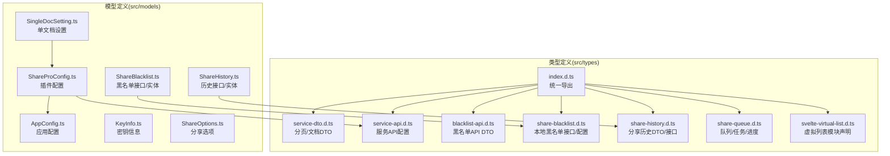
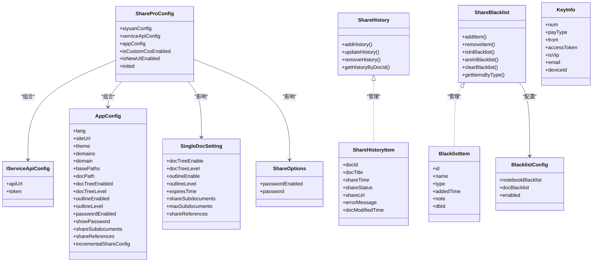
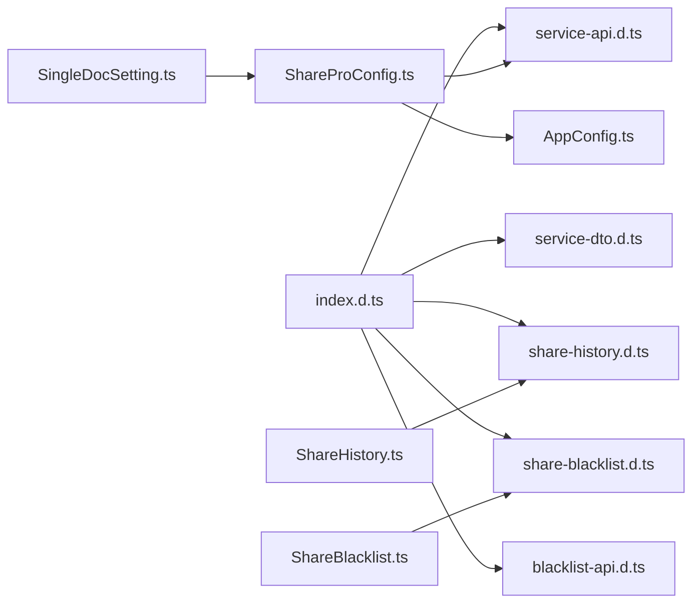

# 类型定义参考

<cite>
**本文引用的文件**
- [src/types/index.d.ts](file://src/types/index.d.ts)
- [src/types/service-dto.d.ts](file://src/types/service-dto.d.ts)
- [src/types/service-api.d.ts](file://src/types/service-api.d.ts)
- [src/types/blacklist-api.d.ts](file://src/types/blacklist-api.d.ts)
- [src/types/share-blacklist.d.ts](file://src/types/share-blacklist.d.ts)
- [src/types/share-history.d.ts](file://src/types/share-history.d.ts)
- [src/types/share-queue.d.ts](file://src/types/share-queue.d.ts)
- [src/types/svelte-virtual-list.d.ts](file://src/types/svelte-virtual-list.d.ts)
- [src/models/ShareProConfig.ts](file://src/models/ShareProConfig.ts)
- [src/models/SingleDocSetting.ts](file://src/models/SingleDocSetting.ts)
- [src/models/ShareHistory.ts](file://src/models/ShareHistory.ts)
- [src/models/AppConfig.ts](file://src/models/AppConfig.ts)
- [src/models/KeyInfo.ts](file://src/models/KeyInfo.ts)
- [src/models/ShareOptions.ts](file://src/models/ShareOptions.ts)
- [src/models/ShareBlacklist.ts](file://src/models/ShareBlacklist.ts)
</cite>

## 目录
1. [简介](#简介)
2. [项目结构](#项目结构)
3. [核心组件](#核心组件)
4. [架构总览](#架构总览)
5. [详细组件分析](#详细组件分析)
6. [依赖分析](#依赖分析)
7. [性能考虑](#性能考虑)
8. [故障排除指南](#故障排除指南)
9. [结论](#结论)
10. [附录](#附录)

## 简介
本文件为“思源笔记分享专业版”的 TypeScript 类型定义参考文档，覆盖接口类型、DTO 对象、枚举与泛型定义，重点包括：
- ServiceResponse 标准响应格式（在本仓库未直接出现，但可作为通用约定）
- ShareProConfig 插件配置类型
- SingleDocSetting 文档设置类型
- ShareHistory 分享历史类型
- ShareQueueService 队列服务相关类型
- 黑名单、分页、服务 API、虚拟列表等类型

文档同时记录各类型的属性结构、数据类型约束、可选属性与默认值，并提供类型使用示例与类型守卫建议，以及类型之间的继承与组合关系。

## 项目结构
类型定义主要分布在 src/types 与 src/models 两个目录：
- src/types：集中导出与声明各类 DTO、接口与模块声明
- src/models：以类或接口形式表达业务配置与实体

图表来源
- [src/types/index.d.ts:13-18](file://src/types/index.d.ts#L13-L18)
- [src/types/service-dto.d.ts:10-134](file://src/types/service-dto.d.ts#L10-L134)
- [src/types/service-api.d.ts:10-17](file://src/types/service-api.d.ts#L10-L17)
- [src/types/blacklist-api.d.ts:10-99](file://src/types/blacklist-api.d.ts#L10-L99)
- [src/types/share-blacklist.d.ts:10-114](file://src/types/share-blacklist.d.ts#L10-L114)
- [src/types/share-history.d.ts:10-59](file://src/types/share-history.d.ts#L10-L59)
- [src/types/share-queue.d.ts:10-149](file://src/types/share-queue.d.ts#L10-L149)
- [src/types/svelte-virtual-list.d.ts:10-28](file://src/types/svelte-virtual-list.d.ts#L10-L28)
- [src/models/ShareProConfig.ts:10-40](file://src/models/ShareProConfig.ts#L10-L40)
- [src/models/SingleDocSetting.ts:10-85](file://src/models/SingleDocSetting.ts#L10-L85)
- [src/models/ShareHistory.ts:10-74](file://src/models/ShareHistory.ts#L10-L74)
- [src/models/AppConfig.ts:10-88](file://src/models/AppConfig.ts#L10-L88)
- [src/models/KeyInfo.ts:10-21](file://src/models/KeyInfo.ts#L10-L21)
- [src/models/ShareOptions.ts:10-27](file://src/models/ShareOptions.ts#L10-L27)
- [src/models/ShareBlacklist.ts:10-99](file://src/models/ShareBlacklist.ts#L10-L99)

章节来源
- [src/types/index.d.ts:10-18](file://src/types/index.d.ts#L10-L18)

## 核心组件
本节对关键类型进行概览性说明，便于快速定位与理解。

- 分页与文档 DTO
  - PageDTO<T>：包含 pageNum、pageSize、search 等分页参数
  - PageResponseDTO<T>：包含 total、pageNum、pageSize、totalPages、data、排序与搜索字段
  - DocDTO：包含 docId、author、docDomain、data（title/dateCreated/dateUpdated）、media、status、createdAt
  - DocDataDTO：包含 title、dateCreated、dateUpdated

- 服务 API 配置
  - IServiceApiConfig：包含 apiUrl、token

- 黑名单类型
  - BlacklistType：枚举值为 NOTEBOOK 或 DOCUMENT
  - BlacklistDTO：服务端返回的黑名单项，包含 id、type、targetId、targetName、note、createdAt、updatedAt
  - AddBlacklistRequest/DeleteBlacklistRequest/CheckBlacklistRequest：添加/删除/检查黑名单的请求结构
  - 本地黑名单接口与配置
    - BlacklistItemType：枚举值为 notebook 或 document
    - BlacklistItem：本地黑名单项，包含 id、name、type、addedTime、note、dbId
    - ShareBlacklist：本地黑名单管理接口方法集合
    - BlacklistConfig：黑名单配置，包含 notebookBlacklist、docBlacklist、enabled

- 分享历史
  - ShareHistoryItem：包含 docId、docTitle、shareTime、shareStatus、shareUrl、errorMessage、docModifiedTime
  - IShareHistoryService：按文档 ID 查询历史的方法接口
  - 模型层 ShareHistory：包含历史实体与增删改查接口

- 分享队列
  - ShareQueueStatus：枚举 idle、running、paused、completed、error
  - QueueTaskStatus：枚举 pending、processing、success、failed、skipped
  - QueueTask：包含 docId、docTitle、status、errorMessage、retryCount、shareUrl、createdAt、completedAt
  - ShareQueue：包含 queueId、status、tasks、createdAt、startedAt、completedAt、pausedAt
  - QueueProgress：包含 total、completed、success、failed、skipped、processing、pending、estimatedTimeRemaining

- 应用与插件配置
  - ShareProConfig：包含 siyuanConfig（含 apiUrl/token/cookie 及 preferenceConfig）、serviceApiConfig、appConfig、isCustomCssEnabled、isNewUIEnabled、inited
  - SingleDocSetting：包含 docTreeEnable/docTreeLevel、outlineEnable/outlineLevel、expiresTime、shareSubdocuments/maxSubdocuments、shareReferences
  - AppConfig：包含语言、站点信息、主题、自定义 CSS、域名/路径配置、全局密码保护、子文档/引用文档分享、增量分享配置等
  - ShareOptions：包含 passwordEnabled/password，默认值 passwordEnabled=false、password=""
  - KeyInfo：包含 num、payType、from、accessToken、isVip、email、deviceId

- 第三方模块声明
  - svelte-virtual-list：VirtualList 组件的 props 与默认导出声明

章节来源
- [src/types/service-dto.d.ts:10-134](file://src/types/service-dto.d.ts#L10-L134)
- [src/types/service-api.d.ts:10-17](file://src/types/service-api.d.ts#L10-L17)
- [src/types/blacklist-api.d.ts:10-99](file://src/types/blacklist-api.d.ts#L10-L99)
- [src/types/share-blacklist.d.ts:10-114](file://src/types/share-blacklist.d.ts#L10-L114)
- [src/types/share-history.d.ts:10-59](file://src/types/share-history.d.ts#L10-L59)
- [src/types/share-queue.d.ts:10-149](file://src/types/share-queue.d.ts#L10-L149)
- [src/models/ShareProConfig.ts:10-40](file://src/models/ShareProConfig.ts#L10-L40)
- [src/models/SingleDocSetting.ts:10-85](file://src/models/SingleDocSetting.ts#L10-L85)
- [src/models/ShareHistory.ts:10-74](file://src/models/ShareHistory.ts#L10-L74)
- [src/models/AppConfig.ts:10-88](file://src/models/AppConfig.ts#L10-L88)
- [src/models/ShareOptions.ts:10-27](file://src/models/ShareOptions.ts#L10-L27)
- [src/models/KeyInfo.ts:10-21](file://src/models/KeyInfo.ts#L10-L21)
- [src/types/svelte-virtual-list.d.ts:10-28](file://src/types/svelte-virtual-list.d.ts#L10-L28)

## 架构总览
下图展示类型与模型之间的关系与职责划分：

图表来源
- [src/models/ShareProConfig.ts:10-40](file://src/models/ShareProConfig.ts#L10-L40)
- [src/models/AppConfig.ts:10-88](file://src/models/AppConfig.ts#L10-L88)
- [src/types/service-api.d.ts:10-17](file://src/types/service-api.d.ts#L10-L17)
- [src/models/SingleDocSetting.ts:10-85](file://src/models/SingleDocSetting.ts#L10-L85)
- [src/models/ShareHistory.ts:10-74](file://src/models/ShareHistory.ts#L10-L74)
- [src/types/share-blacklist.d.ts:10-114](file://src/types/share-blacklist.d.ts#L10-L114)
- [src/models/ShareOptions.ts:10-27](file://src/models/ShareOptions.ts#L10-L27)
- [src/models/KeyInfo.ts:10-21](file://src/models/KeyInfo.ts#L10-L21)

## 详细组件分析

### 分页与文档 DTO
- PageDTO<T>
  - 属性：pageNum（number）、pageSize（number）、search（string，可选）
  - 用途：作为分页查询的输入参数载体
- PageResponseDTO<T>
  - 属性：total、pageSize、pageNum、totalPages、data（T[]）、order/direction（可选）、search（可选）
  - 用途：作为分页查询的标准响应载体
- DocDataDTO
  - 属性：title、dateCreated、dateUpdated（均为 string）
  - 用途：封装文档元数据
- DocDTO
  - 属性：docId（string）、author（string）、docDomain（string，可选）、data（DocDataDTO）、media（any[]）、status（"PENDING"|"PROCESSING"|"COMPLETED"|"FAILED"）、createdAt（string）
  - 用途：服务端返回的文档信息载体

章节来源
- [src/types/service-dto.d.ts:10-134](file://src/types/service-dto.d.ts#L10-L134)

### 服务 API 配置
- IServiceApiConfig
  - 属性：apiUrl（string，可选）、token（string，可选）
  - 用途：统一承载服务端 API 的访问地址与令牌

章节来源
- [src/types/service-api.d.ts:10-17](file://src/types/service-api.d.ts#L10-L17)

### 黑名单类型与接口
- BlacklistType
  - 取值："NOTEBOOK" | "DOCUMENT"
- BlacklistDTO
  - 属性：id（number）、type（BlacklistType）、targetId（string）、targetName（string）、note（string，可选）、createdAt/updatedAt（string）
  - 用途：服务端返回的黑名单项
- AddBlacklistRequest/DeleteBlacklistRequest/CheckBlacklistRequest
  - AddBlacklistRequest：type、targetId、targetName、note（可选）
  - DeleteBlacklistRequest：id（number）
  - CheckBlacklistRequest：docIds（string[]）
- 本地黑名单
  - BlacklistItemType：取值 "notebook" | "document"
  - BlacklistItem：id、name、type、addedTime、note（可选）、dbId（可选）
  - ShareBlacklist：addItem/removeItem/isInBlacklist/areInBlacklist/clearBlacklist/getItemsByType/searchItems
  - BlacklistConfig：notebookBlacklist、docBlacklist、enabled

章节来源
- [src/types/blacklist-api.d.ts:10-99](file://src/types/blacklist-api.d.ts#L10-L99)
- [src/types/share-blacklist.d.ts:10-114](file://src/types/share-blacklist.d.ts#L10-L114)

### 分享历史类型
- ShareHistoryItem
  - 属性：docId、docTitle、shareTime（number）、shareStatus（"success"|"failed"|"pending"）、shareUrl（string，可选）、errorMessage（string，可选）、docModifiedTime（number）
- IShareHistoryService
  - 方法：getHistoryByIds(docIds: string[]): Promise<Array<ShareHistoryItem> | undefined>
- 模型层 ShareHistory
  - 接口：addHistory/updateHistory/removeHistory/getHistoryByDocId
  - 实体：与 DTO 结构一致

章节来源
- [src/types/share-history.d.ts:10-59](file://src/types/share-history.d.ts#L10-L59)
- [src/models/ShareHistory.ts:10-74](file://src/models/ShareHistory.ts#L10-L74)

### 分享队列类型
- ShareQueueStatus：取值 "idle"|"running"|"paused"|"completed"|"error"
- QueueTaskStatus：取值 "pending"|"processing"|"success"|"failed"|"skipped"
- QueueTask
  - 属性：docId、docTitle、status、errorMessage（可选）、retryCount（可选）、shareUrl（可选）、createdAt、completedAt（可选）
- ShareQueue
  - 属性：queueId、status、tasks（QueueTask[]）、createdAt、startedAt（可选）、completedAt（可选）、pausedAt（可选）
- QueueProgress
  - 属性：total、completed、success、failed、skipped、processing、pending、estimatedTimeRemaining（可选）

章节来源
- [src/types/share-queue.d.ts:10-149](file://src/types/share-queue.d.ts#L10-L149)

### 插件与应用配置类型
- ShareProConfig
  - 属性：siyuanConfig（含 apiUrl、token、cookie、preferenceConfig：fixTitle、docTreeEnable、docTreeLevel、outlineEnable、outlineLevel）、serviceApiConfig（IServiceApiConfig）、appConfig（AppConfig）、isCustomCssEnabled、isNewUIEnabled、inited
- SingleDocSetting
  - 属性：docTreeEnable、docTreeLevel、outlineEnable、outlineLevel、expiresTime（number|string）、shareSubdocuments、maxSubdocuments、shareReferences
- AppConfig
  - 属性：lang、siteUrl、siteTitle、siteSlogan、siteDescription、homePageId、header、footer、shareTemplate、theme（mode/lightTheme/darkTheme/themeVersion）、customCss、themeConfig（logo）、domains、domain、basePaths、docPath、docTreeEnabled、docTreeLevel、outlineEnabled、outlineLevel、passwordEnabled、showPassword、shareSubdocuments、shareReferences、incrementalShareConfig（enabled、lastShareTime、notebookBlacklist）
- ShareOptions
  - 属性：passwordEnabled（默认 false）、password（默认 ""）
- KeyInfo
  - 属性：num、payType、from、accessToken、isVip、email、deviceId

章节来源
- [src/models/ShareProConfig.ts:10-40](file://src/models/ShareProConfig.ts#L10-L40)
- [src/models/SingleDocSetting.ts:10-85](file://src/models/SingleDocSetting.ts#L10-L85)
- [src/models/AppConfig.ts:10-88](file://src/models/AppConfig.ts#L10-L88)
- [src/models/ShareOptions.ts:10-27](file://src/models/ShareOptions.ts#L10-L27)
- [src/models/KeyInfo.ts:10-21](file://src/models/KeyInfo.ts#L10-L21)

### 第三方模块声明
- svelte-virtual-list
  - VirtualListProps：items（any[]）、height（string|number，可选）、itemHeight（number，可选）、start/end（number，可选）
  - 默认导出类 VirtualList 继承自 SvelteComponent，带默认插槽

章节来源
- [src/types/svelte-virtual-list.d.ts:10-28](file://src/types/svelte-virtual-list.d.ts#L10-L28)

## 依赖分析
- 统一导出
  - src/types/index.d.ts 将 service-api、service-dto、share-history、share-blacklist、blacklist-api 进行集中导出，便于上层模块统一引入
- 组合关系
  - ShareProConfig 组合了 IServiceApiConfig 与 AppConfig，体现插件配置与应用配置的耦合
  - ShareHistory 与 ShareHistoryItem 在接口与实体层面保持一致性
  - ShareBlacklist 与 BlacklistItem/BlacklistConfig 形成管理-实体-配置的组合
- 泛型与枚举
  - PageDTO<T>/PageResponseDTO<T> 使用泛型承载任意数据类型
  - 多处使用字面量联合类型（如 DocDTO.status、ShareHistoryItem.shareStatus、QueueTaskStatus 等）表达明确取值范围

图表来源
- [src/types/index.d.ts:13-18](file://src/types/index.d.ts#L13-L18)
- [src/models/ShareProConfig.ts:10-40](file://src/models/ShareProConfig.ts#L10-L40)
- [src/models/ShareHistory.ts:10-74](file://src/models/ShareHistory.ts#L10-L74)
- [src/models/ShareBlacklist.ts:10-99](file://src/models/ShareBlacklist.ts#L10-L99)

章节来源
- [src/types/index.d.ts:13-18](file://src/types/index.d.ts#L13-L18)

## 性能考虑
- 分页 DTO
  - PageDTO<T> 与 PageResponseDTO<T> 通过 total、pageSize、pageNum、totalPages 提供高效的数据分页能力，避免一次性加载大量数据
- 队列与进度
  - ShareQueue 与 QueueProgress 提供任务状态跟踪与进度统计，有助于控制并发与资源占用
- 可选字段
  - 大量可选字段（如 errorMessage、shareUrl、note、dbId 等）允许在不同场景下灵活扩展，减少不必要的内存占用
- 默认值
  - ShareOptions 的默认值可降低初始化成本，避免重复赋值

## 故障排除指南
- 类型不匹配
  - 若发现 DocDTO.status 与期望不符，请确认其取值范围为 "PENDING"|"PROCESSING"|"COMPLETED"|"FAILED"
- 分页异常
  - 检查 PageDTO 的 pageNum/pageSize 是否合理；PageResponseDTO 的 total 与 totalPages 是否与实际数据一致
- 队列状态异常
  - 确认 ShareQueueStatus 与 QueueTaskStatus 的取值范围，避免使用未支持的状态值
- 黑名单检查
  - 使用 ShareBlacklist 的 isInBlacklist/areInBlacklist 方法进行批量校验，确保目标 ID 正确传入
- 配置缺失
  - 若 IServiceApiConfig 缺少 apiUrl 或 token，可能导致服务调用失败；请在 ShareProConfig 中正确配置

## 结论
本文档系统梳理了“思源笔记分享专业版”中的类型定义，涵盖分页、文档、服务 API、黑名单、历史、队列、配置与第三方模块声明等核心类型。通过明确的属性结构、取值范围与组合关系，开发者可以更安全地进行类型驱动开发，并在需要时扩展或替换相应实现。

## 附录

### 类型使用示例与类型守卫建议
- 分页查询
  - 输入：PageDTO<T>（例如 pageNum=0、pageSize=20、search="关键词"）
  - 输出：PageResponseDTO<T>（例如 total、data[]、totalPages）
- 文档分享
  - 输入：DocDTO（例如 docId、status、data.title）
  - 输出：根据业务生成分享链接或错误信息
- 黑名单管理
  - 新增：AddBlacklistRequest（type、targetId、targetName、note）
  - 检查：CheckBlacklistRequest（docIds[]）
  - 删除：DeleteBlacklistRequest（id）
- 队列执行
  - 初始化：ShareQueue（queueId、status、tasks[]）
  - 进度：QueueProgress（completed、success、failed、processing、pending）
- 配置读取
  - 读取：ShareProConfig.serviceApiConfig.apiUrl/token
  - 单文档：SingleDocSetting.docTreeEnable/docTreeLevel/outlineEnable/outlineLevel/expiresTime/shareSubdocuments/maxSubdocuments/shareReferences

### 类型守卫函数建议
- 状态守卫
  - 为 ShareQueueStatus/QueueTaskStatus/DocDTO.status/ShareHistoryItem.shareStatus 提供类型守卫函数，确保运行时状态合法
- 配置守卫
  - 为 IServiceApiConfig/ShareProConfig/AppConfig 提供验证函数，确保必要字段存在且类型正确
- 黑名单守卫
  - 为 BlacklistType/BlacklistItemType 提供转换与校验函数，避免非法值进入业务逻辑