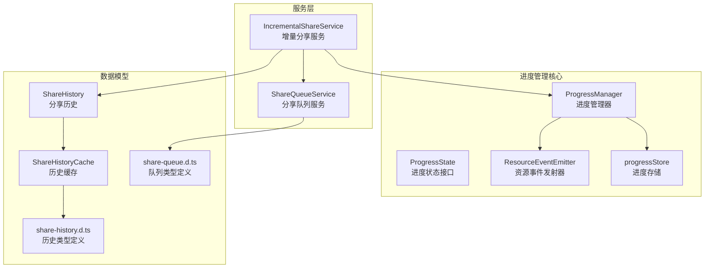
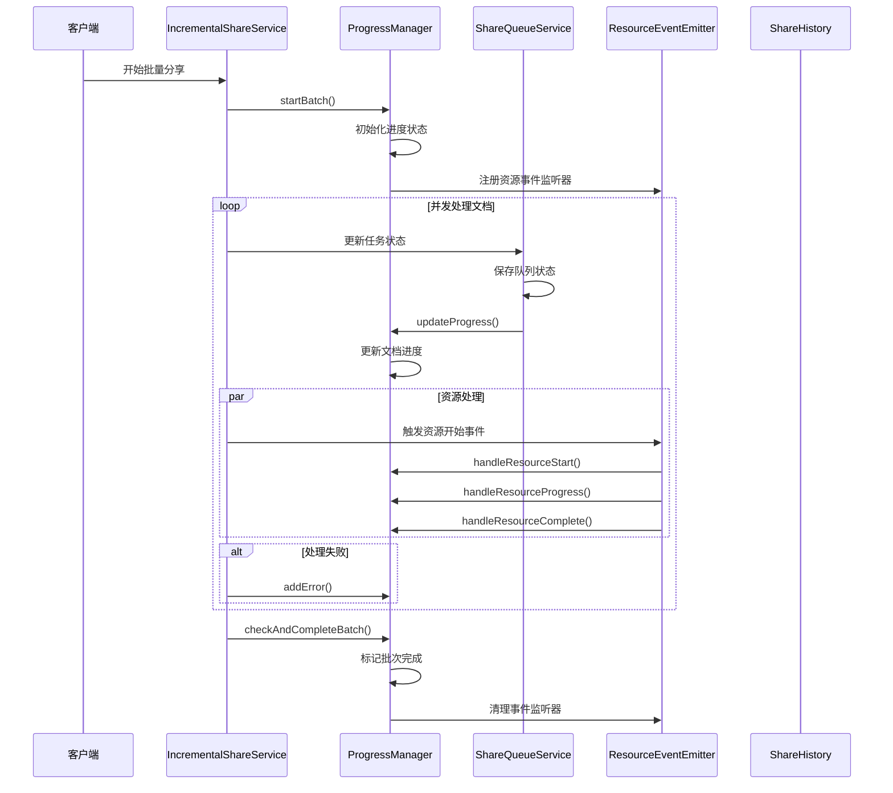
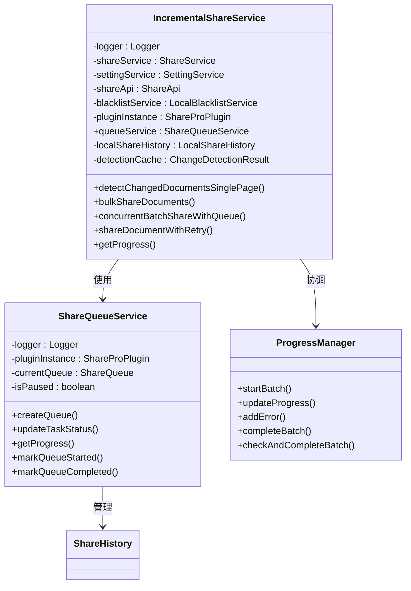
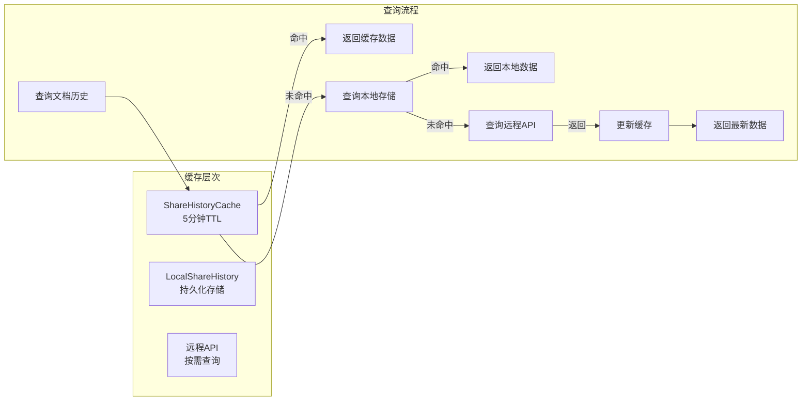
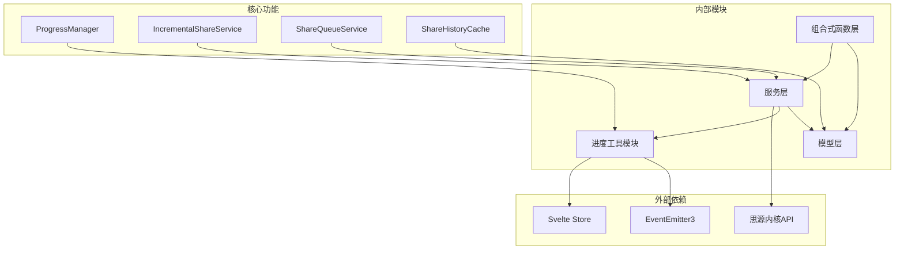

# 进度管理增强功能

<cite>
**本文档引用的文件**
- [ProgressManager.ts](file://src/utils/progress/ProgressManager.ts)
- [ProgressState.ts](file://src/utils/progress/ProgressState.ts)
- [ResourceEventEmitter.ts](file://src/utils/progress/ResourceEventEmitter.ts)
- [progressStore.ts](file://src/utils/progress/progressStore.ts)
- [IncrementalShareService.ts](file://src/service/IncrementalShareService.ts)
- [ShareQueueService.ts](file://src/service/ShareQueueService.ts)
- [ShareHistory.ts](file://src/models/ShareHistory.ts)
- [ShareHistoryCache.ts](file://src/utils/ShareHistoryCache.ts)
- [share-queue.d.ts](file://src/types/share-queue.d.ts)
- [share-history.d.ts](file://src/types/share-history.d.ts)
- [useSiyuanApi.ts](file://src/composables/useSiyuanApi.ts)
</cite>

## 目录
1. [简介](#简介)
2. [项目结构](#项目结构)
3. [核心组件](#核心组件)
4. [架构概览](#架构概览)
5. [详细组件分析](#详细组件分析)
6. [依赖关系分析](#依赖关系分析)
7. [性能考虑](#性能考虑)
8. [故障排除指南](#故障排除指南)
9. [结论](#结论)

## 简介

本文档详细分析了 Siyuan 笔记插件 "share-pro" 中的进度管理增强功能。该系统通过多个层次的进度跟踪机制，实现了对批量文档分享操作的全面监控，包括文档处理进度、资源处理进度以及队列管理进度。

系统的核心特性包括：
- 实时进度跟踪和状态管理
- 资源处理的细粒度监控
- 队列管理和任务调度
- 智能重试机制
- 缓存优化和性能提升

## 项目结构

项目采用模块化的架构设计，进度管理功能主要分布在以下目录：



**图表来源**
- [ProgressManager.ts:1-244](file://src/utils/progress/ProgressManager.ts#L1-L244)
- [IncrementalShareService.ts:1-690](file://src/service/IncrementalShareService.ts#L1-L690)
- [ShareQueueService.ts:1-299](file://src/service/ShareQueueService.ts#L1-L299)

**章节来源**
- [ProgressManager.ts:1-244](file://src/utils/progress/ProgressManager.ts#L1-L244)
- [IncrementalShareService.ts:1-690](file://src/service/IncrementalShareService.ts#L1-L690)
- [ShareQueueService.ts:1-299](file://src/service/ShareQueueService.ts#L1-L299)

## 核心组件

### 进度管理器 (ProgressManager)

ProgressManager 是整个进度管理系统的核心控制器，负责协调各个组件之间的进度同步。

**主要功能**：
- 批量操作的启动和管理
- 进度状态的实时更新
- 错误处理和异常管理
- 资源处理的监听和响应

**关键特性**：
- 支持文档级别和资源级别的双重进度跟踪
- 智能完成检测机制
- 事件驱动的异步处理
- 完整的生命周期管理

### 进度状态管理

ProgressState 定义了完整的进度状态接口，涵盖了所有需要跟踪的信息：

**状态字段**：
- 基础进度信息：总数量、已完成数量、百分比
- 状态管理：空闲、处理中、成功、错误、取消
- 文档上下文：当前文档ID和标题
- 错误处理：文档错误和资源错误的分类管理
- 时间戳：开始时间和结束时间
- 资源处理：总资源数、已完成资源数、资源处理标志

### 资源事件发射器

ResourceEventEmitter 提供了基于事件驱动的资源处理机制：

**事件类型**：
- START：资源处理开始
- PROGRESS：资源处理进度更新
- ERROR：资源处理错误
- COMPLETE：资源处理完成

这种事件驱动的设计使得进度管理器能够响应各种资源处理场景，实现精确的状态同步。

**章节来源**
- [ProgressManager.ts:1-244](file://src/utils/progress/ProgressManager.ts#L1-L244)
- [ProgressState.ts:1-27](file://src/utils/progress/ProgressState.ts#L1-L27)
- [ResourceEventEmitter.ts:1-11](file://src/utils/progress/ResourceEventEmitter.ts#L1-L11)

## 架构概览

系统采用分层架构设计，实现了高度解耦的功能模块：



**图表来源**
- [IncrementalShareService.ts:269-351](file://src/service/IncrementalShareService.ts#L269-L351)
- [ProgressManager.ts:12-102](file://src/utils/progress/ProgressManager.ts#L12-L102)
- [ShareQueueService.ts:104-125](file://src/service/ShareQueueService.ts#L104-L125)

## 详细组件分析

### 增量分享服务 (IncrementalShareService)

IncrementalShareService 是进度管理系统的业务核心，负责协调整个分享流程：



**图表来源**
- [IncrementalShareService.ts:98-129](file://src/service/IncrementalShareService.ts#L98-L129)
- [ShareQueueService.ts:24-33](file://src/service/ShareQueueService.ts#L24-L33)
- [ProgressManager.ts:8-102](file://src/utils/progress/ProgressManager.ts#L8-L102)

#### 并发处理机制

系统采用了智能的并发控制机制，确保大批量文档分享的高效性和稳定性：

**并发策略**：
- 最大并发数限制为5，避免过度占用系统资源
- 动态任务分配和回收机制
- 暂停和恢复功能支持长时间任务的中断处理
- 智能重试机制处理网络异常

#### 智能重试算法

系统实现了多层次的重试策略，针对不同类型的错误采用相应的处理方式：


**图表来源**
- [IncrementalShareService.ts:585-659](file://src/service/IncrementalShareService.ts#L585-L659)

**章节来源**
- [IncrementalShareService.ts:269-351](file://src/service/IncrementalShareService.ts#L269-L351)
- [IncrementalShareService.ts:396-474](file://src/service/IncrementalShareService.ts#L396-L474)
- [IncrementalShareService.ts:585-659](file://src/service/IncrementalShareService.ts#L585-L659)

### 队列管理系统 (ShareQueueService)

ShareQueueService 提供了完整的队列管理功能，支持任务的创建、调度、监控和恢复：

**核心功能**：
- 队列创建和初始化
- 任务状态跟踪和更新
- 进度计算和统计
- 暂停和恢复机制
- 失败任务重试

**进度计算算法**：
系统实现了基于平均处理时间的智能进度估算：

```
平均每个任务处理时间 = 总耗时 / 已完成任务数
剩余时间 = 平均处理时间 × 待处理任务数
```

**章节来源**
- [ShareQueueService.ts:38-60](file://src/service/ShareQueueService.ts#L38-L60)
- [ShareQueueService.ts:130-170](file://src/service/ShareQueueService.ts#L130-L170)
- [ShareQueueService.ts:232-253](file://src/service/ShareQueueService.ts#L232-L253)

### 缓存优化机制

系统实现了多层缓存策略，显著提升了性能表现：



**图表来源**
- [ShareHistoryCache.ts:19-91](file://src/utils/ShareHistoryCache.ts#L19-L91)
- [IncrementalShareService.ts:218-240](file://src/service/IncrementalShareService.ts#L218-L240)

**章节来源**
- [ShareHistoryCache.ts:19-91](file://src/utils/ShareHistoryCache.ts#L19-L91)
- [IncrementalShareService.ts:218-240](file://src/service/IncrementalShareService.ts#L218-L240)

## 依赖关系分析

系统采用了清晰的依赖层次结构，实现了良好的模块解耦：



**图表来源**
- [ProgressManager.ts:1-4](file://src/utils/progress/ProgressManager.ts#L1-L4)
- [IncrementalShareService.ts:10-25](file://src/service/IncrementalShareService.ts#L10-L25)
- [ShareQueueService.ts:10-16](file://src/service/ShareQueueService.ts#L10-L16)

**章节来源**
- [ProgressManager.ts:1-4](file://src/utils/progress/ProgressManager.ts#L1-L4)
- [IncrementalShareService.ts:10-25](file://src/service/IncrementalShareService.ts#L10-L25)
- [ShareQueueService.ts:10-16](file://src/service/ShareQueueService.ts#L10-L16)

## 性能考虑

### 内存管理

系统采用了高效的内存管理模式，避免了内存泄漏和性能问题：

**优化策略**：
- 事件监听器的及时清理
- 缓存的TTL机制和主动清理
- 进度状态的原子性更新
- 异步操作的合理调度

### 并发控制

通过合理的并发控制，系统在保证性能的同时避免了资源竞争：

**并发限制**：
- 文档分享并发数：5个
- 资源处理并发数：无限制（事件驱动）
- 队列任务并发数：根据队列状态动态调整

### 缓存策略

多层缓存机制显著减少了API调用频率：

**缓存层次**：
- 内存缓存：5分钟TTL
- 本地存储：持久化缓存
- 远程API：按需查询

## 故障排除指南

### 常见问题诊断

**进度不更新问题**：
1. 检查事件监听器是否正确注册
2. 验证进度状态的原子性更新
3. 确认队列状态的正确流转

**内存泄漏排查**：
1. 确认事件监听器的清理机制
2. 检查缓存的TTL设置
3. 验证异步操作的正确清理

**性能问题定位**：
1. 监控并发数的合理性
2. 检查缓存命中率
3. 分析API调用频率

### 错误处理机制

系统实现了完善的错误处理和恢复机制：

**错误分类**：
- 文档级别错误：单个文档分享失败
- 资源级别错误：资源处理异常
- 系统级别错误：框架或基础设施问题

**恢复策略**：
- 自动重试机制
- 失败任务隔离
- 队列状态恢复

**章节来源**
- [ProgressManager.ts:131-140](file://src/utils/progress/ProgressManager.ts#L131-L140)
- [IncrementalShareService.ts:614-659](file://src/service/IncrementalShareService.ts#L614-L659)
- [ShareQueueService.ts:183-195](file://src/service/ShareQueueService.ts#L183-L195)

## 结论

该进度管理增强功能通过精心设计的架构和实现，为 Siyuan 笔记插件提供了强大而灵活的批量操作监控能力。系统的主要优势包括：

**技术优势**：
- 分层架构设计，模块职责清晰
- 事件驱动的异步处理机制
- 多层次的缓存优化策略
- 智能的并发控制和资源管理

**用户体验**：
- 实时进度反馈和状态展示
- 智能的错误处理和恢复
- 可暂停和恢复的长任务支持
- 详细的日志和调试信息

**扩展性**：
- 插件化的组件设计
- 灵活的配置选项
- 可扩展的事件系统
- 良好的性能监控机制

该系统为大规模文档分享操作提供了可靠的技术支撑，是现代前端应用中进度管理的最佳实践案例。