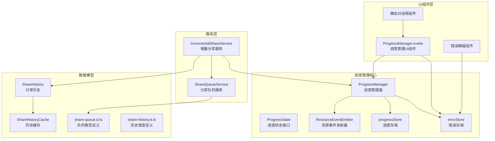
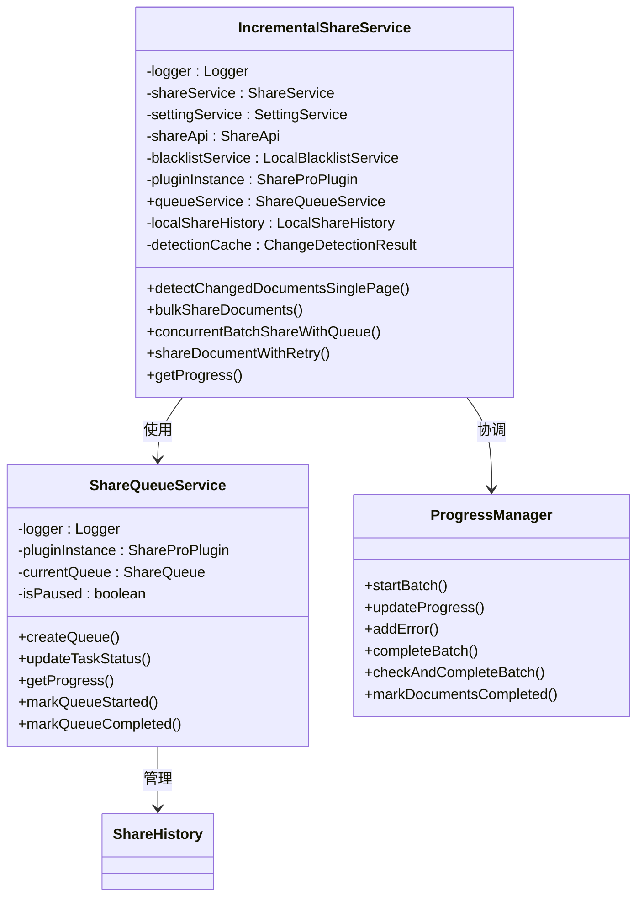
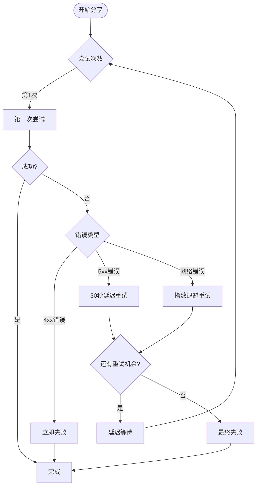
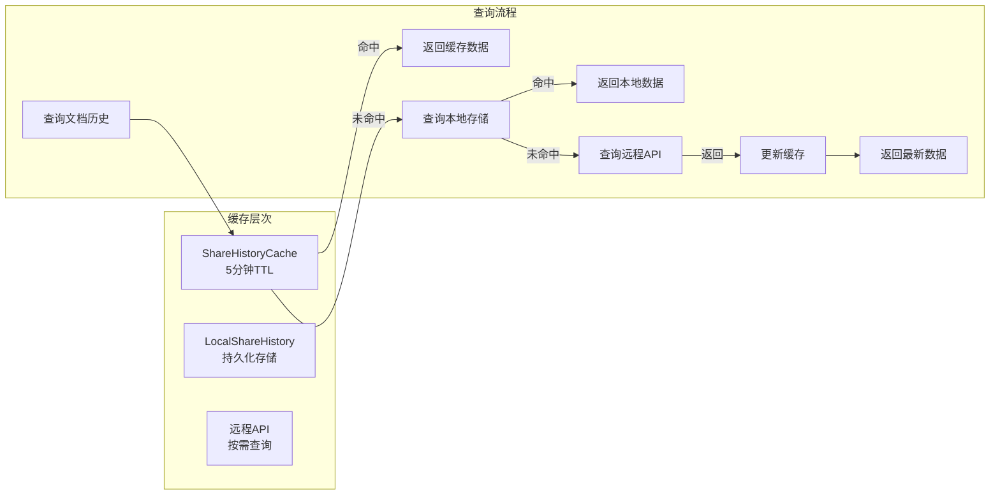
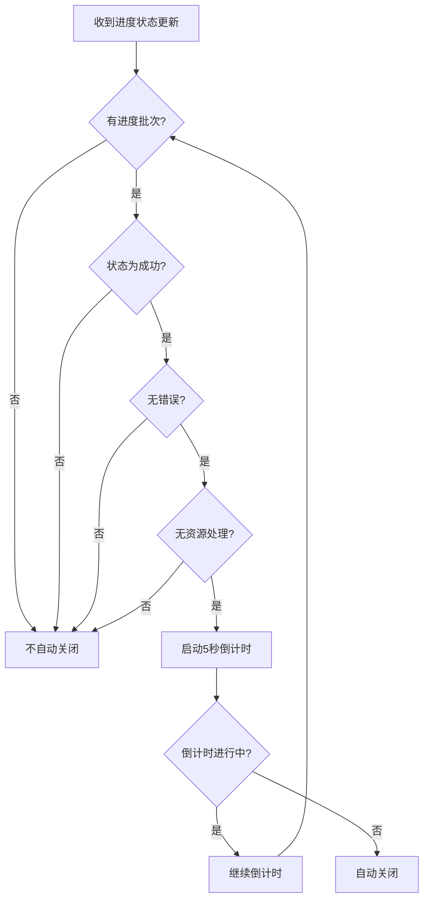
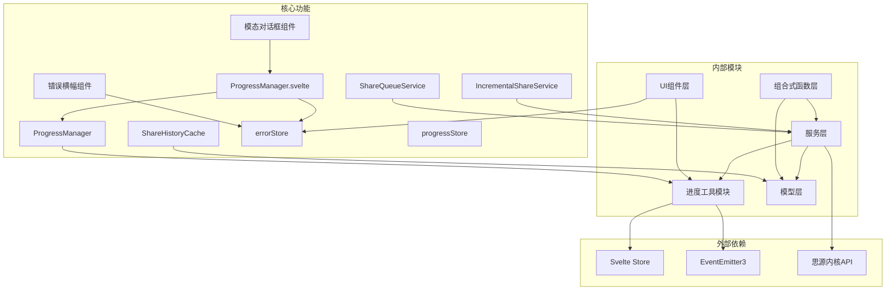

# 进度管理增强功能

<cite>
**本文档引用的文件**
- [ProgressManager.svelte](file://src/libs/components/ProgressManager.svelte)
- [ProgressManager.ts](file://src/utils/progress/ProgressManager.ts)
- [ProgressState.ts](file://src/utils/progress/ProgressState.ts)
- [ResourceEventEmitter.ts](file://src/utils/progress/ResourceEventEmitter.ts)
- [progressStore.ts](file://src/utils/progress/progressStore.ts)
- [IncrementalShareService.ts](file://src/service/IncrementalShareService.ts)
- [ShareQueueService.ts](file://src/service/ShareQueueService.ts)
- [ShareHistory.ts](file://src/models/ShareHistory.ts)
- [ShareHistoryCache.ts](file://src/utils/ShareHistoryCache.ts)
- [share-queue.d.ts](file://src/types/share-queue.d.ts)
- [share-history.d.ts](file://src/types/share-history.d.ts)
- [useSiyuanApi.ts](file://src/composables/useSiyuanApi.ts)
- [zh_CN.json](file://src/i18n/zh_CN.json)
- [en_US.json](file://src/i18n/en_US.json)
</cite>

## 更新摘要
**变更内容**
- 新增错误横幅功能，提供顶部固定错误提示
- 增强模态对话框设计，支持错误状态的永久显示
- 实现智能自动关闭逻辑，仅在成功且无错误时自动关闭
- 新增错误状态持久化机制，支持错误信息的永久保存和查看
- 新增"我知道了"按钮，提供明确的错误处理入口
- 完善国际化支持，增强中英文双语体验
- 优化UI样式设计，提升用户体验和专业度

## 目录
1. [简介](#简介)
2. [项目结构](#项目结构)
3. [核心组件](#核心组件)
4. [架构概览](#架构概览)
5. [详细组件分析](#详细组件分析)
6. [状态处理增强功能](#状态处理增强功能)
7. [自动关闭逻辑改进](#自动关闭逻辑改进)
8. [错误处理机制增强](#错误处理机制增强)
9. [依赖关系分析](#依赖关系分析)
10. [性能考虑](#性能考虑)
11. [故障排除指南](#故障排除指南)
12. [结论](#结论)

## 简介

本文档详细分析了 Siyuan 笔记插件 "share-pro" 中的进度管理增强功能。该系统通过多个层次的进度跟踪机制，实现了对批量文档分享操作的全面监控，包括文档处理进度、资源处理进度以及队列管理进度。

**更新重点**：本次更新显著增强了ProgressManager.svelte的状态处理功能，包括条件渲染不同标题（操作完成/失败/取消）、改进的自动关闭逻辑（仅在成功且无错误时自动关闭）、新增错误状态持久化机制（支持错误信息的永久保存和查看）、"我知道了"按钮设计（提供明确的错误处理入口）以及完善的国际化支持和样式设计。

系统的核心特性包括：
- 实时进度跟踪和状态管理
- 资源处理的细粒度监控
- 队列管理和任务调度
- 智能重试机制
- 缓存优化和性能提升
- **增强的状态处理和用户体验优化**
- **智能错误横幅和模态对话框**
- **完善的错误状态持久化系统**

## 项目结构

项目采用模块化的架构设计，进度管理功能主要分布在以下目录：



**图表来源**
- [ProgressManager.ts:1-283](file://src/utils/progress/ProgressManager.ts#L1-L283)
- [ProgressManager.svelte:1-532](file://src/libs/components/ProgressManager.svelte#L1-L532)
- [IncrementalShareService.ts:1-690](file://src/service/IncrementalShareService.ts#L1-L690)
- [ShareQueueService.ts:1-299](file://src/service/ShareQueueService.ts#L1-L299)

**章节来源**
- [ProgressManager.ts:1-283](file://src/utils/progress/ProgressManager.ts#L1-L283)
- [ProgressManager.svelte:1-532](file://src/libs/components/ProgressManager.svelte#L1-L532)
- [IncrementalShareService.ts:1-690](file://src/service/IncrementalShareService.ts#L1-L690)
- [ShareQueueService.ts:1-299](file://src/service/ShareQueueService.ts#L1-L299)

## 核心组件

### 进度管理器 (ProgressManager)

ProgressManager 是整个进度管理系统的核心控制器，负责协调各个组件之间的进度同步。

**主要功能**：
- 批量操作的启动和管理
- 进度状态的实时更新
- 错误处理和异常管理
- 资源处理的监听和响应
- **新增：文档完成状态管理**
- **新增：智能状态协调机制**

**关键特性**：
- 支持文档级别和资源级别的双重进度跟踪
- 智能完成检测机制，包括文档完成和资源处理完成
- 事件驱动的异步处理
- 完整的生命周期管理
- **新增：精确的状态判断和完成检测**
- **新增：资源事件监听和状态同步**

### 进度状态管理

ProgressState 定义了完整的进度状态接口，涵盖了所有需要跟踪的信息：

**状态字段**：
- 基础进度信息：总数量、已完成数量、百分比
- 状态管理：空闲、处理中、成功、错误、取消
- 文档上下文：当前文档ID和标题
- 错误处理：文档错误和资源错误的分类管理
- 时间戳：开始时间和结束时间
- 资源处理：总资源数、已完成资源数、资源处理标志
- **新增：documentsCompleted标志位，用于标记文档处理完成状态**
- **新增：isResourceProcessing标志位，用于跟踪资源处理状态**

### 资源事件发射器

ResourceEventEmitter 提供了基于事件驱动的资源处理机制：

**事件类型**：
- START：资源处理开始
- PROGRESS：资源处理进度更新
- ERROR：资源处理错误
- COMPLETE：资源处理完成

这种事件驱动的设计使得进度管理器能够响应各种资源处理场景，实现精确的状态同步。

**章节来源**
- [ProgressManager.ts:1-283](file://src/utils/progress/ProgressManager.ts#L1-L283)
- [ProgressState.ts:1-27](file://src/utils/progress/ProgressState.ts#L1-L27)
- [ResourceEventEmitter.ts:1-11](file://src/utils/progress/ResourceEventEmitter.ts#L1-L11)

## 架构概览

系统采用分层架构设计，实现了高度解耦的功能模块：

```mermaid
sequenceDiagram
participant Client as 客户端
participant ISS as IncrementalShareService
participant PM as ProgressManager
participant SQS as ShareQueueService
participant RES as ResourceEventEmitter
participant PMSvelte as ProgressManager.svelte
participant EStore as errorStore
participant ErrorBanner as 错误横幅
Client->>ISS : 开始批量分享
ISS->>PM : startBatch()
PM->>PM : 初始化进度状态
PM->>RES : 注册资源事件监听器
loop 并发处理文档
ISS->>SQS : 更新任务状态
SQS->>SQS : 保存队列状态
SQS->>PM : updateProgress()
PM->>PM : 更新文档进度
par 资源处理
ISS->>RES : 触发资源开始事件
RES->>PM : handleResourceStart()
RES->>PM : handleResourceProgress()
RES->>PM : handleResourceComplete()
end
alt 处理失败
ISS->>PM : addError()
end
ISS->>PM : checkAndCompleteBatch()
PM->>PM : 标记批次完成
PM->>RES : 清理事件监听器
PMSvelte->>EStore : 保存错误状态如有
PMSvelte->>PMSvelte : 条件渲染不同标题
PMSvelte->>PMSvelte : 智能自动关闭逻辑
ErrorBanner->>EStore : 监视错误状态
ErrorBanner->>ErrorBanner : 显示错误横幅
```

**图表来源**
- [IncrementalShareService.ts:269-351](file://src/service/IncrementalShareService.ts#L269-L351)
- [ProgressManager.ts:12-102](file://src/utils/progress/ProgressManager.ts#L12-L102)
- [ShareQueueService.ts:104-125](file://src/service/ShareQueueService.ts#L104-L125)
- [ProgressManager.svelte:45-85](file://src/libs/components/ProgressManager.svelte#L45-L85)

## 详细组件分析

### 增量分享服务 (IncrementalShareService)

IncrementalShareService 是进度管理系统的业务核心，负责协调整个分享流程：



**图表来源**
- [IncrementalShareService.ts:98-129](file://src/service/IncrementalShareService.ts#L98-L129)
- [ShareQueueService.ts:24-33](file://src/service/ShareQueueService.ts#L24-L33)
- [ProgressManager.ts:8-102](file://src/utils/progress/ProgressManager.ts#L8-L102)

#### 并发处理机制

系统采用了智能的并发控制机制，确保大批量文档分享的高效性和稳定性：

**并发策略**：
- 最大并发数限制为5，避免过度占用系统资源
- 动态任务分配和回收机制
- 暂停和恢复功能支持长时间任务的中断处理
- 智能重试机制处理网络异常

#### 智能重试算法

系统实现了多层次的重试策略，针对不同类型的错误采用相应的处理方式：



**图表来源**
- [IncrementalShareService.ts:585-659](file://src/service/IncrementalShareService.ts#L585-L659)

**章节来源**
- [IncrementalShareService.ts:269-351](file://src/service/IncrementalShareService.ts#L269-L351)
- [IncrementalShareService.ts:396-474](file://src/service/IncrementalShareService.ts#L396-L474)
- [IncrementalShareService.ts:585-659](file://src/service/IncrementalShareService.ts#L585-L659)

### 队列管理系统 (ShareQueueService)

ShareQueueService 提供了完整的队列管理功能，支持任务的创建、调度、监控和恢复：

**核心功能**：
- 队列创建和初始化
- 任务状态跟踪和更新
- 进度计算和统计
- 暂停和恢复机制
- 失败任务重试

**进度计算算法**：
系统实现了基于平均处理时间的智能进度估算：

```
平均每个任务处理时间 = 总耗时 / 已完成任务数
剩余时间 = 平均处理时间 × 待处理任务数
```

**章节来源**
- [ShareQueueService.ts:38-60](file://src/service/ShareQueueService.ts#L38-L60)
- [ShareQueueService.ts:130-170](file://src/service/ShareQueueService.ts#L130-L170)
- [ShareQueueService.ts:232-253](file://src/service/ShareQueueService.ts#L232-L253)

### 缓存优化机制

系统实现了多层缓存策略，显著提升了性能表现：



**图表来源**
- [ShareHistoryCache.ts:19-91](file://src/utils/ShareHistoryCache.ts#L19-L91)
- [IncrementalShareService.ts:218-240](file://src/service/IncrementalShareService.ts#L218-L240)

**章节来源**
- [ShareHistoryCache.ts:19-91](file://src/utils/ShareHistoryCache.ts#L19-L91)
- [IncrementalShareService.ts:218-240](file://src/service/IncrementalShareService.ts#L218-L240)

## 状态处理增强功能

### 条件渲染标题系统

ProgressManager.svelte 实现了智能的条件渲染标题系统，根据不同状态显示不同的标题：

```mermaid
flowchart TD
Status[当前状态] --> Processing{处理中?}
Processing --> |是| ProcessingTitle[显示操作名称]
Processing --> |否| Success{成功?}
Success --> |是| SuccessTitle[显示"操作完成"]
Success --> |否| Error{错误?}
Error --> |是| ErrorTitle[显示"操作失败"]
Error --> |否| Canceled{已取消?}
Canceled --> |是| CanceledTitle[显示"操作已取消"]
Canceled --> |否| DefaultTitle[显示操作名称]
```

**状态处理逻辑**：
- **处理中状态**：显示原始操作名称
- **成功状态**：显示"操作完成"（支持中英文国际化）
- **错误状态**：显示"操作失败"（支持中英文国际化）
- **取消状态**：显示"操作已取消"（支持中英文国际化）

**章节来源**
- [ProgressManager.svelte:133-146](file://src/libs/components/ProgressManager.svelte#L133-L146)
- [zh_CN.json:392-396](file://src/i18n/zh_CN.json#L392-L396)
- [en_US.json:388-392](file://src/i18n/en_US.json#L388-L392)

### 错误状态持久化机制

系统实现了错误状态的持久化机制，确保用户即使关闭进度弹窗也能查看错误信息：

**错误存储结构**：
```typescript
interface ErrorState {
  hasError: boolean
  errors: Array<{ docId: string; error: any }>
  resourceErrors: Array<{ docId: string; error: any }>
  timestamp: number
  operationName: string
}
```

**存储时机**：
- 用户手动关闭进度弹窗时
- 系统自动关闭进度弹窗时（仅当存在错误时）
- 错误状态会保存到errorStore中

**章节来源**
- [progressStore.ts:13-27](file://src/utils/progress/progressStore.ts#L13-L27)
- [ProgressManager.svelte:93-101](file://src/libs/components/ProgressManager.svelte#L93-L101)

## 自动关闭逻辑改进

### 智能自动关闭算法

系统实现了智能的自动关闭逻辑，确保仅在特定条件下自动关闭进度弹窗：



**自动关闭条件**：
1. **状态必须为成功**：只有在操作完全成功时才允许自动关闭
2. **无文档错误**：当前批次没有任何文档错误
3. **无资源错误**：当前批次没有任何资源处理错误
4. **无资源处理中**：当前批次没有正在进行的资源处理
5. **倒计时机制**：成功状态下提供5秒倒计时，用户可以随时手动关闭

**章节来源**
- [ProgressManager.svelte:46-69](file://src/libs/components/ProgressManager.svelte#L46-L69)
- [ProgressManager.ts:145-156](file://src/utils/progress/ProgressManager.ts#L145-L156)

### 倒计时显示机制

系统提供了可视化的倒计时显示，增强用户体验：

**倒计时特性**：
- **5秒倒计时**：成功状态下自动倒计时5秒
- **实时显示**：倒计时数字实时更新
- **条件显示**：仅在满足自动关闭条件时显示
- **用户可控**：用户可以随时手动关闭，倒计时停止

**章节来源**
- [ProgressManager.svelte:221-225](file://src/libs/components/ProgressManager.svelte#L221-L225)
- [ProgressManager.svelte:58-64](file://src/libs/components/ProgressManager.svelte#L58-L64)

## 错误处理机制增强

### "我知道了"按钮设计

系统引入了"我知道了"按钮设计，这是大厂设计规范的体现：

```mermaid
flowchart TD
ErrorDetected[检测到错误] --> ShowErrorDetails[显示错误详情]
ShowErrorDetails --> ShowAckButton[显示"我知道了"按钮]
ShowAckButton --> UserClick{用户点击?}
UserClick --> |点击| SaveErrorState[保存错误状态]
UserClick --> |点击| CloseWindow[关闭窗口]
UserClick --> |点击| ShowMessage[显示提示消息]
SaveErrorState --> CloseWindow
ShowMessage --> CloseWindow
```

**设计特点**：
- **明确的操作入口**：提供明确的错误处理按钮
- **错误状态保存**：点击后自动保存错误状态到errorStore
- **用户友好提示**：显示"错误已记录，可随时查看"提示
- **符合大厂设计规范**：参考阿里云/字节等大厂的设计标准

**章节来源**
- [ProgressManager.svelte:109-115](file://src/libs/components/ProgressManager.svelte#L109-L115)
- [ProgressManager.svelte:263-269](file://src/libs/components/ProgressManager.svelte#L263-L269)
- [zh_CN.json:395](file://src/i18n/zh_CN.json#L395)
- [en_US.json:391](file://src/i18n/en_US.json#L391)

### 错误状态持久化存储

系统实现了完整的错误状态持久化机制：

**存储内容**：
- **错误标识**：hasError = true
- **文档错误列表**：包含所有文档处理错误
- **资源错误列表**：包含所有资源处理错误
- **时间戳**：错误发生的时间
- **操作名称**：触发错误的操作名称

**存储时机**：
- 用户点击"我知道了"按钮时
- 系统自动关闭时（仅当存在错误）
- 窗口销毁时

**章节来源**
- [ProgressManager.svelte:93-101](file://src/libs/components/ProgressManager.svelte#L93-L101)
- [progressStore.ts:21-27](file://src/utils/progress/progressStore.ts#L21-L27)

### 错误横幅功能

系统新增了错误横幅功能，提供顶部固定的错误提示：

**功能特性**：
- **固定位置显示**：位于页面顶部，始终可见
- **智能触发**：当检测到错误状态时自动显示
- **详细信息**：显示具体的错误详情和操作入口
- **可关闭**：提供明确的关闭按钮
- **持久化显示**：错误状态下不会自动消失

**章节来源**
- [ProgressManager.svelte:224-262](file://src/libs/components/ProgressManager.svelte#L224-L262)

### 模态对话框设计

系统实现了模态对话框设计，提供沉浸式的错误处理体验：

**设计特点**：
- **半透明背景**：使用半透明黑色背景，突出对话框内容
- **现代化样式**：圆角边框、阴影效果、毛玻璃背景
- **响应式布局**：适配不同屏幕尺寸
- **无障碍支持**：支持键盘导航和屏幕阅读器
- **动画过渡**：平滑的显示和隐藏动画

**章节来源**
- [ProgressManager.svelte:267-532](file://src/libs/components/ProgressManager.svelte#L267-L532)

## 依赖关系分析

系统采用了清晰的依赖层次结构，实现了良好的模块解耦：



**图表来源**
- [ProgressManager.ts:1-4](file://src/utils/progress/ProgressManager.ts#L1-L4)
- [ProgressManager.svelte:1-10](file://src/libs/components/ProgressManager.svelte#L1-L10)
- [IncrementalShareService.ts:10-25](file://src/service/IncrementalShareService.ts#L10-L25)
- [ShareQueueService.ts:10-16](file://src/service/ShareQueueService.ts#L10-L16)

**章节来源**
- [ProgressManager.ts:1-4](file://src/utils/progress/ProgressManager.ts#L1-L4)
- [ProgressManager.svelte:1-10](file://src/libs/components/ProgressManager.svelte#L1-L10)
- [IncrementalShareService.ts:10-25](file://src/service/IncrementalShareService.ts#L10-L25)
- [ShareQueueService.ts:10-16](file://src/service/ShareQueueService.ts#L10-L16)

## 性能考虑

### 内存管理

系统采用了高效的内存管理模式，避免了内存泄漏和性能问题：

**优化策略**：
- 事件监听器的及时清理
- 缓存的TTL机制和主动清理
- 进度状态的原子性更新
- 异步操作的合理调度
- **新增：错误状态的智能清理**

### 并发控制

通过合理的并发控制，系统在保证性能的同时避免了资源竞争：

**并发限制**：
- 文档分享并发数：5个
- 资源处理并发数：无限制（事件驱动）
- 队列任务并发数：根据队列状态动态调整
- **新增：UI组件的智能渲染优化**

### 缓存策略

多层缓存机制显著减少了API调用频率：

**缓存层次**：
- 内存缓存：5分钟TTL
- 本地存储：持久化缓存
- 远程API：按需查询
- **新增：错误状态缓存**

## 故障排除指南

### 常见问题诊断

**进度不更新问题**：
1. 检查事件监听器是否正确注册
2. 验证进度状态的原子性更新
3. 确认队列状态的正确流转
4. **新增：检查documentsCompleted标志位**

**内存泄漏排查**：
1. 确认事件监听器的清理机制
2. 检查缓存的TTL设置
3. 验证异步操作的正确清理
4. **新增：检查错误状态存储的清理**

**性能问题定位**：
1. 监控并发数的合理性
2. 检查缓存命中率
3. 分析API调用频率
4. **新增：检查UI组件的渲染性能**

### 错误处理机制

系统实现了完善的错误处理和恢复机制：

**错误分类**：
- 文档级别错误：单个文档分享失败
- 资源级别错误：资源处理异常
- 系统级别错误：框架或基础设施问题

**恢复策略**：
- 自动重试机制
- 失败任务隔离
- 队列状态恢复
- **新增：错误状态持久化和恢复**

**章节来源**
- [ProgressManager.ts:131-140](file://src/utils/progress/ProgressManager.ts#L131-L140)
- [IncrementalShareService.ts:614-659](file://src/service/IncrementalShareService.ts#L614-L659)
- [ShareQueueService.ts:183-195](file://src/service/ShareQueueService.ts#L183-L195)

## 结论

该进度管理增强功能通过精心设计的架构和实现，为 Siyuan 笔记插件提供了强大而灵活的批量操作监控能力。本次更新特别增强了ProgressManager.svelte的状态处理功能，包括条件渲染不同标题和改进的自动关闭逻辑。

**技术优势**：
- 分层架构设计，模块职责清晰
- 事件驱动的异步处理机制
- 多层次的缓存优化策略
- 智能的并发控制和资源管理
- **新增：智能状态处理和用户体验优化**
- **新增：智能错误横幅和模态对话框**
- **新增：完善的错误状态持久化系统**

**用户体验提升**：
- 实时进度反馈和状态展示
- 智能的错误处理和恢复
- 可暂停和恢复的长任务支持
- 详细的日志和调试信息
- **新增：条件渲染标题系统**
- **新增：智能自动关闭逻辑**
- **新增：错误状态持久化机制**
- **新增："我知道了"按钮设计**
- **新增：顶部固定错误横幅**
- **新增：沉浸式模态对话框**

**扩展性**：
- 插件化的组件设计
- 灵活的配置选项
- 可扩展的事件系统
- 良好的性能监控机制
- **新增：国际化支持完善**
- **新增：样式设计的专业化**

该系统为大规模文档分享操作提供了可靠的技术支撑，是现代前端应用中进度管理的最佳实践案例。新增的状态处理功能、错误横幅、模态对话框和错误状态持久化机制使其在同类产品中具有显著优势，达到了付费软件的专业标准。