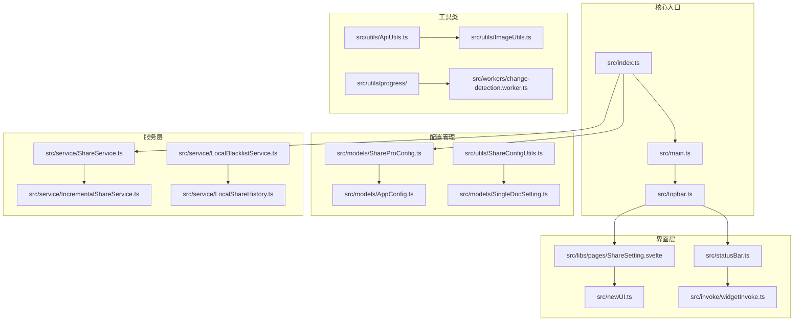
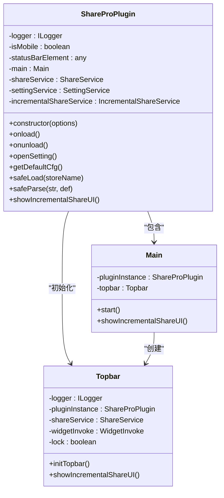
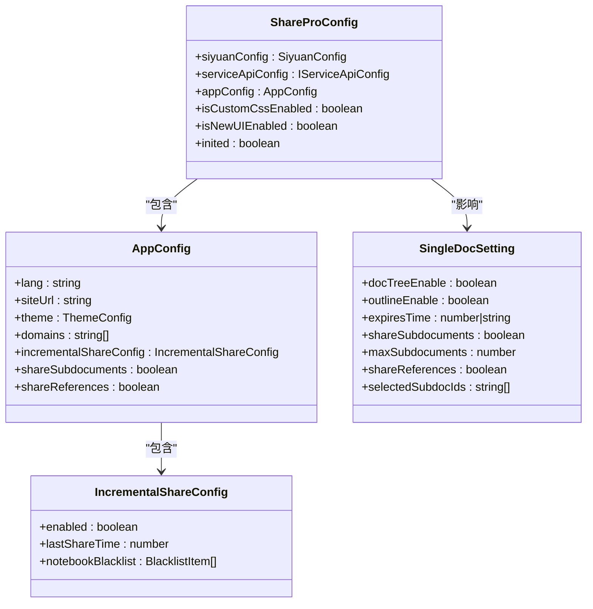
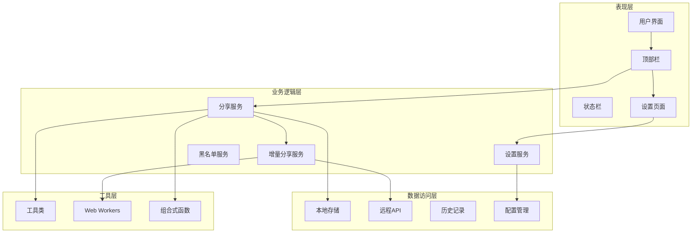
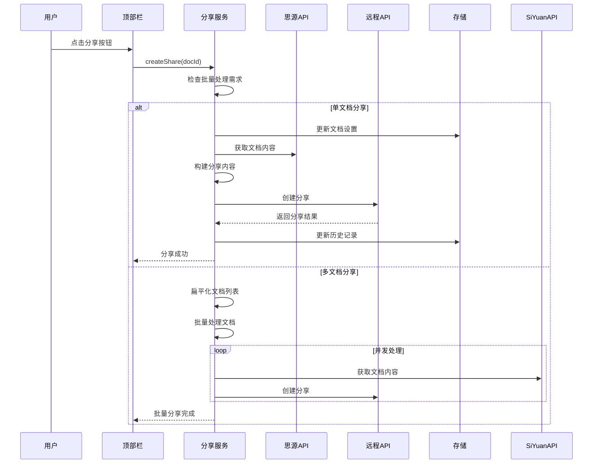
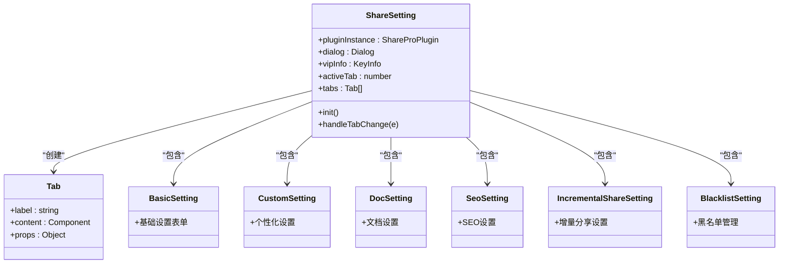
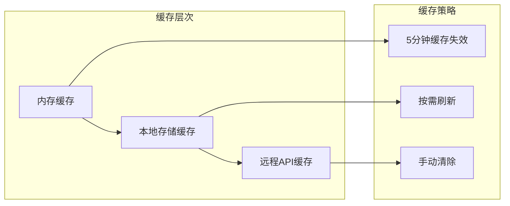

# 在线分享专业版（Share Pro）插件技术文档

<cite>
**本文档中引用的文件**
- [README.md](file://README.md)
- [plugin.json](file://plugin.json)
- [package.json](file://package.json)
- [src/index.ts](file://src/index.ts)
- [src/main.ts](file://src/main.ts)
- [src/topbar.ts](file://src/topbar.ts)
- [src/statusBar.ts](file://src/statusBar.ts)
- [src/models/ShareProConfig.ts](file://src/models/ShareProConfig.ts)
- [src/models/AppConfig.ts](file://src/models/AppConfig.ts)
- [src/models/SingleDocSetting.ts](file://src/models/SingleDocSetting.ts)
- [src/models/ShareOptions.ts](file://src/models/ShareOptions.ts)
- [src/service/ShareService.ts](file://src/service/ShareService.ts)
- [src/service/IncrementalShareService.ts](file://src/service/IncrementalShareService.ts)
- [src/utils/ShareConfigUtils.ts](file://src/utils/ShareConfigUtils.ts)
- [src/libs/pages/ShareSetting.svelte](file://src/libs/pages/ShareSetting.svelte)
</cite>

## 目录
1. [简介](#简介)
2. [项目结构](#项目结构)
3. [核心组件](#核心组件)
4. [架构概览](#架构概览)
5. [详细组件分析](#详细组件分析)
6. [依赖分析](#依赖分析)
7. [性能考虑](#性能考虑)
8. [故障排除指南](#故障排除指南)
9. [结论](#结论)

## 简介

在线分享专业版（Share Pro）是一个专为思源笔记（SiYuan Note）设计的强大插件，旨在提供一键式文档分享功能。该插件支持多种分享模式，包括单文档分享、批量分享、增量分享以及高级配置管理。

### 主要特性

- **一键分享**：支持单击即可分享思源笔记
- **多文档分享**：支持子文档和引用文档的批量分享
- **增量分享**：智能检测文档变更并进行增量同步
- **高级配置**：支持主题定制、SEO优化、密码保护等功能
- **黑名单管理**：可配置文档黑名单，避免不必要的分享
- **进度监控**：实时显示分享进度和状态

**章节来源**
- [README.md:1-21](file://README.md#L1-L21)
- [plugin.json:1-35](file://plugin.json#L1-L35)

## 项目结构

该项目采用模块化的架构设计，主要分为以下几个核心部分：



**图表来源**
- [src/index.ts:1-178](file://src/index.ts#L1-L178)
- [src/main.ts:1-34](file://src/main.ts#L1-L34)
- [src/topbar.ts:1-297](file://src/topbar.ts#L1-L297)

**章节来源**
- [package.json:1-54](file://package.json#L1-L54)

## 核心组件

### 插件主类（ShareProPlugin）

ShareProPlugin是整个插件的核心控制器，负责协调各个组件的工作。



**图表来源**
- [src/index.ts:33-178](file://src/index.ts#L33-L178)
- [src/main.ts:12-34](file://src/main.ts#L12-L34)
- [src/topbar.ts:26-98](file://src/topbar.ts#L26-L98)

### 配置管理系统

插件使用分层配置系统来管理各种设置：



**图表来源**
- [src/models/ShareProConfig.ts:13-40](file://src/models/ShareProConfig.ts#L13-L40)
- [src/models/AppConfig.ts:12-88](file://src/models/AppConfig.ts#L12-L88)
- [src/models/SingleDocSetting.ts:17-93](file://src/models/SingleDocSetting.ts#L17-L93)

**章节来源**
- [src/models/ShareProConfig.ts:1-40](file://src/models/ShareProConfig.ts#L1-L40)
- [src/models/AppConfig.ts:1-88](file://src/models/AppConfig.ts#L1-L88)
- [src/models/SingleDocSetting.ts:1-93](file://src/models/SingleDocSetting.ts#L1-L93)

## 架构概览

插件采用分层架构设计，确保各组件职责清晰、耦合度低：



**图表来源**
- [src/index.ts:33-178](file://src/index.ts#L33-L178)
- [src/service/ShareService.ts:40-1112](file://src/service/ShareService.ts#L40-L1112)
- [src/service/IncrementalShareService.ts:98-690](file://src/service/IncrementalShareService.ts#L98-L690)

## 详细组件分析

### 分享服务（ShareService）

ShareService是插件的核心业务逻辑组件，负责处理所有分享相关的操作。



**图表来源**
- [src/service/ShareService.ts:70-84](file://src/service/ShareService.ts#L70-L84)
- [src/service/ShareService.ts:244-283](file://src/service/ShareService.ts#L244-L283)
- [src/service/ShareService.ts:288-334](file://src/service/ShareService.ts#L288-L334)

#### 核心功能特性

1. **智能文档收集**：支持子文档和引用文档的自动收集
2. **批量处理**：支持并发控制的批量分享
3. **媒体资源处理**：自动处理图片等媒体资源
4. **进度监控**：提供详细的分享进度反馈
5. **错误处理**：完善的异常处理和重试机制

**章节来源**
- [src/service/ShareService.ts:1-1112](file://src/service/ShareService.ts#L1-L1112)

### 增量分享服务（IncrementalShareService）

IncrementalShareService专门处理增量分享功能，能够智能检测文档变更并进行增量同步。


**图表来源**
- [src/service/IncrementalShareService.ts:160-210](file://src/service/IncrementalShareService.ts#L160-L210)
- [src/service/IncrementalShareService.ts:269-351](file://src/service/IncrementalShareService.ts#L269-L351)
- [src/service/IncrementalShareService.ts:396-474](file://src/service/IncrementalShareService.ts#L396-L474)

#### 增量分享特性

1. **智能缓存**：5分钟缓存机制减少重复计算
2. **并发控制**：最多5个并发任务，避免服务器压力
3. **队列管理**：支持任务暂停、恢复和状态跟踪
4. **智能重试**：针对不同错误类型采用不同的重试策略
5. **黑名单过滤**：支持笔记本级别的黑名单管理

**章节来源**
- [src/service/IncrementalShareService.ts:1-690](file://src/service/IncrementalShareService.ts#L1-L690)

### 设置界面（ShareSetting）

ShareSetting提供了完整的设置管理界面，采用标签页形式组织各种设置选项。



**图表来源**
- [src/libs/pages/ShareSetting.svelte:10-119](file://src/libs/pages/ShareSetting.svelte#L10-L119)

**章节来源**
- [src/libs/pages/ShareSetting.svelte:1-119](file://src/libs/pages/ShareSetting.svelte#L1-L119)

## 依赖分析

### 核心依赖关系

```mermaid
graph TB
subgraph "外部依赖"
Siyuan[siyuan@^1.1.6]
Svelte[svelte@^4.2.20]
ZhiLib[zhi-lib-base@^0.8.0]
ZhiAPI[zhi-siyuan-api@^2.33.0]
BlogAPI[zhi-blog-api@^1.74.2]
end
subgraph "内部模块"
Index[src/index.ts]
Services[src/service/]
Models[src/models/]
Utils[src/utils/]
Libs[src/libs/]
end
subgraph "构建工具"
Vite[vite@^5.4.21]
TypeScript[typescript@^5.9.3]
Stylus[stylus@^0.64.0]
end
Index --> Services
Services --> Models
Services --> Utils
Libs --> Svelte
Index --> Siyuan
Services --> ZhiAPI
Services --> BlogAPI
Utils --> ZhiLib
Build[Vite配置] --> Vite
Build --> TypeScript
Build --> Stylus
```

**图表来源**
- [package.json:22-54](file://package.json#L22-L54)

### 版本兼容性

插件对不同版本的依赖关系如下：

| 组件 | 版本要求 | 用途 |
|------|----------|------|
| siyuan | ^1.1.6 | 思源笔记API接口 |
| svelte | ^4.2.20 | 前端UI框架 |
| zhi-lib-base | ^0.8.0 | 基础工具库 |
| zhi-siyuan-api | ^2.33.0 | 思源API封装 |
| zhi-blog-api | ^1.74.2 | 博客API接口 |

**章节来源**
- [package.json:1-54](file://package.json#L1-L54)

## 性能考虑

### 并发控制策略

插件采用了多层次的并发控制策略来确保性能和稳定性：

1. **批量分享并发**：默认最多10个并发任务
2. **增量分享并发**：默认最多5个并发任务
3. **媒体处理并发**：每次最多5个媒体文件同时处理
4. **API调用限制**：避免对远程服务器造成过大压力

### 缓存机制



### 内存管理

- **Web Worker**：使用Web Worker处理大数据量的变更检测
- **渐进式加载**：分页加载文档列表，避免内存溢出
- **及时清理**：任务完成后及时释放内存资源

## 故障排除指南

### 常见问题及解决方案

| 问题类型 | 症状 | 解决方案 |
|----------|------|----------|
| 分享失败 | 提示网络错误或超时 | 检查网络连接，查看重试日志 |
| 文档未更新 | 增量分享未检测到变更 | 清除缓存，检查文档修改时间 |
| 媒体资源缺失 | 图片显示为占位符 | 检查媒体URL，确认资源可用性 |
| 设置不生效 | 配置更改后无变化 | 重启插件，检查配置同步 |

### 调试模式

插件支持开发模式，在开发模式下会：
- 输出详细的日志信息
- 启用调试功能
- 使用测试环境API

**章节来源**
- [src/index.ts:150-169](file://src/index.ts#L150-L169)

## 结论

在线分享专业版（Share Pro）插件通过其模块化的设计和丰富的功能特性，为思源笔记用户提供了强大而便捷的文档分享解决方案。插件的主要优势包括：

1. **功能完整性**：涵盖从基础分享到高级配置的所有需求
2. **性能优化**：采用多种优化策略确保流畅的用户体验
3. **扩展性强**：清晰的架构设计便于功能扩展和维护
4. **用户体验**：直观的界面设计和详细的进度反馈

该插件特别适合需要频繁分享知识内容的用户，无论是个人学习笔记还是团队协作文档，都能提供高效的分享体验。