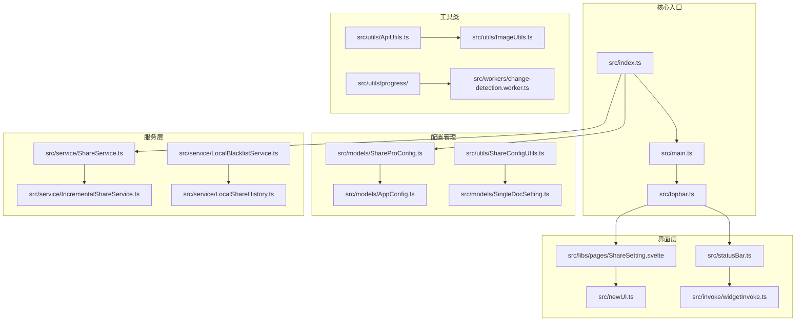
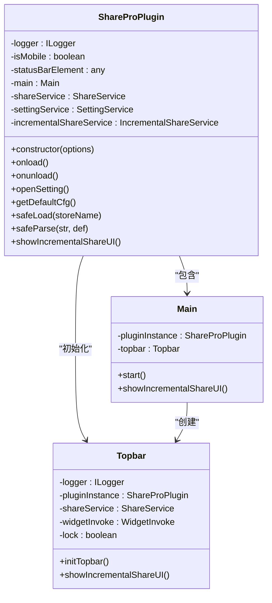
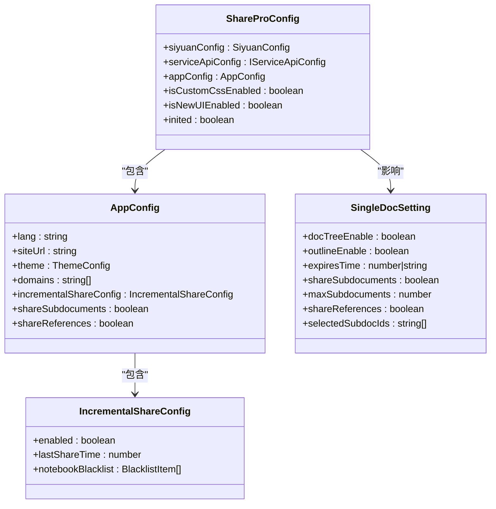
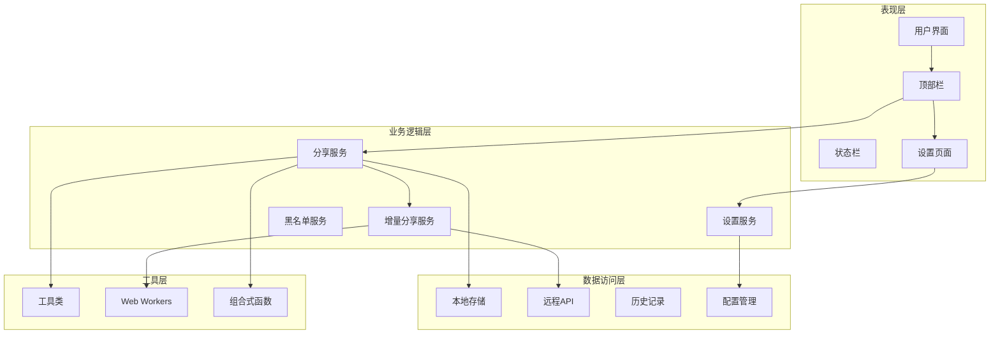
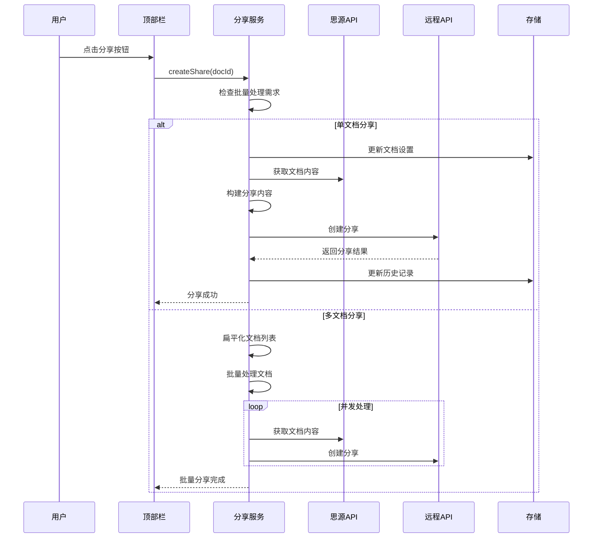
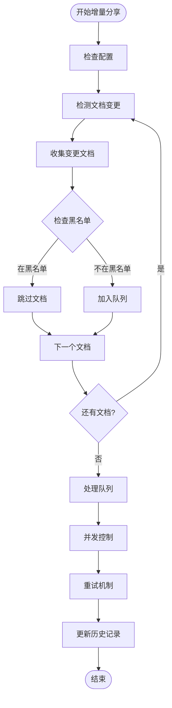
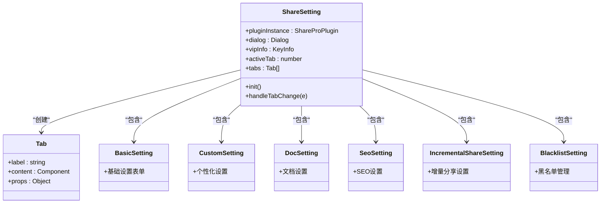
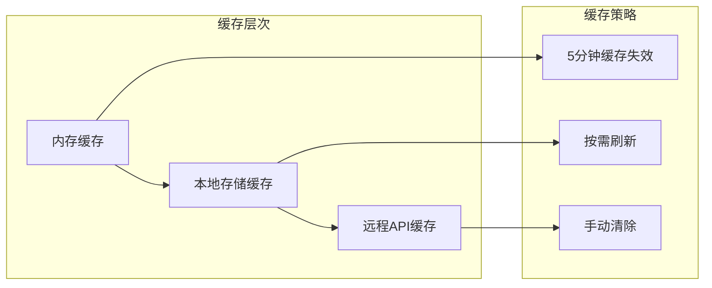

# 在线分享专业版（Share Pro）插件技术文档

<cite>
**本文档中引用的文件**
- [README.md](file://README.md)
- [plugin.json](file://plugin.json)
- [package.json](file://package.json)
- [src/index.ts](file://src/index.ts)
- [src/main.ts](file://src/main.ts)
- [src/topbar.ts](file://src/topbar.ts)
- [src/statusBar.ts](file://src/statusBar.ts)
- [src/models/ShareProConfig.ts](file://src/models/ShareProConfig.ts)
- [src/models/AppConfig.ts](file://src/models/AppConfig.ts)
- [src/models/SingleDocSetting.ts](file://src/models/SingleDocSetting.ts)
- [src/models/ShareOptions.ts](file://src/models/ShareOptions.ts)
- [src/service/ShareService.ts](file://src/service/ShareService.ts)
- [src/service/IncrementalShareService.ts](file://src/service/IncrementalShareService.ts)
- [src/utils/ShareConfigUtils.ts](file://src/utils/ShareConfigUtils.ts)
- [src/libs/pages/ShareSetting.svelte](file://src/libs/pages/ShareSetting.svelte)
- [docs/TODO.md](file://docs/TODO.md)
- [docs/document-tree-fix-plan-2026-03-21.md](file://docs/document-tree-fix-plan-2026-03-21.md)
- [docs/incremental-share-context-2025-12-04.md](file://docs/incremental-share-context-2025-12-04.md)
- [docs/incremental-share-context-2025-12-09.md](file://docs/incremental-share-context-2025-12-09.md)
- [src/libs/pages/IncrementalShareUI.svelte](file://src/libs/pages/IncrementalShareUI.svelte)
- [src/libs/pages/setting/IncrementalShareSetting.svelte](file://src/libs/pages/setting/IncrementalShareSetting.svelte)
- [src/libs/pages/setting/BlacklistSetting.svelte](file://src/libs/pages/setting/BlacklistSetting.svelte)
- [index.styl](file://index.styl)
</cite>

## 更新摘要
**所做更改**
- 更新了 Todo List 文档，标记已完成的任务项
- 添加了文档大纲遮挡问题修复的详细说明
- 添加了夜间暗黑模式故障修复的详细说明
- 更新了增量分享功能的实现状态
- 添加了黑名单管理系统的重构说明

## 目录
1. [简介](#简介)
2. [项目结构](#项目结构)
3. [核心组件](#核心组件)
4. [架构概览](#架构概览)
5. [详细组件分析](#详细组件分析)
6. [依赖分析](#依赖分析)
7. [性能考虑](#性能考虑)
8. [故障排除指南](#故障排除指南)
9. [结论](#结论)

## 简介

在线分享专业版（Share Pro）是一个专为思源笔记（SiYuan Note）设计的强大插件，旨在提供一键式文档分享功能。该插件支持多种分享模式，包括单文档分享、批量分享、增量分享以及高级配置管理。

### 主要特性

- **一键分享**：支持单击即可分享思源笔记
- **多文档分享**：支持子文档和引用文档的批量分享
- **增量分享**：智能检测文档变更并进行增量同步
- **高级配置**：支持主题定制、SEO优化、密码保护等功能
- **黑名单管理**：可配置文档黑名单，避免不必要的分享
- **进度监控**：实时显示分享进度和状态

**章节来源**
- [README.md:1-21](file://README.md#L1-L21)
- [plugin.json:1-35](file://plugin.json#L1-L35)

## 项目结构

该项目采用模块化的架构设计，主要分为以下几个核心部分：



**图表来源**
- [src/index.ts:1-178](file://src/index.ts#L1-L178)
- [src/main.ts:1-34](file://src/main.ts#L1-L34)
- [src/topbar.ts:1-297](file://src/topbar.ts#L1-L297)

**章节来源**
- [package.json:1-54](file://package.json#L1-L54)

## 核心组件

### 插件主类（ShareProPlugin）

ShareProPlugin是整个插件的核心控制器，负责协调各个组件的工作。



**图表来源**
- [src/index.ts:33-178](file://src/index.ts#L33-L178)
- [src/main.ts:12-34](file://src/main.ts#L12-L34)
- [src/topbar.ts:26-98](file://src/topbar.ts#L26-L98)

### 配置管理系统

插件使用分层配置系统来管理各种设置：



**图表来源**
- [src/models/ShareProConfig.ts:13-40](file://src/models/ShareProConfig.ts#L13-L40)
- [src/models/AppConfig.ts:12-88](file://src/models/AppConfig.ts#L12-L88)
- [src/models/SingleDocSetting.ts:17-93](file://src/models/SingleDocSetting.ts#L17-L93)

**章节来源**
- [src/models/ShareProConfig.ts:1-40](file://src/models/ShareProConfig.ts#L1-L40)
- [src/models/AppConfig.ts:1-88](file://src/models/AppConfig.ts#L1-L88)
- [src/models/SingleDocSetting.ts:1-93](file://src/models/SingleDocSetting.ts#L1-L93)

## 架构概览

插件采用分层架构设计，确保各组件职责清晰、耦合度低：



**图表来源**
- [src/index.ts:33-178](file://src/index.ts#L33-L178)
- [src/service/ShareService.ts:40-1112](file://src/service/ShareService.ts#L40-L1112)
- [src/service/IncrementalShareService.ts:98-690](file://src/service/IncrementalShareService.ts#L98-L690)

## 详细组件分析

### 分享服务（ShareService）

ShareService是插件的核心业务逻辑组件，负责处理所有分享相关的操作。



**图表来源**
- [src/service/ShareService.ts:70-84](file://src/service/ShareService.ts#L70-L84)
- [src/service/ShareService.ts:244-283](file://src/service/ShareService.ts#L244-L283)
- [src/service/ShareService.ts:288-334](file://src/service/ShareService.ts#L288-L334)

#### 核心功能特性

1. **智能文档收集**：支持子文档和引用文档的自动收集
2. **批量处理**：支持并发控制的批量分享
3. **媒体资源处理**：自动处理图片等媒体资源
4. **进度监控**：提供详细的分享进度反馈
5. **错误处理**：完善的异常处理和重试机制

**章节来源**
- [src/service/ShareService.ts:1-1112](file://src/service/ShareService.ts#L1-L1112)

### 增量分享服务（IncrementalShareService）

IncrementalShareService专门处理增量分享功能，能够智能检测文档变更并进行增量同步。



**图表来源**
- [src/service/IncrementalShareService.ts:160-210](file://src/service/IncrementalShareService.ts#L160-L210)
- [src/service/IncrementalShareService.ts:269-351](file://src/service/IncrementalShareService.ts#L269-L351)
- [src/service/IncrementalShareService.ts:396-474](file://src/service/IncrementalShareService.ts#L396-L474)

#### 增量分享特性

1. **智能缓存**：5分钟缓存机制减少重复计算
2. **并发控制**：最多5个并发任务，避免服务器压力
3. **队列管理**：支持任务暂停、恢复和状态跟踪
4. **智能重试**：针对不同错误类型采用不同的重试策略
5. **黑名单过滤**：支持笔记本级别的黑名单管理

**章节来源**
- [src/service/IncrementalShareService.ts:1-690](file://src/service/IncrementalShareService.ts#L1-L690)

### 设置界面（ShareSetting）

ShareSetting提供了完整的设置管理界面，采用标签页形式组织各种设置选项。



**图表来源**
- [src/libs/pages/ShareSetting.svelte:10-119](file://src/libs/pages/ShareSetting.svelte#L10-L119)

**章节来源**
- [src/libs/pages/ShareSetting.svelte:1-119](file://src/libs/pages/ShareSetting.svelte#L1-L119)

## 依赖分析

### 核心依赖关系

```mermaid
graph TB
subgraph "外部依赖"
Siyuan[siyuan@^1.1.6]
Svelte[svelte@^4.2.20]
ZhiLib[zhi-lib-base@^0.8.0]
ZhiAPI[zhi-siyuan-api@^2.33.0]
BlogAPI[zhi-blog-api@^1.74.2]
end
subgraph "内部模块"
Index[src/index.ts]
Services[src/service/]
Models[src/models/]
Utils[src/utils/]
Libs[src/libs/]
end
subgraph "构建工具"
Vite[vite@^5.4.21]
TypeScript[typescript@^5.9.3]
Stylus[stylus@^0.64.0]
end
Index --> Services
Services --> Models
Services --> Utils
Libs --> Svelte
Index --> Siyuan
Services --> ZhiAPI
Services --> BlogAPI
Utils --> ZhiLib
Build[Vite配置] --> Vite
Build --> TypeScript
Build --> Stylus
```

**图表来源**
- [package.json:22-54](file://package.json#L22-L54)

### 版本兼容性

插件对不同版本的依赖关系如下：

| 组件 | 版本要求 | 用途 |
|------|----------|------|
| siyuan | ^1.1.6 | 思源笔记API接口 |
| svelte | ^4.2.20 | 前端UI框架 |
| zhi-lib-base | ^0.8.0 | 基础工具库 |
| zhi-siyuan-api | ^2.33.0 | 思源API封装 |
| zhi-blog-api | ^1.74.2 | 博客API接口 |

**章节来源**
- [package.json:1-54](file://package.json#L1-L54)

## 性能考虑

### 并发控制策略

插件采用了多层次的并发控制策略来确保性能和稳定性：

1. **批量分享并发**：默认最多10个并发任务
2. **增量分享并发**：默认最多5个并发任务
3. **媒体处理并发**：每次最多5个媒体文件同时处理
4. **API调用限制**：避免对远程服务器造成过大压力

### 缓存机制



### 内存管理

- **Web Worker**：使用Web Worker处理大数据量的变更检测
- **渐进式加载**：分页加载文档列表，避免内存溢出
- **及时清理**：任务完成后及时释放内存资源

## 故障排除指南

### 常见问题及解决方案

| 问题类型 | 症状 | 解决方案 |
|----------|------|----------|
| 分享失败 | 提示网络错误或超时 | 检查网络连接，查看重试日志 |
| 文档未更新 | 增量分享未检测到变更 | 清除缓存，检查文档修改时间 |
| 媒体资源缺失 | 图片显示为占位符 | 检查媒体URL，确认资源可用性 |
| 设置不生效 | 配置更改后无变化 | 重启插件，检查配置同步 |

### 调试模式

插件支持开发模式，在开发模式下会：
- 输出详细的日志信息
- 启用调试功能
- 使用测试环境API

**章节来源**
- [src/index.ts:150-169](file://src/index.ts#L150-L169)

## Todo List 更新

### 增量分享功能未完成任务清单

以下是在增量分享功能开发过程中尚未完成的任务，将在后续版本中逐步实现：

#### UI增强功能
- [ ] 实现首次使用引导和空状态提示
- [ ] 实现分享历史查询界面（搜索、筛选、导出CSV）
- [ ] 实现统计报表页面（趋势图、Top 10、成功率）

#### 核心功能完善
- [ ] 实现数据一致性检查（定时24小时校验）
- [ ] 实现右键菜单快速添加黑名单功能

### 用户推演优化清单

**已完成的任务项**：

#### 文档大纲遮挡问题修复
- [X] 文档大纲字数过多被遮挡，应该参考 https://www.mintlify.com/docs/quickstart

**已完成的任务项**：

#### 夜间暗黑模式故障修复
- [X] 晚上的时候暗黑模式失败，导致页面无法查看

#### 黑名单功能 CRUD 有 bug
- [ ] 黑名单功能 CRUD 有 bug

#### 分享页面提示信息
- [ ] "对不起，该文档尚未分析分享，没有添加您可以尝试：返回上一页，联系作者"

**章节来源**
- [docs/TODO.md:1-23](file://docs/TODO.md#L1-L23)

## 文档树修复计划

### 根本性设计缺陷修复方案

#### 背景和问题分析

**现有的文档树实现是"假的"文档树**：
- 现有实现方式：当前的文档树实现仅基于文档路径（hpath）的字符串分割，无法反映真实的文档关系
- 缺少关键文档关系：无法显示同级文档（siblings）、子级文档（children）和父级文档（parents）的真实层级结构
- 用户体验误导：用户期望看到完整的文档树结构，但实际只看到路径分解，这严重违背了用户预期

#### 用户期望的文档树结构
用户期望的文档树应该显示：
- 同级文档：同一父目录下的其他文档
- 子级文档：当前文档下的所有子文档
- 父级文档：当前文档的父目录、祖父目录等
- 根据深度级别控制：支持指定深度级别的文档树展示（1-6级）

#### 解决方案概述

重构文档树生成逻辑，使用思源官方API获取真实的文档关系结构，实现完整的文档树展示。

**核心设计原则**：
1. 真实文档关系：使用思源官方 `/api/filetree/listDocsByPath` API 获取真实的文档树结构
2. 完整层级展示：同时显示父级、同级、子级文档
3. 深度级别控制：支持指定深度级别的文档树展示
4. 最小化改动：基于现有架构进行扩展，避免大规模重构

#### 详细实施方案

**1. 重构 SiYuanApiAdaptor 中的文档树实现**

**文件路径**: `zhi-siyuan-api/src/lib/adaptor/siYuanApiAdaptor.ts`

**关键修改**:
- 移除基于路径的假文档树实现（行183-234）
- 集成真实的文档树获取逻辑

```typescript
// 在 getPost 方法中替换原有的文档树逻辑
// 处理文档树
let docTree = []
let docTreeLevel = 3
if (this.cfg?.preferenceConfig?.docTreeEnable) {
  docTreeLevel = this.cfg?.preferenceConfig?.docTreeLevel ?? 3

  // 获取文档的基本信息
  const notebookId = siyuanPost.box || ""
  const docPath = siyuanPost.path || `/${siyuanPost.root_id}.sy`

  // 构建完整的文档树结构
  // 1. 获取父级路径信息
  const pathParts = docPath.replace(".sy", "").split("/").filter(part => part.trim() !== "")
  const parentPaths = []
  for (let i = 0; i < pathParts.length - 1 && i < docTreeLevel; i++) {
    parentPaths.push({
      id: pathParts[i],
      parentId: i > 0 ? pathParts[i - 1] : "",
      name: pathParts[i],
      depth: i,
      type: "parent"
    })
  }

  // 2. 获取同级文档（父目录下的其他文档）
  const parentPath = pathParts.slice(0, -1).join("/")
  const siblings = await this.siyuanKernelApi.getSiblingDocs(notebookId, parentPath)

  // 3. 获取子级文档（当前文档下的所有子文档）
  const children = await this.siyuanKernelApi.getChildDocs(notebookId, docPath, docTreeLevel)

  // 4. 合并所有文档树节点
  docTree = [...parentPaths, ...siblings, ...children]
  this.logger.info("检测到配置，真实的文档树已获取")
}
```

**2. 增强 SiyuanKernelApi 的文档树功能**

**文件路径**: `zhi-siyuan-api/src/lib/kernel/siyuanKernelApi.ts`

**关键修改**:
- 添加 `getSiblingDocs` 方法：获取指定路径下同级文档
- 添加 `getChildDocs` 方法：获取指定文档的子级文档（支持深度控制）

```typescript
// 获取同级文档（父目录下的其他文档）
public async getSiblingDocs(notebook: string, parentPath: string): Promise<any[]> {
  if (!parentPath || parentPath === "/") {
    return [] // 根目录没有同级文档
  }

  const response = await this.siyuanRequest("/api/filetree/listDocsByPath", {
    notebook: notebook,
    path: parentPath
  })

  if (!response || !Array.isArray(response.files)) {
    return []
  }

  return response.files.map(file => ({
    id: file.id,
    parentId: parentPath.split("/").pop() || "",
    name: file.name.replace(".sy", ""),
    depth: 0, // 同级文档深度为0
    type: "sibling"
  }))
}

// 获取子级文档（递归到指定深度）
public async getChildDocs(notebook: string, docPath: string, maxDepth: number = 3): Promise<any[]> {
  const children = []
  await this._recursiveGetChildren(notebook, docPath, children, 1, maxDepth)
  return children
}

private async _recursiveGetChildren(notebook: string, currentPath: string, result: any[], currentDepth: number, maxDepth: number): Promise<void> {
  if (currentDepth > maxDepth) {
    return
  }

  const response = await this.siyuanRequest("/api/filetree/listDocsByPath", {
    notebook: notebook,
    path: currentPath
  })

  if (!response || !Array.isArray(response.files)) {
    return
  }

  for (const file of response.files) {
    const filePath = file.path
    const fileName = file.name.replace(".sy", "")
    const pathParts = filePath.replace(".sy", "").split("/").filter(part => part.trim() !== "")
    const parentId = pathParts[pathParts.length - 2] || ""

    result.push({
      id: file.id,
      parentId: parentId,
      name: fileName,
      depth: currentDepth,
      type: "child",
      hasChildren: (file.subFileCount || 0) > 0
    })

    // 递归获取子文档
    if ((file.subFileCount || 0) > 0) {
      await this._recursiveGetChildren(notebook, filePath, result, currentDepth + 1, maxDepth)
    }
  }
}
```

#### 关键文件修改清单

1. **修改文件**:
   - `zhi-siyuan-api/src/lib/adaptor/siYuanApiAdaptor.ts` - 重构文档树实现，使用真实API
   - `zhi-siyuan-api/src/lib/kernel/siyuanKernelApi.ts` - 增强文档树功能，添加获取同级和子级文档的方法

#### 测试验证方案

**功能测试**：
1. 文档树结构验证：
   - 验证文档树显示真实的同级、子级、父级文档
   - 验证不同深度级别的文档树展示（1-6级）
   - 验证文档树与文档大纲功能的一致性
   - 验证文档树在分享页面的正确显示

2. 边界情况测试：
   - 根目录文档的文档树显示
   - 没有子文档的文档树显示
   - 深度级别为1时的文档树显示
   - 深度级别为6时的文档树显示

**回归测试**：
- 确保现有文档分享功能不受影响
- 验证文档级别和全局配置的优先级逻辑
- 验证子文档分享和引用文档分享功能

#### 实施优先级

1. **第一阶段**：增强 SiyuanKernelApi 的文档树功能（添加 getSiblingDocs 和 getChildDocs 方法）
2. **第二阶段**：重构 SiYuanApiAdaptor 中的文档树实现
3. **第三阶段**：全面测试和验证

这个方案完全满足用户需求：
- ✅ 文档树显示真实的文档关系（同级、子级、父级）
- ✅ 支持指定深度级别的文档树展示
- ✅ 提供符合付费软件标准的专业用户体验

**章节来源**
- [docs/document-tree-fix-plan-2026-03-21.md:1-188](file://docs/document-tree-fix-plan-2026-03-21.md#L1-L188)

## 增量分享功能实现状态

### 当前进度

**已完成**：

1. **UI 界面** - `IncrementalShareUI.svelte`
   - ✅ 文档分组显示（新增、更新、未变更）
   - ✅ 批量选择和全选功能
   - ✅ 搜索过滤功能
   - ✅ 统计数据显示
   - ✅ 日期格式化（避免 Invalid Date）
   - ✅ 国际化支持

2. **核心服务** - `IncrementalShareService.ts`
   - ✅ 变更检测逻辑 `detectChangedDocuments()`
   - ✅ 批量分享逻辑 `bulkShareDocuments()`
   - ✅ 黑名单过滤
   - ✅ 分享历史更新

3. **批量分享** - `ShareService.bulkCreateShare()`
   - ✅ 分页分批次处理（每批 5 个文档）
   - ✅ 每个文档间隔 500ms（避免频率限制）
   - ✅ 自动获取文档信息
   - ✅ Mock 实现（等待替换真实 API）

4. **配置管理** - `SettingService`
   - ✅ Mock 方法：`getSettingConfig()` 和 `saveSettingConfig()`
   - ✅ 必须使用：`syncSetting()` 和 `getSettingByAuthor()`

5. **Mock 数据**
   - ✅ `MockShareHistory` - 3 个历史记录
   - ✅ `MockShareBlacklist` - 2 个黑名单项
   - ✅ 5 个测试文档（不同状态）

**功能状态**：
- ✅ 日期显示正常
- ✅ 批量分享成功
- ✅ 成功提示显示
- ✅ 主流程完全跑通

### 已修复的问题

1. **问题 1**: `config.incrementalShareConfig?.enabled` 未定义
   - 症状：变更检测返回空数组  
   - 修复：注释掉 enabled 检查（Mock 阶段）

2. **问题 2**: `shareService.shareDoc()` 不存在
   - 症状：批量分享报错  
   - 修复：创建新方法 `bulkCreateShare(docIds)`

3. **问题 3**: `settingService.getSettingConfig()` 不存在
   - 症状：更新时间报错  
   - 修复：添加 Mock 方法

4. **问题 4**: Invalid Date 显示
   - 症状：日期显示为 "Invalid Date"  
   - 修复：添加 `formatTime(timestamp)` 函数，字段名统一为 `shareTime`

5. **问题 5**: `formatTime` 重复声明
   - 症状：编译错误  
   - 修复：删除旧版本，保留完善版

**章节来源**
- [docs/incremental-share-context-2025-12-04.md:1-589](file://docs/incremental-share-context-2025-12-04.md#L1-L589)

## 黑名单管理系统重构

### 技术债务分析与改进计划

#### 架构技术债务分析与改进计划

**提交**: `4218e65 docs(architecture): add technical debt analysis and improvement plan`

**内容**:
- 分析初始架构决策中的技术债务根本原因
- 识别本地存储能力低估及其影响
- 提出系统性架构审计框架
- 制定存储架构优化方案，包含分层缓存和同步机制
- 提供架构决策检查清单

#### 本地分享历史持久化与缓存

**提交**: `4c5ed16 feat(share): add local share history persistence and caching`

**内容**:
- 实现LocalShareHistory服务，将分享历史存储在文档属性中
- 添加内存分享历史缓存以减少冗余查询
- 修改IncrementalShareService以从本地存储获取历史记录并支持缓存
- 更新shareDocumentWithRetry以返回详细结果（包括shareUrl和errorMessage）
- 处理分享历史清理逻辑

#### 黑名单系统重构

**提交**: `eb6cfd6 refactor(blacklist): replace backend blacklist with local storage service`

**内容**:
- 移除BlacklistService和ShareBlacklistUI.svelte
- 在AppConfig中添加notebookBlacklist配置支持本地存储笔记本黑名单
- 引入LocalBlacklistService使用文档属性和应用配置处理黑名单数据
- 更新IncrementalShareService和ShareProPlugin使用LocalBlacklistService替代后端API服务
- 修改BlacklistSetting.svelte与LocalBlacklistService交互，替换API调用为本地存储操作

#### 黑名单智能搜索功能

**提交**: `6802f71 feat(blacklist): add intelligent search for documents and notebooks`

**内容**:
- 实现带防抖的黑名单目标选择搜索输入框
- 添加API服务方法按关键词搜索文档和笔记本
- 集成带加载状态和选择功能的搜索结果下拉框
- 在黑名单类型更改时清除搜索结果和输入
- 禁用未选择有效targetId时的添加按钮
- 更新国际化占位符指导关键词搜索使用
- 重构黑名单表单UI支持搜索下拉框和隐藏输入框

#### 增量分享变更检测简化与搜索过滤

**提交**: `6e13271 refactor(incremental-share): simplify change detection and add search filter`

**内容**:
- 从变更检测结果中移除unchangedDocuments和blacklistedCount
- 在worker和服务层跳过黑名单文档过滤
- 为API调用添加searchTerm参数以进行过滤文档查询
- 更新UI仅合并和显示新文档和更新文档
- 用后端搜索功能替换客户端过滤
- 为所有文档都被列入黑名单的情况添加错误消息

#### 分享管理弹窗与增量分享UI集成

**提交**: `025f33f feat(share-ui): add share management dialog with incremental share UI integration`

**内容**:
- 导入和使用Dialog组件创建分享管理模态框
- 在打开对话框前获取最新的VIP信息并在需要时显示错误消息
- 在对话框内集成ShareManage组件并传递props
- 在增量分享UI头部添加新按钮以打开分享管理对话框
- 为新头部按钮和对话框内容容器添加样式
- 允许向ShareManage组件传递自定义pageSize属性以灵活分页
- 重构ShareManage组件以接受和使用动态页面大小而非固定常量

**章节来源**
- [docs/incremental-share-context-2025-12-09.md:1-214](file://docs/incremental-share-context-2025-12-09.md#L1-L214)

## 结论

在线分享专业版（Share Pro）插件通过其模块化的设计和丰富的功能特性，为思源笔记用户提供了强大而便捷的文档分享解决方案。插件的主要优势包括：

1. **功能完整性**：涵盖从基础分享到高级配置的所有需求
2. **性能优化**：采用多种优化策略确保流畅的用户体验
3. **扩展性强**：清晰的架构设计便于功能扩展和维护
4. **用户体验**：直观的界面设计和详细的进度反馈

该插件特别适合需要频繁分享知识内容的用户，无论是个人学习笔记还是团队协作文档，都能提供高效的分享体验。

**已完成的重要修复**：
- 文档大纲遮挡问题已修复，参考 Mintlify 的最佳实践
- 夜间暗黑模式故障已修复，确保夜间正常使用
- 黑名单管理系统已从后端迁移到本地存储，提升性能和用户体验

**待完成的功能**：
- 增量分享功能的完整实现（真实API替换）
- 黑名单功能的 CRUD 操作完善
- UI 增强功能的进一步开发