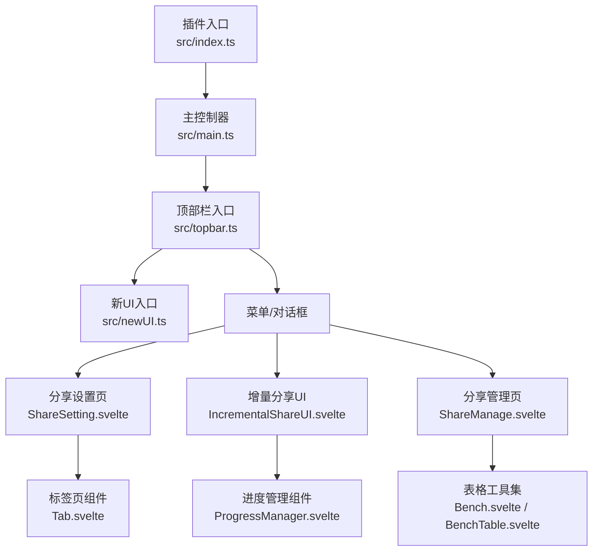
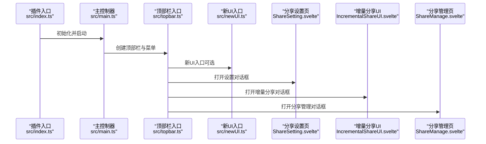
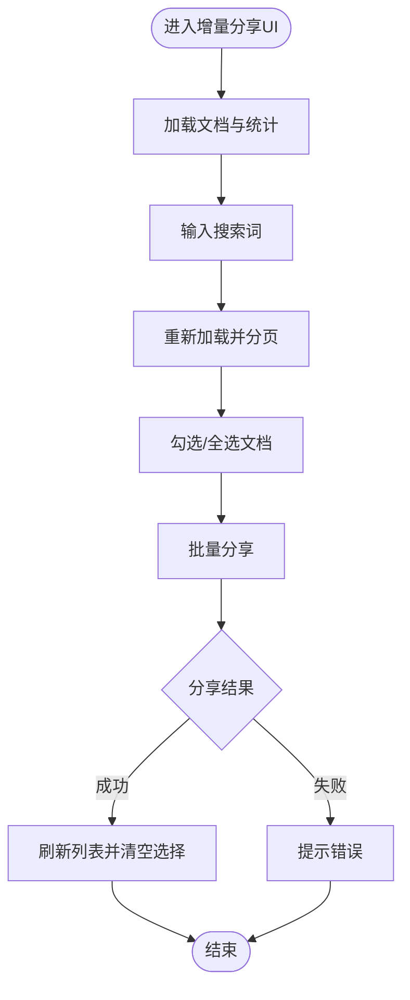
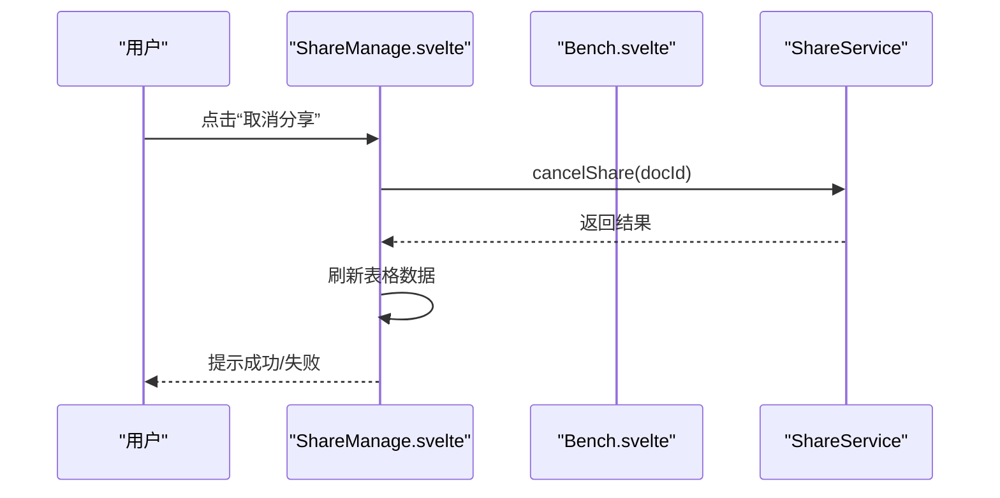
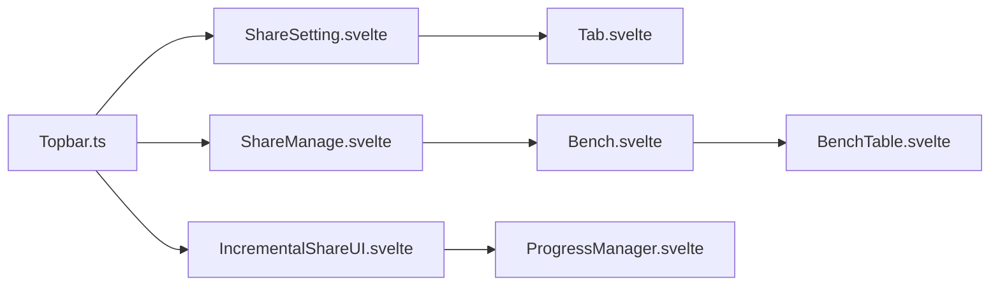

# UI组件系统

<cite>
**本文引用的文件**
- [src/index.ts](file://src/index.ts)
- [src/newUI.ts](file://src/newUI.ts)
- [src/main.ts](file://src/main.ts)
- [src/topbar.ts](file://src/topbar.ts)
- [src/libs/pages/ShareSetting.svelte](file://src/libs/pages/ShareSetting.svelte)
- [src/libs/pages/IncrementalShareUI.svelte](file://src/libs/pages/IncrementalShareUI.svelte)
- [src/libs/pages/ShareManage.svelte](file://src/libs/pages/ShareManage.svelte)
- [src/libs/pages/setting/BasicSetting.svelte](file://src/libs/pages/setting/BasicSetting.svelte)
- [src/libs/pages/setting/IncrementalShareSetting.svelte](file://src/libs/pages/setting/IncrementalShareSetting.svelte)
- [src/libs/components/tab/Tab.svelte](file://src/libs/components/tab/Tab.svelte)
- [src/libs/components/ProgressManager.svelte](file://src/libs/components/ProgressManager.svelte)
- [src/libs/components/bench/Bench.svelte](file://src/libs/components/bench/Bench.svelte)
- [src/libs/components/bench/BenchTable.svelte](file://src/libs/components/bench/BenchTable.svelte)
</cite>

## 目录
1. [简介](#简介)
2. [项目结构](#项目结构)
3. [核心组件](#核心组件)
4. [架构总览](#架构总览)
5. [详细组件分析](#详细组件分析)
6. [依赖关系分析](#依赖关系分析)
7. [性能考量](#性能考量)
8. [故障排查指南](#故障排查指南)
9. [结论](#结论)
10. [附录](#附录)

## 简介
本文件系统性梳理“思源笔记分享专业版”的UI组件体系，聚焦Svelte组件的视觉外观、行为与交互模式，重点覆盖以下方面：
- 主要页面组件：分享设置页（ShareSetting）、增量分享UI（IncrementalShareUI）、分享管理页（ShareManage）
- 通用组件：标签页组件（Tab）、进度管理组件（ProgressManager）、表格工具集（Bench系列）
- 组件属性（props/attributes）、事件处理、插槽使用
- 实际使用示例与代码片段路径
- 响应式设计与无障碍访问指导
- 组件状态、动画与过渡效果
- 样式定制与主题支持
- 跨浏览器兼容性与性能优化建议

## 项目结构
该UI系统围绕插件入口与顶部栏入口展开，采用“页面组件 + 通用组件 + 工具组件”的分层组织方式：
- 插件入口负责加载配置、初始化服务与挂载对话框/菜单
- 顶部栏入口提供快捷菜单与新UI入口
- 页面组件通过Svelte实例挂载到容器，组合通用组件实现复杂交互
- 通用组件（如Tab、Bench、ProgressManager）可复用在多个页面

图示来源
- [src/index.ts:61-95](file://src/index.ts#L61-L95)
- [src/main.ts:21-30](file://src/main.ts#L21-L30)
- [src/topbar.ts:41-98](file://src/topbar.ts#L41-L98)
- [src/newUI.ts:53-122](file://src/newUI.ts#L53-L122)

章节来源
- [src/index.ts:61-177](file://src/index.ts#L61-L177)
- [src/main.ts:21-34](file://src/main.ts#L21-L34)
- [src/topbar.ts:41-294](file://src/topbar.ts#L41-L294)
- [src/newUI.ts:53-230](file://src/newUI.ts#L53-L230)

## 核心组件
- 分享设置页（ShareSetting.svelte）
  - 功能：聚合基础设置、个性化设置、文档设置、SEO设置、增量分享设置、黑名单管理等多标签页
  - 关键点：通过Tab组件渲染子页面，支持垂直布局与标签切换事件
- 增量分享UI（IncrementalShareUI.svelte）
  - 功能：按增量策略检测新/更新文档，支持分页、搜索、批量分享、统计面板
  - 关键点：结合虚拟列表、分页器、状态管理与进度反馈
- 分享管理页（ShareManage.svelte）
  - 功能：展示分享文档列表，支持排序、筛选、分页、批量操作（取消分享、设为主页、查看、跳转、复制ID）
  - 关键点：基于Bench表格工具集构建，集成复制、气泡提示与远程同步
- 标签页组件（Tab.svelte）
  - 功能：通用标签页容器，支持水平/垂直布局、动态内容渲染、tabChange事件
- 进度管理组件（ProgressManager.svelte）
  - 功能：全局进度提示浮层，展示处理状态、百分比、资源处理进度、错误详情、自动关闭倒计时
- 表格工具集（Bench系列）
  - 功能：搜索、表格渲染、分页、导出、列定义与事件绑定

章节来源
- [src/libs/pages/ShareSetting.svelte:36-118](file://src/libs/pages/ShareSetting.svelte#L36-L118)
- [src/libs/pages/IncrementalShareUI.svelte:146-343](file://src/libs/pages/IncrementalShareUI.svelte#L146-L343)
- [src/libs/pages/ShareManage.svelte:250-351](file://src/libs/pages/ShareManage.svelte#L250-L351)
- [src/libs/components/tab/Tab.svelte:19-24](file://src/libs/components/tab/Tab.svelte#L19-L24)
- [src/libs/components/ProgressManager.svelte:104-226](file://src/libs/components/ProgressManager.svelte#L104-L226)
- [src/libs/components/bench/Bench.svelte:58-96](file://src/libs/components/bench/Bench.svelte#L58-L96)

## 架构总览
下图展示从插件入口到页面组件的调用链路与组件协作关系：

图示来源
- [src/index.ts:61-95](file://src/index.ts#L61-L95)
- [src/main.ts:21-30](file://src/main.ts#L21-L30)
- [src/topbar.ts:41-98](file://src/topbar.ts#L41-L98)
- [src/newUI.ts:53-122](file://src/newUI.ts#L53-L122)

## 详细组件分析

### 分享设置页（ShareSetting.svelte）
- 视觉与行为
  - 垂直标签布局，支持基础设置、个性化设置、文档设置、SEO设置、增量分享设置、黑名单管理
  - 切换标签时通过tabChange事件更新当前激活页
- 属性（props）
  - pluginInstance: ShareProPlugin
  - dialog: Dialog
  - vipInfo: 包含code/msg/data的对象
- 事件
  - tabChange: 切换标签时返回索引
- 插槽
  - 通过动态组件渲染各标签页内容
- 使用示例（代码片段路径）
  - [打开设置对话框:73-95](file://src/index.ts#L73-L95)
  - [标签页数据初始化:38-107](file://src/libs/pages/ShareSetting.svelte#L38-L107)

章节来源
- [src/libs/pages/ShareSetting.svelte:26-118](file://src/libs/pages/ShareSetting.svelte#L26-L118)
- [src/index.ts:73-95](file://src/index.ts#L73-L95)

### 增量分享UI（IncrementalShareUI.svelte）
- 视觉与行为
  - 顶部操作区：搜索、批量分享、刷新；中部统计区（可折叠）；统一文档列表（新/更新类型标识）；底部分页控件
  - 支持虚拟滚动、分页加载、选择/全选、批量分享、加载状态与错误提示
- 属性（props）
  - pluginInstance: ShareProPlugin
  - cfg: ShareProConfig
- 事件
  - 通过按钮与输入框事件驱动：搜索、刷新、分页、批量分享、选择切换
- 插槽
  - 无插槽，通过模板与逻辑控制渲染
- 使用示例（代码片段路径）
  - [打开增量分享对话框:264-293](file://src/topbar.ts#L264-L293)
  - [加载文档与分页:146-245](file://src/libs/pages/IncrementalShareUI.svelte#L146-L245)
  - [批量分享流程:298-342](file://src/libs/pages/IncrementalShareUI.svelte#L298-L342)

图示来源
- [src/libs/pages/IncrementalShareUI.svelte:146-343](file://src/libs/pages/IncrementalShareUI.svelte#L146-L343)

章节来源
- [src/libs/pages/IncrementalShareUI.svelte:29-50](file://src/libs/pages/IncrementalShareUI.svelte#L29-L50)
- [src/libs/pages/IncrementalShareUI.svelte:146-343](file://src/libs/pages/IncrementalShareUI.svelte#L146-L343)
- [src/topbar.ts:264-293](file://src/topbar.ts#L264-L293)

### 分享管理页（ShareManage.svelte）
- 视觉与行为
  - 基于Bench表格工具集渲染，支持列格式化、排序、搜索、分页
  - 操作列包含：取消分享、设为主页、查看、跳转原文档、复制文档ID；支持复制标题与气泡提示
- 属性（props）
  - pluginInstance: ShareProPlugin
  - keyInfo: KeyInfo
  - pageSize: number（默认来自常量）
- 事件
  - 点击操作项触发对应动作（取消分享、设为主页、查看、跳转、复制）
- 插槽
  - 通过Bench组件的列定义与formatter实现
- 使用示例（代码片段路径）
  - [打开分享管理对话框:134-136](file://src/newUI.ts#L134-L136)
  - [表格列定义与格式化:39-248](file://src/libs/pages/ShareManage.svelte#L39-L248)
  - [远程操作回调（窗口函数）:289-344](file://src/libs/pages/ShareManage.svelte#L289-L344)

图示来源
- [src/libs/pages/ShareManage.svelte:289-300](file://src/libs/pages/ShareManage.svelte#L289-L300)
- [src/libs/pages/ShareManage.svelte:250-287](file://src/libs/pages/ShareManage.svelte#L250-L287)

章节来源
- [src/libs/pages/ShareManage.svelte:24-351](file://src/libs/pages/ShareManage.svelte#L24-L351)
- [src/newUI.ts:134-136](file://src/newUI.ts#L134-L136)

### 标签页组件（Tab.svelte）
- 视觉与行为
  - 支持水平/垂直布局，点击切换标签，派发tabChange事件
- 属性（props）
  - tabs: 数组，每项包含label/content/props
  - activeTab: number
  - vertical: boolean
- 事件
  - tabChange: 返回被点击的标签索引
- 插槽
  - 无插槽，通过动态组件渲染内容
- 使用示例（代码片段路径）
  - [在设置页中使用:118-118](file://src/libs/pages/ShareSetting.svelte#L118-L118)

章节来源
- [src/libs/components/tab/Tab.svelte:13-24](file://src/libs/components/tab/Tab.svelte#L13-L24)
- [src/libs/pages/ShareSetting.svelte:118-118](file://src/libs/pages/ShareSetting.svelte#L118-L118)

### 进度管理组件（ProgressManager.svelte）
- 视觉与行为
  - 固定在右下角的半透明浮层，展示任务名称、状态、进度百分比、资源处理进度、等待资源完成提示、当前文档、错误详情、自动关闭倒计时
- 属性（props）
  - pluginInstance: ShareProPlugin
- 事件
  - 关闭/取消：手动关闭与取消批次
- 插槽
  - 无插槽，纯模板渲染
- 使用示例（代码片段路径）
  - [订阅进度状态并渲染:20-30](file://src/libs/components/ProgressManager.svelte#L20-L30)
  - [自动关闭与取消逻辑:42-101](file://src/libs/components/ProgressManager.svelte#L42-L101)

章节来源
- [src/libs/components/ProgressManager.svelte:8-101](file://src/libs/components/ProgressManager.svelte#L8-L101)

### 表格工具集（Bench系列）
- Bench.svelte
  - 组合BenchSearch、BenchTable、BenchPager、BenchExport，支持搜索、表格、分页、导出
  - 支持大量自定义类名与文本国际化参数
- BenchTable.svelte
  - 渲染表格头与行，支持列排序、formatter、HTML渲染、鼠标/键盘事件透传
- 使用示例（代码片段路径）
  - [在分享管理页中使用:363-382](file://src/libs/pages/ShareManage.svelte#L363-L382)
  - [列定义与事件绑定:39-248](file://src/libs/pages/ShareManage.svelte#L39-L248)

章节来源
- [src/libs/components/bench/Bench.svelte:16-96](file://src/libs/components/bench/Bench.svelte#L16-L96)
- [src/libs/components/bench/BenchTable.svelte:10-98](file://src/libs/components/bench/BenchTable.svelte#L10-L98)
- [src/libs/pages/ShareManage.svelte:363-382](file://src/libs/pages/ShareManage.svelte#L363-L382)

## 依赖关系分析
- 组件耦合
  - 页面组件对通用组件存在单向依赖（如ShareSetting依赖Tab、ShareManage依赖Bench）
  - 通用组件内部解耦，通过props与事件通信
- 外部依赖
  - Siyuan API（对话框、菜单、消息提示）
  - Svelte虚拟列表（IncrementalShareUI）
  - 进度状态订阅（ProgressManager）
- 潜在循环依赖
  - 未发现直接循环依赖；若未来扩展，需避免页面组件相互引用

图示来源
- [src/libs/pages/ShareSetting.svelte:15-23](file://src/libs/pages/ShareSetting.svelte#L15-L23)
- [src/libs/pages/ShareManage.svelte:21-21](file://src/libs/pages/ShareManage.svelte#L21-L21)
- [src/libs/pages/IncrementalShareUI.svelte:11-26](file://src/libs/pages/IncrementalShareUI.svelte#L11-L26)
- [src/topbar.ts:21-21](file://src/topbar.ts#L21-L21)

章节来源
- [src/libs/pages/ShareSetting.svelte:15-23](file://src/libs/pages/ShareSetting.svelte#L15-L23)
- [src/libs/pages/ShareManage.svelte:21-21](file://src/libs/pages/ShareManage.svelte#L21-L21)
- [src/libs/pages/IncrementalShareUI.svelte:11-26](file://src/libs/pages/IncrementalShareUI.svelte#L11-L26)
- [src/topbar.ts:21-21](file://src/topbar.ts#L21-L21)

## 性能考量
- 虚拟滚动
  - IncrementalShareUI使用虚拟列表渲染长列表，减少DOM节点数量，提升滚动性能
- 分页加载
  - 增量分享与管理页均采用分页加载，降低一次性渲染压力
- 状态订阅与清理
  - ProgressManager在组件销毁时清理订阅与定时器，避免内存泄漏
- 事件冒泡控制
  - 进度管理组件阻止事件冒泡，避免影响父级交互
- 建议
  - 对超大数据集进一步考虑懒加载与缓存
  - 表格列formatter尽量轻量化，避免复杂DOM操作

章节来源
- [src/libs/pages/IncrementalShareUI.svelte:426-461](file://src/libs/pages/IncrementalShareUI.svelte#L426-L461)
- [src/libs/pages/ShareManage.svelte:250-287](file://src/libs/pages/ShareManage.svelte#L250-L287)
- [src/libs/components/ProgressManager.svelte:32-40](file://src/libs/components/ProgressManager.svelte#L32-L40)
- [src/libs/components/ProgressManager.svelte:84-101](file://src/libs/components/ProgressManager.svelte#L84-L101)

## 故障排查指南
- 设置页无法打开
  - 检查插件实例与对话框创建流程
  - 参考：[打开设置对话框:73-95](file://src/index.ts#L73-L95)
- 增量分享UI无数据或报错
  - 确认VIP状态与配置加载
  - 检查分页与搜索参数传递
  - 参考：[加载文档与分页:146-245](file://src/libs/pages/IncrementalShareUI.svelte#L146-L245)
- 分享管理页空白或加载异常
  - 检查表格数据结构与列定义
  - 参考：[表格数据更新:250-287](file://src/libs/pages/ShareManage.svelte#L250-L287)
- 进度浮层不消失或重复出现
  - 确认订阅清理与自动关闭逻辑
  - 参考：[订阅与清理:20-40](file://src/libs/components/ProgressManager.svelte#L20-L40)

章节来源
- [src/index.ts:73-95](file://src/index.ts#L73-L95)
- [src/libs/pages/IncrementalShareUI.svelte:146-245](file://src/libs/pages/IncrementalShareUI.svelte#L146-L245)
- [src/libs/pages/ShareManage.svelte:250-287](file://src/libs/pages/ShareManage.svelte#L250-L287)
- [src/libs/components/ProgressManager.svelte:20-40](file://src/libs/components/ProgressManager.svelte#L20-L40)

## 结论
该UI组件系统以Svelte为核心，采用页面组件与通用组件分离的设计，具备良好的可维护性与复用性。通过标签页、表格工具集与进度管理组件，实现了从设置到分享再到管理的完整工作流。建议在后续迭代中持续关注大数据场景下的性能优化与无障碍访问完善。

## 附录

### 组件属性与事件速查
- 分享设置页（ShareSetting.svelte）
  - 属性：pluginInstance, dialog, vipInfo
  - 事件：tabChange
- 增量分享UI（IncrementalShareUI.svelte）
  - 属性：pluginInstance, cfg
  - 事件：按钮与输入事件（搜索、刷新、分页、批量分享、选择切换）
- 分享管理页（ShareManage.svelte）
  - 属性：pluginInstance, keyInfo, pageSize
  - 事件：列内操作点击、复制、气泡提示
- 标签页组件（Tab.svelte）
  - 属性：tabs, activeTab, vertical
  - 事件：tabChange
- 进度管理组件（ProgressManager.svelte）
  - 属性：pluginInstance
  - 事件：关闭、取消
- 表格工具集（Bench系列）
  - 属性：data, columns, limit, offset, order, dir, search 等
  - 事件：列排序、点击、鼠标/键盘事件透传

章节来源
- [src/libs/pages/ShareSetting.svelte:26-33](file://src/libs/pages/ShareSetting.svelte#L26-L33)
- [src/libs/pages/IncrementalShareUI.svelte:29-31](file://src/libs/pages/IncrementalShareUI.svelte#L29-L31)
- [src/libs/pages/ShareManage.svelte:24-27](file://src/libs/pages/ShareManage.svelte#L24-L27)
- [src/libs/components/tab/Tab.svelte:13-16](file://src/libs/components/tab/Tab.svelte#L13-L16)
- [src/libs/components/ProgressManager.svelte:8-10](file://src/libs/components/ProgressManager.svelte#L8-L10)
- [src/libs/components/bench/Bench.svelte:16-50](file://src/libs/components/bench/Bench.svelte#L16-L50)