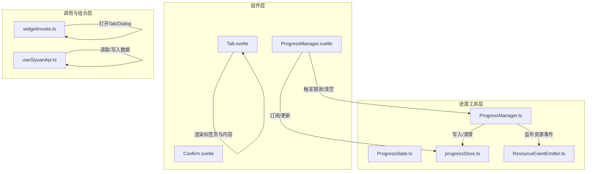
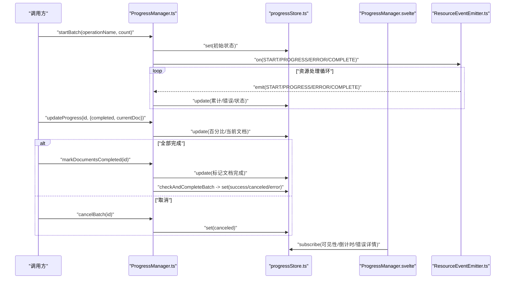
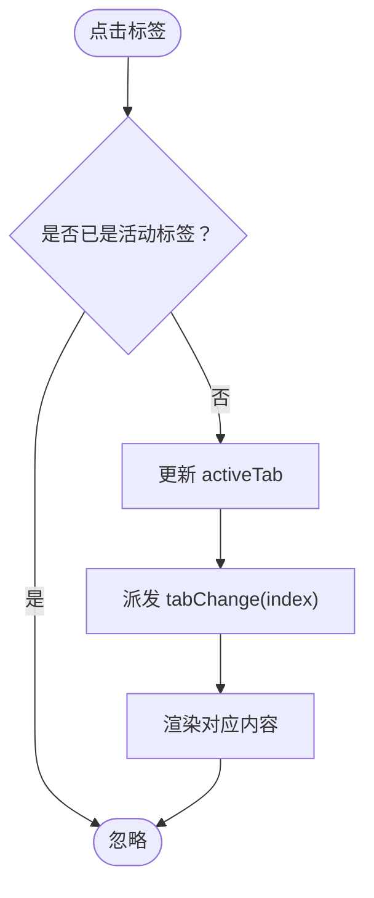
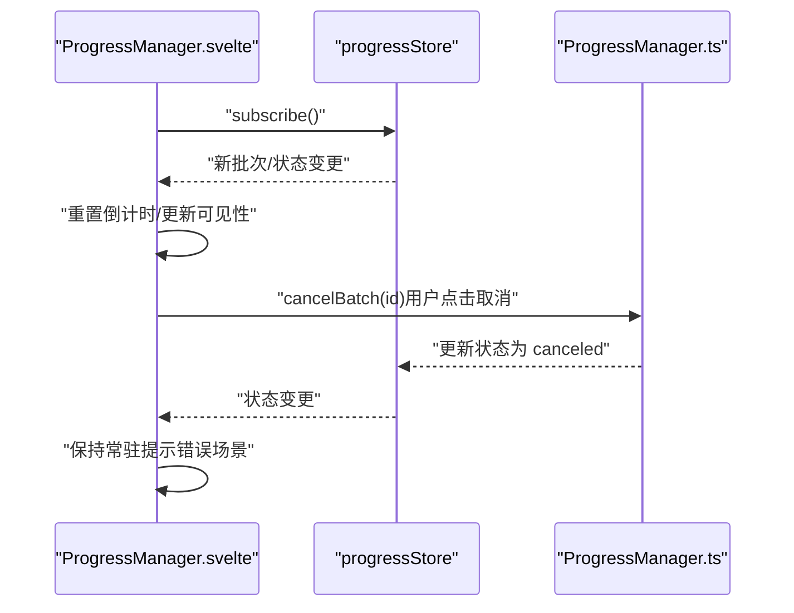
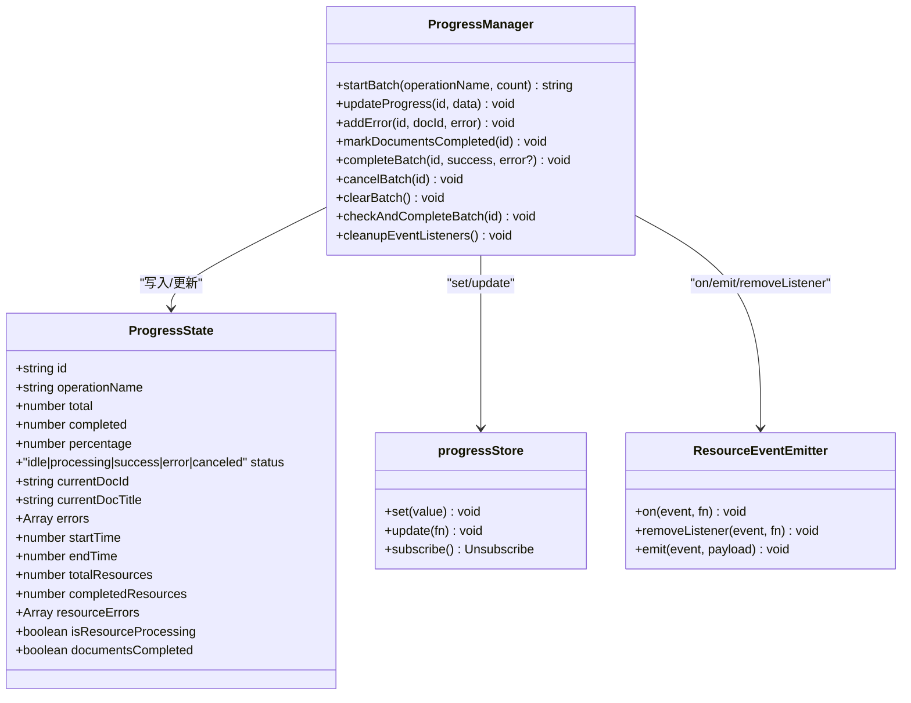
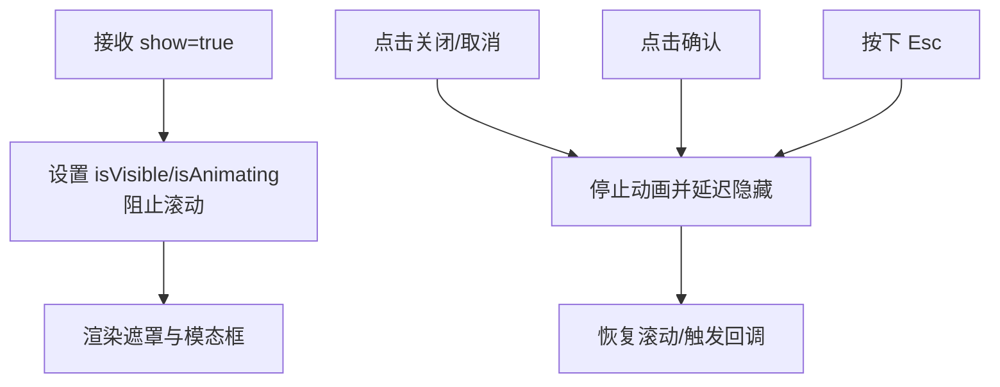
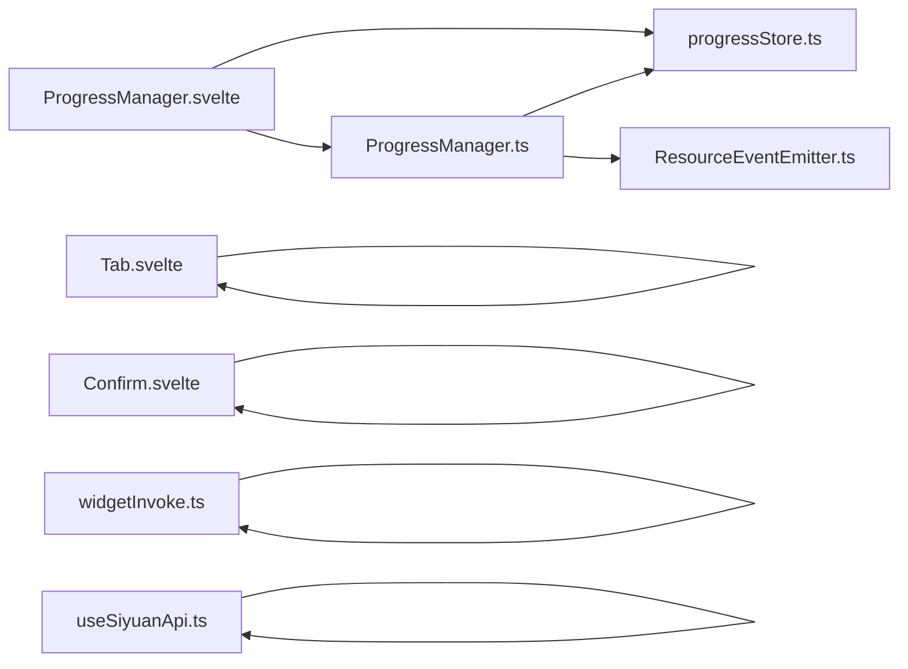

# 通用组件

<cite>
**本文引用的文件**
- [src/libs/components/tab/Tab.svelte](file://src/libs/components/tab/Tab.svelte)
- [src/libs/components/ProgressManager.svelte](file://src/libs/components/ProgressManager.svelte)
- [src/libs/components/Confirm.svelte](file://src/libs/components/Confirm.svelte)
- [src/utils/progress/ProgressManager.ts](file://src/utils/progress/ProgressManager.ts)
- [src/utils/progress/ProgressState.ts](file://src/utils/progress/ProgressState.ts)
- [src/utils/progress/progressStore.ts](file://src/utils/progress/progressStore.ts)
- [src/utils/progress/ResourceEventEmitter.ts](file://src/utils/progress/ResourceEventEmitter.ts)
- [src/invoke/widgetInvoke.ts](file://src/invoke/widgetInvoke.ts)
- [src/composables/useSiyuanApi.ts](file://src/composables/useSiyuanApi.ts)
</cite>

## 目录
1. [简介](#简介)
2. [项目结构](#项目结构)
3. [核心组件](#核心组件)
4. [架构总览](#架构总览)
5. [详细组件分析](#详细组件分析)
6. [依赖关系分析](#依赖关系分析)
7. [性能考量](#性能考量)
8. [故障排查指南](#故障排查指南)
9. [结论](#结论)
10. [附录](#附录)

## 简介
本文件面向“思源笔记分享专业版”的通用组件，系统性地文档化以下能力：
- Tab 组件：多标签页实现，支持垂直/水平布局、标签切换、动态内容加载与事件分发
- ProgressManager 组件：进度管理与可视化，覆盖进度跟踪、状态更新、错误聚合、自动关闭与用户反馈
- Confirm 组件：确认对话框，支持遮罩、动画、键盘与外部点击关闭
- 其他通用能力：通过工具类与事件总线实现跨组件通信与状态共享

目标是帮助开发者快速理解组件的属性、事件、插槽、样式定制、状态管理与生命周期，并提供可复用的最佳实践与示例路径。

## 项目结构
通用组件主要位于 src/libs/components 下，配合 src/utils/progress 提供全局进度状态与事件总线；业务页面通过 src/invoke/widgetInvoke.ts 与 src/composables/useSiyuanApi.ts 进行集成。

图表来源
- [src/libs/components/tab/Tab.svelte:1-124](file://src/libs/components/tab/Tab.svelte#L1-L124)
- [src/libs/components/ProgressManager.svelte:1-471](file://src/libs/components/ProgressManager.svelte#L1-L471)
- [src/libs/components/Confirm.svelte:1-218](file://src/libs/components/Confirm.svelte#L1-L218)
- [src/utils/progress/ProgressManager.ts:1-238](file://src/utils/progress/ProgressManager.ts#L1-L238)
- [src/utils/progress/ProgressState.ts:1-27](file://src/utils/progress/ProgressState.ts#L1-L27)
- [src/utils/progress/progressStore.ts:1-15](file://src/utils/progress/progressStore.ts#L1-L15)
- [src/utils/progress/ResourceEventEmitter.ts:1-11](file://src/utils/progress/ResourceEventEmitter.ts#L1-L11)
- [src/invoke/widgetInvoke.ts:1-80](file://src/invoke/widgetInvoke.ts#L1-L80)
- [src/composables/useSiyuanApi.ts:1-465](file://src/composables/useSiyuanApi.ts#L1-L465)

章节来源
- [src/libs/components/tab/Tab.svelte:1-124](file://src/libs/components/tab/Tab.svelte#L1-L124)
- [src/libs/components/ProgressManager.svelte:1-471](file://src/libs/components/ProgressManager.svelte#L1-L471)
- [src/libs/components/Confirm.svelte:1-218](file://src/libs/components/Confirm.svelte#L1-L218)
- [src/utils/progress/ProgressManager.ts:1-238](file://src/utils/progress/ProgressManager.ts#L1-L238)
- [src/utils/progress/ProgressState.ts:1-27](file://src/utils/progress/ProgressState.ts#L1-L27)
- [src/utils/progress/progressStore.ts:1-15](file://src/utils/progress/progressStore.ts#L1-L15)
- [src/utils/progress/ResourceEventEmitter.ts:1-11](file://src/utils/progress/ResourceEventEmitter.ts#L1-L11)
- [src/invoke/widgetInvoke.ts:1-80](file://src/invoke/widgetInvoke.ts#L1-L80)
- [src/composables/useSiyuanApi.ts:1-465](file://src/composables/useSiyuanApi.ts#L1-L465)

## 核心组件
- Tab 组件：提供多标签页容器，支持垂直/水平布局、活动标签高亮、动态内容渲染与 tabChange 事件
- ProgressManager 组件：以浮层形式展示批量任务进度，支持自动关闭、手动关闭、取消、错误聚合与资源处理等待态
- Confirm 组件：提供确认对话框，支持遮罩层、动画过渡、Esc 关闭、外部点击关闭与回调

章节来源
- [src/libs/components/tab/Tab.svelte:10-25](file://src/libs/components/tab/Tab.svelte#L10-L25)
- [src/libs/components/ProgressManager.svelte:1-102](file://src/libs/components/ProgressManager.svelte#L1-L102)
- [src/libs/components/Confirm.svelte:1-70](file://src/libs/components/Confirm.svelte#L1-L70)

## 架构总览
进度管理采用“工具类 + 全局状态 + 事件总线”的解耦设计：
- ProgressManager.ts 提供静态方法，负责批量任务的启动、更新、错误记录、完成与清理
- progressStore.ts 提供 Svelte 可订阅的全局状态
- ResourceEventEmitter.ts 提供资源处理事件（开始/进度/错误/完成），由 ProgressManager.ts 订阅并联动更新
- ProgressManager.svelte 订阅 progressStore，驱动 UI 展示与交互

图表来源
- [src/utils/progress/ProgressManager.ts:12-102](file://src/utils/progress/ProgressManager.ts#L12-L102)
- [src/utils/progress/ProgressManager.ts:107-172](file://src/utils/progress/ProgressManager.ts#L107-L172)
- [src/utils/progress/ProgressManager.ts:184-222](file://src/utils/progress/ProgressManager.ts#L184-L222)
- [src/utils/progress/progressStore.ts:7-14](file://src/utils/progress/progressStore.ts#L7-L14)
- [src/utils/progress/ResourceEventEmitter.ts:3-10](file://src/utils/progress/ResourceEventEmitter.ts#L3-L10)
- [src/libs/components/ProgressManager.svelte:20-40](file://src/libs/components/ProgressManager.svelte#L20-L40)
- [src/libs/components/ProgressManager.svelte:42-81](file://src/libs/components/ProgressManager.svelte#L42-L81)

## 详细组件分析

### Tab 组件
- 功能要点
  - 多标签页容器，支持垂直/水平布局
  - 活动标签高亮，点击切换并派发 tabChange 事件
  - 支持动态内容：传入组件构造器或静态内容，动态渲染
- 关键属性
  - tabs: 数组，元素含 label、content（组件构造器或静态内容）、props（透传给动态组件）
  - activeTab: number，当前活动标签索引
  - vertical: boolean，是否垂直布局
- 事件
  - tabChange(index: number)
- 插槽
  - 无内置插槽，但 content 支持传入具名插槽的组件实例（由调用方自行组织）
- 样式定制
  - 通过 CSS 类名覆盖：.tabs、.tab-list、.tab、.tab-content、.tab.active 等
  - 支持暗色主题变量适配
- 生命周期与状态
  - 本地状态仅包含 activeTab 与事件分发，适合轻量使用
- 最佳实践
  - 动态内容建议使用组件构造器并传入 props，避免重复渲染
  - 垂直布局时注意 .tab-content 的 flex 占位
- 示例路径
  - [标签页容器与事件分发:19-24](file://src/libs/components/tab/Tab.svelte#L19-L24)
  - [动态内容渲染:37-44](file://src/libs/components/tab/Tab.svelte#L37-L44)

图表来源
- [src/libs/components/tab/Tab.svelte:19-24](file://src/libs/components/tab/Tab.svelte#L19-L24)
- [src/libs/components/tab/Tab.svelte:37-44](file://src/libs/components/tab/Tab.svelte#L37-L44)

章节来源
- [src/libs/components/tab/Tab.svelte:10-25](file://src/libs/components/tab/Tab.svelte#L10-L25)
- [src/libs/components/tab/Tab.svelte:27-45](file://src/libs/components/tab/Tab.svelte#L27-L45)
- [src/libs/components/tab/Tab.svelte:47-124](file://src/libs/components/tab/Tab.svelte#L47-L124)

### ProgressManager 组件（UI）
- 功能要点
  - 浮层展示批量任务进度，支持标题、状态图标、百分比条、资源处理进度、当前文档、倒计时自动关闭、错误详情折叠
  - 支持手动关闭与取消（调用 ProgressManager.cancelBatch）
  - 订阅 progressStore，自动响应状态变化
- 关键属性
  - pluginInstance: ShareProPlugin 实例（用于国际化文案）
- 内部状态
  - currentBatch、isVisible、autoCloseTimer、countdown
- 交互
  - 关闭按钮：手动关闭并清空批次
  - 取消按钮：调用 ProgressManager.cancelBatch 并提示
- 错误展示
  - 聚合文档错误与资源错误，按类型分组显示
- 最佳实践
  - 成功且无错误时启用自动关闭倒计时
  - 发生错误时保持常驻提示，便于查看
- 示例路径
  - [订阅与自动关闭逻辑:20-81](file://src/libs/components/ProgressManager.svelte#L20-L81)
  - [错误详情渲染:193-223](file://src/libs/components/ProgressManager.svelte#L193-L223)

图表来源
- [src/libs/components/ProgressManager.svelte:20-101](file://src/libs/components/ProgressManager.svelte#L20-L101)
- [src/utils/progress/ProgressManager.ts:161-172](file://src/utils/progress/ProgressManager.ts#L161-L172)

章节来源
- [src/libs/components/ProgressManager.svelte:1-471](file://src/libs/components/ProgressManager.svelte#L1-L471)

### ProgressManager 工具类（进度管理）
- 功能要点
  - 启动批量任务：生成唯一 id，初始化进度状态，注册资源事件监听
  - 更新进度：累计完成数、当前文档、计算百分比
  - 错误收集：文档错误与资源错误分别记录
  - 完成/取消：标记结束时间与最终状态，清理事件监听
  - 智能完成：文档完成后检查资源处理状态，决定最终状态
- 关键方法
  - startBatch(operationName, count)
  - updateProgress(id, { completed, currentDocId, currentDocTitle })
  - addError(id, docId, error)
  - markDocumentsCompleted(id)
  - completeBatch(id, success, error?)
  - cancelBatch(id)
  - clearBatch()
- 数据模型
  - ProgressState：包含 id、operationName、total/completed/percentage/status、当前文档、错误数组、时间戳、资源处理字段、文档完成标志等
- 事件总线
  - 通过 ResourceEventEmitter.ts 发布/订阅资源事件，ProgressManager.ts 在 startBatch 中注册监听
- 最佳实践
  - 在资源处理开始前调用 startBatch，结束后调用 markDocumentsCompleted
  - 使用 addError 记录异常，便于 UI 聚合展示
- 示例路径
  - [启动与事件监听注册:12-102](file://src/utils/progress/ProgressManager.ts#L12-L102)
  - [更新进度与百分比:107-126](file://src/utils/progress/ProgressManager.ts#L107-L126)
  - [智能完成检查:205-222](file://src/utils/progress/ProgressManager.ts#L205-L222)

图表来源
- [src/utils/progress/ProgressState.ts:4-26](file://src/utils/progress/ProgressState.ts#L4-L26)
- [src/utils/progress/ProgressManager.ts:8-238](file://src/utils/progress/ProgressManager.ts#L8-L238)
- [src/utils/progress/progressStore.ts:7-14](file://src/utils/progress/progressStore.ts#L7-L14)
- [src/utils/progress/ResourceEventEmitter.ts:3-10](file://src/utils/progress/ResourceEventEmitter.ts#L3-L10)

章节来源
- [src/utils/progress/ProgressManager.ts:1-238](file://src/utils/progress/ProgressManager.ts#L1-L238)
- [src/utils/progress/ProgressState.ts:1-27](file://src/utils/progress/ProgressState.ts#L1-L27)
- [src/utils/progress/progressStore.ts:1-15](file://src/utils/progress/progressStore.ts#L1-L15)
- [src/utils/progress/ResourceEventEmitter.ts:1-11](file://src/utils/progress/ResourceEventEmitter.ts#L1-L11)

### Confirm 组件（确认对话框）
- 功能要点
  - 弹出确认对话框，支持自定义标题、消息、确认/取消文案
  - 显示动画与遮罩层，阻止背景滚动
  - Esc 键盘关闭、点击遮罩外部区域关闭
  - 回调 onConfirm/onCancel 在动画结束后触发
- 关键属性
  - title、message、confirmText、cancelText、show、onConfirm、onCancel
- 交互
  - 关闭按钮、取消按钮触发 onCancel
  - 确认按钮触发 onConfirm
- 最佳实践
  - 通过父组件控制 show 属性，避免直接修改内部状态
  - 在 onDestroy 中确保移除事件监听与恢复滚动
- 示例路径
  - [显示与动画控制:17-43](file://src/libs/components/Confirm.svelte#L17-L43)
  - [Esc/外部点击关闭:45-58](file://src/libs/components/Confirm.svelte#L45-L58)
  - [遮罩与样式:101-218](file://src/libs/components/Confirm.svelte#L101-L218)

图表来源
- [src/libs/components/Confirm.svelte:17-69](file://src/libs/components/Confirm.svelte#L17-L69)

章节来源
- [src/libs/components/Confirm.svelte:1-218](file://src/libs/components/Confirm.svelte#L1-L218)

### 其他通用能力与集成点
- 页面与面板集成
  - widgetInvoke.ts 提供打开 Tab 与 Dialog 的封装，便于在插件中统一打开管理界面
- 数据访问与组合
  - useSiyuanApi.ts 提供对思源 API 的封装与组合式函数，便于在组件中进行数据获取与处理
- 示例路径
  - [打开管理 Tab:26-37](file://src/invoke/widgetInvoke.ts#L26-L37)
  - [打开管理 Dialog:39-62](file://src/invoke/widgetInvoke.ts#L39-L62)
  - [分页获取增量文档:66-152](file://src/composables/useSiyuanApi.ts#L66-L152)

章节来源
- [src/invoke/widgetInvoke.ts:1-80](file://src/invoke/widgetInvoke.ts#L1-L80)
- [src/composables/useSiyuanApi.ts:1-465](file://src/composables/useSiyuanApi.ts#L1-L465)

## 依赖关系分析
- 组件间依赖
  - ProgressManager.svelte 依赖 progressStore.ts 与 ProgressManager.ts
  - ProgressManager.ts 依赖 progressStore.ts 与 ResourceEventEmitter.ts
  - Tab.svelte 与 Confirm.svelte 为纯 UI 组件，无外部状态依赖
- 外部依赖
  - Svelte 生命周期与事件分发
  - Siyuan 对话框与标签页 API（widgetInvoke.ts）
  - EventEmitter3（ResourceEventEmitter.ts）

图表来源
- [src/libs/components/ProgressManager.svelte:1-102](file://src/libs/components/ProgressManager.svelte#L1-L102)
- [src/utils/progress/ProgressManager.ts:1-238](file://src/utils/progress/ProgressManager.ts#L1-L238)
- [src/utils/progress/progressStore.ts:1-15](file://src/utils/progress/progressStore.ts#L1-L15)
- [src/utils/progress/ResourceEventEmitter.ts:1-11](file://src/utils/progress/ResourceEventEmitter.ts#L1-L11)
- [src/libs/components/tab/Tab.svelte:1-124](file://src/libs/components/tab/Tab.svelte#L1-L124)
- [src/libs/components/Confirm.svelte:1-218](file://src/libs/components/Confirm.svelte#L1-L218)
- [src/invoke/widgetInvoke.ts:1-80](file://src/invoke/widgetInvoke.ts#L1-L80)
- [src/composables/useSiyuanApi.ts:1-465](file://src/composables/useSiyuanApi.ts#L1-L465)

章节来源
- [src/libs/components/ProgressManager.svelte:1-102](file://src/libs/components/ProgressManager.svelte#L1-L102)
- [src/utils/progress/ProgressManager.ts:1-238](file://src/utils/progress/ProgressManager.ts#L1-L238)
- [src/utils/progress/progressStore.ts:1-15](file://src/utils/progress/progressStore.ts#L1-L15)
- [src/utils/progress/ResourceEventEmitter.ts:1-11](file://src/utils/progress/ResourceEventEmitter.ts#L1-L11)
- [src/libs/components/tab/Tab.svelte:1-124](file://src/libs/components/tab/Tab.svelte#L1-L124)
- [src/libs/components/Confirm.svelte:1-218](file://src/libs/components/Confirm.svelte#L1-L218)
- [src/invoke/widgetInvoke.ts:1-80](file://src/invoke/widgetInvoke.ts#L1-L80)
- [src/composables/useSiyuanApi.ts:1-465](file://src/composables/useSiyuanApi.ts#L1-L465)

## 性能考量
- 进度更新节流
  - 使用单点状态更新（progressStore.update）减少不必要的重渲染
  - 百分比与宽度样式使用内联样式，避免频繁类名切换
- 资源事件去抖
  - 资源事件在 startBatch 中集中监听，完成后统一清理，避免泄漏
- DOM 与滚动控制
  - Confirm 组件在显示时阻止滚动，销毁时恢复，避免页面抖动
- 渲染优化
  - Tab 组件对动态内容使用 svelte:component 并透传 props，避免重复实例化
- 建议
  - 大型批量任务建议分片处理并在 UI 中展示阶段性结果
  - 错误过多时避免一次性渲染大量错误项，可考虑分页或折叠展示

## 故障排查指南
- 进度未更新
  - 检查是否使用正确的 id 调用 updateProgress
  - 确认 startBatch 是否已调用且未被 cancelBatch 清理
  - 参考：[进度更新入口:107-126](file://src/utils/progress/ProgressManager.ts#L107-L126)
- 自动关闭不生效
  - 确认状态为 success 且无错误、无资源处理中
  - 参考：[自动关闭判断:46-65](file://src/libs/components/ProgressManager.svelte#L46-L65)
- 事件未触发
  - 确认 ResourceEventEmitter 事件名与监听一致
  - 参考：[事件常量:5-10](file://src/utils/progress/ResourceEventEmitter.ts#L5-L10)
- 对话框无法关闭
  - 检查 Esc 与外部点击事件绑定是否正常
  - 参考：[键盘与外部点击处理:45-58](file://src/libs/components/Confirm.svelte#L45-L58)
- Tab 内容不渲染
  - 确认 activeTab 索引有效，content 支持函数或静态内容
  - 参考：[内容渲染逻辑:37-44](file://src/libs/components/tab/Tab.svelte#L37-L44)

章节来源
- [src/utils/progress/ProgressManager.ts:107-126](file://src/utils/progress/ProgressManager.ts#L107-L126)
- [src/libs/components/ProgressManager.svelte:46-65](file://src/libs/components/ProgressManager.svelte#L46-L65)
- [src/utils/progress/ResourceEventEmitter.ts:5-10](file://src/utils/progress/ResourceEventEmitter.ts#L5-L10)
- [src/libs/components/Confirm.svelte:45-58](file://src/libs/components/Confirm.svelte#L45-L58)
- [src/libs/components/tab/Tab.svelte:37-44](file://src/libs/components/tab/Tab.svelte#L37-L44)

## 结论
本文档系统化梳理了 Tab、ProgressManager（UI 与工具类）、Confirm 三大通用组件的设计与实现，明确了属性、事件、状态与生命周期的关键点，并提供了与事件总线、全局状态与业务页面的集成方式。遵循文中的最佳实践与排错建议，可在复杂场景中稳定地复用这些组件并获得良好的用户体验。

## 附录
- 使用示例路径（不含代码内容）
  - [打开管理 Tab 的调用示例:26-37](file://src/invoke/widgetInvoke.ts#L26-L37)
  - [打开管理 Dialog 的调用示例:39-62](file://src/invoke/widgetInvoke.ts#L39-L62)
  - [分页获取增量文档的调用示例:66-152](file://src/composables/useSiyuanApi.ts#L66-L152)
  - [启动批量任务与资源事件监听:12-102](file://src/utils/progress/ProgressManager.ts#L12-L102)
  - [动态内容渲染与事件派发:37-44](file://src/libs/components/tab/Tab.svelte#L37-L44)
  - [确认对话框显示与回调:17-43](file://src/libs/components/Confirm.svelte#L17-L43)