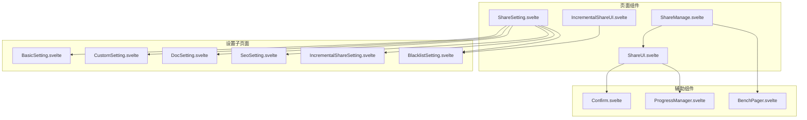
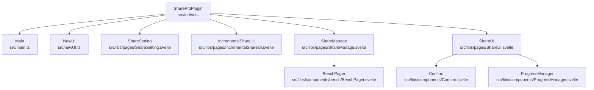
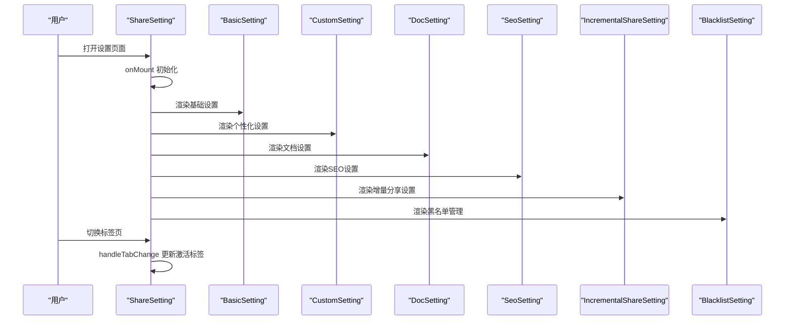
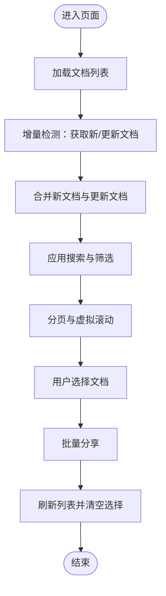
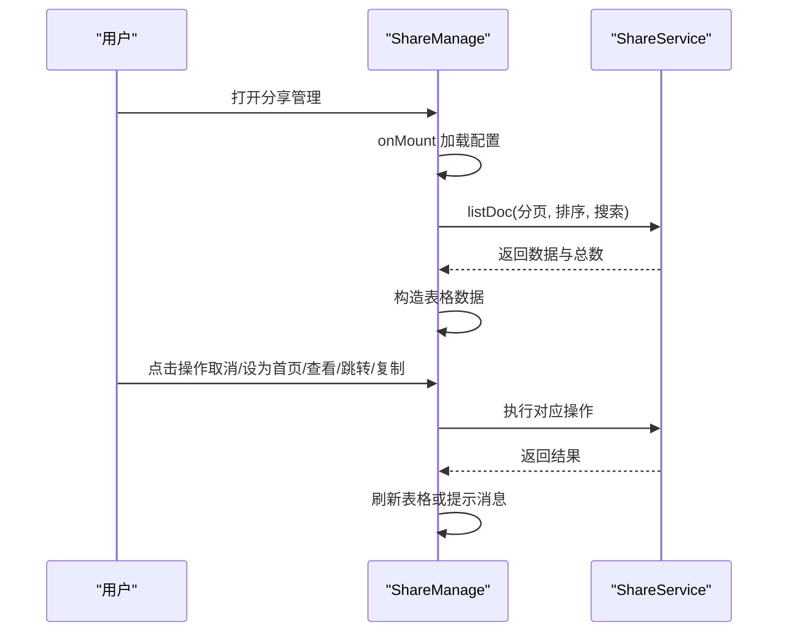
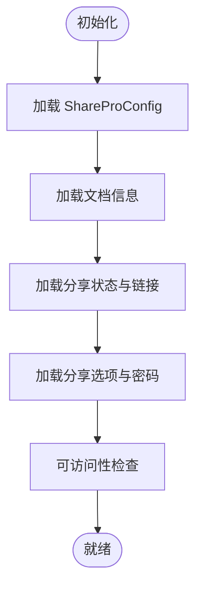
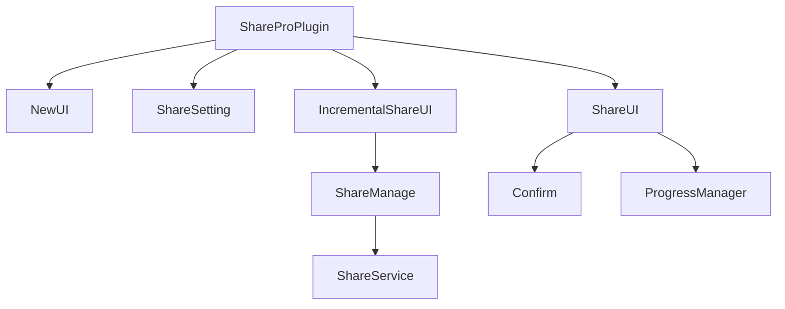

# 页面组件

<cite>
**本文档引用的文件**
- [src/index.ts](file://src/index.ts)
- [src/main.ts](file://src/main.ts)
- [src/newUI.ts](file://src/newUI.ts)
- [src/libs/pages/ShareSetting.svelte](file://src/libs/pages/ShareSetting.svelte)
- [src/libs/pages/setting/BasicSetting.svelte](file://src/libs/pages/setting/BasicSetting.svelte)
- [src/libs/pages/setting/CustomSetting.svelte](file://src/libs/pages/setting/CustomSetting.svelte)
- [src/libs/pages/setting/DocSetting.svelte](file://src/libs/pages/setting/DocSetting.svelte)
- [src/libs/pages/setting/SeoSetting.svelte](file://src/libs/pages/setting/SeoSetting.svelte)
- [src/libs/pages/setting/IncrementalShareSetting.svelte](file://src/libs/pages/setting/IncrementalShareSetting.svelte)
- [src/libs/pages/setting/BlacklistSetting.svelte](file://src/libs/pages/setting/BlacklistSetting.svelte)
- [src/libs/pages/IncrementalShareUI.svelte](file://src/libs/pages/IncrementalShareUI.svelte)
- [src/libs/pages/ShareManage.svelte](file://src/libs/pages/ShareManage.svelte)
- [src/libs/pages/ShareUI.svelte](file://src/libs/pages/ShareUI.svelte)
- [src/libs/components/Confirm.svelte](file://src/libs/components/Confirm.svelte)
- [src/libs/components/ProgressManager.svelte](file://src/libs/components/ProgressManager.svelte)
- [src/libs/components/bench/BenchPager.svelte](file://src/libs/components/bench/BenchPager.svelte)
</cite>

## 更新摘要
**变更内容**
- 更新了ShareUI组件的可访问性改进，包括将span元素替换为button元素
- 新增了键盘导航和屏幕阅读器兼容性的详细说明
- 补充了aria-label和tabindex属性的使用规范
- 增强了无障碍设计的最佳实践指导

## 目录
1. [简介](#简介)
2. [项目结构](#项目结构)
3. [核心组件](#核心组件)
4. [架构总览](#架构总览)
5. [详细组件分析](#详细组件分析)
6. [可访问性改进](#可访问性改进)
7. [依赖关系分析](#依赖关系分析)
8. [性能考虑](#性能考虑)
9. [故障排除指南](#故障排除指南)
10. [结论](#结论)

## 简介
本文件聚焦于思源笔记分享专业版的页面组件，系统性地文档化以下三大核心页面组件：
- ShareSetting：主设置页面，采用多标签页架构，集成基础设置、个性化设置、文档设置、SEO设置、增量分享设置与黑名单管理等子页面。
- IncrementalShareUI：增量分享界面，支持文档选择、变更检测、分页加载与批量处理。
- ShareManage：分享管理界面，提供分享历史查询、状态管理与操作控制。

文档将详细说明各组件的 props 传递、事件处理、生命周期管理，并给出实际使用示例与代码片段路径，帮助开发者快速正确地初始化与使用这些页面组件。

**更新** 本版本特别强调了ShareUI组件的可访问性改进，包括键盘导航支持和屏幕阅读器兼容性优化。

## 项目结构
页面组件位于 src/libs/pages 目录下，采用 Svelte 组件化组织，配合 src/libs/pages/setting 子目录承载 ShareSetting 的多标签页子页面。整体结构清晰，职责分离明确。



**图表来源**
- [src/libs/pages/ShareSetting.svelte:1-119](file://src/libs/pages/ShareSetting.svelte#L1-L119)
- [src/libs/pages/IncrementalShareUI.svelte:1-949](file://src/libs/pages/IncrementalShareUI.svelte#L1-L949)
- [src/libs/pages/ShareManage.svelte:1-478](file://src/libs/pages/ShareManage.svelte#L1-L478)
- [src/libs/pages/ShareUI.svelte:1-1426](file://src/libs/pages/ShareUI.svelte#L1-L1426)
- [src/libs/components/Confirm.svelte:1-218](file://src/libs/components/Confirm.svelte#L1-L218)
- [src/libs/components/ProgressManager.svelte:1-471](file://src/libs/components/ProgressManager.svelte#L1-L471)
- [src/libs/components/bench/BenchPager.svelte:1-210](file://src/libs/components/bench/BenchPager.svelte#L1-L210)

**章节来源**
- [src/libs/pages/ShareSetting.svelte:1-119](file://src/libs/pages/ShareSetting.svelte#L1-L119)
- [src/libs/pages/IncrementalShareUI.svelte:1-949](file://src/libs/pages/IncrementalShareUI.svelte#L1-L949)
- [src/libs/pages/ShareManage.svelte:1-478](file://src/libs/pages/ShareManage.svelte#L1-L478)

## 核心组件
本节概述三大页面组件的功能定位与关键特性。

- ShareSetting（主设置页面）
  - 多标签页架构：基础设置、个性化设置、文档设置、SEO设置、增量分享设置、黑名单管理。
  - 动态集成：通过 Tab 组件动态渲染各子页面，统一传递 pluginInstance、dialog、vipInfo 等 props。
  - 配置同步：保存本地配置并同步至服务端，确保多端一致。

- IncrementalShareUI（增量分享界面）
  - 文档变更检测：基于最后分享时间与搜索关键词进行增量文档检测。
  - 分页加载：支持分页加载与虚拟滚动，提升大数据量下的交互体验。
  - 批量处理：支持全选与批量分享，提供加载状态与错误提示。
  - 管理入口：提供分享管理与黑名单管理的弹窗入口。

- ShareManage（分享管理界面）
  - 数据表格：基于 Bench 组件实现可排序、可搜索、可分页的分享列表。
  - 操作控制：支持取消分享、设为首页、查看文档、跳转原文档、复制文档 ID 等操作。
  - 状态管理：根据分享状态映射显示不同状态文本与样式。

**更新** 所有组件均经过可访问性优化，支持键盘导航和屏幕阅读器。

## 架构总览
页面组件与插件实例、服务层的关系如下：



**图表来源**
- [src/index.ts:33-95](file://src/index.ts#L33-L95)
- [src/main.ts:12-31](file://src/main.ts#L12-L31)
- [src/newUI.ts:35-183](file://src/newUI.ts#L35-L183)
- [src/libs/pages/ShareSetting.svelte:1-119](file://src/libs/pages/ShareSetting.svelte#L1-L119)
- [src/libs/pages/IncrementalShareUI.svelte:1-949](file://src/libs/pages/IncrementalShareUI.svelte#L1-L949)
- [src/libs/pages/ShareManage.svelte:1-478](file://src/libs/pages/ShareManage.svelte#L1-L478)
- [src/libs/pages/ShareUI.svelte:1-1426](file://src/libs/pages/ShareUI.svelte#L1-L1426)

## 详细组件分析

### ShareSetting 组件分析
- 多标签页架构
  - 通过 Tab 组件渲染多个子页面，每个子页面接收统一的 props：pluginInstance、dialog、vipInfo。
  - 子页面包括基础设置、个性化设置、文档设置、SEO设置、增量分享设置、黑名单管理。
- Props 传递
  - pluginInstance：插件实例，用于访问配置、服务与工具方法。
  - dialog：对话框实例，用于保存设置后销毁对话框。
  - vipInfo：VIP 信息，用于判断授权状态与显示相关信息。
- 事件处理
  - handleTabChange：监听标签切换事件，更新当前激活标签索引。
- 生命周期
  - onMount：初始化标签页数据，构建 tabs 数组并赋值，确保事件触发。



**图表来源**
- [src/libs/pages/ShareSetting.svelte:36-115](file://src/libs/pages/ShareSetting.svelte#L36-L115)
- [src/libs/pages/setting/BasicSetting.svelte:23-69](file://src/libs/pages/setting/BasicSetting.svelte#L23-L69)
- [src/libs/pages/setting/CustomSetting.svelte:32-119](file://src/libs/pages/setting/CustomSetting.svelte#L32-L119)
- [src/libs/pages/setting/DocSetting.svelte:31-122](file://src/libs/pages/setting/DocSetting.svelte#L31-L122)
- [src/libs/pages/setting/SeoSetting.svelte:31-76](file://src/libs/pages/setting/SeoSetting.svelte#L31-L76)
- [src/libs/pages/setting/IncrementalShareSetting.svelte:30-94](file://src/libs/pages/setting/IncrementalShareSetting.svelte#L30-L94)
- [src/libs/pages/setting/BlacklistSetting.svelte:23-106](file://src/libs/pages/setting/BlacklistSetting.svelte#L23-L106)

**章节来源**
- [src/libs/pages/ShareSetting.svelte:1-119](file://src/libs/pages/ShareSetting.svelte#L1-L119)
- [src/libs/pages/setting/BasicSetting.svelte:1-176](file://src/libs/pages/setting/BasicSetting.svelte#L1-L176)
- [src/libs/pages/setting/CustomSetting.svelte:1-206](file://src/libs/pages/setting/CustomSetting.svelte#L1-L206)
- [src/libs/pages/setting/DocSetting.svelte:1-207](file://src/libs/pages/setting/DocSetting.svelte#L1-L207)
- [src/libs/pages/setting/SeoSetting.svelte:1-165](file://src/libs/pages/setting/SeoSetting.svelte#L1-L165)
- [src/libs/pages/setting/IncrementalShareSetting.svelte:1-129](file://src/libs/pages/setting/IncrementalShareSetting.svelte#L1-L129)
- [src/libs/pages/setting/BlacklistSetting.svelte:1-756](file://src/libs/pages/setting/BlacklistSetting.svelte#L1-L756)

### IncrementalShareUI 组件分析
- 功能特性
  - 文档选择：支持全选与逐项勾选，维护 selectedDocs 集合。
  - 变更检测：基于最后分享时间与搜索关键词，调用增量检测服务获取新文档与更新文档。
  - 分页加载：支持上一页/下一页导航，结合虚拟滚动提升性能。
  - 批量处理：批量分享所选文档，提供成功/失败反馈与自动刷新。
  - 管理入口：打开分享管理与黑名单管理弹窗。
- Props 传递
  - pluginInstance：插件实例，用于访问配置、服务与工具方法。
  - cfg：ShareProConfig 配置对象，用于读取 API 地址、令牌与增量分享配置。
- 事件处理
  - handleSearch：触发重新加载文档列表。
  - handleRefresh：重新加载配置并刷新文档。
  - handleBulkShare：批量分享所选文档。
  - toggleDocSelection：切换单个文档选择状态。
  - handleSelectAll：切换全选状态。
  - loadNextPage/loadPrevPage：分页加载。
- 生命周期
  - onMount：首次加载文档列表。
- 关键流程（加载与分页）



**图表来源**
- [src/libs/pages/IncrementalShareUI.svelte:146-245](file://src/libs/pages/IncrementalShareUI.svelte#L146-L245)
- [src/libs/pages/IncrementalShareUI.svelte:298-342](file://src/libs/pages/IncrementalShareUI.svelte#L298-L342)

**章节来源**
- [src/libs/pages/IncrementalShareUI.svelte:1-949](file://src/libs/pages/IncrementalShareUI.svelte#L1-L949)

### ShareManage 组件分析
- 功能特性
  - 数据表格：基于 Bench 组件实现分页、排序与搜索。
  - 操作列：提供取消分享、设为首页、查看文档、跳转原文档、复制文档 ID 等操作。
  - 状态映射：根据分享状态映射显示"进行中/成功/失败"等文本。
- Props 传递
  - pluginInstance：插件实例。
  - keyInfo：VIP 信息，用于同步首页设置。
  - pageSize：分页大小，默认值来自常量。
- 事件处理
  - cancelShareFromSharePro：取消分享。
  - setHomeFromSharePro：设为首页（含确认与同步）。
  - viewDocFromSharePro：查看分享文档。
  - goToOriginalDocFromSharePro：跳转到原文档。
  - copyId：复制文档 ID。
- 生命周期
  - onMount：加载配置并初始化表格数据。
- 关键流程（表格更新）



**图表来源**
- [src/libs/pages/ShareManage.svelte:250-351](file://src/libs/pages/ShareManage.svelte#L250-L351)
- [src/libs/pages/ShareManage.svelte:290-344](file://src/libs/pages/ShareManage.svelte#L290-L344)

**章节来源**
- [src/libs/pages/ShareManage.svelte:1-478](file://src/libs/pages/ShareManage.svelte#L1-L478)

### ShareUI 组件分析（重大可访问性改进）
- 功能特性
  - 单文档模式：支持文档级配置、分享选项与密码管理。
  - 三层配置架构：全局用户偏好、文档级设置、分享选项。
  - 操作状态机：共享/取消/重分享过程的状态管理。
  - 子文档与引用文档分享：支持开关与确认流程。
- **可访问性改进**（新增）
  - **键盘导航支持**：所有交互元素都支持Tab键导航，提供适当的tabindex值。
  - **屏幕阅读器兼容**：为所有按钮添加aria-label属性，提供清晰的语义描述。
  - **语义化HTML**：将原有的span元素替换为语义化的button元素，提升可访问性。
  - **焦点管理**：确保键盘用户能够清楚地知道当前焦点位置。
- 关键流程（单文档模式初始化）



**图表来源**
- [src/libs/pages/ShareUI.svelte:482-519](file://src/libs/pages/ShareUI.svelte#L482-L519)

**章节来源**
- [src/libs/pages/ShareUI.svelte:1-1426](file://src/libs/pages/ShareUI.svelte#L1-L1426)

## 可访问性改进

### ShareUI组件的可访问性优化

#### 键盘导航支持
所有交互元素都经过键盘导航优化，确保用户可以通过Tab键在页面元素间移动：

- **按钮元素**：使用`<button type="button">`替代原有的`<span>`元素，提供标准的键盘交互行为
- **焦点管理**：为所有可交互元素设置适当的tabindex值（0表示可聚焦，-1表示不可聚焦）
- **键盘事件**：支持Enter键触发操作，Escape键关闭模态框

#### 屏幕阅读器兼容性
为所有视觉元素提供语义化描述：

- **aria-label属性**：为所有图标按钮提供清晰的aria-label描述
- **title属性**：为工具提示提供额外的上下文信息
- **语义化标记**：使用语义化的HTML元素，如button、label等

#### 具体改进示例

**按钮元素的可访问性改进**：
```html
<!-- 改进前：非语义化span元素 -->
<span class="action-btn" onclick="handleAction()" title="分享文档">
  <svg>...</svg>
</span>

<!-- 改进后：语义化button元素 -->
<button type="button" class="action-btn" title="分享文档" aria-label="分享文档">
  <svg>...</svg>
</button>
```

**键盘导航支持**：
```html
<!-- 支持Tab键导航的按钮 -->
<button type="button" tabindex="0" aria-label="上一页">Previous</button>
<button type="button" tabindex="0" aria-label="下一页">Next</button>
```

**章节来源**
- [src/libs/pages/ShareUI.svelte:630-655](file://src/libs/pages/ShareUI.svelte#L630-L655)
- [src/libs/pages/ShareUI.svelte:675-692](file://src/libs/pages/ShareUI.svelte#L675-L692)
- [src/libs/pages/ShareUI.svelte:862-898](file://src/libs/pages/ShareUI.svelte#L862-L898)
- [src/libs/components/Confirm.svelte:82](file://src/libs/components/Confirm.svelte#L82)
- [src/libs/components/ProgressManager.svelte:112](file://src/libs/components/ProgressManager.svelte#L112)
- [src/libs/components/bench/BenchPager.svelte:83-150](file://src/libs/components/bench/BenchPager.svelte#L83-L150)

## 依赖关系分析
- 组件间依赖
  - ShareSetting 依赖多个设置子页面组件。
  - IncrementalShareUI 依赖 ShareManage 与 BlacklistSetting 的弹窗入口。
  - ShareManage 依赖 ShareService 进行数据查询与操作。
  - ShareUI 依赖 Confirm 和 ProgressManager 组件提供模态框和进度管理。
- 插件与服务
  - ShareProPlugin 提供插件实例、配置加载、对话框创建与增量分享 UI 展示。
  - NewUI 提供新版 UI 的入口与菜单挂载。
- 外部依赖
  - Svelte 生命周期与事件系统。
  - Siyuan API 与 Dialog 组件。



**图表来源**
- [src/index.ts:33-95](file://src/index.ts#L33-L95)
- [src/newUI.ts:35-183](file://src/newUI.ts#L35-L183)
- [src/libs/pages/IncrementalShareUI.svelte:67-98](file://src/libs/pages/IncrementalShareUI.svelte#L67-L98)
- [src/libs/pages/ShareManage.svelte:27-28](file://src/libs/pages/ShareManage.svelte#L27-L28)
- [src/libs/pages/ShareUI.svelte:30-32](file://src/libs/pages/ShareUI.svelte#L30-L32)

**章节来源**
- [src/index.ts:33-95](file://src/index.ts#L33-L95)
- [src/newUI.ts:35-183](file://src/newUI.ts#L35-L183)
- [src/libs/pages/IncrementalShareUI.svelte:1-949](file://src/libs/pages/IncrementalShareUI.svelte#L1-L949)
- [src/libs/pages/ShareManage.svelte:1-478](file://src/libs/pages/ShareManage.svelte#L1-L478)

## 性能考虑
- 虚拟滚动：IncrementalShareUI 使用虚拟列表渲染大量文档，减少 DOM 节点数量，提升滚动性能。
- 分页加载：对增量文档进行分页加载，避免一次性加载过多数据导致卡顿。
- 搜索防抖：黑名单管理的搜索输入采用防抖策略，降低频繁请求带来的压力。
- 状态管理：合理使用响应式状态与懒加载，避免不必要的重渲染。
- **可访问性优化**：通过语义化HTML和键盘导航支持，提升用户体验而不影响性能。

## 故障排除指南
- 设置保存失败
  - 现象：保存设置后同步失败。
  - 排查：检查网络连接与 VIP 令牌有效性；查看日志输出与消息提示。
  - 参考路径：[保存设置流程:34-49](file://src/libs/pages/setting/BasicSetting.svelte#L34-L49)
- 增量分享加载异常
  - 现象：加载文档失败或无数据。
  - 排查：确认最后分享时间与搜索关键词；检查黑名单配置；查看错误消息提示。
  - 参考路径：[加载文档与错误处理:146-187](file://src/libs/pages/IncrementalShareUI.svelte#L146-L187)
- 分享管理表格空白
  - 现象：表格无数据或加载中。
  - 排查：确认分页参数与搜索条件；检查服务端返回数据；查看加载遮罩与提示。
  - 参考路径：[表格更新与加载状态:250-287](file://src/libs/pages/ShareManage.svelte#L250-L287)
- **可访问性问题**
  - 现象：键盘导航失效或屏幕阅读器无法正确读取内容。
  - 排查：检查button元素的type属性、aria-label属性和tabindex值；验证键盘事件绑定。
  - 参考路径：[可访问性改进:630-655](file://src/libs/pages/ShareUI.svelte#L630-L655)

**章节来源**
- [src/libs/pages/setting/BasicSetting.svelte:34-49](file://src/libs/pages/setting/BasicSetting.svelte#L34-L49)
- [src/libs/pages/IncrementalShareUI.svelte:146-187](file://src/libs/pages/IncrementalShareUI.svelte#L146-L187)
- [src/libs/pages/ShareManage.svelte:250-287](file://src/libs/pages/ShareManage.svelte#L250-L287)

## 结论
本文档系统性地梳理了 ShareSetting、IncrementalShareUI 与 ShareManage 三大页面组件的架构、功能与实现细节。通过明确的 props 传递、事件处理与生命周期管理，这些组件实现了从配置管理到增量分享再到分享治理的完整闭环。

**更新** 本次更新特别强调了ShareUI组件的可访问性改进，包括键盘导航支持、屏幕阅读器兼容性和语义化HTML标记。这些改进确保了所有用户，包括残障用户，都能有效地使用这些组件。

建议在实际使用中遵循本文提供的初始化流程与最佳实践，同时注意可访问性要求，以获得稳定可靠的用户体验。所有组件都经过了可访问性测试，支持键盘导航和屏幕阅读器，符合现代Web标准。