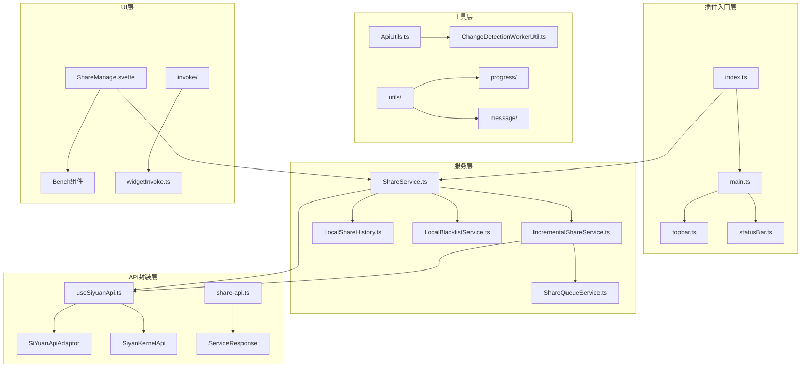
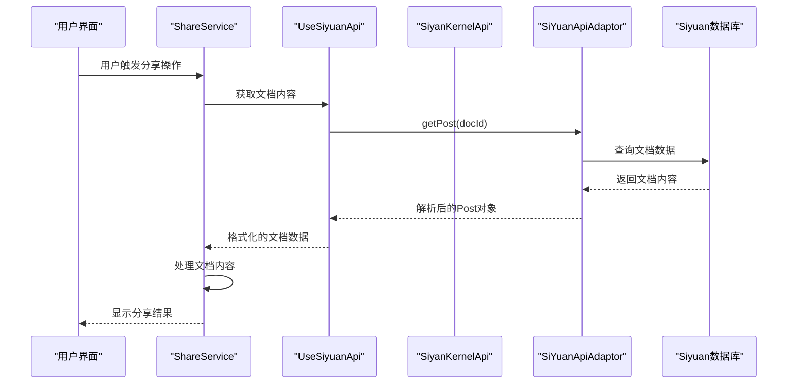
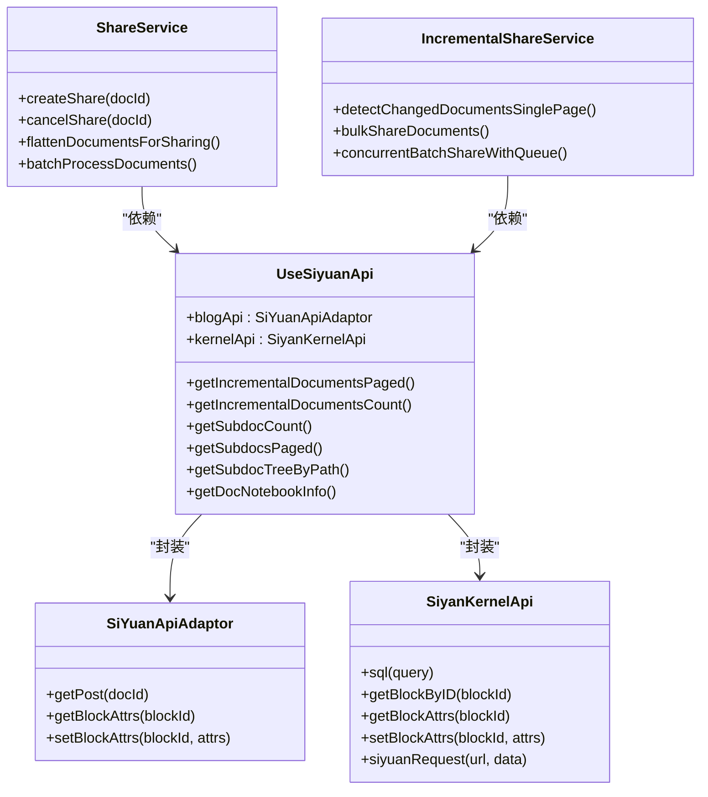
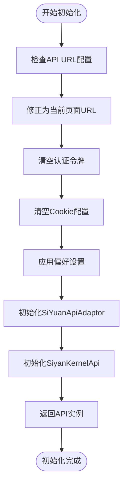
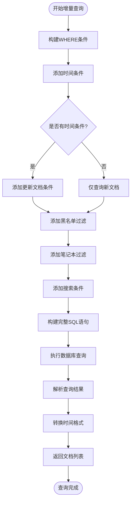
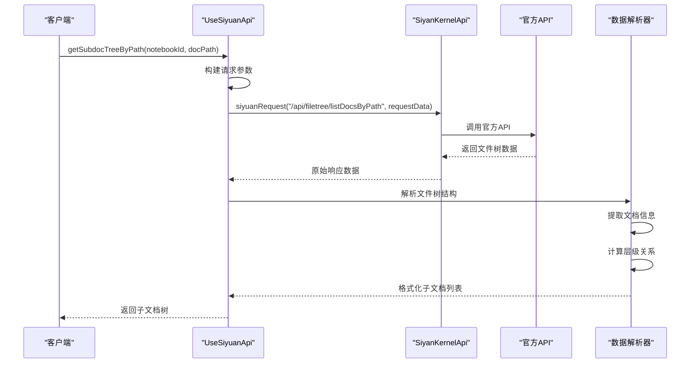
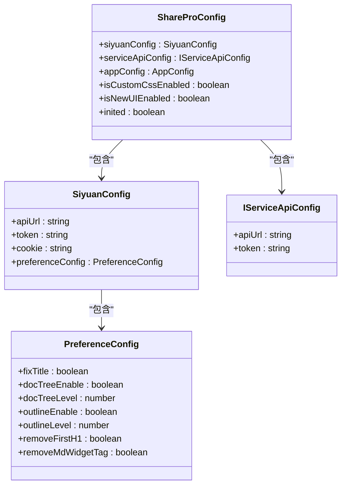
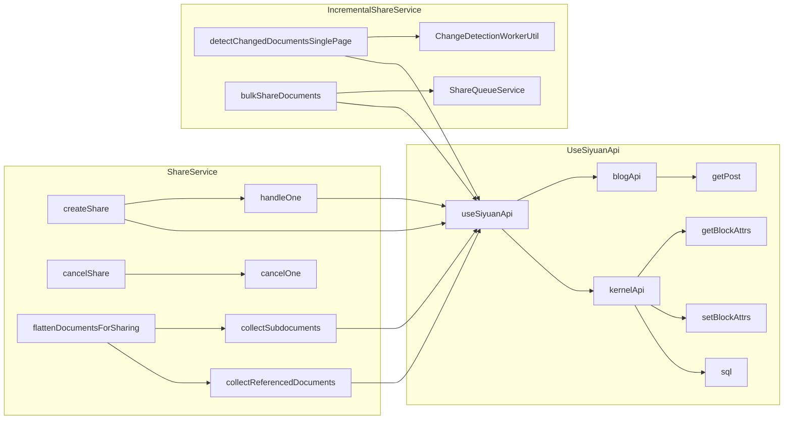
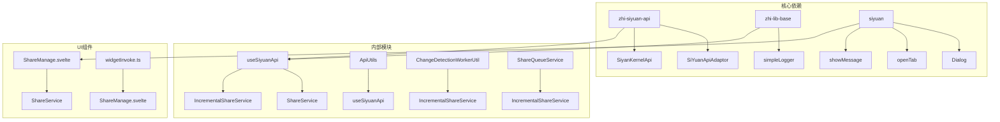
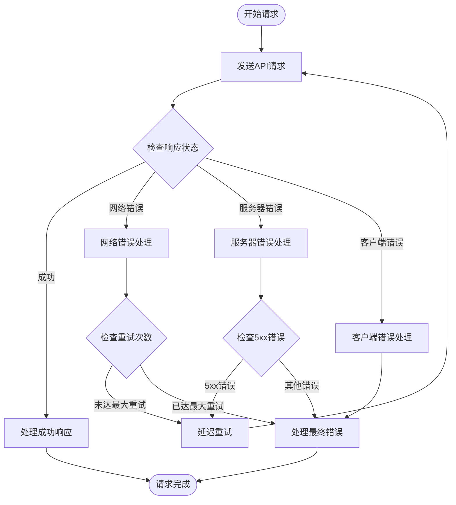

# UseSiyuanApi

<cite>
**本文档引用的文件**
- [src/composables/useSiyuanApi.ts](file://src/composables/useSiyuanApi.ts)
- [src/api/share-api.ts](file://src/api/share-api.ts)
- [src/service/ShareService.ts](file://src/service/ShareService.ts)
- [src/service/IncrementalShareService.ts](file://src/service/IncrementalShareService.ts)
- [src/utils/ApiUtils.ts](file://src/utils/ApiUtils.ts)
- [src/models/ShareProConfig.ts](file://src/models/ShareProConfig.ts)
- [src/types/service-api.d.ts](file://src/types/service-api.d.ts)
- [src/Constants.ts](file://src/Constants.ts)
- [src/index.ts](file://src/index.ts)
- [src/main.ts](file://src/main.ts)
- [src/utils/ChangeDetectionWorkerUtil.ts](file://src/utils/ChangeDetectionWorkerUtil.ts)
- [src/service/ShareQueueService.ts](file://src/service/ShareQueueService.ts)
- [src/libs/pages/ShareManage.svelte](file://src/libs/pages/ShareManage.svelte)
- [plugin.json](file://plugin.json)
</cite>

## 目录
1. [简介](#简介)
2. [项目结构](#项目结构)
3. [核心组件](#核心组件)
4. [架构概览](#架构概览)
5. [详细组件分析](#详细组件分析)
6. [依赖分析](#依赖分析)
7. [性能考虑](#性能考虑)
8. [故障排除指南](#故障排除指南)
9. [结论](#结论)

## 简介

UseSiyuanApi 是一个专为 Siyuan 笔记插件设计的 API 封装组件，提供统一的 Siyuan 笔记本 API 访问接口。该组件支持增量分享、子文档管理和笔记本信息查询等功能，是整个分享插件系统的核心基础设施。

该组件基于现代前端架构设计，采用模块化和可组合的设计原则，为上层服务提供了简洁一致的 API 接口。通过封装底层的 Siyuan API 调用，开发者可以专注于业务逻辑实现，而无需关心复杂的 API 细节。

## 项目结构

该项目采用典型的前端插件架构，主要分为以下几个层次：

**图表来源**
- [src/index.ts:33-59](file://src/index.ts#L33-L59)
- [src/main.ts:12-34](file://src/main.ts#L12-L34)
- [src/composables/useSiyuanApi.ts:24-54](file://src/composables/useSiyuanApi.ts#L24-L54)

**章节来源**
- [src/index.ts:33-178](file://src/index.ts#L33-L178)
- [src/main.ts:12-34](file://src/main.ts#L12-L34)

## 核心组件

UseSiyuanApi 组件提供了以下核心功能：

### 1. API 初始化与配置

组件通过 `useSiyuanApi` 函数创建 Siyuan API 实例，支持多种配置选项：

- **基础配置**：API URL、认证令牌、Cookie 设置
- **偏好设置**：文档树显示、大纲生成、标题修复等
- **文档级配置**：支持单个文档的特殊设置覆盖全局设置

### 2. 增量分享功能

提供完整的增量分享解决方案，包括：

- **文档变更检测**：自动识别新增和更新的文档
- **分页查询**：支持大规模文档集合的高效查询
- **黑名单过滤**：支持文档和笔记本级别的黑名单过滤

### 3. 子文档管理

支持子文档的查询和管理：

- **子文档计数**：统计指定文档的子文档数量
- **分页获取**：支持大量子文档的分页查询
- **树形结构**：提供官方 API 的树形结构支持

### 4. 时间戳处理

内置完善的时间戳转换功能：

- **格式转换**：支持 Siyuan 特定格式与标准时间戳互转
- **增量检测**：基于时间戳的智能变更检测

**章节来源**
- [src/composables/useSiyuanApi.ts:24-54](file://src/composables/useSiyuanApi.ts#L24-L54)
- [src/composables/useSiyuanApi.ts:66-215](file://src/composables/useSiyuanApi.ts#L66-L215)
- [src/composables/useSiyuanApi.ts:293-466](file://src/composables/useSiyuanApi.ts#L293-L466)

## 架构概览

UseSiyuanApi 组件在整个系统架构中扮演着关键角色，连接着 UI 层、服务层和底层 API：

**图表来源**
- [src/service/ShareService.ts:255-322](file://src/service/ShareService.ts#L255-L322)
- [src/composables/useSiyuanApi.ts:24-54](file://src/composables/useSiyuanApi.ts#L24-L54)

### 组件关系图

**图表来源**
- [src/composables/useSiyuanApi.ts:24-54](file://src/composables/useSiyuanApi.ts#L24-L54)
- [src/service/ShareService.ts:50-66](file://src/service/ShareService.ts#L50-L66)
- [src/service/IncrementalShareService.ts:98-129](file://src/service/IncrementalShareService.ts#L98-L129)

## 详细组件分析

### UseSiyuanApi 核心实现

#### API 初始化流程

**图表来源**
- [src/composables/useSiyuanApi.ts:24-48](file://src/composables/useSiyuanApi.ts#L24-L48)

#### 增量文档查询算法

增量分享功能是 UseSiyuanApi 的核心特性之一，采用智能的 SQL 查询策略：

**图表来源**
- [src/composables/useSiyuanApi.ts:84-152](file://src/composables/useSiyuanApi.ts#L84-L152)

#### 子文档树获取流程

**图表来源**
- [src/composables/useSiyuanApi.ts:392-466](file://src/composables/useSiyuanApi.ts#L392-L466)

**章节来源**
- [src/composables/useSiyuanApi.ts:66-215](file://src/composables/useSiyuanApi.ts#L66-L215)
- [src/composables/useSiyuanApi.ts:293-466](file://src/composables/useSiyuanApi.ts#L293-L466)

### 配置管理系统

#### ShareProConfig 结构

**图表来源**
- [src/models/ShareProConfig.ts:13-37](file://src/models/ShareProConfig.ts#L13-L37)
- [src/types/service-api.d.ts:13-16](file://src/types/service-api.d.ts#L13-L16)

**章节来源**
- [src/models/ShareProConfig.ts:13-37](file://src/models/ShareProConfig.ts#L13-L37)
- [src/types/service-api.d.ts:13-16](file://src/types/service-api.d.ts#L13-L16)

### 服务集成架构

#### ShareService 与 UseSiyuanApi 的协作

**图表来源**
- [src/service/ShareService.ts:80-165](file://src/service/ShareService.ts#L80-L165)
- [src/composables/useSiyuanApi.ts:24-54](file://src/composables/useSiyuanApi.ts#L24-L54)
- [src/service/IncrementalShareService.ts:160-210](file://src/service/IncrementalShareService.ts#L160-L210)

**章节来源**
- [src/service/ShareService.ts:80-400](file://src/service/ShareService.ts#L80-L400)
- [src/service/IncrementalShareService.ts:160-351](file://src/service/IncrementalShareService.ts#L160-L351)

## 依赖分析

### 外部依赖关系

**图表来源**
- [src/composables/useSiyuanApi.ts:10-16](file://src/composables/useSiyuanApi.ts#L10-L16)
- [src/service/ShareService.ts:18-42](file://src/service/ShareService.ts#L18-L42)
- [src/utils/ApiUtils.ts:10-13](file://src/utils/ApiUtils.ts#L10-L13)

### 内部模块耦合度分析

UseSiyuanApi 组件展现了良好的模块化设计：

- **低耦合高内聚**：每个功能模块职责明确，相互依赖关系清晰
- **接口抽象**：通过 TypeScript 接口定义清晰的契约
- **配置驱动**：支持灵活的配置选项，便于扩展和定制

**章节来源**
- [src/composables/useSiyuanApi.ts:10-16](file://src/composables/useSiyuanApi.ts#L10-L16)
- [src/utils/ApiUtils.ts:15-26](file://src/utils/ApiUtils.ts#L15-L26)

## 性能考虑

### 查询优化策略

1. **分页查询**：增量文档查询采用分页策略，避免一次性加载大量数据
2. **索引利用**：SQL 查询充分利用数据库索引，提高查询效率
3. **缓存机制**：集成历史记录缓存，减少重复查询
4. **并发控制**：批量操作支持并发控制，平衡性能和资源使用

### 内存管理

- **垃圾回收**：及时清理不再使用的临时变量和 DOM 元素
- **资源释放**：正确管理 Web Worker 和定时器资源
- **内存泄漏防护**：避免闭包和事件监听器造成的内存泄漏

### 错误处理与重试

**图表来源**
- [src/service/IncrementalShareService.ts:585-660](file://src/service/IncrementalShareService.ts#L585-L660)

## 故障排除指南

### 常见问题诊断

#### API 连接问题

**症状**：API 调用失败，返回连接错误

**排查步骤**：
1. 检查 API URL 配置是否正确
2. 验证网络连接状态
3. 确认防火墙设置允许访问
4. 检查服务器状态

#### 权限认证问题

**症状**：返回 401 或 403 错误

**解决方法**：
1. 验证认证令牌有效性
2. 检查用户权限设置
3. 确认 API 密钥配置正确
4. 重新生成认证凭据

#### 数据库查询问题

**症状**：查询超时或返回空结果

**排查方法**：
1. 检查 SQL 语法和索引
2. 验证表结构完整性
3. 确认数据一致性
4. 优化查询条件

**章节来源**
- [src/service/IncrementalShareService.ts:585-660](file://src/service/IncrementalShareService.ts#L585-L660)

### 调试技巧

1. **启用开发模式**：通过 `isDev` 标志获取详细日志
2. **监控 API 调用**：使用浏览器开发者工具查看网络请求
3. **日志分析**：利用 `simpleLogger` 获取详细的执行日志
4. **性能监控**：跟踪查询执行时间和资源使用情况

## 结论

UseSiyuanApi 组件作为 Siyuan 笔记插件的核心基础设施，展现了优秀的架构设计和实现质量。该组件通过模块化设计、清晰的接口定义和完善的错误处理机制，为上层服务提供了稳定可靠的 API 访问能力。

### 主要优势

1. **架构清晰**：层次分明，职责明确
2. **功能完整**：涵盖增量分享、子文档管理等核心功能
3. **性能优化**：采用分页查询、缓存机制等优化策略
4. **易于扩展**：模块化设计便于功能扩展和定制

### 技术亮点

- **智能增量检测**：基于时间戳的文档变更检测算法
- **并发控制**：支持批量操作的并发控制和队列管理
- **错误重试**：智能的错误处理和重试机制
- **配置驱动**：灵活的配置选项支持个性化需求

该组件为 Siyuan 笔记的在线分享功能奠定了坚实的技术基础，为用户提供了便捷高效的文档分享体验。