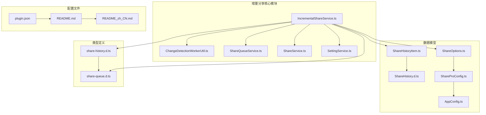
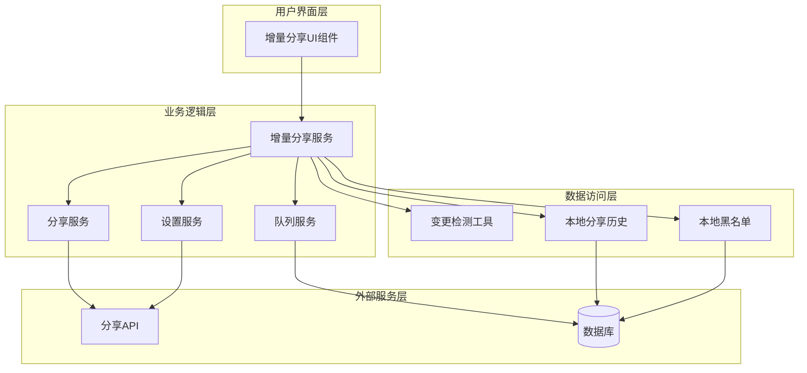
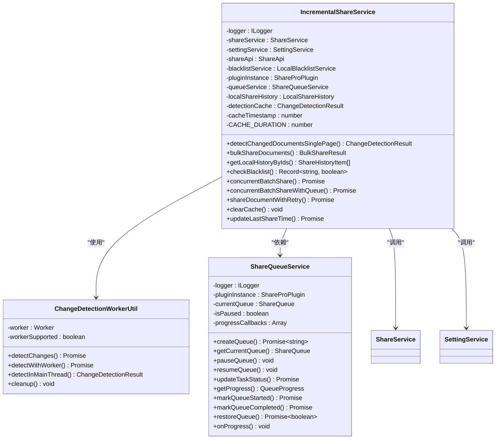
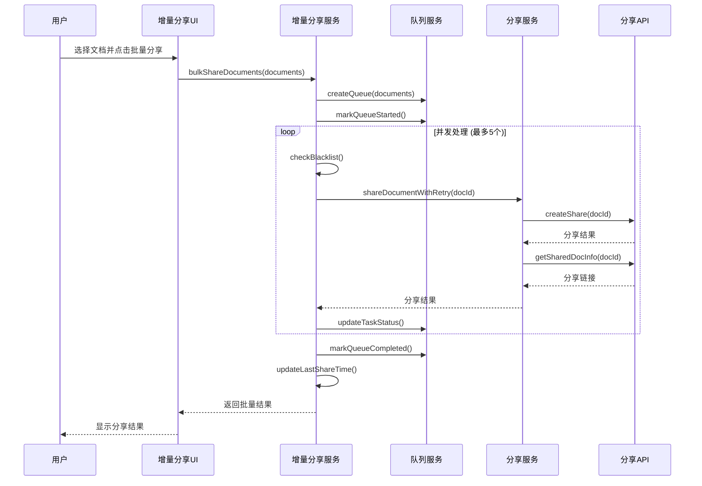
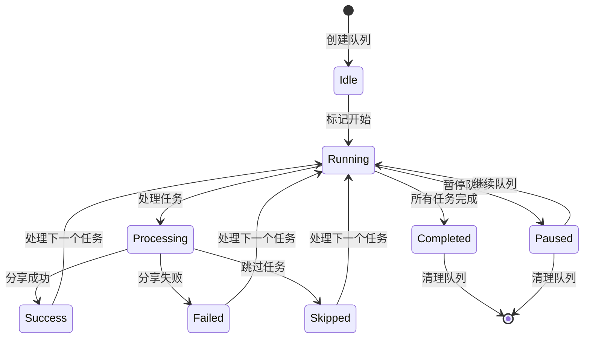
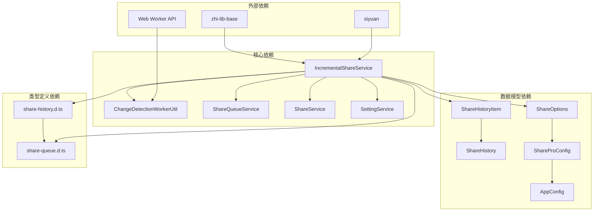

# 增量分享规范

<cite>
**本文档引用的文件**
- [IncrementalShareService.ts](file://src/service/IncrementalShareService.ts)
- [ChangeDetectionWorkerUtil.ts](file://src/utils/ChangeDetectionWorkerUtil.ts)
- [ShareQueueService.ts](file://src/service/ShareQueueService.ts)
- [ShareOptions.ts](file://src/models/ShareOptions.ts)
- [ShareProConfig.ts](file://src/models/ShareProConfig.ts)
- [AppConfig.ts](file://src/models/AppConfig.ts)
- [ShareHistoryItem 类型定义](file://src/types/share-history.d.ts)
- [队列类型定义](file://src/types/share-queue.d.ts)
- [ShareService.ts](file://src/service/ShareService.ts)
- [SettingService.ts](file://src/service/SettingService.ts)
- [增量分享上下文文档](file://docs/incremental-share-context-2025-12-04.md)
- [插件配置文件](file://plugin.json)
</cite>

## 目录
1. [简介](#简介)
2. [项目结构](#项目结构)
3. [核心组件](#核心组件)
4. [架构概览](#架构概览)
5. [详细组件分析](#详细组件分析)
6. [依赖关系分析](#依赖关系分析)
7. [性能考虑](#性能考虑)
8. [故障排除指南](#故障排除指南)
9. [结论](#结论)

## 简介

增量分享规范是思源笔记分享Pro插件中的一个核心功能模块，旨在提供高效的文档增量分享能力。该规范允许用户仅分享自上次分享以来发生变更的文档，从而避免重复分享已存在的文档，提高分享效率并减少服务器负载。

该功能采用现代化的架构设计，结合了Web Worker技术、队列管理系统、智能重试机制等先进特性，确保在大规模文档分享场景下的稳定性和性能表现。

## 项目结构

基于增量分享功能的核心文件组织如下：

**图表来源**
- [IncrementalShareService.ts:1-691](file://src/service/IncrementalShareService.ts#L1-L691)
- [ChangeDetectionWorkerUtil.ts:1-148](file://src/utils/ChangeDetectionWorkerUtil.ts#L1-L148)
- [ShareQueueService.ts:1-299](file://src/service/ShareQueueService.ts#L1-L299)

**章节来源**
- [plugin.json:1-35](file://plugin.json#L1-L35)
- [README_zh_CN.md:1-17](file://README_zh_CN.md#L1-L17)

## 核心组件

### 增量分享服务 (IncrementalShareService)

增量分享服务是整个功能的核心协调器，负责文档变更检测、批量分享管理和状态跟踪。该服务实现了以下关键功能：

- **变更检测**：实时检测文档的新增、更新和未变更状态
- **批量分享**：支持并发控制的批量文档分享
- **队列管理**：完整的任务队列生命周期管理
- **智能重试**：针对不同错误类型的智能重试策略

### 变更检测工具 (ChangeDetectionWorkerUtil)

该工具提供了高性能的文档变更检测能力，支持Web Worker和主线程两种执行模式：

- **Web Worker支持**：在支持的环境中使用独立线程进行计算
- **回退机制**：当Web Worker不可用时自动切换到主线程
- **内存优化**：使用Map数据结构优化查找性能

### 队列服务 (ShareQueueService)

队列服务提供了完整的任务队列管理功能：

- **任务状态跟踪**：支持pending、processing、success、failed、skipped五种状态
- **进度监控**：实时计算和报告任务执行进度
- **持久化存储**：支持队列状态的持久化和恢复
- **暂停/恢复**：提供队列的暂停和继续功能

**章节来源**
- [IncrementalShareService.ts:98-691](file://src/service/IncrementalShareService.ts#L98-L691)
- [ChangeDetectionWorkerUtil.ts:17-148](file://src/utils/ChangeDetectionWorkerUtil.ts#L17-L148)
- [ShareQueueService.ts:24-299](file://src/service/ShareQueueService.ts#L24-L299)

## 架构概览

增量分享功能采用分层架构设计，各组件职责明确，耦合度低：

**图表来源**
- [IncrementalShareService.ts:113-129](file://src/service/IncrementalShareService.ts#L113-L129)
- [ShareQueueService.ts:258-266](file://src/service/ShareQueueService.ts#L258-L266)

## 详细组件分析

### 增量分享服务类图

**图表来源**
- [IncrementalShareService.ts:98-129](file://src/service/IncrementalShareService.ts#L98-L129)
- [ChangeDetectionWorkerUtil.ts:17-59](file://src/utils/ChangeDetectionWorkerUtil.ts#L17-L59)
- [ShareQueueService.ts:24-33](file://src/service/ShareQueueService.ts#L24-L33)

### 批量分享流程序列图

**图表来源**
- [IncrementalShareService.ts:270-351](file://src/service/IncrementalShareService.ts#L270-L351)
- [ShareQueueService.ts:38-60](file://src/service/ShareQueueService.ts#L38-L60)
- [ShareService.ts:600-799](file://src/service/ShareService.ts#L600-L799)

### 变更检测算法流程图

**图表来源**
- [IncrementalShareService.ts:160-210](file://src/service/IncrementalShareService.ts#L160-L210)
- [ChangeDetectionWorkerUtil.ts:36-59](file://src/utils/ChangeDetectionWorkerUtil.ts#L36-L59)

**章节来源**
- [IncrementalShareService.ts:160-210](file://src/service/IncrementalShareService.ts#L160-L210)
- [ChangeDetectionWorkerUtil.ts:87-136](file://src/utils/ChangeDetectionWorkerUtil.ts#L87-L136)

### 队列管理系统

队列服务提供了完整的任务队列生命周期管理，包括任务创建、状态跟踪、进度监控等功能：

**图表来源**
- [ShareQueueService.ts:104-125](file://src/service/ShareQueueService.ts#L104-L125)
- [ShareQueueService.ts:200-217](file://src/service/ShareQueueService.ts#L200-L217)

**章节来源**
- [ShareQueueService.ts:102-170](file://src/service/ShareQueueService.ts#L102-L170)
- [ShareQueueService.ts:232-253](file://src/service/ShareQueueService.ts#L232-L253)

## 依赖关系分析

增量分享功能的依赖关系呈现清晰的层次结构：

**图表来源**
- [IncrementalShareService.ts:10-24](file://src/service/IncrementalShareService.ts#L10-L24)
- [ChangeDetectionWorkerUtil.ts:10-11](file://src/utils/ChangeDetectionWorkerUtil.ts#L10-L11)

### 组件耦合度分析

- **高内聚**：每个组件都专注于特定的功能领域
- **低耦合**：通过接口和事件机制实现松散耦合
- **依赖方向**：自上而下的依赖关系，便于测试和维护

**章节来源**
- [IncrementalShareService.ts:10-24](file://src/service/IncrementalShareService.ts#L10-L24)
- [ShareQueueService.ts:10-14](file://src/service/ShareQueueService.ts#L10-L14)

## 性能考虑

### 并发控制策略

增量分享服务采用了智能的并发控制机制：

- **最大并发数**：限制同时执行的分享任务数量为5个
- **动态调整**：根据系统负载动态调整并发度
- **资源保护**：避免过度消耗系统资源

### 缓存优化

- **共享缓存**：使用全局缓存减少重复的数据加载
- **缓存失效**：5分钟的缓存有效期确保数据新鲜度
- **内存管理**：及时清理不再使用的缓存数据

### 错误处理机制

- **智能重试**：针对不同类型的错误采用不同的重试策略
- **指数退避**：网络错误采用指数退避算法
- **固定延迟**：服务器5xx错误采用固定30秒延迟重试

**章节来源**
- [IncrementalShareService.ts:317-351](file://src/service/IncrementalShareService.ts#L317-L351)
- [IncrementalShareService.ts:585-660](file://src/service/IncrementalShareService.ts#L585-L660)

## 故障排除指南

### 常见问题及解决方案

#### 1. 变更检测结果异常

**问题症状**：变更检测返回空结果或错误结果

**可能原因**：
- 增量分享配置未正确初始化
- 分享历史数据损坏
- 网络连接问题

**解决步骤**：
1. 检查配置文件中的增量分享设置
2. 清除缓存并重新加载历史数据
3. 验证网络连接状态

#### 2. 批量分享失败

**问题症状**：部分或全部文档分享失败

**可能原因**：
- 服务器响应超时
- 黑名单拦截
- 权限不足

**解决步骤**：
1. 检查服务器状态和响应时间
2. 验证文档是否在黑名单中
3. 确认用户权限设置

#### 3. 队列管理问题

**问题症状**：队列无法正常启动或停止

**可能原因**：
- 队列状态不一致
- 持久化存储故障
- 并发访问冲突

**解决步骤**：
1. 检查队列状态一致性
2. 重新启动队列服务
3. 清理队列数据

**章节来源**
- [IncrementalShareService.ts:206-210](file://src/service/IncrementalShareService.ts#L206-L210)
- [ShareQueueService.ts:232-253](file://src/service/ShareQueueService.ts#L232-L253)

## 结论

增量分享规范通过精心设计的架构和先进的技术手段，为思源笔记用户提供了高效、可靠的文档增量分享解决方案。该规范的主要优势包括：

### 技术优势
- **高性能架构**：采用Web Worker和并发控制技术
- **智能缓存**：优化数据访问性能
- **容错机制**：完善的错误处理和重试策略

### 功能特性
- **精确变更检测**：准确识别新增、更新和未变更文档
- **灵活队列管理**：支持暂停、恢复和持久化
- **统一配置管理**：集中化的设置和状态管理

### 扩展性
- **模块化设计**：各组件职责明确，易于扩展
- **标准化接口**：清晰的接口定义便于集成
- **国际化支持**：完整的多语言支持

该增量分享规范为思源笔记的专业用户提供了强大的文档管理工具，显著提升了文档分享的工作效率和用户体验。通过持续的技术优化和功能扩展，该规范将继续为用户提供更加完善的服务。