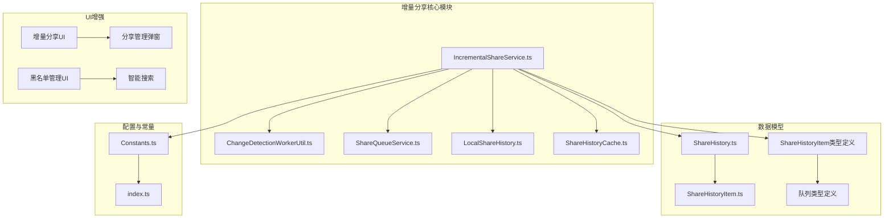
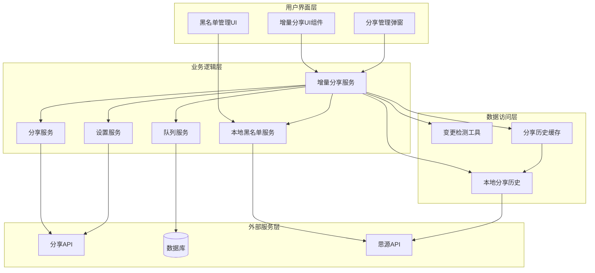
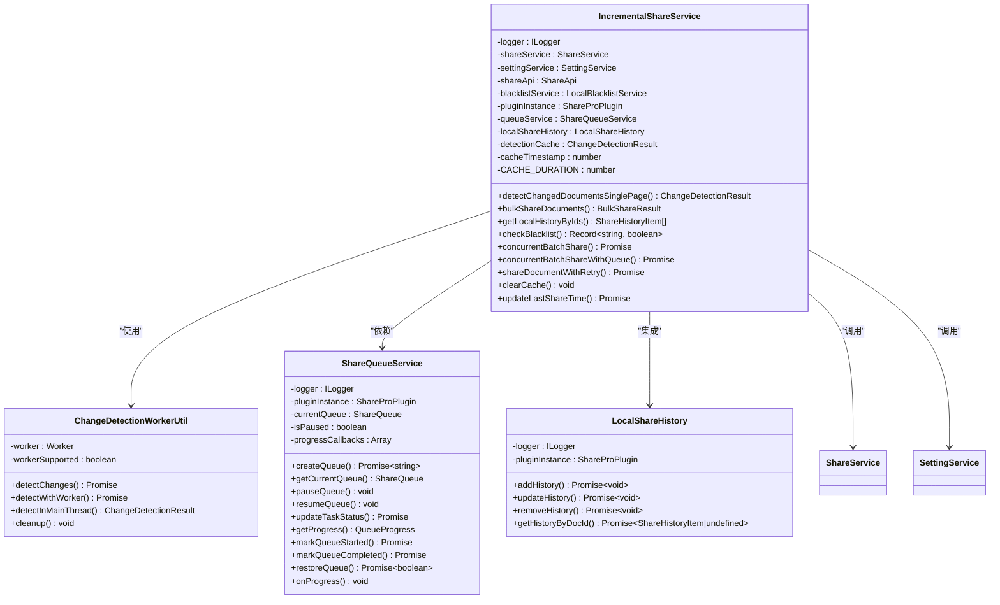
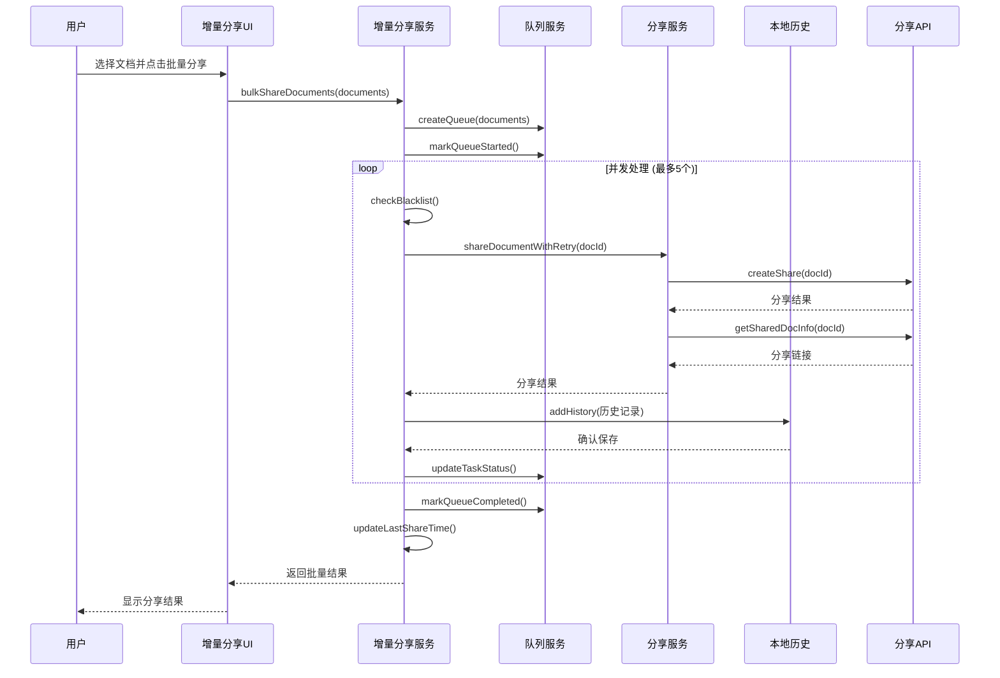
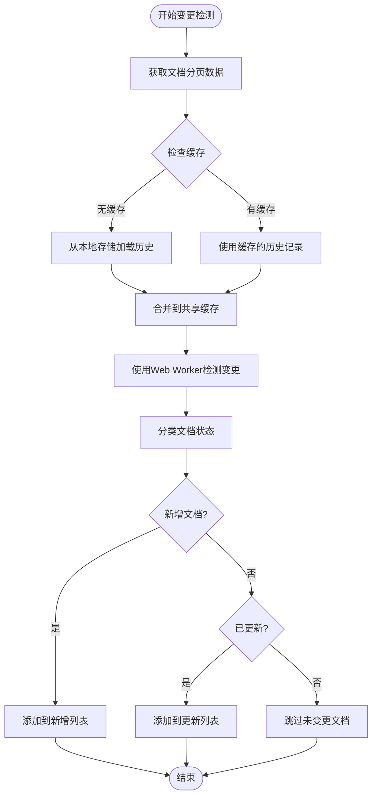
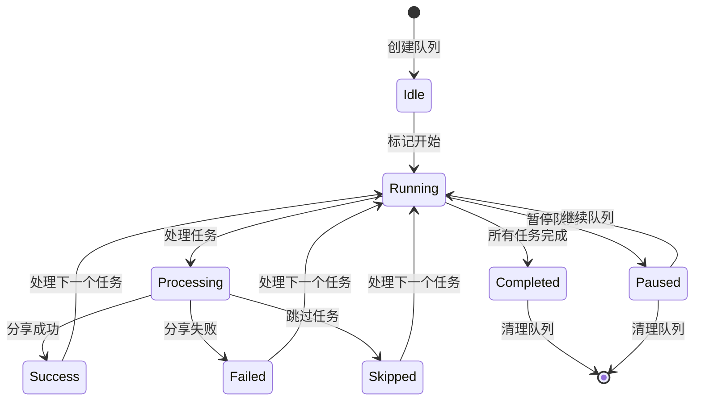
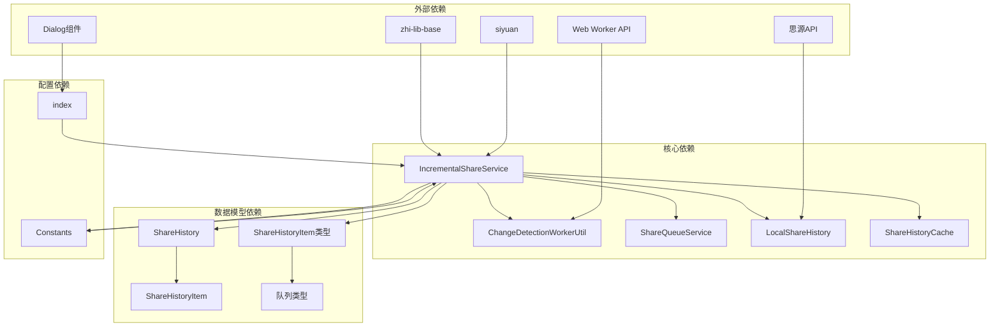

# 增量分享规范

<cite>
**本文档引用的文件**
- [IncrementalShareService.ts](file://src/service/IncrementalShareService.ts)
- [ChangeDetectionWorkerUtil.ts](file://src/utils/ChangeDetectionWorkerUtil.ts)
- [ShareQueueService.ts](file://src/service/ShareQueueService.ts)
- [LocalShareHistory.ts](file://src/service/LocalShareHistory.ts)
- [ShareHistoryCache.ts](file://src/utils/ShareHistoryCache.ts)
- [ShareHistory.ts](file://src/models/ShareHistory.ts)
- [ShareHistoryItem 类型定义](file://src/types/share-history.d.ts)
- [队列类型定义](file://src/types/share-queue.d.ts)
- [Constants.ts](file://src/Constants.ts)
- [index.ts](file://src/index.ts)
- [增量分享上下文文档](file://docs/incremental-share-context-2025-12-04.md)
- [增量分享上下文文档(2025-12-08)](file://docs/incremental-share-context-2025-12-08.md)
- [增量分享上下文文档(2025-12-09)](file://docs/incremental-share-context-2025-12-09.md)
- [插件配置文件](file://plugin.json)
</cite>

## 更新摘要
**所做更改**
- 更新了本地存储迁移架构，从后端黑名单系统迁移到本地存储
- 增强了增量检测机制，移除了未变更文档的检测
- 改进了UI界面交互，采用弹窗方式替代Tab页签
- 优化了缓存机制，增加了版本兼容性检查
- 完善了错误处理和智能重试策略

## 目录
1. [简介](#简介)
2. [项目结构](#项目结构)
3. [核心组件](#核心组件)
4. [架构概览](#架构概览)
5. [详细组件分析](#详细组件分析)
6. [依赖关系分析](#依赖关系分析)
7. [性能考虑](#性能考虑)
8. [故障排除指南](#故障排除指南)
9. [结论](#结论)

## 简介

增量分享规范是思源笔记分享Pro插件中的一个核心功能模块，旨在提供高效的文档增量分享能力。该规范允许用户仅分享自上次分享以来发生变更的文档，从而避免重复分享已存在的文档，提高分享效率并减少服务器负载。

经过最新的架构改进，该功能现已采用现代化的架构设计，结合了本地存储迁移、Web Worker技术、队列管理系统、智能重试机制等先进特性，确保在大规模文档分享场景下的稳定性和性能表现。

## 项目结构

基于增量分享功能的核心文件组织如下：

**图表来源**
- [IncrementalShareService.ts:1-691](file://src/service/IncrementalShareService.ts#L1-L691)
- [LocalShareHistory.ts:1-129](file://src/service/LocalShareHistory.ts#L1-L129)
- [ShareHistoryCache.ts:1-91](file://src/utils/ShareHistoryCache.ts#L1-L91)

**章节来源**
- [plugin.json:1-35](file://plugin.json#L1-L35)
- [README_zh_CN.md:1-17](file://README_zh_CN.md#L1-L17)

## 核心组件

### 增量分享服务 (IncrementalShareService)

增量分享服务是整个功能的核心协调器，负责文档变更检测、批量分享管理和状态跟踪。该服务实现了以下关键功能：

- **精确变更检测**：实时检测文档的新增和更新状态，移除了未变更文档的检测
- **批量分享**：支持并发控制的批量文档分享
- **队列管理**：完整的任务队列生命周期管理
- **智能重试**：针对不同错误类型的智能重试策略
- **本地存储集成**：与LocalShareHistory服务无缝集成

### 变更检测工具 (ChangeDetectionWorkerUtil)

该工具提供了高性能的文档变更检测能力，支持Web Worker和主线程两种执行模式：

- **Web Worker支持**：在支持的环境中使用独立线程进行计算
- **回退机制**：当Web Worker不可用时自动切换到主线程
- **内存优化**：使用Map数据结构优化查找性能
- **简化检测**：专注于新增和更新文档的检测

### 队列服务 (ShareQueueService)

队列服务提供了完整的任务队列管理功能：

- **任务状态跟踪**：支持pending、processing、success、failed、skipped五种状态
- **进度监控**：实时计算和报告任务执行进度，包括预估剩余时间
- **持久化存储**：支持队列状态的持久化和恢复
- **暂停/恢复**：提供队列的暂停和继续功能

### 本地分享历史 (LocalShareHistory)

本地分享历史服务实现了文档属性存储机制：

- **文档属性存储**：将分享历史存储在文档属性中，实现真正的本地持久化
- **版本兼容性**：支持版本检查和数据迁移
- **缓存集成**：与ShareHistoryCache配合使用，提升查询性能
- **原子操作**：确保分享状态更新的原子性和一致性

**章节来源**
- [IncrementalShareService.ts:98-691](file://src/service/IncrementalShareService.ts#L98-L691)
- [ChangeDetectionWorkerUtil.ts:17-148](file://src/utils/ChangeDetectionWorkerUtil.ts#L17-L148)
- [ShareQueueService.ts:24-299](file://src/service/ShareQueueService.ts#L24-L299)
- [LocalShareHistory.ts:23-129](file://src/service/LocalShareHistory.ts#L23-L129)

## 架构概览

增量分享功能采用分层架构设计，各组件职责明确，耦合度低：

**图表来源**
- [IncrementalShareService.ts:113-129](file://src/service/IncrementalShareService.ts#L113-L129)
- [ShareQueueService.ts:258-266](file://src/service/ShareQueueService.ts#L258-L266)
- [LocalShareHistory.ts:31-52](file://src/service/LocalShareHistory.ts#L31-L52)

## 详细组件分析

### 增量分享服务类图

**图表来源**
- [IncrementalShareService.ts:98-129](file://src/service/IncrementalShareService.ts#L98-L129)
- [ChangeDetectionWorkerUtil.ts:17-59](file://src/utils/ChangeDetectionWorkerUtil.ts#L17-L59)
- [ShareQueueService.ts:24-33](file://src/service/ShareQueueService.ts#L24-L33)
- [LocalShareHistory.ts:23-29](file://src/service/LocalShareHistory.ts#L23-L29)

### 批量分享流程序列图

**图表来源**
- [IncrementalShareService.ts:270-351](file://src/service/IncrementalShareService.ts#L270-L351)
- [ShareQueueService.ts:38-60](file://src/service/ShareQueueService.ts#L38-L60)
- [ShareService.ts:600-799](file://src/service/ShareService.ts#L600-L799)
- [LocalShareHistory.ts:31-52](file://src/service/LocalShareHistory.ts#L31-L52)

### 变更检测算法流程图

**图表来源**
- [IncrementalShareService.ts:160-210](file://src/service/IncrementalShareService.ts#L160-L210)
- [ChangeDetectionWorkerUtil.ts:36-59](file://src/utils/ChangeDetectionWorkerUtil.ts#L36-L59)

### 队列管理系统

队列服务提供了完整的任务队列生命周期管理，包括任务创建、状态跟踪、进度监控等功能：

**图表来源**
- [ShareQueueService.ts:104-125](file://src/service/ShareQueueService.ts#L104-L125)
- [ShareQueueService.ts:200-217](file://src/service/ShareQueueService.ts#L200-L217)

**章节来源**
- [IncrementalShareService.ts:160-210](file://src/service/IncrementalShareService.ts#L160-L210)
- [ChangeDetectionWorkerUtil.ts:87-136](file://src/utils/ChangeDetectionWorkerUtil.ts#L87-L136)
- [ShareQueueService.ts:102-170](file://src/service/ShareQueueService.ts#L102-L170)
- [ShareQueueService.ts:232-253](file://src/service/ShareQueueService.ts#L232-L253)

## 依赖关系分析

增量分享功能的依赖关系呈现清晰的层次结构：

**图表来源**
- [IncrementalShareService.ts:10-24](file://src/service/IncrementalShareService.ts#L10-L24)
- [ChangeDetectionWorkerUtil.ts:10-11](file://src/utils/ChangeDetectionWorkerUtil.ts#L10-L11)
- [LocalShareHistory.ts:10-16](file://src/service/LocalShareHistory.ts#L10-L16)

### 组件耦合度分析

- **高内聚**：每个组件都专注于特定的功能领域
- **低耦合**：通过接口和事件机制实现松散耦合
- **依赖方向**：自上而下的依赖关系，便于测试和维护
- **服务集成**：通过构造函数注入实现松散耦合

**章节来源**
- [IncrementalShareService.ts:10-24](file://src/service/IncrementalShareService.ts#L10-L24)
- [ShareQueueService.ts:10-14](file://src/service/ShareQueueService.ts#L10-L14)

## 性能考虑

### 并发控制策略

增量分享服务采用了智能的并发控制机制：

- **最大并发数**：限制同时执行的分享任务数量为5个
- **动态调整**：根据系统负载动态调整并发度
- **资源保护**：避免过度消耗系统资源

### 缓存优化

- **共享缓存**：使用全局缓存减少重复的数据加载
- **缓存失效**：5分钟的缓存有效期确保数据新鲜度
- **内存管理**：及时清理不再使用的缓存数据
- **版本兼容**：支持数据版本检查和迁移

### 错误处理机制

- **智能重试**：针对不同类型的错误采用不同的重试策略
- **指数退避**：网络错误采用指数退避算法
- **固定延迟**：服务器5xx错误采用固定30秒延迟重试
- **状态追踪**：详细记录每次重试的状态和结果

### 本地存储优化

- **文档属性存储**：利用思源API的文档属性存储分享历史
- **原子操作**：确保分享状态更新的原子性和一致性
- **版本控制**：支持数据结构版本检查和迁移
- **性能监控**：提供缓存命中率和存储性能统计

**章节来源**
- [IncrementalShareService.ts:317-351](file://src/service/IncrementalShareService.ts#L317-L351)
- [IncrementalShareService.ts:585-660](file://src/service/IncrementalShareService.ts#L585-L660)
- [ShareHistoryCache.ts:31-87](file://src/utils/ShareHistoryCache.ts#L31-L87)
- [LocalShareHistory.ts:31-129](file://src/service/LocalShareHistory.ts#L31-L129)

## 故障排除指南

### 常见问题及解决方案

#### 1. 变更检测结果异常

**问题症状**：变更检测返回空结果或错误结果

**可能原因**：
- 增量分享配置未正确初始化
- 分享历史数据损坏
- 网络连接问题
- 缓存数据过期

**解决步骤**：
1. 检查配置文件中的增量分享设置
2. 清除缓存并重新加载历史数据
3. 验证网络连接状态
4. 检查文档属性存储是否正常

#### 2. 批量分享失败

**问题症状**：部分或全部文档分享失败

**可能原因**：
- 服务器响应超时
- 黑名单拦截
- 权限不足
- 本地存储写入失败

**解决步骤**：
1. 检查服务器状态和响应时间
2. 验证文档是否在黑名单中
3. 确认用户权限设置
4. 检查本地存储服务状态

#### 3. 队列管理问题

**问题症状**：队列无法正常启动或停止

**可能原因**：
- 队列状态不一致
- 持久化存储故障
- 并发访问冲突
- 队列数据损坏

**解决步骤**：
1. 检查队列状态一致性
2. 重新启动队列服务
3. 清理队列数据
4. 检查存储服务状态

#### 4. 本地存储问题

**问题症状**：分享历史无法保存或读取

**可能原因**：
- 文档属性写入失败
- 思源API调用异常
- 数据格式不兼容
- 权限不足

**解决步骤**：
1. 检查思源API连接状态
2. 验证文档属性写入权限
3. 检查数据格式兼容性
4. 清理损坏的存储数据

**章节来源**
- [IncrementalShareService.ts:206-210](file://src/service/IncrementalShareService.ts#L206-L210)
- [ShareQueueService.ts:232-253](file://src/service/ShareQueueService.ts#L232-L253)
- [LocalShareHistory.ts:31-129](file://src/service/LocalShareHistory.ts#L31-L129)

## 结论

增量分享规范通过精心设计的架构和先进的技术手段，为思源笔记用户提供了高效、可靠的文档增量分享解决方案。经过最新的架构改进，该规范的主要优势包括：

### 技术优势
- **本地存储架构**：采用文档属性存储替代传统数据库，提升性能和可靠性
- **精确变更检测**：移除未变更文档检测，优化性能表现
- **智能缓存系统**：支持版本兼容和自动迁移的缓存机制
- **弹窗UI设计**：提供更好的用户体验和界面一致性

### 功能特性
- **高性能架构**：采用Web Worker和并发控制技术
- **智能缓存**：优化数据访问性能
- **容错机制**：完善的错误处理和重试策略
- **版本兼容**：支持数据结构版本检查和迁移

### 用户体验
- **简化操作流程**：移除复杂的状态检测，专注于核心功能
- **增强UI交互**：采用弹窗方式提供更好的界面体验
- **智能搜索**：支持黑名单文档的智能搜索和过滤
- **进度可视化**：实时显示分享进度和预估剩余时间

### 扩展性
- **模块化设计**：各组件职责明确，易于扩展
- **标准化接口**：清晰的接口定义便于集成
- **国际化支持**：完整的多语言支持
- **服务集成**：通过依赖注入实现松散耦合

该增量分享规范为思源笔记的专业用户提供了强大的文档管理工具，显著提升了文档分享的工作效率和用户体验。通过持续的技术优化和功能扩展，该规范将继续为用户提供更加完善的服务。