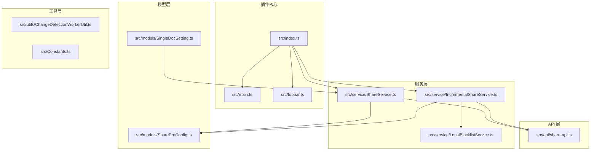
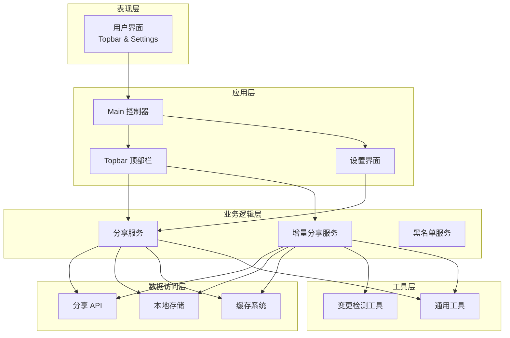
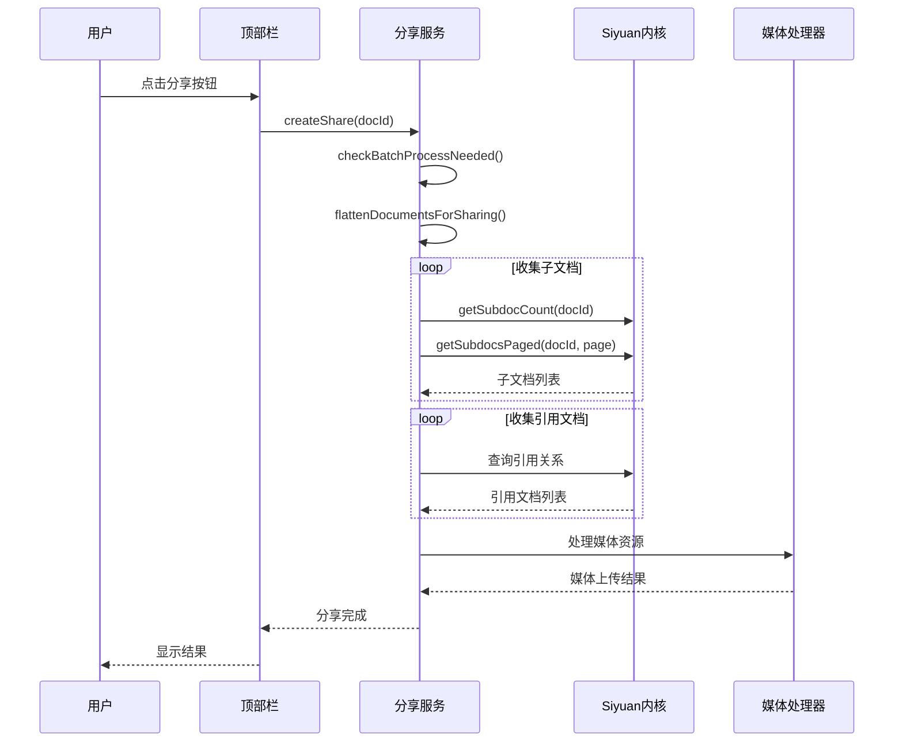
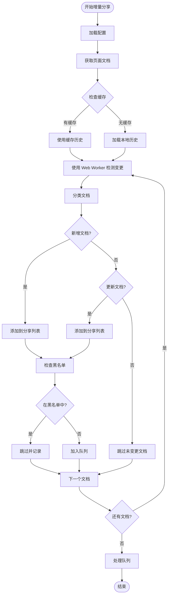
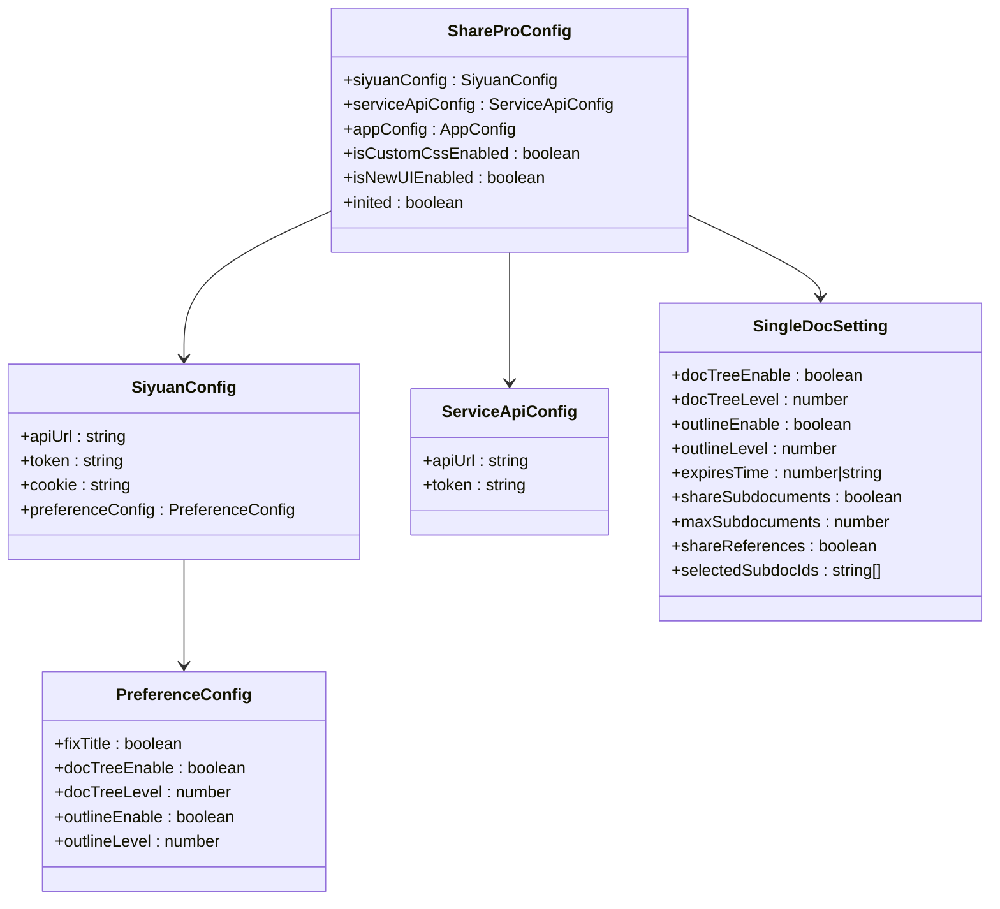
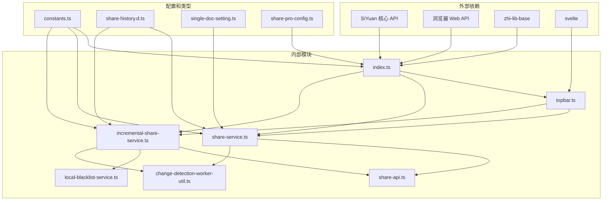
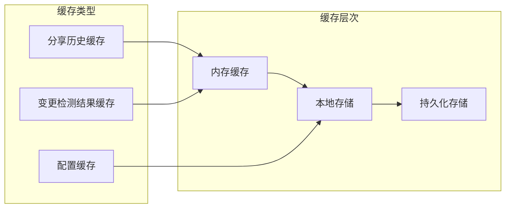

# 子文档分享规范

<cite>
**本文档引用的文件**
- [plugin.json](file://plugin.json)
- [README.md](file://README.md)
- [src/index.ts](file://src/index.ts)
- [src/main.ts](file://src/main.ts)
- [src/topbar.ts](file://src/topbar.ts)
- [src/api/share-api.ts](file://src/api/share-api.ts)
- [src/service/ShareService.ts](file://src/service/ShareService.ts)
- [src/service/IncrementalShareService.ts](file://src/service/IncrementalShareService.ts)
- [src/service/LocalBlacklistService.ts](file://src/service/LocalBlacklistService.ts)
- [src/models/SingleDocSetting.ts](file://src/models/SingleDocSetting.ts)
- [src/models/ShareProConfig.ts](file://src/models/ShareProConfig.ts)
- [src/utils/ChangeDetectionWorkerUtil.ts](file://src/utils/ChangeDetectionWorkerUtil.ts)
- [src/types/share-history.d.ts](file://src/types/share-history.d.ts)
- [src/Constants.ts](file://src/Constants.ts)
</cite>

## 目录
1. [简介](#简介)
2. [项目结构](#项目结构)
3. [核心组件](#核心组件)
4. [架构概览](#架构概览)
5. [详细组件分析](#详细组件分析)
6. [依赖关系分析](#依赖关系分析)
7. [性能考虑](#性能考虑)
8. [故障排除指南](#故障排除指南)
9. [结论](#结论)

## 简介

Share Pro 是一个专为 Siyuan 笔记设计的专业级文档分享插件，支持一键分享思源笔记。该插件提供了完整的子文档分享功能，允许用户同时分享主文档及其子文档、引用文档，实现批量化的文档分享管理。

本插件的核心特性包括：
- 一键分享：支持单文档和批量文档分享
- 子文档分享：自动发现并分享子文档
- 引用文档分享：递归分享引用的文档
- 增量分享：智能检测文档变更，仅分享更新内容
- 黑名单管理：防止特定文档被分享
- 进度监控：实时显示分享进度和状态

## 项目结构

基于提供的代码库，Share Pro 插件采用模块化架构设计，主要包含以下核心目录和文件：

**图表来源**
- [src/index.ts:1-178](file://src/index.ts#L1-L178)
- [src/main.ts:1-34](file://src/main.ts#L1-L34)
- [src/topbar.ts:1-297](file://src/topbar.ts#L1-L297)

**章节来源**
- [plugin.json:1-35](file://plugin.json#L1-L35)
- [README.md:1-21](file://README.md#L1-L21)

## 核心组件

### 插件入口组件

ShareProPlugin 类作为插件的主要入口点，负责初始化整个插件系统：

- **配置管理**：管理 Siyuan API 配置和服务 API 配置
- **服务实例化**：创建并管理各个服务组件
- **生命周期管理**：处理插件的加载和卸载过程
- **UI 集成**：集成顶部栏和设置界面

### 分享服务组件

ShareService 提供核心的文档分享功能：

- **文档收集**：自动收集主文档、子文档和引用文档
- **批量处理**：支持并发处理多个文档
- **媒体资源处理**：处理图片等媒体资源的上传
- **进度监控**：提供详细的分享进度反馈

### 增量分享服务组件

IncrementalShareService 实现智能的增量分享功能：

- **变更检测**：使用 Web Worker 进行高效的变更检测
- **批量分享**：支持并发控制的批量文档分享
- **队列管理**：管理分享任务队列，支持暂停和恢复
- **重试机制**：实现智能的失败重试策略

**章节来源**
- [src/index.ts:33-178](file://src/index.ts#L33-L178)
- [src/service/ShareService.ts:45-800](file://src/service/ShareService.ts#L45-L800)
- [src/service/IncrementalShareService.ts:98-691](file://src/service/IncrementalShareService.ts#L98-L691)

## 架构概览

Share Pro 插件采用分层架构设计，确保各组件职责清晰、耦合度低：

**图表来源**
- [src/index.ts:33-178](file://src/index.ts#L33-L178)
- [src/topbar.ts:26-297](file://src/topbar.ts#L26-L297)
- [src/service/ShareService.ts:45-800](file://src/service/ShareService.ts#L45-L800)
- [src/service/IncrementalShareService.ts:98-691](file://src/service/IncrementalShareService.ts#L98-L691)

## 详细组件分析

### 子文档分享流程

子文档分享是 Share Pro 的核心功能之一，实现了智能的文档层次结构发现和批量处理：

**图表来源**
- [src/service/ShareService.ts:124-160](file://src/service/ShareService.ts#L124-L160)
- [src/service/ShareService.ts:406-460](file://src/service/ShareService.ts#L406-L460)
- [src/service/ShareService.ts:465-576](file://src/service/ShareService.ts#L465-L576)

### 增量分享算法

增量分享通过智能的变更检测算法，仅分享发生变更的文档：

**图表来源**
- [src/service/IncrementalShareService.ts:160-210](file://src/service/IncrementalShareService.ts#L160-L210)
- [src/utils/ChangeDetectionWorkerUtil.ts:36-85](file://src/utils/ChangeDetectionWorkerUtil.ts#L36-L85)

### 配置管理系统

ShareProConfig 提供了灵活的配置管理机制：

**图表来源**
- [src/models/ShareProConfig.ts:13-40](file://src/models/ShareProConfig.ts#L13-L40)
- [src/models/SingleDocSetting.ts:16-92](file://src/models/SingleDocSetting.ts#L16-L92)

**章节来源**
- [src/service/ShareService.ts:124-160](file://src/service/ShareService.ts#L124-L160)
- [src/service/IncrementalShareService.ts:160-210](file://src/service/IncrementalShareService.ts#L160-L210)
- [src/models/ShareProConfig.ts:13-40](file://src/models/ShareProConfig.ts#L13-L40)

## 依赖关系分析

插件的依赖关系体现了清晰的分层架构：

**图表来源**
- [src/index.ts:10-31](file://src/index.ts#L10-L31)
- [src/topbar.ts:10-21](file://src/topbar.ts#L10-L21)
- [src/api/share-api.ts:10-23](file://src/api/share-api.ts#L10-L23)
- [src/service/ShareService.ts:10-38](file://src/service/ShareService.ts#L10-L38)

**章节来源**
- [src/Constants.ts:10-30](file://src/Constants.ts#L10-L30)
- [src/types/share-history.d.ts:10-59](file://src/types/share-history.d.ts#L10-L59)

## 性能考虑

### 并发控制策略

插件实现了多层并发控制机制：

1. **批量处理并发**：默认最大并发数为 10
2. **队列管理**：支持任务暂停和恢复
3. **内存优化**：使用缓存系统减少重复计算
4. **网络优化**：智能重试机制避免频繁请求

### 缓存策略

**图表来源**
- [src/service/IncrementalShareService.ts:108-129](file://src/service/IncrementalShareService.ts#L108-L129)
- [src/utils/ChangeDetectionWorkerUtil.ts:17-31](file://src/utils/ChangeDetectionWorkerUtil.ts#L17-L31)

## 故障排除指南

### 常见问题及解决方案

1. **分享失败问题**
   - 检查网络连接和 API 端点配置
   - 验证授权令牌的有效性
   - 查看错误日志获取详细信息

2. **子文档未被分享**
   - 确认子文档分享开关已启用
   - 检查文档层级限制设置
   - 验证文档权限设置

3. **增量分享不工作**
   - 清除缓存后重试
   - 检查黑名单配置
   - 验证文档修改时间戳

**章节来源**
- [src/service/IncrementalShareService.ts:585-660](file://src/service/IncrementalShareService.ts#L585-L660)
- [src/service/ShareService.ts:250-317](file://src/service/ShareService.ts#L250-L317)

## 结论

Share Pro 插件通过精心设计的架构和完善的子文档分享功能，为 Siyuan 笔记用户提供了强大而便捷的文档分享解决方案。其核心优势包括：

- **智能化的增量分享**：通过变更检测算法，仅分享更新内容
- **灵活的配置管理**：支持多种分享选项和自定义设置
- **高性能的并发处理**：优化的并发控制和缓存策略
- **稳定的错误处理**：完善的错误捕获和重试机制

该插件不仅满足了基本的文档分享需求，还通过高级功能如子文档分享、引用文档处理等，为用户提供了更加丰富的分享体验。其模块化的设计使得插件具有良好的可维护性和扩展性，为未来的功能增强奠定了坚实的基础。