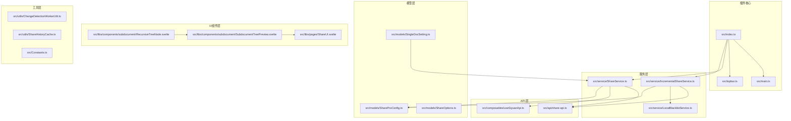
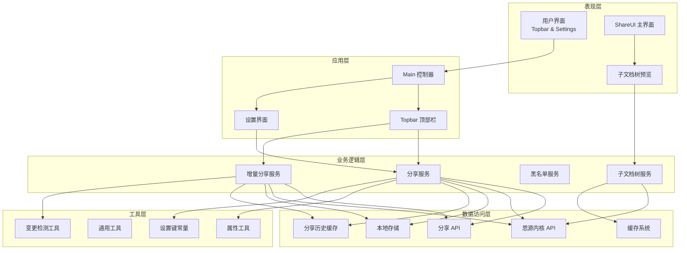
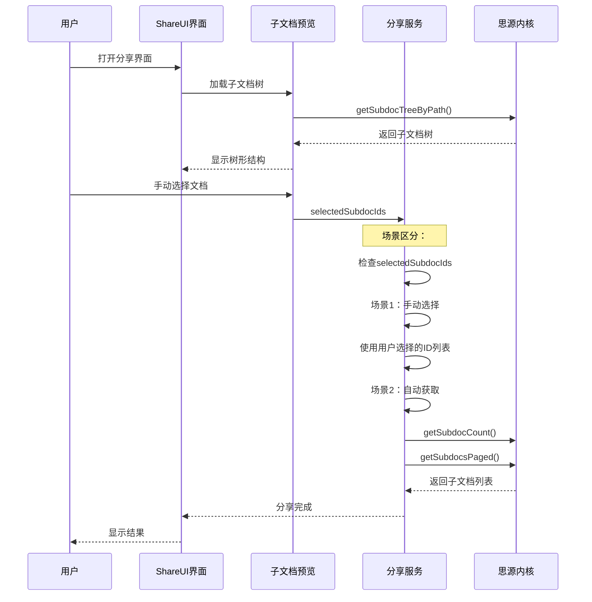
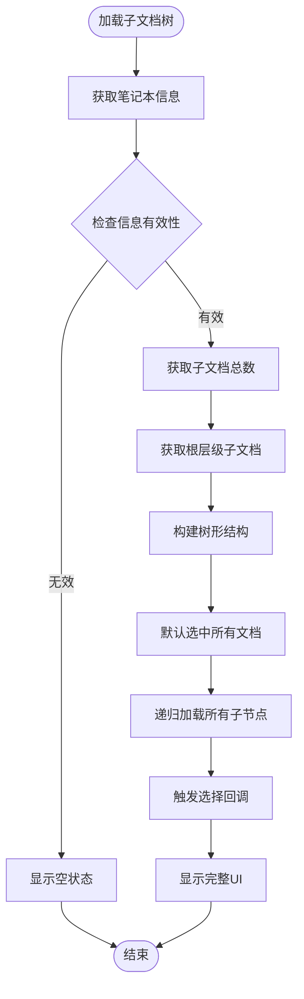
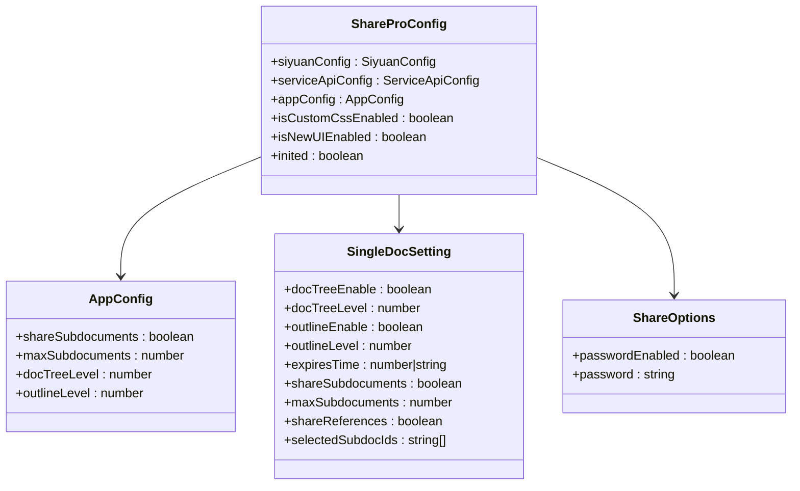
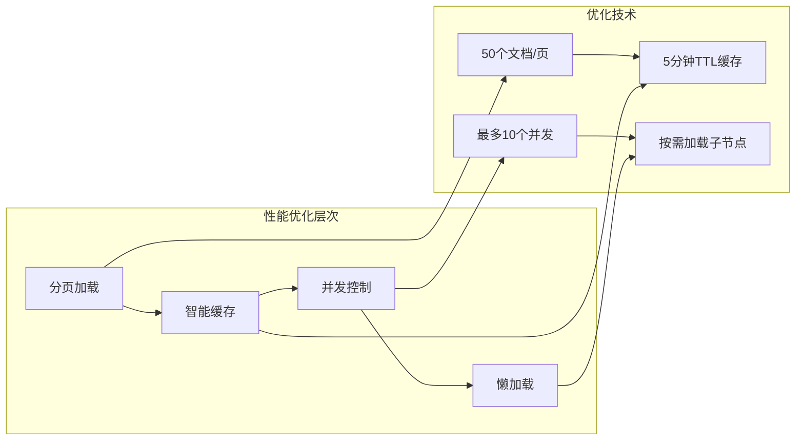
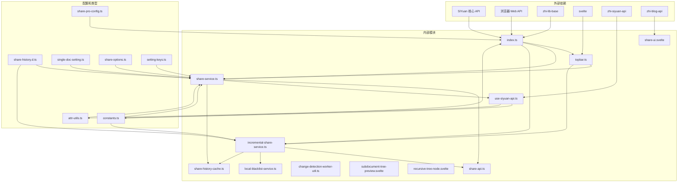
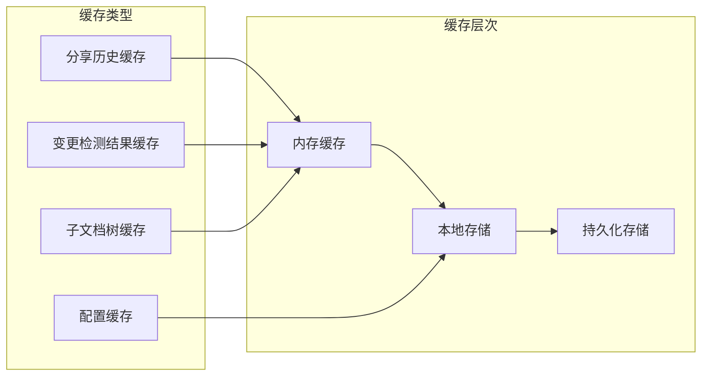

# 子文档分享规范

<cite>
**本文档引用的文件**
- [plugin.json](file://plugin.json)
- [README.md](file://README.md)
- [src/index.ts](file://src/index.ts)
- [src/main.ts](file://src/main.ts)
- [src/topbar.ts](file://src/topbar.ts)
- [src/api/share-api.ts](file://src/api/share-api.ts)
- [src/service/ShareService.ts](file://src/service/ShareService.ts)
- [src/service/IncrementalShareService.ts](file://src/service/IncrementalShareService.ts)
- [src/service/LocalBlacklistService.ts](file://src/service/LocalBlacklistService.ts)
- [src/models/SingleDocSetting.ts](file://src/models/SingleDocSetting.ts)
- [src/models/ShareProConfig.ts](file://src/models/ShareProConfig.ts)
- [src/utils/ChangeDetectionWorkerUtil.ts](file://src/utils/ChangeDetectionWorkerUtil.ts)
- [src/types/share-history.d.ts](file://src/types/share-history.d.ts)
- [src/Constants.ts](file://src/Constants.ts)
- [src/composables/useSiyuanApi.ts](file://src/composables/useSiyuanApi.ts)
- [src/libs/components/subdocument/SubdocumentTreePreview.svelte](file://src/libs/components/subdocument/SubdocumentTreePreview.svelte)
- [src/libs/components/subdocument/RecursiveTreeNode.svelte](file://src/libs/components/subdocument/RecursiveTreeNode.svelte)
- [src/libs/pages/ShareUI.svelte](file://src/libs/pages/ShareUI.svelte)
- [src/utils/ShareHistoryCache.ts](file://src/utils/ShareHistoryCache.ts)
- [docs/subdocument-share-context-2026-02-28.md](file://docs/subdocument-share-context-2026-02-28.md)
</cite>

## 更新摘要
**变更内容**
- 更新了子文档收集机制的实现细节，包括手动选择功能
- 新增了子文档树可视化预览组件的详细分析
- 增强了性能优化和缓存策略的说明
- 完善了三层配置架构的实现细节
- 更新了并发控制和错误处理机制

## 目录
1. [简介](#简介)
2. [项目结构](#项目结构)
3. [核心组件](#核心组件)
4. [架构概览](#架构概览)
5. [详细组件分析](#详细组件分析)
6. [依赖关系分析](#依赖关系分析)
7. [性能考虑](#性能考虑)
8. [故障排除指南](#故障排除指南)
9. [结论](#结论)

## 简介

Share Pro 是一个专为 Siyuan 笔记设计的专业级文档分享插件，支持一键分享思源笔记。该插件提供了完整的子文档分享功能，允许用户同时分享主文档及其子文档、引用文档，实现批量化的文档分享管理。

**最新增强功能**：
- **灵活的子文档收集机制**：支持自动获取和手动选择两种模式
- **子文档树可视化预览**：直观展示文档层次结构和选择状态
- **智能手动选择功能**：支持全选、反选、仅首层选择等操作
- **三层配置架构**：全局、文档级和分享级的分层配置管理
- **性能优化**：分页加载、智能缓存和并发控制

本插件的核心特性包括：
- 一键分享：支持单文档和批量文档分享
- 子文档分享：自动发现并分享子文档，支持手动选择
- 引用文档分享：递归分享引用的文档
- 增量分享：智能检测文档变更，仅分享更新内容
- 黑名单管理：防止特定文档被分享
- 进度监控：实时显示分享进度和状态
- **可视化预览**：直观展示子文档树结构和选择状态

## 项目结构

基于提供的代码库，Share Pro 插件采用模块化架构设计，主要包含以下核心目录和文件：

**图表来源**
- [src/index.ts:1-178](file://src/index.ts#L1-L178)
- [src/main.ts:1-34](file://src/main.ts#L1-L34)
- [src/topbar.ts:1-297](file://src/topbar.ts#L1-L297)
- [src/libs/components/subdocument/SubdocumentTreePreview.svelte:1-553](file://src/libs/components/subdocument/SubdocumentTreePreview.svelte#L1-L553)

**章节来源**
- [plugin.json:1-35](file://plugin.json#L1-L35)
- [README.md:1-21](file://README.md#L1-L21)

## 核心组件

### 插件入口组件

ShareProPlugin 类作为插件的主要入口点，负责初始化整个插件系统：

- **配置管理**：管理 Siyuan API 配置和服务 API 配置
- **服务实例化**：创建并管理各个服务组件
- **生命周期管理**：处理插件的加载和卸载过程
- **UI 集成**：集成顶部栏和设置界面

### 分享服务组件

ShareService 提供核心的文档分享功能：

- **智能文档收集**：支持自动获取和手动选择两种模式
- **三层配置管理**：全局、文档级和分享级的配置优先级处理
- **批量处理**：支持并发处理多个文档
- **媒体资源处理**：处理图片等媒体资源的上传
- **进度监控**：提供详细的分享进度反馈
- **性能优化**：分页加载、智能缓存和并发控制

### 增量分享服务组件

IncrementalShareService 实现智能的增量分享功能：

- **变更检测**：使用 Web Worker 进行高效的变更检测
- **批量分享**：支持并发控制的批量文档分享
- **队列管理**：管理分享任务队列，支持暂停和恢复
- **重试机制**：实现智能的失败重试策略

### 子文档树预览组件

**新增** 子文档树预览组件提供了直观的可视化界面：

- **树形结构展示**：使用 RecursiveTreeNode 组件递归渲染
- **懒加载机制**：按需加载子节点，提升性能
- **手动选择功能**：支持全选、反选、仅首层选择等操作
- **实时统计**：显示选择的文档数量和估算的资源消耗
- **性能警告**：当文档数量较多时提供性能警告

**章节来源**
- [src/index.ts:33-178](file://src/index.ts#L33-L178)
- [src/service/ShareService.ts:45-800](file://src/service/ShareService.ts#L45-L800)
- [src/service/IncrementalShareService.ts:98-691](file://src/service/IncrementalShareService.ts#L98-L691)
- [src/libs/components/subdocument/SubdocumentTreePreview.svelte:1-553](file://src/libs/components/subdocument/SubdocumentTreePreview.svelte#L1-L553)

## 架构概览

Share Pro 插件采用分层架构设计，确保各组件职责清晰、耦合度低：

**图表来源**
- [src/index.ts:33-178](file://src/index.ts#L33-L178)
- [src/topbar.ts:26-297](file://src/topbar.ts#L26-L297)
- [src/service/ShareService.ts:45-800](file://src/service/ShareService.ts#L45-L800)
- [src/service/IncrementalShareService.ts:98-691](file://src/service/IncrementalShareService.ts#L98-L691)
- [src/libs/components/subdocument/SubdocumentTreePreview.svelte:1-553](file://src/libs/components/subdocument/SubdocumentTreePreview.svelte#L1-L553)

## 详细组件分析

### 子文档收集机制

**更新** 子文档收集机制现在支持两种模式：

**图表来源**
- [src/service/ShareService.ts:406-467](file://src/service/ShareService.ts#L406-L467)
- [src/composables/useSiyuanApi.ts:384-466](file://src/composables/useSiyuanApi.ts#L384-L466)
- [src/libs/components/subdocument/SubdocumentTreePreview.svelte:105-186](file://src/libs/components/subdocument/SubdocumentTreePreview.svelte#L105-L186)

### 子文档树可视化预览

**新增** 子文档树预览组件提供了完整的可视化界面：

**图表来源**
- [src/libs/components/subdocument/SubdocumentTreePreview.svelte:105-186](file://src/libs/components/subdocument/SubdocumentTreePreview.svelte#L105-L186)
- [src/libs/components/subdocument/SubdocumentTreePreview.svelte:333-357](file://src/libs/components/subdocument/SubdocumentTreePreview.svelte#L333-L357)

### 三层配置架构

**更新** 三层配置架构提供了灵活的配置管理：

**图表来源**
- [src/models/ShareProConfig.ts:13-40](file://src/models/ShareProConfig.ts#L13-L40)
- [src/models/SingleDocSetting.ts:16-92](file://src/models/SingleDocSetting.ts#L16-L92)

### 性能优化策略

**更新** 新增了多项性能优化措施：

**图表来源**
- [src/service/ShareService.ts:446-461](file://src/service/ShareService.ts#L446-L461)
- [src/utils/ShareHistoryCache.ts:19-87](file://src/utils/ShareHistoryCache.ts#L19-L87)
- [src/libs/components/subdocument/SubdocumentTreePreview.svelte:170-175](file://src/libs/components/subdocument/SubdocumentTreePreview.svelte#L170-L175)

**章节来源**
- [src/service/ShareService.ts:406-467](file://src/service/ShareService.ts#L406-L467)
- [src/libs/components/subdocument/SubdocumentTreePreview.svelte:1-553](file://src/libs/components/subdocument/SubdocumentTreePreview.svelte#L1-L553)
- [src/models/ShareProConfig.ts:13-40](file://src/models/ShareProConfig.ts#L13-L40)

## 依赖关系分析

插件的依赖关系体现了清晰的分层架构：

**图表来源**
- [src/index.ts:10-31](file://src/index.ts#L10-L31)
- [src/topbar.ts:10-21](file://src/topbar.ts#L10-L21)
- [src/api/share-api.ts:10-23](file://src/api/share-api.ts#L10-L23)
- [src/service/ShareService.ts:10-38](file://src/service/ShareService.ts#L10-L38)

**章节来源**
- [src/Constants.ts:10-30](file://src/Constants.ts#L10-L30)
- [src/types/share-history.d.ts:10-59](file://src/types/share-history.d.ts#L10-L59)

## 性能考虑

### 并发控制策略

**更新** 插件实现了多层并发控制机制：

1. **批量处理并发**：默认最大并发数为 10
2. **子文档加载并发**：使用分页机制，每页50个文档
3. **队列管理**：支持任务暂停和恢复
4. **内存优化**：使用缓存系统减少重复计算
5. **网络优化**：智能重试机制避免频繁请求

### 缓存策略

**更新** 新增了智能缓存机制：

**图表来源**
- [src/service/IncrementalShareService.ts:108-129](file://src/service/IncrementalShareService.ts#L108-L129)
- [src/utils/ChangeDetectionWorkerUtil.ts:17-31](file://src/utils/ChangeDetectionWorkerUtil.ts#L17-L31)
- [src/utils/ShareHistoryCache.ts:19-87](file://src/utils/ShareHistoryCache.ts#L19-L87)

### 子文档树性能优化

**新增** 子文档树组件采用了多项性能优化：

- **懒加载机制**：仅在展开节点时加载子节点
- **递归渲染**：使用 Svelte 的递归组件避免重复代码
- **响应式更新**：使用 Set 数据结构进行高效的集合操作
- **性能警告**：当文档数量超过阈值时提供警告提示

## 故障排除指南

### 常见问题及解决方案

**更新** 增加了子文档分享相关的故障排除：

1. **分享失败问题**
   - 检查网络连接和 API 端点配置
   - 验证授权令牌的有效性
   - 查看错误日志获取详细信息

2. **子文档未被分享**
   - 确认子文档分享开关已启用
   - 检查文档层级限制设置
   - 验证文档权限设置
   - **新增** 检查手动选择的子文档ID是否正确

3. **子文档树加载失败**
   - **新增** 检查笔记本ID和文档路径的有效性
   - **新增** 验证思源内核API的可用性
   - **新增** 查看控制台错误日志

4. **增量分享不工作**
   - 清除缓存后重试
   - 检查黑名单配置
   - 验证文档修改时间戳

**章节来源**
- [src/service/IncrementalShareService.ts:585-660](file://src/service/IncrementalShareService.ts#L585-L660)
- [src/service/ShareService.ts:250-317](file://src/service/ShareService.ts#L250-L317)
- [src/libs/components/subdocument/SubdocumentTreePreview.svelte:177-185](file://src/libs/components/subdocument/SubdocumentTreePreview.svelte#L177-L185)

## 结论

Share Pro 插件通过精心设计的架构和完善的子文档分享功能，为 Siyuan 笔记用户提供了强大而便捷的文档分享解决方案。其核心优势包括：

- **智能化的增量分享**：通过变更检测算法，仅分享更新内容
- **灵活的配置管理**：支持三层配置架构，提供灵活的设置选项
- **高性能的并发处理**：优化的并发控制和缓存策略
- **稳定的错误处理**：完善的错误捕获和重试机制
- **直观的可视化界面**：子文档树预览提供良好的用户体验
- **智能的手动选择功能**：支持多种选择模式，满足不同需求

**最新增强功能**使插件更加完善：

- **灵活的子文档收集机制**：支持自动获取和手动选择两种模式
- **子文档树可视化预览**：直观展示文档层次结构和选择状态
- **智能性能优化**：分页加载、智能缓存和懒加载机制
- **三层配置架构**：提供清晰的配置管理和优先级处理

该插件不仅满足了基本的文档分享需求，还通过高级功能如子文档分享、引用文档处理、可视化预览等，为用户提供了更加丰富的分享体验。其模块化的设计使得插件具有良好的可维护性和扩展性，为未来的功能增强奠定了坚实的基础。