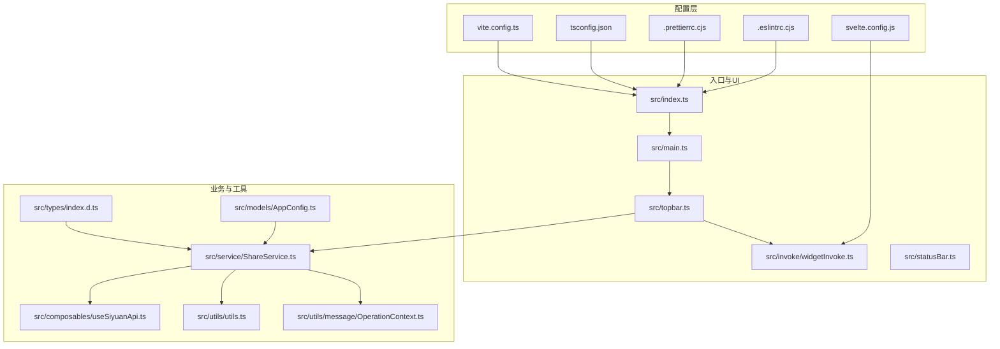
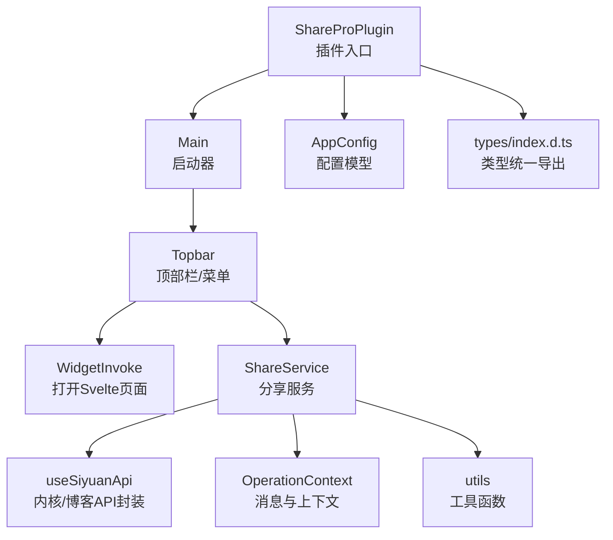
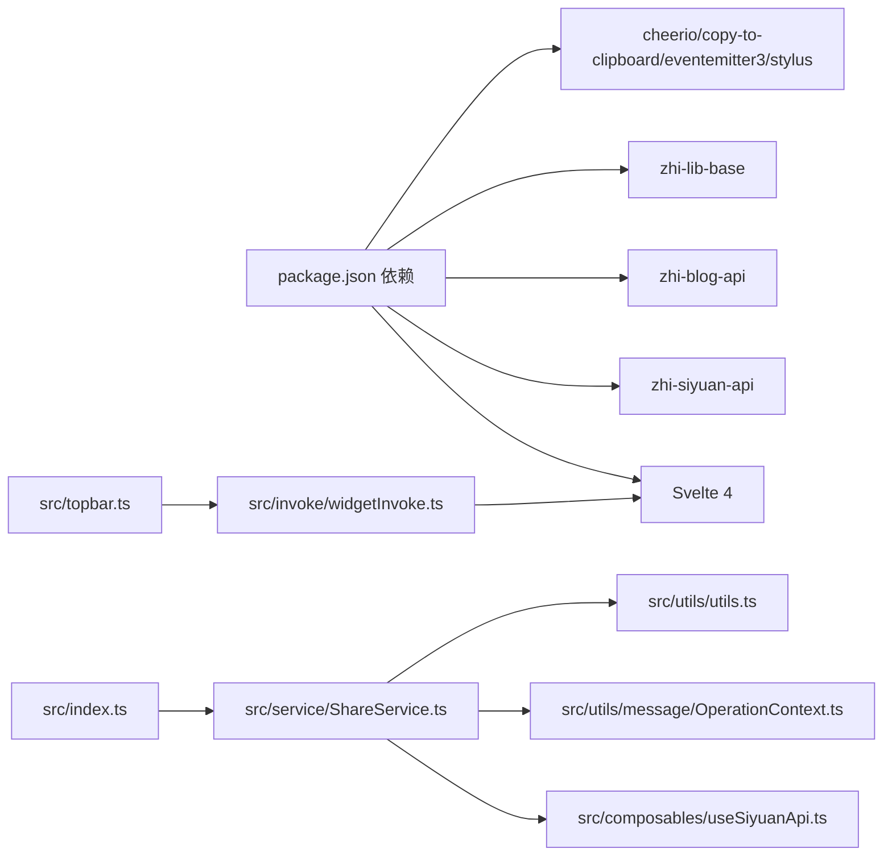
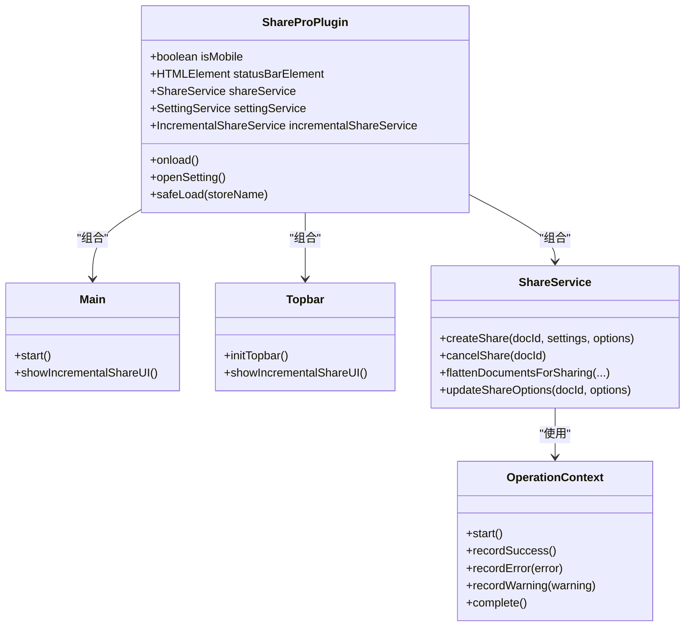
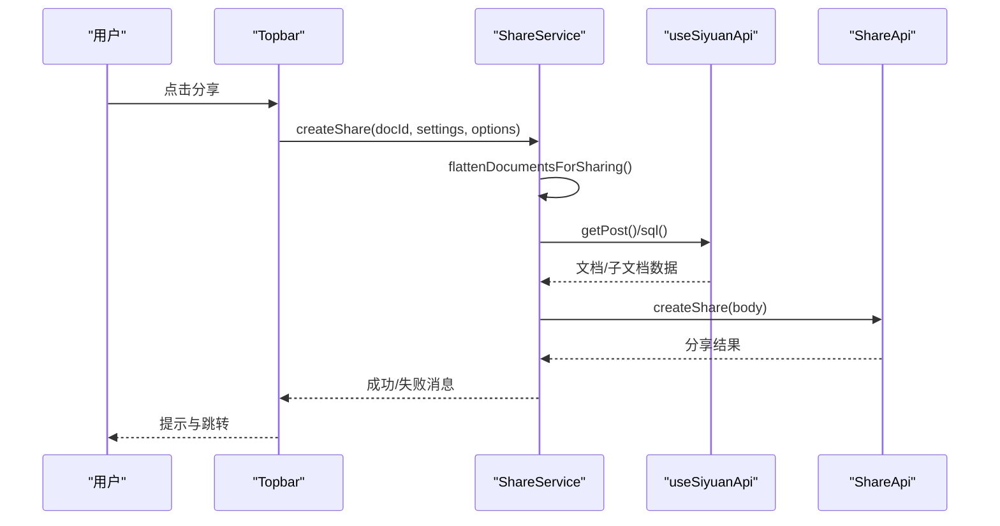
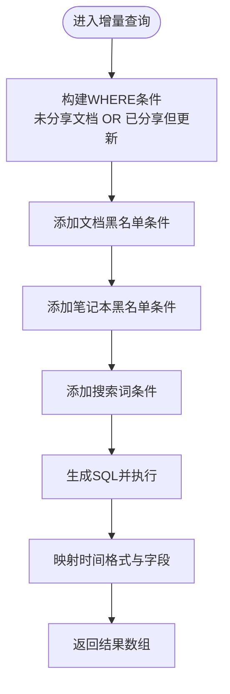

# 代码规范

<cite>
**本文引用的文件**
- [.eslintrc.cjs](file://.eslintrc.cjs)
- [.prettierrc.cjs](file://.prettierrc.cjs)
- [package.json](file://package.json)
- [tsconfig.json](file://tsconfig.json)
- [svelte.config.js](file://svelte.config.js)
- [vite.config.ts](file://vite.config.ts)
- [src/index.ts](file://src/index.ts)
- [src/main.ts](file://src/main.ts)
- [src/topbar.ts](file://src/topbar.ts)
- [src/invoke/widgetInvoke.ts](file://src/invoke/widgetInvoke.ts)
- [src/statusBar.ts](file://src/statusBar.ts)
- [src/models/AppConfig.ts](file://src/models/AppConfig.ts)
- [src/composables/useSiyuanApi.ts](file://src/composables/useSiyuanApi.ts)
- [src/utils/message/OperationContext.ts](file://src/utils/message/OperationContext.ts)
- [src/service/ShareService.ts](file://src/service/ShareService.ts)
- [src/utils/utils.ts](file://src/utils/utils.ts)
- [src/types/index.d.ts](file://src/types/index.d.ts)
</cite>

## 目录
1. [简介](#简介)
2. [项目结构](#项目结构)
3. [核心组件](#核心组件)
4. [架构总览](#架构总览)
5. [详细组件分析](#详细组件分析)
6. [依赖分析](#依赖分析)
7. [性能考虑](#性能考虑)
8. [故障排查指南](#故障排查指南)
9. [结论](#结论)
10. [附录](#附录)

## 简介
本文件为“思源笔记分享专业版”制定全面的代码规范标准，覆盖 TypeScript 编码规范与类型定义、Svelte 组件编写与响应式数据管理、ESLint 与 Prettier 配置、文件组织与模块导入导出、注释与文档规范、代码审查清单、重构指南、性能优化建议、错误处理与日志记录、国际化与样式规范、资源管理最佳实践等。目标是提升代码一致性、可维护性与可扩展性。

## 项目结构
项目采用“按职责分层 + 功能域划分”的组织方式：
- 配置层：ESLint、Prettier、TypeScript、Vite、Svelte 配置
- 入口与插件生命周期：src/index.ts、src/main.ts、src/topbar.ts
- UI 层：Svelte 组件（页面与部件），通过 widgetInvoke.ts 打开面板/对话框
- 业务层：ShareService 等服务封装，调用 API 与内核接口
- 工具与类型：utils、types、models、composables
- 国际化：src/i18n 下的多语言 JSON
- 构建与资源：Vite 插件复制静态资源与 i18n 文件

图表来源
- [vite.config.ts:16-120](file://vite.config.ts#L16-L120)
- [svelte.config.js:1-15](file://svelte.config.js#L1-L15)
- [tsconfig.json:1-53](file://tsconfig.json#L1-L53)
- [.eslintrc.cjs:1-46](file://.eslintrc.cjs#L1-L46)
- [.prettierrc.cjs:26-32](file://.prettierrc.cjs#L26-L32)
- [src/index.ts:1-178](file://src/index.ts#L1-L178)
- [src/main.ts:1-34](file://src/main.ts#L1-L34)
- [src/topbar.ts:1-297](file://src/topbar.ts#L1-L297)
- [src/invoke/widgetInvoke.ts:1-80](file://src/invoke/widgetInvoke.ts#L1-L80)
- [src/statusBar.ts:1-32](file://src/statusBar.ts#L1-L32)
- [src/service/ShareService.ts:1-800](file://src/service/ShareService.ts#L1-L800)
- [src/composables/useSiyuanApi.ts:1-465](file://src/composables/useSiyuanApi.ts#L1-L465)
- [src/utils/utils.ts:1-99](file://src/utils/utils.ts#L1-L99)
- [src/utils/message/OperationContext.ts:1-187](file://src/utils/message/OperationContext.ts#L1-L187)
- [src/models/AppConfig.ts:1-88](file://src/models/AppConfig.ts#L1-L88)
- [src/types/index.d.ts:1-18](file://src/types/index.d.ts#L1-L18)

章节来源
- [vite.config.ts:16-120](file://vite.config.ts#L16-L120)
- [svelte.config.js:1-15](file://svelte.config.js#L1-L15)
- [tsconfig.json:1-53](file://tsconfig.json#L1-L53)
- [.eslintrc.cjs:1-46](file://.eslintrc.cjs#L1-L46)
- [.prettierrc.cjs:26-32](file://.prettierrc.cjs#L26-L32)
- [src/index.ts:1-178](file://src/index.ts#L1-L178)
- [src/main.ts:1-34](file://src/main.ts#L1-L34)
- [src/topbar.ts:1-297](file://src/topbar.ts#L1-L297)
- [src/invoke/widgetInvoke.ts:1-80](file://src/invoke/widgetInvoke.ts#L1-L80)
- [src/statusBar.ts:1-32](file://src/statusBar.ts#L1-L32)
- [src/service/ShareService.ts:1-800](file://src/service/ShareService.ts#L1-L800)
- [src/composables/useSiyuanApi.ts:1-465](file://src/composables/useSiyuanApi.ts#L1-L465)
- [src/utils/utils.ts:1-99](file://src/utils/utils.ts#L1-L99)
- [src/utils/message/OperationContext.ts:1-187](file://src/utils/message/OperationContext.ts#L1-L187)
- [src/models/AppConfig.ts:1-88](file://src/models/AppConfig.ts#L1-L88)
- [src/types/index.d.ts:1-18](file://src/types/index.d.ts#L1-L18)

## 核心组件
- 插件入口与生命周期：ShareProPlugin 负责加载配置、初始化状态栏、打开设置面板、暴露增量分享 UI；Main 作为启动器协调 UI 初始化。
- 顶部栏与菜单：Topbar 提供顶部按钮、右键菜单、增量分享弹窗、打开分享管理面板。
- Svelte 组件：通过 widgetInvoke.ts 在标签页或对话框中挂载 Svelte 页面组件（如 ShareManage、IncrementalShareUI）。
- 分享服务：ShareService 统一封装分享/取消/更新选项、历史记录、媒体资源处理、并发控制与进度管理。
- 思源 API 封装：useSiyuanApi 提供内核 API、博客 API、SQL 查询、增量/子文档/引用文档查询等能力。
- 消息与上下文：OperationContext 统一管理批量/单次操作的消息提示与上下文状态。
- 工具与类型：utils 提供通用工具函数；types/index.d.ts 统一导出类型定义；models 定义配置模型。

章节来源
- [src/index.ts:33-178](file://src/index.ts#L33-L178)
- [src/main.ts:12-34](file://src/main.ts#L12-L34)
- [src/topbar.ts:26-297](file://src/topbar.ts#L26-L297)
- [src/invoke/widgetInvoke.ts:17-80](file://src/invoke/widgetInvoke.ts#L17-L80)
- [src/service/ShareService.ts:40-800](file://src/service/ShareService.ts#L40-L800)
- [src/composables/useSiyuanApi.ts:24-465](file://src/composables/useSiyuanApi.ts#L24-L465)
- [src/utils/message/OperationContext.ts:23-187](file://src/utils/message/OperationContext.ts#L23-L187)
- [src/utils/utils.ts:17-99](file://src/utils/utils.ts#L17-L99)
- [src/types/index.d.ts:10-18](file://src/types/index.d.ts#L10-L18)
- [src/models/AppConfig.ts:10-88](file://src/models/AppConfig.ts#L10-L88)

## 架构总览
整体采用“插件入口 -> UI -> 服务 -> API/内核”的分层架构。Svelte 作为 UI 层，通过 Vite/Svelte 插件编译；TypeScript 类型系统保障数据结构安全；ESLint+Prettier 保证风格一致；Vite 负责编译、打包与静态资源复制。

图表来源
- [src/index.ts:33-178](file://src/index.ts#L33-L178)
- [src/main.ts:12-34](file://src/main.ts#L12-L34)
- [src/topbar.ts:26-297](file://src/topbar.ts#L26-L297)
- [src/invoke/widgetInvoke.ts:17-80](file://src/invoke/widgetInvoke.ts#L17-L80)
- [src/service/ShareService.ts:40-800](file://src/service/ShareService.ts#L40-L800)
- [src/composables/useSiyuanApi.ts:24-465](file://src/composables/useSiyuanApi.ts#L24-L465)
- [src/utils/message/OperationContext.ts:23-187](file://src/utils/message/OperationContext.ts#L23-L187)
- [src/utils/utils.ts:17-99](file://src/utils/utils.ts#L17-L99)
- [src/models/AppConfig.ts:10-88](file://src/models/AppConfig.ts#L10-L88)
- [src/types/index.d.ts:10-18](file://src/types/index.d.ts#L10-L18)

## 详细组件分析

### TypeScript 编码规范与类型定义
- 语言与模块
  - 目标与模块：ESNext + ESNext 模块解析
  - 严格性：关闭严格模式，允许动态类型与未使用局部变量/参数，便于与 JS/Svelte 混合开发
  - 类型检查：允许 JS 类型检查，配合 Svelte 组件
- 类型与接口
  - 使用明确的接口与类型别名，避免 any；对可选字段使用可选链
  - 对外暴露的公共类型通过统一出口导出，便于消费方引用
- 命名约定
  - 类/接口：帕斯卡命名（如 ShareService、AppConfig）
  - 方法/函数：驼峰命名（如 flattenDocumentsForSharing、cleanDocTitle）
  - 常量：大写下划线（如 SHARE_PRO_STORE_NAME）
  - 文件命名：功能域/职责命名（如 ShareService.ts、OperationContext.ts）
- 导入导出
  - 统一使用相对路径导入，避免隐式全局
  - 类型统一从 src/types/index.d.ts 导出，避免分散引用
- 注释与文档
  - 公共 API/类/方法需提供 JSDoc 风格注释，说明用途、参数、返回值与异常
  - 复杂算法/流程使用注释分段，必要时配图说明

章节来源
- [tsconfig.json:2-38](file://tsconfig.json#L2-L38)
- [src/models/AppConfig.ts:10-88](file://src/models/AppConfig.ts#L10-L88)
- [src/types/index.d.ts:10-18](file://src/types/index.d.ts#L10-L18)
- [src/utils/utils.ts:87-99](file://src/utils/utils.ts#L87-L99)
- [src/service/ShareService.ts:40-800](file://src/service/ShareService.ts#L40-L800)

### Svelte 组件编写规范与模板语法
- 组件组织
  - 页面组件放置于 src/libs/pages，部件组件放置于 src/libs/components
  - 通过 WidgetInvoke 在标签页或对话框中挂载组件，统一容器与尺寸
- 模板语法
  - 使用 Svelte 3+ 语法，避免复杂表达式，尽量在脚本中预处理
  - 事件绑定使用 on: 前缀，避免内联函数导致的性能问题
- 响应式数据
  - 使用 $: 声明式响应式语句，避免直接修改 DOM
  - Props 传递保持不可变，内部状态通过组件自身管理
- 生命周期
  - onMount 中进行 DOM 初始化，onDestroy 中清理定时器/事件监听
- 可访问性
  - 遵循 a11y 基础要求，避免使用无效 HTML 标签

章节来源
- [src/invoke/widgetInvoke.ts:26-80](file://src/invoke/widgetInvoke.ts#L26-L80)
- [svelte.config.js:1-15](file://svelte.config.js#L1-L15)

### ESLint 与 Prettier 配置
- ESLint
  - 继承推荐规则集：eslint:recommended、@typescript-eslint/recommended、plugin:svelte/recommended、turbo、prettier
  - 对 Svelte 文件使用 svelte-eslint-parser，并将 script 解析为 TypeScript
  - 关闭若干易误报规则（如 no-unused-vars、no-non-null-assertion 等），以适配混合开发
  - Prettier 规则由 eslint-plugin-prettier 强制执行
- Prettier
  - 禁用分号、使用双引号、打印宽度 120、启用 svelte 插件

章节来源
- [.eslintrc.cjs:1-46](file://.eslintrc.cjs#L1-L46)
- [.prettierrc.cjs:26-32](file://.prettierrc.cjs#L26-L32)

### 文件组织与模块导入导出
- 目录结构
  - src/api、src/composables、src/invoke、src/libs、src/models、src/service、src/types、src/utils、src/workers
- 导入导出
  - 统一使用相对路径，避免绝对路径
  - 类型统一从 src/types/index.d.ts 导出，避免跨层引用
  - 工具函数集中于 utils，避免重复实现
- 资源复制
  - Vite 静态复制插件将 README、LICENSE、icon、preview、plugin.json、i18n 等资源复制到 dist

章节来源
- [vite.config.ts:25-52](file://vite.config.ts#L25-L52)
- [src/types/index.d.ts:10-18](file://src/types/index.d.ts#L10-L18)

### 注释与文档规范
- 函数/类注释
  - 说明用途、输入输出、异常与边界条件
- 复杂逻辑
  - 使用分段注释与小节标题，必要时配流程图
- 国际化
  - 所有用户可见文本通过 i18n 提供，避免硬编码字符串

章节来源
- [src/utils/message/OperationContext.ts:5-22](file://src/utils/message/OperationContext.ts#L5-L22)
- [src/service/ShareService.ts:587-730](file://src/service/ShareService.ts#L587-L730)

### 代码审查清单
- 代码风格
  - 通过 ESLint/Prettier 检查，确保无未使用变量、无空函数体、无显式 any
- 类型安全
  - 避免 any；对可选字段使用防御式编程
- 性能
  - 避免在渲染周期做重计算；合理分页与并发控制
- 错误处理
  - 所有异步调用均捕获异常；错误消息友好且可定位
- 国际化
  - 用户可见文本统一从 i18n 获取
- 可测试性
  - 将复杂逻辑拆分为纯函数，便于单元测试

章节来源
- [.eslintrc.cjs:25-44](file://.eslintrc.cjs#L25-L44)
- [src/service/ShareService.ts:40-800](file://src/service/ShareService.ts#L40-L800)

### 重构指南
- 提取公共逻辑
  - 将重复的 SQL 查询、网络请求封装为 composable 或工具函数
- 分层解耦
  - UI 与业务分离，服务层只负责编排与调度
- 并发与批处理
  - 使用并发控制与进度管理，避免阻塞主线程
- 类型收敛
  - 逐步替换 any，增加类型约束，提升可维护性

章节来源
- [src/composables/useSiyuanApi.ts:66-215](file://src/composables/useSiyuanApi.ts#L66-L215)
- [src/service/ShareService.ts:442-475](file://src/service/ShareService.ts#L442-L475)

### 性能优化建议
- 分页与限流
  - 子文档/增量文档查询使用分页与并发上限，避免一次性加载过多
- 资源处理
  - 图片与媒体资源分组处理，减少请求次数
- 渲染优化
  - Svelte 组件避免深层嵌套与复杂计算，使用响应式声明
- 构建优化
  - 生产环境启用压缩与最小化，开发环境关闭压缩便于调试

章节来源
- [src/composables/useSiyuanApi.ts:174-190](file://src/composables/useSiyuanApi.ts#L174-L190)
- [src/service/ShareService.ts:740-800](file://src/service/ShareService.ts#L740-L800)
- [vite.config.ts:76-77](file://vite.config.ts#L76-L77)

### 错误处理模式与日志记录
- 统一错误处理
  - 所有外部调用 try/catch，错误消息通过 showMessage 展示
  - OperationContext 统一批量/单次操作的消息策略
- 日志记录
  - 使用 simpleLogger 输出 info/warn/error 级别日志，区分开发/生产
- 历史记录
  - 分享失败/成功均写入本地历史与缓存，便于回溯

章节来源
- [src/utils/message/OperationContext.ts:23-187](file://src/utils/message/OperationContext.ts#L23-L187)
- [src/service/ShareService.ts:587-730](file://src/service/ShareService.ts#L587-L730)

### 国际化支持规范
- 文本来源
  - 所有用户可见文本来自 i18n JSON，避免硬编码
- 动态替换
  - 支持占位符替换与复数/时态处理
- 多语言维护
  - 新增文案同步更新各语言文件，保持键一致

章节来源
- [src/topbar.ts:113-259](file://src/topbar.ts#L113-L259)
- [src/utils/message/OperationContext.ts:179-185](file://src/utils/message/OperationContext.ts#L179-L185)

### 样式编码标准与资源管理
- 样式
  - 使用 Stylus，遵循 BEM 或功能域命名，避免全局污染
- 资源
  - 图标与图片通过 Vite 静态复制，确保产物包含所需资源
- UI 一致性
  - 通过统一的图标与尺寸规范，保证视觉一致性

章节来源
- [vite.config.ts:25-52](file://vite.config.ts#L25-L52)
- [src/topbar.ts:41-98](file://src/topbar.ts#L41-L98)

## 依赖分析
- 外部依赖
  - Svelte 4、@sveltejs/vite-plugin-svelte、@sveltejs/svelte-virtual-list
  - zhi-siyuan-api、zhi-blog-api、zhi-lib-base
  - cheerio、copy-to-clipboard、eventemitter3、stylus
- 内部依赖
  - 插件入口依赖服务层与 UI 层；服务层依赖 API 封装与工具层；UI 层依赖 Svelte 组件与国际化

图表来源
- [package.json:22-51](file://package.json#L22-L51)
- [src/index.ts:13-31](file://src/index.ts#L13-L31)
- [src/service/ShareService.ts:14-32](file://src/service/ShareService.ts#L14-L32)
- [src/composables/useSiyuanApi.ts:10-16](file://src/composables/useSiyuanApi.ts#L10-L16)
- [src/utils/message/OperationContext.ts:1-4](file://src/utils/message/OperationContext.ts#L1-L4)
- [src/utils/utils.ts:1-9](file://src/utils/utils.ts#L1-L9)
- [src/topbar.ts:10-21](file://src/topbar.ts#L10-L21)
- [src/invoke/widgetInvoke.ts:10-15](file://src/invoke/widgetInvoke.ts#L10-L15)

章节来源
- [package.json:22-51](file://package.json#L22-L51)
- [src/index.ts:13-31](file://src/index.ts#L13-L31)
- [src/service/ShareService.ts:14-32](file://src/service/ShareService.ts#L14-L32)
- [src/composables/useSiyuanApi.ts:10-16](file://src/composables/useSiyuanApi.ts#L10-L16)
- [src/utils/message/OperationContext.ts:1-4](file://src/utils/message/OperationContext.ts#L1-L4)
- [src/utils/utils.ts:1-9](file://src/utils/utils.ts#L1-L9)
- [src/topbar.ts:10-21](file://src/topbar.ts#L10-L21)
- [src/invoke/widgetInvoke.ts:10-15](file://src/invoke/widgetInvoke.ts#L10-L15)

## 性能考虑
- 分页与并发
  - 子文档/增量文档分页拉取，批量处理设置并发上限
- 资源处理
  - 媒体资源分组上传，减少请求次数
- 渲染与内存
  - 避免在渲染周期做重计算；及时清理事件与定时器
- 构建与体积
  - 生产构建启用压缩与最小化；按需引入第三方库

章节来源
- [src/composables/useSiyuanApi.ts:174-190](file://src/composables/useSiyuanApi.ts#L174-L190)
- [src/service/ShareService.ts:740-800](file://src/service/ShareService.ts#L740-L800)
- [vite.config.ts:76-77](file://vite.config.ts#L76-L77)

## 故障排查指南
- 常见问题
  - 分享失败：查看日志与历史记录，确认 VIP 令牌、文档状态与网络连通性
  - 增量分享无结果：检查增量时间戳、笔记本黑名单与搜索词
  - UI 无法打开：确认 Svelte 组件挂载容器 ID 与尺寸
- 调试建议
  - 开发模式下关闭压缩，便于定位问题
  - 使用 showMessage 输出关键步骤与错误信息

章节来源
- [src/service/ShareService.ts:587-730](file://src/service/ShareService.ts#L587-L730)
- [src/composables/useSiyuanApi.ts:84-152](file://src/composables/useSiyuanApi.ts#L84-L152)
- [src/invoke/widgetInvoke.ts:26-62](file://src/invoke/widgetInvoke.ts#L26-L62)

## 结论
本规范以项目现有配置与代码结构为基础，结合 TypeScript、Svelte、ESLint/Prettier 与 Vite 的最佳实践，形成一套可落地的编码标准。建议团队在日常开发中严格遵循，持续通过代码审查与自动化检查提升质量与一致性。

## 附录

### TypeScript 类关系图（代码级）

图表来源
- [src/index.ts:33-178](file://src/index.ts#L33-L178)
- [src/main.ts:12-34](file://src/main.ts#L12-L34)
- [src/topbar.ts:26-297](file://src/topbar.ts#L26-L297)
- [src/service/ShareService.ts:40-800](file://src/service/ShareService.ts#L40-L800)
- [src/utils/message/OperationContext.ts:23-187](file://src/utils/message/OperationContext.ts#L23-L187)

### 分享流程时序图（代码级）

图表来源
- [src/topbar.ts:113-154](file://src/topbar.ts#L113-L154)
- [src/service/ShareService.ts:235-258](file://src/service/ShareService.ts#L235-L258)
- [src/composables/useSiyuanApi.ts:56-152](file://src/composables/useSiyuanApi.ts#L56-L152)

### 增量分享算法流程图（代码级）

图表来源
- [src/composables/useSiyuanApi.ts:84-152](file://src/composables/useSiyuanApi.ts#L84-L152)