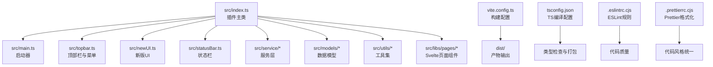
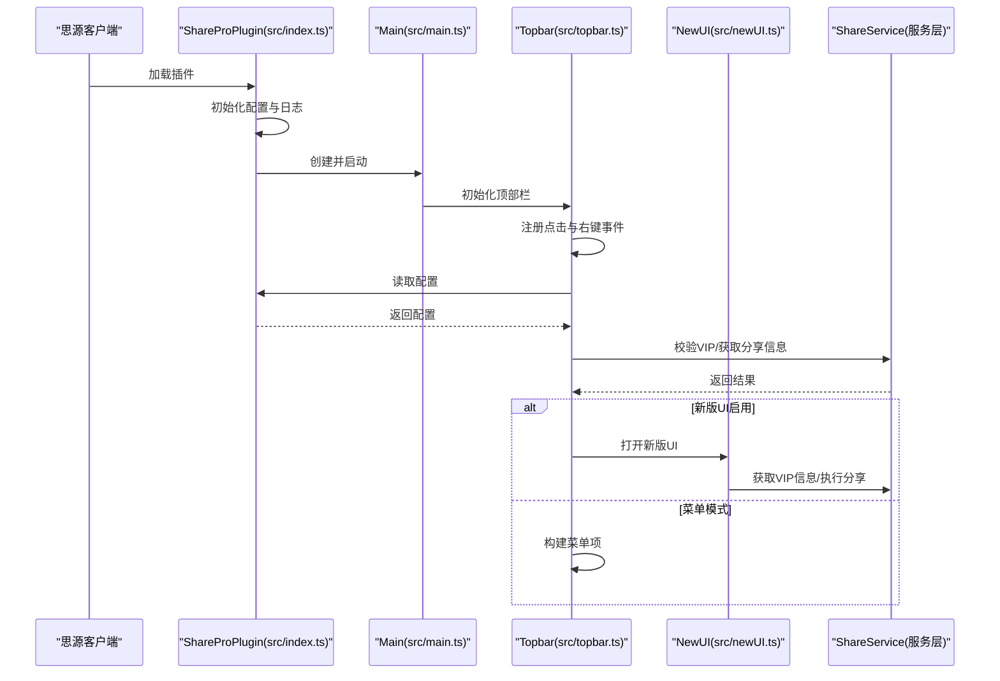
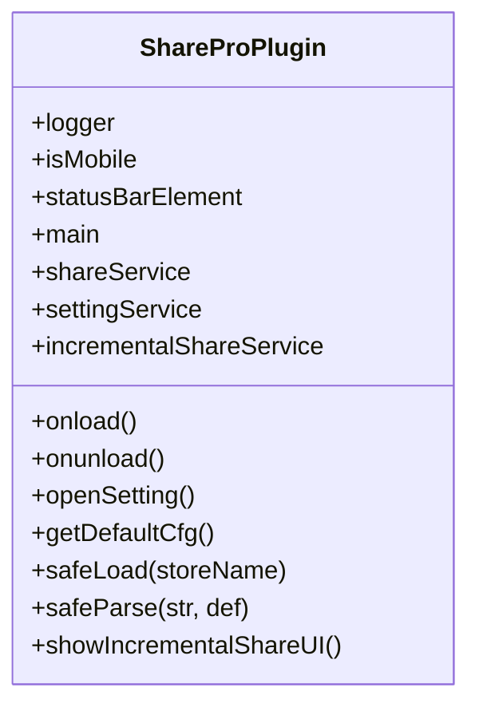
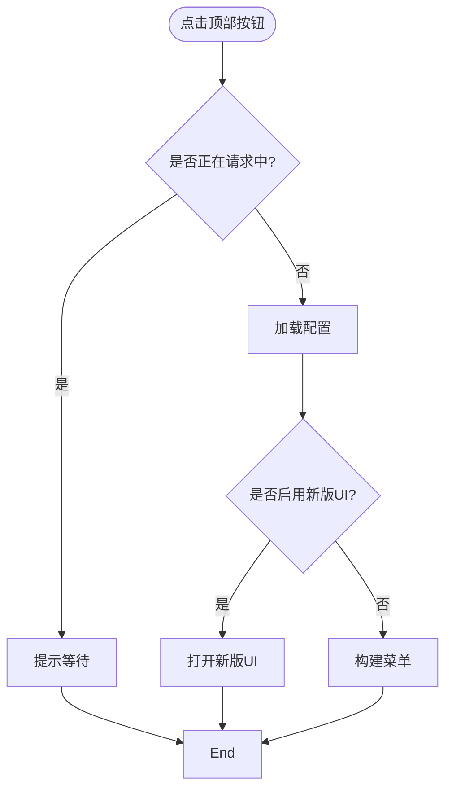
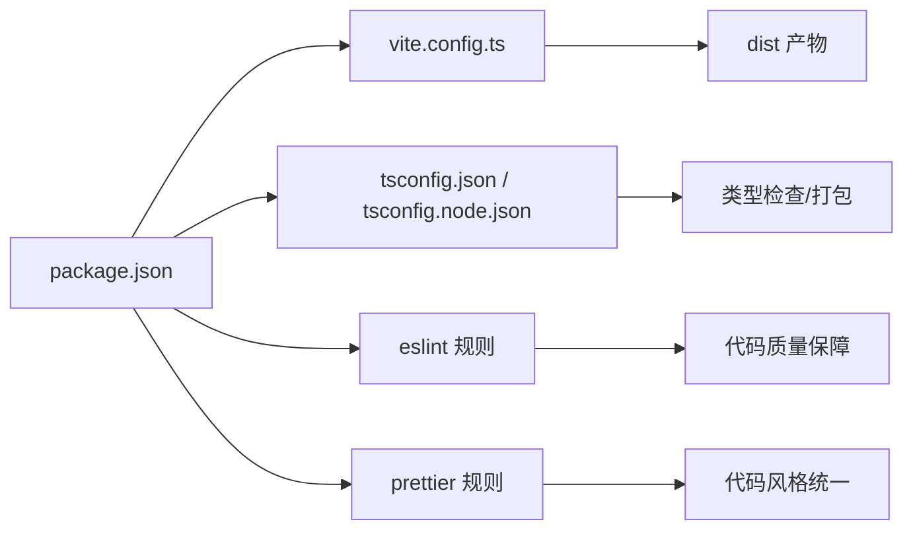

# 开发指南

<cite>
**本文引用的文件**
- [package.json](file://package.json)
- [vite.config.ts](file://vite.config.ts)
- [tsconfig.json](file://tsconfig.json)
- [tsconfig.node.json](file://tsconfig.node.json)
- [svelte.config.js](file://svelte.config.js)
- [.eslintrc.cjs](file://.eslintrc.cjs)
- [.prettierrc.cjs](file://.prettierrc.cjs)
- [plugin.json](file://plugin.json)
- [src/index.ts](file://src/index.ts)
- [src/main.ts](file://src/main.ts)
- [src/topbar.ts](file://src/topbar.ts)
- [src/newUI.ts](file://src/newUI.ts)
- [src/statusBar.ts](file://src/statusBar.ts)
- [scripts/README.md](file://scripts/README.md)
</cite>

## 目录
1. [简介](#简介)
2. [项目结构](#项目结构)
3. [核心组件](#核心组件)
4. [架构总览](#架构总览)
5. [详细组件分析](#详细组件分析)
6. [依赖分析](#依赖分析)
7. [性能考虑](#性能考虑)
8. [故障排查指南](#故障排查指南)
9. [结论](#结论)
10. [附录](#附录)

## 简介
本指南面向“思源笔记分享专业版”（share-pro）的开发者与贡献者，提供从环境搭建、依赖安装、构建配置、开发脚本到调试、测试与性能优化的全流程说明；同时涵盖代码规范、TypeScript 规范、Svelte 组件规范与命名约定，并给出 IDE 配置建议、贡献流程与发布流程要点，以及持续集成与持续部署的配置思路。

## 项目结构
该项目是一个基于 Vite + Svelte 的思源笔记插件，采用模块化组织方式，核心入口位于 src/index.ts，UI 交互通过顶部栏与菜单实现，服务层负责与后端接口通信，工具与模型分别承担通用能力与数据结构定义。

图表来源
- [src/index.ts:1-178](file://src/index.ts#L1-L178)
- [src/main.ts:1-34](file://src/main.ts#L1-L34)
- [src/topbar.ts:1-297](file://src/topbar.ts#L1-L297)
- [src/newUI.ts:1-233](file://src/newUI.ts#L1-L233)
- [src/statusBar.ts:1-32](file://src/statusBar.ts#L1-L32)
- [vite.config.ts:1-120](file://vite.config.ts#L1-L120)
- [tsconfig.json:1-53](file://tsconfig.json#L1-L53)
- [.eslintrc.cjs:1-46](file://.eslintrc.cjs#L1-L46)
- [.prettierrc.cjs:1-32](file://.prettierrc.cjs#L1-L32)

章节来源
- [src/index.ts:1-178](file://src/index.ts#L1-L178)
- [vite.config.ts:1-120](file://vite.config.ts#L1-L120)
- [tsconfig.json:1-53](file://tsconfig.json#L1-L53)

## 核心组件
- 插件主类：负责加载配置、初始化服务与 UI、对外暴露设置与增量分享入口。
- 启动器：负责初始化顶部栏与状态栏。
- 顶部栏与菜单：提供分享、取消分享、重新分享、查看文章、增量分享、设置等操作。
- 新版UI：在满足条件时优先展示新版交互，否则回退菜单模式。
- 服务层：封装与后端服务的交互逻辑，如 VIP 校验、分享创建与取消、历史记录等。
- 工具与模型：提供通用工具函数与数据模型定义。

章节来源
- [src/index.ts:33-177](file://src/index.ts#L33-L177)
- [src/main.ts:12-33](file://src/main.ts#L12-L33)
- [src/topbar.ts:26-296](file://src/topbar.ts#L26-L296)
- [src/newUI.ts:35-232](file://src/newUI.ts#L35-L232)

## 架构总览
下图展示了插件从加载到用户交互的关键流程，包括配置加载、VIP 校验、UI 渲染与服务调用。

图表来源
- [src/index.ts:61-95](file://src/index.ts#L61-L95)
- [src/main.ts:21-23](file://src/main.ts#L21-L23)
- [src/topbar.ts:41-98](file://src/topbar.ts#L41-L98)
- [src/newUI.ts:53-122](file://src/newUI.ts#L53-L122)

## 详细组件分析

### 插件主类（ShareProPlugin）
- 职责：加载与保存配置、初始化服务与 UI、对外暴露设置与增量分享入口。
- 关键点：
  - 配置安全加载与默认值处理。
  - 开发模式下的服务端点切换。
  - 对外方法：打开设置、显示增量分享 UI。

图表来源
- [src/index.ts:33-177](file://src/index.ts#L33-L177)

章节来源
- [src/index.ts:61-177](file://src/index.ts#L61-L177)

### 启动器（Main）
- 职责：创建顶部栏实例并启动。
- 关键点：构造函数注入插件实例，启动时初始化顶部栏。

章节来源
- [src/main.ts:12-33](file://src/main.ts#L12-L33)

### 顶部栏与菜单（Topbar）
- 职责：注册顶部按钮与右键菜单，根据配置与VIP状态动态展示菜单项，支持增量分享与设置入口。
- 关键点：
  - 防重复点击锁机制。
  - 支持菜单模式与新版UI模式切换。
  - 增量分享弹窗与对话框宽度适配。

图表来源
- [src/topbar.ts:41-98](file://src/topbar.ts#L41-L98)

章节来源
- [src/topbar.ts:41-296](file://src/topbar.ts#L41-L296)

### 新版UI（NewUI）
- 职责：在满足VIP条件时挂载新版UI，否则引导至设置或提示获取许可证。
- 关键点：菜单项挂载、位置计算、与服务层交互。

章节来源
- [src/newUI.ts:35-232](file://src/newUI.ts#L35-L232)

### 状态栏（statusBar）
- 职责：在状态栏添加可点击元素，更新状态文本。
- 关键点：移动端兼容性处理与空值保护。

章节来源
- [src/statusBar.ts:12-31](file://src/statusBar.ts#L12-L31)

### 服务层与工具
- 服务层：封装与后端交互，如 VIP 校验、分享创建/取消、历史记录等。
- 工具与模型：提供页面 ID 获取、消息提示、SVG 图标、进度管理等通用能力。

章节来源
- [src/topbar.ts:117-152](file://src/topbar.ts#L117-L152)
- [src/newUI.ts:63-121](file://src/newUI.ts#L63-L121)

## 依赖分析
- 包管理器：pnpm（版本在 package.json 中声明）。
- 构建工具：Vite（插件化配置，Svelte 编译，静态资源复制，开发热更新）。
- 类型系统：TypeScript（双 tsconfig，分别用于应用与构建配置）。
- 代码质量：ESLint（TypeScript、Svelte、Prettier 集成），Prettier（Svelte 插件与格式化规则）。
- 运行时依赖：Svelte 4、siyuan 插件运行时、zhi-* 生态库、虚拟列表等。

图表来源
- [package.json:1-54](file://package.json#L1-L54)
- [vite.config.ts:16-119](file://vite.config.ts#L16-L119)
- [tsconfig.json:1-53](file://tsconfig.json#L1-L53)
- [tsconfig.node.json:1-12](file://tsconfig.node.json#L1-L12)
- [.eslintrc.cjs:1-46](file://.eslintrc.cjs#L1-L46)
- [.prettierrc.cjs:26-31](file://.prettierrc.cjs#L26-L31)

章节来源
- [package.json:10-21](file://package.json#L10-L21)
- [vite.config.ts:16-119](file://vite.config.ts#L16-L119)
- [tsconfig.json:1-53](file://tsconfig.json#L1-L53)
- [tsconfig.node.json:1-12](file://tsconfig.node.json#L1-L12)
- [.eslintrc.cjs:1-46](file://.eslintrc.cjs#L1-L46)
- [.prettierrc.cjs:26-31](file://.prettierrc.cjs#L26-L31)

## 性能考虑
- 构建优化
  - 生产模式启用压缩，开发模式关闭压缩便于调试。
  - 外部化 siyuan 运行时，避免打包体积膨胀。
  - 静态资源复制与样式文件名控制，减少缓存碎片。
- 运行时优化
  - 顶部栏与菜单的互斥锁，避免重复请求。
  - 对移动端与桌面端的尺寸与布局差异化处理。
- 类型与校验
  - 双 tsconfig 分离应用与构建配置，提升类型检查效率。
  - ESLint 与 Prettier 规则减少潜在性能隐患（如过度格式化、未使用变量等）。

章节来源
- [vite.config.ts:64-118](file://vite.config.ts#L64-L118)
- [src/topbar.ts:51-76](file://src/topbar.ts#L51-L76)

## 故障排查指南
- 构建与运行
  - 开发模式与生产模式差异：确认 isWatch 条件与 define 变量。
  - 热更新与静态资源监听：检查 viteStaticCopy 与 watch-external 插件。
- 配置与环境
  - 配置加载失败回退默认值：确保 safeLoad 与 getDefaultCfg 正常工作。
  - 开发模式服务端点切换：确认 isDev 与服务端点映射。
- UI 与交互
  - 顶部栏点击无响应：检查互斥锁与异常捕获。
  - 新版UI未显示：确认 VIP 校验与菜单挂载逻辑。
- 代码质量
  - ESLint/Prettier 报错：按规则调整或忽略特定场景（已配置部分规则放宽）。

章节来源
- [vite.config.ts:13-118](file://vite.config.ts#L13-L118)
- [src/index.ts:103-169](file://src/index.ts#L103-L169)
- [src/topbar.ts:51-98](file://src/topbar.ts#L51-L98)
- [src/newUI.ts:63-122](file://src/newUI.ts#L63-L122)
- [.eslintrc.cjs:25-44](file://.eslintrc.cjs#L25-L44)
- [.prettierrc.cjs:26-31](file://.prettierrc.cjs#L26-L31)

## 结论
本指南提供了从环境搭建到发布运维的完整开发路径，结合现有配置与代码结构，开发者可以快速上手并保持高质量交付。建议在团队内统一遵循本文档的规范与流程，持续完善 CI/CD 与测试策略。

## 附录

### 开发环境搭建与依赖安装
- 使用包管理器：pnpm（版本在 package.json 中声明）。
- 安装依赖：在项目根目录执行安装命令。
- Python 脚本依赖：参考 scripts/README.md 安装所需 Python 依赖。

章节来源
- [package.json:52-53](file://package.json#L52-L53)
- [scripts/README.md:1-7](file://scripts/README.md#L1-L7)

### 构建配置与开发脚本
- 开发服务器：vite（serve）、实时构建：dev（watch）。
- 生产构建：build。
- 预览：start。
- 测试：vitest（test）。
- 版本同步与变更日志：syncVersion、parseChangelog。
- 打包：package。

章节来源
- [package.json:10-21](file://package.json#L10-L21)
- [vite.config.ts:16-119](file://vite.config.ts#L16-L119)

### 代码规范与格式化
- TypeScript 规范
  - 目标与模块：ESNext，允许 JS 与 Svelte 文件类型检查。
  - 严格性：关闭严格模式，放宽未使用变量/参数等规则。
  - 类型声明：内置 node、vite/client、svelte。
- Svelte 组件规范
  - 自定义元素模式，预处理器使用 vitePreprocess。
  - 屏蔽部分 a11y 警告，保留其他警告。
- ESLint 规则
  - 扩展：eslint:recommended、@typescript-eslint、svelte、turbo、prettier。
  - 针对 .svelte 文件使用 svelte-eslint-parser 并解析为 TypeScript。
  - 部分规则放宽，Prettier 规则以错误级别呈现。
- Prettier 规则
  - 分号关闭、单引号关闭、打印宽度 120、Svelte 插件。

章节来源
- [tsconfig.json:2-38](file://tsconfig.json#L2-L38)
- [svelte.config.js:1-15](file://svelte.config.js#L1-L15)
- [.eslintrc.cjs:1-46](file://.eslintrc.cjs#L1-L46)
- [.prettierrc.cjs:26-31](file://.prettierrc.cjs#L26-L31)

### 命名约定
- 文件与模块：采用小驼峰命名，页面组件以 .svelte 结尾。
- 类与接口：大驼峰命名，如 ShareProPlugin、ShareService。
- 常量：全大写下划线，如 SHARE_PRO_STORE_NAME。
- 变量：小驼峰，如 shareService、settingService。

章节来源
- [src/index.ts:15-28](file://src/index.ts#L15-L28)
- [src/Constants.ts:1-200](file://src/Constants.ts#L1-L200)

### 调试技巧
- 开发模式：启用 isWatch，关闭压缩，开启热更新与静态资源监听。
- 日志：使用 simpleLogger 记录关键流程与错误。
- 断点：在服务层与 UI 交互处设置断点，观察 VIP 校验与配置加载。

章节来源
- [vite.config.ts:13-118](file://vite.config.ts#L13-L118)
- [src/index.ts:45-46](file://src/index.ts#L45-L46)

### 测试策略与性能测试
- 单元测试：使用 vitest（test 脚本），建议覆盖服务层与工具函数。
- 集成测试：模拟 UI 交互与配置加载，验证菜单与新版UI行为。
- 性能测试：关注构建时间、打包体积与运行时渲染性能，结合 ESLint 与 Prettier 规则减少冗余。

章节来源
- [package.json:16-16](file://package.json#L16-L16)

### 贡献指南、代码审查与发布流程
- 提交前检查：确保通过 ESLint 与 Prettier 校验。
- 分支策略：建议采用 feature/fix/release 分支管理。
- 代码审查：至少一名维护者审查，关注架构一致性与性能影响。
- 发布流程：版本同步与变更日志脚本（syncVersion、parseChangelog），最终打包（package）。

章节来源
- [package.json:17-20](file://package.json#L17-L20)

### IDE 配置建议与插件推荐
- VS Code 推荐插件
  - ESLint：实时语法与风格检查。
  - Prettier：统一格式化。
  - Svelte for VS Code：Svelte 语法高亮与智能感知。
  - TypeScript Importer：自动导入类型。
- 插件推荐
  - 插件运行时：siyuan（由依赖声明提供）。
  - Svelte 生态：@sveltejs/vite-plugin-svelte、svelte。

章节来源
- [.eslintrc.cjs:1-46](file://.eslintrc.cjs#L1-L46)
- [.prettierrc.cjs:26-31](file://.prettierrc.cjs#L26-L31)
- [package.json:22-51](file://package.json#L22-L51)

### 常见问题与最佳实践
- 问题：构建后样式文件名不一致
  - 解决：在 vite.config.ts 中通过 output.assetFileNames 控制样式文件名为 index.css。
- 问题：开发模式下配置未更新
  - 解决：确认 isDev 与服务端点映射，initCfg 中的更新逻辑。
- 最佳实践：保持服务层与 UI 层解耦，使用互斥锁避免重复请求，合理拆分工具函数与模型。

章节来源
- [vite.config.ts:108-116](file://vite.config.ts#L108-L116)
- [src/index.ts:150-169](file://src/index.ts#L150-L169)
- [src/topbar.ts:51-76](file://src/topbar.ts#L51-L76)

### 持续集成与持续部署（CI/CD）配置思路
- 触发条件：push 到主分支或标签推送。
- 步骤建议：
  - 安装依赖（pnpm）。
  - 类型检查与 ESLint/Prettier 校验。
  - 单元测试（vitest）。
  - 构建与打包（vite build）。
  - 生成变更日志与版本同步。
  - 上传制品（可选）。
- 注意事项：确保 CI 环境变量与本地一致，避免因权限或网络导致失败。

章节来源
- [package.json:10-21](file://package.json#L10-L21)
- [vite.config.ts:16-119](file://vite.config.ts#L16-L119)