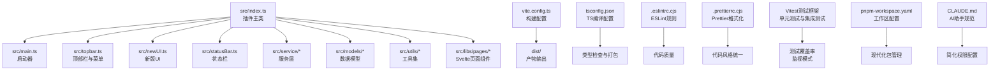
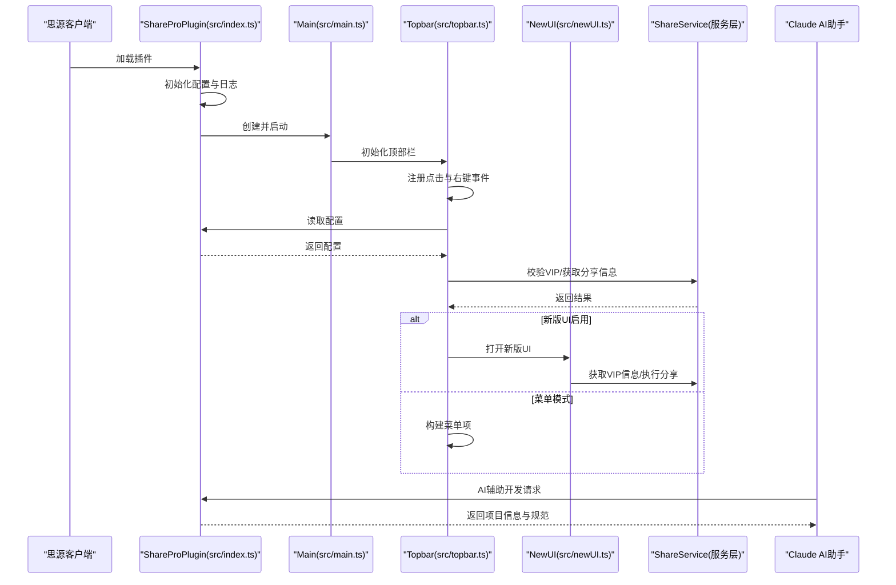
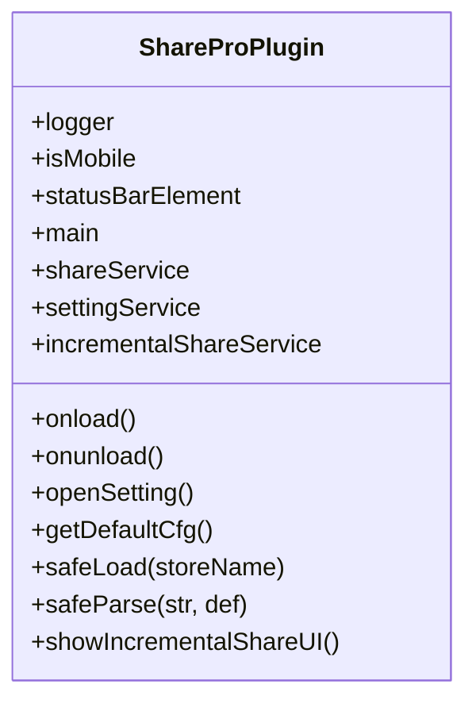
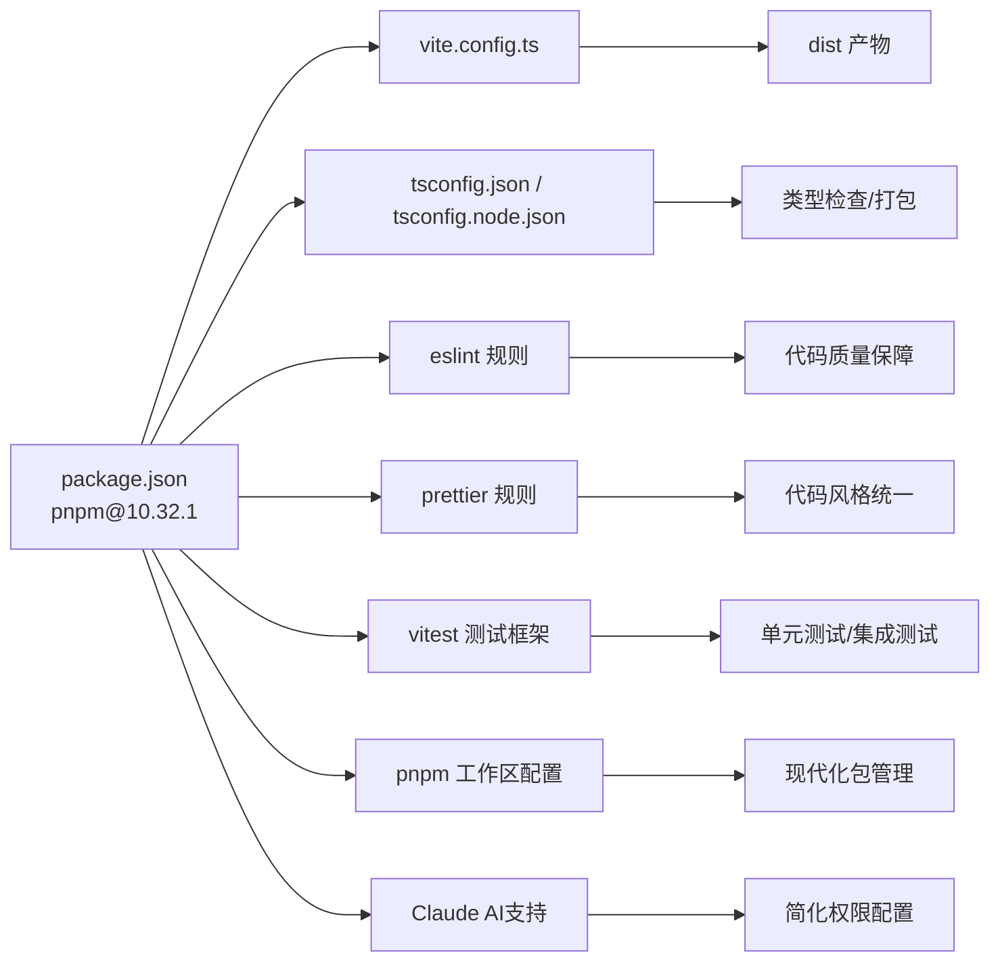

# 开发指南

<cite>
**本文引用的文件**
- [package.json](file://package.json)
- [pnpm-workspace.yaml](file://pnpm-workspace.yaml)
- [vite.config.ts](file://vite.config.ts)
- [tsconfig.json](file://tsconfig.json)
- [tsconfig.node.json](file://tsconfig.node.json)
- [svelte.config.js](file://svelte.config.js)
- [.eslintrc.cjs](file://.eslintrc.cjs)
- [.prettierrc.cjs](file://.prettierrc.cjs)
- [plugin.json](file://plugin.json)
- [src/index.ts](file://src/index.ts)
- [src/main.ts](file://src/main.ts)
- [src/topbar.ts](file://src/topbar.ts)
- [src/newUI.ts](file://src/newUI.ts)
- [src/statusBar.ts](file://src/statusBar.ts)
- [scripts/README.md](file://scripts/README.md)
- [openspec/project.md](file://openspec/project.md)
- [TESTING_CHECKLIST.md](file://TESTING_CHECKLIST.md)
- [src/service/IncrementalShareService.ts](file://src/service/IncrementalShareService.ts)
- [src/composables/useDataTable.ts](file://src/composables/useDataTable.ts)
- [src/utils/progress/ProgressManager.ts](file://src/utils/progress/ProgressManager.ts)
- [CLAUDE.md](file://CLAUDE.md)
- [.claude/settings.local.json](file://.claude/settings.local.json)
</cite>

## 更新摘要
**所做更改**
- 更新包管理器版本：pnpm 从 9.9.0 升级到 10.32.1，提升构建性能和依赖管理效率
- 简化 Claude AI 权限配置：移除复杂的权限规则，采用更直接的配置方式
- 更新开发环境工具链现代化：保持现有技术栈稳定的同时引入更高效的包管理方案
- 更新依赖版本信息：TypeScript 6.0.2、Svelte 4.2.20、Vite 4.5.14、Vitest 4.1.1
- 更新 pnpm 工作区配置说明：增强 esbuild 构建支持和包管理器版本锁定

## 目录
1. [简介](#简介)
2. [项目结构](#项目结构)
3. [核心组件](#核心组件)
4. [架构总览](#架构总览)
5. [详细组件分析](#详细组件分析)
6. [依赖分析](#依赖分析)
7. [性能考虑](#性能考虑)
8. [故障排查指南](#故障排查指南)
9. [结论](#结论)
10. [附录](#附录)

## 简介
本指南面向"思源笔记分享专业版"（share-pro）的开发者与贡献者，提供从环境搭建、依赖安装、构建配置、开发脚本到调试、测试与性能优化的全流程说明；同时涵盖代码规范、TypeScript 规范、Svelte 组件规范与命名约定，并给出 IDE 配置建议、贡献流程与发布流程要点，以及持续集成与持续部署的配置思路。

**更新** 本版本反映了最新的开发环境现代化升级：pnpm 从 9.9.0 升级到 10.32.1，Claude AI 权限配置简化，以及保持现有技术栈的稳定性（TypeScript 6.0.2、Svelte 4.2.20、Vite 4.5.14、Vitest 4.1.1）。

## 项目结构
该项目是一个基于 Vite + Svelte 的思源笔记插件，采用模块化组织方式，核心入口位于 src/index.ts，UI 交互通过顶部栏与菜单实现，服务层负责与后端接口通信，工具与模型分别承担通用能力与数据结构定义。



**图表来源**
- [src/index.ts:1-178](file://src/index.ts#L1-L178)
- [src/main.ts:1-34](file://src/main.ts#L1-L34)
- [src/topbar.ts:1-297](file://src/topbar.ts#L1-L297)
- [src/newUI.ts:1-233](file://src/newUI.ts#L1-L233)
- [src/statusBar.ts:1-32](file://src/statusBar.ts#L1-L32)
- [vite.config.ts:1-127](file://vite.config.ts#L1-L127)
- [tsconfig.json:1-53](file://tsconfig.json#L1-L53)
- [.eslintrc.cjs:1-46](file://.eslintrc.cjs#L1-L46)
- [.prettierrc.cjs:1-32](file://.prettierrc.cjs#L1-L32)
- [pnpm-workspace.yaml:1-3](file://pnpm-workspace.yaml#L1-L3)
- [CLAUDE.md:1-18](file://CLAUDE.md#L1-L18)

**章节来源**
- [src/index.ts:1-178](file://src/index.ts#L1-L178)
- [vite.config.ts:1-127](file://vite.config.ts#L1-L127)
- [tsconfig.json:1-53](file://tsconfig.json#L1-L53)
- [pnpm-workspace.yaml:1-3](file://pnpm-workspace.yaml#L1-L3)
- [CLAUDE.md:1-18](file://CLAUDE.md#L1-L18)

## 核心组件
- 插件主类：负责加载配置、初始化服务与 UI、对外暴露设置与增量分享入口。
- 启动器：负责初始化顶部栏与状态栏。
- 顶部栏与菜单：提供分享、取消分享、重新分享、查看文章、增量分享、设置等操作。
- 新版UI：在满足条件时优先展示新版交互，否则回退菜单模式。
- 服务层：封装与后端服务的交互逻辑，如 VIP 校验、分享创建与取消、历史记录等。
- 工具与模型：提供通用工具函数与数据模型定义。
- **AI助手支持**：通过 CLAUDE.md 和 .claude 目录提供 AI 助手协作规范。

**更新** 新增 AI 助手支持模块，简化开发协作流程。

**章节来源**
- [src/index.ts:33-177](file://src/index.ts#L33-L177)
- [src/main.ts:12-33](file://src/main.ts#L12-L33)
- [src/topbar.ts:26-296](file://src/topbar.ts#L26-L296)
- [src/newUI.ts:35-232](file://src/newUI.ts#L35-L232)
- [CLAUDE.md:1-18](file://CLAUDE.md#L1-L18)

## 架构总览
下图展示了插件从加载到用户交互的关键流程，包括配置加载、VIP 校验、UI 渲染与服务调用，以及 AI 助手协作流程。



**图表来源**
- [src/index.ts:61-95](file://src/index.ts#L61-L95)
- [src/main.ts:21-23](file://src/main.ts#L21-L23)
- [src/topbar.ts:41-98](file://src/topbar.ts#L41-L98)
- [src/newUI.ts:53-122](file://src/newUI.ts#L53-L122)
- [CLAUDE.md:6-15](file://CLAUDE.md#L6-L15)

## 详细组件分析

### 插件主类（ShareProPlugin）
- 职责：加载与保存配置、初始化服务与 UI、对外暴露设置与增量分享入口。
- 关键点：
  - 配置安全加载与默认值处理。
  - 开发模式下的服务端点切换。
  - 对外方法：打开设置、显示增量分享 UI。



**图表来源**
- [src/index.ts:33-177](file://src/index.ts#L33-L177)

**章节来源**
- [src/index.ts:61-177](file://src/index.ts#L61-L177)

### 启动器（Main）
- 职责：创建顶部栏实例并启动。
- 关键点：构造函数注入插件实例，启动时初始化顶部栏。

**章节来源**
- [src/main.ts:12-33](file://src/main.ts#L12-L33)

### 顶部栏与菜单（Topbar）
- 职责：注册顶部按钮与右键菜单，根据配置与VIP状态动态展示菜单项，支持增量分享与设置入口。
- 关键点：
  - 防重复点击锁机制。
  - 支持菜单模式与新版UI模式切换。
  - 增量分享弹窗与对话框宽度适配。


**图表来源**
- [src/topbar.ts:41-98](file://src/topbar.ts#L41-L98)

**章节来源**
- [src/topbar.ts:41-296](file://src/topbar.ts#L41-L296)

### 新版UI（NewUI）
- 职责：在满足VIP条件时挂载新版UI，否则引导至设置或提示获取许可证。
- 关键点：菜单项挂载、位置计算、与服务层交互。

**章节来源**
- [src/newUI.ts:35-232](file://src/newUI.ts#L35-L232)

### 状态栏（statusBar）
- 职责：在状态栏添加可点击元素，更新状态文本。
- 关键点：移动端兼容性处理与空值保护。

**章节来源**
- [src/statusBar.ts:12-31](file://src/statusBar.ts#L12-L31)

### 服务层与工具
- 服务层：封装与后端交互，如 VIP 校验、分享创建/取消、历史记录等。
- 工具与模型：提供页面 ID 获取、消息提示、SVG 图标、进度管理等通用能力。

**章节来源**
- [src/topbar.ts:117-152](file://src/topbar.ts#L117-L152)
- [src/newUI.ts:63-121](file://src/newUI.ts#L63-L121)

### 增量分享服务（IncrementalShareService）
- 职责：实现增量文档检测、批量分享、队列管理、重试机制等功能。
- 关键点：
  - 5分钟缓存机制，避免重复检测。
  - 并发控制，最多5个同时执行的请求。
  - 智能重试，区分网络错误和服务器错误。
  - 支持暂停/继续、断点续传的队列管理。

**章节来源**
- [src/service/IncrementalShareService.ts:1-200](file://src/service/IncrementalShareService.ts#L1-L200)

### 数据表格工具（useDataTable）
- 职责：处理思源笔记中的数据表格视图，支持多视图并发获取。
- 关键点：使用 Cheerio 解析 DOM，支持默认视图和备用视图的智能选择。

**章节来源**
- [src/composables/useDataTable.ts:1-101](file://src/composables/useDataTable.ts#L1-L101)

### 进度管理器（ProgressManager）
- 职责：管理批量操作的进度跟踪，包括文档处理和资源处理。
- 关键点：支持资源事件监听、错误收集、批量完成检测。

**章节来源**
- [src/utils/progress/ProgressManager.ts:1-200](file://src/utils/progress/ProgressManager.ts#L1-L200)

### AI助手支持（Claude AI）
- 职责：提供 AI 助手协作规范，简化开发流程。
- 关键点：
  - OpenSpec 指南集成。
  - 权限配置简化。
  - 变更提案流程支持。

**更新** 新增 Claude AI 助手支持模块，提供更高效的开发协作体验。

**章节来源**
- [CLAUDE.md:1-18](file://CLAUDE.md#L1-L18)
- [.claude/settings.local.json:1-15](file://.claude/settings.local.json#L1-L15)

## 依赖分析
- **包管理器**：pnpm 10.32.1（版本锁定，提升构建性能和依赖管理效率）。
- 构建工具：Vite 4.5.14（插件化配置，Svelte 编译，静态资源复制，开发热更新）。
- 类型系统：TypeScript 6.0.2（双 tsconfig，分别用于应用与构建配置）。
- 代码质量：ESLint（TypeScript、Svelte、Prettier 集成），Prettier（Svelte 插件与格式化规则）。
- 运行时依赖：Svelte 4.2.20、siyuan 插件运行时、zhi-* 生态库、虚拟列表等。
- **测试框架**：Vitest 4.1.1（单元测试与集成测试），支持监视模式开发。

**更新** 包管理器升级到 pnpm 10.32.1，提供更好的性能和依赖管理能力。



**图表来源**
- [package.json:1-54](file://package.json#L1-L54)
- [vite.config.ts:16-126](file://vite.config.ts#L16-L126)
- [tsconfig.json:1-53](file://tsconfig.json#L1-L53)
- [tsconfig.node.json:1-12](file://tsconfig.node.json#L1-L12)
- [.eslintrc.cjs:1-46](file://.eslintrc.cjs#L1-L46)
- [.prettierrc.cjs:26-31](file://.prettierrc.cjs#L26-L31)
- [pnpm-workspace.yaml:1-3](file://pnpm-workspace.yaml#L1-L3)
- [CLAUDE.md:1-18](file://CLAUDE.md#L1-L18)

**章节来源**
- [package.json:10-21](file://package.json#L10-L21)
- [vite.config.ts:16-126](file://vite.config.ts#L16-L126)
- [tsconfig.json:1-53](file://tsconfig.json#L1-L53)
- [tsconfig.node.json:1-12](file://tsconfig.node.json#L1-L12)
- [.eslintrc.cjs:1-46](file://.eslintrc.cjs#L1-L46)
- [.prettierrc.cjs:26-31](file://.prettierrc.cjs#L26-L31)
- [pnpm-workspace.yaml:1-3](file://pnpm-workspace.yaml#L1-L3)
- [CLAUDE.md:1-18](file://CLAUDE.md#L1-L18)

## 性能考虑
- **构建优化**
  - 生产模式启用压缩，开发模式关闭压缩便于调试。
  - 外部化 siyuan 运行时，避免打包体积膨胀。
  - 静态资源复制与样式文件名控制，减少缓存碎片。
  - **pnpm 10.32.1 性能提升**：利用新版本的并行安装和缓存机制，显著提升依赖安装速度。
- 运行时优化
  - 顶部栏与菜单的互斥锁，避免重复请求。
  - 对移动端与桌面端的尺寸与布局差异化处理。
  - **增量检测缓存**：5分钟内复用检测结果，显著提升性能。
- 类型与校验
  - 双 tsconfig 分离应用与构建配置，提升类型检查效率。
  - ESLint 与 Prettier 规则减少潜在性能隐患（如过度格式化、未使用变量等）。
- **测试性能**
  - Vitest 监视模式支持快速反馈，提升开发效率。
  - 测试隔离和模拟机制确保测试性能。

**更新** 新增 pnpm 10.32.1 性能优化说明。

**章节来源**
- [vite.config.ts:64-125](file://vite.config.ts#L64-L125)
- [src/topbar.ts:51-76](file://src/topbar.ts#L51-L76)
- [src/service/IncrementalShareService.ts:108-112](file://src/service/IncrementalShareService.ts#L108-L112)
- [package.json:52](file://package.json#L52)

## 故障排查指南
- **构建与运行**
  - 开发模式与生产模式差异：确认 isWatch 条件与 define 变量。
  - 热更新与静态资源监听：检查 viteStaticCopy 与 watch-external 插件。
- 配置与环境
  - 配置加载失败回退默认值：确保 safeLoad 与 getDefaultCfg 正常工作。
  - 开发模式服务端点切换：确认 isDev 与服务端点映射。
- UI 与交互
  - 顶部栏点击无响应：检查互斥锁与异常捕获。
  - 新版UI未显示：确认 VIP 校验与菜单挂载逻辑。
- 代码质量
  - ESLint/Prettier 报错：按规则调整或忽略特定场景（已配置部分规则放宽）。
- **测试相关**
  - Vitest 测试失败：检查测试环境配置和依赖版本兼容性。
  - 测试覆盖率不足：补充针对增量分享服务的测试用例。
- **包管理相关**
  - **pnpm 10.32.1 升级问题**：检查版本兼容性和缓存清理。
  - 依赖安装失败：确认网络连接和包权限设置。
  - pnpm 工作区配置问题：检查 pnpm-workspace.yaml 配置是否正确。
- **AI助手相关**
  - Claude 权限配置问题：检查 .claude/settings.local.json 配置。
  - OpenSpec 指令未生效：确认 CLAUDE.md 配置正确。
- **版本兼容性问题**
  - TypeScript 6.0.2升级后的类型检查：注意严格模式变化和新版本特性。
  - Svelte 4.2.20降级后的组件兼容性：检查自定义元素模式和生命周期钩子。
  - Vite 4.5.14降级后的插件兼容性：确认插件版本匹配和配置调整。

**更新** 新增 pnpm 10.32.1 升级问题、AI助手相关故障排查和版本兼容性问题。

**章节来源**
- [vite.config.ts:13-126](file://vite.config.ts#L13-L126)
- [src/index.ts:103-169](file://src/index.ts#L103-L169)
- [src/topbar.ts:51-98](file://src/topbar.ts#L51-L98)
- [src/newUI.ts:63-122](file://src/newUI.ts#L63-L122)
- [.eslintrc.cjs:25-44](file://.eslintrc.cjs#L25-L44)
- [.prettierrc.cjs:26-31](file://.prettierrc.cjs#L26-L31)
- [pnpm-workspace.yaml:1-3](file://pnpm-workspace.yaml#L1-L3)
- [CLAUDE.md:1-18](file://CLAUDE.md#L1-L18)
- [.claude/settings.local.json:1-15](file://.claude/settings.local.json#L1-L15)

## 结论
本指南提供了从环境搭建到发布运维的完整开发路径，结合现有配置与代码结构，开发者可以快速上手并保持高质量交付。**最新版本**反映了重要的开发环境现代化升级：pnpm 从 9.9.0 升级到 10.32.1，提供更好的性能和依赖管理能力；Claude AI 权限配置简化，提升开发协作效率；同时保持现有技术栈的稳定性（TypeScript 6.0.2、Svelte 4.2.20、Vite 4.5.14、Vitest 4.1.1）。这些变更提升了开发效率、构建性能和团队协作体验。建议在团队内统一遵循本文档的规范与流程，持续完善 CI/CD 与测试策略。

## 附录

### 开发环境搭建与依赖安装
- **使用包管理器**：pnpm 10.32.1（版本锁定，确保团队环境一致性）。
- 安装依赖：在项目根目录执行安装命令。
- Python 脚本依赖：参考 scripts/README.md 安装所需 Python 依赖。
- **测试依赖**：Vitest 4.1.1 已集成，支持监视模式开发。
- **工作区配置**：pnpm 工作区配置文件 pnpm-workspace.yaml 提供现代化包管理支持。
- **AI助手配置**：通过 CLAUDE.md 和 .claude 目录提供 AI 协作支持。

**更新** 新增 pnpm 10.32.1 版本锁定说明和 AI 助手配置。

**章节来源**
- [package.json:52](file://package.json#L52)
- [scripts/README.md:1-7](file://scripts/README.md#L1-L7)
- [pnpm-workspace.yaml:1-3](file://pnpm-workspace.yaml#L1-L3)
- [CLAUDE.md:1-18](file://CLAUDE.md#L1-L18)

### 构建配置与开发脚本
- 开发服务器：vite（serve）、实时构建：dev（watch）。
- 生产构建：build。
- 预览：start。
- **测试**：vitest（test），支持监视模式 --watch。
- 版本同步与变更日志：syncVersion、parseChangelog。
- 打包：package。
- **AI开发**：OpenSpec 指令支持，简化开发流程。

**更新** 新增 AI 开发支持说明。

**章节来源**
- [package.json:10-21](file://package.json#L10-L21)
- [vite.config.ts:16-126](file://vite.config.ts#L16-L126)
- [CLAUDE.md:6-15](file://CLAUDE.md#L6-L15)

### 代码规范与格式化
- **TypeScript 规范**
  - 目标与模块：ESNext，允许 JS 与 Svelte 文件类型检查。
  - 严格性：关闭严格模式，放宽未使用变量/参数等规则。
  - 类型声明：内置 node、vite/client、svelte。
- **Svelte 组件规范**
  - 自定义元素模式，预处理器使用 vitePreprocess。
  - 屏蔽部分 a11y 警告，保留其他警告。
- **ESLint 规则**
  - 扩展：eslint:recommended、@typescript-eslint、svelte、turbo、prettier。
  - 针对 .svelte 文件使用 svelte-eslint-parser 并解析为 TypeScript。
  - 部分规则放宽，Prettier 规则以错误级别呈现。
- **Prettier 规则**
  - 分号关闭、单引号关闭、打印宽度 120、Svelte 插件。

**章节来源**
- [tsconfig.json:2-38](file://tsconfig.json#L2-L38)
- [svelte.config.js:1-15](file://svelte.config.js#L1-L15)
- [.eslintrc.cjs:1-46](file://.eslintrc.cjs#L1-L46)
- [.prettierrc.cjs:26-31](file://.prettierrc.cjs#L26-L31)

### 命名约定
- 文件与模块：采用小驼峰命名，页面组件以 .svelte 结尾。
- 类与接口：大驼峰命名，如 ShareProPlugin、ShareService。
- 常量：全大写下划线，如 SHARE_PRO_STORE_NAME。
- 变量：小驼峰，如 shareService、settingService。

**章节来源**
- [src/index.ts:15-28](file://src/index.ts#L15-L28)
- [src/Constants.ts:1-200](file://src/Constants.ts#L1-L200)

### 调试技巧
- 开发模式：启用 isWatch，关闭压缩，开启热更新与静态资源监听。
- 日志：使用 simpleLogger 记录关键流程与错误。
- 断点：在服务层与 UI 交互处设置断点，观察 VIP 校验与配置加载。
- **测试调试**：使用 Vitest 监视模式进行实时测试反馈。
- **AI辅助调试**：利用 Claude AI 助手获取开发建议和问题解决方案。

**更新** 新增 AI 辅助调试技巧。

**章节来源**
- [vite.config.ts:13-126](file://vite.config.ts#L13-L126)
- [src/index.ts:45-46](file://src/index.ts#L45-L46)
- [CLAUDE.md:6-15](file://CLAUDE.md#L6-L15)

### 测试策略与性能测试
- **单元测试**：使用 Vitest（test 脚本），重点测试增量分享服务、数据表格工具、进度管理器等核心组件。
- **集成测试**：模拟 UI 交互与配置加载，验证菜单与新版UI行为。
- **性能测试**：关注构建时间、打包体积与运行时渲染性能，结合 ESLint 与 Prettier 规则减少冗余。
- **测试策略**：遵循 openspec/project.md 中的测试约定，测试文件与被测试文件同目录，命名为 .test.ts。

**更新** 详细化的测试策略说明，包括 Vitest 集成和测试约定。

**章节来源**
- [package.json:16](file://package.json#L16)
- [openspec/project.md:36-40](file://openspec/project.md#L36-L40)
- [TESTING_CHECKLIST.md:1-800](file://TESTING_CHECKLIST.md#L1-L800)

### 贡献指南、代码审查与发布流程
- 提交前检查：确保通过 ESLint 与 Prettier 校验。
- 分支策略：建议采用 feature/fix/release 分支管理。
- 代码审查：至少一名维护者审查，关注架构一致性与性能影响。
- 发布流程：版本同步与变更日志脚本（syncVersion、parseChangelog），最终打包（package）。

**章节来源**
- [package.json:17-20](file://package.json#L17-L20)

### IDE 配置建议与插件推荐
- **VS Code 推荐插件**
  - ESLint：实时语法与风格检查。
  - Prettier：统一格式化。
  - Svelte for VS Code：Svelte 语法高亮与智能感知。
  - TypeScript Importer：自动导入类型。
  - **Vitest Snippets**：Vitest 测试代码片段。
  - **Claude AI**：AI 助手协作插件。
- 插件推荐
  - 插件运行时：siyuan（由依赖声明提供）。
  - Svelte 生态：@sveltejs/vite-plugin-svelte、svelte 4.2.20。
  - **测试生态**：Vitest 4.1.1 相关插件和扩展。

**更新** 新增 Claude AI 相关 IDE 插件推荐。

**章节来源**
- [.eslintrc.cjs:1-46](file://.eslintrc.cjs#L1-L46)
- [.prettierrc.cjs:26-31](file://.prettierrc.cjs#L26-L31)
- [package.json:22-51](file://package.json#L22-L51)
- [CLAUDE.md:1-18](file://CLAUDE.md#L1-L18)

### 常见问题与最佳实践
- 问题：构建后样式文件名不一致
  - 解决：在 vite.config.ts 中通过 output.assetFileNames 控制样式文件名为 index.css。
- 问题：开发模式下配置未更新
  - 解决：确认 isDev 与服务端点映射，initCfg 中的更新逻辑。
- 问题：**测试环境配置问题**
  - 解决：确保 Vitest 配置正确，依赖版本兼容，使用监视模式进行实时反馈。
- 问题：**pnpm 10.32.1 升级问题**
  - 解决：清理缓存和 node_modules，重新安装依赖，检查版本兼容性。
- 问题：**AI助手权限问题**
  - 解决：检查 .claude/settings.local.json 配置，确认权限设置正确。
- **版本兼容性问题**
  - TypeScript 6.0.2：注意新的类型检查规则和语言特性支持。
  - Svelte 4.2.20：确认自定义元素模式和生命周期钩子的兼容性。
  - Vite 4.5.14：检查插件版本兼容性和配置迁移。
- 最佳实践：保持服务层与 UI 层解耦，使用互斥锁避免重复请求，合理拆分工具函数与模型，**为每个核心功能编写对应的测试用例**，**利用 AI 助手提升开发效率**。

**更新** 新增 pnpm 10.32.1 升级问题、AI助手权限问题和相关最佳实践。

**章节来源**
- [vite.config.ts:108-123](file://vite.config.ts#L108-L123)
- [src/index.ts:150-169](file://src/index.ts#L150-L169)
- [src/topbar.ts:51-76](file://src/topbar.ts#L51-L76)
- [pnpm-workspace.yaml:1-3](file://pnpm-workspace.yaml#L1-L3)
- [CLAUDE.md:1-18](file://CLAUDE.md#L1-L18)
- [.claude/settings.local.json:1-15](file://.claude/settings.local.json#L1-L15)

### 持续集成与持续部署（CI/CD）配置思路
- **触发条件**：push 到主分支或标签推送。
- 步骤建议：
  - 安装依赖（pnpm 10.32.1）。
  - 类型检查与 ESLint/Prettier 校验。
  - **单元测试与集成测试（vitest 4.1.1）**。
  - 构建与打包（vite build）。
  - 生成变更日志与版本同步。
  - 上传制品（可选）。
  - **AI文档更新**：利用 Claude AI 生成或更新技术文档。
- 注意事项：确保 CI 环境变量与本地一致，避免因权限或网络导致失败，**测试阶段使用 Vitest 进行自动化测试**，**使用 AI 助手优化开发流程**。

**更新** 在 CI/CD 流程中增加 AI 助手支持和 pnpm 10.32.1 版本兼容性检查。

**章节来源**
- [package.json:10-21](file://package.json#L10-L21)
- [vite.config.ts:16-126](file://vite.config.ts#L16-L126)
- [CLAUDE.md:1-18](file://CLAUDE.md#L1-L18)

### 测试配置与最佳实践
- **测试框架**：Vitest 4.1.1，支持监视模式开发。
- **测试文件组织**：遵循 openspec/project.md 约定，测试文件与被测试文件同目录，命名为 .test.ts。
- **测试覆盖范围**：
  - 增量分享服务：并发控制、重试机制、队列管理
  - 数据表格工具：多视图处理、错误处理
  - 进度管理器：批量操作跟踪、资源处理
- **测试策略**：
  - 单元测试：隔离核心逻辑，使用模拟对象
  - 集成测试：测试组件间的协作
  - 性能测试：验证缓存机制和并发控制效果

**更新** 新增详细的测试配置和最佳实践指导。

**章节来源**
- [openspec/project.md:36-40](file://openspec/project.md#L36-L40)
- [TESTING_CHECKLIST.md:1-800](file://TESTING_CHECKLIST.md#L1-L800)
- [src/service/IncrementalShareService.ts:1-200](file://src/service/IncrementalShareService.ts#L1-L200)
- [src/composables/useDataTable.ts:1-101](file://src/composables/useDataTable.ts#L1-L101)
- [src/utils/progress/ProgressManager.ts:1-200](file://src/utils/progress/ProgressManager.ts#L1-L200)

### pnpm 工作区配置与现代开发实践

#### pnpm 工作区配置
项目使用 pnpm 工作区来管理包依赖和构建流程。当前的 pnpm-workspace.yaml 配置非常简洁，主要启用了 esbuild 构建支持：

```yaml
allowBuilds:
  esbuild: true
```

这个配置的作用：
- 启用 esbuild 构建支持，提高构建速度
- 适用于现代 JavaScript/TypeScript 项目的快速构建需求

#### 包管理器选择优势
- **性能优势**：pnpm 使用符号链接和硬链接，显著减少磁盘空间占用
- **速度优势**：并行安装和缓存机制，安装速度比 npm/yarn 快
- **一致性**：严格的依赖解析，避免版本冲突
- **工作区支持**：原生支持多包管理，适合复杂项目结构
- **版本锁定**：通过 packageManager 字段锁定 pnpm 版本（10.32.1）

#### 现代开发实践建议
- **依赖管理**：使用 pnpm 10.32.1 管理所有依赖，避免混合包管理器
- **版本锁定**：定期更新 pnpm-lock.yaml，确保团队环境一致性
- **脚本标准化**：通过 package.json 统一管理开发脚本
- **构建优化**：利用 pnpm 的工作区特性进行并行构建
- **性能监控**：关注 pnpm 10.32.1 的性能改进和新特性

**章节来源**
- [pnpm-workspace.yaml:1-3](file://pnpm-workspace.yaml#L1-L3)
- [package.json:10-21](file://package.json#L10-L21)
- [package.json:52](file://package.json#L52)

### Claude AI 权限配置简化

#### 权限配置优化
项目采用了简化的 Claude AI 权限配置，通过 .claude/settings.local.json 文件集中管理：

```json
{
  "permissions": {
    "allow": [
      "Bash(pnpm run build)",
      "Bash(pnpm build:*)",
      "Bash(git checkout:*)",
      "Bash(mkdir:*)",
      "Bash(pnpm install:*)",
      "WebFetch(domain:github.com)",
      "WebFetch(domain:raw.githubusercontent.com)",
      "WebSearch"
    ]
  }
}
```

#### 配置优势
- **简化管理**：集中在一个文件中管理所有权限
- **明确授权**：清晰列出允许的 Bash 命令和 Web 访问
- **安全控制**：限制 AI 助手只能访问必要的资源
- **开发友好**：支持构建、安装、Git 操作等开发必需功能

#### OpenSpec 集成
通过 CLAUDE.md 文件提供 AI 助手协作规范：

- **规划与提案**：涉及规划、提案、变更、计划时的处理流程
- **新功能与重大变更**：引入新功能、破坏性变更、架构转变时的规范
- **模糊请求**：需要权威规范的模糊请求处理

**章节来源**
- [.claude/settings.local.json:1-15](file://.claude/settings.local.json#L1-L15)
- [CLAUDE.md:1-18](file://CLAUDE.md#L1-L18)

### 依赖版本升级指南

#### pnpm 10.32.1 升级
- **性能改进**：显著提升依赖安装速度和缓存效率
- **兼容性**：向后兼容现有项目配置
- **功能增强**：更好的工作区支持和并行构建能力

#### TypeScript 6.0.2 升级
- **新增特性**：更好的模板字面量类型推断
- **兼容性**：向后兼容大部分现有代码
- **注意事项**：检查严格模式相关的类型错误

#### Svelte 4.2.20 降级
- **原因**：确保与现有代码的兼容性
- **影响**：失去 Svelte 5 的新特性，但保持稳定性
- **迁移**：检查自定义元素模式和生命周期钩子

#### Vite 4.5.14 降级
- **原因**：与当前插件生态系统兼容
- **影响**：失去 Vite 5 的新特性和性能改进
- **配置**：确保插件版本兼容

#### Vitest 4.1.1 升级
- **改进**：更好的测试覆盖率报告
- **性能**：更快的测试执行速度
- **功能**：增强的监视模式支持

**章节来源**
- [package.json:31-50](file://package.json#L31-L50)
- [vite.config.ts:1-127](file://vite.config.ts#L1-L127)
- [tsconfig.json:1-53](file://tsconfig.json#L1-L53)
- [svelte.config.js:1-15](file://svelte.config.js#L1-L15)
- [package.json:52](file://package.json#L52)

### 测试配置与最佳实践
- **测试框架**：Vitest 4.1.1，支持监视模式开发。
- **测试文件组织**：遵循 openspec/project.md 约定，测试文件与被测试文件同目录，命名为 .test.ts。
- **测试覆盖范围**：
  - 增量分享服务：并发控制、重试机制、队列管理
  - 数据表格工具：多视图处理、错误处理
  - 进度管理器：批量操作跟踪、资源处理
- **测试策略**：
  - 单元测试：隔离核心逻辑，使用模拟对象
  - 集成测试：测试组件间的协作
  - 性能测试：验证缓存机制和并发控制效果

**更新** 新增详细的测试配置和最佳实践指导。

**章节来源**
- [openspec/project.md:36-40](file://openspec/project.md#L36-L40)
- [TESTING_CHECKLIST.md:1-800](file://TESTING_CHECKLIST.md#L1-L800)
- [src/service/IncrementalShareService.ts:1-200](file://src/service/IncrementalShareService.ts#L1-L200)
- [src/composables/useDataTable.ts:1-101](file://src/composables/useDataTable.ts#L1-L101)
- [src/utils/progress/ProgressManager.ts:1-200](file://src/utils/progress/ProgressManager.ts#L1-L200)