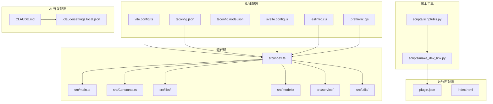
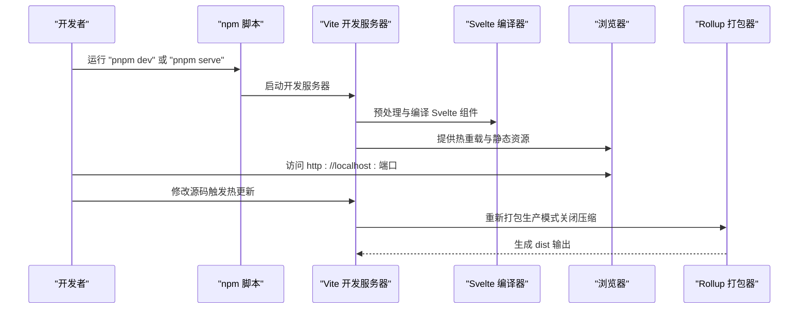
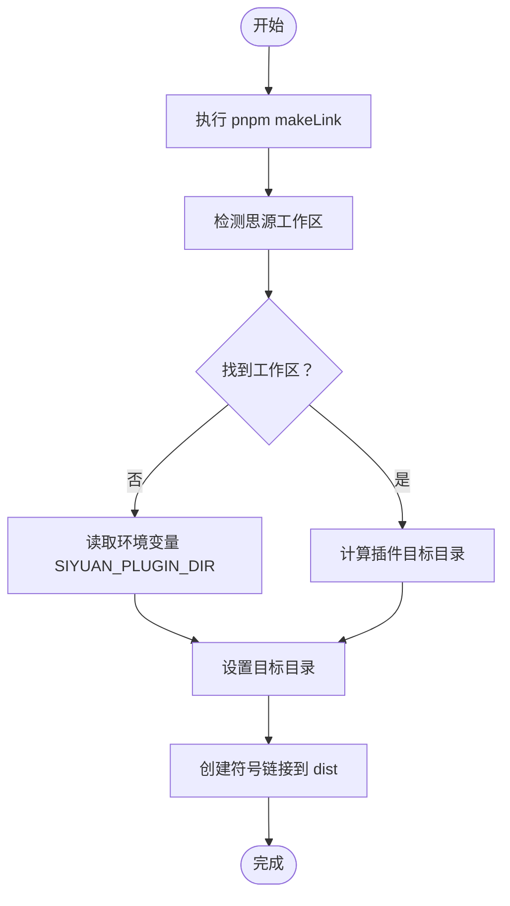
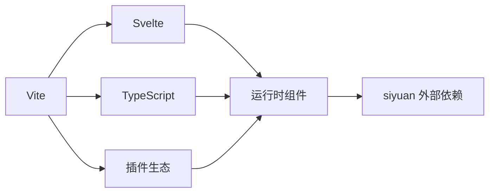

# 开发环境搭建

<cite>
**本文档引用的文件**
- [package.json](file://package.json)
- [vite.config.ts](file://vite.config.ts)
- [tsconfig.json](file://tsconfig.json)
- [tsconfig.node.json](file://tsconfig.node.json)
- [svelte.config.js](file://svelte.config.js)
- [.eslintrc.cjs](file://.eslintrc.cjs)
- [.prettierrc.cjs](file://.prettierrc.cjs)
- [plugin.json](file://plugin.json)
- [index.html](file://index.html)
- [src/index.ts](file://src/index.ts)
- [src/main.ts](file://src/main.ts)
- [src/Constants.ts](file://src/Constants.ts)
- [scripts/make_dev_link.py](file://scripts/make_dev_link.py)
- [scripts/scriptutils.py](file://scripts/scriptutils.py)
- [.claude/settings.local.json](file://.claude/settings.local.json)
- [CLAUDE.md](file://CLAUDE.md)
</cite>

## 更新摘要
**变更内容**
- 更新 pnpm 包管理器版本要求至 10.32.1
- 简化 Claude AI 开发环境权限配置
- 保持其他开发环境配置不变

## 目录
1. [简介](#简介)
2. [项目结构](#项目结构)
3. [核心组件](#核心组件)
4. [架构概览](#架构概览)
5. [详细组件分析](#详细组件分析)
6. [依赖分析](#依赖分析)
7. [性能考虑](#性能考虑)
8. [故障排除指南](#故障排除指南)
9. [结论](#结论)
10. [附录](#附录)

## 简介
本指南面向思源笔记分享专业版（share-pro）的开发者，提供完整的开发环境搭建与配置说明。内容涵盖 Node.js 版本要求、pnpm 包管理器安装、项目依赖安装、Vite 构建工具配置、TypeScript 编译配置、Svelte 框架配置、IDE 配置建议、调试环境设置、热重载配置、开发服务器启动、插件链接到思源笔记的方法、环境变量与开发密钥设置，以及常见问题的解决方案。

## 项目结构
该项目是一个基于 Vite + TypeScript + Svelte 的思源笔记插件工程，采用模块化的源码组织方式，核心入口位于 src/index.ts，并通过 vite.config.ts 进行构建配置，TypeScript 类型检查由 tsconfig.json 控制，Svelte 组件通过 svelte.config.js 进行预处理。

**图表来源**
- [src/index.ts:1-178](file://src/index.ts#L1-L178)
- [vite.config.ts:1-127](file://vite.config.ts#L1-L127)
- [tsconfig.json:1-53](file://tsconfig.json#L1-L53)
- [svelte.config.js:1-15](file://svelte.config.js#L1-L15)
- [plugin.json:1-35](file://plugin.json#L1-L35)
- [scripts/make_dev_link.py:1-231](file://scripts/make_dev_link.py#L1-L231)
- [CLAUDE.md:1-18](file://CLAUDE.md#L1-L18)
- [.claude/settings.local.json:1-15](file://.claude/settings.local.json#L1-L15)

**章节来源**
- [package.json:1-54](file://package.json#L1-L54)
- [vite.config.ts:1-127](file://vite.config.ts#L1-L127)
- [tsconfig.json:1-53](file://tsconfig.json#L1-L53)
- [svelte.config.js:1-15](file://svelte.config.js#L1-L15)
- [plugin.json:1-35](file://plugin.json#L1-L35)

## 核心组件
- 构建系统：Vite 作为开发服务器与打包工具，支持热重载与按需编译。
- 类型系统：TypeScript 提供严格的类型检查与智能提示。
- 视图层：Svelte 4 用于组件化 UI 开发，结合 vite-plugin-svelte。
- 插件元数据：plugin.json 定义插件名称、版本、兼容性等信息。
- 开发辅助：Python 脚本用于自动创建符号链接，便于在本地开发时直接加载 dist 目录。
- AI 开发支持：Claude AI 开发环境配置，简化权限管理。

**章节来源**
- [package.json:10-21](file://package.json#L10-L21)
- [vite.config.ts:16-127](file://vite.config.ts#L16-L127)
- [tsconfig.json:1-53](file://tsconfig.json#L1-L53)
- [svelte.config.js:1-15](file://svelte.config.js#L1-L15)
- [plugin.json:1-35](file://plugin.json#L1-L35)
- [CLAUDE.md:1-18](file://CLAUDE.md#L1-L18)
- [.claude/settings.local.json:1-15](file://.claude/settings.local.json#L1-L15)

## 架构概览
下图展示了开发环境的关键交互流程：开发者通过 npm 脚本启动 Vite，Vite 读取配置并启动开发服务器；Svelte 组件在浏览器中渲染；构建时通过 Rollup 外部化 siyuan 依赖，确保插件能在思源环境中运行。

**图表来源**
- [package.json:10-21](file://package.json#L10-L21)
- [vite.config.ts:16-127](file://vite.config.ts#L16-L127)
- [svelte.config.js:1-15](file://svelte.config.js#L1-L15)

## 详细组件分析

### Node.js 与包管理器
- Node.js 版本：项目未显式声明最低版本，但使用了 ESNext 模块与现代语法，建议使用 LTS 版本（如 18.x 或 20.x）以获得最佳兼容性。
- 包管理器：项目使用 pnpm 作为包管理器，版本已升级至 pnpm@10.32.1。请确保全局安装 pnpm 并使用项目指定版本。

**更新** 包管理器版本从之前的 9.9.0 升级到 10.32.1，提供更好的性能和稳定性。

**章节来源**
- [package.json:52-52](file://package.json#L52-L52)

### 项目依赖安装
- 安装命令：使用 pnpm 安装依赖，确保网络稳定，避免因缓存导致的安装失败。
- 开发依赖：包含 Vite、TypeScript、Svelte、ESLint、Prettier、测试框架等。
- 运行时依赖：包含 Svelte 虚拟列表、HTML 解析、剪贴板、事件总线、博客 API、基础库与思源 API 封装等。

**章节来源**
- [package.json:22-51](file://package.json#L22-L51)

### Vite 构建工具配置
- 入口与输出：库模式构建入口为 src/index.ts，输出格式为 cjs，文件名为 index.js，样式文件命名为 index.css。
- 热重载与监听：开发模式下启用 livereload 与外部文件监听（国际化文件、README、plugin.json），实现变更即刷新。
- 外部化依赖：将 siyuan 标记为外部依赖，避免被打包进插件，确保在思源环境中正常加载。
- 环境变量：通过 define 注入 NODE_ENV 与 DEV_MODE，用于运行时判断开发/生产模式。
- 静态资源复制：构建时将 README、LICENSE、图标、预览图与 i18n 目录复制到输出目录。

**章节来源**
- [vite.config.ts:16-127](file://vite.config.ts#L16-L127)

### TypeScript 编译配置
- 目标与模块：目标为 ESNext，模块解析为 Node，允许合成默认导入与 JSON 导入。
- 严格性：关闭严格模式与未使用检测，保留对 JS 的类型检查与 Svelte 支持。
- 类型声明：包含 node、vite/client、svelte 等类型，支持 .svelte 文件的 TS 解析。
- 引用：tsconfig.node.json 用于 Vite 配置文件的类型检查。

**章节来源**
- [tsconfig.json:1-53](file://tsconfig.json#L1-L53)
- [tsconfig.node.json:1-12](file://tsconfig.node.json#L1-L12)

### Svelte 框架配置
- 预处理器：使用 vitePreprocess，确保在 Vite 环境中正确处理 Svelte 组件。
- 编译选项：启用 customElement，适配插件作为自定义元素运行。
- 警告过滤：忽略 a11y 前缀警告，聚焦于实际问题。

**章节来源**
- [svelte.config.js:1-15](file://svelte.config.js#L1-L15)

### IDE 配置建议（VSCode）
- 推荐扩展：
  - ESLint：启用规则检查与自动修复。
  - Prettier：统一代码风格，配合 .prettierrc.cjs。
  - Svelte for VS Code：提供 Svelte 组件语法高亮与智能提示。
  - TypeScript Importer：自动导入类型与模块。
- 工作区设置：
  - 启用 ESLint 自动修复与 Prettier 格式化。
  - 关闭 TypeScript 严格模式以匹配项目配置，或在项目内单独启用严格模式。

**章节来源**
- [.eslintrc.cjs:1-46](file://.eslintrc.cjs#L1-L46)
- [.prettierrc.cjs:26-31](file://.prettierrc.cjs#L26-L31)

### Claude AI 开发环境配置
- AI 开发支持：项目包含 Claude AI 开发环境配置，通过 CLAUDE.md 提供 OpenSpec 指南。
- 权限简化：.claude/settings.local.json 中的权限配置相对简化，但仍包含必要的开发权限：
  - Bash 命令执行权限：pnpm run build、pnpm build:*、git checkout:*、mkdir:*、pnpm install:*
  - Web 访问权限：github.com、raw.githubusercontent.com
  - 搜索功能：WebSearch
- OpenSpec 集成：遵循 openspec/AGENTS.md 中的变更提案流程。

**更新** Claude AI 开发环境权限配置得到简化，在保证开发功能的同时减少了不必要的权限要求。

**章节来源**
- [CLAUDE.md:1-18](file://CLAUDE.md#L1-L18)
- [.claude/settings.local.json:1-15](file://.claude/settings.local.json#L1-L15)

### 调试环境设置与热重载
- 开发服务器：执行 pnpm dev 或 pnpm serve 启动 Vite 开发服务器，默认监听端口由 Vite 决定。
- 热重载：修改 Svelte 组件、TS 源码或静态资源会触发浏览器热更新；国际化文件与 README/plugin.json 的变更也会被监听。
- 生产构建：执行 pnpm build 生成压缩后的产物，便于发布或测试。

**章节来源**
- [package.json:10-21](file://package.json#L10-L21)
- [vite.config.ts:85-102](file://vite.config.ts#L85-L102)

### 开发服务器启动与插件链接
- 启动开发服务器：在项目根目录执行 pnpm dev 或 pnpm serve。
- 链接插件到思源：执行 pnpm makeLink，脚本会自动获取思源工作区路径并创建符号链接至 dist 目录，便于在思源中实时加载最新构建。
- 环境变量：可设置 SIYUAN_PLUGIN_DIR 指向插件目录，或在脚本中手动配置 targetDir。

**图表来源**
- [scripts/make_dev_link.py:206-231](file://scripts/make_dev_link.py#L206-L231)

**章节来源**
- [scripts/make_dev_link.py:1-231](file://scripts/make_dev_link.py#L1-L231)
- [package.json:10-11](file://package.json#L10-L11)

### 环境变量与开发密钥
- 运行时环境变量：
  - NODE_ENV：通过 Vite define 注入，区分开发/生产模式。
  - DEV_MODE：通过 process.env.DEV_MODE 判断是否为开发模式。
- 开发密钥与配置：
  - 默认 API 地址与令牌在 src/Constants.ts 中定义，开发模式下指向本地服务端点。
  - 插件配置存储键值为 SHARE_PRO_STORE_NAME，首次加载会初始化默认配置。

**章节来源**
- [vite.config.ts:59-62](file://vite.config.ts#L59-L62)
- [src/Constants.ts:10-20](file://src/Constants.ts#L10-L20)
- [src/index.ts:103-119](file://src/index.ts#L103-L119)

### 调试工具使用
- 浏览器调试：在 index.html 中通过模块脚本加载 src/index.ts，便于在浏览器中直接调试。
- 日志系统：使用 zhi-lib-base 的 simpleLogger 输出日志，便于定位问题。
- 插件生命周期：在 onload/onunload 中进行初始化与清理，可在控制台观察加载状态。

**章节来源**
- [index.html:9-10](file://index.html#L9-L10)
- [src/index.ts:61-71](file://src/index.ts#L61-L71)

## 依赖分析
项目采用松耦合设计，核心依赖集中在构建与运行时两个层面：
- 构建期依赖：Vite、Svelte、TypeScript、ESLint、Prettier、测试框架等。
- 运行时依赖：Svelte 组件生态、API 封装库、工具库等。
- 外部化策略：siyuan 作为外部依赖，避免被打包，确保在思源环境中正确加载。

**图表来源**
- [vite.config.ts:106-106](file://vite.config.ts#L106-L106)
- [package.json:22-51](file://package.json#L22-L51)

**章节来源**
- [vite.config.ts:104-107](file://vite.config.ts#L104-L107)
- [package.json:22-51](file://package.json#L22-L51)

## 性能考虑
- 开发模式：关闭压缩与生成 source map，提升编译速度与调试体验。
- 生产模式：开启压缩与 source map（可根据需要调整），平衡体积与调试需求。
- 外部化依赖：将 siyuan 外部化，减少打包体积，避免重复加载。
- 热重载优化：仅监听必要文件，避免不必要的全量重建。

**章节来源**
- [vite.config.ts:64-127](file://vite.config.ts#L64-L127)

## 故障排除指南
- 无法启动开发服务器
  - 检查 pnpm 是否正确安装且版本满足要求（当前要求 10.32.1+）。
  - 确认端口未被占用，或修改 Vite 端口配置。
- 热重载不生效
  - 确认已启用开发模式（--watch）。
  - 检查 vite.config.ts 中的监听配置与文件路径。
- 符号链接创建失败
  - 确认已运行 pnpm makeLink，并具备管理员权限。
  - 检查 SIYUAN_PLUGIN_DIR 环境变量或脚本中的 targetDir 设置。
- 插件未显示
  - 确认 dist 目录已被符号链接到思源插件目录。
  - 检查 plugin.json 的名称与版本是否正确。
- TypeScript 报错
  - 项目关闭了严格模式，若需严格检查，可在本地临时开启。
  - 确保 .svelte 文件的 TS 解析配置正确。
- Claude AI 权限问题
  - 检查 .claude/settings.local.json 中的权限配置是否正确。
  - 确保必要的 Bash 命令和 Web 访问权限已授权。

**更新** 新增 pnpm 10.32.1 版本要求和 Claude AI 权限问题的故障排除指导。

**章节来源**
- [scripts/make_dev_link.py:224-227](file://scripts/make_dev_link.py#L224-L227)
- [vite.config.ts:85-102](file://vite.config.ts#L85-L102)
- [tsconfig.json:21-24](file://tsconfig.json#L21-L24)
- [.claude/settings.local.json:1-15](file://.claude/settings.local.json#L1-L15)

## 结论
通过以上配置与流程，开发者可以快速搭建并维护思源笔记分享专业版的开发环境。建议在团队内统一 pnpm 版本（当前要求 10.32.1+）与 Node.js 版本，规范 IDE 插件与代码风格，确保开发效率与质量。Claude AI 开发环境的简化配置使得 AI 辅助开发更加便捷，同时保持了必要的安全边界。

## 附录
- 快速命令清单
  - 安装依赖：pnpm install
  - 启动开发：pnpm dev 或 pnpm serve
  - 生成构建：pnpm build
  - 预览构建：pnpm start
  - 创建插件链接：pnpm makeLink
  - 单元测试：pnpm test
- 参考文件
  - 构建配置：vite.config.ts
  - 类型配置：tsconfig.json、tsconfig.node.json
  - Svelte 配置：svelte.config.js
  - 插件元数据：plugin.json
  - 开发入口：index.html、src/index.ts
  - AI 开发配置：CLAUDE.md、.claude/settings.local.json