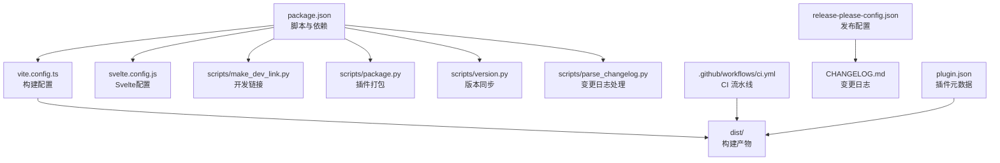
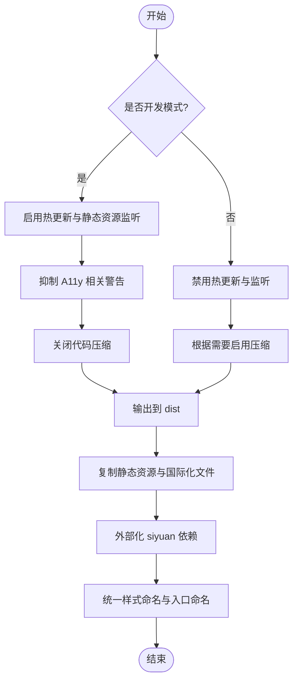
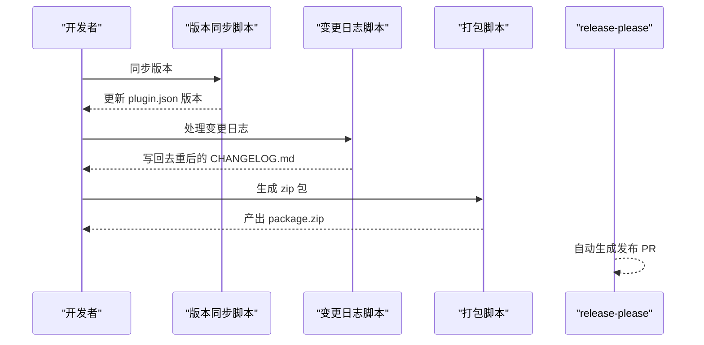
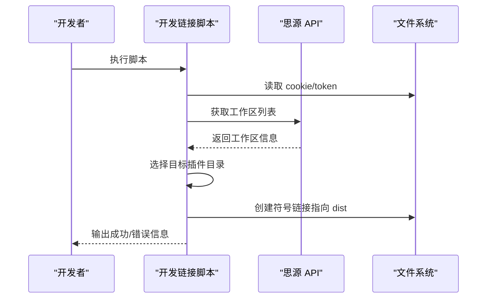
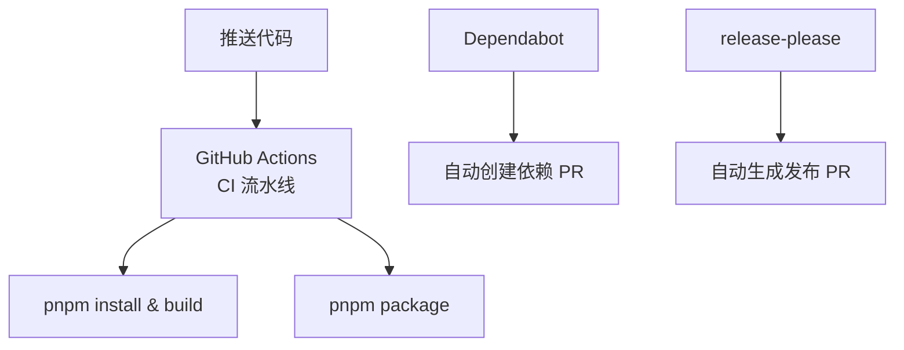
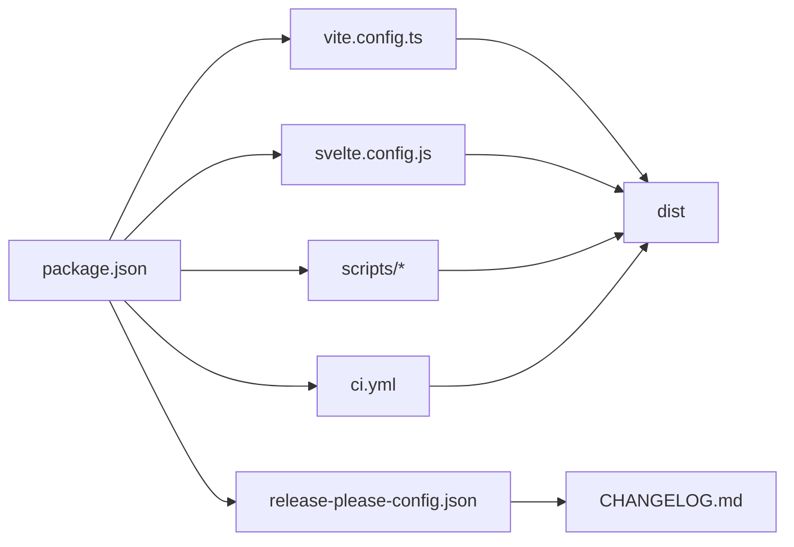

# 构建与部署

<cite>
**本文引用的文件**
- [package.json](file://package.json)
- [vite.config.ts](file://vite.config.ts)
- [svelte.config.js](file://svelte.config.js)
- [plugin.json](file://plugin.json)
- [scripts/make_dev_link.py](file://scripts/make_dev_link.py)
- [scripts/package.py](file://scripts/package.py)
- [scripts/version.py](file://scripts/version.py)
- [scripts/scriptutils.py](file://scripts/scriptutils.py)
- [scripts/parse_changelog.py](file://scripts/parse_changelog.py)
- [.github/workflows/ci.yml](file://.github/workflows/ci.yml)
- [.github/dependabot.yml](file://.github/dependabot.yml)
- [release-please-config.json](file://release-please-config.json)
- [tsconfig.json](file://tsconfig.json)
- [README.md](file://README.md)
</cite>

## 目录
1. [简介](#简介)
2. [项目结构](#项目结构)
3. [核心组件](#核心组件)
4. [架构总览](#架构总览)
5. [详细组件分析](#详细组件分析)
6. [依赖关系分析](#依赖关系分析)
7. [性能考量](#性能考量)
8. [故障排查指南](#故障排查指南)
9. [结论](#结论)
10. [附录](#附录)

## 简介
本指南面向"思源笔记分享专业版"项目的构建与部署，覆盖 Vite 构建配置、生产打包与资源优化、插件打包与版本管理、本地开发联调与自动化流程、CI/CD 与自动发布、多环境部署策略与回滚方案、性能优化与缓存策略、以及安全与权限控制要点。文档同时提供可视化图示，帮助开发者快速理解系统架构与关键流程。

**更新** 新增可访问性警告处理配置，改善开发体验，抑制不必要的 A11y 相关警告。

## 项目结构
该项目采用前端单页应用（Svelte）与 Vite 构建工具，结合 Python 脚本完成本地开发链接、版本同步与打包。核心目录与职责如下：
- src：源代码（Svelte 组件、服务、模型、工具等）
- scripts：构建与发布辅助脚本（Python）
- .github/workflows：GitHub Actions 自动化流水线
- dist：构建产物输出目录
- 其他配置文件：package.json、vite.config.ts、plugin.json、tsconfig.json、svelte.config.js 等



图表来源
- [package.json](file://package.json)
- [vite.config.ts](file://vite.config.ts)
- [svelte.config.js](file://svelte.config.js)
- [scripts/make_dev_link.py](file://scripts/make_dev_link.py)
- [scripts/package.py](file://scripts/package.py)
- [scripts/version.py](file://scripts/version.py)
- [scripts/parse_changelog.py](file://scripts/parse_changelog.py)
- [.github/workflows/ci.yml](file://.github/workflows/ci.yml)
- [release-please-config.json](file://release-please-config.json)
- [plugin.json](file://plugin.json)

章节来源
- [package.json](file://package.json)
- [vite.config.ts](file://vite.config.ts)
- [svelte.config.js](file://svelte.config.js)
- [plugin.json](file://plugin.json)
- [.github/workflows/ci.yml](file://.github/workflows/ci.yml)

## 核心组件
- 构建与打包
  - Vite 构建配置：定义入口、库格式、外部依赖、产物命名与资源输出策略；开发模式下启用热更新与静态资源监听；生产模式关闭压缩以便调试或按需开启。
  - Svelte 配置：统一的 Svelte 编译器选项与可访问性警告处理，确保开发环境的整洁性。
  - 插件元数据：plugin.json 提供插件名称、作者、版本、最小兼容版本、国际化与说明文件映射等。
- 开发与本地联调
  - 开发链接脚本：自动发现思源工作区、读取 Cookie/Token、创建符号链接，支持多工作区选择与目标目录配置。
  - 本地预览：Vite 预览命令用于本地验证构建产物。
- 发布与版本管理
  - 版本同步：将 package.json 的版本同步至 plugin.json。
  - 变更日志：清理重复条目并写回 CHANGELOG.md。
  - 插件打包：将 dist 目录压缩为 zip 并生成 package.zip。
  - 自动发布：配合 release-please 生成发布 PR 与变更日志。
- CI/CD
  - GitHub Actions：安装 pnpm、Node.js，执行安装依赖、构建与打包。
  - Dependabot：自动维护 npm 与 GitHub Actions 依赖。

章节来源
- [vite.config.ts](file://vite.config.ts)
- [svelte.config.js](file://svelte.config.js)
- [plugin.json](file://plugin.json)
- [scripts/make_dev_link.py](file://scripts/make_dev_link.py)
- [scripts/version.py](file://scripts/version.py)
- [scripts/parse_changelog.py](file://scripts/parse_changelog.py)
- [scripts/package.py](file://scripts/package.py)
- [.github/workflows/ci.yml](file://.github/workflows/ci.yml)
- [.github/dependabot.yml](file://.github/dependabot.yml)
- [release-please-config.json](file://release-please-config.json)

## 架构总览
下图展示从开发到发布的端到端流程，包括本地开发、构建、打包与 CI 流水线。

```mermaid
sequenceDiagram
participant Dev as "开发者"
participant Vite as "Vite 构建"
participant Svelte as "Svelte 配置"
participant Dist as "dist 产物"
participant Link as "开发链接脚本"
participant CI as "GitHub Actions"
participant Rel as "release-please"
participant Zip as "打包脚本"
Dev->>Vite : 运行构建/预览
Vite->>Svelte : 应用 Svelte 配置
Svelte-->>Vite : 处理可访问性警告
Vite-->>Dist : 生成构建产物
Dev->>Link : 创建符号链接到插件目录
Dev->>Zip : 执行打包脚本
Zip-->>Dist : 产出 zip 包
CI->>Vite : 触发构建与打包
Rel-->>Rel : 生成发布 PR 与变更日志
```

图表来源
- [vite.config.ts](file://vite.config.ts)
- [svelte.config.js](file://svelte.config.js)
- [scripts/make_dev_link.py](file://scripts/make_dev_link.py)
- [scripts/package.py](file://scripts/package.py)
- [.github/workflows/ci.yml](file://.github/workflows/ci.yml)
- [release-please-config.json](file://release-please-config.json)

## 详细组件分析

### Vite 构建配置与生产打包
- 入口与库格式
  - 入口为 src/index.ts，库格式为 cjs，文件名为 index，便于作为插件库被外部加载。
- 外部化依赖
  - 将 siyuan 设为外部依赖，避免被打包进最终产物，确保运行时由宿主环境提供。
- 产物命名与资源输出
  - 入口文件命名为 [name].js；样式资源统一输出为 index.css，其他资源保持原名。
- 开发与生产差异
  - 开发模式：启用热更新与静态资源监听；不进行代码压缩，便于调试。
  - 生产模式：关闭热更新与监听；根据 watch 参数决定是否压缩。
- 静态资源复制
  - 构建阶段复制 README*、LICENSE、icon.png、preview.png、plugin.json 以及国际化资源到 dist 目录，保证发布包完整性。
- 环境变量注入
  - 注入 NODE_ENV 与 DEV_MODE，便于运行时区分开发/生产状态。
- **可访问性警告处理**（新增）
  - 在开发环境中抑制 A11y 相关警告，改善开发体验，避免因可访问性检查而产生的干扰。



图表来源
- [vite.config.ts](file://vite.config.ts)

章节来源
- [vite.config.ts](file://vite.config.ts)

### Svelte 配置与可访问性处理
- 编译器选项
  - 设置 customElement: true，支持自定义元素编译，便于在思源笔记环境中使用。
- 预处理器配置
  - 使用 vitePreprocess() 进行编译时预处理，确保与 Vite 环境的兼容性。
- **可访问性警告处理**（新增）
  - 统一处理 A11y 相关警告，与 Vite 配置形成双重保护，确保开发环境的整洁性。

章节来源
- [svelte.config.js](file://svelte.config.js)

### 插件打包流程与版本管理
- 版本同步
  - 将 package.json 的版本写入 plugin.json 的 version 字段，确保版本一致性。
- 变更日志处理
  - 清洗重复提交条目，去重后写回 CHANGELOG.md，便于发布说明。
- 插件打包
  - 将 dist 目录压缩为 share-pro-<version>.zip，并生成 package.zip 供发布使用。
- 自动发布准备
  - 通过 prepareRelease 脚本串联版本同步与变更日志处理，为 release-please 生成发布 PR 做准备。



图表来源
- [scripts/version.py](file://scripts/version.py)
- [scripts/parse_changelog.py](file://scripts/parse_changelog.py)
- [scripts/package.py](file://scripts/package.py)
- [release-please-config.json](file://release-please-config.json)

章节来源
- [scripts/version.py](file://scripts/version.py)
- [scripts/parse_changelog.py](file://scripts/parse_changelog.py)
- [scripts/package.py](file://scripts/package.py)
- [release-please-config.json](file://release-please-config.json)

### 开发链接脚本与本地测试部署
- 自动发现与选择工作区
  - 通过 API 获取工作区列表，支持交互式选择或多工作区场景。
- 认证与请求头
  - 从 cookie.txt 与 token.txt 读取认证信息，构造 Authorization 与 Cookie 请求头。
- 符号链接创建
  - 将 dist 目录创建为插件目录下的符号链接，实现"开发即联调"，无需手动复制。
- 环境变量与参数
  - 支持通过 SIYUAN_PLUGIN_DIR 环境变量指定目标目录，或通过命令行参数覆盖。



图表来源
- [scripts/make_dev_link.py](file://scripts/make_dev_link.py)

章节来源
- [scripts/make_dev_link.py](file://scripts/make_dev_link.py)

### CI/CD 配置与自动发布
- CI 流水线
  - 使用 pnpm/action-setup 固定版本，安装 Node.js 与依赖，执行构建与打包。
- 依赖自动维护
  - Dependabot 定期扫描 npm 与 GitHub Actions 依赖，创建拉取请求并分配给维护者。
- 自动发布
  - release-please 根据变更日志与提交类型生成发布 PR，支持 minor/patch 分类与草稿发布。



图表来源
- [.github/workflows/ci.yml](file://.github/workflows/ci.yml)
- [.github/dependabot.yml](file://.github/dependabot.yml)
- [release-please-config.json](file://release-please-config.json)

章节来源
- [.github/workflows/ci.yml](file://.github/workflows/ci.yml)
- [.github/dependabot.yml](file://.github/dependabot.yml)
- [release-please-config.json](file://release-please-config.json)

### 多环境部署策略与回滚方案
- 开发环境
  - 使用开发模式构建，启用热更新与静态资源监听，便于快速迭代。
  - **新增**：抑制 A11y 相关警告，提供更纯净的开发体验。
- 预发布/测试环境
  - 使用生产模式构建，保留必要的 source map 以便问题定位；可启用压缩以接近真实环境。
- 生产环境
  - 关闭热更新与监听，启用压缩与资源最小化；确保外部依赖（如 siyuan）由宿主提供。
- 回滚策略
  - 保留上一版本的 zip 包；回滚时替换符号链接或重新部署旧版本包；结合变更日志与发布 PR 快速定位问题版本。

章节来源
- [vite.config.ts](file://vite.config.ts)
- [svelte.config.js](file://svelte.config.js)
- [scripts/make_dev_link.py](file://scripts/make_dev_link.py)

### 性能优化技巧、资源压缩与缓存策略
- 构建优化
  - 生产模式下启用压缩与 Tree-shaking；将非必要依赖外部化（如 siyuan），减少包体体积。
  - 统一样式命名与入口命名，避免重复加载。
- 资源优化
  - 图片与静态资源尽量内联或按需加载；对国际化文件进行按需引入。
- 缓存策略
  - 在宿主环境中合理设置缓存头；对静态资源采用长缓存策略，版本号变化时失效。
- 调试与可观测性
  - 开发模式下保留可读性较好的代码与资源；生产模式下按需开启 source map 以平衡体积与调试成本。

章节来源
- [vite.config.ts](file://vite.config.ts)

### 安全考虑、权限管理与访问控制
- 认证与授权
  - 开发链接脚本通过 Cookie 与 Token 进行认证，建议在受控环境下使用，避免泄露。
- 权限控制
  - 对工作区目录与符号链接的创建进行权限检查，防止误操作。
- 访问控制
  - CI 流水线与自动发布仅在受保护分支触发；依赖更新由 Dependabot 自动创建 PR，需人工审核。

章节来源
- [scripts/make_dev_link.py](file://scripts/make_dev_link.py)
- [.github/workflows/ci.yml](file://.github/workflows/ci.yml)
- [.github/dependabot.yml](file://.github/dependabot.yml)

## 依赖关系分析
- 构建链路
  - package.json 的脚本驱动 Vite 构建、本地预览、打包与版本同步；Vite 配置决定产物结构与优化策略。
- 发布链路
  - 版本同步与变更日志处理为自动发布提供基础；CI 流水线负责执行构建与打包；release-please 生成发布 PR。
- 运行时依赖
  - siyuan 作为外部依赖，需确保宿主环境提供；其他依赖通过打包进入产物或由宿主加载。



图表来源
- [package.json](file://package.json)
- [vite.config.ts](file://vite.config.ts)
- [svelte.config.js](file://svelte.config.js)
- [scripts/scriptutils.py](file://scripts/scriptutils.py)
- [.github/workflows/ci.yml](file://.github/workflows/ci.yml)
- [release-please-config.json](file://release-please-config.json)

章节来源
- [package.json](file://package.json)
- [vite.config.ts](file://vite.config.ts)
- [svelte.config.js](file://svelte.config.js)
- [scripts/scriptutils.py](file://scripts/scriptutils.py)
- [.github/workflows/ci.yml](file://.github/workflows/ci.yml)
- [release-please-config.json](file://release-please-config.json)

## 性能考量
- 构建体积
  - 外部化非核心依赖，减少打包体积；按需引入国际化与静态资源。
- 运行时性能
  - 生产模式启用压缩与 Tree-shaking；避免在运行时进行重型计算。
- 资源加载
  - 统一命名与缓存策略，减少重复下载；对大资源采用懒加载。
- 调试成本
  - 开发模式保留可读性；生产模式按需开启 source map。
- **开发体验优化**（新增）
  - 通过抑制 A11y 相关警告，减少开发过程中的干扰，提高开发效率。

## 故障排查指南
- 构建失败
  - 检查 Vite 配置与依赖安装；确认外部依赖（siyuan）可用；查看构建日志定位具体报错。
- 本地联调异常
  - 确认 Cookie/Token 文件内容正确；检查工作区 API 可达性；确认目标插件目录存在且可写。
- 打包失败
  - 检查 dist 目录是否存在；确认打包脚本依赖的工具可用；查看压缩过程中的异常。
- CI 失败
  - 查看 Actions 日志；确认 pnpm 与 Node.js 版本一致；检查依赖安装与构建步骤。
- **可访问性警告问题**（新增）
  - 如遇到 A11y 相关警告影响开发体验，检查 Vite 和 Svelte 配置中的 onwarn 处理逻辑。

章节来源
- [vite.config.ts](file://vite.config.ts)
- [svelte.config.js](file://svelte.config.js)
- [scripts/make_dev_link.py](file://scripts/make_dev_link.py)
- [scripts/package.py](file://scripts/package.py)
- [.github/workflows/ci.yml](file://.github/workflows/ci.yml)

## 结论
本指南系统梳理了"思源笔记分享专业版"的构建与部署流程，涵盖 Vite 配置、生产打包、版本管理、本地联调、CI/CD 与自动发布、多环境策略、性能优化与安全注意事项。**最新更新**包括可访问性警告处理配置，通过在开发环境中抑制 A11y 相关警告，显著改善了开发体验。通过脚本化与自动化手段，可显著提升开发效率与发布质量，建议在团队内标准化执行流程并定期回顾优化。

## 附录
- 快速参考
  - 本地开发：pnpm dev（监听构建）、pnpm serve（开发服务器）、pnpm start（预览）
  - 版本与发布：pnpm syncVersion、pnpm parseChangelog、pnpm prepareRelease、pnpm package
  - CI：push 到 dev 分支触发流水线
- 相关文件
  - [README.md](file://README.md)
  - [tsconfig.json](file://tsconfig.json)
  - [plugin.json](file://plugin.json)
</appendix>