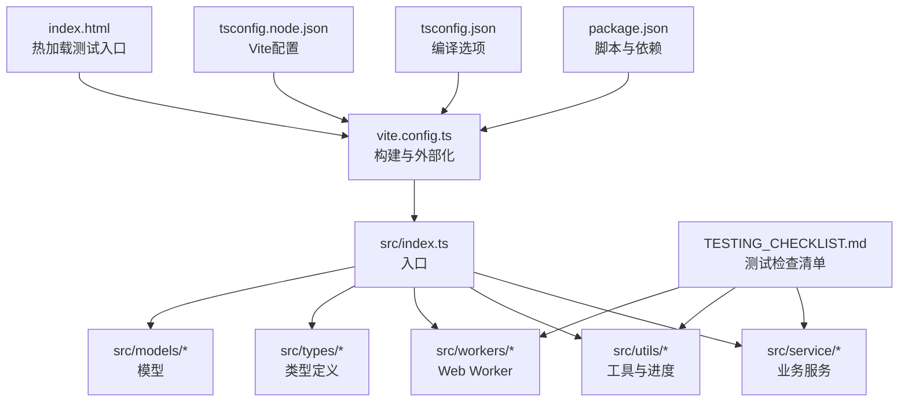
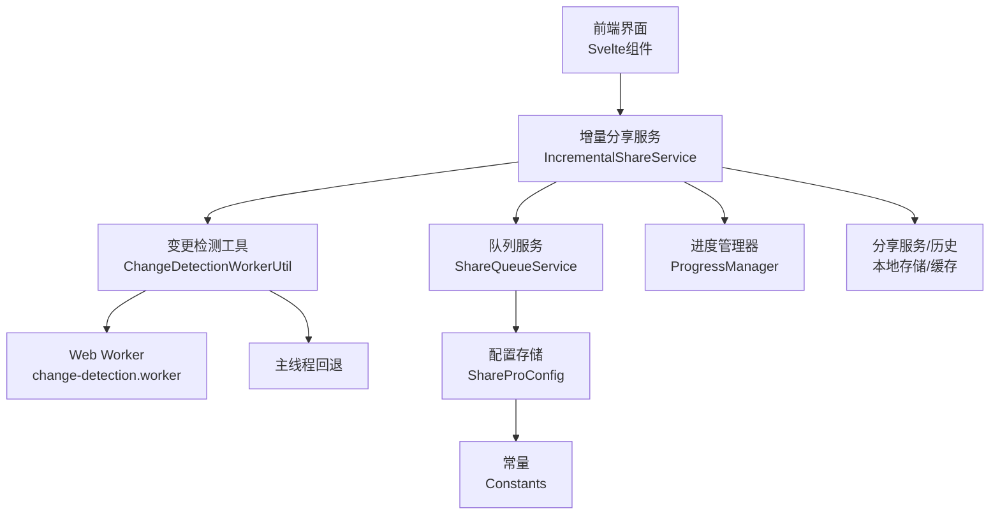
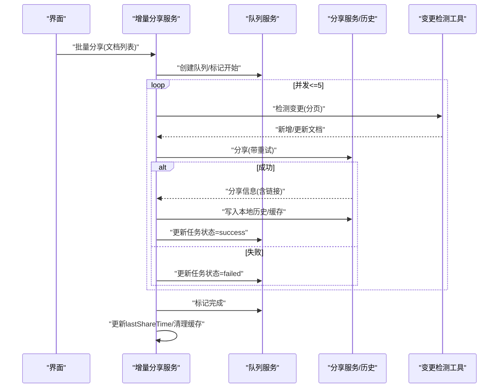
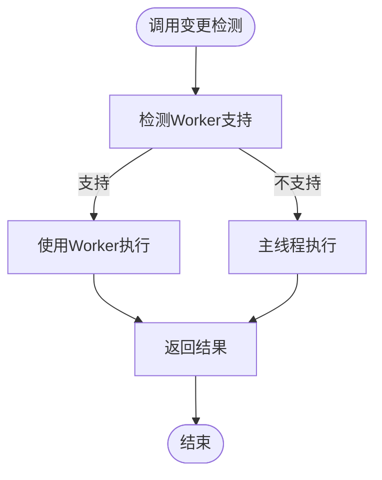
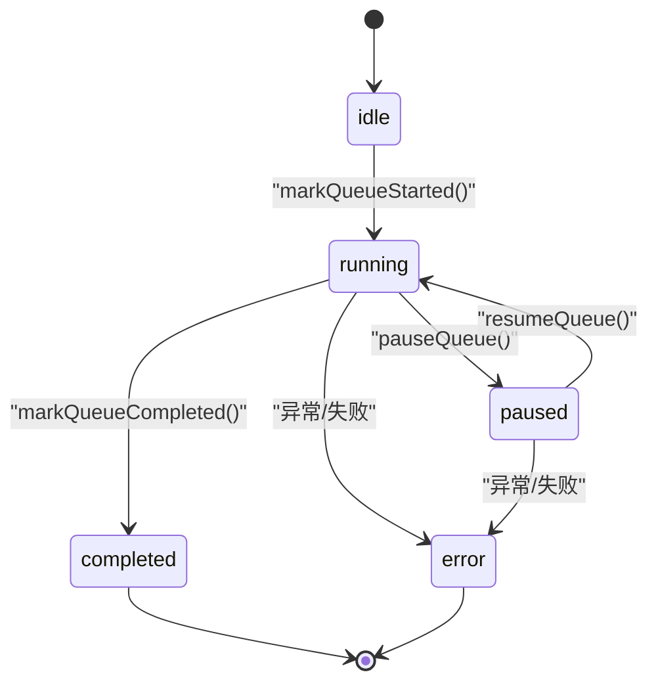
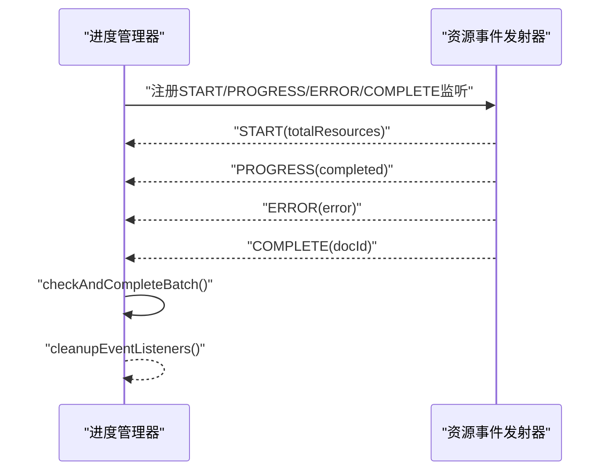
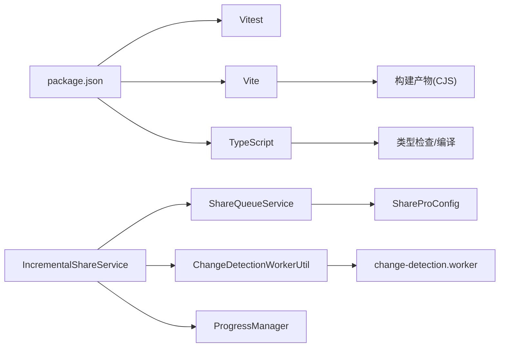

# 测试与调试

<cite>
**本文引用的文件**   
- [package.json](file://package.json)
- [vite.config.ts](file://vite.config.ts)
- [tsconfig.json](file://tsconfig.json)
- [tsconfig.node.json](file://tsconfig.node.json)
- [index.html](file://index.html)
- [README.md](file://README.md)
- [TESTING_CHECKLIST.md](file://TESTING_CHECKLIST.md)
- [src/workers/change-detection.worker.ts](file://src/workers/change-detection.worker.ts)
- [src/utils/ChangeDetectionWorkerUtil.ts](file://src/utils/ChangeDetectionWorkerUtil.ts)
- [src/service/IncrementalShareService.ts](file://src/service/IncrementalShareService.ts)
- [src/service/ShareQueueService.ts](file://src/service/ShareQueueService.ts)
- [src/utils/progress/ProgressManager.ts](file://src/utils/progress/ProgressManager.ts)
- [src/types/share-queue.d.ts](file://src/types/share-queue.d.ts)
- [src/Constants.ts](file://src/Constants.ts)
- [src/models/ShareProConfig.ts](file://src/models/ShareProConfig.ts)
</cite>

## 目录
1. [简介](#简介)
2. [项目结构](#项目结构)
3. [核心组件](#核心组件)
4. [架构总览](#架构总览)
5. [详细组件分析](#详细组件分析)
6. [依赖分析](#依赖分析)
7. [性能考虑](#性能考虑)
8. [故障排查指南](#故障排查指南)
9. [结论](#结论)
10. [附录](#附录)

## 简介
本指南面向“思源笔记分享专业版”项目，系统化制定测试与调试策略，覆盖单元测试、集成测试、端到端测试、Web Worker与异步操作测试、UI组件测试、调试工具与断点设置、性能分析、错误追踪与日志、异常处理测试、覆盖率要求、测试数据与模拟对象、性能测试与内存泄漏检测、并发测试、用户体验与兼容性、回归测试流程等。文档基于仓库现有代码与测试检查清单提炼，确保测试方案可落地、可验证、可维护。

## 项目结构
项目采用 Vite + Svelte + TypeScript 技术栈，构建为 CJS 插件库，核心源码位于 src 目录，测试框架使用 Vitest，测试检查清单集中在 TESTING_CHECKLIST.md。关键目录与文件如下：
- 构建与脚本：package.json、vite.config.ts
- 类型与编译：tsconfig.json、tsconfig.node.json
- 入口与演示：index.html
- 功能模块：src/service、src/utils、src/workers、src/types、src/models
- 测试与文档：TESTING_CHECKLIST.md、README.md

图表来源
- [package.json:1-54](file://package.json#L1-L54)
- [vite.config.ts:1-120](file://vite.config.ts#L1-L120)
- [tsconfig.json:1-53](file://tsconfig.json#L1-L53)
- [tsconfig.node.json:1-12](file://tsconfig.node.json#L1-L12)
- [index.html:1-12](file://index.html#L1-L12)

章节来源
- [package.json:1-54](file://package.json#L1-L54)
- [vite.config.ts:1-120](file://vite.config.ts#L1-L120)
- [tsconfig.json:1-53](file://tsconfig.json#L1-L53)
- [tsconfig.node.json:1-12](file://tsconfig.node.json#L1-L12)
- [index.html:1-12](file://index.html#L1-L12)

## 核心组件
- 增量分享服务：负责变更检测、并发分享、智能重试、队列管理、缓存与时间戳更新。
- 分享队列服务：负责队列生命周期、暂停/继续、进度统计、失败重试。
- Web Worker 变更检测工具：优先使用 Worker，不可用时回退主线程，避免阻塞 UI。
- 进度管理器：统一管理批量操作进度、资源处理事件与完成判定。
- 类型与常量：定义队列状态、任务状态、配置模型与全局常量。

章节来源
- [src/service/IncrementalShareService.ts:1-690](file://src/service/IncrementalShareService.ts#L1-L690)
- [src/service/ShareQueueService.ts:1-299](file://src/service/ShareQueueService.ts#L1-L299)
- [src/utils/ChangeDetectionWorkerUtil.ts:1-148](file://src/utils/ChangeDetectionWorkerUtil.ts#L1-L148)
- [src/utils/progress/ProgressManager.ts:1-238](file://src/utils/progress/ProgressManager.ts#L1-L238)
- [src/types/share-queue.d.ts:1-149](file://src/types/share-queue.d.ts#L1-L149)
- [src/Constants.ts:1-20](file://src/Constants.ts#L1-L20)
- [src/models/ShareProConfig.ts:1-40](file://src/models/ShareProConfig.ts#L1-L40)

## 架构总览
增量分享功能由“前端 UI + 服务层 + 队列层 + Worker/主线程变更检测 + 进度与日志”构成，核心流程如下：

图表来源
- [src/service/IncrementalShareService.ts:1-690](file://src/service/IncrementalShareService.ts#L1-L690)
- [src/utils/ChangeDetectionWorkerUtil.ts:1-148](file://src/utils/ChangeDetectionWorkerUtil.ts#L1-L148)
- [src/workers/change-detection.worker.ts:1-148](file://src/workers/change-detection.worker.ts#L1-L148)
- [src/service/ShareQueueService.ts:1-299](file://src/service/ShareQueueService.ts#L1-L299)
- [src/utils/progress/ProgressManager.ts:1-238](file://src/utils/progress/ProgressManager.ts#L1-L238)
- [src/models/ShareProConfig.ts:1-40](file://src/models/ShareProConfig.ts#L1-L40)
- [src/Constants.ts:1-20](file://src/Constants.ts#L1-L20)

## 详细组件分析

### 增量分享服务（并发、重试、缓存、队列）
- 并发控制：批量分享默认并发上限为 5，使用队列与并发池控制任务执行。
- 智能重试：网络错误指数退避（1s、2s、4s），5xx 错误延迟 30s，4xx 立即失败。
- 缓存机制：变更检测结果缓存 5 分钟；分享成功后清除缓存，保证一致性。
- 队列管理：支持创建、暂停/继续、进度统计、失败重试、断点续传、持久化恢复。
- 时间戳更新：每次成功分享后更新 lastShareTime，用于增量检测。

图表来源
- [src/service/IncrementalShareService.ts:268-351](file://src/service/IncrementalShareService.ts#L268-L351)
- [src/service/IncrementalShareService.ts:396-577](file://src/service/IncrementalShareService.ts#L396-L577)
- [src/service/IncrementalShareService.ts:585-659](file://src/service/IncrementalShareService.ts#L585-L659)
- [src/service/ShareQueueService.ts:38-60](file://src/service/ShareQueueService.ts#L38-L60)
- [src/service/ShareQueueService.ts:105-125](file://src/service/ShareQueueService.ts#L105-L125)
- [src/service/ShareQueueService.ts:200-217](file://src/service/ShareQueueService.ts#L200-L217)

章节来源
- [src/service/IncrementalShareService.ts:1-690](file://src/service/IncrementalShareService.ts#L1-L690)
- [src/service/ShareQueueService.ts:1-299](file://src/service/ShareQueueService.ts#L1-L299)

### Web Worker 变更检测（异步、回退、主线程）
- Worker 支持：优先使用 Worker 执行变更检测；若不可用则回退主线程。
- 主线程回退：通过宏任务调度避免阻塞 UI，模拟 Worker 的异步行为。
- 黑名单与历史映射：使用 Set/Map 实现 O(1)/O(1) 查询，提升性能。

图表来源
- [src/utils/ChangeDetectionWorkerUtil.ts:36-59](file://src/utils/ChangeDetectionWorkerUtil.ts#L36-L59)
- [src/utils/ChangeDetectionWorkerUtil.ts:64-85](file://src/utils/ChangeDetectionWorkerUtil.ts#L64-L85)
- [src/utils/ChangeDetectionWorkerUtil.ts:89-136](file://src/utils/ChangeDetectionWorkerUtil.ts#L89-L136)
- [src/workers/change-detection.worker.ts:49-72](file://src/workers/change-detection.worker.ts#L49-L72)
- [src/workers/change-detection.worker.ts:77-145](file://src/workers/change-detection.worker.ts#L77-L145)

章节来源
- [src/utils/ChangeDetectionWorkerUtil.ts:1-148](file://src/utils/ChangeDetectionWorkerUtil.ts#L1-L148)
- [src/workers/change-detection.worker.ts:1-148](file://src/workers/change-detection.worker.ts#L1-L148)

### 队列服务（暂停/继续、进度、持久化）
- 状态机：idle → running → paused → completed/error。
- 进度计算：基于任务状态统计 total/completed/success/failed/skipped/processing/pending，并估算剩余时间。
- 持久化：队列状态与任务持久化到插件配置，支持重启恢复。
- 失败重试：将失败任务重置为 pending 并增加 retryCount。

图表来源
- [src/service/ShareQueueService.ts:38-60](file://src/service/ShareQueueService.ts#L38-L60)
- [src/service/ShareQueueService.ts:69-93](file://src/service/ShareQueueService.ts#L69-L93)
- [src/service/ShareQueueService.ts:129-170](file://src/service/ShareQueueService.ts#L129-L170)
- [src/service/ShareQueueService.ts:232-253](file://src/service/ShareQueueService.ts#L232-L253)

章节来源
- [src/service/ShareQueueService.ts:1-299](file://src/service/ShareQueueService.ts#L1-L299)
- [src/types/share-queue.d.ts:1-149](file://src/types/share-queue.d.ts#L1-L149)

### 进度管理器（批量进度、资源事件、完成判定）
- 批量进度：记录操作名称、总数、完成数、百分比、状态、起止时间、当前文档。
- 资源事件：监听资源开始/进度/错误/完成，聚合资源处理状态。
- 完成判定：当文档处理完成且资源处理结束时，综合错误决定最终状态。

图表来源
- [src/utils/progress/ProgressManager.ts:12-102](file://src/utils/progress/ProgressManager.ts#L12-L102)
- [src/utils/progress/ProgressManager.ts:107-126](file://src/utils/progress/ProgressManager.ts#L107-L126)
- [src/utils/progress/ProgressManager.ts:145-172](file://src/utils/progress/ProgressManager.ts#L145-L172)
- [src/utils/progress/ProgressManager.ts:205-222](file://src/utils/progress/ProgressManager.ts#L205-L222)
- [src/utils/progress/ProgressManager.ts:227-236](file://src/utils/progress/ProgressManager.ts#L227-L236)

章节来源
- [src/utils/progress/ProgressManager.ts:1-238](file://src/utils/progress/ProgressManager.ts#L1-L238)

### 类型与常量（状态、任务、配置、全局）
- 队列状态与任务状态：枚举化，便于状态机与 UI 映射。
- 配置模型：包含服务端 API 配置、应用配置、是否启用新 UI 等。
- 常量：开发模式开关、存储键名、分页大小、服务端地址等。

章节来源
- [src/types/share-queue.d.ts:1-149](file://src/types/share-queue.d.ts#L1-L149)
- [src/models/ShareProConfig.ts:1-40](file://src/models/ShareProConfig.ts#L1-L40)
- [src/Constants.ts:1-20](file://src/Constants.ts#L1-L20)

## 依赖分析
- 构建与运行时：Vite、Svelte、TypeScript；开发依赖 Vitest、jsdom、@types/node。
- 外部依赖：siyuan（插件宿主）、zhi-* 生态库（日志、通用工具）。
- 代码耦合：增量分享服务依赖队列服务、变更检测工具、配置与历史存储；队列服务依赖配置持久化；进度管理器依赖资源事件。

图表来源
- [package.json:22-41](file://package.json#L22-L41)
- [vite.config.ts:106](file://vite.config.ts#L106)
- [src/service/IncrementalShareService.ts:14-24](file://src/service/IncrementalShareService.ts#L14-L24)
- [src/service/ShareQueueService.ts:11-14](file://src/service/ShareQueueService.ts#L11-L14)
- [src/utils/progress/ProgressManager.ts:1-4](file://src/utils/progress/ProgressManager.ts#L1-L4)

章节来源
- [package.json:1-54](file://package.json#L1-L54)
- [vite.config.ts:1-120](file://vite.config.ts#L1-L120)

## 性能考虑
- 并发控制：批量分享并发上限 5，避免过度占用网络与服务端资源。
- 分页加载：UI 层按需分页加载，避免一次性加载全部数据导致内存飙升。
- 缓存策略：变更检测结果缓存 5 分钟；分享成功后清除缓存，确保后续检测准确性。
- Worker/主线程：优先使用 Worker，不可用时回退主线程，均通过异步调度避免阻塞 UI。
- 虚拟滚动：大数据量下保持流畅体验，建议结合性能面板监控 FPS 与内存峰值。

章节来源
- [src/service/IncrementalShareService.ts:310](file://src/service/IncrementalShareService.ts#L310)
- [src/service/IncrementalShareService.ts:259-265](file://src/service/IncrementalShareService.ts#L259-L265)
- [src/utils/ChangeDetectionWorkerUtil.ts:46-59](file://src/utils/ChangeDetectionWorkerUtil.ts#L46-L59)
- [TESTING_CHECKLIST.md:241-262](file://TESTING_CHECKLIST.md#L241-L262)

## 故障排查指南
- 日志与错误追踪
  - 服务层使用日志工具输出关键事件（并发、重试、缓存、队列状态）。
  - 智能重试区分 4xx/5xx/网络错误，分别记录不同延迟与提示。
  - 队列服务持久化失败时记录错误并回退。
- 断点与调试
  - 使用浏览器开发者工具断点定位异步流程（分享、检测、队列状态变更）。
  - 在 Vitest 中对服务层函数进行单元测试与模拟，验证分支逻辑。
- 常见问题
  - 队列未恢复：检查配置存储键是否存在与状态是否为 paused。
  - 缓存不生效：确认缓存时间戳与阈值；分享成功后应清除缓存。
  - 并发超过 5：检查队列执行逻辑与暂停标志位。

章节来源
- [src/service/IncrementalShareService.ts:585-659](file://src/service/IncrementalShareService.ts#L585-L659)
- [src/service/ShareQueueService.ts:232-253](file://src/service/ShareQueueService.ts#L232-L253)
- [TESTING_CHECKLIST.md:142-152](file://TESTING_CHECKLIST.md#L142-L152)

## 结论
本指南将仓库中的业务逻辑、工具类与测试检查清单整合为一套可执行的测试与调试方案。通过并发控制、智能重试、缓存与队列管理，结合 Vitest 与浏览器调试工具，可系统性保障增量分享功能的稳定性、性能与用户体验。建议在 CI 中引入单元测试与端到端测试，持续监控覆盖率与性能指标。

## 附录

### 测试策略与实践

- 单元测试
  - 目标：验证服务层函数（并发分享、智能重试、缓存、队列状态、进度计算）的正确性。
  - 方法：使用 Vitest 对服务类进行实例化与模拟（如本地历史、配置、网络请求），断言状态变更与日志输出。
  - 覆盖率：建议核心函数分支覆盖率≥80%，关键路径≥90%。
  - 示例断言点：并发数不超过 5、重试次数与延迟、缓存命中与失效、队列状态转换、进度统计字段。
  
  章节来源
  - [src/service/IncrementalShareService.ts:396-577](file://src/service/IncrementalShareService.ts#L396-L577)
  - [src/service/IncrementalShareService.ts:585-659](file://src/service/IncrementalShareService.ts#L585-L659)
  - [src/service/ShareQueueService.ts:129-170](file://src/service/ShareQueueService.ts#L129-L170)
  - [src/utils/progress/ProgressManager.ts:12-102](file://src/utils/progress/ProgressManager.ts#L12-L102)

- 集成测试
  - 目标：验证服务层与工具层协作（变更检测工具、队列服务、配置持久化）。
  - 方法：构造分页文档与历史数据，调用增量分享服务，断言队列状态、任务状态、进度回调与持久化结果。
  - 关注点：暂停/继续、失败重试、断点续传、时间戳更新。
  
  章节来源
  - [src/service/IncrementalShareService.ts:160-210](file://src/service/IncrementalShareService.ts#L160-L210)
  - [src/service/ShareQueueService.ts:232-253](file://src/service/ShareQueueService.ts#L232-L253)

- 端到端测试
  - 目标：模拟真实用户操作（打开界面、触发检测、批量分享、暂停/继续、断点续传）。
  - 方法：基于浏览器自动化（推荐 Playwright Preview/WebdriverIO），录制用户动作并断言 UI 与日志。
  - 关注点：分页加载、虚拟滚动性能、Mock 数据回退、网络错误与 5xx 重试。
  
  章节来源
  - [TESTING_CHECKLIST.md:265-300](file://TESTING_CHECKLIST.md#L265-L300)
  - [TESTING_CHECKLIST.md:371-436](file://TESTING_CHECKLIST.md#L371-L436)
  - [TESTING_CHECKLIST.md:439-516](file://TESTING_CHECKLIST.md#L439-L516)

- Web Worker 与异步操作测试
  - 目标：验证 Worker/主线程回退路径、消息通信、异常捕获与回退。
  - 方法：模拟 Worker 不可用场景，断言回退逻辑；对消息类型与结果结构进行校验。
  
  章节来源
  - [src/utils/ChangeDetectionWorkerUtil.ts:36-59](file://src/utils/ChangeDetectionWorkerUtil.ts#L36-L59)
  - [src/workers/change-detection.worker.ts:49-72](file://src/workers/change-detection.worker.ts#L49-L72)

- UI 组件测试
  - 目标：验证分页 UI、搜索与筛选、全选/跨页选择、进度展示、Mock 数据回退。
  - 方法：使用 jsdom 与 Vitest 渲染组件，断言 DOM 结构与交互行为。
  
  章节来源
  - [TESTING_CHECKLIST.md:678-773](file://TESTING_CHECKLIST.md#L678-L773)

- 调试工具与断点设置
  - 浏览器：Network 面板观察并发与分页请求；Console 观察日志与错误；Performance 监控 FPS 与内存。
  - Vitest：对服务层函数设置断点，模拟异常路径与边界条件。
  
  章节来源
  - [package.json:16](file://package.json#L16)
  - [vite.config.ts:10](file://vite.config.ts#L10)

- 性能测试与内存泄漏检测
  - 方法：使用 Performance/Heap 工具录制大数据场景（1000+ 文档），监控内存曲线与 GC 行为。
  - 关注点：分页加载、虚拟滚动、Worker/主线程切换、缓存命中。
  
  章节来源
  - [TESTING_CHECKLIST.md:476-490](file://TESTING_CHECKLIST.md#L476-L490)
  - [TESTING_CHECKLIST.md:281-299](file://TESTING_CHECKLIST.md#L281-L299)

- 并发测试策略
  - 目标：验证并发上限、暂停/继续、失败重试、断点续传。
  - 方法：构造高并发场景，断言队列状态与任务分布；模拟网络波动与服务端 5xx。
  
  章节来源
  - [src/service/IncrementalShareService.ts:310](file://src/service/IncrementalShareService.ts#L310)
  - [src/service/IncrementalShareService.ts:496-499](file://src/service/IncrementalShareService.ts#L496-L499)
  - [TESTING_CHECKLIST.md:25-54](file://TESTING_CHECKLIST.md#L25-L54)

- 用户体验与兼容性测试
  - 目标：验证 UI 响应、Mock 数据回退、分页与搜索、跨设备兼容。
  - 方法：在不同分辨率与浏览器环境下验证 UI 与交互。
  
  章节来源
  - [TESTING_CHECKLIST.md:774-800](file://TESTING_CHECKLIST.md#L774-L800)

- 回归测试流程
  - 目标：确保修复与新功能不破坏既有能力。
  - 方法：基于测试检查清单执行关键路径回归，关注并发、缓存、队列、重试与 UI。
  
  章节来源
  - [TESTING_CHECKLIST.md:1-838](file://TESTING_CHECKLIST.md#L1-L838)