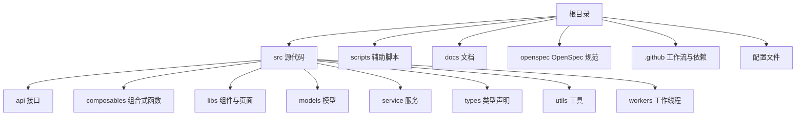
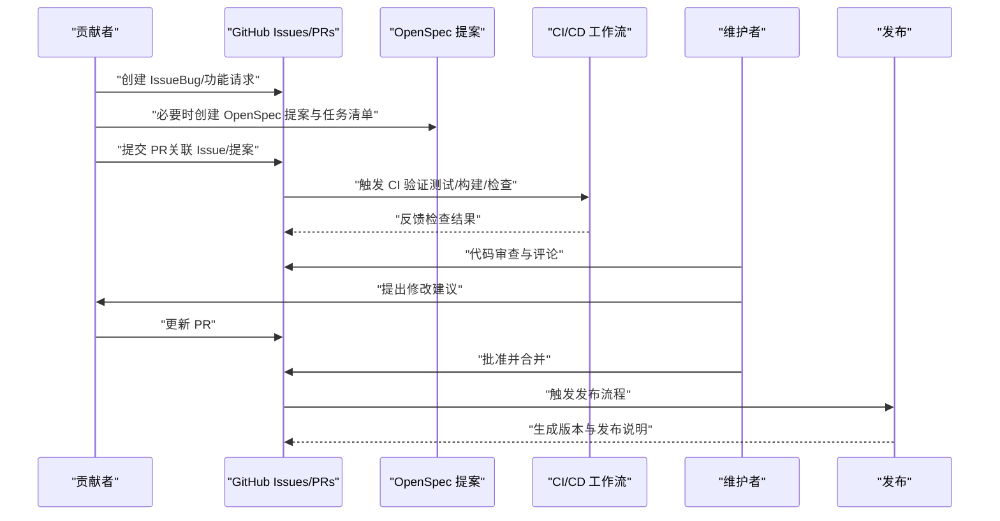
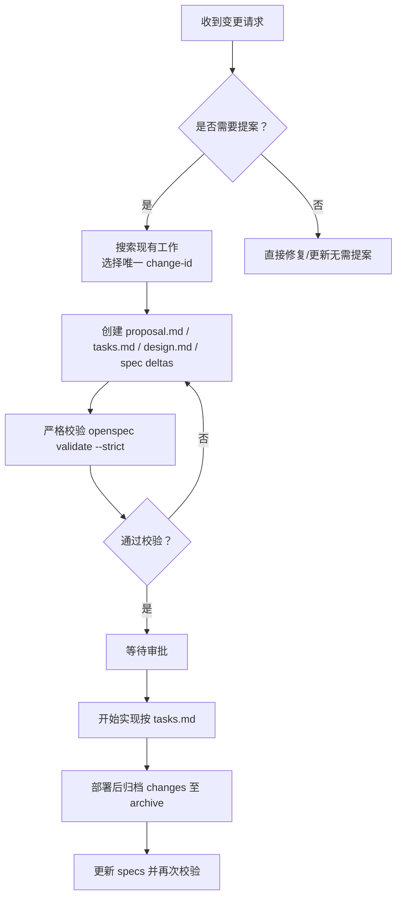
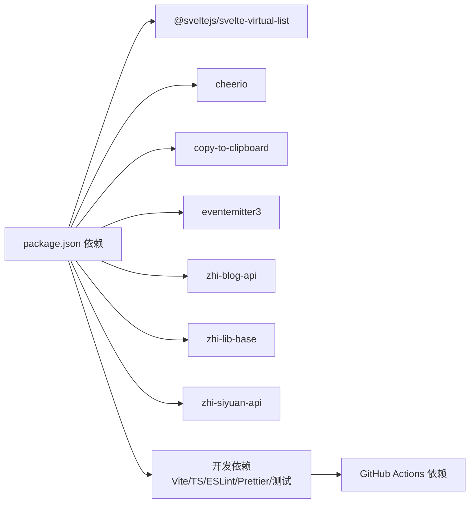

# 贡献指南

<cite>
**本文引用的文件**
- [README.md](file://README.md)
- [README_zh_CN.md](file://README_zh_CN.md)
- [package.json](file://package.json)
- [plugin.json](file://plugin.json)
- [.eslintrc.cjs](file://.eslintrc.cjs)
- [.prettierrc.cjs](file://.prettierrc.cjs)
- [.github/dependabot.yml](file://.github/dependabot.yml)
- [.github/workflows/ci.yml](file://.github/workflows/ci.yml)
- [.github/workflows/release-please.yml](file://.github/workflows/release-please.yml)
- [AGENTS.md](file://AGENTS.md)
- [CLAUDE.md](file://CLAUDE.md)
- [openspec/AGENTS.md](file://openspec/AGENTS.md)
- [TESTING_CHECKLIST.md](file://TESTING_CHECKLIST.md)
</cite>

## 目录
1. [简介](#简介)
2. [项目结构](#项目结构)
3. [核心组件](#核心组件)
4. [架构总览](#架构总览)
5. [详细组件分析](#详细组件分析)
6. [依赖分析](#依赖分析)
7. [性能考虑](#性能考虑)
8. [故障排查指南](#故障排查指南)
9. [结论](#结论)
10. [附录](#附录)

## 简介
本指南面向希望参与“思源笔记分享专业版”项目的贡献者，系统阐述如何参与开源贡献、提交代码与报告问题，以及文档化的 Pull Request 流程、代码审查标准、合并策略、Issue 模板使用、Bug 报告规范、功能请求流程、社区行为准则、沟通方式、协作规范、贡献者许可协议、版权声明与知识产权说明、维护者职责、项目治理与决策流程，以及新贡献者入门指南、学习资源与导师制度等。

本项目采用 MIT 许可证，遵循 ESLint 与 Prettier 的代码风格约定，并通过 GitHub Actions 实现 CI/CD 与发布自动化。项目还引入 OpenSpec 规范驱动的变更提案与归档流程，确保重大改动在落地前经过充分讨论与验证。

章节来源
- [README.md:1-21](file://README.md#L1-L21)
- [README_zh_CN.md:1-17](file://README_zh_CN.md#L1-L17)
- [package.json:1-54](file://package.json#L1-L54)
- [plugin.json:1-35](file://plugin.json#L1-L35)

## 项目结构
项目采用前端插件架构，核心由 TypeScript/Svelte 构建，配合 Vite 打包与测试框架 Vitest。根目录包含构建脚本、配置文件、国际化资源、核心业务模块（服务层、模型层、工具层、工作线程等），以及文档与规范目录。

- 核心目录与职责概览
  - src：源代码，包含 API、组合式函数、国际化、调用封装、组件与页面、模型、服务、类型声明、工具与工作线程等
  - scripts：开发与发布辅助脚本（版本同步、打包、链接等）
  - docs：项目文档（含计划与进展）
  - openspec：OpenSpec 规范与变更提案体系
  - .github：CI/CD 工作流与依赖更新配置
  - 配置文件：ESLint、Prettier、Vite、TypeScript、包管理器锁定文件等

章节来源
- [package.json:1-54](file://package.json#L1-L54)
- [plugin.json:1-35](file://plugin.json#L1-L35)

## 核心组件
- 代码质量与风格
  - ESLint：基于推荐规则集与 TypeScript、Svelte 插件，结合 Prettier 规则，覆盖注释、分号、未使用变量等规则调整
  - Prettier：统一缩进、引号、行长与 Svelte 插件支持
- 构建与测试
  - Vite：开发、构建与预览
  - Vitest：单元测试与监听
- 依赖更新与评审
  - Dependabot：每日扫描 npm 与 GitHub Actions 依赖，自动创建 PR 并分配至维护者
- 发布与版本
  - GitHub Actions：CI/CD 与发布自动化（release-please）
- 规范与治理
  - OpenSpec：变更提案、设计与归档流程，确保重大改动受控

章节来源
- [.eslintrc.cjs:1-46](file://.eslintrc.cjs#L1-L46)
- [.prettierrc.cjs:1-32](file://.prettierrc.cjs#L1-L32)
- [.github/dependabot.yml:1-39](file://.github/dependabot.yml#L1-L39)
- [.github/workflows/ci.yml](file://.github/workflows/ci.yml)
- [.github/workflows/release-please.yml](file://.github/workflows/release-please.yml)
- [openspec/AGENTS.md:1-457](file://openspec/AGENTS.md#L1-L457)

## 架构总览
下图展示贡献流程的关键环节：从 Issue 提交、OpenSpec 变更提案、PR 提交与 CI/CD 验证，到合并与发布。

图表来源
- [.github/workflows/ci.yml](file://.github/workflows/ci.yml)
- [.github/workflows/release-please.yml](file://.github/workflows/release-please.yml)
- [openspec/AGENTS.md:143-213](file://openspec/AGENTS.md#L143-L213)

章节来源
- [openspec/AGENTS.md:143-213](file://openspec/AGENTS.md#L143-L213)
- [.github/workflows/ci.yml](file://.github/workflows/ci.yml)
- [.github/workflows/release-please.yml](file://.github/workflows/release-please.yml)

## 详细组件分析

### 贡献入口与沟通渠道
- 官方公告与功能介绍：通过 README 中的链接了解产品背景与功能
- 注册码与试用：README_zh_CN 提供购买与试用申请方式
- 沟通与支持：README 与 README_zh_CN 提供邮箱与 Issue 留言渠道

章节来源
- [README.md:1-21](file://README.md#L1-L21)
- [README_zh_CN.md:1-17](file://README_zh_CN.md#L1-L17)

### Issue 模板与报告规范
- Bug 报告
  - 环境信息：插件版本、最小应用版本、操作系统与浏览器
  - 复现步骤：清晰的步骤与期望/实际结果
  - 日志与截图：控制台日志、网络请求、错误截图
  - 附加信息：是否可复现、是否影响范围、相关配置
- 功能请求
  - 背景与动机：为什么需要该功能
  - 期望行为：具体场景下的行为描述
  - 可选：是否已有替代方案、对现有功能的影响评估
- 优先级与标签
  - 通过标签区分类型（缺陷、增强、文档等）与优先级
  - 依赖更新类 Issue 可由 Dependabot 自动生成

章节来源
- [.github/dependabot.yml:1-39](file://.github/dependabot.yml#L1-L39)

### Pull Request 流程与代码审查标准
- PR 提交流程
  - 基于最新分支创建功能/修复分支
  - 关联 Issue 或 OpenSpec 提案
  - 提交 PR 并填写审查清单
- 代码审查标准
  - 代码风格：符合 ESLint 与 Prettier 规则
  - 可测试性：新增/修改逻辑具备可测试性，补充单元测试
  - 文档与注释：变更涉及用户可见行为时，完善文档与注释
  - 兼容性：避免破坏性变更；如必须，需在提案中明确迁移路径
  - 性能与安全：避免引入性能瓶颈与安全风险
- 合并策略
  - 必须通过 CI 验证与至少一位维护者批准
  - 优先使用 Squash 合并以保持提交历史整洁
  - 合并前确保 OpenSpec 提案已归档或对应任务完成

章节来源
- [.eslintrc.cjs:1-46](file://.eslintrc.cjs#L1-L46)
- [.prettierrc.cjs:1-32](file://.prettierrc.cjs#L1-L32)
- [openspec/AGENTS.md:49-64](file://openspec/AGENTS.md#L49-L64)

### OpenSpec 变更提案与归档
- 何时需要提案
  - 新功能、破坏性变更、架构调整、性能/安全优化、重大配置变更
- 提案流程
  - 搜索现有工作，选择唯一 change-id，创建 proposal.md、tasks.md、可选 design.md 与 spec deltas
  - 使用严格模式校验，修复问题后再提交
  - 等待审批后开始实现
- 归档流程
  - 部署后移动 changes 至 archive，更新 specs，运行严格校验

图表来源
- [openspec/AGENTS.md:143-213](file://openspec/AGENTS.md#L143-L213)
- [openspec/AGENTS.md:290-316](file://openspec/AGENTS.md#L290-L316)

章节来源
- [openspec/AGENTS.md:143-213](file://openspec/AGENTS.md#L143-L213)
- [openspec/AGENTS.md:290-316](file://openspec/AGENTS.md#L290-L316)

### 依赖更新与安全
- Dependabot 自动扫描 npm 与 GitHub Actions 依赖，每日创建 PR
- 维护者负责审阅与合并，确保版本兼容与安全性

章节来源
- [.github/dependabot.yml:1-39](file://.github/dependabot.yml#L1-L39)

### 测试与质量保障
- 测试清单覆盖并发控制、智能重试、队列管理、虚拟滚动、Web Worker、缓存机制、黑名单集成、服务端分页保护、真正增量检测、统一分页 UI、Mock 数据等
- 建议在 PR 中补充针对变更点的测试用例，确保回归不被破坏

章节来源
- [TESTING_CHECKLIST.md:1-838](file://TESTING_CHECKLIST.md#L1-L838)

### 代码风格与质量工具
- ESLint：推荐规则 + TypeScript + Svelte 插件 + Prettier
- Prettier：统一格式化策略
- 建议在本地启用编辑器格式化钩子，保证提交前一致性

章节来源
- [.eslintrc.cjs:1-46](file://.eslintrc.cjs#L1-L46)
- [.prettierrc.cjs:1-32](file://.prettierrc.cjs#L1-L32)

### 发布与版本管理
- 通过 release-please 工作流自动化生成版本与发布说明
- 版本号与变更日志由脚本同步，确保一致性

章节来源
- [.github/workflows/release-please.yml](file://.github/workflows/release-please.yml)
- [package.json:10-21](file://package.json#L10-L21)

## 依赖分析
- 外部依赖：Svelte 生态、SiYuan 插件 API、博客与通用库等
- 开发依赖：Vite、TypeScript、ESLint、Prettier、测试框架等
- 依赖更新：Dependabot 自动化处理，维护者评审与合并

图表来源
- [package.json:43-51](file://package.json#L43-L51)
- [.github/dependabot.yml:1-39](file://.github/dependabot.yml#L1-L39)

章节来源
- [package.json:43-51](file://package.json#L43-L51)
- [.github/dependabot.yml:1-39](file://.github/dependabot.yml#L1-L39)

## 性能考虑
- 增量检测：仅检测自上次分享以来修改的文档，降低服务端与客户端压力
- 分页加载：客户端与服务端均采用分页，避免一次性加载导致内存与性能问题
- 并发控制：批量分享时限制并发数，避免资源争用
- 缓存机制：变更检测结果在一定时间内复用，减少重复计算
- 虚拟滚动：大数据量场景下仅渲染可见区域，保证 UI 流畅
- Web Worker：异步变更检测，避免阻塞主线程

章节来源
- [TESTING_CHECKLIST.md:1-838](file://TESTING_CHECKLIST.md#L1-L838)

## 故障排查指南
- 增量分享功能常见问题
  - 并发数超过限制：检查并发控制与日志输出
  - 智能重试失败：区分网络错误、服务端 5xx 与客户端 4xx，按策略重试或立即失败
  - 队列暂停/恢复：确认队列状态与任务状态
  - 断点续传：重启后恢复未完成队列
  - 虚拟滚动卡顿：检查 DOM 节点数量与 FPS
  - Web Worker 阻塞：确认主线程未被长时间阻塞
  - 缓存命中/失效：验证缓存时间与清除逻辑
  - 黑名单过滤：确认黑名单项与哈希集合查询
  - 服务端分页：确认分页参数与安全上限
  - 真正增量检测：验证时间戳传递与 SQL 过滤
- 建议排查步骤
  - 打开浏览器开发者工具，观察 Network 与 Console
  - 使用内置进度与状态接口查看队列与任务详情
  - 对照测试清单逐项验证

章节来源
- [TESTING_CHECKLIST.md:1-838](file://TESTING_CHECKLIST.md#L1-L838)

## 结论
本指南为“思源笔记分享专业版”贡献者提供了从入门到协作的完整路径：明确 Issue 与 PR 流程、遵循 OpenSpec 变更治理、遵守代码风格与质量标准、利用 CI/CD 与测试清单保障质量，并通过 Dependabot 与发布工作流维持版本与依赖健康。欢迎新老贡献者加入，共同推动项目演进。

## 附录

### 社区行为准则与沟通方式
- 行为准则
  - 尊重与包容：尊重不同观点与背景
  - 建设性反馈：以事实与数据为基础进行讨论
  - 保密与安全：不泄露敏感信息
- 沟通方式
  - Issue/PR：优先使用英文，必要时附中文说明
  - 邮件与公告：重要事项通过 README 中提供的渠道沟通

章节来源
- [README.md:1-21](file://README.md#L1-L21)
- [README_zh_CN.md:1-17](file://README_zh_CN.md#L1-L17)

### 协作规范与导师制度
- 新贡献者入门
  - 阅读 README 与 README_zh_CN，了解产品与试用流程
  - 从简单 Issue（如文档、排版、小修复）入手
  - 参考测试清单与代码风格，确保 PR 质量
- 导师制度
  - 维护者负责指导新贡献者理解架构与规范
  - OpenSpec 提案阶段由资深维护者协助梳理需求与技术方案

章节来源
- [openspec/AGENTS.md:1-457](file://openspec/AGENTS.md#L1-L457)

### 贡献者许可协议、版权声明与知识产权
- 许可证：MIT
- 著作权与版权声明：遵循 Prettier 配置中的版权与免责条款
- 知识产权：贡献者保留个人版权，授予项目使用许可；第三方依赖遵循各自许可证

章节来源
- [package.json:9](file://package.json#L9)
- [.prettierrc.cjs:1-32](file://.prettierrc.cjs#L1-L32)

### 维护者职责与项目治理
- 维护者职责
  - 审阅 PR 与 Issue，确保质量与一致性
  - 推动 OpenSpec 提案落地与归档
  - 管理依赖更新与安全补丁
  - 维护 CI/CD 与发布流程
- 决策流程
  - 重大变更通过 OpenSpec 提案与评审
  - 一般修复与改进可直接处理，但需遵循规范与测试

章节来源
- [openspec/AGENTS.md:49-64](file://openspec/AGENTS.md#L49-L64)
- [.github/dependabot.yml:1-39](file://.github/dependabot.yml#L1-L39)