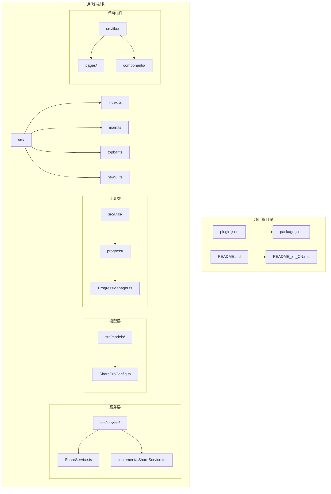
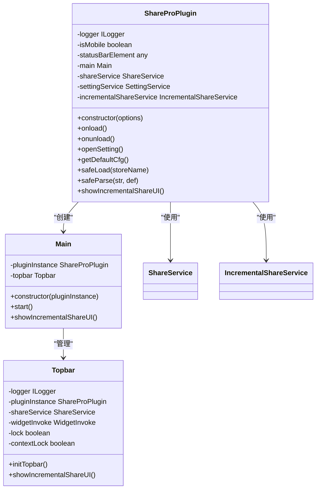
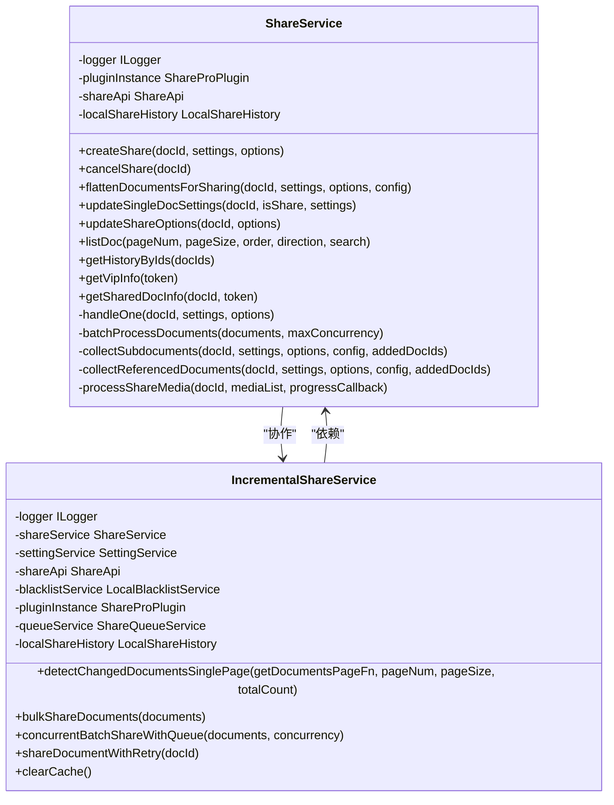
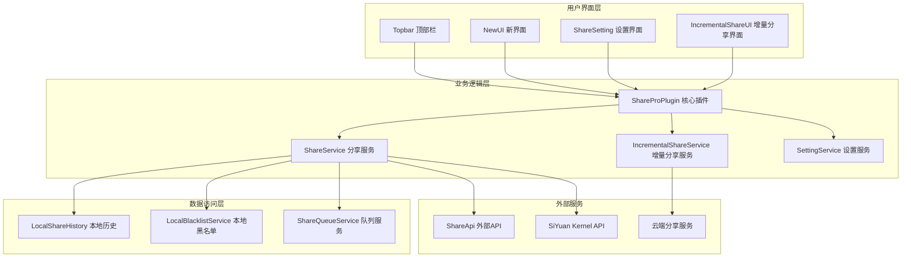
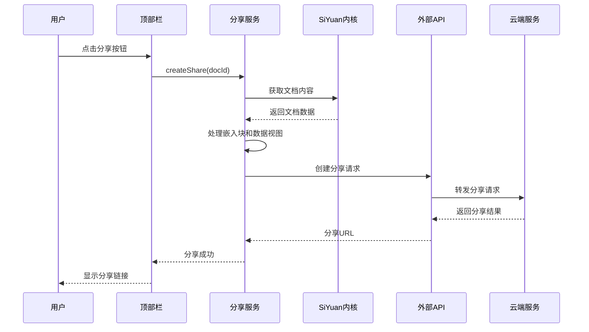
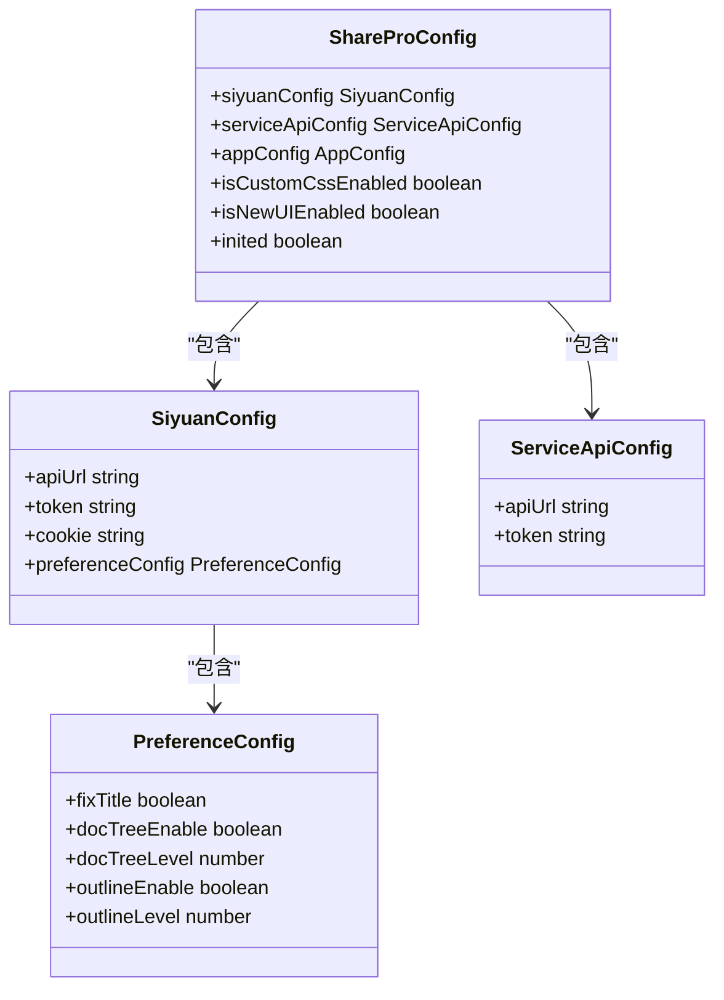
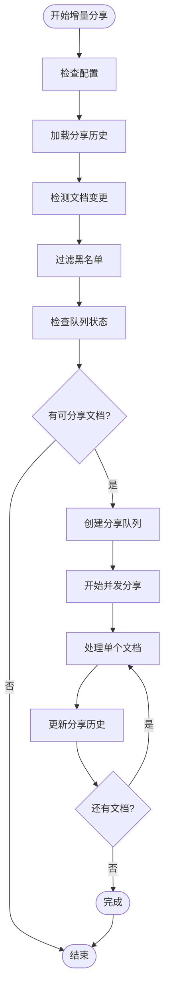
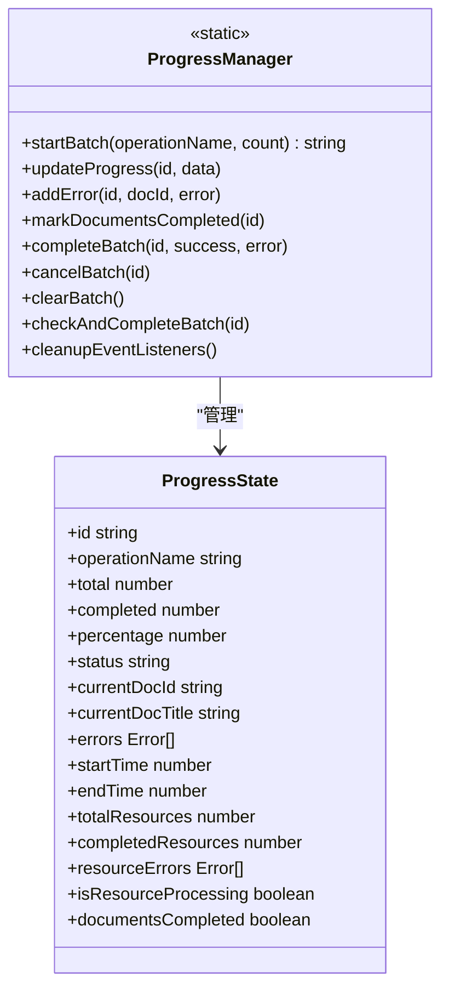
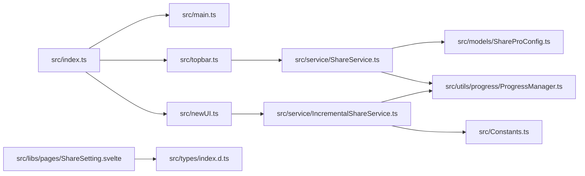

# AI助手指导文档

<cite>
**本文档引用的文件**
- [plugin.json](file://plugin.json)
- [package.json](file://package.json)
- [README.md](file://README.md)
- [README_zh_CN.md](file://README_zh_CN.md)
- [src/index.ts](file://src/index.ts)
- [src/main.ts](file://src/main.ts)
- [src/topbar.ts](file://src/topbar.ts)
- [src/newUI.ts](file://src/newUI.ts)
- [src/service/ShareService.ts](file://src/service/ShareService.ts)
- [src/service/IncrementalShareService.ts](file://src/service/IncrementalShareService.ts)
- [src/models/ShareProConfig.ts](file://src/models/ShareProConfig.ts)
- [src/Constants.ts](file://src/Constants.ts)
- [src/utils/progress/ProgressManager.ts](file://src/utils/progress/ProgressManager.ts)
- [src/libs/pages/ShareSetting.svelte](file://src/libs/pages/ShareSetting.svelte)
- [src/types/index.d.ts](file://src/types/index.d.ts)
</cite>

## 目录
1. [简介](#简介)
2. [项目结构](#项目结构)
3. [核心组件](#核心组件)
4. [架构概览](#架构概览)
5. [详细组件分析](#详细组件分析)
6. [依赖分析](#依赖分析)
7. [性能考虑](#性能考虑)
8. [故障排除指南](#故障排除指南)
9. [结论](#结论)

## 简介

Share Pro 是一个专为 SiYuan 笔记设计的在线分享插件，提供了一键分享功能，支持子文档和引用文档的批量分享。该插件采用现代化的前端技术栈，包括 Svelte、TypeScript 和 Vite 构建工具，为用户提供流畅的分享体验。

### 主要特性

- **一键分享**：支持单个或批量文档分享
- **子文档分享**：自动收集和分享子文档
- **引用文档分享**：支持多层级引用文档分享
- **增量分享**：智能检测文档变更，仅分享更新内容
- **多语言支持**：内置中英文界面
- **进度监控**：实时显示分享进度和状态
- **黑名单管理**：可配置不分享的文档列表

## 项目结构

该项目采用模块化的组织方式，主要分为以下几个核心目录：



**图表来源**
- [src/index.ts:1-178](file://src/index.ts#L1-178)
- [src/main.ts:1-34](file://src/main.ts#L1-34)
- [src/topbar.ts:1-297](file://src/topbar.ts#L1-297)

**章节来源**
- [plugin.json:1-35](file://plugin.json#L1-35)
- [package.json:1-54](file://package.json#L1-54)

## 核心组件

### 插件主入口

ShareProPlugin 类是整个插件的核心入口点，负责初始化各个服务组件和用户界面。



**图表来源**
- [src/index.ts:33-178](file://src/index.ts#L33-178)
- [src/main.ts:12-34](file://src/main.ts#L12-34)
- [src/topbar.ts:26-98](file://src/topbar.ts#L26-98)

### 分享服务架构

ShareService 提供了完整的文档分享功能，包括单文档分享、批量分享、媒体资源处理等核心功能。



**图表来源**
- [src/service/ShareService.ts:45-1120](file://src/service/ShareService.ts#L45-1120)
- [src/service/IncrementalShareService.ts:98-690](file://src/service/IncrementalShareService.ts#L98-690)

**章节来源**
- [src/service/ShareService.ts:45-1120](file://src/service/ShareService.ts#L45-1120)
- [src/service/IncrementalShareService.ts:98-690](file://src/service/IncrementalShareService.ts#L98-690)

## 架构概览

### 整体架构设计



**图表来源**
- [src/index.ts:33-178](file://src/index.ts#L33-178)
- [src/topbar.ts:41-98](file://src/topbar.ts#L41-98)
- [src/newUI.ts:53-122](file://src/newUI.ts#L53-122)

### 数据流处理



**图表来源**
- [src/topbar.ts:51-76](file://src/topbar.ts#L51-76)
- [src/service/ShareService.ts:75-89](file://src/service/ShareService.ts#L75-89)

## 详细组件分析

### 配置管理系统

ShareProConfig 类负责管理插件的所有配置信息，包括 SiYuan 连接配置、服务API配置和应用配置。



**图表来源**
- [src/models/ShareProConfig.ts:13-40](file://src/models/ShareProConfig.ts#L13-40)

### 增量分享流程

增量分享是该插件的核心功能之一，通过智能检测文档变更来实现高效的批量分享。



**图表来源**
- [src/service/IncrementalShareService.ts:269-351](file://src/service/IncrementalShareService.ts#L269-351)
- [src/service/IncrementalShareService.ts:479-577](file://src/service/IncrementalShareService.ts#L479-577)

### 进度管理系统

ProgressManager 提供了完整的批量操作进度跟踪功能，支持文档分享和媒体资源处理的双重进度监控。



**图表来源**
- [src/utils/progress/ProgressManager.ts:8-244](file://src/utils/progress/ProgressManager.ts#L8-244)

**章节来源**
- [src/utils/progress/ProgressManager.ts:8-244](file://src/utils/progress/ProgressManager.ts#L8-244)

## 依赖分析

### 外部依赖关系

```mermaid
graph TB
subgraph "核心依赖"
A[zhi-siyuan-api] --> B[SiYuan内核通信]
C[zhi-blog-api] --> D[博客API集成]
E[zhi-lib-base] --> F[基础工具库]
end
subgraph "UI框架"
G[svelte] --> H[组件化开发]
I[@sveltejs/svelte-virtual-list] --> J[虚拟列表]
end
subgraph "工具库"
K[eventemitter3] --> L[事件处理]
M[cheerio] --> N[HTML解析]
O[copy-to-clipboard] --> P[剪贴板操作]
end
subgraph "构建工具"
Q[vite] --> R[快速构建]
S[typescript] --> T[类型安全]
end
```

**图表来源**
- [package.json:43-51](file://package.json#L43-51)

### 内部模块依赖



**图表来源**
- [src/index.ts:14-31](file://src/index.ts#L14-31)
- [src/topbar.ts:13-18](file://src/topbar.ts#L13-18)

**章节来源**
- [package.json:43-51](file://package.json#L43-51)

## 性能考虑

### 并发控制策略

插件采用了多层并发控制机制来确保大规模文档分享的性能和稳定性：

1. **批量分享并发限制**：默认限制为10个并发任务
2. **媒体资源处理分组**：每批处理5个媒体资源
3. **增量分享队列管理**：支持暂停和恢复功能
4. **智能重试机制**：针对网络错误和服务器错误的指数退避策略

### 缓存优化

- **变更检测缓存**：5分钟有效期的变更检测结果缓存
- **分享历史缓存**：本地内存缓存减少重复查询
- **配置缓存**：避免频繁的配置读取操作

### 内存管理

- **事件监听器清理**：批量操作完成后自动清理事件监听器
- **资源及时释放**：使用Promise.race模式确保任务完成后的资源释放
- **队列状态管理**：支持队列的暂停、恢复和清理功能

## 故障排除指南

### 常见问题诊断

| 问题类型 | 症状 | 可能原因 | 解决方案 |
|---------|------|---------|----------|
| 分享失败 | 报错"分享失败" | 网络连接问题 | 检查网络连接，重试分享 |
| 无文档ID | "未找到文档" | 页面ID获取失败 | 刷新页面，重新打开文档 |
| VIP验证失败 | "VIP验证失败" | 许可证无效 | 检查许可证状态，重新输入 |
| 媒体资源上传失败 | 图片无法显示 | 媒体资源访问权限 | 检查图片URL，确认可访问性 |
| 增量分享无响应 | 界面卡死 | 队列阻塞 | 暂停并重启增量分享 |

### 调试信息收集

1. **启用开发者模式**：设置 `DEV_MODE=true`
2. **查看日志输出**：在浏览器控制台查看详细日志
3. **检查配置文件**：验证 `share-pro.json` 配置正确性
4. **网络请求监控**：检查API请求和响应状态

### 性能优化建议

1. **合理设置并发数**：根据网络环境调整并发限制
2. **定期清理缓存**：清除过期的变更检测缓存
3. **优化文档结构**：减少深层嵌套的文档层级
4. **监控资源使用**：关注内存和CPU使用情况

**章节来源**
- [src/service/IncrementalShareService.ts:585-688](file://src/service/IncrementalShareService.ts#L585-688)

## 结论

Share Pro 插件通过其模块化的设计和完善的架构，为 SiYuan 用户提供了强大而易用的在线分享功能。其核心优势包括：

1. **功能完整性**：涵盖单文档、批量分享、增量分享等多种场景
2. **用户体验**：直观的界面设计和实时的进度反馈
3. **性能优化**：智能的并发控制和缓存机制
4. **扩展性**：清晰的模块分离便于功能扩展

该插件不仅满足了基本的分享需求，还通过增量分享等高级功能提升了用户的生产力。随着 SiYuan 生态系统的不断发展，Share Pro 有望成为用户日常工作中不可或缺的工具。

未来的发展方向可能包括：
- 更智能的文档分类和推荐
- 更丰富的分享模板和样式
- 更强大的批量处理能力
- 更好的跨平台兼容性