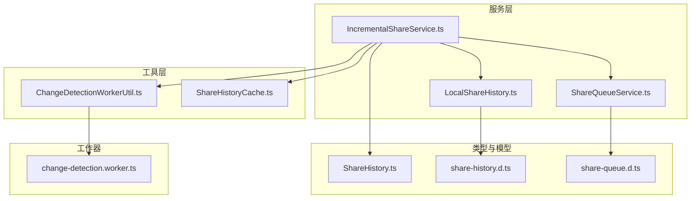
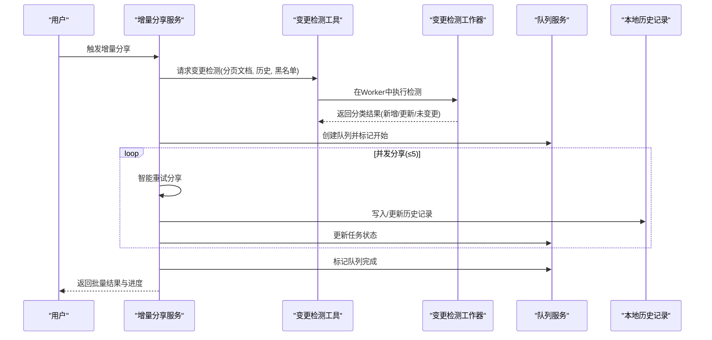
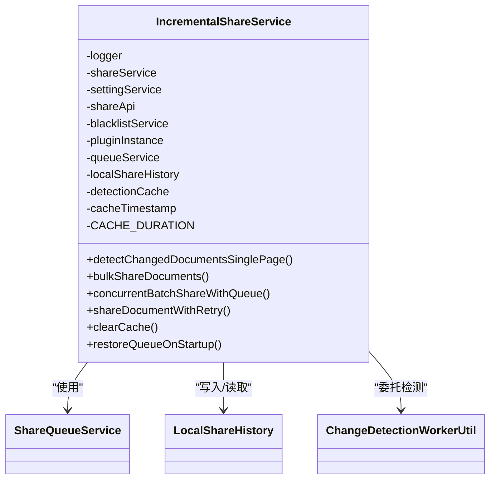
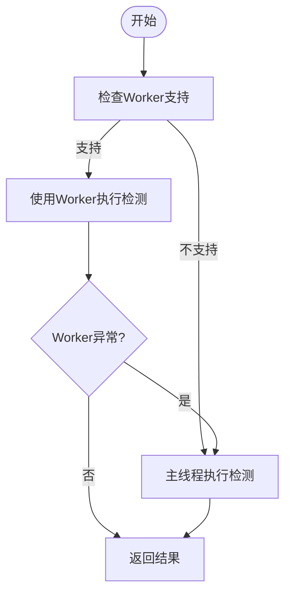
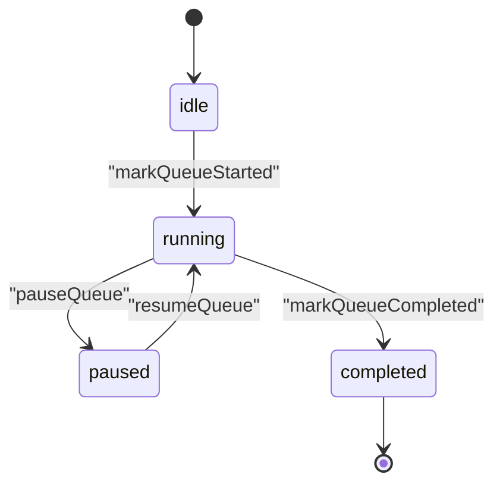
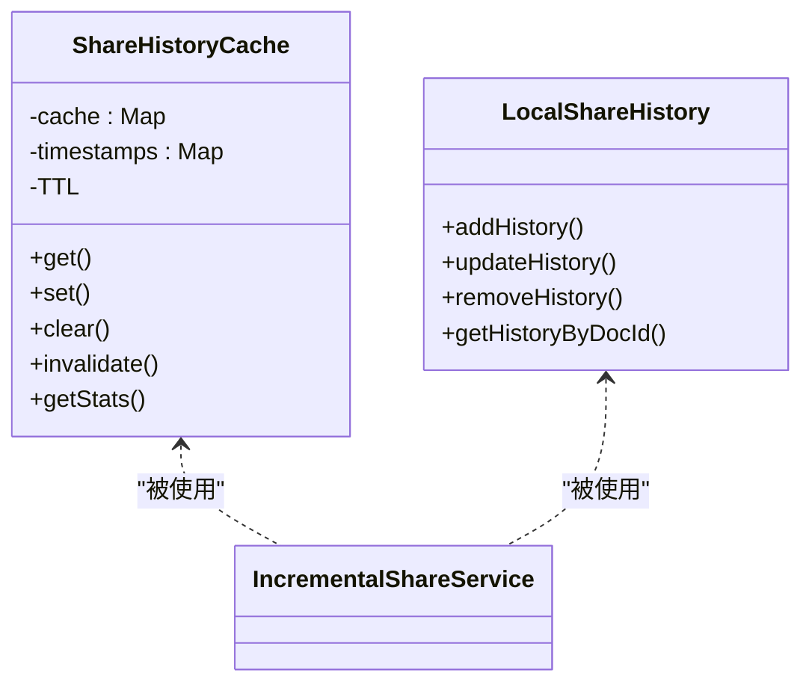
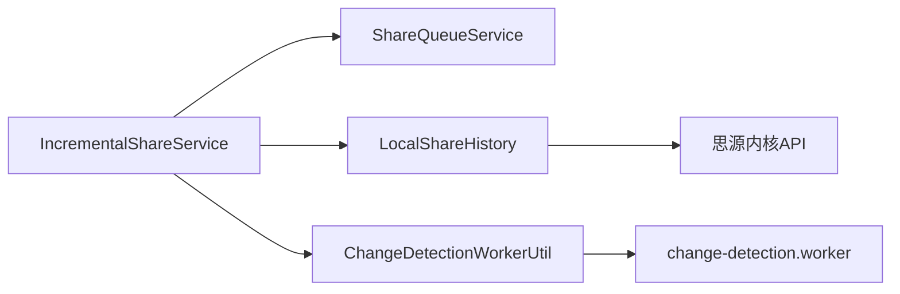
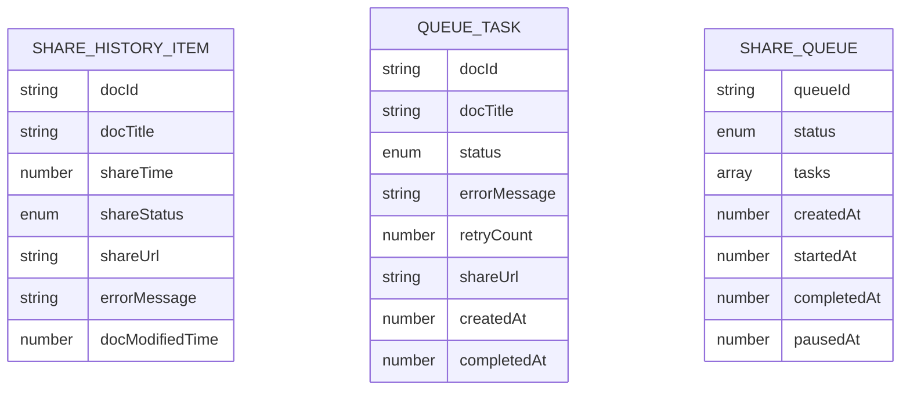

# 增量分享规范

<cite>
**本文引用的文件**
- [IncrementalShareService.ts](file://src/service/IncrementalShareService.ts)
- [change-detection.worker.ts](file://src/workers/change-detection.worker.ts)
- [ChangeDetectionWorkerUtil.ts](file://src/utils/ChangeDetectionWorkerUtil.ts)
- [ShareQueueService.ts](file://src/service/ShareQueueService.ts)
- [ShareHistoryCache.ts](file://src/utils/ShareHistoryCache.ts)
- [ShareHistory.ts](file://src/models/ShareHistory.ts)
- [LocalShareHistory.ts](file://src/service/LocalShareHistory.ts)
- [proposal.md](file://openspec/changes/archive/add-incremental-sharing/proposal.md)
- [spec.md](file://openspec/changes/archive/add-incremental-sharing/specs/share/spec.md)
- [share-queue.d.ts](file://src/types/share-queue.d.ts)
- [share-history.d.ts](file://src/types/share-history.d.ts)
</cite>

## 目录
1. [简介](#简介)
2. [项目结构](#项目结构)
3. [核心组件](#核心组件)
4. [架构总览](#架构总览)
5. [详细组件分析](#详细组件分析)
6. [依赖分析](#依赖分析)
7. [性能考虑](#性能考虑)
8. [故障排查指南](#故障排查指南)
9. [结论](#结论)
10. [附录](#附录)

## 简介
本规范面向思源笔记分享专业版的“增量分享”功能，系统化阐述其核心算法、变更检测机制、实现标准与工程实践。文档覆盖以下要点：
- 增量分享与全量分享的差异、适用场景与性能对比
- 变更检测的触发条件、检测范围与精度控制
- 增量分享工作流程、并发控制、队列管理与资源管理
- 智能重试策略、缓存与黑名单过滤机制
- 配置选项、限制条件与故障处理
- 与外部系统的集成规范与数据同步策略

## 项目结构
增量分享功能由服务层、工具层、模型层与类型层协同实现，核心文件分布如下：
- 服务层：增量分享服务、队列服务、本地历史记录服务
- 工具层：变更检测工具（含回退机制）、历史记录缓存
- 类型与模型：分享历史项、队列状态与任务状态
- 规范文件：变更提案与规格说明，定义了功能边界与质量要求

**图表来源**
- [IncrementalShareService.ts:98-690](file://src/service/IncrementalShareService.ts#L98-L690)
- [ShareQueueService.ts:24-299](file://src/service/ShareQueueService.ts#L24-L299)
- [LocalShareHistory.ts:23-129](file://src/service/LocalShareHistory.ts#L23-L129)
- [ChangeDetectionWorkerUtil.ts:17-148](file://src/utils/ChangeDetectionWorkerUtil.ts#L17-L148)
- [ShareHistoryCache.ts:19-91](file://src/utils/ShareHistoryCache.ts#L19-L91)
- [ShareHistory.ts:13-74](file://src/models/ShareHistory.ts#L13-L74)
- [share-history.d.ts:13-59](file://src/types/share-history.d.ts#L13-L59)
- [share-queue.d.ts:23-149](file://src/types/share-queue.d.ts#L23-L149)
- [change-detection.worker.ts:15-148](file://src/workers/change-detection.worker.ts#L15-L148)

**章节来源**
- [IncrementalShareService.ts:98-690](file://src/service/IncrementalShareService.ts#L98-L690)
- [ShareQueueService.ts:24-299](file://src/service/ShareQueueService.ts#L24-L299)
- [LocalShareHistory.ts:23-129](file://src/service/LocalShareHistory.ts#L23-L129)
- [ChangeDetectionWorkerUtil.ts:17-148](file://src/utils/ChangeDetectionWorkerUtil.ts#L17-L148)
- [ShareHistoryCache.ts:19-91](file://src/utils/ShareHistoryCache.ts#L19-L91)
- [ShareHistory.ts:13-74](file://src/models/ShareHistory.ts#L13-L74)
- [share-history.d.ts:13-59](file://src/types/share-history.d.ts#L13-L59)
- [share-queue.d.ts:23-149](file://src/types/share-queue.d.ts#L23-L149)
- [change-detection.worker.ts:15-148](file://src/workers/change-detection.worker.ts#L15-L148)

## 核心组件
- 增量分享服务：负责变更检测、批量分享、并发控制、队列管理、重试与缓存清理
- 变更检测工具：封装Web Worker与主线程两种执行路径，提供回退机制
- 变更检测工作器：在独立线程中执行分类逻辑（新增/更新/未变更），并支持黑名单过滤
- 队列服务：管理批量分享任务的生命周期、状态与进度
- 历史记录缓存：提供内存级缓存，降低重复查询成本
- 本地历史记录：基于文档属性持久化分享历史，支持版本兼容与更新

**章节来源**
- [IncrementalShareService.ts:98-690](file://src/service/IncrementalShareService.ts#L98-L690)
- [ChangeDetectionWorkerUtil.ts:17-148](file://src/utils/ChangeDetectionWorkerUtil.ts#L17-L148)
- [change-detection.worker.ts:15-148](file://src/workers/change-detection.worker.ts#L15-L148)
- [ShareQueueService.ts:24-299](file://src/service/ShareQueueService.ts#L24-L299)
- [ShareHistoryCache.ts:19-91](file://src/utils/ShareHistoryCache.ts#L19-L91)
- [LocalShareHistory.ts:23-129](file://src/service/LocalShareHistory.ts#L23-L129)

## 架构总览
增量分享的整体架构围绕“变更检测—任务编排—批量分享—状态持久化”展开，采用分层解耦与异步并发策略，确保在大规模知识库场景下的稳定性与性能。

**图表来源**
- [IncrementalShareService.ts:160-351](file://src/service/IncrementalShareService.ts#L160-L351)
- [ChangeDetectionWorkerUtil.ts:36-59](file://src/utils/ChangeDetectionWorkerUtil.ts#L36-L59)
- [change-detection.worker.ts:49-72](file://src/workers/change-detection.worker.ts#L49-L72)
- [ShareQueueService.ts:38-217](file://src/service/ShareQueueService.ts#L38-L217)
- [LocalShareHistory.ts:31-82](file://src/service/LocalShareHistory.ts#L31-L82)

## 详细组件分析

### 增量分享服务（IncrementalShareService）
职责与特性：
- 单页变更检测：按页拉取文档，结合本地历史与黑名单进行分类
- 批量分享：并发控制（默认≤5），队列管理与状态持久化
- 智能重试：网络错误指数退避、5xx延迟重试、4xx即时失败
- 缓存管理：检测结果与历史记录缓存，支持清理
- 队列恢复：启动时尝试恢复未完成队列并暂停

关键流程与接口：
- 单页检测：detectChangedDocumentsSinglePage
- 批量分享：bulkShareDocuments
- 并发分享：concurrentBatchShareWithQueue
- 智能重试：shareDocumentWithRetry
- 缓存清理：clearCache
- 队列恢复：restoreQueueOnStartup

**图表来源**
- [IncrementalShareService.ts:98-129](file://src/service/IncrementalShareService.ts#L98-L129)

**章节来源**
- [IncrementalShareService.ts:160-351](file://src/service/IncrementalShareService.ts#L160-L351)
- [IncrementalShareService.ts:396-577](file://src/service/IncrementalShareService.ts#L396-L577)
- [IncrementalShareService.ts:585-688](file://src/service/IncrementalShareService.ts#L585-L688)

### 变更检测工具与工作器
- 变更检测工具：优先使用Web Worker执行，若不可用则回退到主线程；内部通过宏任务模拟Worker行为
- 变更检测工作器：接收文档、历史与黑名单，输出新增/更新/未变更三类结果，并统计黑名单命中数

**图表来源**
- [ChangeDetectionWorkerUtil.ts:36-59](file://src/utils/ChangeDetectionWorkerUtil.ts#L36-L59)
- [change-detection.worker.ts:49-72](file://src/workers/change-detection.worker.ts#L49-L72)

**章节来源**
- [ChangeDetectionWorkerUtil.ts:36-136](file://src/utils/ChangeDetectionWorkerUtil.ts#L36-L136)
- [change-detection.worker.ts:77-145](file://src/workers/change-detection.worker.ts#L77-L145)

### 队列服务（ShareQueueService）
职责与特性：
- 队列生命周期：创建、暂停/继续、完成标记
- 任务状态：pending/processing/success/failed/skipped
- 进度统计：总任务、已完成、成功、失败、处理中、待处理、预估剩余时间
- 恢复与持久化：从插件配置恢复队列状态

**图表来源**
- [ShareQueueService.ts:38-217](file://src/service/ShareQueueService.ts#L38-L217)
- [share-queue.d.ts:13-149](file://src/types/share-queue.d.ts#L13-L149)

**章节来源**
- [ShareQueueService.ts:38-299](file://src/service/ShareQueueService.ts#L38-L299)
- [share-queue.d.ts:23-149](file://src/types/share-queue.d.ts#L23-L149)

### 历史记录缓存与本地历史
- 历史记录缓存：内存级缓存，TTL 5分钟，命中/失效/清理策略
- 本地历史记录：基于文档属性持久化，支持版本兼容与更新

**图表来源**
- [ShareHistoryCache.ts:19-91](file://src/utils/ShareHistoryCache.ts#L19-L91)
- [LocalShareHistory.ts:23-129](file://src/service/LocalShareHistory.ts#L23-L129)
- [ShareHistory.ts:13-74](file://src/models/ShareHistory.ts#L13-L74)

**章节来源**
- [ShareHistoryCache.ts:19-91](file://src/utils/ShareHistoryCache.ts#L19-L91)
- [LocalShareHistory.ts:31-127](file://src/service/LocalShareHistory.ts#L31-L127)
- [ShareHistory.ts:13-74](file://src/models/ShareHistory.ts#L13-L74)

## 依赖分析
- 组件耦合
  - IncrementalShareService 依赖 ShareQueueService、LocalShareHistory、ChangeDetectionWorkerUtil
  - ChangeDetectionWorkerUtil 依赖 change-detection.worker 的检测逻辑
  - LocalShareHistory 依赖思源内核API进行属性读写
- 外部依赖
  - 思源内核API：文档属性读写、块属性设置
  - 插件配置存储：队列与应用配置的持久化
- 潜在循环依赖
  - 当前模块间为单向依赖，未发现循环

**图表来源**
- [IncrementalShareService.ts:113-125](file://src/service/IncrementalShareService.ts#L113-L125)
- [ChangeDetectionWorkerUtil.ts:17-31](file://src/utils/ChangeDetectionWorkerUtil.ts#L17-L31)
- [LocalShareHistory.ts:34-47](file://src/service/LocalShareHistory.ts#L34-L47)

**章节来源**
- [IncrementalShareService.ts:113-125](file://src/service/IncrementalShareService.ts#L113-L125)
- [ChangeDetectionWorkerUtil.ts:17-31](file://src/utils/ChangeDetectionWorkerUtil.ts#L17-L31)
- [LocalShareHistory.ts:34-47](file://src/service/LocalShareHistory.ts#L34-L47)

## 性能考虑
- 变更检测性能目标
  - 1000文档：< 2秒
  - 5000文档：< 5秒
  - 10000文档：< 10秒
  - 检测期间UI保持响应
- 优化策略
  - 使用Web Worker执行检测，避免阻塞主线程
  - 检测结果缓存5分钟，避免重复计算
  - 批量分享并发数限制为5，避免服务端压力
  - 黑名单过滤使用HashSet，查询复杂度O(1)
  - 分页加载（每页100条）与虚拟滚动
- 资源管理
  - 缓存TTL与清理
  - 队列持久化与恢复
  - 失败任务重试与进度回调

**章节来源**
- [proposal.md:104-115](file://openspec/changes/archive/add-incremental-sharing/proposal.md#L104-L115)
- [spec.md:196-213](file://openspec/changes/archive/add-incremental-sharing/specs/share/spec.md#L196-L213)

## 故障排查指南
- 网络错误
  - 现象：分享失败，指数退避重试
  - 处理：检查网络连通性，等待重试或手动重试失败任务
- 服务端5xx错误
  - 现象：延迟30秒后重试
  - 处理：关注服务端状态，稍后重试
- 4xx错误
  - 现象：立即失败并记录日志
  - 处理：检查参数与权限，修正后重试
- 队列异常
  - 现象：队列状态异常或中断
  - 处理：恢复队列、重置失败任务、继续执行
- 缓存问题
  - 现象：检测结果陈旧
  - 处理：调用clearCache清理缓存，重新检测

**章节来源**
- [IncrementalShareService.ts:585-688](file://src/service/IncrementalShareService.ts#L585-L688)
- [ShareQueueService.ts:183-195](file://src/service/ShareQueueService.ts#L183-L195)
- [ShareHistoryCache.ts:31-44](file://src/utils/ShareHistoryCache.ts#L31-L44)

## 结论
增量分享通过“变更检测—队列编排—并发分享—状态持久化”的闭环，实现了在大型知识库场景下的高效、稳定与可恢复的分享体验。配合黑名单过滤、智能重试与缓存策略，能够在保证性能的同时兼顾可靠性与用户体验。

## 附录

### 增量分享与全量分享对比
- 增量分享
  - 触发条件：基于文档修改时间与历史分享时间的比对
  - 检测范围：仅扫描发生变更的文档
  - 精度控制：以文档修改时间戳为依据，支持黑名单过滤
  - 适用场景：频繁更新、文档量大、只关心变更的场景
- 全量分享
  - 触发条件：用户主动选择或配置触发
  - 检测范围：扫描全部文档
  - 精度控制：按用户选择或配置规则
  - 适用场景：首次分享、需要统一处理的场景

**章节来源**
- [proposal.md:3-7](file://openspec/changes/archive/add-incremental-sharing/proposal.md#L3-L7)
- [spec.md:34-42](file://openspec/changes/archive/add-incremental-sharing/specs/share/spec.md#L34-L42)

### 配置选项与限制条件
- 并发数限制：默认并发≤5
- 缓存策略：检测结果与历史记录缓存，TTL 5分钟
- 黑名单过滤：支持笔记本与文档两级黑名单
- 队列持久化：支持系统重启后恢复
- 性能阈值：见“性能考虑”

**章节来源**
- [IncrementalShareService.ts:317-318](file://src/service/IncrementalShareService.ts#L317-L318)
- [ShareHistoryCache.ts:23-23](file://src/utils/ShareHistoryCache.ts#L23-L23)
- [proposal.md:104-115](file://openspec/changes/archive/add-incremental-sharing/proposal.md#L104-L115)

### 实现指南与最佳实践
- 变更检测
  - 使用分页接口获取文档列表，避免一次性加载过多
  - 优先使用ChangeDetectionWorkerUtil进行检测，确保UI响应
- 批量分享
  - 控制并发数，避免服务端压力
  - 使用队列服务管理任务状态与进度
- 资源管理
  - 定期清理缓存与历史记录
  - 在成功分享后及时更新本地历史并清理缓存
- 错误处理
  - 区分4xx/5xx/网络错误，采用不同重试策略
  - 记录详细日志，便于排查

**章节来源**
- [IncrementalShareService.ts:160-210](file://src/service/IncrementalShareService.ts#L160-L210)
- [IncrementalShareService.ts:269-351](file://src/service/IncrementalShareService.ts#L269-L351)
- [ShareQueueService.ts:130-170](file://src/service/ShareQueueService.ts#L130-L170)

### 数据模型与类型
- 分享历史项：包含文档ID、标题、分享时间、状态、链接、错误信息与文档修改时间戳
- 队列与任务：包含队列ID、状态、任务列表、时间戳与进度统计

**图表来源**
- [ShareHistory.ts:13-48](file://src/models/ShareHistory.ts#L13-L48)
- [share-history.d.ts:13-48](file://src/types/share-history.d.ts#L13-L48)
- [share-queue.d.ts:23-149](file://src/types/share-queue.d.ts#L23-L149)