# 子文档分享规范

<cite>
**本文档引用的文件**
- [openspec/changes/add-subdocument-sharing/specs/share/spec.md](file://openspec/changes/add-subdocument-sharing/specs/share/spec.md)
- [docs/subdocument-share-context-2026-02-28.md](file://docs/subdocument-share-context-2026-02-28.md)
- [src/service/ShareService.ts](file://src/service/ShareService.ts)
- [src/composables/useSiyuanApi.ts](file://src/composables/useSiyuanApi.ts)
- [src/models/SingleDocSetting.ts](file://src/models/SingleDocSetting.ts)
- [src/models/ShareProConfig.ts](file://src/models/ShareProConfig.ts)
- [src/models/ShareOptions.ts](file://src/models/ShareOptions.ts)
- [src/utils/SettingKeys.ts](file://src/utils/SettingKeys.ts)
- [src/utils/AttrUtils.ts](file://src/utils/AttrUtils.ts)
- [src/libs/pages/ShareUI.svelte](file://src/libs/pages/ShareUI.svelte)
- [src/libs/components/subdocument/SubdocumentTreePreview.svelte](file://src/libs/components/subdocument/SubdocumentTreePreview.svelte)
- [src/service/ShareQueueService.ts](file://src/service/ShareQueueService.ts)
- [src/utils/progress/ProgressManager.ts](file://src/utils/progress/ProgressManager.ts)
- [src/types/share-queue.d.ts](file://src/types/share-queue.d.ts)
- [src/i18n/zh_CN.json](file://src/i18n/zh_CN.json)
</cite>

## 目录
1. [简介](#简介)
2. [项目结构](#项目结构)
3. [核心组件](#核心组件)
4. [架构概览](#架构概览)
5. [详细组件分析](#详细组件分析)
6. [依赖关系分析](#依赖关系分析)
7. [性能考虑](#性能考虑)
8. [故障排除指南](#故障排除指南)
9. [结论](#结论)
10. [附录](#附录)

## 简介

思源笔记分享专业版的子文档分享功能是一个重要的增强特性，允许用户在分享主文档的同时自动包含其所有子文档，形成完整的文档树结构。该功能实现了智能的子文档发现机制、层级解析算法和灵活的分享策略。

本规范文档详细说明了子文档分享的完整实现方案，包括数据模型设计、算法实现、UI集成、性能优化和安全控制等方面。

## 项目结构

项目采用模块化架构设计，主要分为以下几个层次：

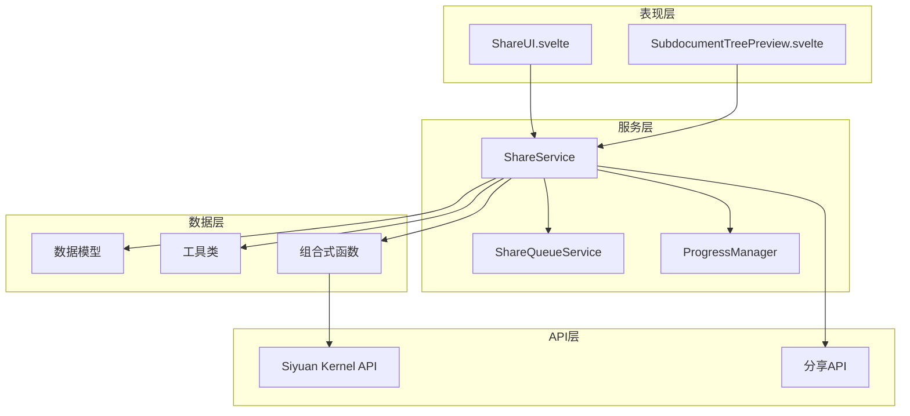

**图表来源**
- [src/service/ShareService.ts:1-1251](file://src/service/ShareService.ts#L1-1251)
- [src/libs/pages/ShareUI.svelte:1-1417](file://src/libs/pages/ShareUI.svelte#L1-1417)
- [src/libs/components/subdocument/SubdocumentTreePreview.svelte:1-553](file://src/libs/components/subdocument/SubdocumentTreePreview.svelte#L1-553)

**章节来源**
- [src/service/ShareService.ts:1-1251](file://src/service/ShareService.ts#L1-1251)
- [src/libs/pages/ShareUI.svelte:1-1417](file://src/libs/pages/ShareUI.svelte#L1-1417)

## 核心组件

### 数据模型层

系统采用三层配置架构，确保配置的层次性和可维护性：

1. **全局配置 (Level 1)** - 存储在 `ShareProConfig.appConfig` 中
2. **文档级配置 (Level 2)** - 存储在文档属性中
3. **分享选项 (Level 3)** - 存储在服务器端

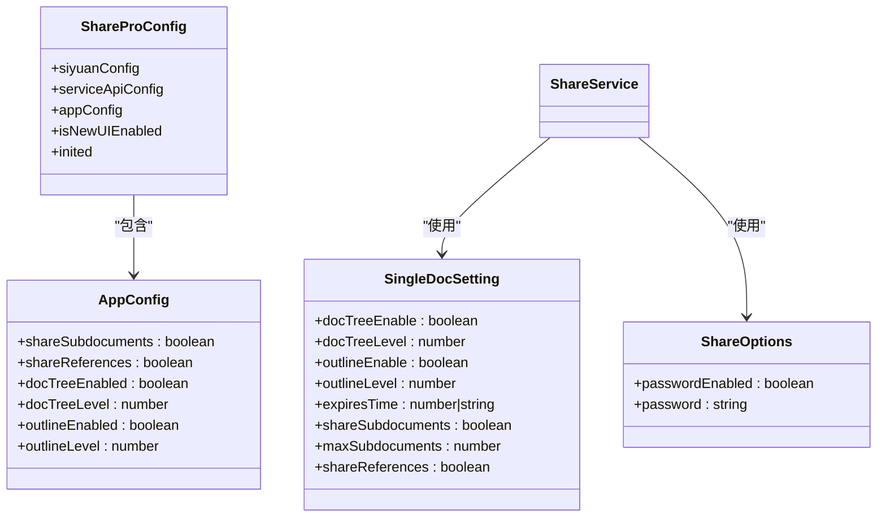

**图表来源**
- [src/models/ShareProConfig.ts:1-40](file://src/models/ShareProConfig.ts#L1-40)
- [src/models/SingleDocSetting.ts:1-85](file://src/models/SingleDocSetting.ts#L1-85)
- [src/models/ShareOptions.ts:1-27](file://src/models/ShareOptions.ts#L1-27)
- [src/models/AppConfig.ts:1-88](file://src/models/AppConfig.ts#L1-88)

**章节来源**
- [src/models/ShareProConfig.ts:1-40](file://src/models/ShareProConfig.ts#L1-40)
- [src/models/SingleDocSetting.ts:1-85](file://src/models/SingleDocSetting.ts#L1-85)
- [src/models/ShareOptions.ts:1-27](file://src/models/ShareOptions.ts#L1-27)
- [src/models/AppConfig.ts:1-88](file://src/models/AppConfig.ts#L1-88)

### 核心服务层

ShareService 是子文档分享功能的核心，负责协调各个组件的工作：

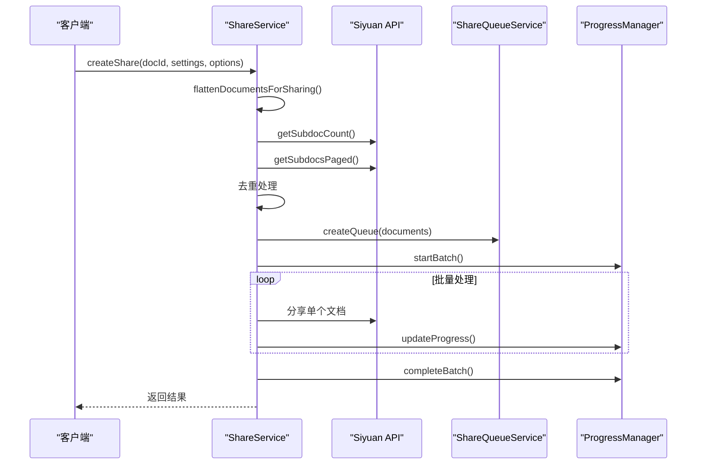

**图表来源**
- [src/service/ShareService.ts:235-258](file://src/service/ShareService.ts#L235-258)
- [src/service/ShareQueueService.ts:38-60](file://src/service/ShareQueueService.ts#L38-60)
- [src/utils/progress/ProgressManager.ts:12-102](file://src/utils/progress/ProgressManager.ts#L12-102)

**章节来源**
- [src/service/ShareService.ts:235-258](file://src/service/ShareService.ts#L235-258)
- [src/service/ShareQueueService.ts:1-299](file://src/service/ShareQueueService.ts#L1-299)
- [src/utils/progress/ProgressManager.ts:1-238](file://src/utils/progress/ProgressManager.ts#L1-238)

## 架构概览

子文档分享功能采用事件驱动的架构模式，通过清晰的职责分离实现松耦合的设计：

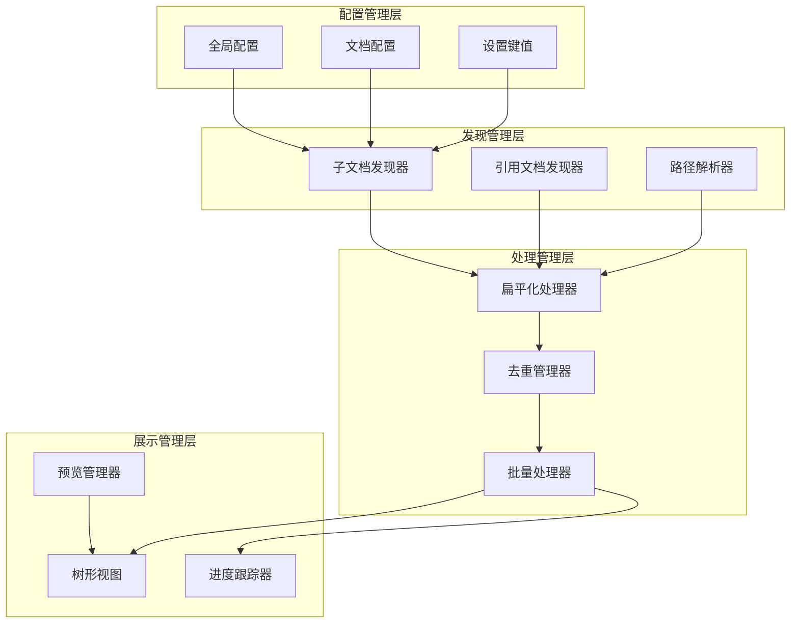

**图表来源**
- [src/service/ShareService.ts:101-226](file://src/service/ShareService.ts#L101-226)
- [src/composables/useSiyuanApi.ts:259-348](file://src/composables/useSiyuanApi.ts#L259-348)

## 详细组件分析

### 子文档发现机制

子文档发现机制基于思源笔记的数据库结构设计，使用SQL查询实现高效的子文档检索：

#### 核心算法实现

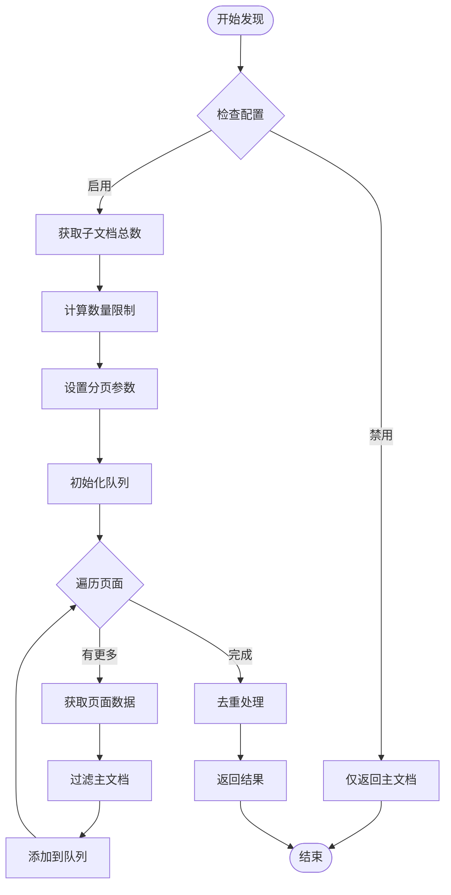

**图表来源**
- [src/service/ShareService.ts:145-226](file://src/service/ShareService.ts#L145-226)
- [src/composables/useSiyuanApi.ts:283-348](file://src/composables/useSiyuanApi.ts#L283-348)

#### SQL查询策略

系统使用两种SQL查询策略来获取子文档信息：

1. **总数查询**：使用COUNT函数快速获取子文档总数
2. **分页查询**：使用LIMIT和OFFSET实现分页加载

**章节来源**
- [src/service/ShareService.ts:145-226](file://src/service/ShareService.ts#L145-226)
- [src/composables/useSiyuanApi.ts:259-348](file://src/composables/useSiyuanApi.ts#L259-348)

### 层级解析算法

层级解析算法采用扁平化策略，不再使用传统的深度控制：

#### 扁平化处理流程

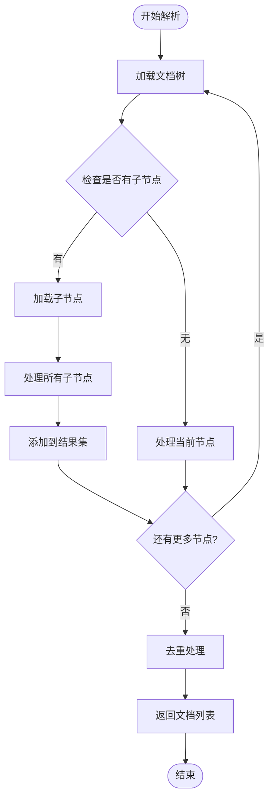

**图表来源**
- [src/libs/components/subdocument/SubdocumentTreePreview.svelte:106-186](file://src/libs/components/subdocument/SubdocumentTreePreview.svelte#L106-186)

#### 懒加载机制

系统实现智能的懒加载机制，仅在需要时加载子节点：

**章节来源**
- [src/libs/components/subdocument/SubdocumentTreePreview.svelte:188-240](file://src/libs/components/subdocument/SubdocumentTreePreview.svelte#L188-240)

### 分享策略

分享策略提供了多种配置选项，满足不同用户的需求：

#### 配置优先级

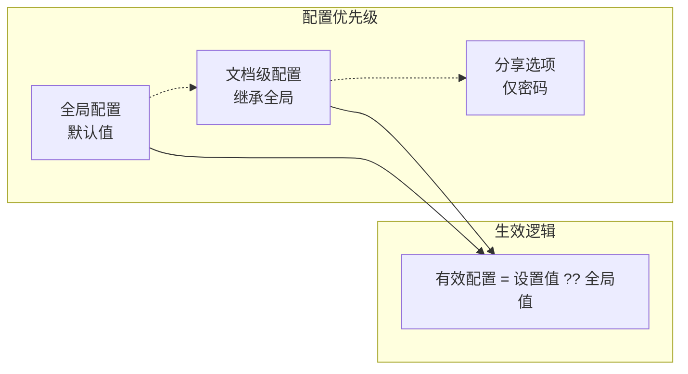

**图表来源**
- [docs/subdocument-share-context-2026-02-28.md:32-36](file://docs/subdocument-share-context-2026-02-28.md#L32-36)

#### 数量限制策略

系统支持灵活的数量限制配置：

| 配置项 | 默认值 | 说明 |
|--------|--------|------|
| `shareSubdocuments` | `true` | 子文档分享默认开启 |
| `maxSubdocuments` | `100` | 默认分享100个子文档 |
| `maxSubdocuments` | `-1` | 无限制模式 |

**章节来源**
- [docs/subdocument-share-context-2026-02-28.md:136-143](file://docs/subdocument-share-context-2026-02-28.md#L136-143)

### 权限控制与安全策略

系统实现了多层次的安全控制机制：

#### 权限验证流程

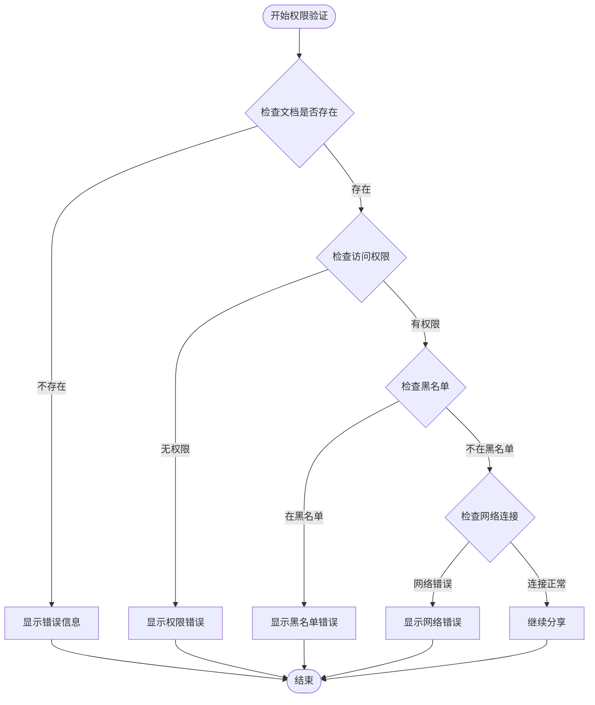

**图表来源**
- [src/service/ShareService.ts:587-730](file://src/service/ShareService.ts#L587-730)

#### 安全控制措施

1. **文档权限验证** - 确保用户有权访问目标文档
2. **黑名单过滤** - 防止分享受限制的文档
3. **网络异常处理** - 实现智能重试机制
4. **资源访问控制** - 限制媒体资源的访问范围

**章节来源**
- [src/service/ShareService.ts:587-730](file://src/service/ShareService.ts#L587-730)

### UI集成与用户体验

#### 紧凑布局设计

系统采用紧凑布局设计，将多个功能集成在一个水平区域内：

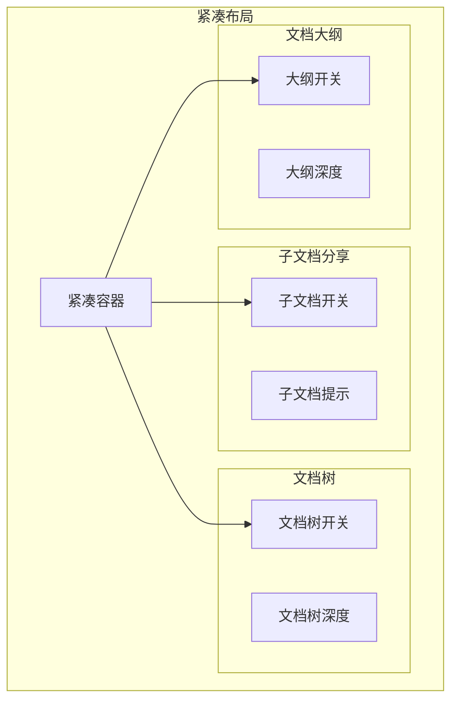

**图表来源**
- [src/libs/pages/ShareUI.svelte:704-800](file://src/libs/pages/ShareUI.svelte#L704-800)

#### 实时预览功能

系统提供实时的子文档树预览功能：

**章节来源**
- [src/libs/pages/ShareUI.svelte:704-800](file://src/libs/pages/ShareUI.svelte#L704-800)
- [src/libs/components/subdocument/SubdocumentTreePreview.svelte:1-553](file://src/libs/components/subdocument/SubdocumentTreePreview.svelte#L1-553)

## 依赖关系分析

### 组件依赖图

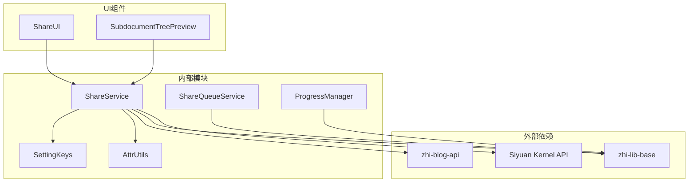

**图表来源**
- [src/service/ShareService.ts:1-56](file://src/service/ShareService.ts#L1-56)
- [src/service/ShareQueueService.ts:1-33](file://src/service/ShareQueueService.ts#L1-33)

### 数据流分析

系统采用单向数据流设计，确保数据的一致性和可预测性：

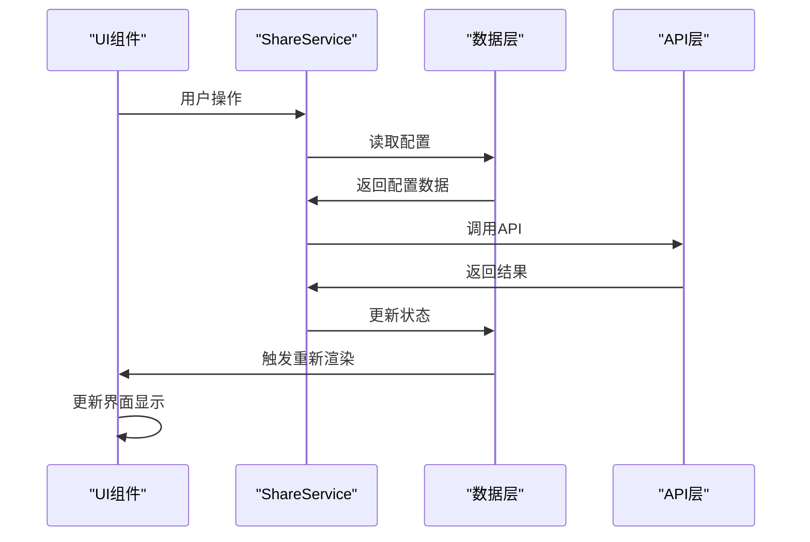

**图表来源**
- [src/libs/pages/ShareUI.svelte:141-216](file://src/libs/pages/ShareUI.svelte#L141-216)
- [src/service/ShareService.ts:235-258](file://src/service/ShareService.ts#L235-258)

**章节来源**
- [src/service/ShareService.ts:1-56](file://src/service/ShareService.ts#L1-56)
- [src/service/ShareQueueService.ts:1-33](file://src/service/ShareQueueService.ts#L1-33)

## 性能考虑

### 性能优化策略

系统实现了多项性能优化措施：

#### 分页加载优化

1. **分页大小**：每次加载50个文档，避免内存溢出
2. **智能缓存**：子文档信息缓存5分钟
3. **并发控制**：最多10个并发请求
4. **异步处理**：不阻塞UI主线程

#### 内存管理

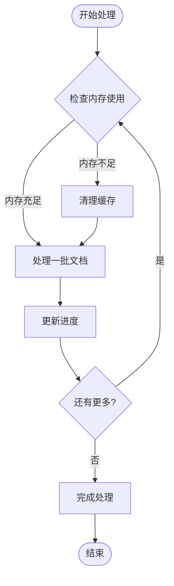

**图表来源**
- [src/service/ShareService.ts:173-190](file://src/service/ShareService.ts#L173-190)

#### 性能监控

系统提供实时的性能监控和统计功能：

**章节来源**
- [src/service/ShareService.ts:173-190](file://src/service/ShareService.ts#L173-190)

### 资源管理

#### 媒体资源处理

系统实现了智能的媒体资源处理机制：

1. **批量处理**：每批最多5个媒体资源
2. **错误恢复**：单个媒体失败不影响整体处理
3. **进度跟踪**：实时显示媒体处理进度

#### 存储优化

1. **增量更新**：仅更新发生变化的文档
2. **压缩传输**：对传输的数据进行压缩
3. **缓存策略**：合理利用缓存减少重复请求

## 故障排除指南

### 常见问题及解决方案

#### 子文档获取失败

**问题描述**：子文档查询返回空结果

**可能原因**：
1. 文档ID无效或不存在
2. 用户权限不足
3. 数据库连接异常

**解决步骤**：
1. 验证文档ID的有效性
2. 检查用户权限设置
3. 重试数据库连接

#### 分享进度异常

**问题描述**：分享进度停滞不前

**可能原因**：
1. 网络连接不稳定
2. 服务器响应超时
3. 媒体资源处理失败

**解决步骤**：
1. 检查网络连接状态
2. 查看服务器日志
3. 重试失败的任务

#### UI显示异常

**问题描述**：子文档树预览显示不正确

**可能原因**：
1. 懒加载机制异常
2. 节点展开状态错误
3. 选择状态同步问题

**解决步骤**：
1. 刷新页面重新加载
2. 检查浏览器控制台错误
3. 清除浏览器缓存

**章节来源**
- [src/service/ShareService.ts:587-730](file://src/service/ShareService.ts#L587-730)
- [src/libs/components/subdocument/SubdocumentTreePreview.svelte:188-240](file://src/libs/components/subdocument/SubdocumentTreePreview.svelte#L188-240)

### 调试工具

系统提供了丰富的调试工具和日志记录功能：

#### 日志级别

| 日志级别 | 用途 | 说明 |
|----------|------|------|
| `debug` | 详细调试信息 | 开发阶段使用 |
| `info` | 一般信息 | 正常操作记录 |
| `warn` | 警告信息 | 可能的问题 |
| `error` | 错误信息 | 异常情况 |

#### 调试接口

1. **进度跟踪**：实时显示分享进度
2. **错误报告**：详细记录错误信息
3. **性能监控**：监控系统性能指标

## 结论

思源笔记分享专业版的子文档分享功能通过精心设计的架构和实现，为用户提供了强大而灵活的文档分享能力。该功能的主要特点包括：

1. **智能发现机制**：基于SQL查询的高效子文档发现
2. **扁平化处理**：简化了复杂的层级管理
3. **灵活配置**：多层配置架构满足不同需求
4. **性能优化**：多项优化措施确保良好的用户体验
5. **安全保障**：多层次的安全控制机制

该规范文档为开发者提供了完整的实现指南，也为用户了解功能特性和使用方法提供了详细说明。随着功能的不断完善，子文档分享将成为思源笔记分享专业版的重要特色功能。

## 附录

### API接口参考

#### 核心API方法

| 方法名 | 参数 | 返回值 | 描述 |
|--------|------|--------|------|
| `createShare` | `docId, settings, options` | `Promise<void>` | 创建分享任务 |
| `cancelShare` | `docId` | `Promise<any>` | 取消分享任务 |
| `flattenDocumentsForSharing` | `docId, settings, options, config` | `Promise<Array>` | 扁平化文档列表 |
| `getSubdocCount` | `kernelApi, docId` | `Promise<number>` | 获取子文档总数 |
| `getSubdocsPaged` | `kernelApi, docId, page, pageSize` | `Promise<Array>` | 分页获取子文档 |

#### 配置选项

| 配置项 | 类型 | 默认值 | 描述 |
|--------|------|--------|------|
| `shareSubdocuments` | `boolean` | `true` | 是否分享子文档 |
| `maxSubdocuments` | `number` | `100` | 子文档数量限制 |
| `shareReferences` | `boolean` | `false` | 是否分享引用文档 |
| `docTreeEnabled` | `boolean` | `false` | 是否显示文档树 |
| `outlineEnabled` | `boolean` | `false` | 是否显示大纲 |

### 集成指南

#### 基础集成步骤

1. **安装依赖**：确保所有必要的依赖包已安装
2. **配置API**：设置Siyuan API的连接参数
3. **初始化服务**：创建并初始化ShareService实例
4. **绑定UI**：将服务与UI组件绑定
5. **启动监听**：启动事件监听器

#### 高级集成选项

1. **自定义配置**：根据需要调整默认配置
2. **扩展功能**：添加自定义的处理逻辑
3. **错误处理**：实现自定义的错误处理机制
4. **性能调优**：根据使用场景调整性能参数