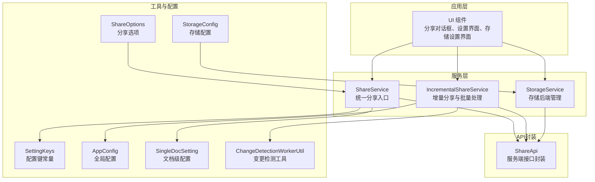
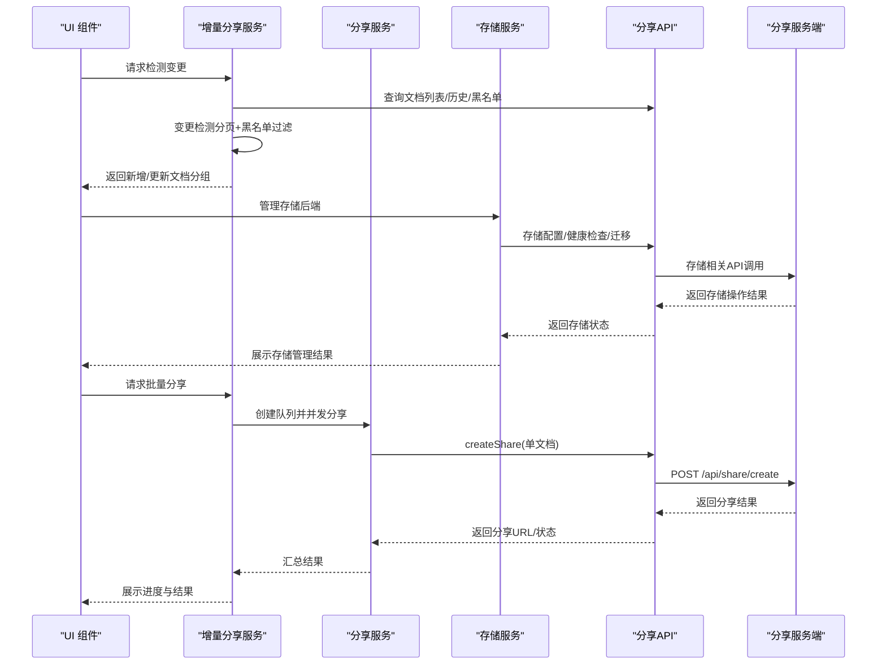
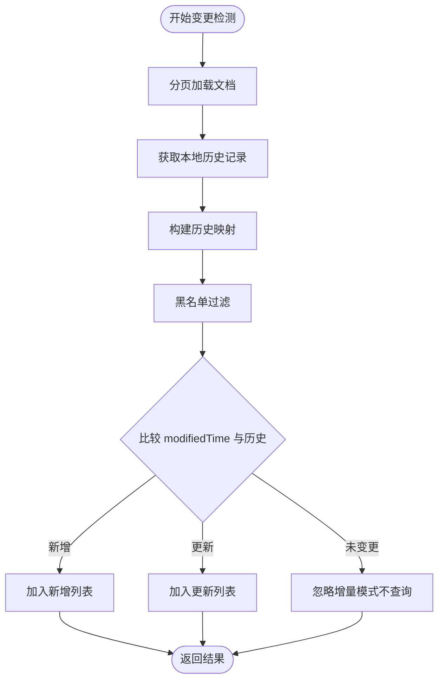
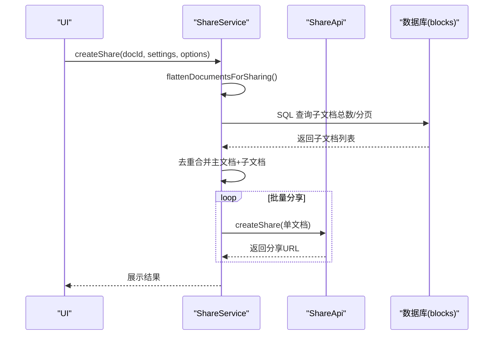
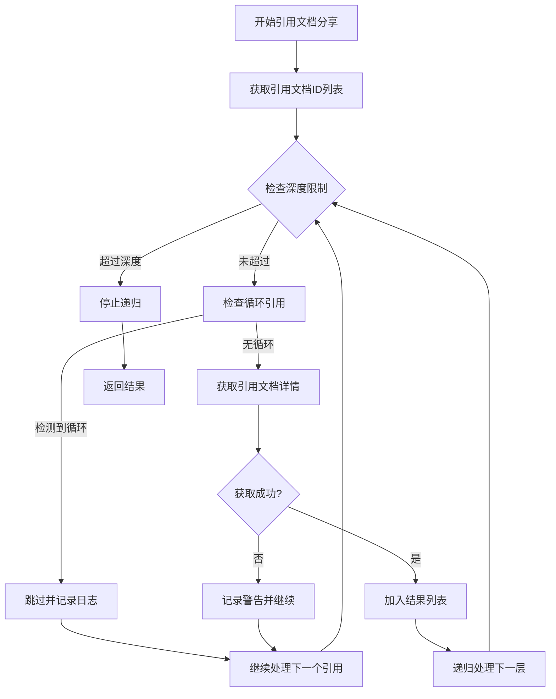
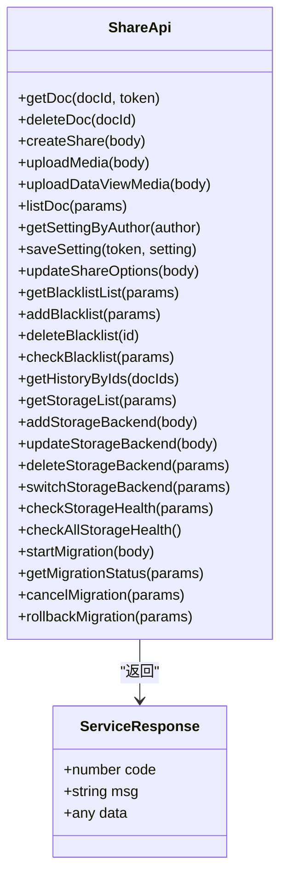
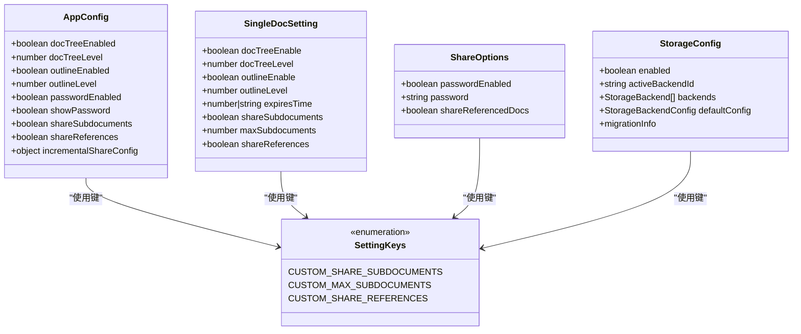
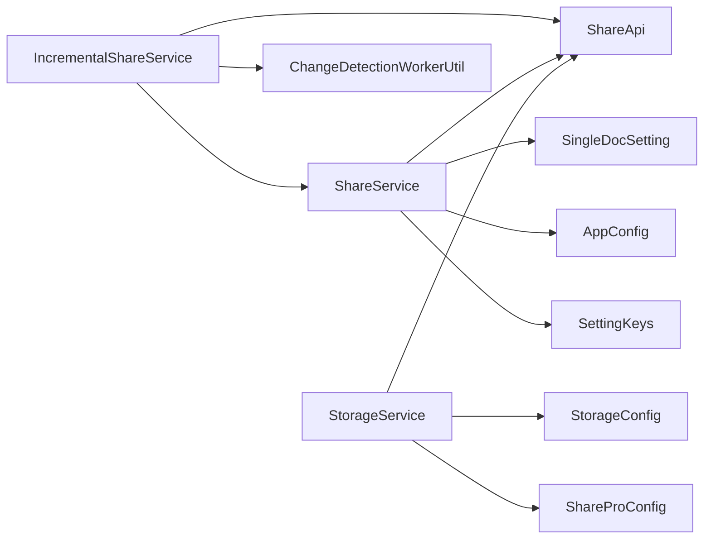

# 开放规范

<cite>
**本文引用的文件**
- [README.md](file://README.md)
- [package.json](file://package.json)
- [openspec/changes/add-custom-storage/specs/storage/spec.md](file://openspec/changes/add-custom-storage/specs/storage/spec.md)
- [openspec/changes/add-custom-storage/design.md](file://openspec/changes/add-custom-storage/design.md)
- [openspec/changes/add-custom-storage/proposal.md](file://openspec/changes/add-custom-storage/proposal.md)
- [openspec/changes/add-custom-storage/tasks.md](file://openspec/changes/add-custom-storage/tasks.md)
- [openspec/changes/add-referenced-doc-sharing/specs/share/spec.md](file://openspec/changes/add-referenced-doc-sharing/specs/share/spec.md)
- [openspec/changes/add-subdocument-sharing/specs/share/spec.md](file://openspec/changes/add-subdocument-sharing/specs/share/spec.md)
- [openspec/changes/archive/add-incremental-sharing/specs/share/spec.md](file://openspec/changes/archive/add-incremental-sharing/specs/share/spec.md)
- [src/service/IncrementalShareService.ts](file://src/service/IncrementalShareService.ts)
- [src/service/ShareService.ts](file://src/service/ShareService.ts)
- [src/api/share-api.ts](file://src/api/share-api.ts)
- [src/utils/ChangeDetectionWorkerUtil.ts](file://src/utils/ChangeDetectionWorkerUtil.ts)
- [src/models/ShareOptions.ts](file://src/models/ShareOptions.ts)
- [src/models/ShareProConfig.ts](file://src/models/ShareProConfig.ts)
- [src/models/SingleDocSetting.ts](file://src/models/SingleDocSetting.ts)
- [src/models/AppConfig.ts](file://src/models/AppConfig.ts)
- [src/utils/SettingKeys.ts](file://src/utils/SettingKeys.ts)
- [src/types/index.d.ts](file://src/types/index.d.ts)
- [docs/incremental-share-context-2025-12-04.md](file://docs/incremental-share-context-2025-12-04.md)
- [docs/subdocument-share-context-2026-02-28.md](file://docs/subdocument-share-context-2026-02-28.md)
- [docs/incremental-share-context-2025-12-08.md](file://docs/incremental-share-context-2025-12-08.md)
- [docs/custom-storage-design-2026-03-23.md](file://docs/custom-storage-design-2026-03-23.md)
</cite>

## 更新摘要
**所做更改**
- 新增存储系统的开放规范文档，包含存储规范、设计文档和实现任务清单
- 建立完整的存储系统规范管理体系，涵盖存储后端类型定义、配置接口、健康检查和迁移支持
- 完善存储系统的类型安全设计和敏感信息保护机制
- 新增存储配置的UI界面和管理功能

## 目录
1. [简介](#简介)
2. [项目结构](#项目结构)
3. [核心组件](#核心组件)
4. [架构总览](#架构总览)
5. [详细组件分析](#详细组件分析)
6. [存储系统规范](#存储系统规范)
7. [依赖分析](#依赖分析)
8. [性能考量](#性能考量)
9. [故障排查指南](#故障排查指南)
10. [结论](#结论)
11. [附录](#附录)

## 简介
本文件面向"思源笔记分享专业版"的开放规范，系统化阐述增量分享、子文档分享、引用文档分享与存储系统的完整技术标准与实现细节。内容涵盖变更检测算法、分享协议与数据格式、API 接口规范、消息格式与通信协议、版本兼容性与平滑升级策略、实现指南与最佳实践、性能优化建议、与其他系统的集成与互操作要求，以及测试规范、质量标准与验收准则。

**更新** 新增存储系统开放规范，提供自定义存储后端支持，包括OpenList和RustFS两种存储后端类型，实现资源的自主可控存储。

## 项目结构
项目采用模块化与分层架构，核心由"服务层（ShareService、IncrementalShareService、StorageService）、API封装（ShareApi）、工具与配置（SettingKeys、AppConfig、SingleDocSetting、ShareOptions、StorageConfig）、变更检测（ChangeDetectionWorkerUtil）"构成，并配套 UI 与国际化资源。

**图表来源**
- [src/service/ShareService.ts](file://src/service/ShareService.ts)
- [src/service/IncrementalShareService.ts](file://src/service/IncrementalShareService.ts)
- [src/service/StorageService.ts](file://src/service/StorageService.ts)
- [src/api/share-api.ts](file://src/api/share-api.ts)
- [src/utils/ChangeDetectionWorkerUtil.ts](file://src/utils/ChangeDetectionWorkerUtil.ts)
- [src/utils/SettingKeys.ts](file://src/utils/SettingKeys.ts)
- [src/models/AppConfig.ts](file://src/models/AppConfig.ts)
- [src/models/SingleDocSetting.ts](file://src/models/SingleDocSetting.ts)
- [src/models/ShareOptions.ts](file://src/models/ShareOptions.ts)
- [src/models/ShareProConfig.ts](file://src/models/ShareProConfig.ts)

**章节来源**
- [README.md](file://README.md)
- [package.json](file://package.json)

## 核心组件
- 分享服务（ShareService）：统一对外分享入口，负责单文档与聚合文档（子文档/引用文档）的处理、批量处理、资源上传与历史记录维护。
- 增量分享服务（IncrementalShareService）：负责变更检测、批量分享、队列管理、智能重试与缓存控制。
- 存储服务（StorageService）：管理自定义存储后端，提供存储配置、健康检查、迁移功能和敏感信息保护。
- 分享 API（ShareApi）：封装服务端接口，提供分享创建、取消、媒体上传、设置同步、历史查询、存储管理等能力。
- 变更检测工具（ChangeDetectionWorkerUtil）：提供主线程/Worker 双通道的变更检测实现，支持分页与黑名单过滤。
- 配置模型：SettingKeys（配置键）、AppConfig（全局配置）、SingleDocSetting（文档级配置）、ShareOptions（分享选项）、StorageConfig（存储配置）。

**章节来源**
- [src/service/ShareService.ts](file://src/service/ShareService.ts)
- [src/service/IncrementalShareService.ts](file://src/service/IncrementalShareService.ts)
- [src/service/StorageService.ts](file://src/service/StorageService.ts)
- [src/api/share-api.ts](file://src/api/share-api.ts)
- [src/utils/ChangeDetectionWorkerUtil.ts](file://src/utils/ChangeDetectionWorkerUtil.ts)
- [src/models/ShareOptions.ts](file://src/models/ShareOptions.ts)
- [src/models/ShareProConfig.ts](file://src/models/ShareProConfig.ts)
- [src/models/SingleDocSetting.ts](file://src/models/SingleDocSetting.ts)
- [src/utils/SettingKeys.ts](file://src/utils/SettingKeys.ts)

## 架构总览
下图展示了从 UI 到服务层再到服务端的整体交互流程，重点体现增量分享、子/引用文档分享与存储系统的协同与数据流。

**图表来源**
- [src/service/IncrementalShareService.ts](file://src/service/IncrementalShareService.ts)
- [src/service/ShareService.ts](file://src/service/ShareService.ts)
- [src/service/StorageService.ts](file://src/service/StorageService.ts)
- [src/api/share-api.ts](file://src/api/share-api.ts)

## 详细组件分析

### 增量分享规范
- 变更检测算法
  - 输入：分页文档列表（docId、docTitle、modifiedTime）、本地分享历史、黑名单。
  - 输出：新增文档、已更新文档集合。
  - 实现：主线程/Worker 双通道，使用 Map 构建历史映射，逐条比较 modifiedTime 与历史 docModifiedTime；黑名单过滤优先于历史匹配。
  - 性能：分页处理、缓存 5 分钟、Web Worker 回退、HashSet 黑名单结构。
- 批量分享
  - 并发控制：最多 5 个并发，队列管理支持暂停/继续/仅重试失败。
  - 智能重试：网络错误指数退避（1s、2s、4s）、5xx 服务端错误延迟 30s、4xx 立即失败。
  - 结果汇总：统计成功/失败/跳过数量，记录详细结果。
- 配置与偏好
  - 增量分享配置（enabled、lastShareTime、notebookBlacklist）持久化与同步。
  - 黑名单：笔记本级与文档级，支持快速添加、继承关系可视化。
- 用户体验
  - 分组展示（新增/更新/未变更）、分页虚拟滚动、空状态提示、移动端适配。
- 国际化与统计
  - 文案命名空间 incrementalShare.xxx，支持中英；提供趋势图、Top 统计、黑名单命中统计。

**图表来源**
- [src/utils/ChangeDetectionWorkerUtil.ts](file://src/utils/ChangeDetectionWorkerUtil.ts)
- [openspec/changes/archive/add-incremental-sharing/specs/share/spec.md](file://openspec/changes/archive/add-incremental-sharing/specs/share/spec.md)

**章节来源**
- [src/service/IncrementalShareService.ts](file://src/service/IncrementalShareService.ts)
- [src/utils/ChangeDetectionWorkerUtil.ts](file://src/utils/ChangeDetectionWorkerUtil.ts)
- [openspec/changes/archive/add-incremental-sharing/specs/share/spec.md](file://openspec/changes/archive/add-incremental-sharing/specs/share/spec.md)
- [docs/incremental-share-context-2025-12-04.md](file://docs/incremental-share-context-2025-12-04.md)

### 子文档分享规范
- 聚合策略
  - 通过 SQL 查询 blocks 表 path 字段识别子文档，扁平化处理（不再使用深度控制）。
  - 支持数量限制（默认 100，最大 999，-1 表示无限制），分页（每页 50）避免内存溢出。
  - 并发控制：批量分享最多 10 个并发，异步加载不阻塞 UI。
- 配置与优先级
  - 全局配置（AppConfig）与文档级配置（SingleDocSetting）合并，文档级优先。
  - 配置键：CUSTOM_SHARE_SUBDOCUMENTS、CUSTOM_MAX_SUBDOCUMENTS。
- UI 与体验
  - 紧凑水平布局，移动端自适应；提供预估时间与存储占用提示。
- 协同与去重
  - 与引用文档分享协同：先处理子文档，再处理引用，去重避免重复分享。

**图表来源**
- [src/service/ShareService.ts](file://src/service/ShareService.ts)
- [src/models/SingleDocSetting.ts](file://src/models/SingleDocSetting.ts)
- [src/models/AppConfig.ts](file://src/models/AppConfig.ts)
- [src/utils/SettingKeys.ts](file://src/utils/SettingKeys.ts)
- [openspec/changes/add-subdocument-sharing/specs/share/spec.md](file://openspec/changes/add-subdocument-sharing/specs/share/spec.md)
- [docs/subdocument-share-context-2026-02-28.md](file://docs/subdocument-share-context-2026-02-28.md)

**章节来源**
- [src/service/ShareService.ts](file://src/service/ShareService.ts)
- [src/models/SingleDocSetting.ts](file://src/models/SingleDocSetting.ts)
- [src/models/AppConfig.ts](file://src/models/AppConfig.ts)
- [src/utils/SettingKeys.ts](file://src/utils/SettingKeys.ts)
- [openspec/changes/add-subdocument-sharing/specs/share/spec.md](file://openspec/changes/add-subdocument-sharing/specs/share/spec.md)
- [docs/subdocument-share-context-2026-02-28.md](file://docs/subdocument-share-context-2026-02-28.md)

### 引用文档分享规范
**更新** 基于最新的实现，引用文档分享采用了全新的SQL查询策略和递归算法

- 聚合策略
  - 基于思源笔记的refs表进行引用文档递归查询，使用SQL查询替代DOM解析作为主要策略。
  - 递归算法实现：最大深度限制为3层，内置循环引用检测机制，自动跳过已处理的文档ID。
  - 引用关系提取：通过 `SELECT DISTINCT def_block_root_id FROM refs WHERE root_id = ? AND def_block_root_id != ?` SQL查询实现。
  - 性能优化：使用Set数据结构维护已处理文档ID，避免重复查询和无限递归。
- 配置与优先级
  - 全局配置（AppConfig）与文档级配置（SingleDocSetting）合并，文档级优先。
  - 配置键：CUSTOM_SHARE_REFERENCES。
  - 默认配置：shareReferences默认为false，保持向后兼容。
- 递归算法实现
  - 递归深度控制：最大深度3层，超过深度限制自动停止递归。
  - 循环引用检测：使用processedDocIds Set跟踪已处理文档，检测到循环引用时跳过处理。
  - 错误处理：单个引用文档获取失败不影响整体分享流程，记录警告日志。
- 协同与去重
  - 与子文档分享协同：先处理子文档，再处理引用，去重并标记来源。
  - 全局去重：使用addedDocIds Set确保同一文档不会被重复分享。
- 异常场景处理
  - 引用文档不存在：跳过并记录日志，提示用户。
  - 权限不足：显示明确的错误信息。
  - 循环引用：设置最大迭代次数防御，记录循环引用关系。
  - SQL查询失败：降级处理，仅分享当前文档。

**图表来源**
- [src/service/ShareService.ts](file://src/service/ShareService.ts)
- [src/models/SingleDocSetting.ts](file://src/models/SingleDocSetting.ts)
- [src/models/AppConfig.ts](file://src/models/AppConfig.ts)
- [src/utils/SettingKeys.ts](file://src/utils/SettingKeys.ts)

**章节来源**
- [src/service/ShareService.ts](file://src/service/ShareService.ts)
- [src/models/SingleDocSetting.ts](file://src/models/SingleDocSetting.ts)
- [src/models/AppConfig.ts](file://src/models/AppConfig.ts)
- [src/utils/SettingKeys.ts](file://src/utils/SettingKeys.ts)
- [openspec/changes/add-referenced-doc-sharing/specs/share/spec.md](file://openspec/changes/add-referenced-doc-sharing/specs/share/spec.md)

### API 接口规范与通信协议
- 服务端接口封装（ShareApi）
  - 基础方法：createShare、getDoc、deleteDoc、uploadMedia、uploadDataViewMedia、listDoc、getSettingByAuthor、saveSetting、updateShareOptions、黑名单与历史查询。
  - **新增存储相关方法**：getStorageList、addStorageBackend、updateStorageBackend、deleteStorageBackend、switchStorageBackend、checkStorageHealth、checkAllStorageHealth、startMigration、getMigrationStatus、cancelMigration、rollbackMigration。
  - 请求方式：POST，Content-Type: application/json，带 Authorization 头（可选）。
  - 响应结构：ServiceResponse（code、msg、data）。
- 增量分享相关
  - 文档列表：listDoc
  - 历史查询：getHistoryByIds
  - 黑名单：list/add/delete/check
- 子/引用分享相关
  - 通过 ShareService.createShare 调用服务端 createShare，随后 getDoc 获取分享链接。
- 存储管理相关
  - 存储后端管理：getStorageList、addStorageBackend、updateStorageBackend、deleteStorageBackend、switchStorageBackend
  - 健康检查：checkStorageHealth、checkAllStorageHealth
  - 迁移功能：startMigration、getMigrationStatus、cancelMigration、rollbackMigration

**图表来源**
- [src/api/share-api.ts](file://src/api/share-api.ts)

**章节来源**
- [src/api/share-api.ts](file://src/api/share-api.ts)

### 数据模型与配置
- AppConfig（全局配置）
  - 包含站点信息、主题、密码保护、子文档分享、引用文档分享、增量分享配置（enabled、lastShareTime、notebookBlacklist）等。
  - 新增shareReferences配置项，用于控制引用文档分享功能的全局开关。
- SingleDocSetting（文档级配置）
  - 包含 docTreeEnable/docTreeLevel、outlineEnable/outlineLevel、expiresTime、shareSubdocuments、maxSubdocuments、shareReferences。
  - 新增shareReferences配置项，支持单次分享时覆盖全局设置。
- ShareOptions（分享选项）
  - 包含 passwordEnabled/password。
  - 新增shareReferencedDocs字段，用于控制是否分享引用文档。
- SettingKeys（配置键）
  - 定义 CUSTOM_SHARE_SUBDOCUMENTS、CUSTOM_MAX_SUBDOCUMENTS、CUSTOM_SHARE_REFERENCES 等键常量。
  - 新增CUSTOM_SHARE_REFERENCES配置键，用于存储引用文档分享设置。
- **新增** StorageConfig（存储配置）
  - 包含 enabled标志、activeBackendId、backends数组、可选defaultConfig、可选migrationInfo。
  - 支持多种存储后端类型：default、openlist、rustfs。
  - 提供存储后端的健康检查和状态管理。

**图表来源**
- [src/models/AppConfig.ts](file://src/models/AppConfig.ts)
- [src/models/SingleDocSetting.ts](file://src/models/SingleDocSetting.ts)
- [src/models/ShareOptions.ts](file://src/models/ShareOptions.ts)
- [src/models/ShareProConfig.ts](file://src/models/ShareProConfig.ts)
- [src/utils/SettingKeys.ts](file://src/utils/SettingKeys.ts)

**章节来源**
- [src/models/AppConfig.ts](file://src/models/AppConfig.ts)
- [src/models/SingleDocSetting.ts](file://src/models/SingleDocSetting.ts)
- [src/models/ShareOptions.ts](file://src/models/ShareOptions.ts)
- [src/models/ShareProConfig.ts](file://src/models/ShareProConfig.ts)
- [src/utils/SettingKeys.ts](file://src/utils/SettingKeys.ts)

## 存储系统规范

### 存储后端类型定义
系统必须定义一个 `StorageBackendType` 联合类型来标识支持的存储后端。

- **类型安全要求**：类型系统必须允许以下值："default"、"openlist"、"rustfs"
- **向后兼容**：default类型保持现有默认存储行为
- **扩展性**：支持未来添加新的存储后端类型

### 存储配置接口
系统必须提供一个 `StorageConfig` 接口来管理多个存储后端。

- **配置结构**：
  - enabled标志：控制是否启用自定义存储
  - activeBackendId：当前激活的存储后端ID
  - backends数组：所有配置的存储后端列表
  - 可选defaultConfig：默认配置
  - 可选migrationInfo：迁移相关信息

### OpenList存储后端支持
系统必须支持OpenList作为自定义存储后端，提供全面的配置选项。

- **OpenList配置参数**：
  - serverUrl：OpenList服务地址
  - token：访问令牌
  - rootPath：根路径
  - storageDriver：存储驱动
  - storagePath：存储路径
  - maxFileSize：最大文件大小
  - useProxy：是否使用代理

- **健康检查功能**：
  - healthy状态：存储后端健康状态
  - latency：延迟时间
  - availableSpace：可用空间
  - totalSpace：总空间
  - lastCheckTime：最后检查时间
  - 可选errorMessage：错误信息

### RustFS存储后端支持
系统必须支持RustFS作为自定义存储后端，提供S3兼容的配置。

- **RustFS配置参数**：
  - endpoint：端点地址
  - port：端口
  - consolePort：控制台端口
  - useSSL：是否使用SSL
  - accessKey：访问密钥
  - secretKey：密钥
  - bucket：存储桶
  - region：区域
  - rootPath：根路径
  - maxFileSize：最大文件大小
  - urlExpiry：URL过期时间

- **健康检查功能**：与OpenList相同的健康检查结构

### 文件大小限制
系统必须对所有自定义存储后端强制执行50MB文件大小限制。

- **验证机制**：当文件大小超过50MB时拒绝上传
- **错误处理**：返回STORAGE_FILE_TOO_LARGE错误码
- **用户体验**：显示用户友好的错误消息

### 存储后端管理API
系统必须提供一套完整的存储后端管理API。

- **列出存储后端**：返回所有后端的详细信息，包括ID、名称、类型、状态、健康检查、创建和更新时间
- **添加存储后端**：验证配置后创建后端，初始状态为非激活
- **更新存储后端**：仅更新提供的字段，连接相关字段变化时触发健康检查
- **删除存储后端**：删除后端配置，如果只有一个后端且自定义存储已启用则阻止删除
- **切换存储后端**：验证目标后端健康后更新activeBackendId

### 存储健康检查
系统必须提供存储后端的健康检查功能。

- **单个后端检查**：执行连通性测试，返回健康状态、延迟和存储信息
- **全部后端检查**：并行检查所有后端，返回每个后端的结果

### 存储迁移支持
系统必须支持在存储后端之间迁移文件。

- **开始迁移**：验证两个后端均可访问后创建迁移任务
- **查询迁移状态**：返回迁移进度、统计信息和错误列表
- **取消迁移**：停止迁移过程，保留已迁移文件
- **回滚迁移**：恢复之前的存储配置，可选择删除已迁移文件

### 存储设置UI
系统必须提供用户界面来管理存储后端。

- **存储后端列表**：显示当前激活存储、文件大小限制、所有后端的状态指示器和操作按钮
- **添加存储后端UI**：显示后端类型选择对话框和特定类型的配置表单
- **OpenList配置表单**：包含名称、服务器URL、令牌、存储驱动下拉菜单、存储路径等字段
- **RustFS配置表单**：包含端点、访问密钥、存储桶等字段
- **迁移UI**：显示源后端选择器、目标后端选择器和进度显示

### 敏感信息保护
系统必须保护存储配置中的敏感字段。

- **加密存储**：令牌和密钥等敏感字段使用后端加密API加密存储
- **UI遮罩显示**：在界面中遮盖敏感字段，提供临时显示切换
- **安全传输**：避免在日志中记录明文值

**章节来源**
- [openspec/changes/add-custom-storage/specs/storage/spec.md](file://openspec/changes/add-custom-storage/specs/storage/spec.md)
- [openspec/changes/add-custom-storage/design.md](file://openspec/changes/add-custom-storage/design.md)
- [openspec/changes/add-custom-storage/proposal.md](file://openspec/changes/add-custom-storage/proposal.md)
- [openspec/changes/add-custom-storage/tasks.md](file://openspec/changes/add-custom-storage/tasks.md)
- [docs/custom-storage-design-2026-03-23.md](file://docs/custom-storage-design-2026-03-23.md)

## 依赖分析
- 组件耦合
  - IncrementalShareService 依赖 ShareService、ShareApi、LocalBlacklistService、LocalShareHistory、ShareQueueService、ChangeDetectionWorkerUtil。
  - ShareService 依赖 ShareApi、LocalShareHistory、ProgressManager、useSiyuanApi（SQL 查询）、SettingKeys、AppConfig、SingleDocSetting。
  - **新增** StorageService 依赖 ShareApi、ShareProConfig、StorageConfig、敏感信息加密API。
- 外部依赖
  - zhi-siyuan-api、zhi-blog-api、zhi-lib-base、cheerio、eventemitter3 等。
  - **新增** 存储后端服务（OpenList、RustFS）通过HTTP API通信。
- 潜在循环依赖
  - 服务层通过接口与工具解耦，未发现明显循环依赖。

**图表来源**
- [src/service/IncrementalShareService.ts](file://src/service/IncrementalShareService.ts)
- [src/service/ShareService.ts](file://src/service/ShareService.ts)
- [src/service/StorageService.ts](file://src/service/StorageService.ts)
- [src/api/share-api.ts](file://src/api/share-api.ts)
- [src/utils/ChangeDetectionWorkerUtil.ts](file://src/utils/ChangeDetectionWorkerUtil.ts)
- [src/models/SingleDocSetting.ts](file://src/models/SingleDocSetting.ts)
- [src/models/AppConfig.ts](file://src/models/AppConfig.ts)
- [src/models/ShareProConfig.ts](file://src/models/ShareProConfig.ts)
- [src/utils/SettingKeys.ts](file://src/utils/SettingKeys.ts)

**章节来源**
- [src/service/IncrementalShareService.ts](file://src/service/IncrementalShareService.ts)
- [src/service/ShareService.ts](file://src/service/ShareService.ts)
- [src/service/StorageService.ts](file://src/service/StorageService.ts)
- [src/api/share-api.ts](file://src/api/share-api.ts)
- [src/utils/ChangeDetectionWorkerUtil.ts](file://src/utils/ChangeDetectionWorkerUtil.ts)
- [src/models/SingleDocSetting.ts](file://src/models/SingleDocSetting.ts)
- [src/models/AppConfig.ts](file://src/models/AppConfig.ts)
- [src/models/ShareProConfig.ts](file://src/models/ShareProConfig.ts)
- [src/utils/SettingKeys.ts](file://src/utils/SettingKeys.ts)

## 性能考量
- 变更检测性能
  - 1000 文档检测时间 < 2 秒，5000 文档 < 5 秒，10000 文档 < 10 秒；使用 Web Worker、缓存 5 分钟、HashSet 黑名单。
- 子文档分享
  - 分页（每页 50）、智能缓存（5 分钟）、并发最多 10、BFS 广度优先遍历。
- 增量分享
  - 并发最多 5、虚拟滚动（每页 100）、队列管理支持暂停/继续/仅重试失败。
- 引用文档分享
  - **新增** 基于refs表的SQL查询，避免DOM解析开销；递归深度限制3层，Set去重避免重复查询；并发控制最多3个，智能重试机制。
- **新增** 存储系统性能
  - 健康检查按需触发，减少不必要的网络请求
  - 迁移任务在后端执行，避免前端长时间阻塞
  - 50MB文件大小限制控制存储成本和性能
  - 并行检查多个存储后端的健康状态

**章节来源**
- [openspec/changes/archive/add-incremental-sharing/specs/share/spec.md](file://openspec/changes/archive/add-incremental-sharing/specs/share/spec.md)
- [openspec/changes/add-subdocument-sharing/specs/share/spec.md](file://openspec/changes/add-subdocument-sharing/specs/share/spec.md)
- [openspec/changes/add-custom-storage/specs/storage/spec.md](file://openspec/changes/add-custom-storage/specs/storage/spec.md)
- [src/service/IncrementalShareService.ts](file://src/service/IncrementalShareService.ts)
- [src/service/ShareService.ts](file://src/service/ShareService.ts)
- [src/service/StorageService.ts](file://src/service/StorageService.ts)

## 故障排查指南
- 网络异常
  - 增量分享：网络错误自动重试（指数退避），5xx 延迟重试，4xx 立即失败并记录日志。
  - 子/引用分享：智能重试与队列管理，支持暂停/继续/仅重试失败。
  - **新增** 存储系统：健康检查失败时提供详细的错误信息和解决方案建议。
- 服务端异常
  - 服务端 5xx：延迟重试；4xx：立即失败并记录详细日志。
  - **新增** 存储后端：连接失败时提供具体的错误映射和解决步骤。
- 数据异常
  - 分享历史损坏：自动备份配置，提供恢复默认设置选项。
  - **新增** 存储配置损坏：支持配置恢复和迁移功能。
- 黑名单与循环引用
  - 黑名单过滤优先级最高；循环引用检测失败设置最大迭代次数防御；降级处理仅分享当前文档。
  - **新增** 引用文档分享：SQL查询失败时自动降级到DOM解析或仅分享当前文档。
- **新增** 存储系统故障排查
  - 敏感信息泄露：后端加密存储，前端不保留明文，日志中脱敏
  - 存储切换中断：切换后立即生效，新上传使用新存储，已有资源保持不变
  - 迁移失败：提供错误报告和回滚选项
  - 空间不足：迁移前检查目标存储空间，提供清晰的错误提示

**章节来源**
- [src/service/IncrementalShareService.ts](file://src/service/IncrementalShareService.ts)
- [src/service/ShareService.ts](file://src/service/ShareService.ts)
- [src/service/StorageService.ts](file://src/service/StorageService.ts)
- [openspec/changes/archive/add-incremental-sharing/specs/share/spec.md](file://openspec/changes/archive/add-incremental-sharing/specs/share/spec.md)
- [openspec/changes/add-referenced-doc-sharing/specs/share/spec.md](file://openspec/changes/add-referenced-doc-sharing/specs/share/spec.md)
- [openspec/changes/add-custom-storage/specs/storage/spec.md](file://openspec/changes/add-custom-storage/specs/storage/spec.md)

## 结论
本开放规范系统化定义了思源笔记分享专业版的增量分享、子文档分享、引用文档分享与存储系统的完整技术标准，明确了变更检测算法、分享协议与数据格式、API 接口与通信协议、配置与优先级、存储系统规范与安全机制、性能优化策略与异常处理机制。通过三层配置架构与统一服务入口，确保功能扩展与向后兼容性，为后续版本的可视化预览、移动端优化与团队协作等功能奠定坚实基础。

**更新** 最新的实现引入了基于refs表的SQL查询策略，显著提升了引用文档分享的性能和稳定性，同时建立了完整的存储系统规范管理体系，支持多种自定义存储后端，确保用户对数据存储的完全控制权。

## 附录

### 版本兼容性与平滑升级策略
- 向后兼容
  - 全局配置与文档级配置合并，文档级优先；默认值设计（如 shareSubdocuments 默认 true）保障现有用户配置不中断。
  - 增量分享配置（incrementalShareConfig）新增字段不影响旧版本读取。
  - **新增** 引用文档分享配置默认关闭（shareReferences=false），确保现有用户不受影响。
  - **新增** 存储配置为可选字段，不影响现有用户的分享功能。
- 平滑升级
  - 新增配置键通过 SettingKeys 常量统一管理；国际化文案命名空间（incrementalShare.xxx、subdocuments.xxx、cs.xxx）保持简洁一致。
  - 增量分享与子/引用分享协同：先子文档后引用，去重处理，避免重复分享。
  - **新增** 引用文档分享采用渐进式部署，不影响现有分享流程。
  - **新增** 存储系统采用渐进式部署，首次打开存储设置时显示引导提示。
- **新增** 存储系统升级策略
  - 新增字段为可选，现有用户无感知
  - 首次打开存储设置时显示引导提示
  - 支持存储配置的导入/导出功能

**章节来源**
- [src/models/AppConfig.ts](file://src/models/AppConfig.ts)
- [src/models/SingleDocSetting.ts](file://src/models/SingleDocSetting.ts)
- [src/models/ShareProConfig.ts](file://src/models/ShareProConfig.ts)
- [src/utils/SettingKeys.ts](file://src/utils/SettingKeys.ts)
- [openspec/changes/add-subdocument-sharing/specs/share/spec.md](file://openspec/changes/add-subdocument-sharing/specs/share/spec.md)
- [openspec/changes/add-referenced-doc-sharing/specs/share/spec.md](file://openspec/changes/add-referenced-doc-sharing/specs/share/spec.md)
- [openspec/changes/add-custom-storage/specs/storage/spec.md](file://openspec/changes/add-custom-storage/specs/storage/spec.md)

### 实现指南与最佳实践
- 统一入口
  - 对外仅暴露 createShare/cancelShare，内部拆分 handleOne/batchProcessDocuments，避免多入口导致的配置不一致。
  - **新增** 存储管理通过StorageService统一入口，避免直接操作存储后端。
- 配置管理
  - 三层配置优先级清晰，文档级配置通过 Block Attributes 存储，全局配置通过服务端同步。
  - **新增** 存储配置与分享配置分离，避免相互影响。
- 性能与体验
  - 分页与缓存、并发控制、队列管理、进度反馈与取消操作，确保大规模知识库流畅体验。
  - **新增** 引用文档分享采用SQL查询优化，递归深度控制和循环引用检测确保系统稳定性。
  - **新增** 存储系统采用按需健康检查，减少不必要的网络请求。
- 国际化
  - 文案命名空间与 cs.xxx 命名空间保持一致，支持中英双语。
  - **新增** 存储设置界面提供完整的国际化支持。
- **新增** 引用文档分享最佳实践
  - 优先使用SQL查询策略，DOM解析作为后备方案
  - 合理设置递归深度，避免过深的引用链影响性能
  - 建立完善的异常处理机制，确保单个引用失败不影响整体流程
- **新增** 存储系统最佳实践
  - 敏感信息必须通过后端加密存储
  - 健康检查应按需触发，避免频繁的网络请求
  - 迁移操作应在服务端执行，确保可靠性
  - 提供清晰的错误提示和解决方案

**章节来源**
- [src/service/ShareService.ts](file://src/service/ShareService.ts)
- [src/service/StorageService.ts](file://src/service/StorageService.ts)
- [src/models/SingleDocSetting.ts](file://src/models/SingleDocSetting.ts)
- [src/models/AppConfig.ts](file://src/models/AppConfig.ts)
- [src/utils/SettingKeys.ts](file://src/utils/SettingKeys.ts)
- [openspec/changes/add-custom-storage/specs/storage/spec.md](file://openspec/changes/add-custom-storage/specs/storage/spec.md)

### 测试规范、质量标准与验收准则
- 功能测试
  - 增量分享：新增/更新/未变更分组、黑名单过滤、分页与缓存、并发与队列、智能重试。
  - 子文档分享：数量限制（100/500/999/-1）、扁平化处理、并发控制、去重与预估。
  - **更新** 引用文档分享：SQL查询策略验证、递归算法正确性、循环引用检测、深度控制、异常场景处理。
  - **新增** 存储系统测试：存储后端配置验证、健康检查功能、迁移功能、敏感信息保护。
- 质量标准
  - 变更检测性能阈值、UI 响应性、错误日志完整性、国际化文案覆盖率。
  - **新增** 引用文档分享：SQL查询性能基准、递归深度限制有效性、循环引用检测准确率。
  - **新增** 存储系统：健康检查准确性、迁移成功率、敏感信息安全性。
- 验收准则
  - Mock 主流程跑通（增量分享）、真实 API 替换完成、UI 交互完善、移动端适配完成、黑名单与统计功能上线。
  - **新增** 引用文档分享：SQL查询策略验证通过、递归算法性能达标、异常处理机制完善。
  - **新增** 存储系统：存储后端管理功能完整、健康检查准确、迁移功能稳定、安全机制有效。
- **新增** 存储系统验收标准
  - 支持OpenList和RustFS两种存储后端
  - 健康检查功能准确可靠
  - 迁移功能支持暂停、取消、回滚
  - 敏感信息加密存储，UI遮罩显示
  - 50MB文件大小限制有效执行

**章节来源**
- [docs/incremental-share-context-2025-12-04.md](file://docs/incremental-share-context-2025-12-04.md)
- [docs/subdocument-share-context-2026-02-28.md](file://docs/subdocument-share-context-2026-02-28.md)
- [docs/incremental-share-context-2025-12-08.md](file://docs/incremental-share-context-2025-12-08.md)
- [openspec/changes/archive/add-incremental-sharing/specs/share/spec.md](file://openspec/changes/archive/add-incremental-sharing/specs/share/spec.md)
- [openspec/changes/add-subdocument-sharing/specs/share/spec.md](file://openspec/changes/add-subdocument-sharing/specs/share/spec.md)
- [openspec/changes/add-referenced-doc-sharing/specs/share/spec.md](file://openspec/changes/add-referenced-doc-sharing/specs/share/spec.md)
- [openspec/changes/add-custom-storage/specs/storage/spec.md](file://openspec/changes/add-custom-storage/specs/storage/spec.md)
- [openspec/changes/add-custom-storage/tasks.md](file://openspec/changes/add-custom-storage/tasks.md)