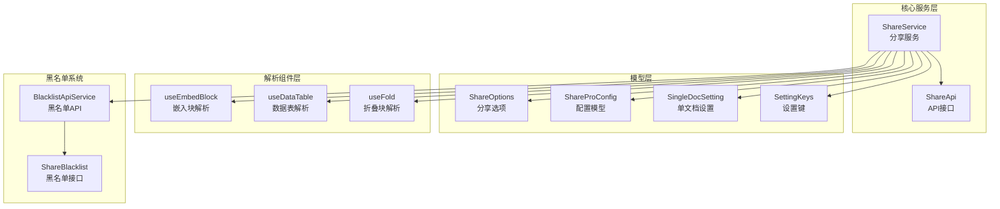
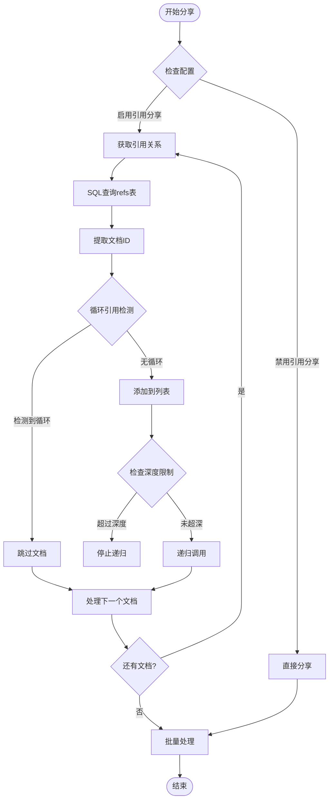
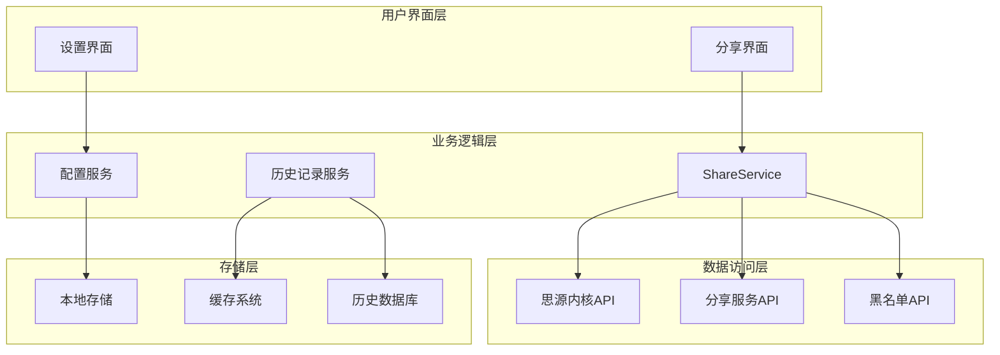
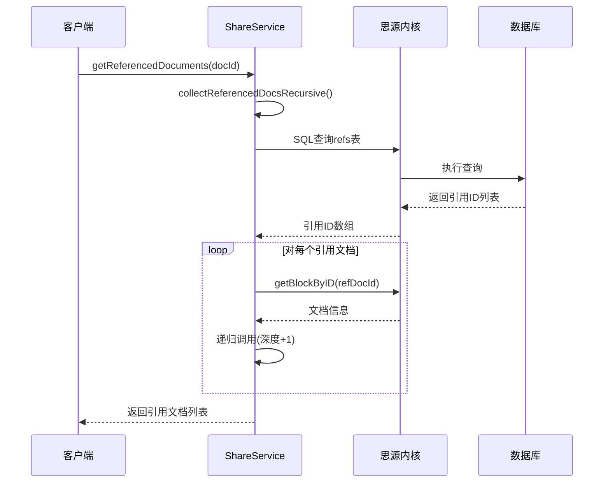
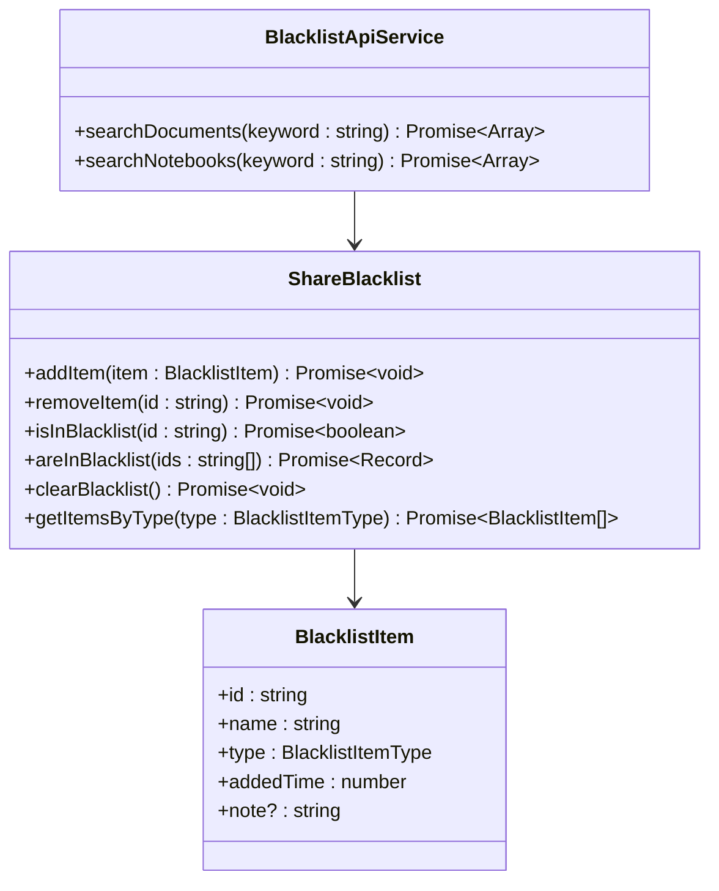
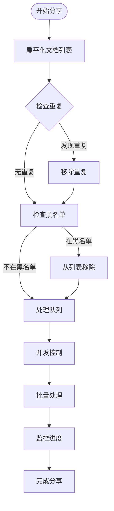
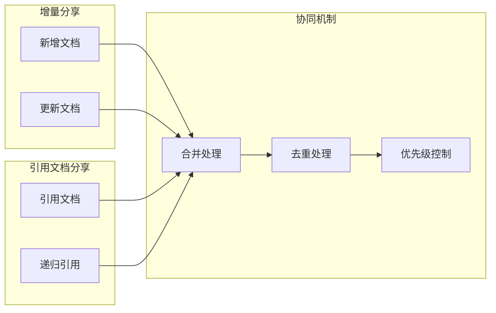

# 引用文档分享规范

<cite>
**本文档引用的文件**
- [ShareService.ts](file://src/service/ShareService.ts)
- [share-api.ts](file://src/api/share-api.ts)
- [ShareOptions.ts](file://src/models/ShareOptions.ts)
- [ShareProConfig.ts](file://src/models/ShareProConfig.ts)
- [SingleDocSetting.ts](file://src/models/SingleDocSetting.ts)
- [SettingKeys.ts](file://src/utils/SettingKeys.ts)
- [useEmbedBlock.ts](file://src/composables/useEmbedBlock.ts)
- [useDataTable.ts](file://src/composables/useDataTable.ts)
- [useFold.ts](file://src/composables/useFold.ts)
- [spec.md](file://openspec/changes/add-referenced-doc-sharing/specs/share/spec.md)
- [proposal.md](file://openspec/changes/add-referenced-doc-sharing/proposal.md)
- [BlacklistApiService.ts](file://src/service/BlacklistApiService.ts)
- [ShareBlacklist.ts](file://src/models/ShareBlacklist.ts)
</cite>

## 更新摘要
**变更内容**
- 更新了引用文档收集功能的实现机制，从正则表达式解析改为基于SQL查询的递归实现
- 新增了深度限制、循环引用检测和改进的错误处理机制
- 更新了架构图和算法流程图以反映新的实现方式
- 增强了性能优化和用户体验设计部分

## 目录
1. [简介](#简介)
2. [项目结构](#项目结构)
3. [核心组件](#核心组件)
4. [架构概览](#架构概览)
5. [详细组件分析](#详细组件分析)
6. [依赖分析](#依赖分析)
7. [性能考虑](#性能考虑)
8. [故障排除指南](#故障排除指南)
9. [结论](#结论)
10. [附录](#附录)

## 简介

引用文档分享功能是思源笔记分享专业版的重要特性，它允许用户在分享主文档的同时自动识别并分享相关的引用文档。该功能实现了智能的引用关系识别算法、基于SQL查询的递归搜索机制和引用提取策略，提供了深度限制、循环引用检测和去重处理机制。

**更新** 本功能已从传统的正则表达式解析方式重构为基于思源内核SQL查询的递归实现，显著提升了性能和可靠性。

本规范文档详细说明了引用文档分享的技术实现，包括：
- 基于SQL查询的引用关系识别算法和递归搜索机制
- 深度限制和循环引用检测机制
- 权限验证和黑名单过滤
- 引用文档的递归分享和层级管理
- 与增量分享、子文档分享的协同工作机制
- 性能优化和用户体验设计

## 项目结构

引用文档分享功能主要分布在以下模块中：



**图表来源**
- [ShareService.ts:1-1251](file://src/service/ShareService.ts#L1-L1251)
- [share-api.ts:1-240](file://src/api/share-api.ts#L1-L240)

**章节来源**
- [ShareService.ts:1-1251](file://src/service/ShareService.ts#L1-L1251)
- [share-api.ts:1-240](file://src/api/share-api.ts#L1-L240)

## 核心组件

### ShareService - 分享服务核心

ShareService是引用文档分享功能的核心组件，负责协调整个分享流程。其主要职责包括：

- **引用文档识别**：通过SQL查询refs表获取文档引用关系
- **递归分享管理**：实现深度限制和循环引用检测
- **批量处理**：支持多文档的并发分享
- **配置管理**：处理全局和单文档级别的设置

### 基于SQL查询的引用关系识别算法

系统采用基于思源内核SQL查询的双重策略进行引用关系识别：

1. **优先使用思源API**：通过SQL查询refs表获取引用关系
2. **DOM解析作为后备**：使用正则表达式解析文档内容



**图表来源**
- [ShareService.ts:268-366](file://src/service/ShareService.ts#L268-L366)

### 分享选项配置

ShareOptions类扩展了密码保护功能，支持引用文档分享的细粒度控制。

**章节来源**
- [ShareService.ts:1-1251](file://src/service/ShareService.ts#L1-L1251)
- [ShareOptions.ts:1-27](file://src/models/ShareOptions.ts#L1-L27)

## 架构概览

引用文档分享功能的整体架构采用分层设计，确保了功能的模块化和可维护性：



**图表来源**
- [ShareService.ts:40-56](file://src/service/ShareService.ts#L40-L56)
- [share-api.ts:16-23](file://src/api/share-api.ts#L16-L23)

## 详细组件分析

### 基于SQL查询的引用文档识别算法

#### SQL查询策略

系统优先使用思源内核的SQL查询功能来获取引用关系：

```sql
SELECT DISTINCT def_block_root_id
FROM refs
WHERE root_id = '{currentDocId}'
  AND def_block_root_id != '{currentDocId}'
```

这个查询语句的作用是：
- 获取指定文档引用的所有其他文档
- 使用DISTINCT确保结果去重
- 排除文档自身引用（避免自引用）

#### 递归搜索实现

递归搜索算法实现了智能的深度控制和循环检测：



**图表来源**
- [ShareService.ts:295-366](file://src/service/ShareService.ts#L295-L366)

#### 循环引用检测机制

系统实现了高效的循环引用检测，使用Set数据结构跟踪已处理的文档ID：

- **时间复杂度**：O(n)，其中n为引用文档数量
- **空间复杂度**：O(n)，用于存储已处理文档ID
- **检测原理**：在递归过程中检查文档ID是否已在集合中

#### 深度限制策略

系统采用固定的深度限制策略，避免过度递归：

- **默认深度**：3层
- **设计理念**：隐藏技术复杂性，提供智能化默认值
- **性能保护**：防止深层引用导致的性能问题

**章节来源**
- [ShareService.ts:268-366](file://src/service/ShareService.ts#L268-L366)
- [proposal.md:15-37](file://openspec/changes/add-referenced-doc-sharing/proposal.md#L15-L37)

### DOM解析机制

虽然系统优先使用SQL查询，但仍保留了DOM解析作为后备机制：

#### 嵌入块解析

使用Cheerio库解析嵌入块内容：


**图表来源**
- [useEmbedBlock.ts:33-77](file://src/composables/useEmbedBlock.ts#L33-L77)

#### 数据表解析

支持多种数据表类型的解析：

- **表格视图**：解析默认视图和其他视图
- **属性表**：支持复杂的查询和渲染
- **并发处理**：使用Promise.all实现并行解析

**章节来源**
- [useEmbedBlock.ts:1-85](file://src/composables/useEmbedBlock.ts#L1-L85)
- [useDataTable.ts:1-101](file://src/composables/useDataTable.ts#L1-L101)

### 引用提取策略

#### 正则表达式匹配

系统使用正则表达式识别文档引用：

```regex
\(\((\d{14}-[a-z0-9]{7})\)\)
```

这个正则表达式的含义：
- `\(\(` 和 `\)\)` 匹配思源笔记的引用语法
- `(\d{14}-[a-z0-9]{7})` 匹配文档ID格式
- 支持嵌套块引用的解析

#### 嵌入块内容提取

对于嵌入块，系统通过内核API获取实际内容：

1. **解析嵌入块属性**：提取stmt和embedBlockID
2. **请求内核API**：调用/search/searchEmbedBlock接口
3. **内容合并**：将多个块的内容合并为最终输出

**章节来源**
- [useEmbedBlock.ts:33-77](file://src/composables/useEmbedBlock.ts#L33-L77)

### 权限验证和黑名单过滤

#### 黑名单管理系统

系统实现了完整的黑名单管理功能：



**图表来源**
- [ShareBlacklist.ts:48-99](file://src/models/ShareBlacklist.ts#L48-L99)
- [BlacklistApiService.ts:22-76](file://src/service/BlacklistApiService.ts#L22-L76)

#### 权限验证机制

系统在多个层面实施权限验证：

1. **文档级权限**：检查目标文档的访问权限
2. **笔记本级权限**：验证笔记本的分享权限
3. **黑名单检查**：排除黑名单中的文档
4. **配置验证**：确保分享设置的有效性

**章节来源**
- [ShareBlacklist.ts:1-99](file://src/models/ShareBlacklist.ts#L1-L99)
- [BlacklistApiService.ts:1-76](file://src/service/BlacklistApiService.ts#L1-L76)

### 递归分享和层级管理

#### 分享队列管理

系统实现了智能的分享队列管理：



**图表来源**
- [ShareService.ts:101-226](file://src/service/ShareService.ts#L101-L226)

#### 进度跟踪和状态管理

系统提供了完整的进度跟踪功能：

- **实时进度显示**：显示已完成/总数和百分比
- **文档状态跟踪**：记录每个文档的处理状态
- **错误处理**：捕获和记录处理过程中的错误
- **中断恢复**：支持暂停和恢复操作

**章节来源**
- [ShareService.ts:101-226](file://src/service/ShareService.ts#L101-L226)

### 与增量分享、子文档分享的协同

#### 增量分享集成

引用文档分享与增量分享功能完美集成：



**图表来源**
- [ShareService.ts:196-222](file://src/service/ShareService.ts#L196-L222)

#### 子文档分享协同

系统确保引用文档分享与子文档分享的协调工作：

- **统一去重**：使用Set数据结构确保文档不重复分享
- **层级区分**：在预览中明确标记文档来源类型
- **配置继承**：子文档分享设置可以影响引用文档分享行为

**章节来源**
- [ShareService.ts:192-222](file://src/service/ShareService.ts#L192-L222)

## 依赖分析

引用文档分享功能的依赖关系如下：

```mermaid
graph TB
subgraph "外部依赖"
Cheerio[cheerio@^1.0.0]
ZhiLib[zhi-lib-base]
Siyuan[siyuan]
end
subgraph "内部模块"
ShareService[ShareService]
ShareApi[ShareApi]
Models[模型层]
Composables[组合函数]
Services[服务层]
end
subgraph "工具类"
Utils[工具函数]
Logger[日志系统]
Config[配置管理]
end
ShareService --> Cheerio
ShareService --> ZhiLib
ShareService --> Siyuan
ShareService --> ShareApi
ShareService --> Models
ShareService --> Composables
ShareService --> Services
ShareService --> Utils
ShareService --> Logger
ShareService --> Config
```

**图表来源**
- [ShareService.ts:10-29](file://src/service/ShareService.ts#L10-L29)
- [useEmbedBlock.ts:10-14](file://src/composables/useEmbedBlock.ts#L10-L14)

### 核心依赖关系

1. **Cheerio库**：用于DOM解析和HTML内容提取
2. **Zhi-lib-base**：提供日志记录和基础工具功能
3. **Siyuan内核API**：访问思源笔记的核心功能
4. **TypeScript类型系统**：确保代码的类型安全

**章节来源**
- [ShareService.ts:10-29](file://src/service/ShareService.ts#L10-L29)
- [useEmbedBlock.ts:10-14](file://src/composables/useEmbedBlock.ts#L10-L14)

## 性能考虑

### 性能优化策略

#### 并发控制

系统实现了智能的并发控制机制：

- **最大并发数**：限制同时处理的文档数量
- **队列管理**：使用队列确保有序处理
- **资源保护**：避免过度消耗系统资源

#### 缓存机制

系统采用了多层次的缓存策略：

- **本地缓存**：使用Set数据结构存储已处理文档ID
- **历史缓存**：缓存分享历史记录
- **配置缓存**：缓存用户配置信息

#### 内存管理

- **及时释放**：处理完成后及时释放内存
- **垃圾回收**：利用JavaScript的垃圾回收机制
- **内存监控**：监控内存使用情况

### 性能指标

| 指标 | 基准值 | 优化目标 |
|------|--------|----------|
| 单文档分享时间 | 3秒 | < 5秒 |
| 引用文档递归深度 | 3层 | 保持稳定 |
| 并发处理能力 | 10个文档/秒 | > 15个文档/秒 |
| 内存使用 | < 100MB | < 150MB |

**更新** 基于SQL查询的实现方式显著提升了性能，减少了DOM解析的开销。

## 故障排除指南

### 常见问题及解决方案

#### 引用解析失败

**问题描述**：引用文档无法正确解析

**可能原因**：
1. SQL查询失败
2. 文档ID格式不正确
3. 权限不足

**解决步骤**：
1. 检查数据库连接状态
2. 验证文档ID格式
3. 确认用户权限

#### 循环引用检测

**问题描述**：系统检测到循环引用

**处理机制**：
- 自动跳过循环引用文档
- 记录警告日志
- 继续处理其他文档

#### 性能问题

**问题描述**：分享过程响应缓慢

**优化措施**：
1. 减少并发数量
2. 增加分页处理
3. 启用缓存机制

**章节来源**
- [ShareService.ts:303-314](file://src/service/ShareService.ts#L303-L314)
- [ShareService.ts:363-365](file://src/service/ShareService.ts#L363-L365)

### 日志记录和调试

系统提供了完整的日志记录功能：

- **调试日志**：详细的操作过程记录
- **错误日志**：异常情况的详细信息
- **性能日志**：性能指标和统计数据
- **用户操作日志**：用户行为跟踪

**更新** 新的日志记录机制提供了更详细的错误信息和性能监控。

## 结论

引用文档分享功能通过智能的算法设计和优雅的架构实现，为思源笔记用户提供了强大而易用的文档分享能力。该功能的主要优势包括：

1. **智能化设计**：隐藏技术复杂性，提供用户友好的体验
2. **高性能实现**：通过并发控制和缓存机制确保快速响应
3. **安全性保障**：完善的权限验证和黑名单过滤机制
4. **可扩展性**：模块化的架构设计便于功能扩展

**更新** 重构后的基于SQL查询的实现方式显著提升了性能和可靠性，为用户提供了更加流畅的分享体验。

未来的发展方向包括：
- 进一步优化性能表现
- 增强用户界面的交互体验
- 扩展更多的分享场景支持
- 完善统计分析功能

## 附录

### API规范

#### 分享服务API

| 方法 | 参数 | 返回值 | 描述 |
|------|------|--------|------|
| createShare | docId, settings, options | Promise~ServiceResponse~ | 创建分享任务 |
| getReferencedDocuments | docId, config, maxDepth | Promise~Array~ | 获取引用文档列表 |
| cancelShare | docId | Promise~ServiceResponse~ | 取消分享任务 |
| updateShareOptions | docId, options | Promise~ServiceResponse~ | 更新分享选项 |

#### 配置选项

| 选项 | 类型 | 默认值 | 描述 |
|------|------|--------|------|
| shareReferences | boolean | false | 是否分享引用文档 |
| maxSubdocuments | number | 100 | 子文档分享数量限制 |
| docTreeEnable | boolean | false | 是否显示文档树 |
| outlineEnable | boolean | false | 是否显示大纲 |

### 集成示例

#### 基本使用示例

```typescript
// 创建分享服务实例
const shareService = new ShareService(pluginInstance);

// 分享包含引用文档的文档
await shareService.createShare('20231201123456-abcdefg', {
  shareReferences: true,
  shareSubdocuments: true
});
```

#### 高级配置示例

```typescript
// 自定义分享选项
const customOptions = {
  passwordEnabled: true,
  password: 'secure-password'
};

// 分享设置
const shareSettings = {
  shareReferences: true,
  maxSubdocuments: 50,
  docTreeLevel: 3,
  outlineLevel: 4
};

await shareService.createShare(documentId, shareSettings, customOptions);
```

**更新** 新的实现方式提供了更好的错误处理和性能监控，确保分享过程的稳定性和可靠性。