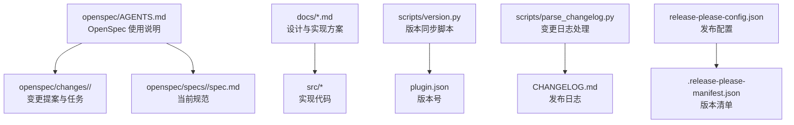
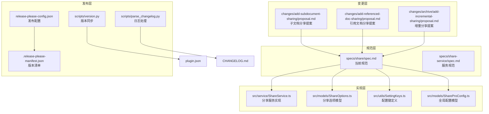
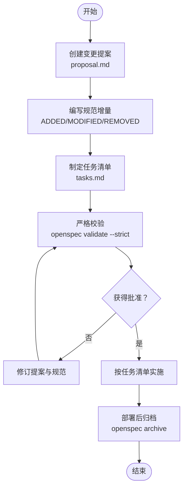
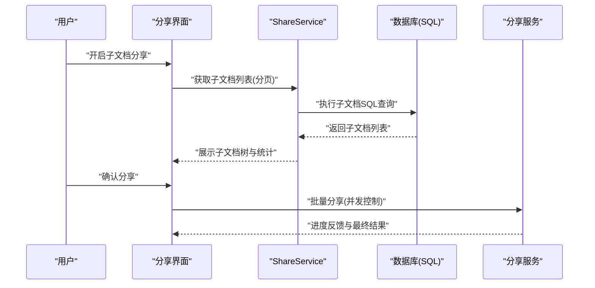
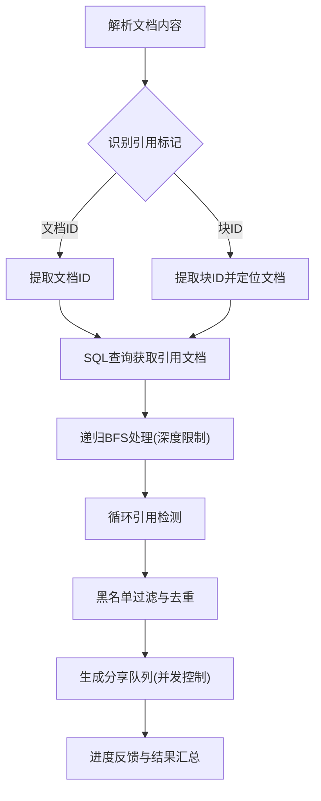
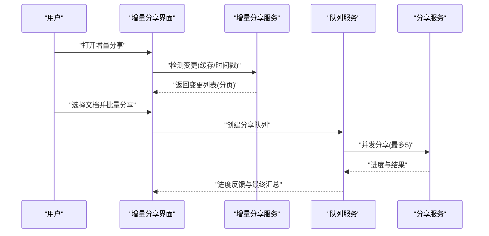
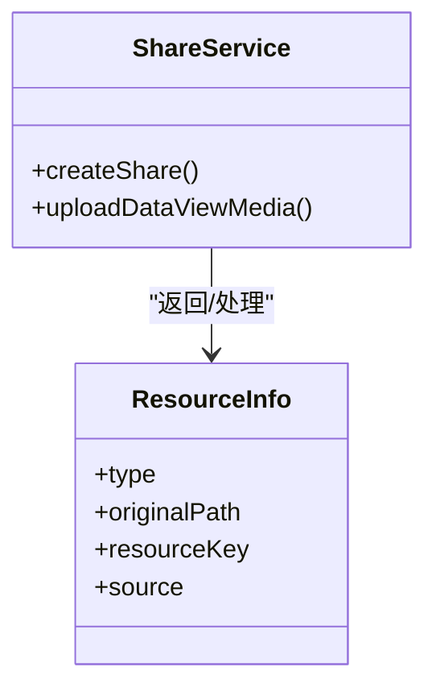
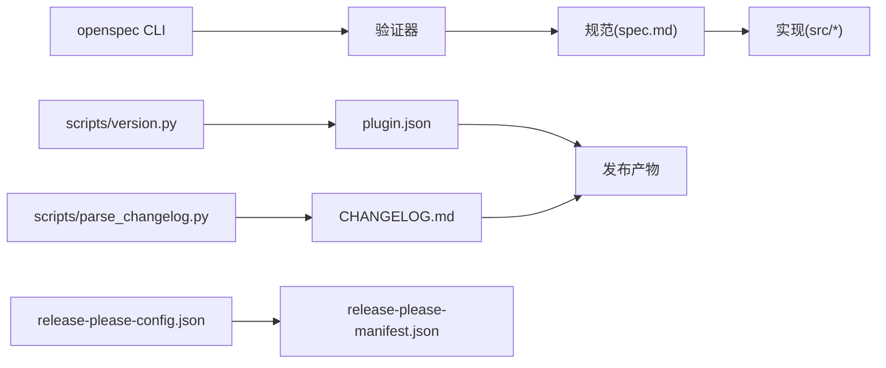

# 规范管理与版本控制

<cite>
**本文档引用的文件**
- [openspec/AGENTS.md](file://openspec/AGENTS.md)
- [openspec/changes/add-referenced-doc-sharing/proposal.md](file://openspec/changes/add-referenced-doc-sharing/proposal.md)
- [openspec/changes/add-referenced-doc-sharing/tasks.md](file://openspec/changes/add-referenced-doc-sharing/tasks.md)
- [openspec/changes/add-subdocument-sharing/specs/share/spec.md](file://openspec/changes/add-subdocument-sharing/specs/share/spec.md)
- [openspec/changes/add-subdocument-sharing/tasks.md](file://openspec/changes/add-subdocument-sharing/tasks.md)
- [openspec/changes/archive/add-incremental-sharing/proposal.md](file://openspec/changes/archive/add-incremental-sharing/proposal.md)
- [openspec/changes/archive/dataviews-resource-handling/specs/share-service/spec.md](file://openspec/changes/archive/dataviews-resource-handling/specs/share-service/spec.md)
- [docs/document-tree-fix-plan-2026-03-21.md](file://docs/document-tree-fix-plan-2026-03-21.md)
- [docs/progress-implementation-2026-03-20.md](file://docs/progress-implementation-2026-03-20.md)
- [scripts/version.py](file://scripts/version.py)
- [scripts/parse_changelog.py](file://scripts/parse_changelog.py)
- [plugin.json](file://plugin.json)
- [package.json](file://package.json)
- [.release-please-manifest.json](file://.release-please-manifest.json)
- [release-please-config.json](file://release-please-config.json)
- [TESTING_CHECKLIST.md](file://TESTING_CHECKLIST.md)
- [README.md](file://README.md)
- [README_zh_CN.md](file://README_zh_CN.md)
</cite>

## 目录
1. [引言](#引言)
2. [项目结构](#项目结构)
3. [核心组件](#核心组件)
4. [架构概览](#架构概览)
5. [详细组件分析](#详细组件分析)
6. [依赖分析](#依赖分析)
7. [性能考虑](#性能考虑)
8. [故障排查指南](#故障排查指南)
9. [结论](#结论)
10. [附录](#附录)

## 引言
本文件面向思源笔记分享专业版的开放规范管理体系，系统化阐述规范的制定流程、评审机制、发布策略与版本控制规范；详述变更管理流程与向后兼容性保证；解释规范生命周期管理、废弃策略与迁移指南；明确规范维护责任、更新频率与社区参与机制；给出规范文档的组织结构、命名规范与版本标识方法；记录质量保证、测试验证与验收标准；并提供规范的分发渠道、访问控制与使用指南。文档以仓库内的 OpenSpec 规范、变更提案、任务清单、脚本与配置为依据，结合实际实现进行归纳与提炼。

## 项目结构
项目采用“规范驱动开发”的组织方式，核心目录如下：
- openspec：规范与变更管理
  - AGENTS.md：OpenSpec 使用说明与工作流
  - changes：变更提案与任务清单，含 archive 存档
  - specs：当前规范（已实现能力）
- docs：设计与实现方案文档
- scripts：版本与变更日志处理脚本
- src：插件源代码（与规范实现相关）
- 配置文件：package.json、plugin.json、release-please-config.json 等

图表来源
- [openspec/AGENTS.md:123-142](file://openspec/AGENTS.md#L123-L142)
- [plugin.json:1-35](file://plugin.json#L1-L35)
- [release-please-config.json:1-37](file://release-please-config.json#L1-L37)

章节来源
- [openspec/AGENTS.md:123-142](file://openspec/AGENTS.md#L123-L142)
- [plugin.json:1-35](file://plugin.json#L1-L35)
- [release-please-config.json:1-37](file://release-please-config.json#L1-L37)

## 核心组件
- OpenSpec 工作流与 CLI：提供三阶段工作流（创建变更、实施变更、归档变更），配套命令与校验工具，确保规范与实现一致。
- 变更提案与任务清单：以 proposal.md、tasks.md、design.md（必要时）组织，明确“为什么、做什么、影响范围”，并以可执行任务推进落地。
- 规范文件（spec.md）：以“需求 + 场景”形式描述能力，要求每个需求至少一个场景，支持 ADDED/MODIFIED/REMOVED/RENAMED 操作。
- 设计与实现方案：docs 下的方案文档体现设计原则、实现细节与测试验证，支撑规范落地。
- 版本与发布：通过 release-please 与脚本同步版本号，生成 CHANGELOG，实现自动化发布。

章节来源
- [openspec/AGENTS.md:15-64](file://openspec/AGENTS.md#L15-L64)
- [openspec/AGENTS.md:157-236](file://openspec/AGENTS.md#L157-L236)
- [openspec/AGENTS.md:237-317](file://openspec/AGENTS.md#L237-L317)
- [openspec/AGENTS.md:448-457](file://openspec/AGENTS.md#L448-L457)

## 架构概览
OpenSpec 规范驱动开发的总体架构由“规范（specs）—变更（changes）—实现（src）—发布（scripts & configs）”构成，形成闭环：

图表来源
- [openspec/changes/add-subdocument-sharing/specs/share/spec.md:1-280](file://openspec/changes/add-subdocument-sharing/specs/share/spec.md#L1-L280)
- [openspec/changes/add-referenced-doc-sharing/specs/share/spec.md:1-248](file://openspec/changes/add-referenced-doc-sharing/specs/share/spec.md#L1-L248)
- [openspec/changes/archive/add-incremental-sharing/proposal.md:1-168](file://openspec/changes/archive/add-incremental-sharing/proposal.md#L1-L168)
- [openspec/changes/archive/dataviews-resource-handling/specs/share-service/spec.md:1-35](file://openspec/changes/archive/dataviews-resource-handling/specs/share-service/spec.md#L1-L35)
- [scripts/version.py:1-71](file://scripts/version.py#L1-L71)
- [scripts/parse_changelog.py:1-87](file://scripts/parse_changelog.py#L1-L87)
- [release-please-config.json:1-37](file://release-please-config.json#L1-L37)
- [.release-please-manifest.json:1-3](file://.release-please-manifest.json#L1-L3)

## 详细组件分析

### OpenSpec 工作流与规范文件格式
- 三阶段工作流：创建变更（proposal）、实施变更（tasks）、归档变更（archive）。变更必须通过严格校验，确保规范与实现一致。
- 规范文件格式：要求每个需求至少一个场景，使用 ADDED/MODIFIED/REMOVED/RENAMED 操作头；场景必须使用四级标题格式。
- 命名与组织：变更 ID 使用 kebab-case、动词前缀；规范按能力域划分目录；变更与归档分离。

图表来源
- [openspec/AGENTS.md:15-64](file://openspec/AGENTS.md#L15-L64)
- [openspec/AGENTS.md:237-317](file://openspec/AGENTS.md#L237-L317)

章节来源
- [openspec/AGENTS.md:15-64](file://openspec/AGENTS.md#L15-L64)
- [openspec/AGENTS.md:237-317](file://openspec/AGENTS.md#L237-L317)

### 子文档分享规范与实现
- 规范要点：支持分享文档时同时分享其所有子文档，采用扁平化处理策略，移除深度与数量限制的用户配置，使用广度优先遍历与缓存优化性能。
- 实现要点：通过 SQL 查询方案获取子文档树结构，支持分页避免内存溢出；批量处理并发限制为 10；提供温和性能警告与“仅分享首层”快捷选项。
- 任务清单：涵盖配置键、模型扩展、服务实现、UI 兼容、进度反馈、异常处理、移动端适配、国际化与统计分析等。

图表来源
- [openspec/changes/add-subdocument-sharing/specs/share/spec.md:55-130](file://openspec/changes/add-subdocument-sharing/specs/share/spec.md#L55-L130)
- [openspec/changes/add-subdocument-sharing/tasks.md:25-69](file://openspec/changes/add-subdocument-sharing/tasks.md#L25-L69)

章节来源
- [openspec/changes/add-subdocument-sharing/specs/share/spec.md:1-280](file://openspec/changes/add-subdocument-sharing/specs/share/spec.md#L1-L280)
- [openspec/changes/add-subdocument-sharing/tasks.md:1-130](file://openspec/changes/add-subdocument-sharing/tasks.md#L1-L130)

### 引用文档分享规范与实现
- 规范要点：支持分享文档时同时分享其引用的文档，实现智能引用提取（DOM 解析与 API 优先）、递归深度限制与循环引用检测、黑名单过滤与去重。
- 实现要点：DOM 解析使用正则识别文档 ID 与块 ID；优先使用 SQL 查询；递归 BFS 算法；并发控制最多 3；提供预估时间与进度反馈。
- 任务清单：配置键、模型扩展、服务实现、UI 开关、可视化预览、异常处理与移动端适配。

图表来源
- [openspec/changes/add-referenced-doc-sharing/specs/share/spec.md:140-192](file://openspec/changes/add-referenced-doc-sharing/specs/share/spec.md#L140-L192)
- [openspec/changes/add-referenced-doc-sharing/tasks.md:25-69](file://openspec/changes/add-referenced-doc-sharing/tasks.md#L25-L69)

章节来源
- [openspec/changes/add-referenced-doc-sharing/specs/share/spec.md:1-248](file://openspec/changes/add-referenced-doc-sharing/specs/share/spec.md#L1-L248)
- [openspec/changes/add-referenced-doc-sharing/proposal.md:1-102](file://openspec/changes/add-referenced-doc-sharing/proposal.md#L1-L102)

### 增量分享规范与实现
- 规范要点：自动检测自上次分享后发生变更的文档，提供直观界面与一键增量分享；支持批量分享、队列管理、智能重试、黑名单管理与统计分析。
- 实现要点：变更时间戳记录与缓存；Web Worker 异步检测；分页加载与虚拟滚动；并发限制与断点续传；性能目标与优化策略。
- 任务清单：变更检测、界面设计、批量分享、队列管理、重试机制、黑名单、统计报表、移动端适配与异常处理。

图表来源
- [openspec/changes/archive/add-incremental-sharing/proposal.md:9-114](file://openspec/changes/archive/add-incremental-sharing/proposal.md#L9-L114)
- [TESTING_CHECKLIST.md:25-54](file://TESTING_CHECKLIST.md#L25-L54)

章节来源
- [openspec/changes/archive/add-incremental-sharing/proposal.md:1-168](file://openspec/changes/archive/add-incremental-sharing/proposal.md#L1-L168)
- [TESTING_CHECKLIST.md:1-800](file://TESTING_CHECKLIST.md#L1-L800)

### DataViews 资源处理规范
- 规范要点：分享包含 DataViews 的文档时，服务端需解析结构并提取媒体资源信息，返回包含 dataViewMedia 字段的结果；提供轻量级 uploadDataViewMedia 方法。
- 接口约定：ResourceInfo 接口统一表示资源信息，包含类型、原始路径、资源键与来源字段。

图表来源
- [openspec/changes/archive/dataviews-resource-handling/specs/share-service/spec.md:1-35](file://openspec/changes/archive/dataviews-resource-handling/specs/share-service/spec.md#L1-L35)

章节来源
- [openspec/changes/archive/dataviews-resource-handling/specs/share-service/spec.md:1-35](file://openspec/changes/archive/dataviews-resource-handling/specs/share-service/spec.md#L1-L35)

### 文档树实现修复方案
- 问题：现有实现仅基于路径字符串分割，无法反映真实文档关系。
- 方案：使用官方 API 获取真实文档树，同时显示父级、同级、子级文档；支持指定深度级别；最小化改动，基于现有架构扩展。
- 测试：功能测试、边界测试与回归测试，确保与大纲功能一致性与子/引用分享功能兼容。

章节来源
- [docs/document-tree-fix-plan-2026-03-21.md:1-188](file://docs/document-tree-fix-plan-2026-03-21.md#L1-L188)

### 进度管理与消息反馈系统
- 原则：单文档操作直接反馈，多文档操作显示进度条；统一入口点，全覆盖场景；杜绝堆叠 toast 消息。
- 实现：单文档使用 showMessage，多文档使用 ProgressManager；支持成功/部分成功/失败三种状态与最终聚合反馈。

章节来源
- [docs/progress-implementation-2026-03-20.md:1-97](file://docs/progress-implementation-2026-03-20.md#L1-L97)

## 依赖分析
- OpenSpec CLI 与工具链：依赖 openspec 命令与验证器，确保变更与规范一致性。
- 发布与版本：release-please 配置与 manifest 文件驱动自动化发布；version.py 同步 plugin.json 版本；parse_changelog.py 规范化变更日志。
- 插件元数据：plugin.json 与 package.json 提供版本号与脚本入口，READMExxx.md 提供功能与许可信息。

图表来源
- [openspec/AGENTS.md:91-112](file://openspec/AGENTS.md#L91-L112)
- [scripts/version.py:1-71](file://scripts/version.py#L1-L71)
- [scripts/parse_changelog.py:1-87](file://scripts/parse_changelog.py#L1-L87)
- [release-please-config.json:1-37](file://release-please-config.json#L1-L37)
- [plugin.json:1-35](file://plugin.json#L1-L35)

章节来源
- [openspec/AGENTS.md:91-112](file://openspec/AGENTS.md#L91-L112)
- [scripts/version.py:1-71](file://scripts/version.py#L1-L71)
- [scripts/parse_changelog.py:1-87](file://scripts/parse_changelog.py#L1-L87)
- [release-please-config.json:1-37](file://release-please-config.json#L1-L37)
- [plugin.json:1-35](file://plugin.json#L1-L35)

## 性能考虑
- 子文档分享：BFS 算法、5 分钟缓存、异步加载、并发上限 10、SQL 分页避免内存溢出。
- 增量分享：Web Worker 异步检测、5 分钟缓存、并发上限 5、分页加载与虚拟滚动、黑名单 HashSet O(1) 查询。
- 引用文档分享：DOM 解析与 API 优先、递归 BFS、并发上限 3、深度限制与循环检测。
- 文档树：官方 API 获取真实关系、支持指定深度、最小化改动。

章节来源
- [openspec/changes/add-subdocument-sharing/specs/share/spec.md:122-129](file://openspec/changes/add-subdocument-sharing/specs/share/spec.md#L122-L129)
- [openspec/changes/archive/add-incremental-sharing/proposal.md:109-114](file://openspec/changes/archive/add-incremental-sharing/proposal.md#L109-L114)
- [openspec/changes/add-referenced-doc-sharing/specs/share/spec.md:140-154](file://openspec/changes/add-referenced-doc-sharing/specs/share/spec.md#L140-L154)
- [docs/document-tree-fix-plan-2026-03-21.md:21-26](file://docs/document-tree-fix-plan-2026-03-21.md#L21-L26)

## 故障排查指南
- OpenSpec 校验失败：
  - “变更必须至少有一个增量”：检查 changes/<id>/specs/ 下是否存在 .md 文件及操作头。
  - “需求必须至少有一个场景”：检查场景是否使用四级标题格式。
  - 使用严格模式与 JSON 输出调试增量解析。
- 增量分享功能：
  - 并发控制：确认并发数不超过 5；查看控制台日志。
  - 智能重试：区分网络错误（指数退避）、5xx 服务端错误（延迟重试）、4xx 客户端错误（立即失败）。
  - 队列管理：暂停/继续、断点续传、仅重试失败项。
  - 分页与性能：确保分页加载与虚拟滚动生效，避免一次性加载全部数据。
- 进度管理：
  - 确保单文档使用 showMessage，多文档使用 ProgressManager；避免堆叠 toast。
  - 文档 ID 显示问题：确保进度更新前获取文档标题。

章节来源
- [openspec/AGENTS.md:289-317](file://openspec/AGENTS.md#L289-L317)
- [TESTING_CHECKLIST.md:25-54](file://TESTING_CHECKLIST.md#L25-L54)
- [docs/progress-implementation-2026-03-20.md:54-97](file://docs/progress-implementation-2026-03-20.md#L54-L97)

## 结论
本项目通过 OpenSpec 规范驱动开发，建立了从“提案—任务—规范—实现—发布”的闭环管理体系。规范文件以“需求 + 场景”形式约束实现，变更实施严格遵循任务清单与验收标准，发布通过 release-please 与脚本自动化完成。性能与用户体验在各功能中得到系统化考虑，测试与故障排查机制完善。该体系确保了规范的可追溯性、实现的一致性与发布的稳定性。

## 附录

### 规范制定流程与评审机制
- 制定流程：OpenSpec 三阶段工作流，变更必须通过严格校验；规范文件格式与场景要求明确。
- 评审机制：变更提案需明确“为什么、做什么、影响范围”，通过 CLI 校验与人工评审后方可进入实施阶段。

章节来源
- [openspec/AGENTS.md:15-64](file://openspec/AGENTS.md#L15-L64)
- [openspec/AGENTS.md:237-317](file://openspec/AGENTS.md#L237-L317)

### 发布策略与版本控制
- 版本标识：plugin.json 与 package.json 统一版本号；release-please 自动化生成发布与变更日志。
- 发布配置：release-please-config.json 定义发布类型、分支与日志分区；manifest 文件记录当前版本。
- 版本同步：version.py 同步 plugin.json 版本；parse_changelog.py 规范化变更日志。

章节来源
- [plugin.json:1-35](file://plugin.json#L1-L35)
- [package.json:10-21](file://package.json#L10-L21)
- [release-please-config.json:1-37](file://release-please-config.json#L1-L37)
- [.release-please-manifest.json:1-3](file://.release-please-manifest.json#L1-L3)
- [scripts/version.py:1-71](file://scripts/version.py#L1-L71)
- [scripts/parse_changelog.py:1-87](file://scripts/parse_changelog.py#L1-L87)

### 变更管理流程与向后兼容性
- 变更管理：变更 ID 唯一、动词前缀；变更与归档分离；任务清单驱动实施；严格验收标准。
- 向后兼容性：默认配置保持默认值（如 false/undefined），避免破坏性变更；提供迁移与降级策略。

章节来源
- [openspec/AGENTS.md:401-405](file://openspec/AGENTS.md#L401-L405)
- [openspec/changes/add-subdocument-sharing/specs/share/spec.md:18-21](file://openspec/changes/add-subdocument-sharing/specs/share/spec.md#L18-L21)
- [openspec/changes/add-referenced-doc-sharing/specs/share/spec.md:30-36](file://openspec/changes/add-referenced-doc-sharing/specs/share/spec.md#L30-L36)

### 规范生命周期管理与废弃策略
- 生命周期：从 changes 到 specs，再到 archive；归档后仍可查阅历史变更。
- 废弃策略：通过 REMOVED/RENAMED 操作头明确变更意图；提供迁移指南与降级方案。

章节来源
- [openspec/AGENTS.md:59-64](file://openspec/AGENTS.md#L59-L64)
- [openspec/AGENTS.md:260-275](file://openspec/AGENTS.md#L260-L275)

### 维护责任、更新频率与社区参与
- 维护责任：OpenSpec 指南明确了上下文检查、变更冲突协调与错误恢复流程。
- 更新频率：通过 release-please 自动化发布，结合测试清单与验收标准保障质量。
- 社区参与：README 提供功能介绍与许可信息，鼓励通过邮件与 issue 参与交流。

章节来源
- [openspec/AGENTS.md:415-434](file://openspec/AGENTS.md#L415-L434)
- [README.md:1-21](file://README.md#L1-L21)
- [README_zh_CN.md:1-17](file://README_zh_CN.md#L1-L17)

### 规范文档组织结构、命名规范与版本标识
- 组织结构：openspec/specs 与 openspec/changes 分离；变更按能力域组织。
- 命名规范：变更 ID kebab-case、动词前缀；能力命名 verb-noun；文件用途清晰。
- 版本标识：plugin.json 与 package.json 统一版本号；release-please 自动生成变更日志。

章节来源
- [openspec/AGENTS.md:123-142](file://openspec/AGENTS.md#L123-L142)
- [openspec/AGENTS.md:395-405](file://openspec/AGENTS.md#L395-L405)
- [plugin.json:1-35](file://plugin.json#L1-L35)
- [package.json:10-21](file://package.json#L10-L21)

### 质量保证、测试验证与验收标准
- 质量保证：OpenSpec 严格校验、CLI 调试、JSON 输出；实现层面的进度管理与消息反馈。
- 测试验证：TESTING_CHECKLIST 涵盖并发控制、智能重试、队列管理、分页与性能、增量检测等。
- 验收标准：子文档分享与引用文档分享的验收清单明确功能与性能指标。

章节来源
- [openspec/AGENTS.md:305-317](file://openspec/AGENTS.md#L305-L317)
- [docs/progress-implementation-2026-03-20.md:1-97](file://docs/progress-implementation-2026-03-20.md#L1-L97)
- [TESTING_CHECKLIST.md:93-130](file://TESTING_CHECKLIST.md#L93-L130)

### 分发渠道、访问控制与使用指南
- 分发渠道：README 提供功能介绍与许可信息，README_zh_CN 提供注册码与试用信息。
- 访问控制：插件元数据包含最小应用版本与前后端支持范围。
- 使用指南：OpenSpec 指南提供 CLI 使用与调试方法，规范文件提供需求与场景说明。

章节来源
- [README.md:1-21](file://README.md#L1-L21)
- [README_zh_CN.md:1-17](file://README_zh_CN.md#L1-L17)
- [plugin.json:6-13](file://plugin.json#L6-L13)
- [openspec/AGENTS.md:91-112](file://openspec/AGENTS.md#L91-L112)