# 引用文档分享规范

<cite>
**本文档中引用的文件**
- [plugin.json](file://plugin.json)
- [README.md](file://README.md)
- [src/index.ts](file://src/index.ts)
- [src/main.ts](file://src/main.ts)
- [src/service/ShareService.ts](file://src/service/ShareService.ts)
- [src/service/IncrementalShareService.ts](file://src/service/IncrementalShareService.ts)
- [src/service/LocalBlacklistService.ts](file://src/service/LocalBlacklistService.ts)
- [src/service/LocalShareHistory.ts](file://src/service/LocalShareHistory.ts)
- [src/service/ShareQueueService.ts](file://src/service/ShareQueueService.ts)
- [src/utils/ChangeDetectionWorkerUtil.ts](file://src/utils/ChangeDetectionWorkerUtil.ts)
- [src/models/ShareProConfig.ts](file://src/models/ShareProConfig.ts)
- [src/models/SingleDocSetting.ts](file://src/models/SingleDocSetting.ts)
- [src/libs/pages/ShareSetting.svelte](file://src/libs/pages/ShareSetting.svelte)
- [openspec/changes/archive/add-incremental-sharing/specs/share/spec.md](file://openspec/changes/archive/add-incremental-sharing/specs/share/spec.md)
- [openspec/changes/archive/add-referenced-doc-sharing/specs/share/spec.md](file://openspec/changes/archive/add-referenced-doc-sharing/specs/share/spec.md)
- [openspec/changes/archive/add-referenced-doc-sharing/proposal.md](file://openspec/changes/archive/add-referenced-doc-sharing/proposal.md)
- [openspec/changes/archive/add-referenced-doc-sharing/tasks.md](file://openspec/changes/archive/add-referenced-doc-sharing/tasks.md)
- [src/Constants.ts](file://src/Constants.ts)
- [src/types/share-queue.d.ts](file://src/types/share-queue.d.ts)
- [src/types/service-dto.d.ts](file://src/types/service-dto.d.ts)
- [src/types/index.d.ts](file://src/types/index.d.ts)
</cite>

## 更新摘要
**所做更改**
- 新增引用文档分享功能章节，详细介绍递归引用检测机制
- 更新架构概览，增加引用文档分享的处理流程
- 新增引用深度控制和循环引用防护机制说明
- 更新配置管理系统，添加引用文档分享相关配置
- 新增引用文档分享的性能考虑和故障排除指南

## 目录
1. [简介](#简介)
2. [项目结构](#项目结构)
3. [核心组件](#核心组件)
4. [架构概览](#架构概览)
5. [详细组件分析](#详细组件分析)
6. [引用文档分享功能](#引用文档分享功能)
7. [依赖关系分析](#依赖关系分析)
8. [性能考虑](#性能考虑)
9. [故障排除指南](#故障排除指南)
10. [结论](#结论)

## 简介

Share Pro 是一个专为 Siyuan 笔记设计的高级分享插件，提供了一键分享思源笔记的功能。该插件专注于引用文档分享，支持增量分享、批量处理、智能重试等高级功能。最新版本引入了智能引用文档分享功能，能够自动检测和分享文档间的引用关系，提供递归引用检测、深度控制和循环引用防护机制。

**章节来源**
- [README.md:1-21](file://README.md#L1-L21)
- [plugin.json:1-35](file://plugin.json#L1-L35)

## 项目结构

该项目采用模块化架构设计，主要分为以下几个核心层次：

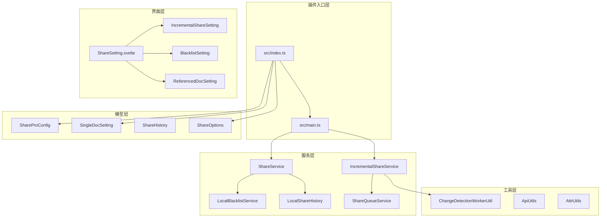

**图表来源**
- [src/index.ts:33-59](file://src/index.ts#L33-L59)
- [src/main.ts:12-31](file://src/main.ts#L12-L31)

**章节来源**
- [src/index.ts:10-59](file://src/index.ts#L10-L59)
- [src/main.ts:9-34](file://src/main.ts#L9-L34)

## 核心组件

### 插件主控制器

ShareProPlugin 作为插件的主控制器，负责初始化各个服务组件并管理插件生命周期。

**章节来源**
- [src/index.ts:33-178](file://src/index.ts#L33-L178)

### 分享服务核心

ShareService 提供统一的分享入口，支持单文档和批量文档分享，具备智能增量检测功能，并新增引用文档分享能力。

**章节来源**
- [src/service/ShareService.ts:45-89](file://src/service/ShareService.ts#L45-L89)

### 增量分享服务

IncrementalShareService 实现了高级的增量分享功能，包括变更检测、批量处理、智能重试等特性。

**章节来源**
- [src/service/IncrementalShareService.ts:98-129](file://src/service/IncrementalShareService.ts#L98-L129)

## 架构概览

该插件采用分层架构设计，各层职责明确，耦合度低。最新版本增加了引用文档分享的专门处理流程：

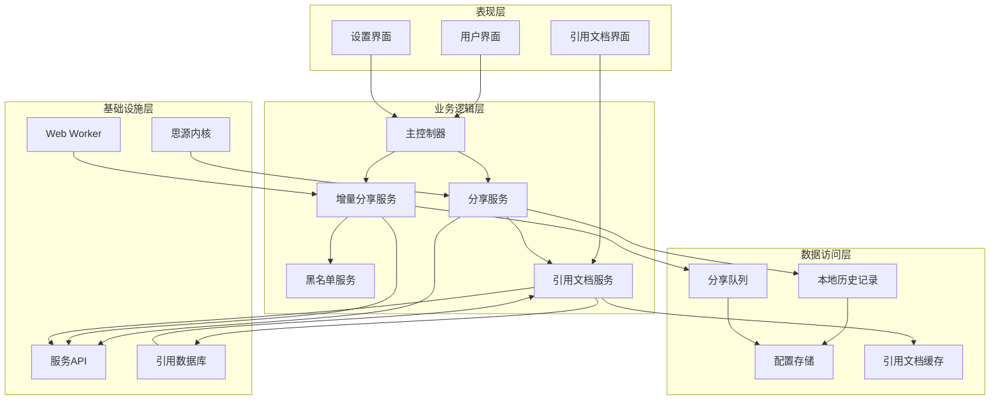

**图表来源**
- [src/index.ts:42-58](file://src/index.ts#L42-L58)
- [src/service/IncrementalShareService.ts:113-125](file://src/service/IncrementalShareService.ts#L113-L125)

## 详细组件分析

### 分享服务架构

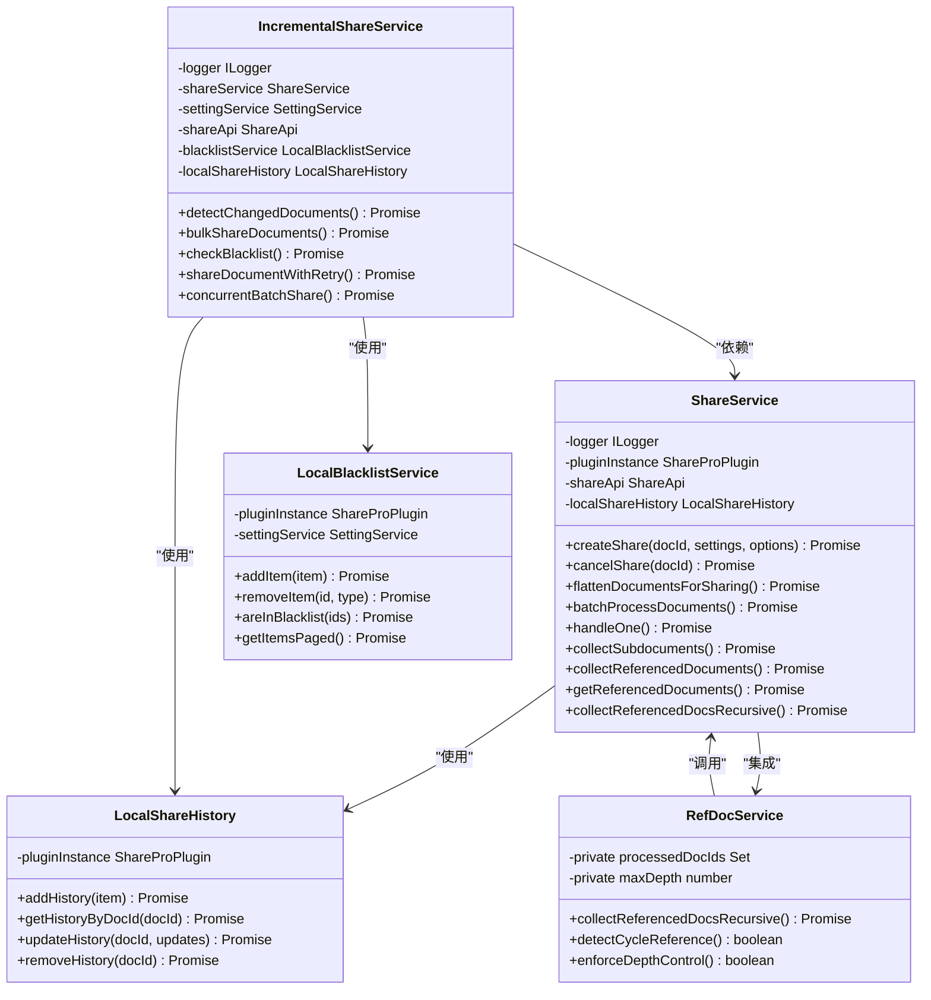

**图表来源**
- [src/service/ShareService.ts:45-61](file://src/service/ShareService.ts#L45-L61)
- [src/service/IncrementalShareService.ts:98-125](file://src/service/IncrementalShareService.ts#L98-L125)
- [src/service/LocalBlacklistService.ts:31-41](file://src/service/LocalBlacklistService.ts#L31-L41)
- [src/service/LocalShareHistory.ts:23-29](file://src/service/LocalShareHistory.ts#L23-L29)

### 增量分享工作流程

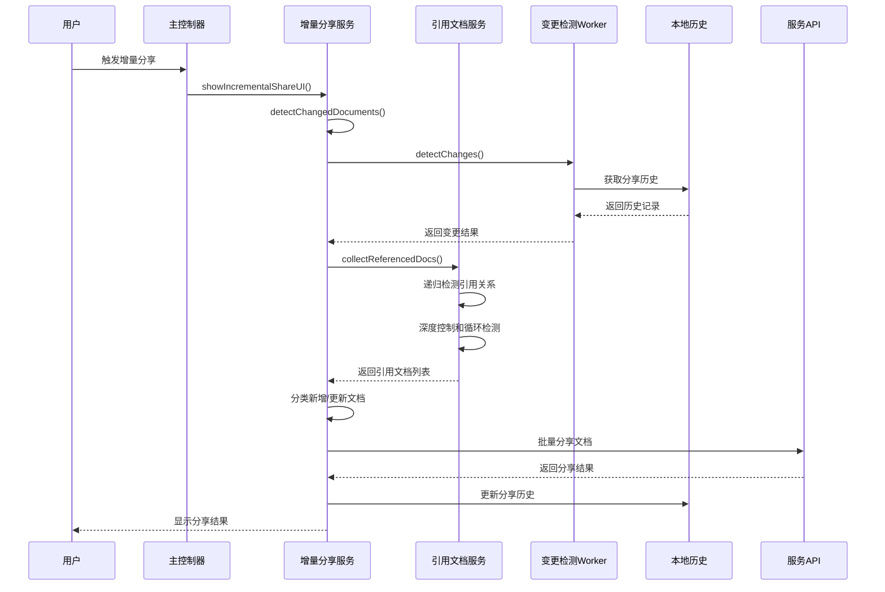

**图表来源**
- [src/main.ts:21-30](file://src/main.ts#L21-L30)
- [src/service/IncrementalShareService.ts:160-210](file://src/service/IncrementalShareService.ts#L160-L210)
- [src/utils/ChangeDetectionWorkerUtil.ts:36-59](file://src/utils/ChangeDetectionWorkerUtil.ts#L36-L59)

### 黑名单过滤机制

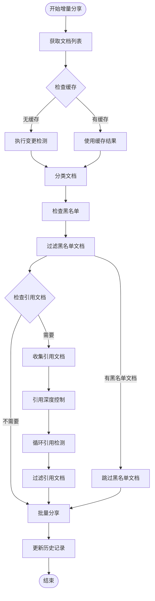

**图表来源**
- [src/service/IncrementalShareService.ts:268-351](file://src/service/IncrementalShareService.ts#L268-L351)
- [src/service/LocalBlacklistService.ts:218-246](file://src/service/LocalBlacklistService.ts#L218-L246)

**章节来源**
- [src/service/IncrementalShareService.ts:160-351](file://src/service/IncrementalShareService.ts#L160-L351)
- [src/service/LocalBlacklistService.ts:218-411](file://src/service/LocalBlacklistService.ts#L218-L411)

### 配置管理系统

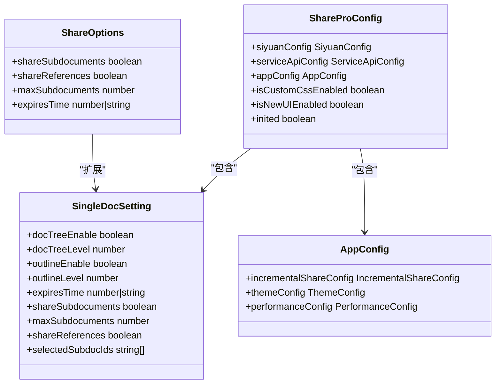

**图表来源**
- [src/models/ShareProConfig.ts:13-37](file://src/models/ShareProConfig.ts#L13-L37)
- [src/models/SingleDocSetting.ts:16-89](file://src/models/SingleDocSetting.ts#L16-L89)

**章节来源**
- [src/models/ShareProConfig.ts:13-37](file://src/models/ShareProConfig.ts#L13-L37)
- [src/models/SingleDocSetting.ts:16-89](file://src/models/SingleDocSetting.ts#L16-L89)

## 引用文档分享功能

### 引用文档收集机制

ShareService 新增了完整的引用文档收集功能，能够自动检测和收集文档间的引用关系：

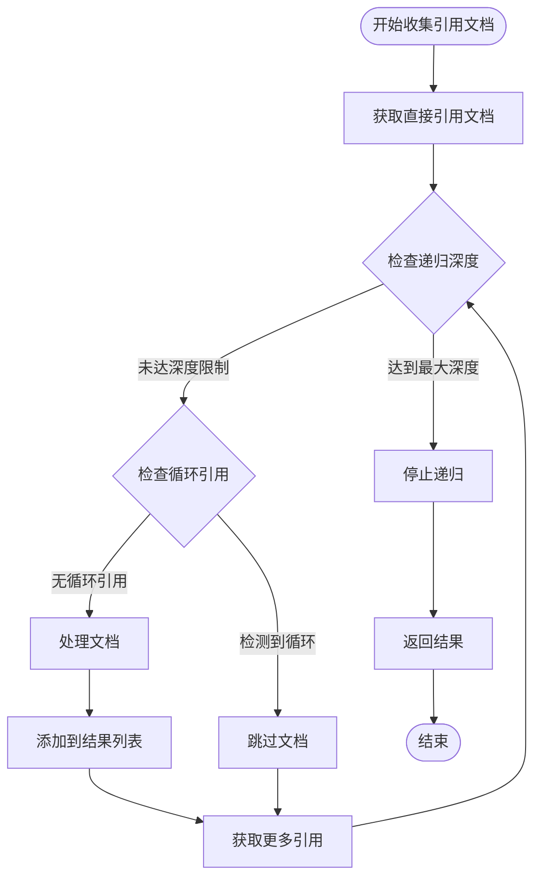

**图表来源**
- [src/service/ShareService.ts:472-583](file://src/service/ShareService.ts#L472-L583)

### 递归引用检测实现

引用文档分享功能采用了智能的递归检测机制，具有以下特点：

1. **智能深度控制**：使用常量 `DEFAULT_SHARE_REFERENCES_MAX_DEPTH = 3` 作为默认最大递归深度
2. **循环引用防护**：维护 `processedDocIds` 集合跟踪已处理文档，防止无限递归
3. **SQL查询优化**：优先使用思源内核API的SQL查询获取引用关系
4. **DOM解析降级**：当SQL查询失败时，自动降级为DOM解析方案

**章节来源**
- [src/service/ShareService.ts:472-583](file://src/service/ShareService.ts#L472-L583)
- [src/Constants.ts:21-29](file://src/Constants.ts#L21-L29)

### 引用文档分享配置

引用文档分享功能通过以下配置项进行控制：

- **shareReferences**: 控制是否分享引用文档，默认为 `false`
- **默认深度限制**: 内部固定为3层递归深度，用户不可配置
- **智能开关**: 在设置界面提供简单的启用/禁用开关
- **继承机制**: 增量分享时自动继承引用分享设置

**章节来源**
- [src/models/SingleDocSetting.ts:73-79](file://src/models/SingleDocSetting.ts#L73-L79)
- [openspec/changes/archive/add-referenced-doc-sharing/specs/share/spec.md:15-56](file://openspec/changes/archive/add-referenced-doc-sharing/specs/share/spec.md#L15-L56)

### 引用关系可视化

系统提供了完整的引用关系可视化功能：

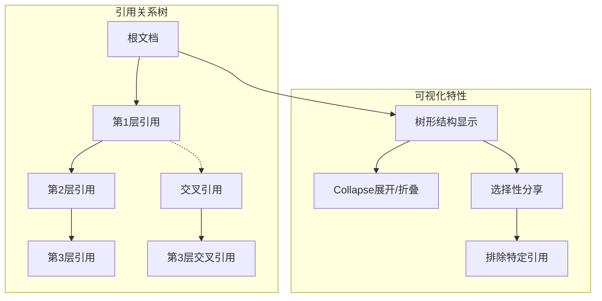

**图表来源**
- [openspec/changes/archive/add-referenced-doc-sharing/specs/share/spec.md:93-110](file://openspec/changes/archive/add-referenced-doc-sharing/specs/share/spec.md#L93-L110)

**章节来源**
- [openspec/changes/archive/add-referenced-doc-sharing/specs/share/spec.md:93-110](file://openspec/changes/archive/add-referenced-doc-sharing/specs/share/spec.md#L93-L110)

## 依赖关系分析

### 核心依赖关系

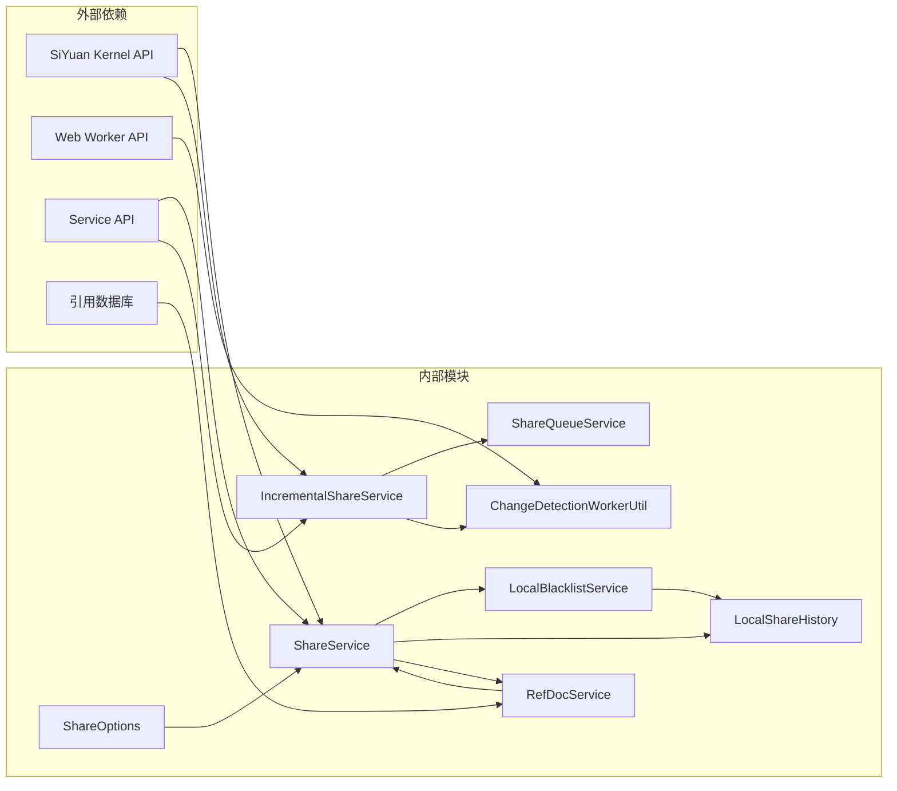

**图表来源**
- [src/service/ShareService.ts:19-37](file://src/service/ShareService.ts#L19-L37)
- [src/service/IncrementalShareService.ts:12-24](file://src/service/IncrementalShareService.ts#L12-L24)
- [src/utils/ChangeDetectionWorkerUtil.ts:17-19](file://src/utils/ChangeDetectionWorkerUtil.ts#L17-L19)

### 数据流分析

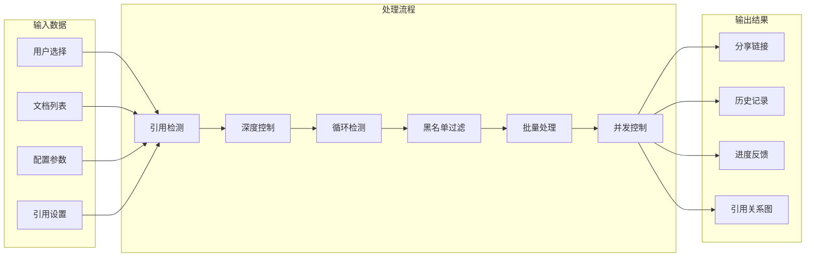

**图表来源**
- [src/service/IncrementalShareService.ts:268-474](file://src/service/IncrementalShareService.ts#L268-L474)
- [src/service/ShareService.ts:322-395](file://src/service/ShareService.ts#L322-L395)

**章节来源**
- [src/service/IncrementalShareService.ts:268-474](file://src/service/IncrementalShareService.ts#L268-L474)
- [src/service/ShareService.ts:322-395](file://src/service/ShareService.ts#L322-L395)

## 性能考虑

### 变更检测优化

插件实现了高效的变更检测机制，采用以下优化策略：

1. **Web Worker 支持**：优先使用 Web Worker 进行变更检测，避免阻塞主线程
2. **缓存机制**：5分钟缓存检测结果，减少重复计算
3. **分页处理**：支持分页获取文档，避免一次性处理大量数据
4. **HashSet 过滤**：使用 HashSet 进行黑名单过滤，提升查找效率

### 引用文档分享性能优化

新增的引用文档分享功能包含以下性能优化措施：

1. **智能深度控制**：默认3层递归深度，平衡性能与完整性
2. **循环引用检测**：实时检测并跳过循环引用，防止无限递归
3. **并发控制**：限制最多3个并发请求，避免系统过载
4. **缓存机制**：缓存引用关系结果，减少重复查询
5. **去重处理**：自动去除重复的引用文档，避免重复分享

### 并发控制

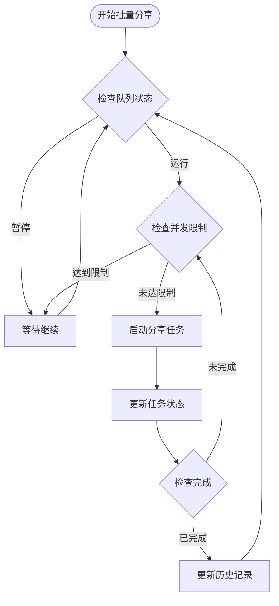

**图表来源**
- [src/service/IncrementalShareService.ts:479-577](file://src/service/IncrementalShareService.ts#L479-L577)

**章节来源**
- [src/service/IncrementalShareService.ts:479-577](file://src/service/IncrementalShareService.ts#L479-L577)

## 故障排除指南

### 常见问题及解决方案

1. **分享失败重试机制**
   - 网络错误：自动重试3次，使用指数退避策略
   - 5xx错误：延迟30秒后重试
   - 4xx错误：立即失败并记录详细日志

2. **队列管理**
   - 支持暂停和继续操作
   - 支持仅重试失败项
   - 保存进度到本地，系统重启后可恢复

3. **黑名单处理**
   - 支持笔记本级别和文档级别黑名单
   - 自动过滤黑名单中的文档
   - 提供黑名单继承关系

4. **引用文档分享问题**
   - **循环引用检测失败**：系统会自动跳过并记录警告
   - **引用文档过多**：自动应用3层深度限制，避免性能问题
   - **引用解析失败**：自动降级处理，仅分享当前文档
   - **内存溢出**：系统会限制并发数量，防止内存泄漏

**章节来源**
- [src/service/IncrementalShareService.ts:585-682](file://src/service/IncrementalShareService.ts#L585-L682)
- [src/service/ShareQueueService.ts:72-93](file://src/service/ShareQueueService.ts#L72-L93)
- [src/service/LocalBlacklistService.ts:390-411](file://src/service/LocalBlacklistService.ts#L390-L411)

### 引用文档分享专用故障排除

1. **引用文档无法获取**
   - 检查文档权限设置
   - 验证引用关系有效性
   - 查看日志中的具体错误信息

2. **性能问题**
   - 确认引用深度限制设置
   - 检查是否有循环引用
   - 减少同时分享的文档数量

3. **循环引用检测**
   - 系统会自动检测并跳过循环引用
   - 可在日志中查看循环引用的文档列表
   - 必要时手动排除特定引用

**章节来源**
- [src/service/ShareService.ts:532-583](file://src/service/ShareService.ts#L532-L583)
- [openspec/changes/archive/add-referenced-doc-sharing/specs/share/spec.md:180-192](file://openspec/changes/archive/add-referenced-doc-sharing/specs/share/spec.md#L180-L192)

## 结论

Share Pro 插件通过其精心设计的架构和丰富的功能特性，为 Siyuan 笔记用户提供了一个强大而易用的文档分享解决方案。最新版本的引用文档分享功能进一步增强了插件的专业性和实用性。

### 核心优势

1. **智能化增量分享**：自动检测文档变更，避免重复分享
2. **智能引用文档分享**：自动检测和分享文档间的引用关系
3. **递归引用检测**：支持最多3层的智能递归引用检测
4. **循环引用防护**：内置循环引用检测机制，确保系统稳定
5. **性能优化**：采用并发控制和缓存机制，确保大知识库的流畅体验
6. **灵活的配置管理**：支持多种分享选项和个性化设置
7. **完善的错误处理**：提供智能重试和队列管理功能
8. **强大的黑名单系统**：支持细粒度的文档和笔记本级别过滤

### 新功能特色

1. **自动化引用检测**：用户无需手动配置，系统自动处理引用关系
2. **智能深度控制**：默认3层递归深度，平衡性能与完整性
3. **循环引用防护**：实时检测并跳过循环引用，防止系统崩溃
4. **可视化引用关系**：提供完整的引用关系树可视化展示
5. **选择性分享控制**：用户可以手动排除特定的引用文档
6. **性能保护机制**：内置合理的数量限制，保护系统性能

该插件不仅满足了基本的分享需求，还通过高级功能如增量分享、批量处理、智能重试、引用文档分享等，为用户提供了专业的分享体验。最新的引用文档分享功能使得用户能够轻松地分享复杂的文档关系网络，大大提升了知识管理和分享的效率。