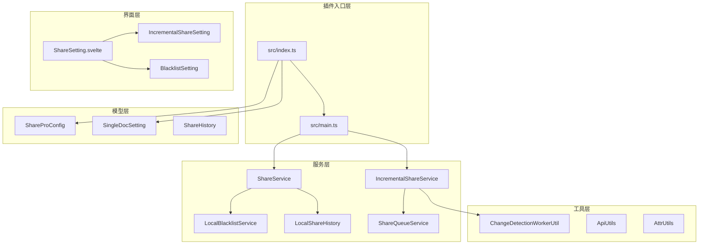
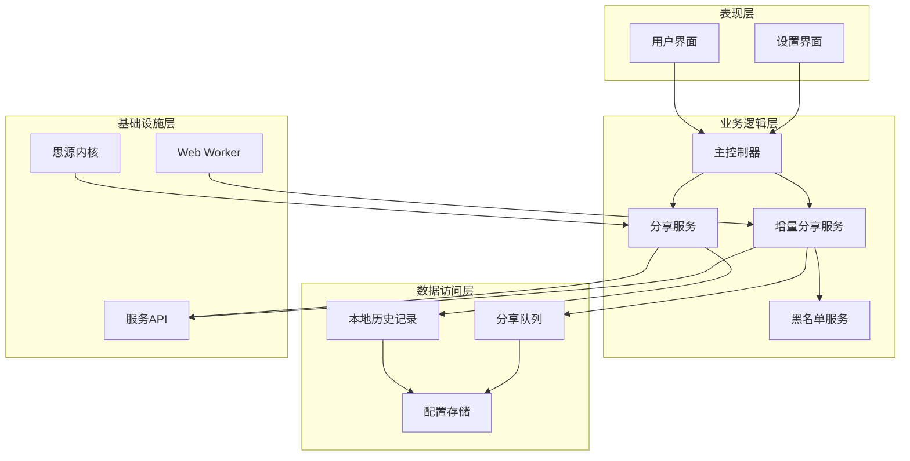
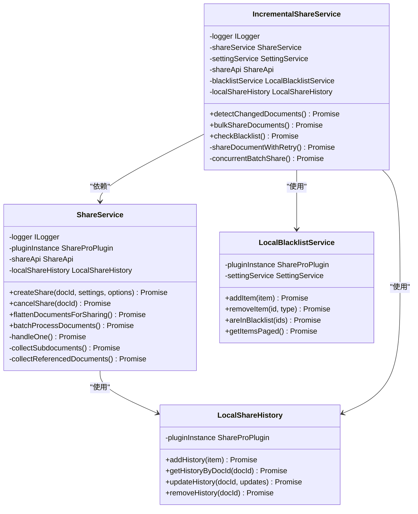
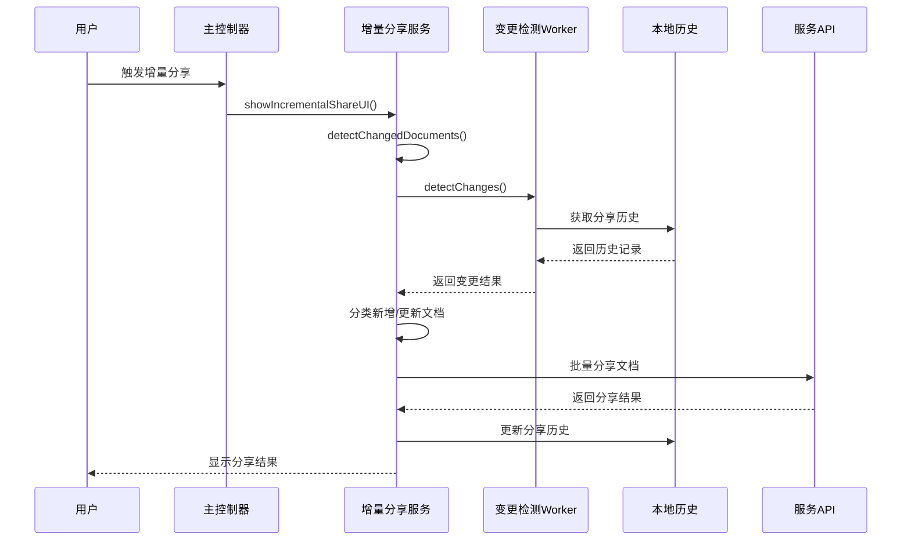
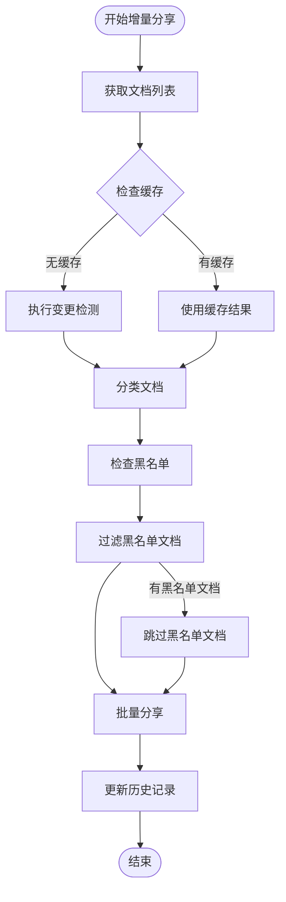
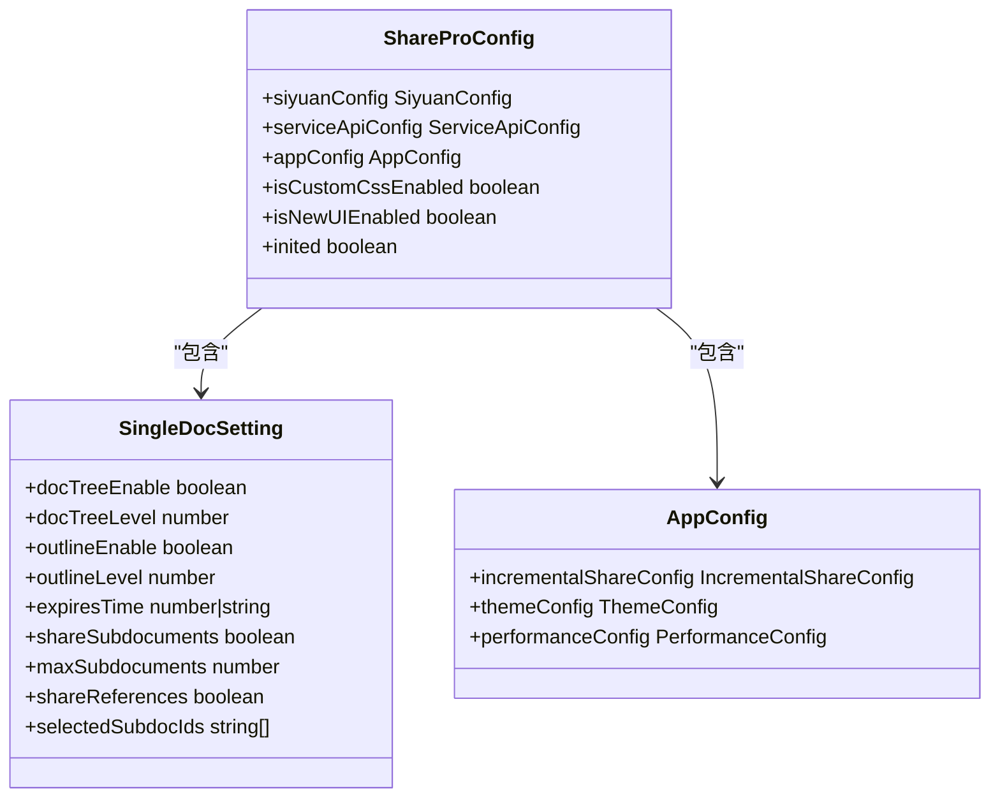
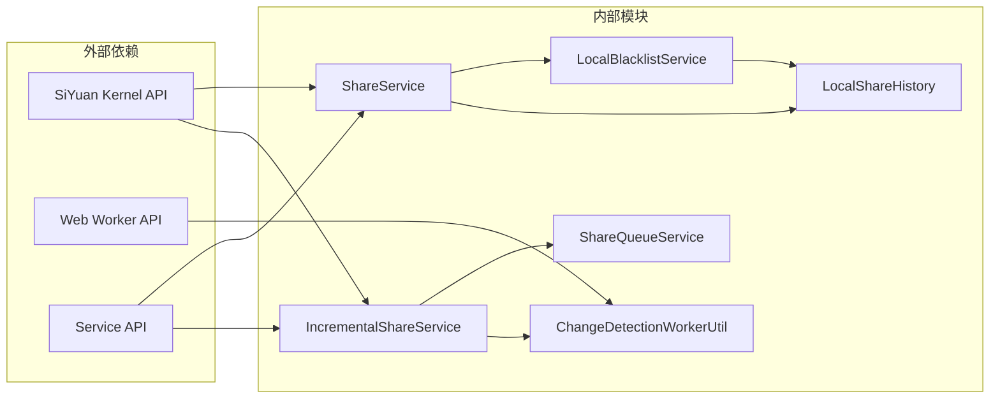
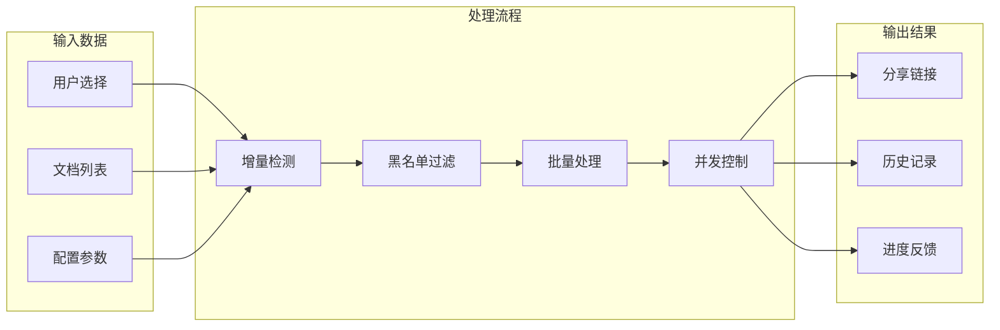

# 引用文档分享规范

<cite>
**本文档中引用的文件**
- [plugin.json](file://plugin.json)
- [README.md](file://README.md)
- [src/index.ts](file://src/index.ts)
- [src/main.ts](file://src/main.ts)
- [src/service/ShareService.ts](file://src/service/ShareService.ts)
- [src/service/IncrementalShareService.ts](file://src/service/IncrementalShareService.ts)
- [src/service/LocalBlacklistService.ts](file://src/service/LocalBlacklistService.ts)
- [src/service/LocalShareHistory.ts](file://src/service/LocalShareHistory.ts)
- [src/service/ShareQueueService.ts](file://src/service/ShareQueueService.ts)
- [src/utils/ChangeDetectionWorkerUtil.ts](file://src/utils/ChangeDetectionWorkerUtil.ts)
- [src/models/ShareProConfig.ts](file://src/models/ShareProConfig.ts)
- [src/models/SingleDocSetting.ts](file://src/models/SingleDocSetting.ts)
- [src/libs/pages/ShareSetting.svelte](file://src/libs/pages/ShareSetting.svelte)
- [openspec/changes/archive/add-incremental-sharing/specs/share/spec.md](file://openspec/changes/archive/add-incremental-sharing/specs/share/spec.md)
</cite>

## 目录
1. [简介](#简介)
2. [项目结构](#项目结构)
3. [核心组件](#核心组件)
4. [架构概览](#架构概览)
5. [详细组件分析](#详细组件分析)
6. [依赖关系分析](#依赖关系分析)
7. [性能考虑](#性能考虑)
8. [故障排除指南](#故障排除指南)
9. [结论](#结论)

## 简介

Share Pro 是一个专为 Siyuan 笔记设计的高级分享插件，提供了一键分享思源笔记的功能。该插件专注于引用文档分享，支持增量分享、批量处理、智能重试等高级功能。

**章节来源**
- [README.md:1-21](file://README.md#L1-L21)
- [plugin.json:1-35](file://plugin.json#L1-L35)

## 项目结构

该项目采用模块化架构设计，主要分为以下几个核心层次：

**图表来源**
- [src/index.ts:33-59](file://src/index.ts#L33-L59)
- [src/main.ts:12-31](file://src/main.ts#L12-L31)

**章节来源**
- [src/index.ts:10-59](file://src/index.ts#L10-L59)
- [src/main.ts:9-34](file://src/main.ts#L9-L34)

## 核心组件

### 插件主控制器

ShareProPlugin 作为插件的主控制器，负责初始化各个服务组件并管理插件生命周期。

**章节来源**
- [src/index.ts:33-178](file://src/index.ts#L33-L178)

### 分享服务核心

ShareService 提供统一的分享入口，支持单文档和批量文档分享，具备智能增量检测功能。

**章节来源**
- [src/service/ShareService.ts:45-89](file://src/service/ShareService.ts#L45-L89)

### 增量分享服务

IncrementalShareService 实现了高级的增量分享功能，包括变更检测、批量处理、智能重试等特性。

**章节来源**
- [src/service/IncrementalShareService.ts:98-129](file://src/service/IncrementalShareService.ts#L98-L129)

## 架构概览

该插件采用分层架构设计，各层职责明确，耦合度低：

**图表来源**
- [src/index.ts:42-58](file://src/index.ts#L42-L58)
- [src/service/IncrementalShareService.ts:113-125](file://src/service/IncrementalShareService.ts#L113-L125)

## 详细组件分析

### 分享服务架构

**图表来源**
- [src/service/ShareService.ts:45-61](file://src/service/ShareService.ts#L45-L61)
- [src/service/IncrementalShareService.ts:98-125](file://src/service/IncrementalShareService.ts#L98-L125)
- [src/service/LocalBlacklistService.ts:31-41](file://src/service/LocalBlacklistService.ts#L31-L41)
- [src/service/LocalShareHistory.ts:23-29](file://src/service/LocalShareHistory.ts#L23-L29)

### 增量分享工作流程

**图表来源**
- [src/main.ts:21-30](file://src/main.ts#L21-L30)
- [src/service/IncrementalShareService.ts:160-210](file://src/service/IncrementalShareService.ts#L160-L210)
- [src/utils/ChangeDetectionWorkerUtil.ts:36-59](file://src/utils/ChangeDetectionWorkerUtil.ts#L36-L59)

### 黑名单过滤机制

**图表来源**
- [src/service/IncrementalShareService.ts:268-351](file://src/service/IncrementalShareService.ts#L268-L351)
- [src/service/LocalBlacklistService.ts:218-246](file://src/service/LocalBlacklistService.ts#L218-L246)

**章节来源**
- [src/service/IncrementalShareService.ts:160-351](file://src/service/IncrementalShareService.ts#L160-L351)
- [src/service/LocalBlacklistService.ts:218-411](file://src/service/LocalBlacklistService.ts#L218-L411)

### 配置管理系统

**图表来源**
- [src/models/ShareProConfig.ts:13-37](file://src/models/ShareProConfig.ts#L13-L37)
- [src/models/SingleDocSetting.ts:16-89](file://src/models/SingleDocSetting.ts#L16-L89)

**章节来源**
- [src/models/ShareProConfig.ts:13-37](file://src/models/ShareProConfig.ts#L13-L37)
- [src/models/SingleDocSetting.ts:16-89](file://src/models/SingleDocSetting.ts#L16-L89)

## 依赖关系分析

### 核心依赖关系

**图表来源**
- [src/service/ShareService.ts:19-37](file://src/service/ShareService.ts#L19-L37)
- [src/service/IncrementalShareService.ts:12-24](file://src/service/IncrementalShareService.ts#L12-L24)
- [src/utils/ChangeDetectionWorkerUtil.ts:17-19](file://src/utils/ChangeDetectionWorkerUtil.ts#L17-L19)

### 数据流分析

**图表来源**
- [src/service/IncrementalShareService.ts:268-474](file://src/service/IncrementalShareService.ts#L268-L474)
- [src/service/ShareService.ts:322-395](file://src/service/ShareService.ts#L322-L395)

**章节来源**
- [src/service/IncrementalShareService.ts:268-474](file://src/service/IncrementalShareService.ts#L268-L474)
- [src/service/ShareService.ts:322-395](file://src/service/ShareService.ts#L322-L395)

## 性能考虑

### 变更检测优化

插件实现了高效的变更检测机制，采用以下优化策略：

1. **Web Worker 支持**：优先使用 Web Worker 进行变更检测，避免阻塞主线程
2. **缓存机制**：5分钟缓存检测结果，减少重复计算
3. **分页处理**：支持分页获取文档，避免一次性处理大量数据
4. **HashSet 过滤**：使用 HashSet 进行黑名单过滤，提升查找效率

### 并发控制

**图表来源**
- [src/service/IncrementalShareService.ts:479-577](file://src/service/IncrementalShareService.ts#L479-L577)

**章节来源**
- [src/service/IncrementalShareService.ts:479-577](file://src/service/IncrementalShareService.ts#L479-L577)

## 故障排除指南

### 常见问题及解决方案

1. **分享失败重试机制**
   - 网络错误：自动重试3次，使用指数退避策略
   - 5xx错误：延迟30秒后重试
   - 4xx错误：立即失败并记录详细日志

2. **队列管理**
   - 支持暂停和继续操作
   - 支持仅重试失败项
   - 保存进度到本地，系统重启后可恢复

3. **黑名单处理**
   - 支持笔记本级别和文档级别黑名单
   - 自动过滤黑名单中的文档
   - 提供黑名单继承关系

**章节来源**
- [src/service/IncrementalShareService.ts:585-682](file://src/service/IncrementalShareService.ts#L585-L682)
- [src/service/ShareQueueService.ts:72-93](file://src/service/ShareQueueService.ts#L72-L93)
- [src/service/LocalBlacklistService.ts:390-411](file://src/service/LocalBlacklistService.ts#L390-L411)

## 结论

Share Pro 插件通过其精心设计的架构和丰富的功能特性，为 Siyuan 笔记用户提供了一个强大而易用的文档分享解决方案。其核心优势包括：

1. **智能化增量分享**：自动检测文档变更，避免重复分享
2. **高性能处理**：采用并发控制和缓存机制，确保大知识库的流畅体验
3. **灵活的配置管理**：支持多种分享选项和个性化设置
4. **完善的错误处理**：提供智能重试和队列管理功能
5. **强大的黑名单系统**：支持细粒度的文档和笔记本级别过滤

该插件不仅满足了基本的分享需求，还通过高级功能如增量分享、批量处理、智能重试等，为用户提供了专业的分享体验。