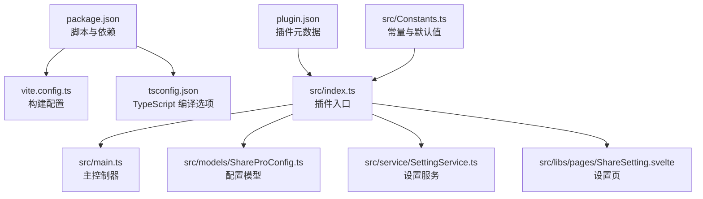
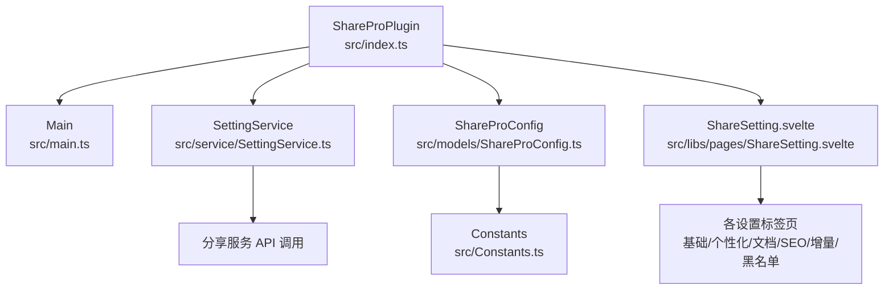
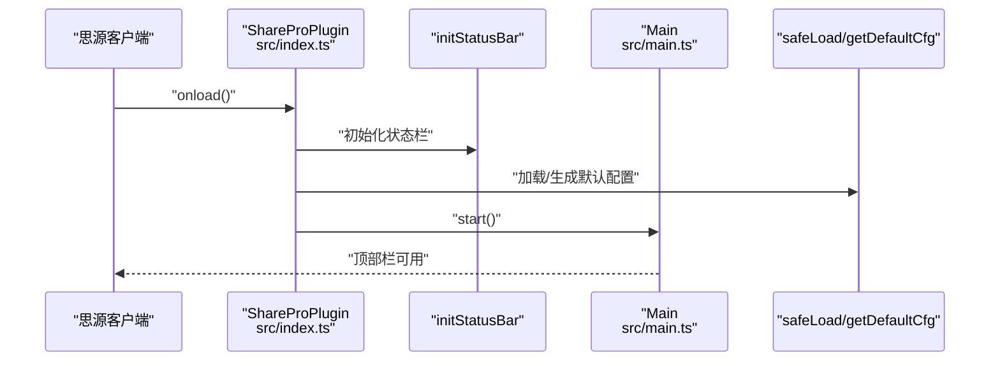
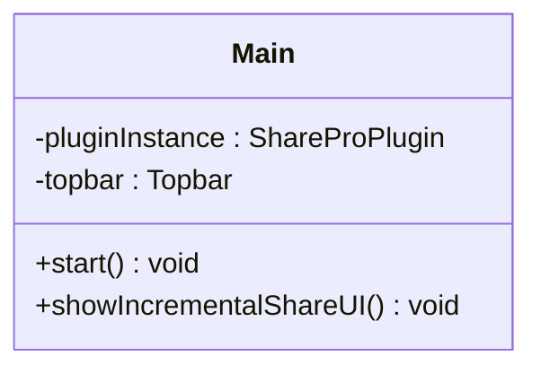
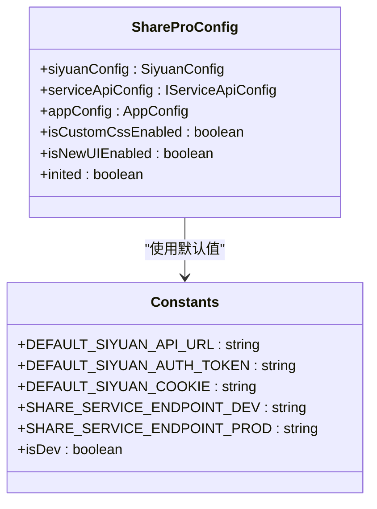
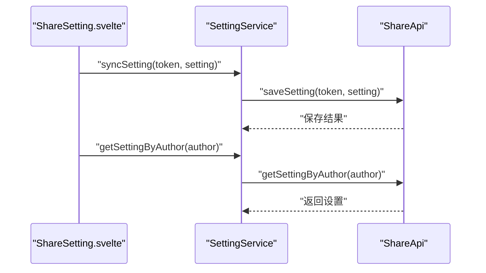
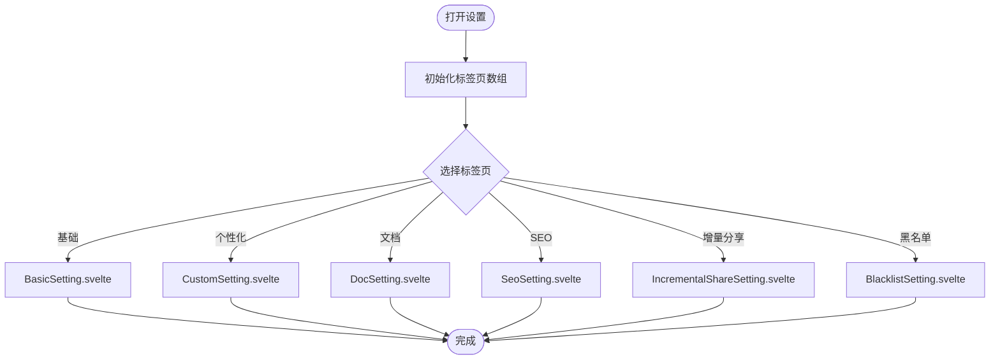
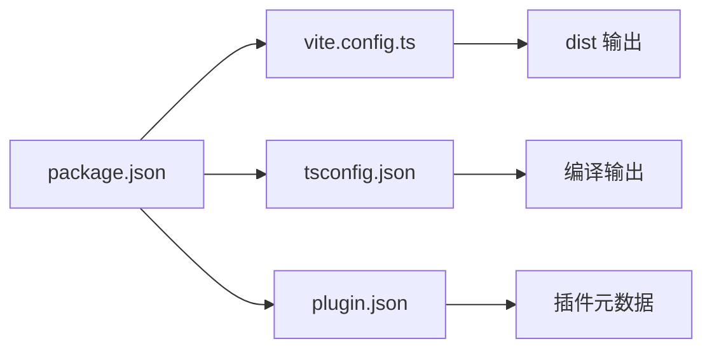

# 快速开始

<cite>
**本文引用的文件**
- [README_zh_CN.md](file://README_zh_CN.md)
- [plugin.json](file://plugin.json)
- [package.json](file://package.json)
- [vite.config.ts](file://vite.config.ts)
- [tsconfig.json](file://tsconfig.json)
- [src/index.ts](file://src/index.ts)
- [src/main.ts](file://src/main.ts)
- [src/models/ShareProConfig.ts](file://src/models/ShareProConfig.ts)
- [src/service/SettingService.ts](file://src/service/SettingService.ts)
- [src/Constants.ts](file://src/Constants.ts)
- [src/libs/pages/ShareSetting.svelte](file://src/libs/pages/ShareSetting.svelte)
- [src/utils/SettingKeys.ts](file://src/utils/SettingKeys.ts)
- [scripts/README.md](file://scripts/README.md)
- [docs/TODO.md](file://docs/TODO.md)
</cite>

## 目录
1. [简介](#简介)
2. [项目结构](#项目结构)
3. [核心组件](#核心组件)
4. [架构总览](#架构总览)
5. [详细组件分析](#详细组件分析)
6. [依赖分析](#依赖分析)
7. [性能考虑](#性能考虑)
8. [故障排除指南](#故障排除指南)
9. [结论](#结论)
10. [附录](#附录)

## 简介
本指南面向首次接触“思源笔记分享专业版”的用户与开发者，帮助你在最短时间内完成插件安装、开发环境搭建、首次运行验证以及基础配置。你将学会：
- 如何安装与启用插件
- 如何准备开发环境并构建产物
- 如何配置分享服务、设置 API 密钥与基础参数
- 如何通过设置面板完成基本使用流程
- 常见安装与运行问题的排查思路

## 项目结构
该仓库采用前端插件工程组织方式，核心入口为 Svelte 插件入口文件，配合 Vite 构建系统与 TypeScript 类型支持。主要目录与职责概览如下：
- src：插件源代码，包含入口、主控制器、模型、服务、工具与 UI 组件
- scripts：辅助脚本（打包、版本同步等）
- docs：需求与规划文档
- 配置文件：package.json、vite.config.ts、tsconfig.json、plugin.json 等

图表来源
- [package.json:1-54](file://package.json#L1-L54)
- [vite.config.ts:1-120](file://vite.config.ts#L1-L120)
- [tsconfig.json:1-53](file://tsconfig.json#L1-L53)
- [plugin.json:1-35](file://plugin.json#L1-L35)
- [src/index.ts:1-178](file://src/index.ts#L1-L178)
- [src/main.ts:1-34](file://src/main.ts#L1-L34)
- [src/models/ShareProConfig.ts:1-40](file://src/models/ShareProConfig.ts#L1-L40)
- [src/service/SettingService.ts:1-39](file://src/service/SettingService.ts#L1-L39)
- [src/libs/pages/ShareSetting.svelte:1-119](file://src/libs/pages/ShareSetting.svelte#L1-L119)
- [src/Constants.ts:1-20](file://src/Constants.ts#L1-L20)

章节来源
- [package.json:1-54](file://package.json#L1-L54)
- [vite.config.ts:1-120](file://vite.config.ts#L1-L120)
- [tsconfig.json:1-53](file://tsconfig.json#L1-L53)
- [plugin.json:1-35](file://plugin.json#L1-L35)

## 核心组件
- 插件入口与生命周期：负责加载状态栏、初始化配置、启动主控制器
- 主控制器：负责顶部栏 UI 初始化与增量分享 UI 的展示
- 配置模型：封装思源 API、分享服务 API 与应用偏好等配置
- 设置服务：封装与分享服务的设置同步与读取能力
- 设置页：提供基础设置、个性化设置、文档设置、SEO 设置、增量分享设置与黑名单管理等多标签页

章节来源
- [src/index.ts:33-178](file://src/index.ts#L33-L178)
- [src/main.ts:12-34](file://src/main.ts#L12-L34)
- [src/models/ShareProConfig.ts:13-37](file://src/models/ShareProConfig.ts#L13-L37)
- [src/service/SettingService.ts:18-36](file://src/service/SettingService.ts#L18-L36)
- [src/libs/pages/ShareSetting.svelte:36-107](file://src/libs/pages/ShareSetting.svelte#L36-L107)

## 架构总览
下图展示了从插件入口到设置页与服务调用的整体交互关系：

图表来源
- [src/index.ts:33-178](file://src/index.ts#L33-L178)
- [src/main.ts:12-34](file://src/main.ts#L12-L34)
- [src/models/ShareProConfig.ts:13-37](file://src/models/ShareProConfig.ts#L13-L37)
- [src/service/SettingService.ts:18-36](file://src/service/SettingService.ts#L18-L36)
- [src/libs/pages/ShareSetting.svelte:36-107](file://src/libs/pages/ShareSetting.svelte#L36-L107)
- [src/Constants.ts:10-20](file://src/Constants.ts#L10-L20)

## 详细组件分析

### 插件入口与生命周期
- 加载时初始化状态栏、加载并安全解析配置、启动主控制器
- 提供打开设置对话框的能力，渲染设置页组件
- 提供默认配置与开发模式下的自动更新逻辑

图表来源
- [src/index.ts:61-95](file://src/index.ts#L61-L95)
- [src/index.ts:103-169](file://src/index.ts#L103-L169)
- [src/main.ts:21-23](file://src/main.ts#L21-L23)

章节来源
- [src/index.ts:61-95](file://src/index.ts#L61-L95)
- [src/index.ts:103-169](file://src/index.ts#L103-L169)
- [src/main.ts:21-23](file://src/main.ts#L21-L23)

### 主控制器与增量分享 UI
- 主控制器负责初始化顶部栏 UI
- 提供显示增量分享 UI 的方法，便于在需要时唤起相关界面

图表来源
- [src/main.ts:12-34](file://src/main.ts#L12-L34)

章节来源
- [src/main.ts:12-34](file://src/main.ts#L12-L34)

### 配置模型与默认值
- 配置模型包含思源 API 配置、分享服务 API 配置、应用偏好、是否启用新 UI 等字段
- 默认值由常量文件提供，区分开发与生产环境的服务端点

图表来源
- [src/models/ShareProConfig.ts:13-37](file://src/models/ShareProConfig.ts#L13-L37)
- [src/Constants.ts:10-20](file://src/Constants.ts#L10-L20)

章节来源
- [src/models/ShareProConfig.ts:13-37](file://src/models/ShareProConfig.ts#L13-L37)
- [src/Constants.ts:10-20](file://src/Constants.ts#L10-L20)

### 设置服务与分享服务 API
- 设置服务封装了与分享服务的设置同步与按作者查询设置的能力
- 通过分享 API 完成配置持久化与读取

图表来源
- [src/service/SettingService.ts:29-35](file://src/service/SettingService.ts#L29-L35)

章节来源
- [src/service/SettingService.ts:18-36](file://src/service/SettingService.ts#L18-L36)

### 设置页与标签页
- 设置页提供多标签页：基础设置、个性化设置、文档设置、SEO 设置、增量分享设置、黑名单管理
- 通过 Tab 组件动态挂载各子页面

图表来源
- [src/libs/pages/ShareSetting.svelte:36-107](file://src/libs/pages/ShareSetting.svelte#L36-L107)

章节来源
- [src/libs/pages/ShareSetting.svelte:36-107](file://src/libs/pages/ShareSetting.svelte#L36-L107)

## 依赖分析
- 包管理与脚本：使用 pnpm，提供开发、构建、预览、测试、打包等脚本
- 构建系统：Vite + Svelte 插件，支持静态资源复制与热重载
- 类型系统：TypeScript，包含 DOM、Svelte、Vite 等类型声明
- 插件元数据：plugin.json 描述插件名称、作者、版本、前后端兼容性等

图表来源
- [package.json:10-21](file://package.json#L10-L21)
- [vite.config.ts:16-119](file://vite.config.ts#L16-L119)
- [tsconfig.json:1-53](file://tsconfig.json#L1-L53)
- [plugin.json:1-35](file://plugin.json#L1-L35)

章节来源
- [package.json:10-21](file://package.json#L10-L21)
- [vite.config.ts:16-119](file://vite.config.ts#L16-L119)
- [tsconfig.json:1-53](file://tsconfig.json#L1-L53)
- [plugin.json:1-35](file://plugin.json#L1-L35)

## 性能考虑
- 构建时根据是否 watch 决定最小化策略与 sourcemap 生成，便于开发调试
- 外部化对 siyuan 的依赖，避免重复打包
- 按需复制 README、图标、国际化文件等静态资源，减少冗余

章节来源
- [vite.config.ts:64-119](file://vite.config.ts#L64-L119)

## 故障排除指南
- 无法加载插件或设置页空白
  - 检查插件元数据与 README 是否存在
  - 确认构建产物已生成且路径正确
- 开发模式下服务端点不生效
  - 确认 isDev 条件与默认服务端点配置一致
- 设置同步失败
  - 核对 API Token 与服务端地址
  - 查看设置服务的保存与读取流程
- 常见开发问题
  - 参考增量分享功能的未完成功能清单，定位 UI 与交互问题

章节来源
- [src/index.ts:103-169](file://src/index.ts#L103-L169)
- [src/service/SettingService.ts:29-35](file://src/service/SettingService.ts#L29-L35)
- [docs/TODO.md:1-23](file://docs/TODO.md#L1-L23)

## 结论
通过本指南，你可以完成插件的安装与开发环境搭建，理解插件的核心组件与配置模型，并在设置页中完成基础配置与首次运行验证。遇到问题时，可依据故障排除指南快速定位与解决。

## 附录

### 安装与运行步骤
- 准备工作
  - 安装 pnpm（版本与包管理器信息见 package.json）
  - 安装 Python 依赖（如需执行脚本）
- 安装依赖
  - 使用 pnpm 安装项目依赖
- 开发运行
  - 启动开发服务器
  - 在浏览器中预览构建产物
- 构建与打包
  - 执行构建脚本生成 dist
  - 使用打包脚本产出最终插件包

章节来源
- [package.json:52-53](file://package.json#L52-L53)
- [scripts/README.md:5-7](file://scripts/README.md#L5-L7)
- [package.json:10-21](file://package.json#L10-L21)

### 环境要求
- Node.js 与 pnpm 版本详见 package.json
- 浏览器或支持的前端环境
- 思源笔记客户端（用于加载插件）

章节来源
- [package.json:52-53](file://package.json#L52-L53)
- [plugin.json:6-13](file://plugin.json#L6-L13)

### 基本配置说明
- 插件元数据：插件名称、作者、版本、前后端兼容性、国际化文件等
- 构建配置：输出目录、最小化策略、外部化依赖、静态资源复制
- TypeScript 配置：模块解析、严格度、类型声明等

章节来源
- [plugin.json:1-35](file://plugin.json#L1-L35)
- [vite.config.ts:16-119](file://vite.config.ts#L16-L119)
- [tsconfig.json:1-53](file://tsconfig.json#L1-L53)

### 插件安装方法
- 将构建产物放入思源笔记的插件目录
- 在思源笔记中启用“在线分享专业版”插件
- 重启或刷新客户端后，在顶部栏看到插件入口

章节来源
- [plugin.json:1-35](file://plugin.json#L1-L35)
- [README_zh_CN.md:1-17](file://README_zh_CN.md#L1-L17)

### 依赖项安装
- 使用 pnpm 安装依赖
- 如需执行脚本，先安装 Python 依赖

章节来源
- [package.json:52-53](file://package.json#L52-L53)
- [scripts/README.md:5-7](file://scripts/README.md#L5-L7)

### 开发环境搭建
- 使用 pnpm 脚本启动开发服务器
- 修改源码后自动构建与热重载
- 预览与调试插件 UI

章节来源
- [package.json:10-21](file://package.json#L10-L21)
- [vite.config.ts:16-119](file://vite.config.ts#L16-L119)

### 首次运行验证
- 打开设置页，确认各标签页正常加载
- 验证默认配置与服务端点
- 尝试保存设置并观察日志输出

章节来源
- [src/index.ts:73-95](file://src/index.ts#L73-L95)
- [src/libs/pages/ShareSetting.svelte:36-107](file://src/libs/pages/ShareSetting.svelte#L36-L107)

### 配置分享服务与 API 密钥
- 在设置页的基础设置中填写分享服务 API 地址与 Token
- 保存后通过设置服务进行同步与读取
- 若为开发模式，确认服务端点指向本地或开发环境

章节来源
- [src/models/ShareProConfig.ts:14-26](file://src/models/ShareProConfig.ts#L14-L26)
- [src/service/SettingService.ts:29-35](file://src/service/SettingService.ts#L29-L35)
- [src/Constants.ts:16-17](file://src/Constants.ts#L16-L17)

### 基本使用流程
- 在顶部栏点击插件入口
- 打开设置页，配置 API 密钥与偏好
- 选择文档并发起分享
- 查看分享结果与历史记录

章节来源
- [src/index.ts:73-95](file://src/index.ts#L73-L95)
- [src/libs/pages/ShareSetting.svelte:36-107](file://src/libs/pages/ShareSetting.svelte#L36-L107)
- [src/utils/SettingKeys.ts:13-72](file://src/utils/SettingKeys.ts#L13-L72)

### 常见安装问题与解决方案
- 依赖安装失败：检查 pnpm 版本与网络环境
- 构建失败：确认 TypeScript 与 Vite 配置无误
- 设置页空白：检查静态资源复制与入口文件
- 开发模式异常：核对 isDev 与默认服务端点

章节来源
- [package.json:52-53](file://package.json#L52-L53)
- [vite.config.ts:25-52](file://vite.config.ts#L25-L52)
- [src/index.ts:103-169](file://src/index.ts#L103-L169)
- [src/Constants.ts:11](file://src/Constants.ts#L11)