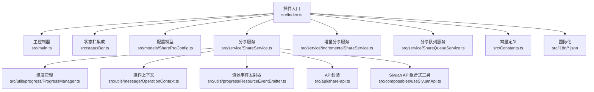
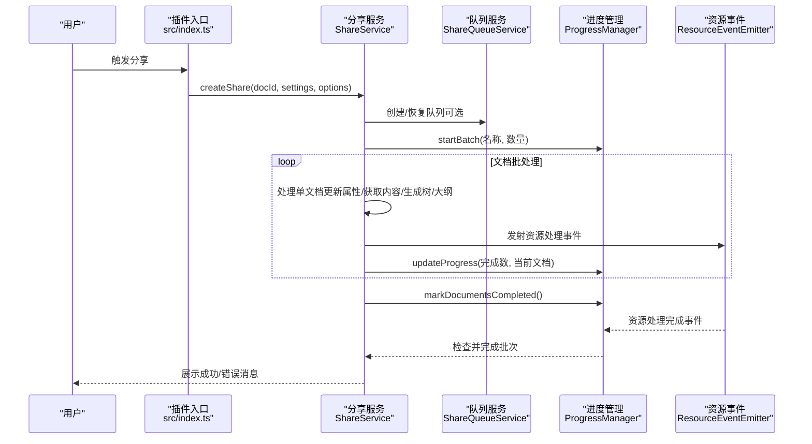
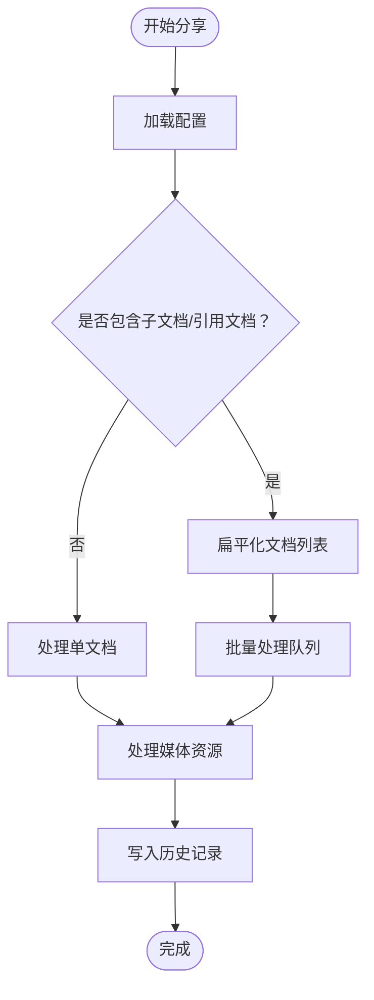
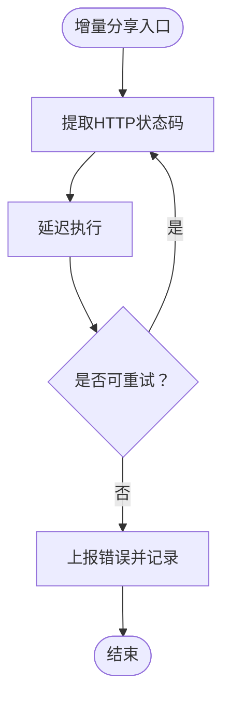
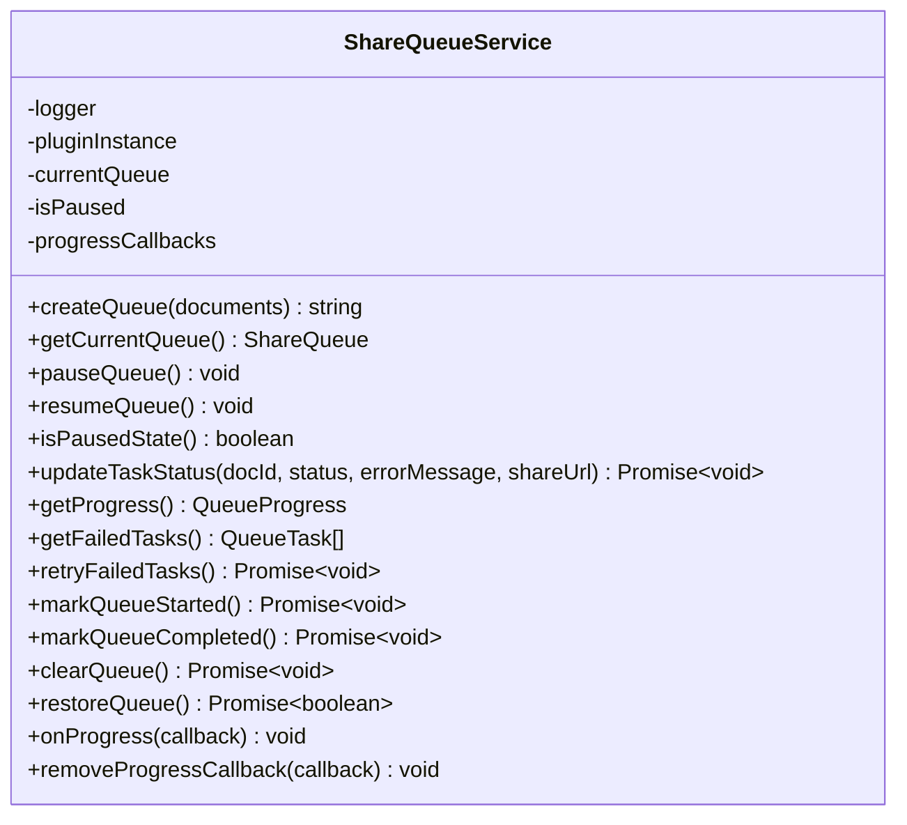
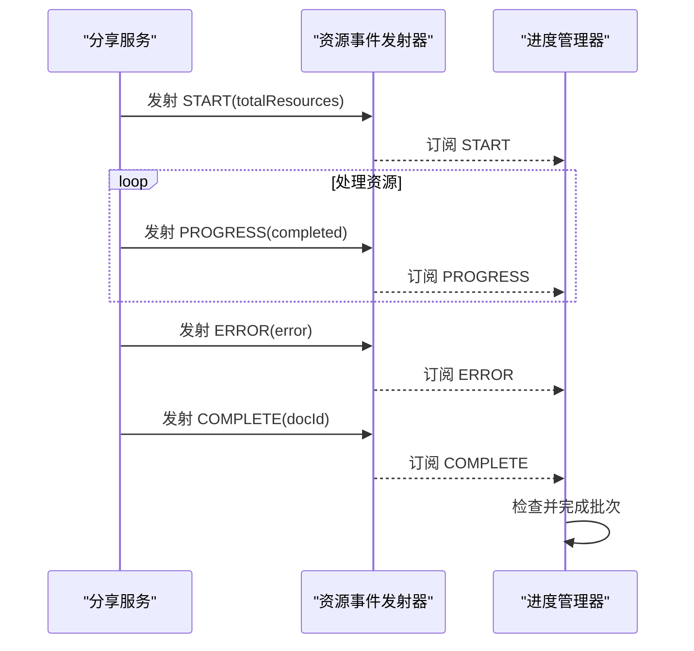
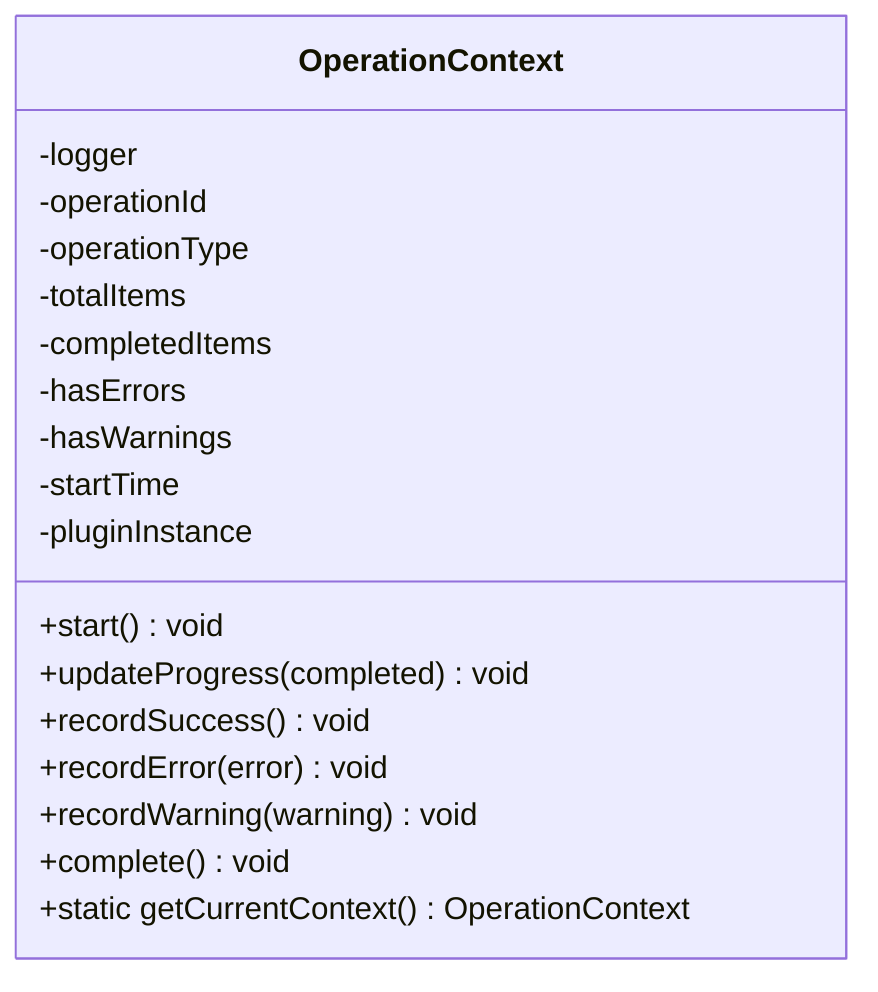
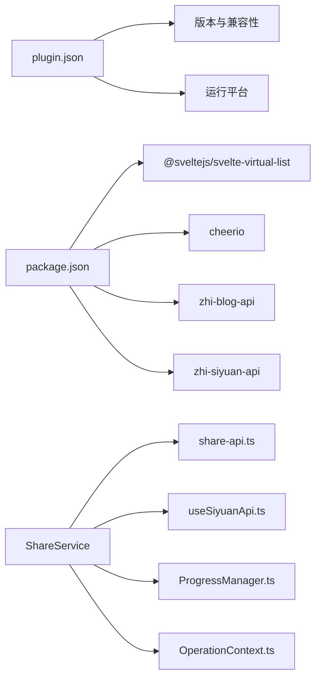

# 故障排除与FAQ

<cite>
**本文引用的文件**
- [README_zh_CN.md](file://README_zh_CN.md)
- [plugin.json](file://plugin.json)
- [package.json](file://package.json)
- [src/index.ts](file://src/index.ts)
- [src/main.ts](file://src/main.ts)
- [src/statusBar.ts](file://src/statusBar.ts)
- [src/Constants.ts](file://src/Constants.ts)
- [src/models/ShareProConfig.ts](file://src/models/ShareProConfig.ts)
- [src/service/ShareService.ts](file://src/service/ShareService.ts)
- [src/service/ShareQueueService.ts](file://src/service/ShareQueueService.ts)
- [src/service/IncrementalShareService.ts](file://src/service/IncrementalShareService.ts)
- [src/utils/message/OperationContext.ts](file://src/utils/message/OperationContext.ts)
- [src/utils/message/index.ts](file://src/utils/message/index.ts)
- [src/utils/progress/ProgressManager.ts](file://src/utils/progress/ProgressManager.ts)
- [src/utils/progress/ResourceEventEmitter.ts](file://src/utils/progress/ResourceEventEmitter.ts)
- [src/utils/progress/ProgressState.ts](file://src/utils/progress/ProgressState.ts)
- [src/utils/progress/progressStore.ts](file://src/utils/progress/progressStore.ts)
- [src/invoke/widgetInvoke.ts](file://src/invoke/widgetInvoke.ts)
- [src/composables/useSiyuanApi.ts](file://src/composables/useSiyuanApi.ts)
- [src/api/share-api.ts](file://src/api/share-api.ts)
- [src/i18n/zh_CN.json](file://src/i18n/zh_CN.json)
- [src/i18n/en_US.json](file://src/i18n/en_US.json)
- [docs/universal-progress-with-share-and-media-2026-03-21.md](file://docs/universal-progress-with-share-and-media-2026-03-21.md)
</cite>

## 目录
1. [简介](#简介)
2. [项目结构](#项目结构)
3. [核心组件](#核心组件)
4. [架构总览](#架构总览)
5. [详细组件分析](#详细组件分析)
6. [依赖关系分析](#依赖关系分析)
7. [性能考虑](#性能考虑)
8. [故障排除指南](#故障排除指南)
9. [结论](#结论)
10. [附录](#附录)

## 简介
本文件面向“思源笔记分享专业版”用户与维护者，提供系统化的故障排除与常见问题解答。内容覆盖安装与配置问题、性能问题、日志分析方法、错误排查步骤、调试技巧、性能优化建议、内存与资源使用优化、错误代码与异常处理、恢复策略、版本兼容性与升级迁移、数据备份与恢复、已知问题与临时方案、社区支持渠道等。

## 项目结构
该插件采用模块化架构，围绕“插件入口 -> 服务层 -> 工具与进度管理 -> UI交互”的分层设计，配合国际化与状态栏集成，形成完整的分享能力闭环。

**图表来源**
- [src/index.ts:1-178](file://src/index.ts#L1-L178)
- [src/main.ts:1-34](file://src/main.ts#L1-L34)
- [src/statusBar.ts:1-32](file://src/statusBar.ts#L1-L32)
- [src/models/ShareProConfig.ts:1-40](file://src/models/ShareProConfig.ts#L1-L40)
- [src/service/ShareService.ts:1-1195](file://src/service/ShareService.ts#L1-L1195)
- [src/service/IncrementalShareService.ts](file://src/service/IncrementalShareService.ts)
- [src/service/ShareQueueService.ts:1-299](file://src/service/ShareQueueService.ts#L1-L299)
- [src/utils/progress/ProgressManager.ts:1-238](file://src/utils/progress/ProgressManager.ts#L1-L238)
- [src/utils/message/OperationContext.ts:1-187](file://src/utils/message/OperationContext.ts#L1-L187)
- [src/utils/progress/ResourceEventEmitter.ts](file://src/utils/progress/ResourceEventEmitter.ts)
- [src/api/share-api.ts](file://src/api/share-api.ts)
- [src/composables/useSiyuanApi.ts](file://src/composables/useSiyuanApi.ts)
- [src/Constants.ts:1-20](file://src/Constants.ts#L1-L20)
- [src/i18n/zh_CN.json](file://src/i18n/zh_CN.json)
- [src/i18n/en_US.json](file://src/i18n/en_US.json)

**章节来源**
- [src/index.ts:1-178](file://src/index.ts#L1-L178)
- [src/main.ts:1-34](file://src/main.ts#L1-L34)
- [src/statusBar.ts:1-32](file://src/statusBar.ts#L1-L32)
- [src/Constants.ts:1-20](file://src/Constants.ts#L1-L20)

## 核心组件
- 插件入口与生命周期：负责初始化、加载配置、挂载UI与状态栏、暴露公共方法。
- 分享服务：统一的分享与取消入口，负责文档聚合、媒体资源处理、历史记录与进度管理。
- 增量分享服务：基于变更检测的增量分享流程，含错误码提取与退避重试策略。
- 分享队列服务：持久化队列、暂停/恢复、失败重试、进度统计与估算。
- 进度管理与资源事件：统一进度状态、资源事件发射与接收、批量与资源处理协同。
- 操作上下文：统一管理单/批量操作的消息策略，避免重复与混乱提示。
- 国际化与状态栏：多语言文案与状态栏展示，便于用户感知操作状态。

**章节来源**
- [src/index.ts:33-178](file://src/index.ts#L33-L178)
- [src/service/ShareService.ts:40-1195](file://src/service/ShareService.ts#L40-L1195)
- [src/service/IncrementalShareService.ts](file://src/service/IncrementalShareService.ts)
- [src/service/ShareQueueService.ts:24-299](file://src/service/ShareQueueService.ts#L24-L299)
- [src/utils/progress/ProgressManager.ts:8-238](file://src/utils/progress/ProgressManager.ts#L8-L238)
- [src/utils/message/OperationContext.ts:23-187](file://src/utils/message/OperationContext.ts#L23-L187)

## 架构总览
下图展示了从用户触发分享到服务端响应的关键调用链路与错误处理要点。

**图表来源**
- [src/index.ts:73-95](file://src/index.ts#L73-L95)
- [src/service/ShareService.ts:235-258](file://src/service/ShareService.ts#L235-L258)
- [src/service/ShareQueueService.ts:38-60](file://src/service/ShareQueueService.ts#L38-L60)
- [src/utils/progress/ProgressManager.ts:12-102](file://src/utils/progress/ProgressManager.ts#L12-L102)
- [src/utils/progress/ResourceEventEmitter.ts](file://src/utils/progress/ResourceEventEmitter.ts)

## 详细组件分析

### 分享服务（ShareService）分析
- 职责边界清晰：统一分享/取消入口，负责文档聚合、媒体处理、历史记录与进度管理。
- 媒体处理：分组并发上传，带进度回调；对非图片资源进行跳过处理并记录日志。
- 历史记录：无论成功与否均写入本地历史，便于回溯与诊断。
- 错误处理：单文档错误即时提示；批量错误通过进度管理器汇总。

**图表来源**
- [src/service/ShareService.ts:235-258](file://src/service/ShareService.ts#L235-L258)
- [src/service/ShareService.ts:531-674](file://src/service/ShareService.ts#L531-L674)
- [src/service/ShareService.ts:676-800](file://src/service/ShareService.ts#L676-L800)

**章节来源**
- [src/service/ShareService.ts:40-1195](file://src/service/ShareService.ts#L40-L1195)

### 增量分享服务（IncrementalShareService）分析
- 错误码提取：从多种错误形态中提取HTTP状态码，便于分类处理与提示。
- 退避重试：内置延迟机制，降低瞬时错误影响。
- 与进度管理协作：通过进度管理器与资源事件实现稳健的增量流程。

**图表来源**
- [src/service/IncrementalShareService.ts](file://src/service/IncrementalShareService.ts)
- [src/service/IncrementalShareService.ts:664-689](file://src/service/IncrementalShareService.ts#L664-L689)

**章节来源**
- [src/service/IncrementalShareService.ts](file://src/service/IncrementalShareService.ts)

### 分享队列服务（ShareQueueService）分析
- 队列生命周期：创建、暂停/恢复、标记开始/完成、清理。
- 进度统计：总任务、完成、成功、失败、跳过、处理中、待处理，并估算剩余时间。
- 失败重试：将失败任务重置为待处理并增加重试次数。
- 持久化：队列状态保存在插件配置中，重启后可恢复。

**图表来源**
- [src/service/ShareQueueService.ts:24-299](file://src/service/ShareQueueService.ts#L24-L299)

**章节来源**
- [src/service/ShareQueueService.ts:24-299](file://src/service/ShareQueueService.ts#L24-L299)

### 进度管理与资源事件分析
- 进度状态：包含文档与资源双维度进度，支持批量完成条件判断。
- 资源事件：统一发射开始、进度、错误、完成事件，供进度管理器订阅。
- UI联动：通过全局状态与事件驱动，实现UI实时更新。

**图表来源**
- [src/utils/progress/ProgressManager.ts:36-100](file://src/utils/progress/ProgressManager.ts#L36-L100)
- [src/utils/progress/ResourceEventEmitter.ts](file://src/utils/progress/ResourceEventEmitter.ts)

**章节来源**
- [src/utils/progress/ProgressManager.ts:8-238](file://src/utils/progress/ProgressManager.ts#L8-L238)
- [src/utils/progress/ResourceEventEmitter.ts](file://src/utils/progress/ResourceEventEmitter.ts)

### 操作上下文（OperationContext）分析
- 单/批量操作区分：批量操作开始时显示开始消息，完成后显示汇总消息；单操作即时提示。
- 错误/警告策略：错误立即显示；警告延后汇总显示。
- 国际化消息：通过插件i18n提供文案占位替换。

**图表来源**
- [src/utils/message/OperationContext.ts:23-187](file://src/utils/message/OperationContext.ts#L23-L187)

**章节来源**
- [src/utils/message/OperationContext.ts:23-187](file://src/utils/message/OperationContext.ts#L23-L187)
- [src/utils/message/index.ts:1-21](file://src/utils/message/index.ts#L1-L21)

## 依赖关系分析
- 版本与兼容性：插件声明最低应用版本，需确保运行环境满足要求。
- 外部依赖：包含Svelte生态、博客API库、虚拟列表等，注意版本冲突与打包体积。
- 插件间耦合：分享服务依赖API封装、Siyuan组合式工具、进度与事件系统，保持高内聚低耦合。

**图表来源**
- [plugin.json:1-35](file://plugin.json#L1-L35)
- [package.json:43-51](file://package.json#L43-L51)
- [src/service/ShareService.ts:10-32](file://src/service/ShareService.ts#L10-L32)
- [src/api/share-api.ts](file://src/api/share-api.ts)
- [src/composables/useSiyuanApi.ts](file://src/composables/useSiyuanApi.ts)
- [src/utils/progress/ProgressManager.ts:1-238](file://src/utils/progress/ProgressManager.ts#L1-L238)
- [src/utils/message/OperationContext.ts:1-187](file://src/utils/message/OperationContext.ts#L1-L187)

**章节来源**
- [plugin.json:1-35](file://plugin.json#L1-L35)
- [package.json:1-54](file://package.json#L1-L54)

## 性能考虑
- 并发与分组：媒体上传按固定分组并发，避免一次性大量请求导致超时或限流。
- 批量处理：通过进度管理器与队列服务控制并发度与重试，减少资源争用。
- 资源处理：仅处理图片资源，非图片跳过并记录日志，降低无效IO。
- UI渲染：使用虚拟列表与轻量UI组件，避免大文档渲染卡顿。
- 日志与状态：合理使用日志级别与状态栏提示，避免频繁DOM更新。

[本节为通用性能指导，无需特定文件引用]

## 故障排除指南

### 安装与启动问题
- 症状：插件未出现在工具栏或无法加载。
  - 排查步骤：
    - 确认运行环境满足最低版本要求。
    - 检查插件是否正确安装与启用。
    - 查看状态栏是否初始化成功。
  - 参考文件：
    - [plugin.json:6](file://plugin.json#L6)
    - [src/statusBar.ts:12-31](file://src/statusBar.ts#L12-L31)
    - [src/index.ts:61-71](file://src/index.ts#L61-L71)

**章节来源**
- [plugin.json:1-35](file://plugin.json#L1-L35)
- [src/statusBar.ts:12-31](file://src/statusBar.ts#L12-L31)
- [src/index.ts:61-71](file://src/index.ts#L61-L71)

### 配置问题
- 症状：分享地址或鉴权失败。
  - 排查步骤：
    - 检查默认配置与开发/生产环境端点。
    - 确认服务端API地址与令牌正确。
    - 验证偏好设置（标题修复、文档树/大纲层级）。
  - 参考文件：
    - [src/Constants.ts:10-20](file://src/Constants.ts#L10-L20)
    - [src/index.ts:103-119](file://src/index.ts#L103-L119)
    - [src/models/ShareProConfig.ts:13-37](file://src/models/ShareProConfig.ts#L13-L37)

**章节来源**
- [src/Constants.ts:10-20](file://src/Constants.ts#L10-L20)
- [src/index.ts:103-119](file://src/index.ts#L103-L119)
- [src/models/ShareProConfig.ts:13-37](file://src/models/ShareProConfig.ts#L13-L37)

### 分享失败与错误排查
- 症状：单/批量分享失败，UI无提示或提示不明确。
  - 排查步骤：
    - 查看操作上下文消息策略与国际化文案。
    - 检查进度管理器状态与资源事件是否正常。
    - 确认历史记录是否写入，定位具体文档与错误信息。
  - 参考文件：
    - [src/utils/message/OperationContext.ts:86-123](file://src/utils/message/OperationContext.ts#L86-L123)
    - [src/utils/progress/ProgressManager.ts:107-156](file://src/utils/progress/ProgressManager.ts#L107-L156)
    - [src/service/ShareService.ts:574-674](file://src/service/ShareService.ts#L574-L674)

**章节来源**
- [src/utils/message/OperationContext.ts:86-123](file://src/utils/message/OperationContext.ts#L86-L123)
- [src/utils/progress/ProgressManager.ts:107-156](file://src/utils/progress/ProgressManager.ts#L107-L156)
- [src/service/ShareService.ts:574-674](file://src/service/ShareService.ts#L574-L674)

### 增量分享异常
- 症状：增量分享过程中断或状态码异常。
  - 排查步骤：
    - 提取HTTP状态码，结合日志定位错误来源。
    - 启用延迟重试，观察是否为瞬时网络波动。
  - 参考文件：
    - [src/service/IncrementalShareService.ts:664-689](file://src/service/IncrementalShareService.ts#L664-L689)

**章节来源**
- [src/service/IncrementalShareService.ts:664-689](file://src/service/IncrementalShareService.ts#L664-L689)

### 队列与进度问题
- 症状：队列无法继续、进度停滞或估算异常。
  - 排查步骤：
    - 恢复队列状态，检查是否处于暂停态。
    - 查看失败任务列表与重试次数。
    - 校验进度回调是否被移除或异常抛出。
  - 参考文件：
    - [src/service/ShareQueueService.ts:232-253](file://src/service/ShareQueueService.ts#L232-L253)
    - [src/service/ShareQueueService.ts:174-195](file://src/service/ShareQueueService.ts#L174-L195)
    - [src/service/ShareQueueService.ts:271-297](file://src/service/ShareQueueService.ts#L271-L297)

**章节来源**
- [src/service/ShareQueueService.ts:232-253](file://src/service/ShareQueueService.ts#L232-L253)
- [src/service/ShareQueueService.ts:174-195](file://src/service/ShareQueueService.ts#L174-L195)
- [src/service/ShareQueueService.ts:271-297](file://src/service/ShareQueueService.ts#L271-L297)

### 媒体资源处理问题
- 症状：图片上传失败或进度异常。
  - 排查步骤：
    - 检查资源事件发射与接收是否匹配。
    - 确认分组上传与并发参数设置。
    - 校验非图片资源跳过逻辑与日志记录。
  - 参考文件：
    - [src/utils/progress/ResourceEventEmitter.ts](file://src/utils/progress/ResourceEventEmitter.ts)
    - [src/utils/progress/ProgressManager.ts:36-100](file://src/utils/progress/ProgressManager.ts#L36-L100)
    - [src/service/ShareService.ts:676-800](file://src/service/ShareService.ts#L676-L800)

**章节来源**
- [src/utils/progress/ResourceEventEmitter.ts](file://src/utils/progress/ResourceEventEmitter.ts)
- [src/utils/progress/ProgressManager.ts:36-100](file://src/utils/progress/ProgressManager.ts#L36-L100)
- [src/service/ShareService.ts:676-800](file://src/service/ShareService.ts#L676-L800)

### 日志分析方法
- 日志位置：插件内部使用统一日志器输出，便于集中检索。
- 关键日志点：
  - 配置加载与初始化。
  - 分享/取消入口与聚合逻辑。
  - 媒体处理分组与上传结果。
  - 队列状态变更与进度更新。
- 建议：结合浏览器开发者工具Network面板与Console日志，定位具体失败环节。

**章节来源**
- [src/index.ts:126-140](file://src/index.ts#L126-L140)
- [src/service/ShareService.ts:531-674](file://src/service/ShareService.ts#L531-L674)
- [src/service/ShareService.ts:676-800](file://src/service/ShareService.ts#L676-L800)
- [src/service/ShareQueueService.ts:258-266](file://src/service/ShareQueueService.ts#L258-L266)

### 调试技巧
- 国际化文案：通过i18n文件定位消息模板，便于翻译与问题描述。
- 状态栏：利用状态栏元素展示简要状态，辅助快速定位问题。
- UI交互：通过对话框与消息提示，结合操作上下文，提升用户体验与可诊断性。
- 参考文件：
  - [src/i18n/zh_CN.json](file://src/i18n/zh_CN.json)
  - [src/i18n/en_US.json](file://src/i18n/en_US.json)
  - [src/statusBar.ts:24-31](file://src/statusBar.ts#L24-L31)
  - [src/utils/message/OperationContext.ts:179-185](file://src/utils/message/OperationContext.ts#L179-L185)

**章节来源**
- [src/i18n/zh_CN.json](file://src/i18n/zh_CN.json)
- [src/i18n/en_US.json](file://src/i18n/en_US.json)
- [src/statusBar.ts:24-31](file://src/statusBar.ts#L24-L31)
- [src/utils/message/OperationContext.ts:179-185](file://src/utils/message/OperationContext.ts#L179-L185)

### 性能优化与资源使用
- 并发控制：合理设置批量处理并发度，避免过度并发导致资源争用。
- 分组上传：媒体按固定分组上传，平衡吞吐与稳定性。
- 虚拟列表：对长列表使用虚拟滚动，减少DOM节点数量。
- 参考文件：
  - [src/service/ShareService.ts:685-777](file://src/service/ShareService.ts#L685-L777)
  - [package.json:44](file://package.json#L44)

**章节来源**
- [src/service/ShareService.ts:685-777](file://src/service/ShareService.ts#L685-L777)
- [package.json:44](file://package.json#L44)

### 错误代码含义与异常处理
- HTTP状态码提取：从错误对象中提取状态码，便于分类处理。
- 异常捕获：统一try/catch包裹关键流程，保证错误不中断整体控制流。
- 恢复策略：队列失败重试、进度回滚、历史记录保留。
- 参考文件：
  - [src/service/IncrementalShareService.ts:664-689](file://src/service/IncrementalShareService.ts#L664-L689)
  - [src/service/ShareService.ts:253-258](file://src/service/ShareService.ts#L253-L258)
  - [src/service/ShareQueueService.ts:183-195](file://src/service/ShareQueueService.ts#L183-L195)

**章节来源**
- [src/service/IncrementalShareService.ts:664-689](file://src/service/IncrementalShareService.ts#L664-L689)
- [src/service/ShareService.ts:253-258](file://src/service/ShareService.ts#L253-L258)
- [src/service/ShareQueueService.ts:183-195](file://src/service/ShareQueueService.ts#L183-L195)

### 版本兼容性、升级迁移与数据备份
- 版本兼容：严格遵循插件声明的最低应用版本。
- 升级迁移：升级前备份配置与队列状态，确保恢复。
- 数据备份：利用插件配置存储与历史记录，定期导出重要数据。
- 参考文件：
  - [plugin.json:6](file://plugin.json#L6)
  - [src/index.ts:150-169](file://src/index.ts#L150-L169)
  - [src/service/ShareQueueService.ts:232-253](file://src/service/ShareQueueService.ts#L232-L253)

**章节来源**
- [plugin.json:6](file://plugin.json#L6)
- [src/index.ts:150-169](file://src/index.ts#L150-L169)
- [src/service/ShareQueueService.ts:232-253](file://src/service/ShareQueueService.ts#L232-L253)

### 已知问题、临时方案与长期计划
- 已知问题：子文档数量过多可能带来性能风险；引用文档解析存在异常容错。
- 临时方案：限制最大子文档数量、分页获取、分组上传媒体。
- 长期计划：参考文档中关于资源事件系统的演进说明，持续优化进度与错误展示。
- 参考文件：
  - [src/service/ShareService.ts:150-171](file://src/service/ShareService.ts#L150-L171)
  - [docs/universal-progress-with-share-and-media-2026-03-21.md:271-299](file://docs/universal-progress-with-share-and-media-2026-03-21.md#L271-L299)

**章节来源**
- [src/service/ShareService.ts:150-171](file://src/service/ShareService.ts#L150-L171)
- [docs/universal-progress-with-share-and-media-2026-03-21.md:271-299](file://docs/universal-progress-with-share-and-media-2026-03-21.md#L271-L299)

### 用户反馈与社区支持
- 官方公告与功能介绍链接可用于获取最新动态。
- 注册码与购买渠道、邮件支持与Issue反馈均可作为问题上报途径。
- 参考文件：
  - [README_zh_CN.md:1-17](file://README_zh_CN.md#L1-L17)

**章节来源**
- [README_zh_CN.md:1-17](file://README_zh_CN.md#L1-L17)

## 结论
通过统一的分享服务、队列与进度管理、资源事件系统以及完善的错误处理与日志记录，本插件在复杂场景下仍能保持稳定与可观的可诊断性。建议在生产环境中关注并发与分组参数、媒体资源处理策略、队列持久化与恢复，并结合国际化文案与状态栏提示提升用户体验。遇到问题时，优先从配置、队列状态、资源事件与历史记录入手排查，必要时参考升级迁移与备份策略保障业务连续性。

[本节为总结性内容，无需特定文件引用]

## 附录
- 快速定位文件路径：插件入口、服务层、进度与事件、UI交互、国际化与常量定义。
- 常见问题索引：安装失败、配置错误、分享失败、增量异常、队列停滞、媒体处理、日志分析、性能优化、版本兼容、数据备份、已知问题与社区支持。

[本节为概览性内容，无需特定文件引用]