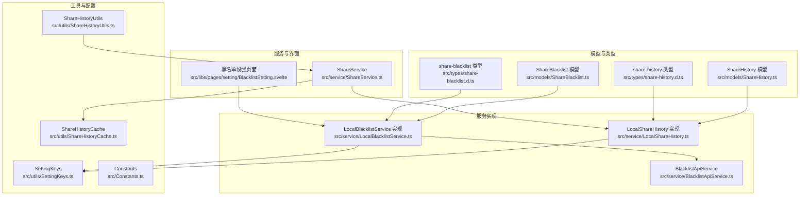
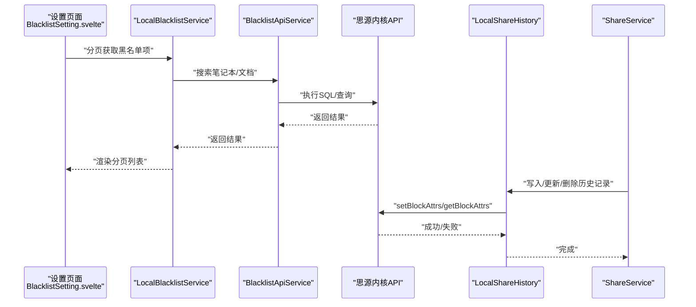
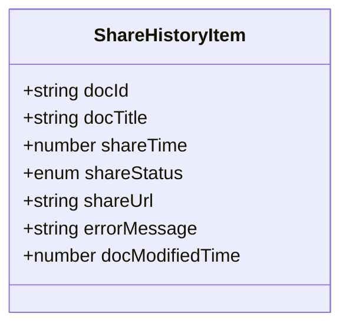
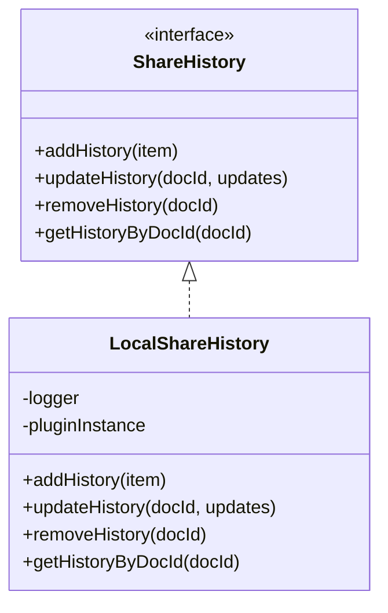
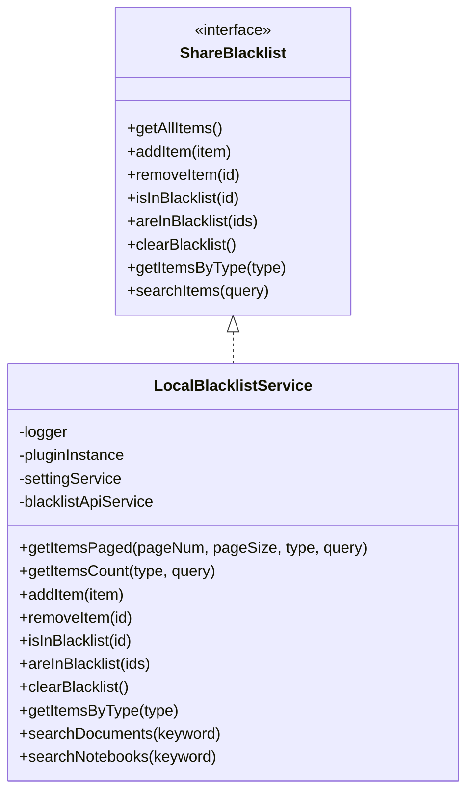
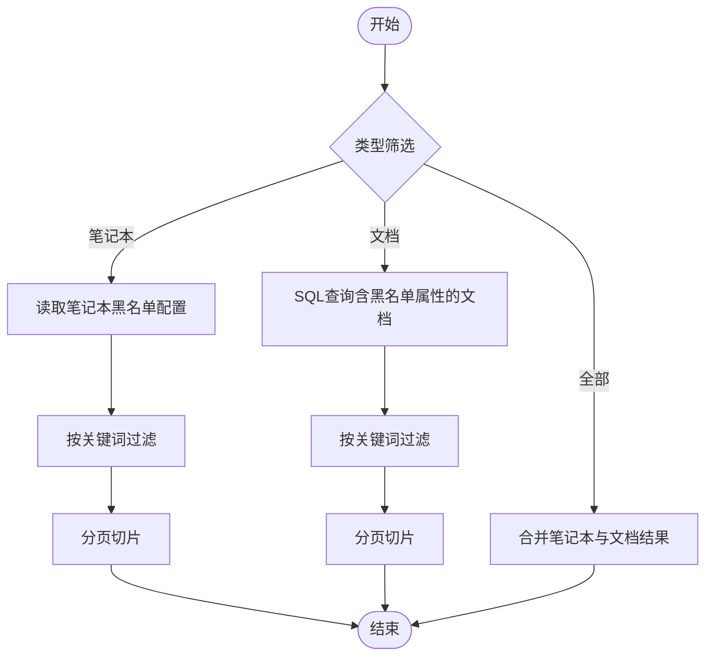
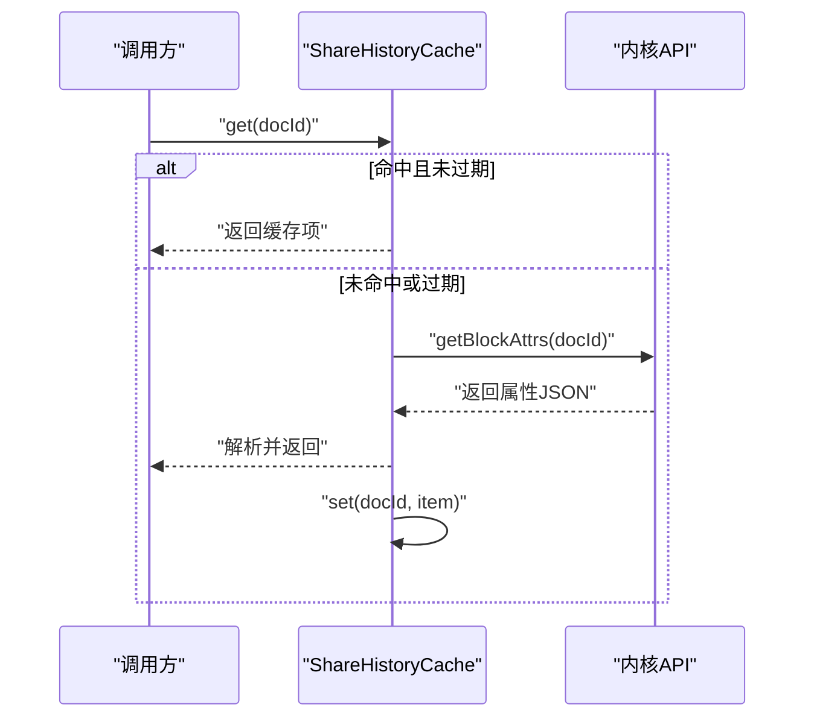
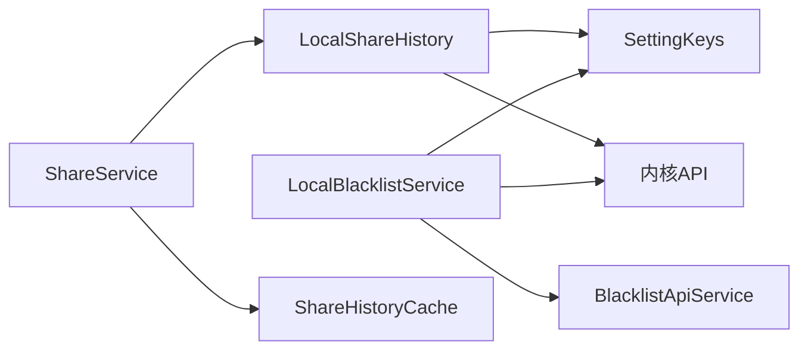

# 历史记录模型

<cite>
**本文引用的文件**
- [src/models/ShareHistory.ts](file://src/models/ShareHistory.ts)
- [src/models/ShareBlacklist.ts](file://src/models/ShareBlacklist.ts)
- [src/types/share-history.d.ts](file://src/types/share-history.d.ts)
- [src/types/share-blacklist.d.ts](file://src/types/share-blacklist.d.ts)
- [src/service/LocalShareHistory.ts](file://src/service/LocalShareHistory.ts)
- [src/service/LocalBlacklistService.ts](file://src/service/LocalBlacklistService.ts)
- [src/utils/ShareHistoryUtils.ts](file://src/utils/ShareHistoryUtils.ts)
- [src/utils/ShareHistoryCache.ts](file://src/utils/ShareHistoryCache.ts)
- [src/utils/SettingKeys.ts](file://src/utils/SettingKeys.ts)
- [src/Constants.ts](file://src/Constants.ts)
- [src/service/BlacklistApiService.ts](file://src/service/BlacklistApiService.ts)
- [src/service/ShareService.ts](file://src/service/ShareService.ts)
- [src/libs/pages/setting/BlacklistSetting.svelte](file://src/libs/pages/setting/BlacklistSetting.svelte)
</cite>

## 目录
1. [简介](#简介)
2. [项目结构](#项目结构)
3. [核心组件](#核心组件)
4. [架构总览](#架构总览)
5. [详细组件分析](#详细组件分析)
6. [依赖分析](#依赖分析)
7. [性能考虑](#性能考虑)
8. [故障排查指南](#故障排查指南)
9. [结论](#结论)
10. [附录](#附录)

## 简介
本文件系统性地文档化了“思源笔记分享专业版”的历史记录与黑名单模型，重点覆盖以下方面：
- ShareHistory 与 ShareBlacklist 的数据结构、字段定义与关系映射
- ShareHistoryItem 的组成与用途
- 黑名单机制的工作原理与管理方式
- 历史数据的增删改查与事务处理
- 历史记录的查询与过滤方法
- 数据生命周期管理与自动清理策略
- 历史记录的备份与恢复机制
- 性能优化与大数据量处理方案
- 常见问题与调试方法

## 项目结构
围绕历史记录与黑名单的关键文件组织如下：
- 模型定义：src/models/ShareHistory.ts、src/models/ShareBlacklist.ts
- 类型声明：src/types/share-history.d.ts、src/types/share-blacklist.d.ts
- 本地实现：src/service/LocalShareHistory.ts、src/service/LocalBlacklistService.ts
- 工具与缓存：src/utils/ShareHistoryUtils.ts、src/utils/ShareHistoryCache.ts、src/utils/SettingKeys.ts
- 常量与API：src/Constants.ts、src/service/BlacklistApiService.ts
- 服务集成：src/service/ShareService.ts
- 前端页面：src/libs/pages/setting/BlacklistSetting.svelte

图表来源
- [src/models/ShareHistory.ts:1-74](file://src/models/ShareHistory.ts#L1-L74)
- [src/models/ShareBlacklist.ts:1-99](file://src/models/ShareBlacklist.ts#L1-L99)
- [src/types/share-history.d.ts:1-59](file://src/types/share-history.d.ts#L1-L59)
- [src/types/share-blacklist.d.ts:1-114](file://src/types/share-blacklist.d.ts#L1-L114)
- [src/service/LocalShareHistory.ts:1-129](file://src/service/LocalShareHistory.ts#L1-L129)
- [src/service/LocalBlacklistService.ts:1-658](file://src/service/LocalBlacklistService.ts#L1-L658)
- [src/utils/ShareHistoryUtils.ts:1-30](file://src/utils/ShareHistoryUtils.ts#L1-L30)
- [src/utils/ShareHistoryCache.ts:1-91](file://src/utils/ShareHistoryCache.ts#L1-L91)
- [src/utils/SettingKeys.ts:1-75](file://src/utils/SettingKeys.ts#L1-L75)
- [src/Constants.ts:1-20](file://src/Constants.ts#L1-L20)
- [src/service/BlacklistApiService.ts:1-76](file://src/service/BlacklistApiService.ts#L1-L76)
- [src/service/ShareService.ts:1-200](file://src/service/ShareService.ts#L1-L200)
- [src/libs/pages/setting/BlacklistSetting.svelte:36-495](file://src/libs/pages/setting/BlacklistSetting.svelte#L36-L495)

章节来源
- [src/models/ShareHistory.ts:1-74](file://src/models/ShareHistory.ts#L1-L74)
- [src/models/ShareBlacklist.ts:1-99](file://src/models/ShareBlacklist.ts#L1-L99)
- [src/types/share-history.d.ts:1-59](file://src/types/share-history.d.ts#L1-L59)
- [src/types/share-blacklist.d.ts:1-114](file://src/types/share-blacklist.d.ts#L1-L114)
- [src/service/LocalShareHistory.ts:1-129](file://src/service/LocalShareHistory.ts#L1-L129)
- [src/service/LocalBlacklistService.ts:1-658](file://src/service/LocalBlacklistService.ts#L1-L658)
- [src/utils/ShareHistoryUtils.ts:1-30](file://src/utils/ShareHistoryUtils.ts#L1-L30)
- [src/utils/ShareHistoryCache.ts:1-91](file://src/utils/ShareHistoryCache.ts#L1-L91)
- [src/utils/SettingKeys.ts:1-75](file://src/utils/SettingKeys.ts#L1-L75)
- [src/Constants.ts:1-20](file://src/Constants.ts#L1-L20)
- [src/service/BlacklistApiService.ts:1-76](file://src/service/BlacklistApiService.ts#L1-L76)
- [src/service/ShareService.ts:1-200](file://src/service/ShareService.ts#L1-L200)
- [src/libs/pages/setting/BlacklistSetting.svelte:36-495](file://src/libs/pages/setting/BlacklistSetting.svelte#L36-L495)

## 核心组件
- ShareHistoryItem：描述单个文档的分享历史记录，包含文档标识、标题、分享时间戳、状态、可选链接与错误信息、以及文档修改时间戳。
- ShareHistory 接口：定义历史记录的增删改查能力，由 LocalShareHistory 实现。
- ShareBlacklist 与 BlacklistItem：描述黑名单项（笔记本/文档），包含标识、名称、类型、添加时间与备注；提供添加、移除、检查、批量检查、清空、按类型获取等能力。
- LocalShareHistory：基于思源内核API，将历史记录以文档属性形式持久化存储。
- LocalBlacklistService：统一管理笔记本与文档两级黑名单，支持分页、计数、搜索、批量检查等。

章节来源
- [src/models/ShareHistory.ts:13-73](file://src/models/ShareHistory.ts#L13-L73)
- [src/models/ShareBlacklist.ts:18-99](file://src/models/ShareBlacklist.ts#L18-L99)
- [src/service/LocalShareHistory.ts:23-129](file://src/service/LocalShareHistory.ts#L23-L129)
- [src/service/LocalBlacklistService.ts:31-658](file://src/service/LocalBlacklistService.ts#L31-L658)

## 架构总览
历史记录与黑名单的运行时交互如下：

图表来源
- [src/libs/pages/setting/BlacklistSetting.svelte:36-495](file://src/libs/pages/setting/BlacklistSetting.svelte#L36-L495)
- [src/service/LocalBlacklistService.ts:31-658](file://src/service/LocalBlacklistService.ts#L31-L658)
- [src/service/BlacklistApiService.ts:22-76](file://src/service/BlacklistApiService.ts#L22-L76)
- [src/service/LocalShareHistory.ts:23-129](file://src/service/LocalShareHistory.ts#L23-L129)
- [src/service/ShareService.ts:40-200](file://src/service/ShareService.ts#L40-L200)

## 详细组件分析

### ShareHistoryItem 数据模型
- 字段说明
  - docId：文档唯一标识
  - docTitle：文档标题
  - shareTime：分享时间戳（取自文档更新时间或创建时间）
  - shareStatus：分享状态（success/failed/pending）
  - shareUrl：分享链接（可选）
  - errorMessage：失败时的错误信息（可选）
  - docModifiedTime：文档修改时间戳（用于变更检测）
- 用途
  - 作为服务端 DocDTO 转换的目标对象，便于在客户端侧统一展示与处理历史记录。

图表来源
- [src/models/ShareHistory.ts:13-48](file://src/models/ShareHistory.ts#L13-L48)
- [src/types/share-history.d.ts:13-48](file://src/types/share-history.d.ts#L13-L48)
- [src/utils/ShareHistoryUtils.ts:15-29](file://src/utils/ShareHistoryUtils.ts#L15-L29)

章节来源
- [src/models/ShareHistory.ts:13-48](file://src/models/ShareHistory.ts#L13-L48)
- [src/types/share-history.d.ts:13-48](file://src/types/share-history.d.ts#L13-L48)
- [src/utils/ShareHistoryUtils.ts:15-29](file://src/utils/ShareHistoryUtils.ts#L15-L29)

### ShareHistory 接口与 LocalShareHistory 实现
- 接口职责
  - addHistory(item)：新增历史记录
  - updateHistory(docId, updates)：更新历史记录
  - removeHistory(docId)：删除历史记录
  - getHistoryByDocId(docId)：按文档ID获取历史记录
- 实现要点
  - 使用 SettingKeys.CUSTOM_SHARE_HISTORY 作为文档属性名
  - 写入时附加版本号与更新时间，读取时做版本兼容处理
  - 删除时使用特殊空值标记以移除属性
  - 通过内核API setBlockAttrs/getBlockAttrs 操作属性

图表来源
- [src/models/ShareHistory.ts:53-73](file://src/models/ShareHistory.ts#L53-L73)
- [src/service/LocalShareHistory.ts:23-129](file://src/service/LocalShareHistory.ts#L23-L129)
- [src/utils/SettingKeys.ts:53-56](file://src/utils/SettingKeys.ts#L53-L56)

章节来源
- [src/models/ShareHistory.ts:53-73](file://src/models/ShareHistory.ts#L53-L73)
- [src/service/LocalShareHistory.ts:23-129](file://src/service/LocalShareHistory.ts#L23-L129)
- [src/utils/SettingKeys.ts:53-56](file://src/utils/SettingKeys.ts#L53-L56)

### ShareBlacklist 与 LocalBlacklistService
- BlacklistItem 字段
  - id/name/type：标识、名称与类型（notebook/document）
  - addedTime：添加时间戳
  - note：备注（可选）
- LocalBlacklistService 能力
  - 分页获取黑名单项（支持笔记本/文档/全部类型筛选与关键词搜索）
  - 统计总数（支持筛选与搜索）
  - 添加/移除/清空黑名单
  - 批量检查（笔记本与文档分别检查）
  - 搜索笔记本/文档（通过 BlacklistApiService）

图表来源
- [src/models/ShareBlacklist.ts:48-99](file://src/models/ShareBlacklist.ts#L48-L99)
- [src/service/LocalBlacklistService.ts:31-658](file://src/service/LocalBlacklistService.ts#L31-L658)
- [src/types/share-blacklist.d.ts:53-93](file://src/types/share-blacklist.d.ts#L53-L93)

章节来源
- [src/models/ShareBlacklist.ts:18-99](file://src/models/ShareBlacklist.ts#L18-L99)
- [src/service/LocalBlacklistService.ts:31-658](file://src/service/LocalBlacklistService.ts#L31-L658)
- [src/types/share-blacklist.d.ts:18-114](file://src/types/share-blacklist.d.ts#L18-L114)

### 黑名单存储策略与查询流程
- 存储位置
  - 笔记本黑名单：存储于插件配置（ShareProConfig）中，随应用配置持久化
  - 文档黑名单：存储于文档属性 custom-share-blacklist-document=true
- 查询与分页
  - 文档黑名单：通过 SQL 查询包含指定属性的文档，并支持分页与关键词过滤
  - 笔记本黑名单：直接从配置中读取，按需同步至服务端
- 批量检查
  - 先检查笔记本黑名单集合，再检查文档黑名单属性集合，合并结果

图表来源
- [src/service/LocalBlacklistService.ts:50-118](file://src/service/LocalBlacklistService.ts#L50-L118)
- [src/service/LocalBlacklistService.ts:473-586](file://src/service/LocalBlacklistService.ts#L473-L586)
- [src/service/LocalBlacklistService.ts:310-462](file://src/service/LocalBlacklistService.ts#L310-L462)

章节来源
- [src/service/LocalBlacklistService.ts:50-118](file://src/service/LocalBlacklistService.ts#L50-L118)
- [src/service/LocalBlacklistService.ts:473-586](file://src/service/LocalBlacklistService.ts#L473-L586)
- [src/service/LocalBlacklistService.ts:310-462](file://src/service/LocalBlacklistService.ts#L310-L462)

### 历史记录的增删改查与事务处理
- 新增/更新
  - 写入前附加版本号与更新时间，确保未来兼容
  - 更新前先读取现有记录，合并更新字段后再写回
- 删除
  - 使用特殊空值标记移除属性，避免残留
- 事务特性
  - 基于内核API的属性设置，属于原子操作级别
  - 未实现跨多文档的分布式事务，建议在上层业务中进行幂等控制

章节来源
- [src/service/LocalShareHistory.ts:31-129](file://src/service/LocalShareHistory.ts#L31-L129)
- [src/utils/SettingKeys.ts:53-61](file://src/utils/SettingKeys.ts#L53-L61)

### 历史记录的查询与过滤
- 单文档查询
  - 通过 getBlockAttrs 读取文档属性，解析 JSON 并去除内部字段
- 批量查询
  - 通过 IShareHistoryService 的 getHistoryByIds 接口（类型定义）支持批量获取
- 缓存
  - 内存缓存，TTL=5分钟，命中时减少内核API调用

图表来源
- [src/utils/ShareHistoryCache.ts:19-91](file://src/utils/ShareHistoryCache.ts#L19-L91)
- [src/service/LocalShareHistory.ts:101-129](file://src/service/LocalShareHistory.ts#L101-L129)
- [src/types/share-history.d.ts:53-59](file://src/types/share-history.d.ts#L53-L59)

章节来源
- [src/utils/ShareHistoryCache.ts:19-91](file://src/utils/ShareHistoryCache.ts#L19-L91)
- [src/service/LocalShareHistory.ts:101-129](file://src/service/LocalShareHistory.ts#L101-L129)
- [src/types/share-history.d.ts:53-59](file://src/types/share-history.d.ts#L53-L59)

### 数据生命周期管理与自动清理
- 生命周期
  - 创建：首次分享时写入
  - 更新：状态变化或链接生成时更新
  - 删除：显式 remove 或清空黑名单（文档级不可一键清空）
- 自动清理
  - 代码未实现自动清理策略，建议通过定期任务或用户操作触发清理
- 版本兼容
  - 写入时带版本号，读取时去除内部字段，保证向前兼容

章节来源
- [src/service/LocalShareHistory.ts:36-41](file://src/service/LocalShareHistory.ts#L36-L41)
- [src/service/LocalShareHistory.ts:110-120](file://src/service/LocalShareHistory.ts#L110-L120)

### 备份与恢复机制
- 历史记录
  - 以文档属性形式存储，可通过导出/导入文档或备份插件配置实现备份
- 黑名单
  - 笔记本黑名单存储于插件配置，可随配置备份；文档黑名单需通过 SQL 导出清单后恢复

章节来源
- [src/service/LocalBlacklistService.ts:310-354](file://src/service/LocalBlacklistService.ts#L310-L354)
- [src/service/LocalBlacklistService.ts:473-503](file://src/service/LocalBlacklistService.ts#L473-L503)

### 性能优化与大数据量处理
- 缓存
  - 内存缓存（TTL=5分钟）显著降低重复查询成本
- 分页与搜索
  - 黑名单分页与关键词过滤，避免一次性加载过多数据
- 批量检查
  - 先笔记本后文档，减少多次内核调用
- 大文档属性
  - 文档黑名单仅存储布尔标识，避免属性膨胀

章节来源
- [src/utils/ShareHistoryCache.ts:19-91](file://src/utils/ShareHistoryCache.ts#L19-L91)
- [src/service/LocalBlacklistService.ts:50-118](file://src/service/LocalBlacklistService.ts#L50-L118)
- [src/service/LocalBlacklistService.ts:631-656](file://src/service/LocalBlacklistService.ts#L631-L656)

## 依赖分析
- 模块耦合
  - LocalShareHistory 依赖 SettingKeys 与内核API
  - LocalBlacklistService 依赖 SettingKeys、内核API与 BlacklistApiService
  - ShareService 依赖 LocalShareHistory 与 ShareHistoryCache
- 外部依赖
  - 思源内核API（属性读写、SQL查询）
  - 插件配置存储（ShareProConfig）

图表来源
- [src/service/LocalShareHistory.ts:13-15](file://src/service/LocalShareHistory.ts#L13-L15)
- [src/service/LocalBlacklistService.ts:13-20](file://src/service/LocalBlacklistService.ts#L13-L20)
- [src/service/ShareService.ts:28-50](file://src/service/ShareService.ts#L28-L50)

章节来源
- [src/service/LocalShareHistory.ts:13-15](file://src/service/LocalShareHistory.ts#L13-L15)
- [src/service/LocalBlacklistService.ts:13-20](file://src/service/LocalBlacklistService.ts#L13-L20)
- [src/service/ShareService.ts:28-50](file://src/service/ShareService.ts#L28-L50)

## 性能考虑
- 读取热点优化：通过 ShareHistoryCache 减少内核API调用
- 写入一致性：单文档属性写入为原子操作，建议在上层做幂等与重试
- 查询效率：黑名单分页+关键词过滤，避免全量扫描
- 存储体积：文档黑名单仅存布尔标识，避免属性膨胀

## 故障排查指南
- 历史记录读取失败
  - 检查文档属性是否存在与JSON是否有效
  - 确认版本兼容处理逻辑
- 黑名单检查异常
  - 确认笔记本黑名单配置是否正确
  - 检查文档属性是否正确设置
- 分页与搜索无效
  - 核对 SQL 查询与关键词转义
  - 确认分页参数与偏移量
- 日志定位
  - 使用服务实例的日志输出定位具体步骤与错误堆栈

章节来源
- [src/service/LocalShareHistory.ts:123-127](file://src/service/LocalShareHistory.ts#L123-L127)
- [src/service/LocalBlacklistService.ts:114-118](file://src/service/LocalBlacklistService.ts#L114-L118)
- [src/service/LocalBlacklistService.ts:433-437](file://src/service/LocalBlacklistService.ts#L433-L437)

## 结论
该历史记录与黑名单体系以“文档属性+插件配置”为核心存储，结合缓存与分页查询，在保证易用性的同时兼顾性能与扩展性。建议在生产环境中配合定期备份与监控，确保数据安全与稳定性。

## 附录
- 常用常量与键名
  - SettingKeys.CUSTOM_SHARE_HISTORY：历史记录属性名
  - SettingKeys.CUSTOM_SHARE_BLACKLIST_DOCUMENT：文档黑名单标识
  - NULL_VALUE_FOR_SIYUAN_ATTR_REMOVE：移除属性的空值标记
- 页面集成
  - 黑名单设置页面通过 LocalBlacklistService 提供分页、搜索与筛选能力

章节来源
- [src/utils/SettingKeys.ts:53-61](file://src/utils/SettingKeys.ts#L53-L61)
- [src/Constants.ts:19](file://src/Constants.ts#L19)
- [src/libs/pages/setting/BlacklistSetting.svelte:36-495](file://src/libs/pages/setting/BlacklistSetting.svelte#L36-L495)