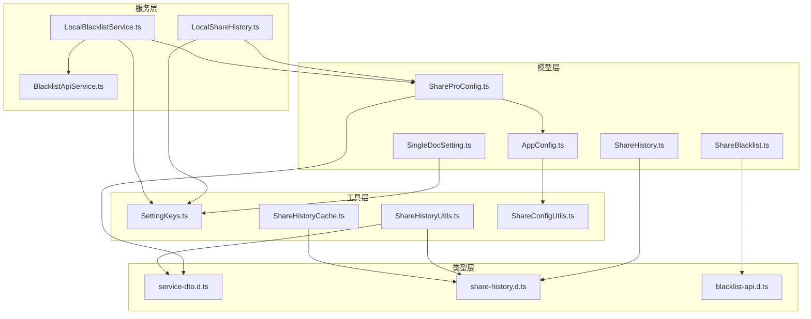
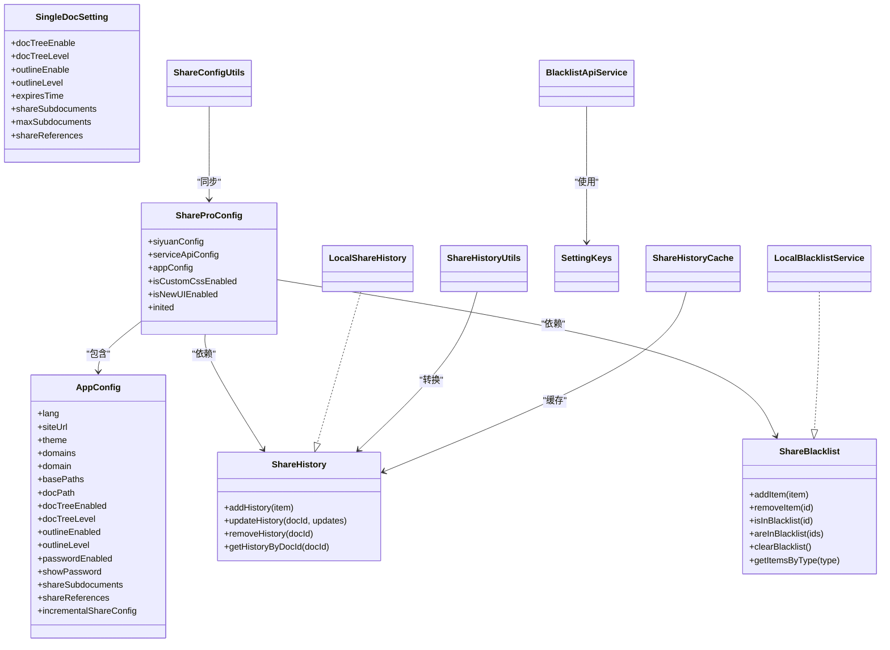
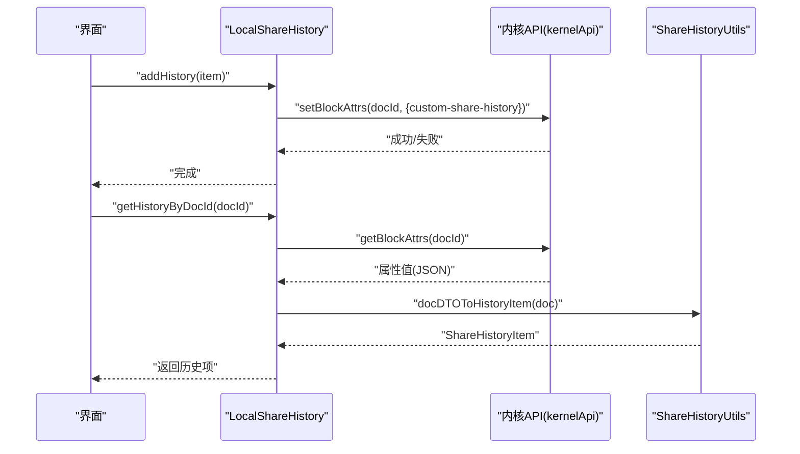
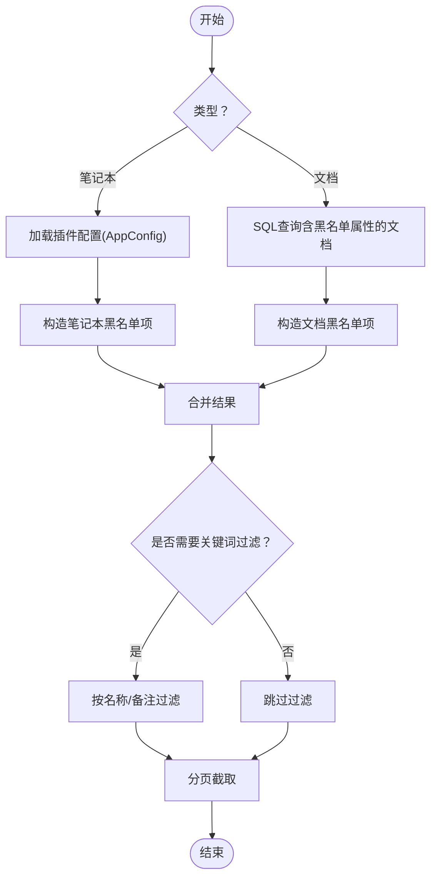
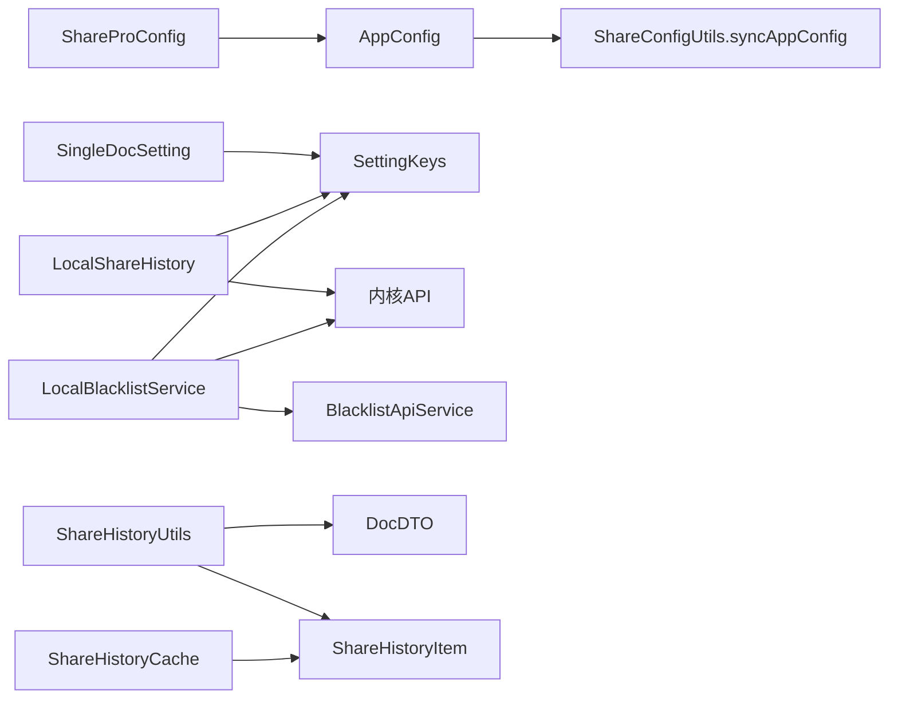

# 数据模型

<cite>
**本文引用的文件**
- [src/models/ShareProConfig.ts](file://src/models/ShareProConfig.ts)
- [src/models/AppConfig.ts](file://src/models/AppConfig.ts)
- [src/models/SingleDocSetting.ts](file://src/models/SingleDocSetting.ts)
- [src/models/ShareHistory.ts](file://src/models/ShareHistory.ts)
- [src/models/ShareBlacklist.ts](file://src/models/ShareBlacklist.ts)
- [src/types/service-dto.d.ts](file://src/types/service-dto.d.ts)
- [src/types/share-history.d.ts](file://src/types/share-history.d.ts)
- [src/types/blacklist-api.d.ts](file://src/types/blacklist-api.d.ts)
- [src/utils/SettingKeys.ts](file://src/utils/SettingKeys.ts)
- [src/utils/ShareHistoryUtils.ts](file://src/utils/ShareHistoryUtils.ts)
- [src/utils/ShareHistoryCache.ts](file://src/utils/ShareHistoryCache.ts)
- [src/utils/ShareConfigUtils.ts](file://src/utils/ShareConfigUtils.ts)
- [src/service/LocalShareHistory.ts](file://src/service/LocalShareHistory.ts)
- [src/service/LocalBlacklistService.ts](file://src/service/LocalBlacklistService.ts)
- [src/service/BlacklistApiService.ts](file://src/service/BlacklistApiService.ts)
- [src/Constants.ts](file://src/Constants.ts)
</cite>

## 目录
1. [简介](#简介)
2. [项目结构](#项目结构)
3. [核心组件](#核心组件)
4. [架构总览](#架构总览)
5. [详细组件分析](#详细组件分析)
6. [依赖分析](#依赖分析)
7. [性能考量](#性能考量)
8. [故障排查指南](#故障排查指南)
9. [结论](#结论)
10. [附录](#附录)

## 简介
本文件系统化梳理“思源笔记分享专业版”的数据模型，覆盖配置模型（ShareProConfig、AppConfig、SingleDocSetting）、历史记录模型（ShareHistory）、黑名单模型（ShareBlacklist）以及它们之间的关系与约束。文档同时给出数据访问模式、缓存策略、性能优化建议、数据生命周期与迁移路径，并对安全与隐私提出实践建议。

## 项目结构
围绕数据模型的相关文件主要分布在以下模块：
- 模型层：配置与实体定义
- 类型层：服务端/前端通用数据契约
- 工具层：键名、转换、缓存与配置同步
- 服务层：本地持久化与内核API交互



图表来源
- [src/models/ShareProConfig.ts:1-40](file://src/models/ShareProConfig.ts#L1-L40)
- [src/models/AppConfig.ts:1-88](file://src/models/AppConfig.ts#L1-L88)
- [src/models/SingleDocSetting.ts:1-85](file://src/models/SingleDocSetting.ts#L1-L85)
- [src/models/ShareHistory.ts:1-74](file://src/models/ShareHistory.ts#L1-L74)
- [src/models/ShareBlacklist.ts:1-99](file://src/models/ShareBlacklist.ts#L1-L99)
- [src/types/service-dto.d.ts:1-134](file://src/types/service-dto.d.ts#L1-L134)
- [src/types/share-history.d.ts:1-59](file://src/types/share-history.d.ts#L1-L59)
- [src/types/blacklist-api.d.ts:1-99](file://src/types/blacklist-api.d.ts#L1-L99)
- [src/utils/SettingKeys.ts:1-75](file://src/utils/SettingKeys.ts#L1-L75)
- [src/utils/ShareHistoryUtils.ts:1-30](file://src/utils/ShareHistoryUtils.ts#L1-L30)
- [src/utils/ShareHistoryCache.ts:1-91](file://src/utils/ShareHistoryCache.ts#L1-L91)
- [src/utils/ShareConfigUtils.ts:1-83](file://src/utils/ShareConfigUtils.ts#L1-L83)
- [src/service/LocalShareHistory.ts:1-129](file://src/service/LocalShareHistory.ts#L1-L129)
- [src/service/LocalBlacklistService.ts:1-658](file://src/service/LocalBlacklistService.ts#L1-L658)
- [src/service/BlacklistApiService.ts:1-76](file://src/service/BlacklistApiService.ts#L1-L76)

章节来源
- [src/models/ShareProConfig.ts:1-40](file://src/models/ShareProConfig.ts#L1-L40)
- [src/models/AppConfig.ts:1-88](file://src/models/AppConfig.ts#L1-L88)
- [src/models/SingleDocSetting.ts:1-85](file://src/models/SingleDocSetting.ts#L1-L85)
- [src/models/ShareHistory.ts:1-74](file://src/models/ShareHistory.ts#L1-L74)
- [src/models/ShareBlacklist.ts:1-99](file://src/models/ShareBlacklist.ts#L1-L99)

## 核心组件
本节聚焦于配置与实体模型的字段、类型、用途与约束。

- ShareProConfig
  - 作用：顶层配置容器，聚合服务端API配置、应用配置、UI开关与初始化标记。
  - 关键字段：siyuanConfig（apiUrl、token、cookie、偏好配置）、serviceApiConfig、appConfig、isCustomCssEnabled、isNewUIEnabled、inited。
  - 约束：siyuanConfig.preferenceConfig中的docTreeLevel、outlineLevel为数值型；inited为布尔值；isNewUIEnabled为布尔值。

- AppConfig
  - 作用：站点与主题、域名/路径、全局密码保护、增量分享、子文档/引用文档分享等配置。
  - 关键字段：theme.mode（枚举："system"|"dark"|"light"）、theme.lightTheme/darkTheme、themeVersion、domains、domain、basePaths、docPath、docTreeEnabled/docTreeLevel、outlineEnabled/outlineLevel、passwordEnabled/showPassword、shareSubdocuments、shareReferences、incrementalShareConfig.enabled/lastShareTime/notebookBlacklist。
  - 约束：incrementalShareConfig.notebookBlacklist元素含id/name/type(固定为"notebook")/addedTime/note；[key: string]: any用于兼容输入约束。

- SingleDocSetting
  - 作用：文档级个性化设置（如树/大纲可见性、层级、有效期、子文档/引用文档分享开关与数量限制）。
  - 关键字段：docTreeEnable/docTreeLevel、outlineEnable/outlineLevel、expiresTime（秒，0表示永久）、shareSubdocuments、maxSubdocuments（-1表示无限制，最大999）、shareReferences。

- ShareHistory（接口）
  - 作用：定义历史记录增删改查与状态管理。
  - 关键字段：docId、docTitle、shareTime（时间戳）、shareStatus（枚举："success"|"failed"|"pending"）、shareUrl（可选）、errorMessage（可选）、docModifiedTime（用于变更检测）。
  - 约束：docId为主键；shareStatus为受限枚举；docModifiedTime用于增量检测。

- ShareBlacklist（接口）
  - 作用：定义黑名单增删查、批量检查、分页与类型筛选。
  - 关键字段：BlacklistItem(id、name、type、addedTime、note?)；BlacklistConfig(notebookBlacklist、docBlacklist、enabled)。
  - 约束：BlacklistItemType限定为"notebook"|"document"；notebookBlacklist元素含id/name/type(固定为"notebook")/addedTime/note。

章节来源
- [src/models/ShareProConfig.ts:13-37](file://src/models/ShareProConfig.ts#L13-L37)
- [src/models/AppConfig.ts:12-85](file://src/models/AppConfig.ts#L12-L85)
- [src/models/SingleDocSetting.ts:18-82](file://src/models/SingleDocSetting.ts#L18-L82)
- [src/models/ShareHistory.ts:13-48](file://src/models/ShareHistory.ts#L13-L48)
- [src/models/ShareBlacklist.ts:18-98](file://src/models/ShareBlacklist.ts#L18-L98)

## 架构总览
下图展示数据模型与服务层的交互关系，包括本地持久化、内核API调用与配置同步。



图表来源
- [src/models/ShareProConfig.ts:13-37](file://src/models/ShareProConfig.ts#L13-L37)
- [src/models/AppConfig.ts:12-85](file://src/models/AppConfig.ts#L12-L85)
- [src/models/SingleDocSetting.ts:18-82](file://src/models/SingleDocSetting.ts#L18-L82)
- [src/models/ShareHistory.ts:53-73](file://src/models/ShareHistory.ts#L53-L73)
- [src/models/ShareBlacklist.ts:48-78](file://src/models/ShareBlacklist.ts#L48-L78)
- [src/service/LocalShareHistory.ts:23-128](file://src/service/LocalShareHistory.ts#L23-L128)
- [src/service/LocalBlacklistService.ts:31-657](file://src/service/LocalBlacklistService.ts#L31-L657)
- [src/service/BlacklistApiService.ts:22-75](file://src/service/BlacklistApiService.ts#L22-L75)
- [src/utils/SettingKeys.ts:13-72](file://src/utils/SettingKeys.ts#L13-L72)
- [src/utils/ShareHistoryUtils.ts:15-29](file://src/utils/ShareHistoryUtils.ts#L15-L29)
- [src/utils/ShareHistoryCache.ts:19-90](file://src/utils/ShareHistoryCache.ts#L19-L90)
- [src/utils/ShareConfigUtils.ts:74-80](file://src/utils/ShareConfigUtils.ts#L74-L80)

## 详细组件分析

### ShareProConfig 与 AppConfig
- 结构要点
  - ShareProConfig聚合了服务端API配置（siyuanConfig）、应用配置（appConfig）与UI开关。
  - AppConfig涵盖站点元信息、主题、域名/路径、全局密码保护、增量分享配置（含笔记本黑名单数组）等。
- 约束与校验
  - 数值型字段（docTreeLevel、outlineLevel、maxSubdocuments）应进行边界校验（如非负、上限999）。
  - 枚举字段（theme.mode、shareStatus）需严格限定取值。
- 依赖关系
  - ShareProConfig依赖AppConfig；AppConfig依赖DefaultAppConfig与Sync流程。

章节来源
- [src/models/ShareProConfig.ts:13-37](file://src/models/ShareProConfig.ts#L13-L37)
- [src/models/AppConfig.ts:12-85](file://src/models/AppConfig.ts#L12-L85)
- [src/utils/ShareConfigUtils.ts:16-42](file://src/utils/ShareConfigUtils.ts#L16-L42)

### SingleDocSetting
- 字段与业务规则
  - docTreeEnable/docTreeLevel、outlineEnable/outlineLevel：控制文档树与大纲渲染层级。
  - expiresTime：单位秒，0表示永久有效；需与服务端有效期策略一致。
  - shareSubdocuments/maxSubdocuments：子文档分享开关与数量上限。
  - shareReferences：引用文档分享开关。
- 数据验证建议
  - maxSubdocuments ∈ {-1, 1..999}；expiresTime ≥ 0。

章节来源
- [src/models/SingleDocSetting.ts:18-82](file://src/models/SingleDocSetting.ts#L18-L82)
- [src/utils/SettingKeys.ts:13-72](file://src/utils/SettingKeys.ts#L13-L72)

### ShareHistory（历史记录）
- 数据模型
  - 主键：docId。
  - 状态：success/failed/pending。
  - 时间戳：shareTime（基于服务端更新/创建时间推导）、docModifiedTime（用于变更检测）。
- 服务层实现
  - LocalShareHistory通过文档属性(custom-share-history)持久化，使用JSON序列化存储，并带版本与更新时间字段用于兼容。
  - ShareHistoryUtils负责将服务端DocDTO转换为客户端ShareHistoryItem。
  - ShareHistoryCache提供内存缓存（TTL=5分钟），提升读取性能。
- 约束与规则
  - docId唯一；状态枚举受控；docModifiedTime用于增量分享场景的变更检测。



图表来源
- [src/service/LocalShareHistory.ts:31-127](file://src/service/LocalShareHistory.ts#L31-L127)
- [src/utils/ShareHistoryUtils.ts:15-29](file://src/utils/ShareHistoryUtils.ts#L15-L29)
- [src/utils/ShareHistoryCache.ts:31-56](file://src/utils/ShareHistoryCache.ts#L31-L56)

章节来源
- [src/models/ShareHistory.ts:13-73](file://src/models/ShareHistory.ts#L13-L73)
- [src/types/share-history.d.ts:13-58](file://src/types/share-history.d.ts#L13-L58)
- [src/service/LocalShareHistory.ts:31-127](file://src/service/LocalShareHistory.ts#L31-L127)
- [src/utils/ShareHistoryUtils.ts:15-29](file://src/utils/ShareHistoryUtils.ts#L15-L29)
- [src/utils/ShareHistoryCache.ts:19-90](file://src/utils/ShareHistoryCache.ts#L19-L90)

### ShareBlacklist（黑名单）
- 数据模型
  - BlacklistItem：id、name、type（"notebook"|"document"）、addedTime、note。
  - BlacklistConfig：notebookBlacklist、docBlacklist、enabled。
- 服务层实现
  - LocalBlacklistService将笔记本黑名单存储于插件配置（incrementalShareConfig.notebookBlacklist），文档黑名单存储于文档属性（custom-share-blacklist-document）。
  - 支持分页查询、计数、批量检查、搜索笔记本/文档。
  - BlacklistApiService封装内核API的搜索能力。
- 约束与规则
  - 笔记本黑名单元素type固定为"notebook"；文档黑名单通过布尔属性标识。
  - 批量检查时需分别处理笔记本与文档两类来源。



图表来源
- [src/service/LocalBlacklistService.ts:50-118](file://src/service/LocalBlacklistService.ts#L50-L118)
- [src/service/LocalBlacklistService.ts:468-586](file://src/service/LocalBlacklistService.ts#L468-L586)
- [src/service/BlacklistApiService.ts:34-74](file://src/service/BlacklistApiService.ts#L34-L74)

章节来源
- [src/models/ShareBlacklist.ts:18-98](file://src/models/ShareBlacklist.ts#L18-L98)
- [src/types/blacklist-api.d.ts:18-98](file://src/types/blacklist-api.d.ts#L18-L98)
- [src/service/LocalBlacklistService.ts:31-657](file://src/service/LocalBlacklistService.ts#L31-L657)
- [src/service/BlacklistApiService.ts:22-75](file://src/service/BlacklistApiService.ts#L22-L75)

## 依赖分析
- 模型间依赖
  - ShareProConfig依赖AppConfig；AppConfig依赖DefaultAppConfig与配置同步工具。
- 工具与服务依赖
  - LocalShareHistory依赖SettingKeys与内核API；LocalBlacklistService依赖SettingKeys、BlacklistApiService与内核API；ShareHistoryUtils依赖DocDTO与ShareHistoryItem；ShareHistoryCache独立于具体存储。
- 外部接口
  - 内核API：setBlockAttrs/getBlockAttrs/sql。
  - 服务端同步：SettingService.syncSetting(token, appConfig)。



图表来源
- [src/models/ShareProConfig.ts:10-27](file://src/models/ShareProConfig.ts#L10-L27)
- [src/utils/ShareConfigUtils.ts:74-80](file://src/utils/ShareConfigUtils.ts#L74-L80)
- [src/service/LocalShareHistory.ts:13-29](file://src/service/LocalShareHistory.ts#L13-L29)
- [src/service/LocalBlacklistService.ts:13-41](file://src/service/LocalBlacklistService.ts#L13-L41)
- [src/service/BlacklistApiService.ts:12-28](file://src/service/BlacklistApiService.ts#L12-L28)
- [src/utils/ShareHistoryUtils.ts:10-15](file://src/utils/ShareHistoryUtils.ts#L10-L15)
- [src/utils/ShareHistoryCache.ts:10-21](file://src/utils/ShareHistoryCache.ts#L10-L21)

章节来源
- [src/utils/SettingKeys.ts:13-72](file://src/utils/SettingKeys.ts#L13-L72)
- [src/utils/ShareHistoryUtils.ts:15-29](file://src/utils/ShareHistoryUtils.ts#L15-L29)
- [src/utils/ShareHistoryCache.ts:19-90](file://src/utils/ShareHistoryCache.ts#L19-L90)
- [src/utils/ShareConfigUtils.ts:74-80](file://src/utils/ShareConfigUtils.ts#L74-L80)
- [src/service/LocalShareHistory.ts:31-127](file://src/service/LocalShareHistory.ts#L31-L127)
- [src/service/LocalBlacklistService.ts:31-657](file://src/service/LocalBlacklistService.ts#L31-L657)
- [src/service/BlacklistApiService.ts:34-74](file://src/service/BlacklistApiService.ts#L34-L74)

## 性能考量
- 缓存策略
  - ShareHistoryCache采用内存Map+时间戳，TTL=5分钟，命中后直接返回，降低内核API调用频率。
- 分页与批量
  - LocalBlacklistService支持分页与批量检查，减少一次性查询压力；文档黑名单通过属性批量获取。
- 序列化与版本
  - 历史记录与增量分享配置均带版本字段，便于未来演进与兼容处理。
- I/O优化
  - 文档黑名单仅存储布尔属性，避免属性爆炸；笔记本黑名单集中存储于插件配置，便于快速读取。

章节来源
- [src/utils/ShareHistoryCache.ts:19-90](file://src/utils/ShareHistoryCache.ts#L19-L90)
- [src/service/LocalBlacklistService.ts:50-118](file://src/service/LocalBlacklistService.ts#L50-L118)
- [src/service/LocalBlacklistService.ts:591-606](file://src/service/LocalBlacklistService.ts#L591-L606)
- [src/service/LocalShareHistory.ts:37-41](file://src/service/LocalShareHistory.ts#L37-L41)

## 故障排查指南
- 历史记录异常
  - 症状：获取历史记录为空或解析失败。
  - 排查：确认文档属性custom-share-history是否存在且JSON合法；检查版本字段与兼容逻辑；查看内核API返回。
- 黑名单检查失败
  - 症状：批量检查返回全为false或部分失败。
  - 排查：笔记本黑名单依赖插件配置；文档黑名单依赖文档属性；逐项确认属性值与文档ID有效性。
- 同步失败
  - 症状：配置同步返回错误。
  - 排查：检查SettingService.syncSetting返回码与消息；确认token有效与网络连通。

章节来源
- [src/service/LocalShareHistory.ts:101-127](file://src/service/LocalShareHistory.ts#L101-L127)
- [src/service/LocalBlacklistService.ts:221-249](file://src/service/LocalBlacklistService.ts#L221-L249)
- [src/utils/ShareConfigUtils.ts:74-80](file://src/utils/ShareConfigUtils.ts#L74-L80)

## 结论
本文档系统化梳理了ShareProConfig、AppConfig、SingleDocSetting、ShareHistory、ShareBlacklist等核心数据模型及其服务层实现。通过明确字段定义、约束与业务规则，结合缓存与分页策略，可有效支撑增量分享、子文档/引用文档分享与黑名单管理等高级特性。后续版本可通过版本字段与默认配置实现平滑迁移。

## 附录

### 数据模型与关系图
```mermaid
erDiagram
SHARE_PRO_CONFIG {
string apiUrl
string token
string cookie
boolean isCustomCssEnabled
boolean isNewUIEnabled
boolean inited
}
APP_CONFIG {
string lang
string siteUrl
string theme_mode
string theme_lightTheme
string theme_darkTheme
string themeVersion
string[] domains
string domain
string[] basePaths
string docPath
boolean docTreeEnabled
number docTreeLevel
boolean outlineEnabled
number outlineLevel
boolean passwordEnabled
boolean showPassword
boolean shareSubdocuments
boolean shareReferences
boolean incremental_enabled
number incremental_lastShareTime
}
SINGLE_DOC_SETTING {
boolean docTreeEnable
number docTreeLevel
boolean outlineEnable
number outlineLevel
number|string expiresTime
boolean shareSubdocuments
number maxSubdocuments
boolean shareReferences
}
SHARE_HISTORY_ITEM {
string docId PK
string docTitle
number shareTime
string shareStatus
string shareUrl
string errorMessage
number docModifiedTime
}
BLACKLIST_ITEM {
string id PK
string name
string type
number addedTime
string note
}
SHARE_PRO_CONFIG ||--|| APP_CONFIG : "包含"
APP_CONFIG ||--o{ BLACKLIST_ITEM : "笔记本黑名单"
SINGLE_DOC_SETTING ||--|| SHARE_HISTORY_ITEM : "影响"
```

图表来源
- [src/models/ShareProConfig.ts:14-27](file://src/models/ShareProConfig.ts#L14-L27)
- [src/models/AppConfig.ts:23-81](file://src/models/AppConfig.ts#L23-L81)
- [src/models/SingleDocSetting.ts:25-81](file://src/models/SingleDocSetting.ts#L25-L81)
- [src/models/ShareHistory.ts:17-47](file://src/models/ShareHistory.ts#L17-L47)
- [src/models/ShareBlacklist.ts:22-42](file://src/models/ShareBlacklist.ts#L22-L42)

### 示例数据
- ShareHistoryItem
  - docId: "20250101120000-abcd1234"
  - docTitle: "示例文档"
  - shareTime: 1735689600000
  - shareStatus: "success"
  - shareUrl: "https://example.com/share/abcd1234"
  - errorMessage: ""
  - docModifiedTime: 1735689600000
- BlacklistItem
  - id: "nb-123"
  - name: "示例笔记本"
  - type: "notebook"
  - addedTime: 1735689600000
  - note: "示例备注"
- AppConfig（简化）
  - lang: "zh_CN"
  - siteUrl: "https://siyuan.wiki"
  - theme.mode: "light"
  - domains: ["example.com"]
  - incrementalShareConfig.enabled: true
  - incrementalShareConfig.notebookBlacklist: [{ id: "nb-123", name: "示例笔记本", type: "notebook", addedTime: 1735689600000, note: "" }]

章节来源
- [src/models/ShareHistory.ts:17-47](file://src/models/ShareHistory.ts#L17-L47)
- [src/models/ShareBlacklist.ts:22-42](file://src/models/ShareBlacklist.ts#L22-L42)
- [src/models/AppConfig.ts:16-42](file://src/models/AppConfig.ts#L16-L42)

### 数据访问模式与缓存策略
- 历史记录
  - 写入：LocalShareHistory.addHistory → 内核API setBlockAttrs。
  - 读取：LocalShareHistory.getHistoryByDocId → 内核API getBlockAttrs → ShareHistoryUtils转换 → ShareHistoryCache命中/回填。
- 黑名单
  - 写入：LocalBlacklistService.addItem → 插件配置（笔记本）或文档属性（文档）。
  - 读取：LocalBlacklistService.getItemsPaged/areInBlacklist → 内核API SQL/属性批量读取。
- 缓存
  - ShareHistoryCache：TTL=5分钟，命中后直接返回；写入/失效时更新时间戳。

章节来源
- [src/service/LocalShareHistory.ts:31-127](file://src/service/LocalShareHistory.ts#L31-L127)
- [src/utils/ShareHistoryUtils.ts:15-29](file://src/utils/ShareHistoryUtils.ts#L15-L29)
- [src/utils/ShareHistoryCache.ts:19-90](file://src/utils/ShareHistoryCache.ts#L19-L90)
- [src/service/LocalBlacklistService.ts:50-118](file://src/service/LocalBlacklistService.ts#L50-L118)
- [src/service/LocalBlacklistService.ts:591-606](file://src/service/LocalBlacklistService.ts#L591-L606)

### 数据生命周期、保留策略与归档规则
- 历史记录
  - 生命周期：由用户主动删除或通过removeHistory清理；可结合TTL缓存减少长期驻留。
  - 保留策略：建议按docId维度保留最近一次分享状态；可扩展按时间窗口清理。
- 黑名单
  - 生命周期：用户手动维护；笔记本黑名单随插件配置持久化；文档黑名单随文档属性持久化。
  - 保留策略：建议定期审计与清理无效ID；提供批量清空与导入导出能力（建议）。
- 归档规则：建议将历史记录与黑名单导出为结构化文本，便于跨设备迁移与备份。

章节来源
- [src/service/LocalShareHistory.ts:84-99](file://src/service/LocalShareHistory.ts#L84-L99)
- [src/service/LocalBlacklistService.ts:254-266](file://src/service/LocalBlacklistService.ts#L254-L266)

### 数据迁移路径与版本管理
- 版本字段
  - 历史记录：_version、_updatedAt；增量分享配置：notebookBlacklist元素含addedTime。
- 迁移策略
  - 读取时检查_version，旧格式自动兼容；新增字段默认值来自DefaultAppConfig。
  - 配置同步：syncAppConfig通过SettingService将本地配置同步至服务端，失败时抛出错误。
- 版本映射
  - 主题版本：versionMap映射不同主题版本号，便于升级与兼容。

章节来源
- [src/service/LocalShareHistory.ts:37-41](file://src/service/LocalShareHistory.ts#L37-L41)
- [src/utils/ShareConfigUtils.ts:64-72](file://src/utils/ShareConfigUtils.ts#L64-L72)
- [src/utils/ShareConfigUtils.ts:74-80](file://src/utils/ShareConfigUtils.ts#L74-L80)

### 数据安全、隐私与访问控制
- 属性隔离
  - 历史记录与黑名单分别存储于文档属性与插件配置，避免敏感信息泄露。
- 最小权限
  - 仅通过内核API执行必要操作（读取/写入属性、SQL查询）。
- 隐私建议
  - 不在黑名单中存储个人敏感信息；提供导出/删除功能以便用户自证清白。
- 访问控制
  - 通过SettingService.syncSetting携带token进行服务端同步，确保接口鉴权。

章节来源
- [src/service/LocalShareHistory.ts:43-47](file://src/service/LocalShareHistory.ts#L43-L47)
- [src/service/LocalBlacklistService.ts:596-598](file://src/service/LocalBlacklistService.ts#L596-L598)
- [src/utils/ShareConfigUtils.ts:74-80](file://src/utils/ShareConfigUtils.ts#L74-L80)