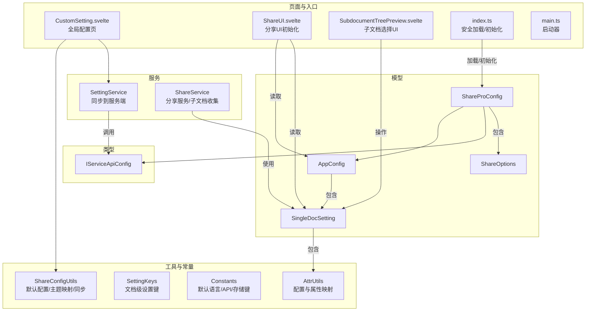
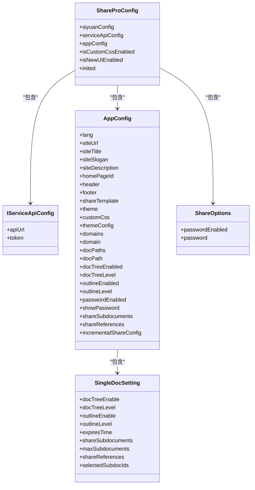
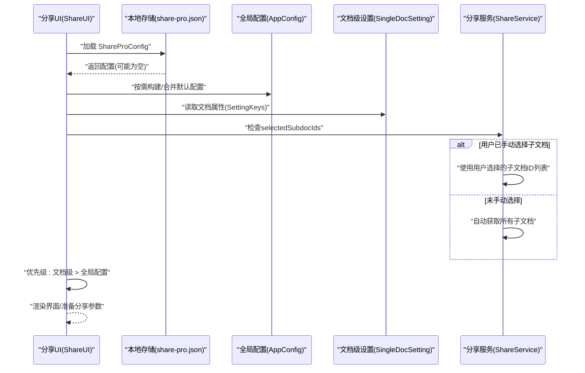
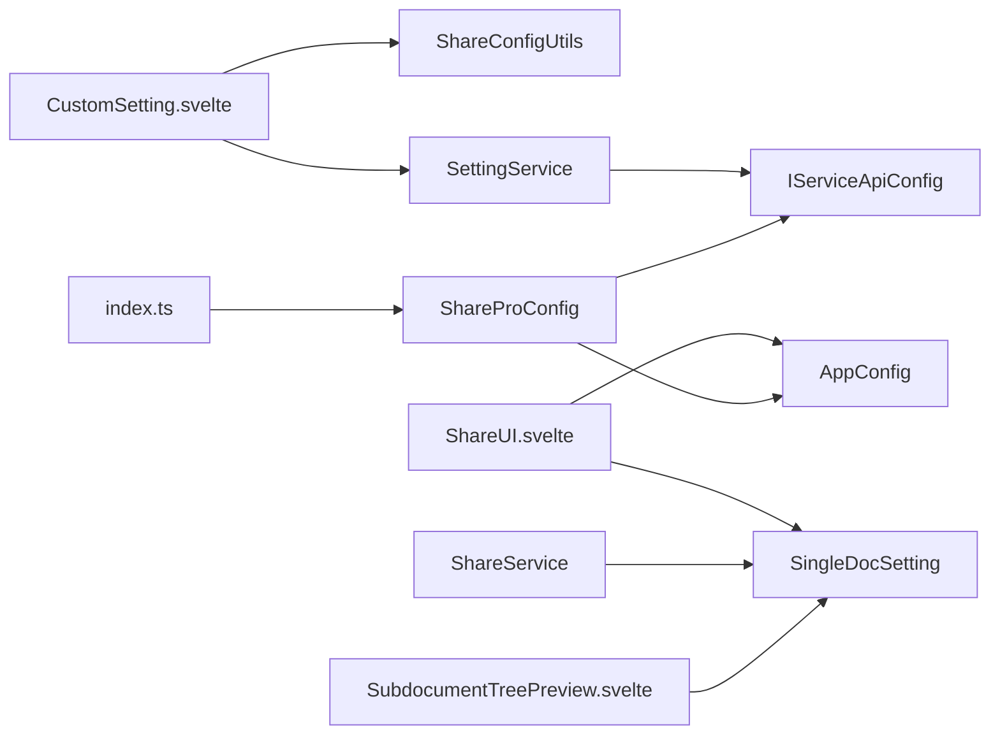

# 配置模型

<cite>
**本文引用的文件**
- [src/models/ShareProConfig.ts](file://src/models/ShareProConfig.ts)
- [src/models/AppConfig.ts](file://src/models/AppConfig.ts)
- [src/models/SingleDocSetting.ts](file://src/models/SingleDocSetting.ts)
- [src/models/ShareOptions.ts](file://src/models/ShareOptions.ts)
- [src/utils/ShareConfigUtils.ts](file://src/utils/ShareConfigUtils.ts)
- [src/utils/SettingKeys.ts](file://src/utils/SettingKeys.ts)
- [src/service/SettingService.ts](file://src/service/SettingService.ts)
- [src/types/service-api.d.ts](file://src/types/service-api.d.ts)
- [src/Constants.ts](file://src/Constants.ts)
- [src/index.ts](file://src/index.ts)
- [src/libs/pages/setting/CustomSetting.svelte](file://src/libs/pages/setting/CustomSetting.svelte)
- [src/libs/pages/ShareUI.svelte](file://src/libs/pages/ShareUI.svelte)
- [src/main.ts](file://src/main.ts)
- [src/utils/message/index.ts](file://src/utils/message/index.ts)
- [src/service/ShareService.ts](file://src/service/ShareService.ts)
- [src/utils/AttrUtils.ts](file://src/utils/AttrUtils.ts)
- [src/libs/components/subdocument/SubdocumentTreePreview.svelte](file://src/libs/components/subdocument/SubdocumentTreePreview.svelte)
</cite>

## 更新摘要
**变更内容**
- 在SingleDocSetting模型中新增selectedSubdocIds属性，支持手动子文档选择功能
- 更新了子文档分享的处理逻辑，增加了用户手动选择子文档的优先级判断
- 完善了子文档选择UI组件的实现和相关配置映射

## 目录
1. [简介](#简介)
2. [项目结构](#项目结构)
3. [核心组件](#核心组件)
4. [架构总览](#架构总览)
5. [详细组件分析](#详细组件分析)
6. [依赖分析](#依赖分析)
7. [性能考虑](#性能考虑)
8. [故障排除指南](#故障排除指南)
9. [结论](#结论)
10. [附录](#附录)

## 简介
本文件系统化梳理"思源笔记分享专业版"的配置模型，重点覆盖以下模型与职责：
- ShareProConfig：插件级配置容器，聚合服务端 API 配置、应用全局配置、思源偏好配置、是否启用新 UI 等。
- AppConfig：应用全局配置，涵盖站点信息、主题、域名/路径策略、文档树与大纲展示策略、密码保护、子文档/引用文档分享开关、增量分享配置等。
- SingleDocSetting：单文档级别的分享设置，覆盖文档树/大纲开关与层级、分享有效期、子文档分享与数量限制、引用文档分享、**新增手动子文档选择功能**。
- ShareOptions：分享行为选项，如是否启用密码保护及密码值。

文档同时阐明各模型之间的继承与依赖关系、字段含义与默认值、验证规则与约束、加载顺序与优先级、持久化与同步策略、迁移与版本兼容处理，以及常见问题与排障建议。

## 项目结构
围绕配置模型的相关文件组织如下：
- 模型层：ShareProConfig、AppConfig、SingleDocSetting、ShareOptions
- 工具与常量：ShareConfigUtils（默认配置、主题映射、同步工具）、SettingKeys（文档级设置键）、Constants（默认语言、API 地址、存储键）
- 服务层：SettingService（配置同步到服务端）、ShareService（分享服务，包含子文档收集逻辑）
- 类型定义：IServiceApiConfig（服务端 API 配置接口）
- 页面与入口：CustomSetting.svelte（全局配置页面）、ShareUI.svelte（分享 UI 初始化与优先级加载）、SubdocumentTreePreview.svelte（子文档选择UI组件）
- 工具类：AttrUtils（配置与文档属性映射工具）

**图表来源**
- [src/models/ShareProConfig.ts:13-37](file://src/models/ShareProConfig.ts#L13-L37)
- [src/models/AppConfig.ts:12-85](file://src/models/AppConfig.ts#L12-L85)
- [src/models/SingleDocSetting.ts:18-92](file://src/models/SingleDocSetting.ts#L18-L92)
- [src/models/ShareOptions.ts:16-24](file://src/models/ShareOptions.ts#L16-L24)
- [src/utils/ShareConfigUtils.ts:16-82](file://src/utils/ShareConfigUtils.ts#L16-L82)
- [src/utils/SettingKeys.ts:13-75](file://src/utils/SettingKeys.ts#L13-L75)
- [src/service/SettingService.ts:18-36](file://src/service/SettingService.ts#L18-L36)
- [src/types/service-api.d.ts:13-16](file://src/types/service-api.d.ts#L13-L16)
- [src/libs/pages/setting/CustomSetting.svelte:40-119](file://src/libs/pages/setting/CustomSetting.svelte#L40-L119)
- [src/libs/pages/ShareUI.svelte:444-556](file://src/libs/pages/ShareUI.svelte#L444-L556)
- [src/libs/components/subdocument/SubdocumentTreePreview.svelte:376-412](file://src/libs/components/subdocument/SubdocumentTreePreview.svelte#L376-L412)
- [src/index.ts:126-177](file://src/index.ts#L126-L177)
- [src/main.ts:12-31](file://src/main.ts#L12-L31)

**章节来源**
- [src/models/ShareProConfig.ts:13-37](file://src/models/ShareProConfig.ts#L13-L37)
- [src/models/AppConfig.ts:12-85](file://src/models/AppConfig.ts#L12-L85)
- [src/models/SingleDocSetting.ts:18-92](file://src/models/SingleDocSetting.ts#L18-L92)
- [src/models/ShareOptions.ts:16-24](file://src/models/ShareOptions.ts#L16-L24)
- [src/utils/ShareConfigUtils.ts:16-82](file://src/utils/ShareConfigUtils.ts#L16-L82)
- [src/utils/SettingKeys.ts:13-75](file://src/utils/SettingKeys.ts#L13-L75)
- [src/service/SettingService.ts:18-36](file://src/service/SettingService.ts#L18-L36)
- [src/types/service-api.d.ts:13-16](file://src/types/service-api.d.ts#L13-L16)
- [src/libs/pages/setting/CustomSetting.svelte:40-119](file://src/libs/pages/setting/CustomSetting.svelte#L40-L119)
- [src/libs/pages/ShareUI.svelte:444-556](file://src/libs/pages/ShareUI.svelte#L444-L556)
- [src/libs/components/subdocument/SubdocumentTreePreview.svelte:376-412](file://src/libs/components/subdocument/SubdocumentTreePreview.svelte#L376-L412)
- [src/index.ts:126-177](file://src/index.ts#L126-L177)
- [src/main.ts:12-31](file://src/main.ts#L12-L31)

## 核心组件
本节对三个核心配置模型进行逐项解析，包括字段含义、默认值、可选范围、约束与依赖关系。

- ShareProConfig
  - 职责：插件级配置容器，承载服务端 API 配置、应用全局配置、思源偏好配置、是否启用新 UI、初始化标记等。
  - 关键字段
    - siyuanConfig：包含 apiUrl、token、cookie；以及 preferenceConfig（fixTitle、docTreeEnable、docTreeLevel、outlineEnable、outlineLevel）。
    - serviceApiConfig：实现 IServiceApiConfig 接口，包含 apiUrl、token。
    - appConfig：应用全局配置对象（见下节）。
    - isCustomCssEnabled：是否启用自定义 CSS 同步。
    - isNewUIEnabled：是否启用新 UI。
    - inited：初始化标记。
  - 依赖关系：包含 AppConfig；依赖 IServiceApiConfig；与 SettingService 配合完成服务端同步。

- AppConfig
  - 职责：应用全局配置，控制站点外观、域名/路径策略、文档树/大纲展示策略、密码保护、子文档/引用文档分享、增量分享配置等。
  - 关键字段
    - 基础信息：lang、siteUrl、siteTitle、siteSlogan、siteDescription、homePageId、header、footer、shareTemplate。
    - 主题：mode（system/dark/light）、lightTheme、darkTheme、themeVersion；themeConfig.logo。
    - 自定义 CSS：customCss 数组（元素含 name/content）。
    - 域名与路径：domains（数组）、domain、docPaths（数组）、docPath。
    - 文档树与大纲：docTreeEnabled、docTreeLevel、outlineEnabled、outlineLevel。
    - 密码保护：passwordEnabled、showPassword。
    - 子文档分享：shareSubdocuments（专业版专属）。
    - 引用文档分享：shareReferences（专业版专属）。
    - 增量分享：incrementalShareConfig（enabled、lastShareTime、notebookBlacklist）。
    - 兼容性：带字符串索引签名以兼容输入约束。
  - 默认值与来源：由 ShareConfigUtils.DefaultAppConfig 提供默认值。

- SingleDocSetting
  - 职责：单文档级别的分享设置，覆盖文档树/大纲开关与层级、分享有效期、子文档分享与数量限制、引用文档分享、**新增手动子文档选择功能**。
  - 关键字段
    - docTreeEnable/docTreeLevel、outlineEnable/outlineLevel。
    - expiresTime：单位秒，0 表示永久有效。
    - shareSubdocuments：是否分享子文档。
    - maxSubdocuments：子文档分享数量限制，-1 表示无限制，最大 999。
    - shareReferences：是否分享引用文档。
    - **selectedSubdocIds：用户手动选择的子文档ID列表，支持精确控制分享的子文档集合**。
  - **更新**：新增selectedSubdocIds属性，用于支持手动子文档选择功能，当用户在ShareUI中自定义选择子文档时使用，具有最高优先级。

- ShareOptions
  - 职责：分享行为选项，如是否启用密码保护及密码值。
  - 关键字段
    - passwordEnabled：默认 false。
    - password：默认空字符串。

**章节来源**
- [src/models/ShareProConfig.ts:13-37](file://src/models/ShareProConfig.ts#L13-L37)
- [src/models/AppConfig.ts:12-85](file://src/models/AppConfig.ts#L12-L85)
- [src/models/SingleDocSetting.ts:18-92](file://src/models/SingleDocSetting.ts#L18-L92)
- [src/models/ShareOptions.ts:16-24](file://src/models/ShareOptions.ts#L16-L24)
- [src/utils/ShareConfigUtils.ts:16-42](file://src/utils/ShareConfigUtils.ts#L16-L42)

## 架构总览
配置模型在系统中的交互关系如下：

**图表来源**
- [src/models/ShareProConfig.ts:13-37](file://src/models/ShareProConfig.ts#L13-L37)
- [src/types/service-api.d.ts:13-16](file://src/types/service-api.d.ts#L13-L16)
- [src/models/AppConfig.ts:12-85](file://src/models/AppConfig.ts#L12-L85)
- [src/models/SingleDocSetting.ts:18-92](file://src/models/SingleDocSetting.ts#L18-L92)
- [src/models/ShareOptions.ts:16-24](file://src/models/ShareOptions.ts#L16-L24)

## 详细组件分析

### ShareProConfig 模型
- 结构要点
  - 聚合了服务端 API 配置（serviceApiConfig）、应用全局配置（appConfig）、思源偏好配置（siyuanConfig.preferenceConfig）、是否启用新 UI（isNewUIEnabled）、是否启用自定义 CSS（isCustomCssEnabled）。
  - inited 字段用于初始化标记，配合入口逻辑确保首次加载后写入持久化。
- 依赖关系
  - 依赖 IServiceApiConfig 接口，便于统一服务端访问。
  - 包含 AppConfig，作为全局配置载体。
- 与页面/服务的交互
  - 全局配置页（CustomSetting.svelte）负责构建与保存 ShareProConfig，并通过 SettingService 同步至服务端。
  - 分享 UI（ShareUI.svelte）在单文档模式下按"文档级设置 > 全局配置"优先级加载参数。

**章节来源**
- [src/models/ShareProConfig.ts:13-37](file://src/models/ShareProConfig.ts#L13-L37)
- [src/types/service-api.d.ts:13-16](file://src/types/service-api.d.ts#L13-L16)
- [src/libs/pages/setting/CustomSetting.svelte:43-79](file://src/libs/pages/setting/CustomSetting.svelte#L43-L79)
- [src/libs/pages/ShareUI.svelte:444-477](file://src/libs/pages/ShareUI.svelte#L444-L477)

### AppConfig 模型
- 结构要点
  - 站点基础信息、主题、自定义 CSS、域名/路径策略、文档树/大纲展示策略、密码保护、子/引用文档分享、增量分享配置等。
  - 增量分享默认启用，子文档分享默认禁用。
- 默认值来源
  - 由 ShareConfigUtils.DefaultAppConfig 提供默认值，包括语言、站点信息、主题、增量分享默认启用、子文档分享默认禁用等。
- 与页面/服务的交互
  - 全局配置页（CustomSetting.svelte）根据用户选择构建主题、域名、路径等，并保存到本地与服务端。
  - 分享 UI（ShareUI.svelte）在非单文档模式下加载增量分享配置的默认启用状态。

**章节来源**
- [src/models/AppConfig.ts:12-85](file://src/models/AppConfig.ts#L12-L85)
- [src/utils/ShareConfigUtils.ts:16-42](file://src/utils/ShareConfigUtils.ts#L16-L42)
- [src/libs/pages/setting/CustomSetting.svelte:57-79](file://src/libs/pages/setting/CustomSetting.svelte#L57-L79)
- [src/libs/pages/ShareUI.svelte:524-540](file://src/libs/pages/ShareUI.svelte#L524-L540)

### SingleDocSetting 模型
- 结构要点
  - 文档树/大纲开关与层级、分享有效期（秒，0 表示永久）、子文档分享与数量限制（-1 表示无限制，最大 999）、引用文档分享、**新增手动子文档选择功能**。
  - **selectedSubdocIds**：用户手动选择的子文档ID列表，支持精确控制分享的子文档集合。
- 与页面/服务的交互
  - 分享 UI（ShareUI.svelte）在单文档模式下按"文档级设置 > 全局配置"优先级加载参数，并从文档属性中读取有效期与子/引用分享开关。
  - **更新**：ShareService根据selectedSubdocIds的存在与否决定子文档收集策略，支持用户手动选择的子文档优先级。

**章节来源**
- [src/models/SingleDocSetting.ts:18-92](file://src/models/SingleDocSetting.ts#L18-L92)
- [src/libs/pages/ShareUI.svelte:444-477](file://src/libs/pages/ShareUI.svelte#L444-L477)
- [src/utils/SettingKeys.ts:13-75](file://src/utils/SettingKeys.ts#L13-L75)
- [src/service/ShareService.ts:340-404](file://src/service/ShareService.ts#L340-L404)

### ShareOptions 模型
- 结构要点
  - passwordEnabled：默认 false；password：默认空字符串。
- 与页面/服务的交互
  - 分享 UI（ShareUI.svelte）在单文档模式下根据全局配置与用户偏好决定是否显示密码输入，并生成随机密码或复用已有密码。

**章节来源**
- [src/models/ShareOptions.ts:16-24](file://src/models/ShareOptions.ts#L16-L24)
- [src/libs/pages/ShareUI.svelte:459-477](file://src/libs/pages/ShareUI.svelte#L459-L477)

### 子文档选择功能详解
**新增功能**：手动子文档选择功能通过selectedSubdocIds属性实现，支持用户精确控制分享的子文档集合。

- 功能特性
  - **优先级判断**：ShareService根据settings.selectedSubdocIds是否存在决定子文档收集策略
  - **用户选择优先**：当selectedSubdocIds为数组时，直接使用用户选择的文档ID列表
  - **自动获取回退**：当selectedSubdocIds为undefined时，自动获取所有子文档
  - **空数组处理**：即使selectedSubdocIds为空数组，也会尊重用户的选择

- 实现逻辑
  - **ShareService.collectSubdocuments**：核心子文档收集方法，包含两种收集场景
  - **ShareUI集成**：ShareUI页面支持子文档选择功能的UI展示
  - **属性映射**：AttrUtils工具类支持selectedSubdocIds与文档属性的双向映射

- UI组件支持
  - **SubdocumentTreePreview**：提供子文档树预览和选择功能
  - **统计信息**：显示已选择子文档数量、估算时间和存储大小
  - **批量操作**：支持一键选择一级子文档、全选/反选等功能

**章节来源**
- [src/service/ShareService.ts:340-404](file://src/service/ShareService.ts#L340-L404)
- [src/libs/pages/ShareUI.svelte:450-465](file://src/libs/pages/ShareUI.svelte#L450-L465)
- [src/utils/AttrUtils.ts:55-134](file://src/utils/AttrUtils.ts#L55-L134)
- [src/libs/components/subdocument/SubdocumentTreePreview.svelte:376-412](file://src/libs/components/subdocument/SubdocumentTreePreview.svelte#L376-L412)

### 配置加载与优先级流程

**图表来源**
- [src/libs/pages/ShareUI.svelte:444-556](file://src/libs/pages/ShareUI.svelte#L444-L556)
- [src/utils/SettingKeys.ts:13-75](file://src/utils/SettingKeys.ts#L13-L75)
- [src/index.ts:126-148](file://src/index.ts#L126-L148)
- [src/service/ShareService.ts:340-404](file://src/service/ShareService.ts#L340-L404)

## 依赖分析
- 组件耦合与内聚
  - ShareProConfig 对 AppConfig 与 IServiceApiConfig 的依赖清晰，职责边界明确。
  - AppConfig 内聚了应用级配置，SingleDocSetting 与 ShareOptions 分别聚焦于文档级与分享行为。
  - **新增**：SingleDocSetting 与 AttrUtils 工具类形成紧密的配置映射关系。
- 直接与间接依赖
  - SettingService 通过 IServiceApiConfig 访问服务端，实现配置同步。
  - CustomSetting.svelte 与 ShareUI.svelte 分别承担配置构建、保存与加载优先级。
  - **新增**：ShareService 依赖 SingleDocSetting 的 selectedSubdocIds 属性进行子文档收集决策。
- 外部依赖与集成点
  - 服务端 API 配置（apiUrl/token）来自 IServiceApiConfig。
  - 默认语言、API 地址、存储键来自 Constants。
  - **新增**：子文档选择功能依赖 SubdocumentTreePreview UI 组件。
- 接口契约
  - AppConfig 带字符串索引签名，兼容输入约束。

**图表来源**
- [src/libs/pages/setting/CustomSetting.svelte:19-41](file://src/libs/pages/setting/CustomSetting.svelte#L19-L41)
- [src/utils/ShareConfigUtils.ts:74-82](file://src/utils/ShareConfigUtils.ts#L74-L82)
- [src/service/SettingService.ts:29-35](file://src/service/SettingService.ts#L29-L35)
- [src/libs/pages/ShareUI.svelte:444-556](file://src/libs/pages/ShareUI.svelte#L444-L556)
- [src/libs/components/subdocument/SubdocumentTreePreview.svelte:376-412](file://src/libs/components/subdocument/SubdocumentTreePreview.svelte#L376-L412)
- [src/index.ts:126-148](file://src/index.ts#L126-L148)
- [src/models/ShareProConfig.ts:13-37](file://src/models/ShareProConfig.ts#L13-L37)
- [src/models/AppConfig.ts:12-85](file://src/models/AppConfig.ts#L12-L85)
- [src/models/SingleDocSetting.ts:18-92](file://src/models/SingleDocSetting.ts#L18-L92)
- [src/service/ShareService.ts:340-404](file://src/service/ShareService.ts#L340-L404)

**章节来源**
- [src/service/SettingService.ts:18-36](file://src/service/SettingService.ts#L18-L36)
- [src/types/service-api.d.ts:13-16](file://src/types/service-api.d.ts#L13-L16)
- [src/Constants.ts:10-19](file://src/Constants.ts#L10-L19)

## 性能考虑
- 配置加载
  - 采用"安全加载"策略（safeLoad），避免因存储损坏导致崩溃，必要时回退到默认配置。
- 同步策略
  - 仅在用户显式保存时同步到服务端，减少网络请求频率。
- UI 渲染
  - 优先级加载（文档级 > 全局配置）避免重复计算，提升渲染效率。
- **新增**：子文档选择优化
  - **批量操作**：支持一键选择一级子文档、全选/反选，减少用户操作时间
  - **估算功能**：实时显示分享所需时间和存储空间，帮助用户做出决策
  - **分页加载**：子文档列表采用分页加载，避免大数据量时的性能问题

## 故障排除指南
- 配置加载失败
  - 现象：配置无法加载或为空。
  - 处理：检查本地存储键（share-pro.json）是否存在；确认 safeLoad 流程未抛错；必要时回退到默认配置。
  - 参考
    - [src/index.ts:126-148](file://src/index.ts#L126-L148)
- 服务端同步失败
  - 现象：保存成功但同步到服务端失败。
  - 处理：检查 SettingService 的 token 与 apiUrl；查看返回码与消息；重试或检查网络。
  - 参考
    - [src/service/SettingService.ts:29-35](file://src/service/SettingService.ts#L29-L35)
    - [src/utils/ShareConfigUtils.ts:74-80](file://src/utils/ShareConfigUtils.ts#L74-L80)
- 增量分享配置未生效
  - 现象：UI 显示与预期不符。
  - 处理：确认增量分享默认启用；检查全局配置与文档级设置的优先级。
  - 参考
    - [src/utils/ShareConfigUtils.ts:35-42](file://src/utils/ShareConfigUtils.ts#L35-L42)
    - [src/libs/pages/ShareUI.svelte:524-540](file://src/libs/pages/ShareUI.svelte#L524-L540)
- 文档级设置未覆盖全局配置
  - 现象：单文档分享参数未按文档属性生效。
  - 处理：确认文档属性键（SettingKeys）正确；检查加载优先级逻辑。
  - 参考
    - [src/libs/pages/ShareUI.svelte:444-477](file://src/libs/pages/ShareUI.svelte#L444-L477)
    - [src/utils/SettingKeys.ts:13-75](file://src/utils/SettingKeys.ts#L13-L75)
- **新增**：子文档选择功能异常
  - 现象：手动选择的子文档未生效或选择功能不可用。
  - 处理：检查selectedSubdocIds属性是否正确保存到文档属性；确认ShareService的collectSubdocuments方法正常执行；验证SubdocumentTreePreview组件的UI状态。
  - 参考
    - [src/service/ShareService.ts:340-404](file://src/service/ShareService.ts#L340-L404)
    - [src/utils/AttrUtils.ts:55-134](file://src/utils/AttrUtils.ts#L55-L134)
    - [src/libs/components/subdocument/SubdocumentTreePreview.svelte:376-412](file://src/libs/components/subdocument/SubdocumentTreePreview.svelte#L376-L412)

**章节来源**
- [src/index.ts:126-148](file://src/index.ts#L126-L148)
- [src/service/SettingService.ts:29-35](file://src/service/SettingService.ts#L29-L35)
- [src/utils/ShareConfigUtils.ts:35-42](file://src/utils/ShareConfigUtils.ts#L35-L42)
- [src/libs/pages/ShareUI.svelte:444-540](file://src/libs/pages/ShareUI.svelte#L444-L540)
- [src/utils/SettingKeys.ts:13-75](file://src/utils/SettingKeys.ts#L13-L75)
- [src/service/ShareService.ts:340-404](file://src/service/ShareService.ts#L340-L404)
- [src/utils/AttrUtils.ts:55-134](file://src/utils/AttrUtils.ts#L55-L134)
- [src/libs/components/subdocument/SubdocumentTreePreview.svelte:376-412](file://src/libs/components/subdocument/SubdocumentTreePreview.svelte#L376-L412)

## 结论
本配置体系以 ShareProConfig 为核心容器，AppConfig 为全局配置主体，SingleDocSetting 与 ShareOptions 分别覆盖文档级与分享行为配置。通过明确的加载优先级（文档级 > 全局配置）、默认值来源（DefaultAppConfig）、安全加载与同步机制（SettingService），以及 UI 层的优先级处理，实现了稳定、可扩展且易维护的配置管理。

**更新**：新增的子文档手动选择功能进一步增强了配置的灵活性和精确性。通过selectedSubdocIds属性和相应的UI组件，用户可以精确控制分享的子文档集合，满足复杂的分享需求。这一功能与现有的自动子文档收集逻辑并存，通过优先级判断确保用户选择的权威性。

建议在后续版本中进一步完善配置校验与迁移策略，以增强健壮性与兼容性。同时，可以考虑优化子文档选择的用户体验，提供更多批量操作和筛选功能。

## 附录

### 字段与默认值速查
- ShareProConfig
  - siyuanConfig.preferenceConfig.fixTitle：布尔，默认 false
  - siyuanConfig.preferenceConfig.docTreeEnable/docTreeLevel：布尔/数字
  - siyuanConfig.preferenceConfig.outlineEnable/outlineLevel：布尔/数字
  - isCustomCssEnabled：布尔，默认 true（由页面初始化）
  - isNewUIEnabled：布尔，默认未指定
  - inited：布尔，初始化标记
- AppConfig
  - lang：字符串，默认来自 DEFAULT_SIYUAN_LANG
  - siteUrl/siteTitle/siteSlogan/siteDescription/homePageId/header/footer/shareTemplate：字符串
  - theme.mode：枚举 "system"|"dark"|"light"，默认 "light"
  - theme.lightTheme/darkTheme：字符串，默认主题值
  - theme.themeVersion：字符串，默认主题版本
  - customCss：数组，默认空数组
  - domains/domain/docPaths/docPath：数组/字符串
  - docTreeEnabled/docTreeLevel：布尔/数字
  - outlineEnabled/outlineLevel：布尔/数字
  - passwordEnabled/showPassword：布尔
  - shareSubdocuments：布尔，默认 false
  - shareReferences：布尔
  - incrementalShareConfig.enabled：布尔，默认 true
  - incrementalShareConfig.lastShareTime：数字
  - incrementalShareConfig.notebookBlacklist：数组（元素含 id/name/type/addedTime/note）
- SingleDocSetting
  - docTreeEnable/docTreeLevel：布尔/数字
  - outlineEnable/outlineLevel：布尔/数字
  - expiresTime：数字/字符串，0 表示永久
  - shareSubdocuments：布尔
  - maxSubdocuments：数字，-1 表示无限制，最大 999
  - shareReferences：布尔
  - **selectedSubdocIds：字符串数组，用户手动选择的子文档ID列表**
- ShareOptions
  - passwordEnabled：布尔，默认 false
  - password：字符串，默认空

**章节来源**
- [src/utils/ShareConfigUtils.ts:16-42](file://src/utils/ShareConfigUtils.ts#L16-L42)
- [src/libs/pages/setting/CustomSetting.svelte:101-119](file://src/libs/pages/setting/CustomSetting.svelte#L101-L119)
- [src/libs/pages/ShareUI.svelte:444-477](file://src/libs/pages/ShareUI.svelte#L444-L477)
- [src/models/ShareOptions.ts:16-24](file://src/models/ShareOptions.ts#L16-L24)
- [src/models/SingleDocSetting.ts:82-88](file://src/models/SingleDocSetting.ts#L82-L88)

### 验证规则与约束
- 增量分享配置
  - enabled 默认 true，仅当用户显式关闭才会变为 false。
  - 参考
    - [src/libs/pages/setting/IncrementalShareSetting.svelte:33-66](file://src/libs/pages/setting/IncrementalShareSetting.svelte#L33-L66)
- 子文档分享数量限制
  - maxSubdocuments：-1 表示无限制，最大 999。
  - 参考
    - [src/models/SingleDocSetting.ts:67-73](file://src/models/SingleDocSetting.ts#L67-L73)
- **新增**：子文档选择验证
  - selectedSubdocIds：必须为字符串数组格式
  - 空数组表示用户明确选择了不分享任何子文档
  - 数组中的ID必须存在于文档树中
  - 不包含主文档ID
  - 参考
    - [src/service/ShareService.ts:360-375](file://src/service/ShareService.ts#L360-L375)
    - [src/utils/AttrUtils.ts:55-134](file://src/utils/AttrUtils.ts#L55-L134)
- 文档级设置键
  - 使用 SettingKeys 枚举，确保键名一致与可维护。
  - **新增**：CUSTOM_SHARE_SUBDOCUMENTS 键用于子文档分享设置
  - 参考
    - [src/utils/SettingKeys.ts:13-75](file://src/utils/SettingKeys.ts#L13-L75)

**章节来源**
- [src/libs/pages/setting/IncrementalShareSetting.svelte:33-66](file://src/libs/pages/setting/IncrementalShareSetting.svelte#L33-L66)
- [src/models/SingleDocSetting.ts:67-73](file://src/models/SingleDocSetting.ts#L67-L73)
- [src/service/ShareService.ts:360-375](file://src/service/ShareService.ts#L360-L375)
- [src/utils/AttrUtils.ts:55-134](file://src/utils/AttrUtils.ts#L55-L134)
- [src/utils/SettingKeys.ts:13-75](file://src/utils/SettingKeys.ts#L13-L75)

### 加载顺序与优先级
- 加载顺序
  - 入口安全加载（safeLoad）→ 构建/合并默认配置 → 保存本地 → 同步服务端。
- 优先级
  - 单文档模式：文档级设置 > 全局配置；密码保护、子/引用分享等按全局配置与用户偏好综合决定。
  - **新增**：子文档收集优先级：用户手动选择 > 自动获取
- 参考
  - [src/index.ts:126-177](file://src/index.ts#L126-L177)
  - [src/libs/pages/ShareUI.svelte:444-556](file://src/libs/pages/ShareUI.svelte#L444-L556)
  - [src/service/ShareService.ts:340-404](file://src/service/ShareService.ts#L340-L404)

**章节来源**
- [src/index.ts:126-177](file://src/index.ts#L126-L177)
- [src/libs/pages/ShareUI.svelte:444-556](file://src/libs/pages/ShareUI.svelte#L444-L556)
- [src/service/ShareService.ts:340-404](file://src/service/ShareService.ts#L340-L404)

### 持久化与同步策略
- 持久化
  - 本地存储键：share-pro.json；通过 safeLoad/saveData 实现安全读写。
- 同步策略
  - SettingService.syncSetting 将配置同步到服务端；失败时抛出错误消息。
  - **新增**：selectedSubdocIds 通过 AttrUtils.toAttrs/fromAttrs 与文档属性双向映射
- 参考
  - [src/Constants.ts:15-15](file://src/Constants.ts#L15-L15)
  - [src/index.ts:126-148](file://src/index.ts#L126-L148)
  - [src/service/SettingService.ts:29-35](file://src/service/SettingService.ts#L29-L35)
  - [src/utils/ShareConfigUtils.ts:74-80](file://src/utils/ShareConfigUtils.ts#L74-L80)
  - [src/utils/AttrUtils.ts:55-134](file://src/utils/AttrUtils.ts#L55-L134)

**章节来源**
- [src/Constants.ts:15-15](file://src/Constants.ts#L15-L15)
- [src/index.ts:126-148](file://src/index.ts#L126-L148)
- [src/service/SettingService.ts:29-35](file://src/service/SettingService.ts#L29-L35)
- [src/utils/ShareConfigUtils.ts:74-80](file://src/utils/ShareConfigUtils.ts#L74-L80)
- [src/utils/AttrUtils.ts:55-134](file://src/utils/AttrUtils.ts#L55-L134)

### 迁移与版本兼容
- 迁移建议
  - 新增字段时保持向后兼容（如字符串索引签名）；默认值应覆盖旧版本缺失字段。
  - 增量分享默认启用，避免破坏现有用户习惯。
  - **新增**：selectedSubdocIds 属性在旧版本中不存在，需要在加载时进行兼容处理
- 版本兼容
  - 主题版本映射与受支持主题列表由 ShareConfigUtils 维护，便于版本升级与回退。
  - **新增**：子文档选择功能仅在专业版中提供，免费版不支持此功能
- 参考
  - [src/models/AppConfig.ts:83-84](file://src/models/AppConfig.ts#L83-L84)
  - [src/utils/ShareConfigUtils.ts:44-72](file://src/utils/ShareConfigUtils.ts#L44-L72)

**章节来源**
- [src/models/AppConfig.ts:83-84](file://src/models/AppConfig.ts#L83-L84)
- [src/utils/ShareConfigUtils.ts:44-72](file://src/utils/ShareConfigUtils.ts#L44-L72)

### 最佳实践
- 在全局配置页（CustomSetting.svelte）中统一构建与保存 AppConfig，避免分散赋值。
- 在分享 UI（ShareUI.svelte）中严格遵循"文档级 > 全局配置"的优先级，确保一致性。
- 对于敏感配置（token），仅在服务端同步时传递，本地存储避免泄露。
- 使用 SettingKeys 枚举统一管理文档级设置键，降低维护成本。
- **新增**：合理使用子文档选择功能
  - 对于大型文档树，建议使用子文档选择功能精确控制分享范围
  - 利用批量操作功能快速选择常用子文档组合
  - 注意估算功能提供的性能指标，避免一次性分享过多文档
- 参考
  - [src/libs/pages/setting/CustomSetting.svelte:43-79](file://src/libs/pages/setting/CustomSetting.svelte#L43-L79)
  - [src/libs/pages/ShareUI.svelte:444-556](file://src/libs/pages/ShareUI.svelte#L444-L556)
  - [src/utils/SettingKeys.ts:13-75](file://src/utils/SettingKeys.ts#L13-L75)
  - [src/libs/components/subdocument/SubdocumentTreePreview.svelte:376-412](file://src/libs/components/subdocument/SubdocumentTreePreview.svelte#L376-L412)

**章节来源**
- [src/libs/pages/setting/CustomSetting.svelte:43-79](file://src/libs/pages/setting/CustomSetting.svelte#L43-L79)
- [src/libs/pages/ShareUI.svelte:444-556](file://src/libs/pages/ShareUI.svelte#L444-L556)
- [src/utils/SettingKeys.ts:13-75](file://src/utils/SettingKeys.ts#L13-L75)
- [src/libs/components/subdocument/SubdocumentTreePreview.svelte:376-412](file://src/libs/components/subdocument/SubdocumentTreePreview.svelte#L376-L412)