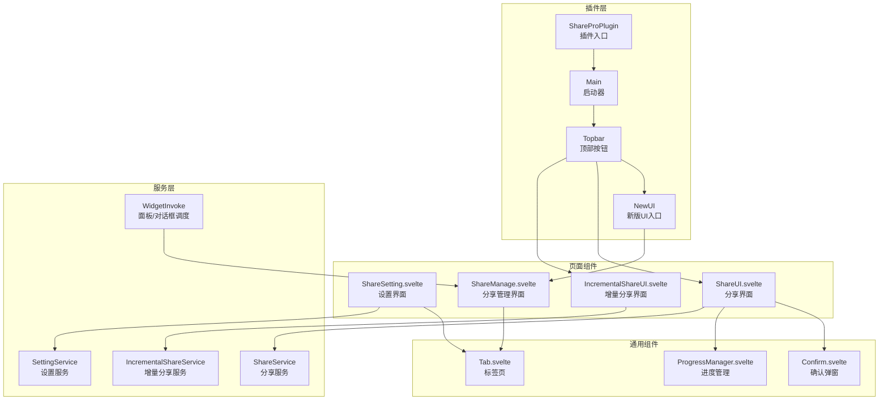
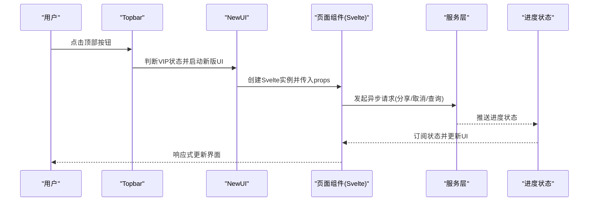
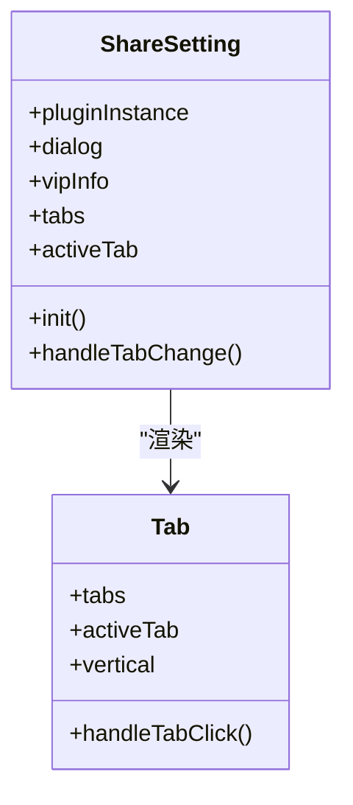
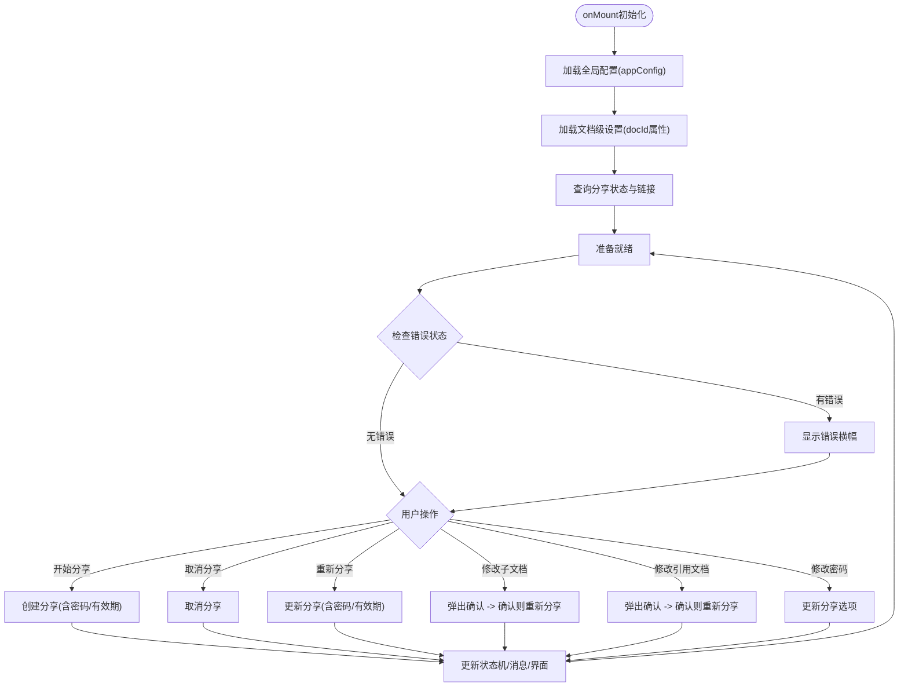
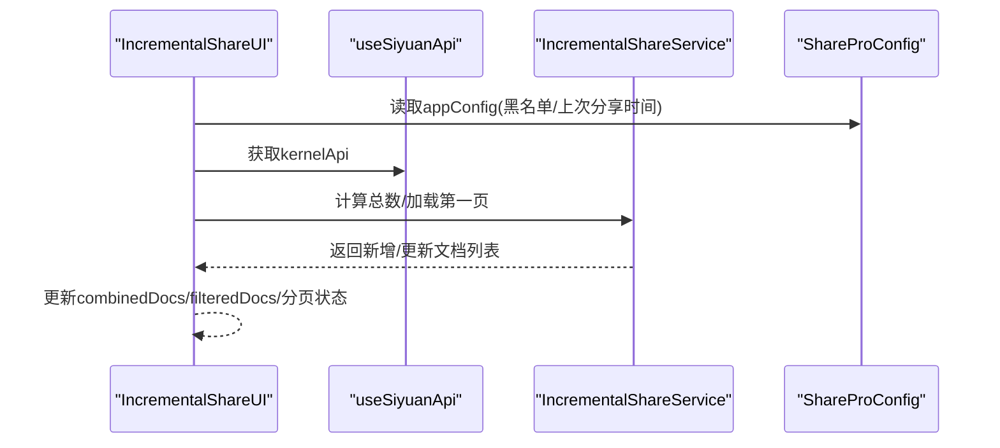
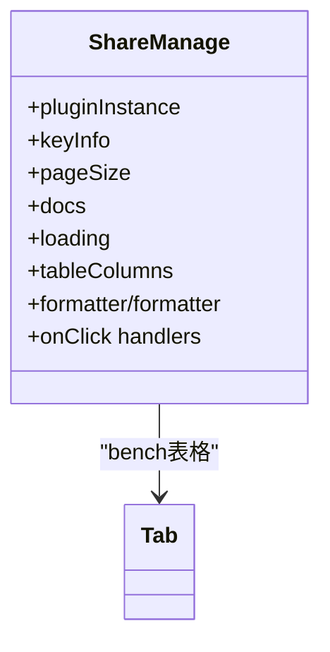
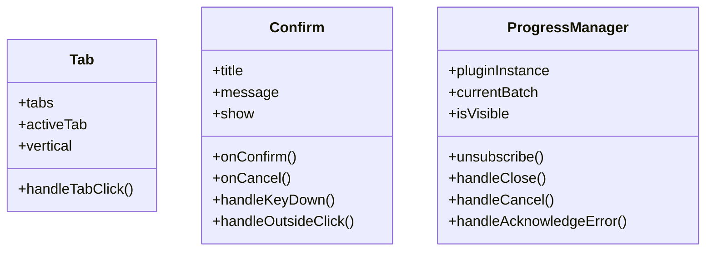
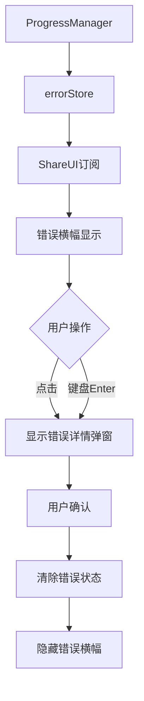
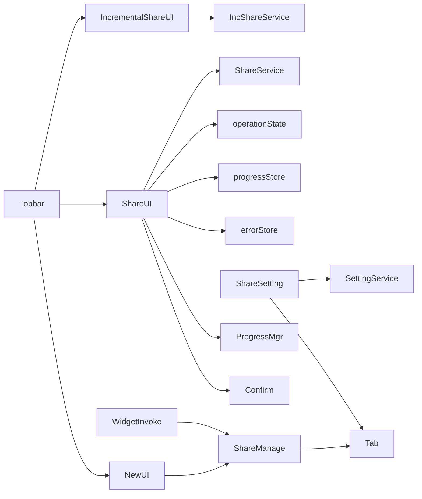

# UI组件架构

<cite>
**本文档引用的文件**
- [src/index.ts](file://src/index.ts)
- [src/main.ts](file://src/main.ts)
- [src/topbar.ts](file://src/topbar.ts)
- [src/newUI.ts](file://src/newUI.ts)
- [src/invoke/widgetInvoke.ts](file://src/invoke/widgetInvoke.ts)
- [src/libs/pages/ShareSetting.svelte](file://src/libs/pages/ShareSetting.svelte)
- [src/libs/pages/ShareUI.svelte](file://src/libs/pages/ShareUI.svelte)
- [src/libs/pages/IncrementalShareUI.svelte](file://src/libs/pages/IncrementalShareUI.svelte)
- [src/libs/pages/ShareManage.svelte](file://src/libs/pages/ShareManage.svelte)
- [src/libs/components/tab/Tab.svelte](file://src/libs/components/tab/Tab.svelte)
- [src/libs/components/Confirm.svelte](file://src/libs/components/Confirm.svelte)
- [src/libs/components/ProgressManager.svelte](file://src/libs/components/ProgressManager.svelte)
- [src/utils/progress/progressStore.ts](file://src/utils/progress/progressStore.ts)
- [src/utils/progress/ProgressState.ts](file://src/utils/progress/ProgressState.ts)
- [src/utils/progress/ProgressManager.ts](file://src/utils/progress/ProgressManager.ts)
- [src/i18n/zh_CN.json](file://src/i18n/zh_CN.json)
- [svelte.config.js](file://svelte.config.js)
- [package.json](file://package.json)
</cite>

## 更新摘要
**变更内容**
- ShareUI组件新增operationState状态机，实现完整的操作状态管理
- 新增更新分享下拉菜单系统，支持快速更新和完全更新两种模式
- 增强错误处理机制，实现文档级别的错误状态隔离
- 完善错误横幅组件和错误详情弹窗的交互体验
- 优化操作遮罩层和加载状态的显示逻辑

## 目录
1. [简介](#简介)
2. [项目结构](#项目结构)
3. [核心组件](#核心组件)
4. [架构总览](#架构总览)
5. [详细组件分析](#详细组件分析)
6. [依赖关系分析](#依赖关系分析)
7. [性能考量](#性能考量)
8. [故障排查指南](#故障排查指南)
9. [结论](#结论)

## 简介
本文件系统性梳理思源笔记分享专业版的UI组件架构，重点阐述基于Svelte的组件设计理念、层次结构与状态管理模式；详解三大页面组件的功能分工：设置界面、增量分享界面、分享管理界面；总结通用组件的复用机制、属性传递与事件处理模式；说明组件间通信、数据绑定与响应式更新策略；并给出UI与服务层集成、状态同步与异步处理的最佳实践。

## 项目结构
项目采用"插件入口 + Svelte页面 + 通用组件 + 服务层"的分层组织方式：
- 插件入口负责初始化、菜单与Topbar挂载、对话框渲染
- 页面组件负责具体业务场景的UI与交互
- 通用组件提供可复用的UI能力（标签页、确认弹窗、进度管理等）
- 服务层负责与后端API交互与状态管理

**图表来源**
- [src/index.ts:33-95](file://src/index.ts#L33-L95)
- [src/main.ts:12-31](file://src/main.ts#L12-L31)
- [src/topbar.ts:26-98](file://src/topbar.ts#L26-L98)
- [src/newUI.ts:35-122](file://src/newUI.ts#L35-L122)
- [src/invoke/widgetInvoke.ts:17-76](file://src/invoke/widgetInvoke.ts#L17-L76)
- [src/libs/pages/ShareSetting.svelte:10-118](file://src/libs/pages/ShareSetting.svelte#L10-L118)
- [src/libs/pages/ShareUI.svelte:10-1675](file://src/libs/pages/ShareUI.svelte#L10-L1675)
- [src/libs/pages/IncrementalShareUI.svelte:10-127](file://src/libs/pages/IncrementalShareUI.svelte#L10-L127)
- [src/libs/pages/ShareManage.svelte:9-38](file://src/libs/pages/ShareManage.svelte#L9-L38)

**章节来源**
- [src/index.ts:10-95](file://src/index.ts#L10-L95)
- [src/main.ts:12-31](file://src/main.ts#L12-L31)
- [src/topbar.ts:26-98](file://src/topbar.ts#L26-L98)
- [src/newUI.ts:35-122](file://src/newUI.ts#L35-L122)
- [package.json:10-54](file://package.json#L10-L54)
- [svelte.config.js:1-15](file://svelte.config.js#L1-L15)

## 核心组件
- 插件入口与启动器
  - ShareProPlugin：负责插件生命周期、配置加载、服务实例化、打开设置对话框
  - Main：负责Topbar初始化与增量分享UI展示
- 顶部按钮与新版UI
  - Topbar：注册Topbar按钮，处理点击/右键菜单，调用NewUI或传统菜单
  - NewUI：根据VIP状态决定展示新版UI或设置菜单，并挂载对应Svelte组件
- 页面组件
  - ShareSetting：设置界面，内含基础、个性化、文档、SEO、增量分享、黑名单等多标签页
  - ShareUI：单文档分享界面，三层配置架构（用户偏好/文档级设置/分享选项），支持分享/取消/重新分享/密码更新等，**新增operationState状态机、下拉菜单系统、增强的错误处理机制**
  - IncrementalShareUI：增量分享界面，支持搜索、分页、选择、统计、打开分享管理与黑名单管理
  - ShareManage：分享管理界面，表格展示分享记录，支持取消、设为主页、查看、跳转、复制标题等
- 通用组件
  - Tab：可复用标签页容器，支持垂直/水平布局与动态切换
  - Confirm：可复用确认弹窗，支持Esc关闭、外部点击关闭、动画过渡、键盘无障碍支持
  - ProgressManager：全局进度管理器，订阅进度状态，支持自动关闭与手动取消

**章节来源**
- [src/index.ts:33-95](file://src/index.ts#L33-L95)
- [src/main.ts:12-31](file://src/main.ts#L12-L31)
- [src/topbar.ts:26-98](file://src/topbar.ts#L26-L98)
- [src/newUI.ts:35-122](file://src/newUI.ts#L35-L122)
- [src/libs/pages/ShareSetting.svelte:10-118](file://src/libs/pages/ShareSetting.svelte#L10-L118)
- [src/libs/pages/ShareUI.svelte:10-1675](file://src/libs/pages/ShareUI.svelte#L10-L1675)
- [src/libs/pages/IncrementalShareUI.svelte:10-127](file://src/libs/pages/IncrementalShareUI.svelte#L10-L127)
- [src/libs/pages/ShareManage.svelte:9-38](file://src/libs/pages/ShareManage.svelte#L9-L38)
- [src/libs/components/tab/Tab.svelte:10-45](file://src/libs/components/tab/Tab.svelte#L10-L45)
- [src/libs/components/Confirm.svelte:1-218](file://src/libs/components/Confirm.svelte#L1-L218)
- [src/libs/components/ProgressManager.svelte:1-534](file://src/libs/components/ProgressManager.svelte#L1-L534)

## 架构总览
Svelte组件通过属性(props)向下传递，通过事件派发向上反馈，配合服务层实现状态同步与异步操作处理。整体采用"插件入口 -> Topbar/菜单 -> 页面组件 -> 服务层"的调用链路，通用组件作为横切能力被多个页面复用。

**图表来源**
- [src/topbar.ts:41-98](file://src/topbar.ts#L41-L98)
- [src/newUI.ts:53-122](file://src/newUI.ts#L53-L122)
- [src/libs/pages/ShareUI.svelte:159-234](file://src/libs/pages/ShareUI.svelte#L159-L234)
- [src/libs/components/ProgressManager.svelte:35-46](file://src/libs/components/ProgressManager.svelte#L35-L46)

## 详细组件分析

### ShareSetting 设置界面
- 设计理念
  - 采用Tab容器聚合多个设置子页面，支持动态切换与属性透传
  - 通过props向各子页面注入插件实例、对话框实例与VIP信息
- 关键特性
  - 动态构建tabs数组，按需渲染对应子组件
  - 支持垂直布局与tabChange事件回调
- 复用机制
  - Tab组件复用，子页面以组件形式动态插入
  - 子页面共享插件实例与对话框实例，减少重复创建

**图表来源**
- [src/libs/pages/ShareSetting.svelte:10-118](file://src/libs/pages/ShareSetting.svelte#L10-L118)
- [src/libs/components/tab/Tab.svelte:10-45](file://src/libs/components/tab/Tab.svelte#L10-L45)

**章节来源**
- [src/libs/pages/ShareSetting.svelte:10-118](file://src/libs/pages/ShareSetting.svelte#L10-L118)
- [src/libs/components/tab/Tab.svelte:10-45](file://src/libs/components/tab/Tab.svelte#L10-L45)

### ShareUI 分享界面（单文档模式）
- 三层配置架构
  - 用户偏好（全局）：密码显示偏好、全局子文档分享、增量分享配置
  - 文档级设置：文档树/大纲开关与层级、有效期、是否分享子文档/引用文档
  - 分享选项（敏感）：密码开关与密码值
- **新增状态管理增强**
  - **operationState状态机**：完整的操作状态管理，包括idle、sharing、canceling、shared、error五种状态
  - **下拉菜单系统**：更新分享功能的下拉菜单，支持快速更新和完全更新两种模式
  - **增强错误处理**：文档级别的错误状态隔离，通过initiatorDocId实现精确的错误显示
- 数据流与状态
  - onMount触发初始化，分别加载全局配置、文档设置、分享状态与链接
  - 通过formData集中管理表单数据与操作状态机，响应式更新UI
- 交互流程
  - 分享/取消/重新分享：防重复点击、状态机驱动、异常捕获与消息提示
  - 子文档/引用文档变更：带确认弹窗的变更流程，必要时触发重新分享
  - 密码更新：仅在已分享状态下允许更新
- **新增功能**
  - **错误横幅组件**：实时显示当前文档的错误状态，支持键盘交互（Enter键激活）
  - **模态确认对话框**：使用Confirm组件实现子文档/引用文档变更确认、错误详情查看
  - **文档级别错误状态管理**：独立管理每个文档的错误状态，避免相互影响
  - **操作遮罩层**：在分享/取消过程中显示遮罩层和加载动画
- 通用组件集成
  - Confirm：子文档/引用文档变更确认、错误详情确认
  - ProgressManager：全局进度展示与自动关闭

**图表来源**
- [src/libs/pages/ShareUI.svelte:522-563](file://src/libs/pages/ShareUI.svelte#L522-L563)
- [src/libs/pages/ShareUI.svelte:158-233](file://src/libs/pages/ShareUI.svelte#L158-L233)
- [src/libs/pages/ShareUI.svelte:235-283](file://src/libs/pages/ShareUI.svelte#L235-L283)
- [src/libs/pages/ShareUI.svelte:285-302](file://src/libs/pages/ShareUI.svelte#L285-L302)
- [src/libs/pages/ShareUI.svelte:308-355](file://src/libs/pages/ShareUI.svelte#L308-L355)

**章节来源**
- [src/libs/pages/ShareUI.svelte:78-129](file://src/libs/pages/ShareUI.svelte#L78-L129)
- [src/libs/pages/ShareUI.svelte:158-233](file://src/libs/pages/ShareUI.svelte#L158-L233)
- [src/libs/pages/ShareUI.svelte:235-283](file://src/libs/pages/ShareUI.svelte#L235-L283)
- [src/libs/pages/ShareUI.svelte:285-302](file://src/libs/pages/ShareUI.svelte#L285-L302)
- [src/libs/pages/ShareUI.svelte:308-355](file://src/libs/pages/ShareUI.svelte#L308-L355)

### IncrementalShareUI 增量分享界面
- 功能要点
  - 增量检测：基于上次分享时间戳与笔记本黑名单过滤
  - 分页加载：支持分页与总数统计，避免一次性加载过多文档
  - 选择与批量：支持全选/反选、搜索过滤、选择集合
  - 统计与管理：统计区域折叠/展开，一键打开分享管理与黑名单管理
- 数据流
  - onMount触发loadDocuments，计算总数与页数，加载第一页
  - 通过changeDetectionResult聚合新增与更新文档
  - 通过selectedDocs维护用户选择集合
- 与服务层集成
  - 通过useSiyuanApi获取kernelApi，调用增量接口进行文档计数与分页加载
  - 通过pluginInstance.incrementalShareService获取最新分享文档以回退时间戳

**图表来源**
- [src/libs/pages/IncrementalShareUI.svelte:125-187](file://src/libs/pages/IncrementalShareUI.svelte#L125-L187)
- [src/libs/pages/IncrementalShareUI.svelte:189-200](file://src/libs/pages/IncrementalShareUI.svelte#L189-L200)

**章节来源**
- [src/libs/pages/IncrementalShareUI.svelte:125-187](file://src/libs/pages/IncrementalShareUI.svelte#L125-L187)
- [src/libs/pages/IncrementalShareUI.svelte:189-200](file://src/libs/pages/IncrementalShareUI.svelte#L189-L200)

### ShareManage 分享管理界面
- 表格列与行为
  - 标题列：支持截断、popover显示完整标题、复制标题
  - 创建时间、媒体数量、状态列
  - 操作列：取消分享、设为主页、查看文档、跳转原文档、复制ID
- 分页与搜索
  - 支持传入pageSize，默认常量，支持偏移与排序占位
- 与插件集成
  - 通过window.*函数桥接UI与插件侧操作（如取消分享、设为主页、查看文档、跳转原文档）

**图表来源**
- [src/libs/pages/ShareManage.svelte:9-38](file://src/libs/pages/ShareManage.svelte#L9-L38)
- [src/libs/pages/ShareManage.svelte:39-200](file://src/libs/pages/ShareManage.svelte#L39-L200)

**章节来源**
- [src/libs/pages/ShareManage.svelte:9-38](file://src/libs/pages/ShareManage.svelte#L9-L38)
- [src/libs/pages/ShareManage.svelte:39-200](file://src/libs/pages/ShareManage.svelte#L39-L200)

### 通用组件：Tab、Confirm、ProgressManager
- Tab
  - 通过createEventDispatcher派发tabChange事件，支持垂直/水平布局
- Confirm
  - 通过props接收标题、消息、确认/取消回调，支持Esc与外部点击关闭
  - **新增键盘无障碍支持**：支持Esc键关闭，提供aria-label属性
- ProgressManager
  - 订阅progressStore，自动关闭策略与错误展示，支持手动取消
  - **错误状态持久化**：关闭前将错误状态保存到errorStore，便于用户后续查看

**图表来源**
- [src/libs/components/tab/Tab.svelte:10-45](file://src/libs/components/tab/Tab.svelte#L10-L45)
- [src/libs/components/Confirm.svelte:1-218](file://src/libs/components/Confirm.svelte#L1-L218)
- [src/libs/components/ProgressManager.svelte:1-534](file://src/libs/components/ProgressManager.svelte#L1-L534)

**章节来源**
- [src/libs/components/tab/Tab.svelte:10-45](file://src/libs/components/tab/Tab.svelte#L10-L45)
- [src/libs/components/Confirm.svelte:1-218](file://src/libs/components/Confirm.svelte#L1-L218)
- [src/libs/components/ProgressManager.svelte:1-534](file://src/libs/components/ProgressManager.svelte#L1-L534)

### 错误状态管理系统
- **设计目标**
  - 实现文档级别的错误状态管理，避免不同文档之间的错误状态相互影响
  - 提供实时的错误状态显示和持久化机制
- **核心组件**
  - **错误横幅**：在ShareUI顶部显示当前文档的错误状态，支持点击和键盘交互
  - **错误详情弹窗**：使用Confirm组件实现详细的错误信息展示
  - **错误状态存储**：通过progressStore和errorStore实现全局错误状态管理
- **交互流程**
  - 进度管理器检测到错误时，将错误状态保存到errorStore
  - ShareUI订阅错误状态，当存在错误时显示错误横幅
  - 用户点击错误横幅查看详细错误信息，或点击"我知道了"关闭并清除错误状态
- **文档级别隔离**
  - 使用initiatorDocId（发起操作的文档ID）而非currentDocId（当前正在处理的文档ID）
  - 确保错误横幅只显示与当前文档相关的错误，避免混淆

**图表来源**
- [src/libs/components/ProgressManager.svelte:35-46](file://src/libs/components/ProgressManager.svelte#L35-L46)
- [src/libs/pages/ShareUI.svelte:308-355](file://src/libs/pages/ShareUI.svelte#L308-L355)
- [src/utils/progress/progressStore.ts:15-22](file://src/utils/progress/progressStore.ts#L15-L22)

**章节来源**
- [src/libs/components/ProgressManager.svelte:35-46](file://src/libs/components/ProgressManager.svelte#L35-L46)
- [src/libs/pages/ShareUI.svelte:308-355](file://src/libs/pages/ShareUI.svelte#L308-L355)
- [src/utils/progress/progressStore.ts:15-22](file://src/utils/progress/progressStore.ts#L15-L22)

### operationState状态机详解
- **状态定义**
  - idle：空闲状态，等待用户操作
  - sharing：正在分享状态，防止重复点击
  - canceling：正在取消状态，防止重复点击
  - shared：已分享状态，允许取消和更新
  - error：错误状态，显示错误信息和横幅
- **状态转换**
  - 用户点击分享按钮 → sharing状态
  - 分享成功 → shared状态，显示成功消息
  - 分享失败 → error状态，显示错误消息
  - 用户点击取消按钮 → canceling状态
  - 取消成功 → idle状态
  - 取消失败 → error状态
- **防重复点击机制**
  - 在sharing或canceling状态下禁用操作按钮
  - 通过状态机确保操作的原子性和一致性

**章节来源**
- [src/libs/pages/ShareUI.svelte:120-125](file://src/libs/pages/ShareUI.svelte#L120-L125)
- [src/libs/pages/ShareUI.svelte:158-233](file://src/libs/pages/ShareUI.svelte#L158-L233)
- [src/libs/pages/ShareUI.svelte:235-283](file://src/libs/pages/ShareUI.svelte#L235-L283)

### 下拉菜单系统
- **功能设计**
  - 快速更新：仅更新必要的文档，保持现有配置不变
  - 完全更新：强制重新生成所有内容，适用于重大变更
  - 菜单状态管理：通过showUpdateMenu控制菜单显示/隐藏
- **用户体验**
  - 下拉箭头旋转指示菜单状态
  - 悬停显示提示信息，提升可用性
  - 危险操作（完全更新）使用红色标识

**章节来源**
- [src/libs/pages/ShareUI.svelte:127-140](file://src/libs/pages/ShareUI.svelte#L127-L140)
- [src/libs/pages/ShareUI.svelte:726-782](file://src/libs/pages/ShareUI.svelte#L726-L782)
- [src/libs/pages/ShareUI.svelte:1562-1675](file://src/libs/pages/ShareUI.svelte#L1562-L1675)

## 依赖关系分析
- 组件耦合
  - 页面组件依赖通用组件（Tab/Confirm/ProgressManager）
  - 页面组件依赖服务层（ShareService/SettingService/IncrementalShareService/WidgetInvoke）
  - 服务层依赖插件实例与配置（ShareProConfig）
  - **新增**：ShareUI依赖错误状态管理（errorStore、progressStore）
  - **新增**：ShareUI依赖operationState状态机
- 外部依赖
  - Svelte生态（vite-preprocess、customElement）
  - 第三方库（@sveltejs/svelte-virtual-list、copy-to-clipboard、eventemitter3等）

**图表来源**
- [src/libs/pages/ShareUI.svelte:31-33](file://src/libs/pages/ShareUI.svelte#L31-L33)
- [src/libs/pages/ShareSetting.svelte:15-23](file://src/libs/pages/ShareSetting.svelte#L15-L23)
- [src/libs/pages/ShareManage.svelte:21](file://src/libs/pages/ShareManage.svelte#L21)
- [src/invoke/widgetInvoke.ts:17-76](file://src/invoke/widgetInvoke.ts#L17-L76)
- [src/topbar.ts:26-98](file://src/topbar.ts#L26-L98)
- [src/newUI.ts:35-122](file://src/newUI.ts#L35-L122)

**章节来源**
- [package.json:43-51](file://package.json#L43-L51)
- [svelte.config.js:1-15](file://svelte.config.js#L1-L15)

## 性能考量
- 渲染优化
  - 使用Svelte内置响应式更新，避免不必要的重渲染
  - 通过条件渲染（如单文档模式下的特定区域）减少DOM节点
  - **错误状态优化**：错误横幅仅在存在错误时渲染，避免不必要的DOM开销
  - **状态机优化**：operationState状态机避免重复操作和竞态条件
- 异步与节流
  - 分页加载与总数统计分离，避免阻塞首屏
  - 操作状态机防止重复点击导致的并发请求
- 进度管理
  - ProgressManager订阅进度状态，自动关闭策略降低UI干扰
  - **错误状态持久化**：错误状态在进度管理器关闭后仍可查看，避免重复错误信息丢失
  - **文档级别隔离**：通过initiatorDocId实现错误状态的精确隔离
- 虚拟列表
  - 增量分享界面使用虚拟列表组件，提升长列表性能

## 故障排查指南
- 设置对话框无法打开
  - 检查插件实例的openSetting流程与Dialog创建
  - 确认VIP状态与配置加载是否成功
- 分享/取消失败
  - 查看ShareUI中的异常捕获与消息提示
  - 检查分享状态机与服务层返回码
  - **新增**：检查operationState状态是否正确转换
- 增量分享无数据
  - 核对上次分享时间戳与黑名单配置
  - 检查kernelApi与分页加载逻辑
- 进度管理不显示
  - 确认progressStore是否有状态推送
  - 检查ProgressManager订阅与自动关闭计时器
- **错误状态问题**
  - 检查errorStore是否正确更新错误状态
  - 确认ShareUI是否正确订阅错误状态
  - 验证错误横幅的显示逻辑和键盘交互
  - **新增**：检查initiatorDocId是否正确传递和匹配
- **模态确认对话框问题**
  - 检查Confirm组件的show属性绑定
  - 验证Esc键和外部点击关闭功能
  - 确认onConfirm/onCancel回调正确执行
- **状态机问题**
  - **新增**：检查operationState状态转换逻辑
  - 验证防重复点击机制是否正常工作
  - 确认状态机在异常情况下能够正确恢复

**章节来源**
- [src/index.ts:73-95](file://src/index.ts#L73-L95)
- [src/libs/pages/ShareUI.svelte:158-233](file://src/libs/pages/ShareUI.svelte#L158-L233)
- [src/libs/pages/IncrementalShareUI.svelte:146-187](file://src/libs/pages/IncrementalShareUI.svelte#L146-L187)
- [src/libs/components/ProgressManager.svelte:35-46](file://src/libs/components/ProgressManager.svelte#L35-L46)

## 结论
该UI组件架构以Svelte为核心，结合插件入口、Topbar/菜单、页面组件与通用组件形成清晰的分层体系。通过三层配置架构与状态机驱动，实现了单文档分享的精细化控制；通过Tab/Confirm/ProgressManager等通用组件提升了复用性与一致性；通过服务层与进度状态的集成，确保了异步操作的可观测与可控。

**最新更新**：
- **状态管理增强**：新增operationState状态机，实现完整的操作状态管理
- **下拉菜单系统**：更新分享功能的下拉菜单，支持快速更新和完全更新两种模式
- **错误状态管理**：新增文档级别的错误状态管理机制，提供实时错误显示和持久化功能
- **模态确认对话框**：统一使用Confirm组件实现各种确认场景，提升用户体验一致性
- **键盘无障碍支持**：为关键交互元素添加键盘支持，提升可访问性
- **错误横幅组件**：提供直观的错误状态提示，支持快速查看和处理
- **操作遮罩层**：在异步操作期间提供视觉反馈和用户体验保障

建议在后续迭代中持续完善国际化、无障碍与性能监控，进一步提升用户体验与稳定性。