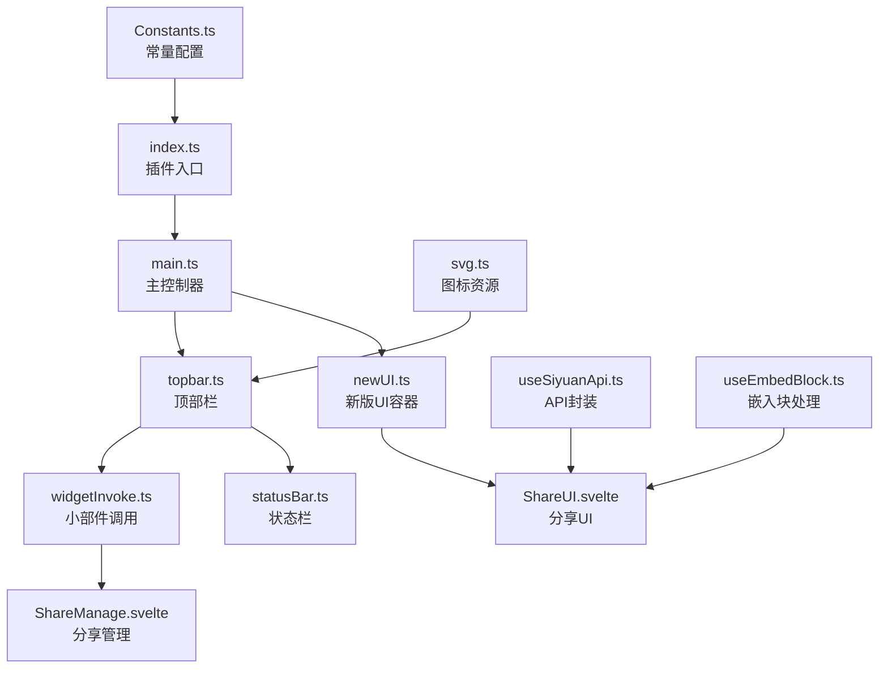
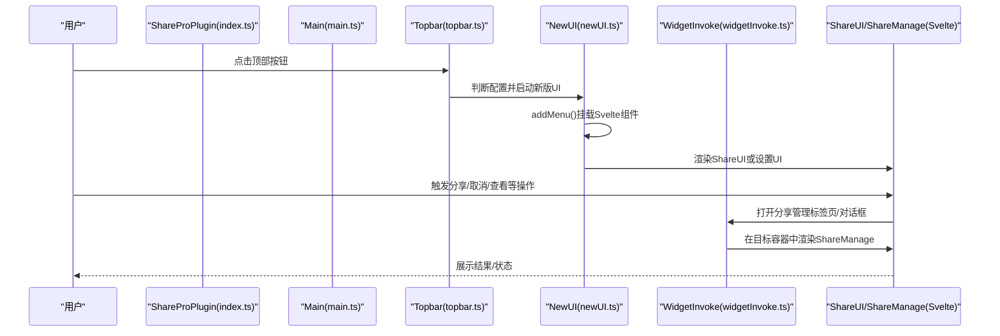
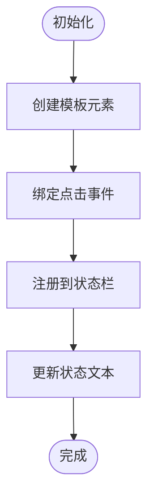
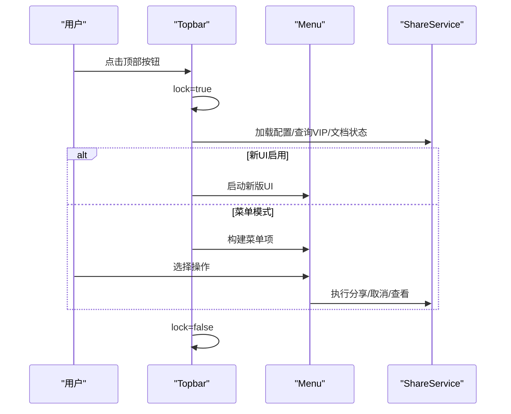
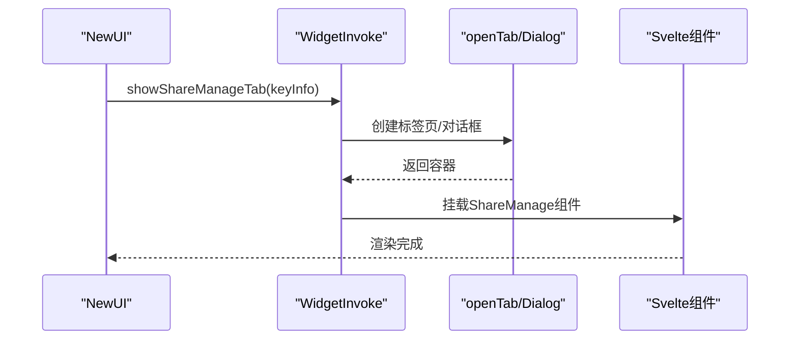
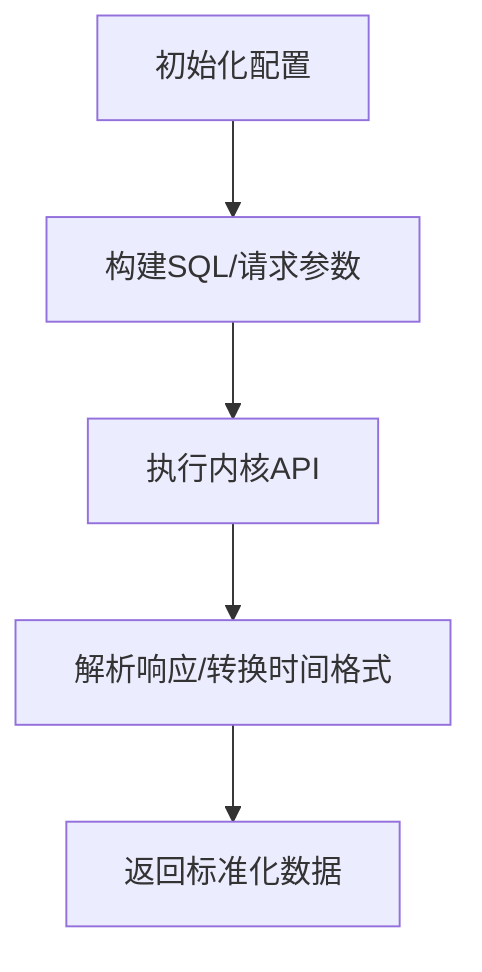
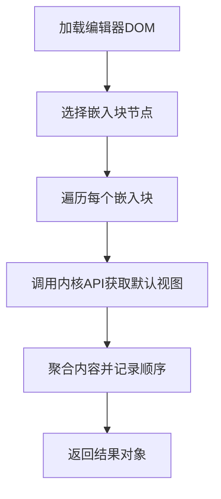
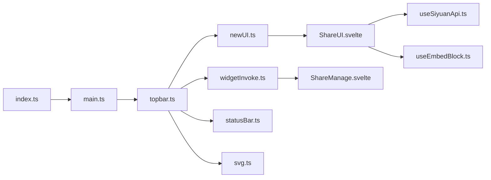

# UI集成架构

<cite>
**本文档引用的文件**
- [src/statusBar.ts](file://src/statusBar.ts)
- [src/topbar.ts](file://src/topbar.ts)
- [src/invoke/widgetInvoke.ts](file://src/invoke/widgetInvoke.ts)
- [src/composables/useSiyuanApi.ts](file://src/composables/useSiyuanApi.ts)
- [src/composables/useEmbedBlock.ts](file://src/composables/useEmbedBlock.ts)
- [src/newUI.ts](file://src/newUI.ts)
- [src/main.ts](file://src/main.ts)
- [src/index.ts](file://src/index.ts)
- [src/utils/svg.ts](file://src/utils/svg.ts)
- [src/libs/pages/ShareManage.svelte](file://src/libs/pages/ShareManage.svelte)
- [src/libs/pages/ShareUI.svelte](file://src/libs/pages/ShareUI.svelte)
- [src/Constants.ts](file://src/Constants.ts)
- [plugin.json](file://plugin.json)
</cite>

## 目录
1. [简介](#简介)
2. [项目结构](#项目结构)
3. [核心组件](#核心组件)
4. [架构总览](#架构总览)
5. [详细组件分析](#详细组件分析)
6. [依赖关系分析](#依赖关系分析)
7. [性能考量](#性能考量)
8. [故障排查指南](#故障排查指南)
9. [结论](#结论)
10. [附录](#附录)

## 简介
本文件面向思源笔记分享专业版的UI集成架构，系统化梳理状态栏组件、顶部栏组件、小部件调用机制、API封装与嵌入块处理等关键模块，阐明它们与SiYuan原生API的集成方式、权限控制与安全考虑，并提供最佳实践、性能优化与兼容性处理建议。

## 项目结构
该插件采用“入口-主控制器-UI组件-可组合函数-服务层”的分层组织方式：
- 入口与生命周期：index.ts负责插件实例化、配置初始化与UI入口启动
- 主控制器：main.ts协调UI初始化流程
- UI层：topbar.ts负责顶部栏按钮与菜单；newUI.ts提供新版UI容器；statusBar.ts负责状态栏图标
- 可组合函数：useSiyuanApi.ts封装SiYuan API；useEmbedBlock.ts处理嵌入块内容提取
- 小部件调用：widgetInvoke.ts负责在标签页或对话框中展示管理界面
- Svelte页面：ShareUI.svelte、ShareManage.svelte承载主要交互逻辑
- 资源与常量：svg.ts提供图标资源；Constants.ts集中配置常量

图表来源
- [src/index.ts:61-67](file://src/index.ts#L61-L67)
- [src/main.ts:21-23](file://src/main.ts#L21-L23)
- [src/topbar.ts:41-98](file://src/topbar.ts#L41-L98)
- [src/newUI.ts:53-122](file://src/newUI.ts#L53-L122)
- [src/statusBar.ts:12-31](file://src/statusBar.ts#L12-L31)
- [src/invoke/widgetInvoke.ts:26-76](file://src/invoke/widgetInvoke.ts#L26-L76)
- [src/composables/useSiyuanApi.ts:24-54](file://src/composables/useSiyuanApi.ts#L24-L54)
- [src/composables/useEmbedBlock.ts:23-82](file://src/composables/useEmbedBlock.ts#L23-L82)
- [src/utils/svg.ts:10-24](file://src/utils/svg.ts#L10-L24)
- [src/Constants.ts:10-20](file://src/Constants.ts#L10-L20)

章节来源
- [src/index.ts:61-67](file://src/index.ts#L61-L67)
- [src/main.ts:21-23](file://src/main.ts#L21-L23)
- [src/topbar.ts:41-98](file://src/topbar.ts#L41-L98)
- [src/newUI.ts:53-122](file://src/newUI.ts#L53-L122)
- [src/statusBar.ts:12-31](file://src/statusBar.ts#L12-L31)
- [src/invoke/widgetInvoke.ts:26-76](file://src/invoke/widgetInvoke.ts#L26-L76)
- [src/composables/useSiyuanApi.ts:24-54](file://src/composables/useSiyuanApi.ts#L24-L54)
- [src/composables/useEmbedBlock.ts:23-82](file://src/composables/useEmbedBlock.ts#L23-L82)
- [src/utils/svg.ts:10-24](file://src/utils/svg.ts#L10-L24)
- [src/Constants.ts:10-20](file://src/Constants.ts#L10-L20)

## 核心组件
- 状态栏组件（statusBar）：负责在左侧状态栏显示文本状态，支持动态更新
- 顶部栏组件（topbar）：右侧顶部按钮，支持点击打开菜单或新版UI，右键打开设置菜单
- 小部件调用（widgetInvoke）：在标签页或对话框中渲染分享管理界面
- API封装（useSiyuanApi）：统一封装SiYuan内核API与博客API，提供增量分享、子文档树等查询能力
- 嵌入块处理（useEmbedBlock）：解析编辑器DOM中的嵌入块，调用内核API获取默认视图内容
- 新版UI（newUI）：封装菜单容器与Svelte组件挂载逻辑，支持分享UI与设置UI
- 插件入口（index/main）：初始化配置、状态栏与主控制器

章节来源
- [src/statusBar.ts:12-31](file://src/statusBar.ts#L12-L31)
- [src/topbar.ts:26-98](file://src/topbar.ts#L26-L98)
- [src/invoke/widgetInvoke.ts:17-76](file://src/invoke/widgetInvoke.ts#L17-L76)
- [src/composables/useSiyuanApi.ts:24-54](file://src/composables/useSiyuanApi.ts#L24-L54)
- [src/composables/useEmbedBlock.ts:23-82](file://src/composables/useEmbedBlock.ts#L23-L82)
- [src/newUI.ts:35-122](file://src/newUI.ts#L35-L122)
- [src/main.ts:12-31](file://src/main.ts#L12-L31)
- [src/index.ts:33-67](file://src/index.ts#L33-L67)

## 架构总览
UI集成架构围绕“插件实例”为中心，通过顶部栏触发交互，选择菜单或新版UI，新版UI内部再通过widgetInvoke在标签页或对话框中渲染具体业务组件。API封装层统一访问SiYuan内核与服务端接口，确保权限与安全控制。

图表来源
- [src/index.ts:61-67](file://src/index.ts#L61-L67)
- [src/main.ts:21-23](file://src/main.ts#L21-L23)
- [src/topbar.ts:41-98](file://src/topbar.ts#L41-L98)
- [src/newUI.ts:202-229](file://src/newUI.ts#L202-L229)
- [src/invoke/widgetInvoke.ts:26-76](file://src/invoke/widgetInvoke.ts#L26-L76)
- [src/libs/pages/ShareUI.svelte:141-200](file://src/libs/pages/ShareUI.svelte#L141-L200)
- [src/libs/pages/ShareManage.svelte:250-287](file://src/libs/pages/ShareManage.svelte#L250-L287)

## 详细组件分析

### 状态栏组件（statusBar）
- 图标显示：通过模板创建元素并注册点击事件占位
- 状态指示：提供更新函数，将状态文本写入状态栏元素
- 移动端适配：若元素不存在则警告并忽略，避免移动端异常

图表来源
- [src/statusBar.ts:12-31](file://src/statusBar.ts#L12-L31)

章节来源
- [src/statusBar.ts:12-31](file://src/statusBar.ts#L12-L31)

### 顶部栏组件（topbar）
- 按钮布局：右侧添加图标按钮，标题来自国际化配置
- 菜单弹窗：点击打开菜单，右键打开设置菜单
- 快捷操作：根据VIP状态与文档ID决定菜单项，支持增量分享、分享管理、查看文档等
- 锁机制：防止并发请求导致的状态混乱

图表来源
- [src/topbar.ts:41-98](file://src/topbar.ts#L41-L98)
- [src/topbar.ts:113-259](file://src/topbar.ts#L113-L259)
- [src/topbar.ts:264-293](file://src/topbar.ts#L264-L293)

章节来源
- [src/topbar.ts:26-98](file://src/topbar.ts#L26-L98)
- [src/topbar.ts:113-259](file://src/topbar.ts#L113-L259)
- [src/topbar.ts:264-293](file://src/topbar.ts#L264-L293)

### widgetInvoke 小部件调用机制
- 参数传递：通过构造函数注入插件实例，向目标容器传递props
- 回调处理：在标签页或对话框中渲染Svelte组件，支持重新挂载
- 生命周期管理：通过openTab或Dialog创建容器，利用setTimeout确保DOM更新后再挂载组件

图表来源
- [src/invoke/widgetInvoke.ts:26-76](file://src/invoke/widgetInvoke.ts#L26-L76)
- [src/newUI.ts:124-183](file://src/newUI.ts#L124-L183)

章节来源
- [src/invoke/widgetInvoke.ts:17-76](file://src/invoke/widgetInvoke.ts#L17-L76)
- [src/newUI.ts:124-183](file://src/newUI.ts#L124-L183)

### useSiyuanApi 组合函数
- API封装：初始化SiYuanConfig与SiyuanKernelApi/SiYuanApiAdaptor，屏蔽底层差异
- 增量分享：提供分页查询增量文档与总数统计的方法，支持时间条件、黑名单过滤与搜索
- 子文档树：封装官方filetree/listDocsByPath API，支持懒加载与父子关系映射
- 错误处理：日志记录与空值保护，保证调用链健壮性
- 异步操作：所有方法均为Promise，遵循异步模式

图表来源
- [src/composables/useSiyuanApi.ts:24-54](file://src/composables/useSiyuanApi.ts#L24-L54)
- [src/composables/useSiyuanApi.ts:66-152](file://src/composables/useSiyuanApi.ts#L66-L152)
- [src/composables/useSiyuanApi.ts:358-432](file://src/composables/useSiyuanApi.ts#L358-L432)

章节来源
- [src/composables/useSiyuanApi.ts:24-54](file://src/composables/useSiyuanApi.ts#L24-L54)
- [src/composables/useSiyuanApi.ts:66-152](file://src/composables/useSiyuanApi.ts#L66-L152)
- [src/composables/useSiyuanApi.ts:162-215](file://src/composables/useSiyuanApi.ts#L162-L215)
- [src/composables/useSiyuanApi.ts:358-432](file://src/composables/useSiyuanApi.ts#L358-L432)

### useEmbedBlock 嵌入块处理
- DOM操作：使用Cheerio解析编辑器DOM，定位嵌入块节点
- 事件绑定：遍历嵌入块，读取语句与ID，发起内核API请求
- 内容渲染：聚合返回内容，按顺序保存，供上层组件使用

图表来源
- [src/composables/useEmbedBlock.ts:33-77](file://src/composables/useEmbedBlock.ts#L33-L77)

章节来源
- [src/composables/useEmbedBlock.ts:23-82](file://src/composables/useEmbedBlock.ts#L23-L82)

### 新版UI（NewUI）
- 菜单容器：封装addMenu方法，移除旧菜单，创建新容器并挂载Svelte组件
- 分享UI：根据VIP状态与文档ID决定展示内容，支持分享/取消/查看等操作
- 设置UI：在菜单中提供设置入口，支持移动端全屏

章节来源
- [src/newUI.ts:35-122](file://src/newUI.ts#L35-L122)
- [src/newUI.ts:124-183](file://src/newUI.ts#L124-L183)
- [src/newUI.ts:202-229](file://src/newUI.ts#L202-L229)

## 依赖关系分析
- 插件入口依赖：index.ts依赖main.ts、topbar.ts、statusBar.ts与各服务类
- UI层依赖：topbar.ts依赖widgetInvoke.ts、NewUI.ts；NewUI.ts依赖ShareUI.svelte与ShareManage.svelte
- API层依赖：useSiyuanApi.ts依赖zhi-siyuan-api；useEmbedBlock.ts依赖cheerio与kernelApi
- 资源依赖：svg.ts提供图标资源，供topbar与菜单使用

图表来源
- [src/index.ts:33-67](file://src/index.ts#L33-L67)
- [src/main.ts:12-31](file://src/main.ts#L12-L31)
- [src/topbar.ts:26-98](file://src/topbar.ts#L26-L98)
- [src/newUI.ts:35-122](file://src/newUI.ts#L35-L122)
- [src/invoke/widgetInvoke.ts:17-76](file://src/invoke/widgetInvoke.ts#L17-L76)
- [src/libs/pages/ShareUI.svelte:10-32](file://src/libs/pages/ShareUI.svelte#L10-L32)
- [src/libs/pages/ShareManage.svelte:9-27](file://src/libs/pages/ShareManage.svelte#L9-L27)
- [src/composables/useSiyuanApi.ts:10-16](file://src/composables/useSiyuanApi.ts#L10-L16)
- [src/composables/useEmbedBlock.ts:10-14](file://src/composables/useEmbedBlock.ts#L10-L14)
- [src/utils/svg.ts:10-24](file://src/utils/svg.ts#L10-L24)

章节来源
- [src/index.ts:33-67](file://src/index.ts#L33-L67)
- [src/main.ts:12-31](file://src/main.ts#L12-L31)
- [src/topbar.ts:26-98](file://src/topbar.ts#L26-L98)
- [src/newUI.ts:35-122](file://src/newUI.ts#L35-L122)
- [src/invoke/widgetInvoke.ts:17-76](file://src/invoke/widgetInvoke.ts#L17-L76)
- [src/libs/pages/ShareUI.svelte:10-32](file://src/libs/pages/ShareUI.svelte#L10-L32)
- [src/libs/pages/ShareManage.svelte:9-27](file://src/libs/pages/ShareManage.svelte#L9-L27)
- [src/composables/useSiyuanApi.ts:10-16](file://src/composables/useSiyuanApi.ts#L10-L16)
- [src/composables/useEmbedBlock.ts:10-14](file://src/composables/useEmbedBlock.ts#L10-L14)
- [src/utils/svg.ts:10-24](file://src/utils/svg.ts#L10-L24)

## 性能考量
- 异步与锁：顶部栏与新版UI均采用锁机制避免并发请求，减少无效调用
- 分页查询：useSiyuanApi提供分页与总数统计，降低一次性查询压力
- DOM解析：useEmbedBlock使用Promise.all并发请求嵌入块内容，提升吞吐
- 资源复用：SVG图标集中管理，避免重复创建
- 移动端适配：根据isMobile切换菜单全屏与尺寸，提升可用性

## 故障排查指南
- 状态栏不显示：检查statusBarElement是否存在，移动端可能不支持
- 顶部栏点击无响应：确认lock状态与配置加载是否成功
- 菜单项缺失：VIP状态或文档ID校验失败，需检查token与文档ID
- 分页查询异常：检查SQL拼接与时间格式转换，确保内核API返回有效数据
- 嵌入块内容为空：确认嵌入块属性存在且内核API返回blocks字段

章节来源
- [src/statusBar.ts:24-31](file://src/statusBar.ts#L24-L31)
- [src/topbar.ts:51-76](file://src/topbar.ts#L51-L76)
- [src/composables/useSiyuanApi.ts:135-151](file://src/composables/useSiyuanApi.ts#L135-L151)
- [src/composables/useEmbedBlock.ts:33-77](file://src/composables/useEmbedBlock.ts#L33-L77)

## 结论
该UI集成架构以插件实例为核心，通过顶部栏触发交互，结合新版UI与小部件调用机制，在标签页/对话框中渲染Svelte组件，实现分享、管理与设置的完整闭环。API封装层统一了SiYuan内核与服务端接口，配合权限控制与安全考虑，确保在多平台与多环境下稳定运行。

## 附录
- 权限控制与安全
  - VIP鉴权：通过服务端API携带Authorization头进行鉴权
  - 配置安全：敏感信息（如密码）存储于服务端，避免泄露
  - 属性隔离：文档级设置与分享选项分别存储于文档属性与服务端，降低耦合
- 最佳实践
  - 使用锁机制避免并发操作
  - 优先采用分页查询与懒加载
  - 统一错误日志与提示
  - 移动端全屏菜单与自适应尺寸
- 兼容性处理
  - 前端环境判断（mobile/browser-mobile）
  - 状态栏元素存在性检查
  - 国际化与图标资源集中管理

章节来源
- [src/api/share-api.ts:52-59](file://src/api/share-api.ts#L52-L59)
- [src/index.ts:45-48](file://src/index.ts#L45-L48)
- [src/statusBar.ts:24-29](file://src/statusBar.ts#L24-L29)
- [src/utils/svg.ts:10-24](file://src/utils/svg.ts#L10-L24)
- [plugin.json:6-13](file://plugin.json#L6-L13)