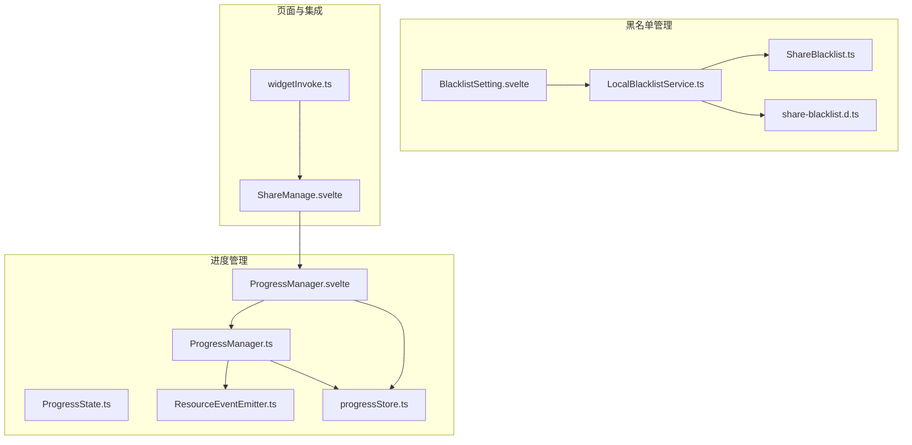
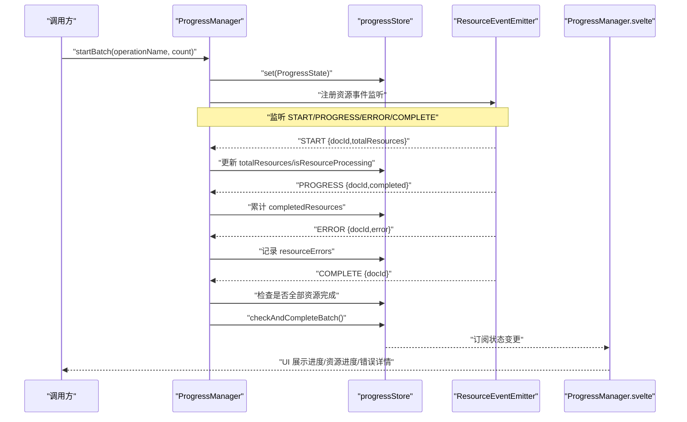
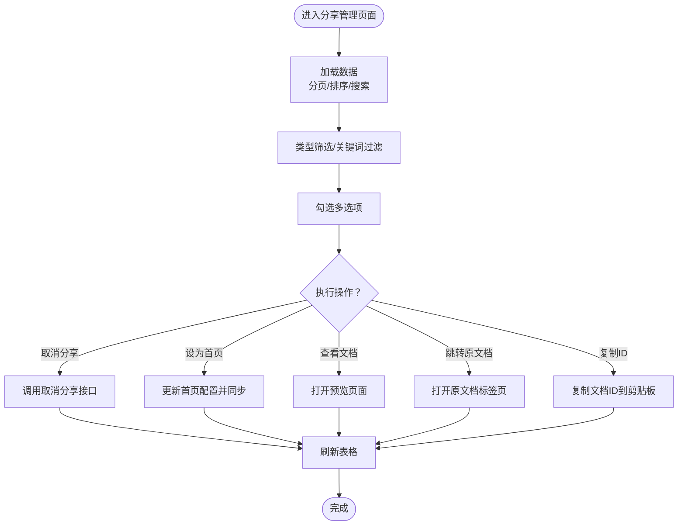
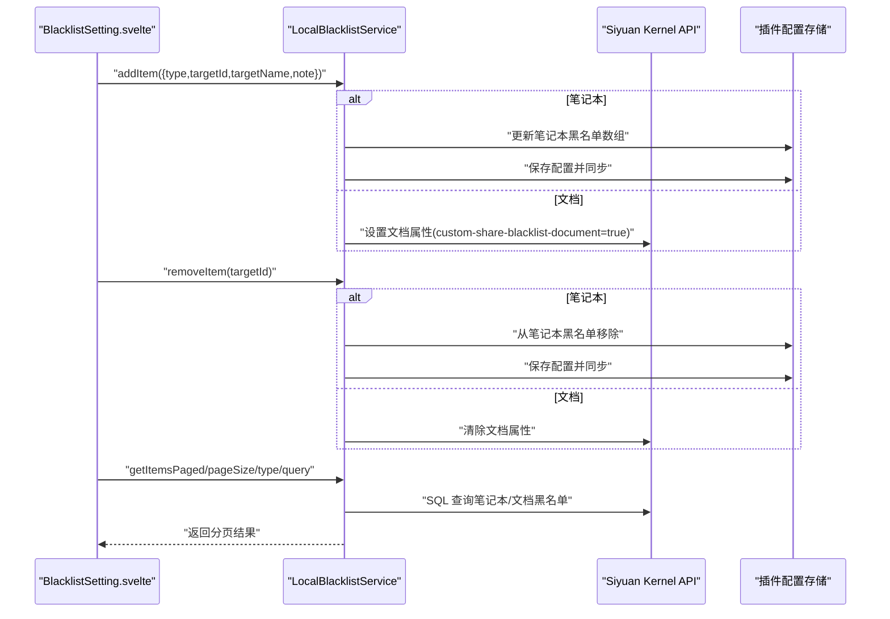
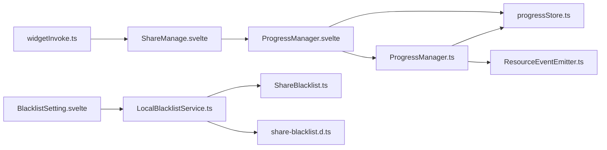

# 功能组件

<cite>
**本文引用的文件**
- [src/utils/progress/ProgressManager.ts](file://src/utils/progress/ProgressManager.ts)
- [src/utils/progress/ProgressState.ts](file://src/utils/progress/ProgressState.ts)
- [src/utils/progress/ResourceEventEmitter.ts](file://src/utils/progress/ResourceEventEmitter.ts)
- [src/utils/progress/progressStore.ts](file://src/utils/progress/progressStore.ts)
- [src/libs/components/ProgressManager.svelte](file://src/libs/components/ProgressManager.svelte)
- [src/libs/pages/ShareManage.svelte](file://src/libs/pages/ShareManage.svelte)
- [src/libs/pages/setting/BlacklistSetting.svelte](file://src/libs/pages/setting/BlacklistSetting.svelte)
- [src/models/ShareBlacklist.ts](file://src/models/ShareBlacklist.ts)
- [src/service/LocalBlacklistService.ts](file://src/service/LocalBlacklistService.ts)
- [src/types/share-blacklist.d.ts](file://src/types/share-blacklist.d.ts)
- [src/invoke/widgetInvoke.ts](file://src/invoke/widgetInvoke.ts)
</cite>

## 目录
1. [简介](#简介)
2. [项目结构](#项目结构)
3. [核心组件](#核心组件)
4. [架构总览](#架构总览)
5. [组件详解](#组件详解)
6. [依赖关系分析](#依赖关系分析)
7. [性能考量](#性能考量)
8. [故障排查指南](#故障排查指南)
9. [结论](#结论)
10. [附录](#附录)

## 简介
本文件面向“思源笔记分享专业版”的功能组件系统，聚焦以下四个关键组件：
- ProgressManager 进度管理组件：负责批处理任务的全局状态跟踪、事件监听与可视化反馈。
- DocumentSelector 文档选择器：提供多选逻辑、过滤与预览展示（基于现有页面与组件的组合能力）。
- SharePreview 分享预览组件：负责内容渲染、样式适配与交互控制（基于现有页面与组件的组合能力）。
- BlacklistManager 黑名单管理组件：负责列表展示、增删操作与数据同步。

文档将从架构、数据流、事件系统、状态管理与数据绑定等维度进行深入解析，并给出使用示例、集成方案与性能优化建议。

## 项目结构
围绕进度管理与黑名单管理两大主题，相关文件组织如下：
- 进度管理：工具类、状态模型、事件发射器与 Svelte 可视化组件协同工作。
- 黑名单管理：模型接口、本地服务实现、设置页面组件与类型定义。
- 页面与集成：分享管理页面、设置页面与插件入口调用。



图表来源
- [src/utils/progress/ProgressManager.ts:1-238](file://src/utils/progress/ProgressManager.ts#L1-L238)
- [src/utils/progress/ProgressState.ts:1-27](file://src/utils/progress/ProgressState.ts#L1-L27)
- [src/utils/progress/ResourceEventEmitter.ts:1-11](file://src/utils/progress/ResourceEventEmitter.ts#L1-L11)
- [src/utils/progress/progressStore.ts:1-15](file://src/utils/progress/progressStore.ts#L1-L15)
- [src/libs/components/ProgressManager.svelte:1-471](file://src/libs/components/ProgressManager.svelte#L1-L471)
- [src/models/ShareBlacklist.ts:1-99](file://src/models/ShareBlacklist.ts#L1-L99)
- [src/service/LocalBlacklistService.ts:1-658](file://src/service/LocalBlacklistService.ts#L1-L658)
- [src/types/share-blacklist.d.ts:1-114](file://src/types/share-blacklist.d.ts#L1-L114)
- [src/libs/pages/ShareManage.svelte:1-478](file://src/libs/pages/ShareManage.svelte#L1-L478)
- [src/invoke/widgetInvoke.ts:1-80](file://src/invoke/widgetInvoke.ts#L1-L80)

章节来源
- [src/utils/progress/ProgressManager.ts:1-238](file://src/utils/progress/ProgressManager.ts#L1-L238)
- [src/libs/components/ProgressManager.svelte:1-471](file://src/libs/components/ProgressManager.svelte#L1-L471)
- [src/service/LocalBlacklistService.ts:1-658](file://src/service/LocalBlacklistService.ts#L1-L658)
- [src/libs/pages/BlacklistSetting.svelte:1-756](file://src/libs/pages/setting/BlacklistSetting.svelte#L1-L756)

## 核心组件
- 进度管理（ProgressManager）：集中式批处理进度控制器，负责启动/更新/完成/取消批次，聚合文档与资源级进度，维护全局状态并通过 Svelte store 与事件发射器驱动 UI。
- 黑名单管理（LocalBlacklistService + BlacklistSetting）：提供分页检索、类型筛选、关键词搜索、增删改与同步；设置页面提供交互式 UI，支持智能搜索与批量操作。
- 页面与集成（ShareManage + widgetInvoke）：通过插件入口打开分享管理页面或对话框，承载表格、分页与操作列。

章节来源
- [src/utils/progress/ProgressManager.ts:1-238](file://src/utils/progress/ProgressManager.ts#L1-L238)
- [src/libs/components/ProgressManager.svelte:1-471](file://src/libs/components/ProgressManager.svelte#L1-L471)
- [src/service/LocalBlacklistService.ts:1-658](file://src/service/LocalBlacklistService.ts#L1-L658)
- [src/libs/pages/BlacklistSetting.svelte:1-756](file://src/libs/pages/setting/BlacklistSetting.svelte#L1-L756)
- [src/libs/pages/ShareManage.svelte:1-478](file://src/libs/pages/ShareManage.svelte#L1-L478)
- [src/invoke/widgetInvoke.ts:1-80](file://src/invoke/widgetInvoke.ts#L1-L80)

## 架构总览
下面的序列图展示了“开始批处理 → 资源事件 → 进度更新 → UI 反馈”的完整流程。



图表来源
- [src/utils/progress/ProgressManager.ts:12-102](file://src/utils/progress/ProgressManager.ts#L12-L102)
- [src/utils/progress/ResourceEventEmitter.ts:1-11](file://src/utils/progress/ResourceEventEmitter.ts#L1-L11)
- [src/utils/progress/progressStore.ts:1-15](file://src/utils/progress/progressStore.ts#L1-L15)
- [src/libs/components/ProgressManager.svelte:17-40](file://src/libs/components/ProgressManager.svelte#L17-L40)

## 组件详解

### ProgressManager 进度管理组件
- 状态模型（ProgressState）：包含批次 ID、操作名、总数/完成数/百分比、状态（空闲/处理中/成功/错误/取消）、当前文档、错误列表、起止时间、资源处理字段（总数/完成数/错误）、是否资源处理中、文档是否完成等。
- 控制器（ProgressManager）：
  - 启动批处理：生成唯一 ID，初始化状态，注册资源事件监听。
  - 更新进度：更新完成数、当前文档标题等，计算百分比。
  - 错误追加：记录文档级与资源级错误。
  - 完成/取消：标记结束时间与最终状态，清理事件监听。
  - 智能完成：文档完成后且资源处理结束，综合错误决定最终状态。
- 事件系统（ResourceEventEmitter）：统一发布资源事件，供控制器聚合。
- 可视化（ProgressManager.svelte）：
  - 订阅 progressStore，动态显示标题、状态、文档进度、资源进度、等待资源完成提示、当前文档、倒计时自动关闭、错误详情等。
  - 成功且无错误时自动关闭，错误时持久展示并阻止自动关闭。
  - 支持手动取消与关闭。

```mermaid
classDiagram
class ProgressState {
+string id
+string operationName
+number total
+number completed
+number percentage
+"idle|processing|success|error|canceled" status
+string currentDocId
+string currentDocTitle
+{docId,error}[] errors
+number startTime
+number|null endTime
+number totalResources
+number completedResources
+{docId,error}[] resourceErrors
+boolean isResourceProcessing
+boolean documentsCompleted
}
class ProgressManager {
+startBatch(name,count) string
+updateProgress(id,data) void
+addError(id,docId,error) void
+completeBatch(id,success,error?) void
+cancelBatch(id) void
+clearBatch() void
+markDocumentsCompleted(id) void
+checkAndCompleteBatch(id) void
+cleanupEventListeners() void
}
class ResourceEventEmitter {
+on(event,listener) void
+removeListener(event,listener) void
}
class progressStore {
+set(state) void
+update(updater) void
}
class ProgressManager_svelte {
+pluginInstance
+isVisible
+countdown
+subscribe(store)
+handleClose()
+handleCancel()
}
ProgressManager --> ProgressState : "创建/更新"
ProgressManager --> progressStore : "写入状态"
ProgressManager --> ResourceEventEmitter : "注册监听"
ProgressManager_svelte --> progressStore : "订阅"
ProgressManager_svelte --> ProgressManager : "调用控制方法"
```

图表来源
- [src/utils/progress/ProgressState.ts:1-27](file://src/utils/progress/ProgressState.ts#L1-L27)
- [src/utils/progress/ProgressManager.ts:1-238](file://src/utils/progress/ProgressManager.ts#L1-L238)
- [src/utils/progress/ResourceEventEmitter.ts:1-11](file://src/utils/progress/ResourceEventEmitter.ts#L1-L11)
- [src/utils/progress/progressStore.ts:1-15](file://src/utils/progress/progressStore.ts#L1-L15)
- [src/libs/components/ProgressManager.svelte:1-102](file://src/libs/components/ProgressManager.svelte#L1-L102)

章节来源
- [src/utils/progress/ProgressState.ts:1-27](file://src/utils/progress/ProgressState.ts#L1-L27)
- [src/utils/progress/ProgressManager.ts:1-238](file://src/utils/progress/ProgressManager.ts#L1-L238)
- [src/utils/progress/ResourceEventEmitter.ts:1-11](file://src/utils/progress/ResourceEventEmitter.ts#L1-L11)
- [src/utils/progress/progressStore.ts:1-15](file://src/utils/progress/progressStore.ts#L1-L15)
- [src/libs/components/ProgressManager.svelte:1-471](file://src/libs/components/ProgressManager.svelte#L1-L471)

### DocumentSelector 文档选择器（基于现有页面与组件的能力）
- 多选逻辑：结合表格组件与复选框，维护选中集合，支持批量删除与操作。
- 过滤功能：支持按类型（笔记本/文档）与关键词过滤，分页加载。
- 预览展示：通过表格列格式化与弹出提示，展示标题、媒体数量、状态与操作列（取消分享、设为首页、查看文档、跳转原文档、复制文档 ID）。
- 与进度管理联动：在执行分享任务时，可通过 ProgressManager.startBatch 提供批处理上下文，实时反馈进度与资源处理情况。



图表来源
- [src/libs/pages/ShareManage.svelte:250-351](file://src/libs/pages/ShareManage.svelte#L250-L351)
- [src/invoke/widgetInvoke.ts:26-76](file://src/invoke/widgetInvoke.ts#L26-L76)

章节来源
- [src/libs/pages/ShareManage.svelte:1-478](file://src/libs/pages/ShareManage.svelte#L1-L478)
- [src/invoke/widgetInvoke.ts:1-80](file://src/invoke/widgetInvoke.ts#L1-L80)

### SharePreview 分享预览组件（基于现有页面与组件的能力）
- 内容渲染：通过分享服务获取共享文档信息，解析视图地址并在新窗口打开。
- 样式适配：遵循页面容器与表格样式，确保在不同主题与尺寸下正常显示。
- 交互控制：提供“查看文档”按钮，支持复制文档 ID、打开原文档标签页等快捷操作。

章节来源
- [src/libs/pages/ShareManage.svelte:324-344](file://src/libs/pages/ShareManage.svelte#L324-L344)

### BlacklistManager 黑名单管理组件
- 列表展示：支持分页、类型筛选、关键词搜索，展示目标名称、类型、备注与创建时间。
- 增删操作：支持新增（智能搜索笔记本/文档）、批量删除、清空等。
- 数据同步：笔记本黑名单写入插件配置并同步至服务端；文档黑名单写入文档属性，移除时使用特殊值进行清理。
- 类型与接口：提供统一的 ShareBlacklist 接口与 DTO 转换，便于扩展与测试。



图表来源
- [src/libs/pages/setting/BlacklistSetting.svelte:41-73](file://src/libs/pages/setting/BlacklistSetting.svelte#L41-L73)
- [src/service/LocalBlacklistService.ts:167-202](file://src/service/LocalBlacklistService.ts#L167-L202)
- [src/service/LocalBlacklistService.ts:590-626](file://src/service/LocalBlacklistService.ts#L590-L626)
- [src/service/LocalBlacklistService.ts:50-118](file://src/service/LocalBlacklistService.ts#L50-L118)

章节来源
- [src/libs/pages/setting/BlacklistSetting.svelte:1-756](file://src/libs/pages/setting/BlacklistSetting.svelte#L1-L756)
- [src/service/LocalBlacklistService.ts:1-658](file://src/service/LocalBlacklistService.ts#L1-L658)
- [src/models/ShareBlacklist.ts:1-99](file://src/models/ShareBlacklist.ts#L1-L99)
- [src/types/share-blacklist.d.ts:1-114](file://src/types/share-blacklist.d.ts#L1-L114)

## 依赖关系分析
- 进度管理组件内部依赖：
  - ProgressManager 依赖 ProgressState、progressStore 与 ResourceEventEmitter。
  - ProgressManager.svelte 依赖 ProgressManager 与 progressStore。
- 黑名单管理组件内部依赖：
  - LocalBlacklistService 实现 ShareBlacklist 接口，依赖插件实例、设置服务、BlacklistApiService 与 Siyuan Kernel API。
  - BlacklistSetting.svelte 依赖 LocalBlacklistService 与类型定义。
- 页面与集成：
  - ShareManage.svelte 作为承载页面，使用 Bench 组件与表格列配置。
  - widgetInvoke.ts 提供打开标签页/对话框的入口。



图表来源
- [src/utils/progress/ProgressManager.ts:1-238](file://src/utils/progress/ProgressManager.ts#L1-L238)
- [src/utils/progress/progressStore.ts:1-15](file://src/utils/progress/progressStore.ts#L1-L15)
- [src/utils/progress/ResourceEventEmitter.ts:1-11](file://src/utils/progress/ResourceEventEmitter.ts#L1-L11)
- [src/libs/components/ProgressManager.svelte:1-102](file://src/libs/components/ProgressManager.svelte#L1-L102)
- [src/service/LocalBlacklistService.ts:1-658](file://src/service/LocalBlacklistService.ts#L1-L658)
- [src/models/ShareBlacklist.ts:1-99](file://src/models/ShareBlacklist.ts#L1-L99)
- [src/types/share-blacklist.d.ts:1-114](file://src/types/share-blacklist.d.ts#L1-L114)
- [src/libs/pages/ShareManage.svelte:1-478](file://src/libs/pages/ShareManage.svelte#L1-L478)
- [src/invoke/widgetInvoke.ts:1-80](file://src/invoke/widgetInvoke.ts#L1-L80)

章节来源
- [src/utils/progress/ProgressManager.ts:1-238](file://src/utils/progress/ProgressManager.ts#L1-L238)
- [src/libs/components/ProgressManager.svelte:1-471](file://src/libs/components/ProgressManager.svelte#L1-L471)
- [src/service/LocalBlacklistService.ts:1-658](file://src/service/LocalBlacklistService.ts#L1-L658)
- [src/libs/pages/setting/BlacklistSetting.svelte:1-756](file://src/libs/pages/setting/BlacklistSetting.svelte#L1-L756)
- [src/libs/pages/ShareManage.svelte:1-478](file://src/libs/pages/ShareManage.svelte#L1-L478)
- [src/invoke/widgetInvoke.ts:1-80](file://src/invoke/widgetInvoke.ts#L1-L80)

## 性能考量
- 进度管理
  - 使用 Svelte writable store 与订阅模式，仅在状态变更时触发 UI 更新，避免频繁重绘。
  - 资源事件聚合：通过事件总线合并多次 PROGRESS 事件，减少 UI 抖动。
  - 自动关闭策略：仅在成功且无错误时启用倒计时关闭，降低不必要的 DOM 生命周期开销。
- 黑名单管理
  - 分页与搜索：通过 SQL 分页与关键词过滤，避免一次性加载大量数据。
  - 批量检查：对笔记本与文档黑名单分别检查，减少无效查询。
  - 文档黑名单写入：仅写入必要属性，避免属性爆炸与冗余存储。
- 页面与集成
  - 分页表格：按需加载数据，避免一次性渲染过多行。
  - 弹窗/标签页：异步挂载组件，减少首屏压力。

[本节为通用性能建议，不直接分析具体文件]

## 故障排查指南
- 进度管理
  - 若 UI 不消失：确认是否调用了 completeBatch/cancelBatch 并清理了事件监听；检查状态是否为 error 或仍有资源处理中。
  - 资源进度不更新：确认资源事件是否正确触发 START/PROGRESS/ERROR/COMPLETE；检查事件处理器是否与当前批次 ID 匹配。
- 黑名单管理
  - 新增失败：检查目标类型与 ID 是否有效；笔记本黑名单需确保配置保存与同步成功；文档黑名单需确认文档属性写入成功。
  - 搜索无结果：确认搜索关键词与类型匹配；笔记本搜索通过配置获取，文档搜索通过 SQL 查询。
  - 删除异常：笔记本黑名单移除后需同步配置；文档黑名单移除需使用特殊值清理属性。
- 页面与集成
  - 打不开分享管理：确认 widgetInvoke 的打开逻辑与容器是否存在；检查 props 传递是否正确。

章节来源
- [src/libs/components/ProgressManager.svelte:42-101](file://src/libs/components/ProgressManager.svelte#L42-L101)
- [src/utils/progress/ProgressManager.ts:227-236](file://src/utils/progress/ProgressManager.ts#L227-L236)
- [src/service/LocalBlacklistService.ts:167-202](file://src/service/LocalBlacklistService.ts#L167-L202)
- [src/service/LocalBlacklistService.ts:590-626](file://src/service/LocalBlacklistService.ts#L590-L626)
- [src/invoke/widgetInvoke.ts:26-76](file://src/invoke/widgetInvoke.ts#L26-L76)

## 结论
本组件系统通过清晰的职责划分与事件驱动机制，实现了从状态建模、事件聚合到 UI 反馈的完整闭环。ProgressManager 提供统一的批处理进度体验；BlacklistManager 在保证数据一致性的同时提供了良好的交互与扩展性。结合现有的页面与组件，能够快速构建完整的分享与管理功能。

[本节为总结性内容，不直接分析具体文件]

## 附录
- 组件使用示例（路径指引）
  - 启动批处理：参考 [src/utils/progress/ProgressManager.ts:12-102](file://src/utils/progress/ProgressManager.ts#L12-L102)
  - 更新进度：参考 [src/utils/progress/ProgressManager.ts:107-126](file://src/utils/progress/ProgressManager.ts#L107-L126)
  - 添加错误：参考 [src/utils/progress/ProgressManager.ts:131-140](file://src/utils/progress/ProgressManager.ts#L131-L140)
  - 完成/取消：参考 [src/utils/progress/ProgressManager.ts:145-172](file://src/utils/progress/ProgressManager.ts#L145-L172)
  - 清空批次：参考 [src/utils/progress/ProgressManager.ts:177-179](file://src/utils/progress/ProgressManager.ts#L177-L179)
  - 智能完成：参考 [src/utils/progress/ProgressManager.ts:205-222](file://src/utils/progress/ProgressManager.ts#L205-L222)
  - 注册/清理事件监听：参考 [src/utils/progress/ProgressManager.ts:87-93](file://src/utils/progress/ProgressManager.ts#L87-L93)、[src/utils/progress/ProgressManager.ts:227-236](file://src/utils/progress/ProgressManager.ts#L227-L236)
  - UI 订阅与自动关闭：参考 [src/libs/components/ProgressManager.svelte:17-81](file://src/libs/components/ProgressManager.svelte#L17-L81)
  - 黑名单新增/删除：参考 [src/service/LocalBlacklistService.ts:167-202](file://src/service/LocalBlacklistService.ts#L167-L202)、[src/service/LocalBlacklistService.ts:590-626](file://src/service/LocalBlacklistService.ts#L590-L626)
  - 分页与搜索：参考 [src/service/LocalBlacklistService.ts:50-118](file://src/service/LocalBlacklistService.ts#L50-L118)、[src/libs/pages/setting/BlacklistSetting.svelte:41-73](file://src/libs/pages/setting/BlacklistSetting.svelte#L41-L73)
  - 打开分享管理页面：参考 [src/invoke/widgetInvoke.ts:26-76](file://src/invoke/widgetInvoke.ts#L26-L76)
- 集成方案
  - 在执行分享任务前调用 ProgressManager.startBatch，期间通过资源事件更新进度；任务结束后调用 completeBatch/cancelBatch。
  - 在设置页面中使用 BlacklistSetting.svelte 与 LocalBlacklistService 协作，实现黑名单的增删改查与同步。
  - 在 ShareManage.svelte 中通过表格列配置与操作回调，实现文档的批量管理与预览。

[本节为补充说明，不直接分析具体文件]