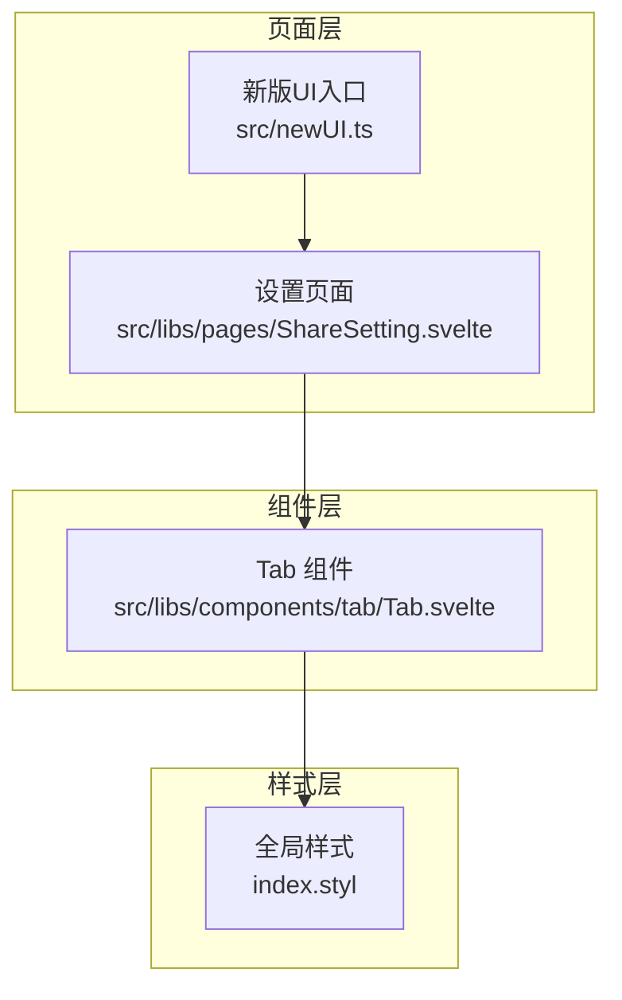
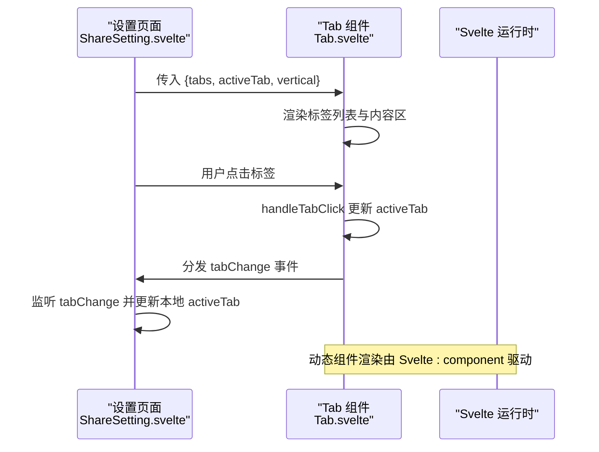
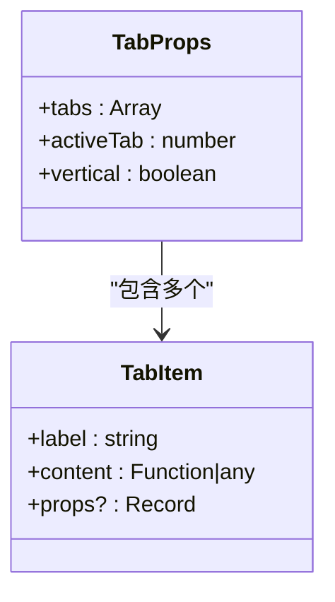
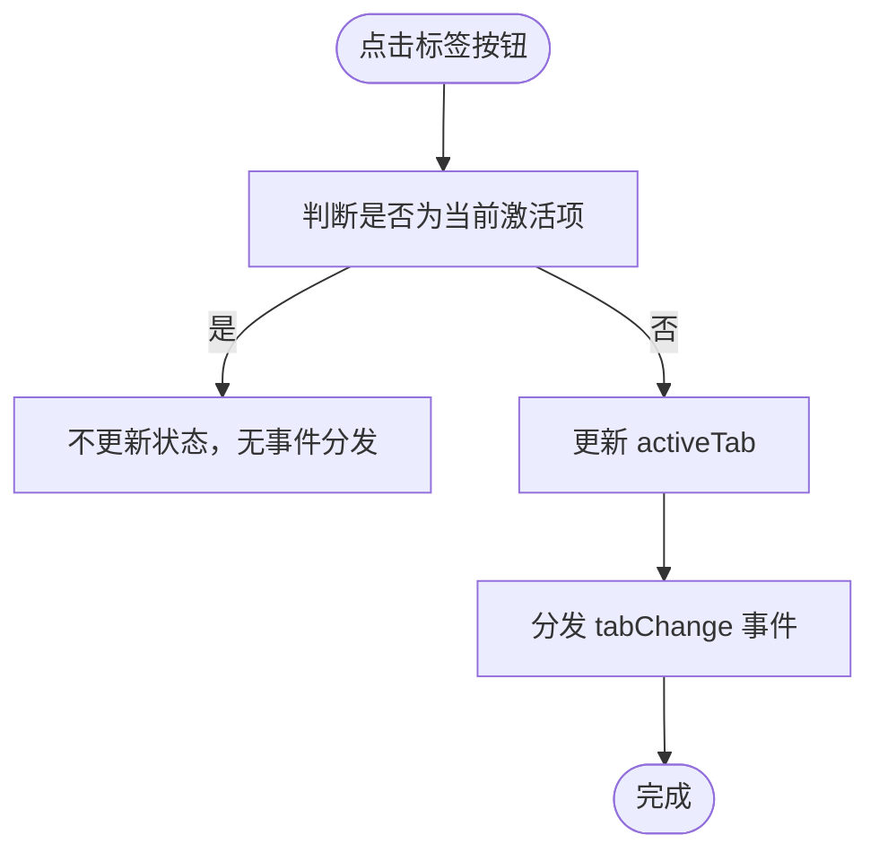
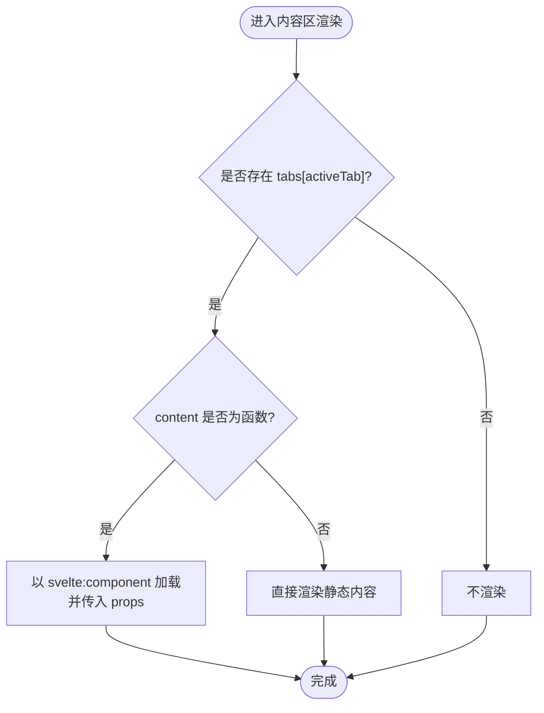
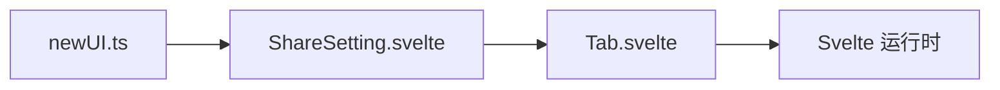

# 基础UI组件

<cite>
**本文引用的文件**
- [Tab.svelte](file://src/libs/components/tab/Tab.svelte)
- [ShareSetting.svelte](file://src/libs/pages/ShareSetting.svelte)
- [newUI.ts](file://src/newUI.ts)
- [index.styl](file://index.styl)
</cite>

## 目录
1. [简介](#简介)
2. [项目结构](#项目结构)
3. [核心组件](#核心组件)
4. [架构总览](#架构总览)
5. [详细组件分析](#详细组件分析)
6. [依赖关系分析](#依赖关系分析)
7. [性能考量](#性能考量)
8. [故障排查指南](#故障排查指南)
9. [结论](#结论)
10. [附录](#附录)

## 简介
本文件面向“思源笔记分享专业版”的基础UI组件，聚焦于Tab组件的设计与实现。文档将从以下维度展开：动态内容加载机制、标签页切换动画与垂直布局模式、属性接口设计（tabs数组结构、activeTab索引、vertical布尔值）、点击处理逻辑与事件分发机制、状态管理策略、样式系统（flex布局、响应式设计、暗黑主题适配、CSS变量使用）、content函数式组件渲染与props传递、动态组件加载机制，并提供使用示例、最佳实践与性能优化建议。

## 项目结构
Tab组件位于组件库目录中，作为通用UI部件被页面级组件复用；页面通过props向Tab注入数据与行为，实现统一的标签页交互体验。

**图表来源**
- [Tab.svelte:1-124](file://src/libs/components/tab/Tab.svelte#L1-L124)
- [ShareSetting.svelte:1-119](file://src/libs/pages/ShareSetting.svelte#L1-L119)
- [newUI.ts:1-233](file://src/newUI.ts#L1-L233)
- [index.styl:1-44](file://index.styl#L1-L44)

**章节来源**
- [Tab.svelte:1-124](file://src/libs/components/tab/Tab.svelte#L1-L124)
- [ShareSetting.svelte:1-119](file://src/libs/pages/ShareSetting.svelte#L1-L119)
- [newUI.ts:1-233](file://src/newUI.ts#L1-L233)
- [index.styl:1-44](file://index.styl#L1-L44)

## 核心组件
本节对Tab组件进行深入解析，涵盖接口定义、渲染流程、事件与状态管理、样式系统与主题适配。

- 属性接口设计
  - tabs: 数组，元素包含 label（标签名）、content（内容或组件）、可选 props（传递给动态组件的参数）
  - activeTab: number，当前激活的标签索引
  - vertical: boolean，是否启用垂直布局模式
- 渲染机制
  - 标签列表基于 tabs 动态生成
  - 内容区根据 activeTab 条件渲染：若 content 为函数则以 Svelte 动态组件方式加载，否则直接渲染静态内容
- 事件与状态
  - 点击标签触发 handleTabClick，更新 activeTab 并分发 tabChange 事件
  - 外部页面监听 tabChange 事件以同步自身状态（如 ShareSetting 页面）

**章节来源**
- [Tab.svelte:10-25](file://src/libs/components/tab/Tab.svelte#L10-L25)
- [Tab.svelte:27-45](file://src/libs/components/tab/Tab.svelte#L27-L45)
- [ShareSetting.svelte:109-111](file://src/libs/pages/ShareSetting.svelte#L109-L111)

## 架构总览
下图展示从页面到组件再到样式的端到端交互路径，以及事件在组件与页面之间的流转。

**图表来源**
- [ShareSetting.svelte:109-118](file://src/libs/pages/ShareSetting.svelte#L109-L118)
- [Tab.svelte:17-24](file://src/libs/components/tab/Tab.svelte#L17-L24)
- [Tab.svelte:37-44](file://src/libs/components/tab/Tab.svelte#L37-L44)

## 详细组件分析

### 类型与接口设计
- tabs 数组元素结构
  - label: string，显示在标签按钮上的文本
  - content: any，支持两种形式
    - 函数：作为 Svelte 组件构造器，通过 svelte:component 动态加载
    - 静态内容：直接渲染
  - props?: Record<string, any>：当 content 为函数时，作为该组件的 props 传入
- activeTab: number，当前激活标签索引
- vertical: boolean，控制标签栏方向（水平/垂直）

**图表来源**
- [Tab.svelte:13-15](file://src/libs/components/tab/Tab.svelte#L13-L15)
- [Tab.svelte:38-42](file://src/libs/components/tab/Tab.svelte#L38-L42)

**章节来源**
- [Tab.svelte:13-15](file://src/libs/components/tab/Tab.svelte#L13-L15)
- [Tab.svelte:38-42](file://src/libs/components/tab/Tab.svelte#L38-L42)

### 点击处理与事件分发
- handleTabClick(index)
  - 若目标索引与当前激活不同，则更新 activeTab
  - 使用 createEventDispatcher 分发自定义事件 tabChange，携带新索引
- 外部页面监听 tabChange 事件，同步更新本地 activeTab，确保视图与状态一致

**图表来源**
- [Tab.svelte:19-24](file://src/libs/components/tab/Tab.svelte#L19-L24)

**章节来源**
- [Tab.svelte:17-24](file://src/libs/components/tab/Tab.svelte#L17-L24)
- [ShareSetting.svelte:109-111](file://src/libs/pages/ShareSetting.svelte#L109-L111)

### 动态内容加载与渲染
- 标签列表渲染：遍历 tabs，每个元素显示为按钮，类名 active 根据索引与 activeTab 对比决定
- 内容区渲染：仅当存在对应索引时渲染；若 content 为函数则以 Svelte 动态组件方式加载，并透传 props；否则直接渲染静态内容

**图表来源**
- [Tab.svelte:37-44](file://src/libs/components/tab/Tab.svelte#L37-L44)

**章节来源**
- [Tab.svelte:27-45](file://src/libs/components/tab/Tab.svelte#L27-L45)

### 垂直布局模式与切换动画
- 垂直布局
  - 通过 vertical 布尔值控制容器类名，使标签栏沿水平方向排列
  - 标签列表与标签按钮的边框样式随方向变化（垂直时使用右侧边框，水平时使用底部边框）
- 切换动画
  - 当前实现未包含显式的过渡动画；内容切换为条件渲染，无额外过渡效果
  - 如需增强交互体验，可在样式中引入过渡类或在内容区包裹过渡组件

**章节来源**
- [Tab.svelte:27-45](file://src/libs/components/tab/Tab.svelte#L27-L45)
- [Tab.svelte:68-90](file://src/libs/components/tab/Tab.svelte#L68-L90)

### 样式系统与主题适配
- 布局与结构
  - 容器采用 flex 布局，默认纵向排列；vertical 为真时改为横向
  - 标签列表支持换行（非垂直模式）；垂直模式下标签列纵向堆叠
- 视觉与交互
  - 标签按钮默认无边框，悬停与激活态通过背景色与文字色变化体现
  - 激活态使用 CSS 变量，便于主题适配
- 暗黑主题适配
  - 通过全局选择器适配 html[data-theme-mode="dark"]，统一替换背景色与边框色
- 全局滚动与容器溢出
  - 全局样式对特定容器设置溢出策略，保证内容可滚动

**章节来源**
- [Tab.svelte:47-123](file://src/libs/components/tab/Tab.svelte#L47-L123)
- [index.styl:42-44](file://index.styl#L42-L44)

### 在页面中的使用与集成
- 页面侧准备 tabs 数据与 activeTab 状态
  - tabs 中每个元素包含 label、content（组件构造器或静态内容）、props（可选）
  - 初始化后通过赋值语句确保响应式更新
- 事件绑定
  - 将 vertical 设置为 true 以启用垂直布局
  - 监听 tabChange 事件并更新本地 activeTab

**章节来源**
- [ShareSetting.svelte:38-107](file://src/libs/pages/ShareSetting.svelte#L38-L107)
- [ShareSetting.svelte:109-118](file://src/libs/pages/ShareSetting.svelte#L109-L118)

## 依赖关系分析
- 组件依赖
  - Tab 依赖 Svelte 的 createEventDispatcher 实现事件分发
  - 内容区依赖 Svelte 的动态组件机制 svelte:component
- 页面依赖
  - ShareSetting 导入 Tab 并注入数据与事件处理
  - newUI.ts 负责在菜单中挂载设置页面，间接承载 Tab 的使用场景

**图表来源**
- [ShareSetting.svelte:10-25](file://src/libs/pages/ShareSetting.svelte#L10-L25)
- [Tab.svelte:11-11](file://src/libs/components/tab/Tab.svelte#L11-L11)
- [newUI.ts:18-107](file://src/newUI.ts#L18-L107)

**章节来源**
- [ShareSetting.svelte:10-25](file://src/libs/pages/ShareSetting.svelte#L10-L25)
- [Tab.svelte:11-11](file://src/libs/components/tab/Tab.svelte#L11-L11)
- [newUI.ts:18-107](file://src/newUI.ts#L18-L107)

## 性能考量
- 动态组件加载
  - content 为函数时按需实例化组件，有利于懒加载与减少初始开销
  - 建议对频繁切换的标签内容进行缓存或复用策略，避免重复创建
- 条件渲染
  - 内容区仅渲染当前激活项，降低不必要的 DOM 结构
- 样式与主题
  - 使用 CSS 变量与全局主题选择器，减少重复样式计算
- 响应式更新
  - 通过外部页面监听 tabChange 同步状态，避免组件内部复杂的状态树

[本节为通用指导，无需列出具体文件来源]

## 故障排查指南
- 标签点击无效
  - 检查是否正确传入 activeTab 且外部页面监听了 tabChange 事件
  - 确认 handleTabClick 的触发条件与事件分发逻辑
- 内容未渲染
  - 确认 tabs[activeTab] 存在
  - 若 content 为函数，确认其为有效的 Svelte 组件构造器且 props 传入正确
- 垂直布局异常
  - 检查 vertical 布尔值是否正确传递
  - 确认样式类名与方向性规则生效
- 暗黑主题不生效
  - 检查 html 上的主题标记是否正确
  - 确认 CSS 变量与全局选择器的优先级

**章节来源**
- [Tab.svelte:19-24](file://src/libs/components/tab/Tab.svelte#L19-L24)
- [Tab.svelte:37-44](file://src/libs/components/tab/Tab.svelte#L37-L44)
- [Tab.svelte:68-90](file://src/libs/components/tab/Tab.svelte#L68-L90)
- [Tab.svelte:106-122](file://src/libs/components/tab/Tab.svelte#L106-L122)

## 结论
Tab 组件以简洁的接口与灵活的内容加载机制，实现了跨页面的统一标签页体验。通过 props 注入与事件分发，组件与页面之间形成清晰的职责边界；样式系统结合 CSS 变量与暗黑主题适配，满足多环境需求。未来可在内容切换处引入过渡动画、对动态组件进行缓存与懒加载优化，进一步提升交互流畅度与性能表现。

[本节为总结性内容，无需列出具体文件来源]

## 附录

### 使用示例（步骤说明）
- 准备 tabs 数据
  - 在页面初始化阶段构建 tabs 数组，包含 label、content（组件构造器或静态内容）、props（可选）
  - 使用赋值语句确保响应式更新
- 传入属性与事件
  - 将 {tabs}、{activeTab} 传入 Tab
  - 设置 vertical={true} 以启用垂直布局
  - 监听 on:tabChange 并更新本地 activeTab
- 运行与验证
  - 点击标签，观察内容区是否按预期切换
  - 在暗黑主题下验证样式一致性

**章节来源**
- [ShareSetting.svelte:38-107](file://src/libs/pages/ShareSetting.svelte#L38-L107)
- [ShareSetting.svelte:109-118](file://src/libs/pages/ShareSetting.svelte#L109-L118)

### 最佳实践
- 内容组织
  - 将每个标签页封装为独立 Svelte 组件，保持单一职责
  - 对耗时组件采用懒加载与缓存策略
- 事件与状态
  - 统一由外部页面维护 activeTab，Tab 仅负责渲染与事件分发
  - 避免在 Tab 内部保存过多状态
- 样式与主题
  - 使用 CSS 变量与全局主题选择器，便于主题扩展
  - 控制标签边框与间距，确保在垂直与水平模式下均美观一致

[本节为通用指导，无需列出具体文件来源]