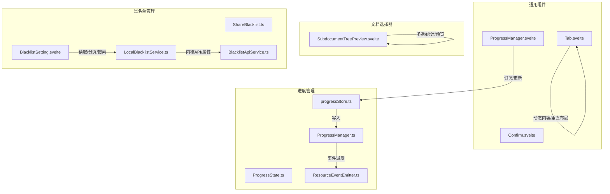
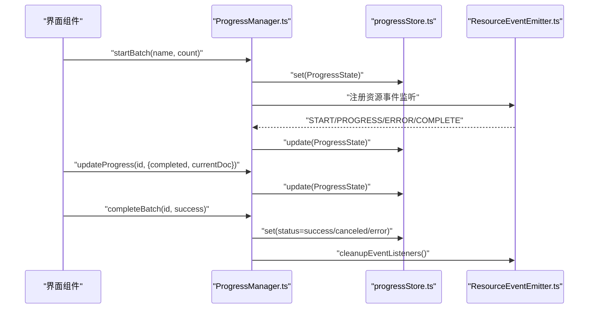
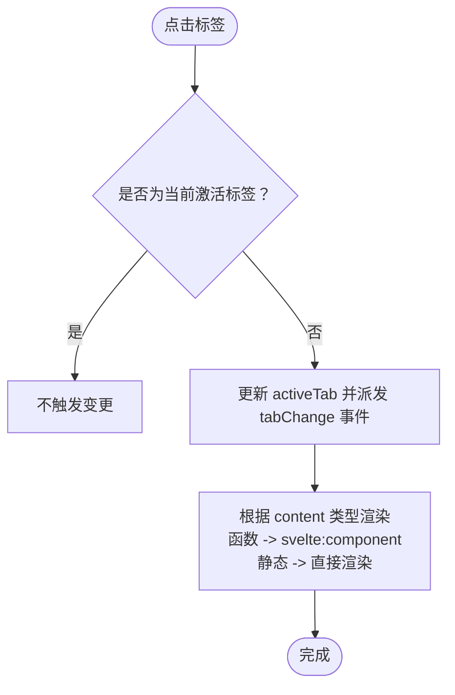
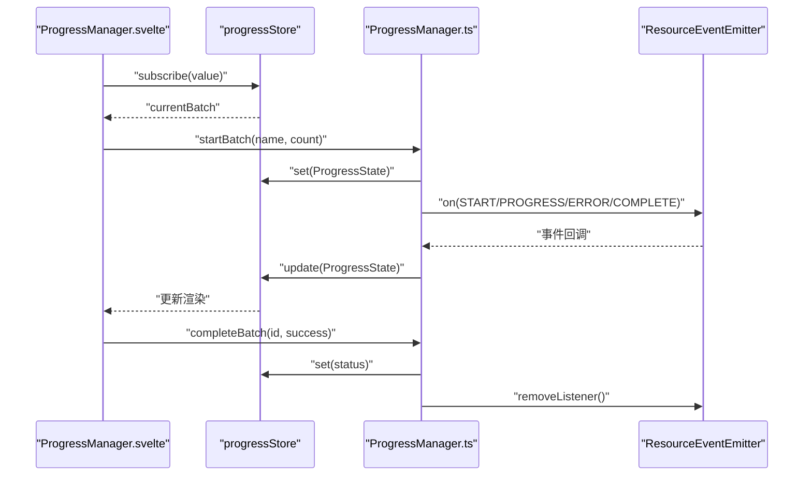
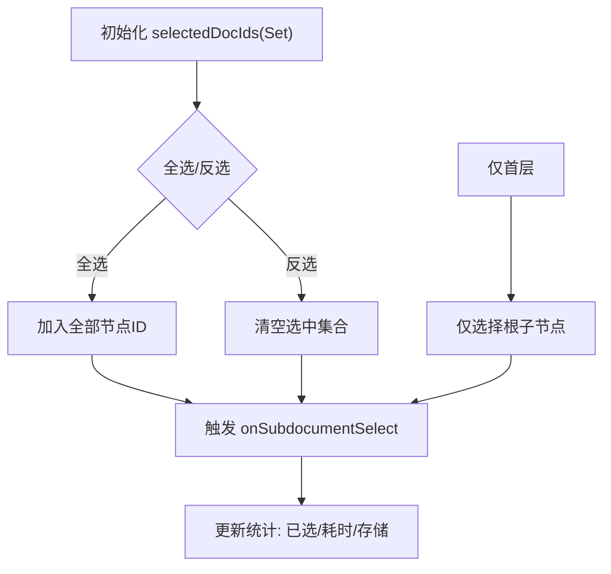
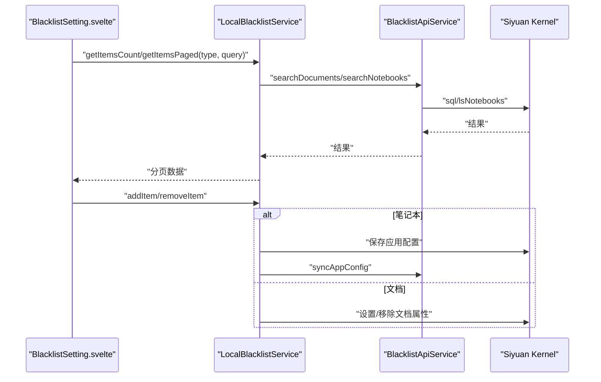
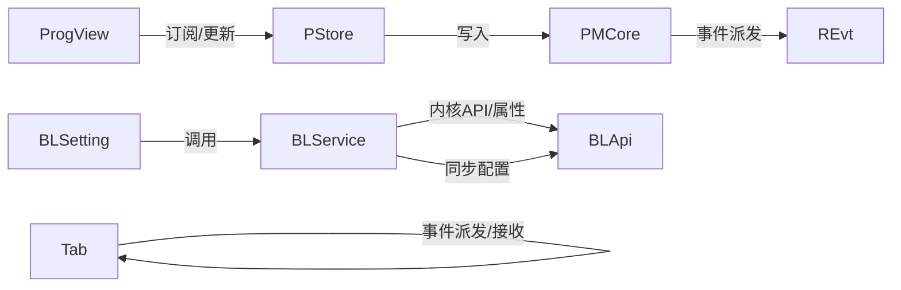

# 通用组件

<cite>
**本文引用的文件**
- [src/libs/components/tab/Tab.svelte](file://src/libs/components/tab/Tab.svelte)
- [src/libs/components/ProgressManager.svelte](file://src/libs/components/ProgressManager.svelte)
- [src/utils/progress/ProgressManager.ts](file://src/utils/progress/ProgressManager.ts)
- [src/utils/progress/ProgressState.ts](file://src/utils/progress/ProgressState.ts)
- [src/utils/progress/ResourceEventEmitter.ts](file://src/utils/progress/ResourceEventEmitter.ts)
- [src/utils/progress/progressStore.ts](file://src/utils/progress/progressStore.ts)
- [src/libs/pages/setting/BlacklistSetting.svelte](file://src/libs/pages/setting/BlacklistSetting.svelte)
- [src/models/ShareBlacklist.ts](file://src/models/ShareBlacklist.ts)
- [src/service/LocalBlacklistService.ts](file://src/service/LocalBlacklistService.ts)
- [src/service/BlacklistApiService.ts](file://src/service/BlacklistApiService.ts)
- [src/libs/components/subdocument/SubdocumentTreePreview.svelte](file://src/libs/components/subdocument/SubdocumentTreePreview.svelte)
- [src/libs/components/Confirm.svelte](file://src/libs/components/Confirm.svelte)
</cite>

## 目录
1. [简介](#简介)
2. [项目结构](#项目结构)
3. [核心组件](#核心组件)
4. [架构总览](#架构总览)
5. [详细组件分析](#详细组件分析)
6. [依赖关系分析](#依赖关系分析)
7. [性能考量](#性能考量)
8. [故障排查指南](#故障排查指南)
9. [结论](#结论)
10. [附录](#附录)

## 简介
本文件面向“思源笔记分享专业版”的通用组件体系，重点覆盖以下能力：
- Tab组件：动态内容加载、标签页切换动画、垂直布局模式
- ProgressManager进度管理：状态跟踪、事件监听、可视化反馈与自动收起策略
- DocumentSelector文档选择器：多选逻辑、过滤功能、预览展示（以子文档树预览为例）
- SharePreview分享预览：内容渲染、样式适配、交互控制
- BlacklistManager黑名单管理：列表展示、增删操作、数据同步机制
并给出通用组件的属性接口设计、事件系统、样式定制与可复用性建议，以及使用示例、最佳实践与性能优化建议。

## 项目结构
通用组件主要位于 src/libs/components 与 src/libs/pages 下，配合 src/utils/progress 提供全局进度状态与事件驱动；黑名单相关位于 src/models、src/service 与 src/libs/pages/setting。

图示来源
- [src/libs/components/tab/Tab.svelte:1-123](file://src/libs/components/tab/Tab.svelte#L1-L123)
- [src/libs/components/ProgressManager.svelte:1-471](file://src/libs/components/ProgressManager.svelte#L1-L471)
- [src/utils/progress/ProgressManager.ts:1-238](file://src/utils/progress/ProgressManager.ts#L1-L238)
- [src/utils/progress/ProgressState.ts:1-27](file://src/utils/progress/ProgressState.ts#L1-L27)
- [src/utils/progress/ResourceEventEmitter.ts:1-11](file://src/utils/progress/ResourceEventEmitter.ts#L1-L11)
- [src/utils/progress/progressStore.ts:1-15](file://src/utils/progress/progressStore.ts#L1-L15)
- [src/libs/components/subdocument/SubdocumentTreePreview.svelte:328-412](file://src/libs/components/subdocument/SubdocumentTreePreview.svelte#L328-L412)
- [src/models/ShareBlacklist.ts:1-99](file://src/models/ShareBlacklist.ts#L1-L99)
- [src/service/LocalBlacklistService.ts:1-658](file://src/service/LocalBlacklistService.ts#L1-L658)
- [src/service/BlacklistApiService.ts:1-76](file://src/service/BlacklistApiService.ts#L1-L76)
- [src/libs/pages/setting/BlacklistSetting.svelte:36-756](file://src/libs/pages/setting/BlacklistSetting.svelte#L36-L756)

章节来源
- [src/libs/components/tab/Tab.svelte:1-123](file://src/libs/components/tab/Tab.svelte#L1-L123)
- [src/libs/components/ProgressManager.svelte:1-471](file://src/libs/components/ProgressManager.svelte#L1-L471)
- [src/utils/progress/ProgressManager.ts:1-238](file://src/utils/progress/ProgressManager.ts#L1-L238)
- [src/utils/progress/ProgressState.ts:1-27](file://src/utils/progress/ProgressState.ts#L1-L27)
- [src/utils/progress/ResourceEventEmitter.ts:1-11](file://src/utils/progress/ResourceEventEmitter.ts#L1-L11)
- [src/utils/progress/progressStore.ts:1-15](file://src/utils/progress/progressStore.ts#L1-L15)
- [src/libs/components/subdocument/SubdocumentTreePreview.svelte:328-412](file://src/libs/components/subdocument/SubdocumentTreePreview.svelte#L328-L412)
- [src/models/ShareBlacklist.ts:1-99](file://src/models/ShareBlacklist.ts#L1-L99)
- [src/service/LocalBlacklistService.ts:1-658](file://src/service/LocalBlacklistService.ts#L1-L658)
- [src/service/BlacklistApiService.ts:1-76](file://src/service/BlacklistApiService.ts#L1-L76)
- [src/libs/pages/setting/BlacklistSetting.svelte:36-756](file://src/libs/pages/setting/BlacklistSetting.svelte#L36-L756)

## 核心组件
- Tab组件：支持动态内容渲染、标签切换事件、垂直/水平布局切换
- ProgressManager组件：订阅全局进度状态，提供可视化面板、自动收起、错误聚合展示
- DocumentSelector（以子文档树预览为例）：多选、全选/反选、首层选择、统计估算
- SharePreview（概念性说明）：内容渲染、样式适配、交互控制
- BlacklistManager：列表展示、增删改查、分页搜索、数据同步

章节来源
- [src/libs/components/tab/Tab.svelte:10-45](file://src/libs/components/tab/Tab.svelte#L10-L45)
- [src/libs/components/ProgressManager.svelte:1-102](file://src/libs/components/ProgressManager.svelte#L1-L102)
- [src/libs/components/subdocument/SubdocumentTreePreview.svelte:328-412](file://src/libs/components/subdocument/SubdocumentTreePreview.svelte#L328-L412)
- [src/models/ShareBlacklist.ts:46-99](file://src/models/ShareBlacklist.ts#L46-L99)
- [src/service/LocalBlacklistService.ts:43-285](file://src/service/LocalBlacklistService.ts#L43-L285)

## 架构总览
通用组件围绕“状态-视图-事件”三要素协作：
- 状态：ProgressState 定义进度字段；progressStore 提供全局可订阅状态
- 视图：各组件负责渲染与交互
- 事件：ResourceEventEmitter 提供资源级事件派发，ProgressManager 统一消费并更新状态

图示来源
- [src/utils/progress/ProgressManager.ts:12-102](file://src/utils/progress/ProgressManager.ts#L12-L102)
- [src/utils/progress/progressStore.ts:7-14](file://src/utils/progress/progressStore.ts#L7-L14)
- [src/utils/progress/ResourceEventEmitter.ts:3-10](file://src/utils/progress/ResourceEventEmitter.ts#L3-L10)

## 详细组件分析

### Tab组件：动态内容加载、切换动画与垂直布局
- 动态内容加载
  - 支持 content 为函数或静态内容；当为函数时通过 svelte:component 动态渲染
  - props 透传给动态组件，便于复用与参数化
- 切换动画
  - 通过 Svelte 内置的条件渲染与样式过渡实现平滑切换
  - 垂直布局通过 class:vertical 控制容器方向，tab-list 与 tab-content 的 flex 方向随之变化
- 垂直布局模式
  - vertical=true 时，tab-list 横向排列，tab-content 占满剩余空间
  - 垂直模式下 tab 边框与 hover 效果适配暗色主题

图示来源
- [src/libs/components/tab/Tab.svelte:19-44](file://src/libs/components/tab/Tab.svelte#L19-L44)

章节来源
- [src/libs/components/tab/Tab.svelte:10-123](file://src/libs/components/tab/Tab.svelte#L10-L123)

### ProgressManager进度管理：状态跟踪、事件监听与可视化反馈
- 状态跟踪
  - ProgressState 定义批次 ID、操作名、总量/完成量/百分比、状态、当前文档、错误列表、资源处理字段等
  - progressStore 提供全局可订阅状态
- 事件监听
  - ResourceEventEmitter 提供 START/PROGRESS/ERROR/COMPLETE 四类事件
  - ProgressManager 在 startBatch 时注册监听，并在 completeBatch/cancelBatch 时清理
- 可视化反馈
  - ProgressManager.svelte 订阅 progressStore，渲染标题、状态图标、进度条、资源进度、等待资源完成提示、当前文档、倒计时与错误详情
  - 成功且无错误时启用自动收起倒计时，错误时持久展示

图示来源
- [src/libs/components/ProgressManager.svelte:17-101](file://src/libs/components/ProgressManager.svelte#L17-L101)
- [src/utils/progress/ProgressManager.ts:35-101](file://src/utils/progress/ProgressManager.ts#L35-L101)
- [src/utils/progress/ResourceEventEmitter.ts:3-10](file://src/utils/progress/ResourceEventEmitter.ts#L3-L10)
- [src/utils/progress/progressStore.ts:7-14](file://src/utils/progress/progressStore.ts#L7-L14)

章节来源
- [src/libs/components/ProgressManager.svelte:1-471](file://src/libs/components/ProgressManager.svelte#L1-L471)
- [src/utils/progress/ProgressManager.ts:1-238](file://src/utils/progress/ProgressManager.ts#L1-L238)
- [src/utils/progress/ProgressState.ts:1-27](file://src/utils/progress/ProgressState.ts#L1-L27)
- [src/utils/progress/ResourceEventEmitter.ts:1-11](file://src/utils/progress/ResourceEventEmitter.ts#L1-L11)
- [src/utils/progress/progressStore.ts:1-15](file://src/utils/progress/progressStore.ts#L1-L15)

### DocumentSelector文档选择器：多选逻辑、过滤功能与预览展示
- 多选逻辑
  - 使用 Set 维护选中 ID 集合；全选/反选基于节点 ID 列表切换
  - 选中变化时通过回调 onSubdocumentSelect 通知父组件
- 过滤功能
  - 以子文档树为基础进行统计与展示；首层仅选中主文档的子节点
- 预览展示
  - 统计已选数量、估算耗时与存储；提供“仅首层”“全选/反选”快捷操作

图示来源
- [src/libs/components/subdocument/SubdocumentTreePreview.svelte:334-357](file://src/libs/components/subdocument/SubdocumentTreePreview.svelte#L334-L357)

章节来源
- [src/libs/components/subdocument/SubdocumentTreePreview.svelte:328-412](file://src/libs/components/subdocument/SubdocumentTreePreview.svelte#L328-L412)

### SharePreview分享预览：内容渲染、样式适配与交互控制（概念性说明）
- 内容渲染：根据目标对象类型（文档/子文档/笔记本）选择合适的渲染策略
- 样式适配：遵循暗色/亮色主题变量，保证在不同主题下的可读性与一致性
- 交互控制：提供复制链接、打开页面、预览缩略图等操作入口，支持键盘快捷键与无障碍访问

[本节为概念性说明，不直接分析具体文件，故无章节来源]

### BlacklistManager黑名单管理：列表展示、增删操作与数据同步
- 列表展示
  - 支持按类型筛选（笔记本/文档/全部）与关键词搜索；分页加载与本地缓存
- 增删操作
  - 新增：按类型写入笔记本配置或文档属性
  - 删除：优先尝试从笔记本黑名单移除，失败则回退到文档黑名单
  - 批量检查：统一返回记录，内部区分笔记本/文档两类
- 数据同步
  - 笔记本黑名单变更后同步至服务端配置；文档黑名单通过内核属性持久化

图示来源
- [src/libs/pages/setting/BlacklistSetting.svelte:42-78](file://src/libs/pages/setting/BlacklistSetting.svelte#L42-L78)
- [src/service/LocalBlacklistService.ts:50-118](file://src/service/LocalBlacklistService.ts#L50-L118)
- [src/service/LocalBlacklistService.ts:168-202](file://src/service/LocalBlacklistService.ts#L168-L202)
- [src/service/LocalBlacklistService.ts:221-249](file://src/service/LocalBlacklistService.ts#L221-L249)
- [src/service/BlacklistApiService.ts:34-74](file://src/service/BlacklistApiService.ts#L34-L74)

章节来源
- [src/libs/pages/setting/BlacklistSetting.svelte:36-756](file://src/libs/pages/setting/BlacklistSetting.svelte#L36-L756)
- [src/models/ShareBlacklist.ts:46-99](file://src/models/ShareBlacklist.ts#L46-L99)
- [src/service/LocalBlacklistService.ts:1-658](file://src/service/LocalBlacklistService.ts#L1-L658)
- [src/service/BlacklistApiService.ts:1-76](file://src/service/BlacklistApiService.ts#L1-L76)

## 依赖关系分析
- 组件间耦合
  - Tab 与外部交互通过事件派发，低耦合高内聚
  - ProgressManager.svelte 与 ProgressManager.ts 通过 progressStore 解耦，便于测试与替换
- 外部依赖
  - 黑名单模块依赖思源内核 API（lsNotebooks/sql/setBlockAttrs/getBlockAttrs），并通过 SettingService 同步配置
  - 进度模块依赖 EventEmitter3 作为事件总线

图示来源
- [src/libs/components/tab/Tab.svelte:17-24](file://src/libs/components/tab/Tab.svelte#L17-L24)
- [src/libs/components/ProgressManager.svelte:17-40](file://src/libs/components/ProgressManager.svelte#L17-L40)
- [src/utils/progress/ProgressManager.ts:35-101](file://src/utils/progress/ProgressManager.ts#L35-L101)
- [src/service/LocalBlacklistService.ts:37-41](file://src/service/LocalBlacklistService.ts#L37-L41)
- [src/service/BlacklistApiService.ts:34-74](file://src/service/BlacklistApiService.ts#L34-L74)

章节来源
- [src/libs/components/tab/Tab.svelte:10-45](file://src/libs/components/tab/Tab.svelte#L10-L45)
- [src/libs/components/ProgressManager.svelte:1-102](file://src/libs/components/ProgressManager.svelte#L1-L102)
- [src/utils/progress/ProgressManager.ts:1-238](file://src/utils/progress/ProgressManager.ts#L1-L238)
- [src/service/LocalBlacklistService.ts:1-658](file://src/service/LocalBlacklistService.ts#L1-L658)
- [src/service/BlacklistApiService.ts:1-76](file://src/service/BlacklistApiService.ts#L1-L76)

## 性能考量
- 进度更新
  - 使用 updateProgressState 与 store.update 减少不必要的重渲染
  - 资源事件聚合处理，避免频繁 UI 刷新
- 黑名单查询
  - 分页与关键词过滤结合，减少一次性加载量
  - 批量检查通过内核属性一次获取，降低多次往返
- 文档选择器
  - 多选集合使用 Set，提高查找与去重效率
  - 统计值响应式计算，仅在依赖变化时更新

[本节提供一般性指导，不直接分析具体文件，故无章节来源]

## 故障排查指南
- 进度面板不消失
  - 检查是否触发了 completeBatch 或 cancelBatch，确保事件监听被正确清理
  - 确认状态字段 documentsCompleted 与 isResourceProcessing 的组合满足自动收起条件
- 黑名单项未生效
  - 笔记本黑名单需同步至服务端配置；文档黑名单需确认属性写入成功
  - 批量检查失败时默认返回 false，需检查内核 API 调用与权限
- 文档选择器多选异常
  - 确认 onSubdocumentSelect 回调是否正确接收数组
  - 检查节点 ID 来源与 Set 操作是否一致

章节来源
- [src/libs/components/ProgressManager.svelte:42-101](file://src/libs/components/ProgressManager.svelte#L42-L101)
- [src/utils/progress/ProgressManager.ts:145-172](file://src/utils/progress/ProgressManager.ts#L145-L172)
- [src/service/LocalBlacklistService.ts:187-202](file://src/service/LocalBlacklistService.ts#L187-L202)
- [src/libs/components/subdocument/SubdocumentTreePreview.svelte:328-357](file://src/libs/components/subdocument/SubdocumentTreePreview.svelte#L328-L357)

## 结论
该通用组件体系以“状态-事件-视图”解耦为核心，通过 ProgressManager 提供统一的进度可视化与自动化收起策略；Tab 组件实现灵活的动态内容与布局切换；DocumentSelector 提供直观的多选与统计；BlacklistManager 则完整覆盖了黑名单的增删改查与数据同步。整体具备良好的可扩展性与可维护性，适合在复杂业务场景中复用与演进。

[本节为总结性内容，不直接分析具体文件，故无章节来源]

## 附录

### 通用组件接口设计与事件系统
- 属性接口设计
  - Tab：tabs（标签数组）、activeTab（当前索引）、vertical（布局开关）
  - ProgressManager.svelte：pluginInstance（插件实例）
  - Confirm：title/message/confirmText/cancelText/show/onConfirm/onCancel
  - DocumentSelector（以子文档树为例）：onSubdocumentSelect、isLoading、subdocumentTree、totalSubdocuments
  - BlacklistSetting：searchTerm/filterType/currentPage/pageSize/loadData/updateFilteredResults
- 事件系统
  - Tab：tabChange（标签切换）
  - ProgressManager：START/PROGRESS/ERROR/COMPLETE（资源事件）
  - Confirm：onConfirm/onCancel（确认/取消回调）

章节来源
- [src/libs/components/tab/Tab.svelte:13-24](file://src/libs/components/tab/Tab.svelte#L13-L24)
- [src/libs/components/ProgressManager.svelte:5-101](file://src/libs/components/ProgressManager.svelte#L5-L101)
- [src/libs/components/Confirm.svelte:4-50](file://src/libs/components/Confirm.svelte#L4-L50)
- [src/libs/components/subdocument/SubdocumentTreePreview.svelte:328-357](file://src/libs/components/subdocument/SubdocumentTreePreview.svelte#L328-L357)
- [src/libs/pages/setting/BlacklistSetting.svelte:36-78](file://src/libs/pages/setting/BlacklistSetting.svelte#L36-L78)

### 样式定制与可复用性建议
- 使用主题变量（如 --b3-theme-*）保证明暗主题一致性
- 通过 class 修饰符（如 vertical）实现布局切换，避免硬编码样式
- 将交互细节（如动画时长、阴影、边框）抽象为可配置常量，便于统一风格
- 组件尽量无副作用，通过 props 与事件进行通信，提升可测试性与可复用性

[本节为通用建议，不直接分析具体文件，故无章节来源]

### 使用示例与最佳实践
- 使用示例
  - Tab：传入 tabs 数组与 activeTab，监听 tabChange 事件处理业务逻辑
  - ProgressManager：在批量任务开始时 startBatch，过程中 updateProgress，结束时 completeBatch
  - DocumentSelector：绑定 onSubdocumentSelect，使用 Set 维护选中集合
  - BlacklistSetting：设置 searchTerm 与 filterType，调用 loadData 获取分页数据
- 最佳实践
  - 事件监听在组件销毁时及时清理，避免内存泄漏
  - 对外暴露的 props 与事件命名清晰，文档化默认值与约束
  - 对于大数据量场景，优先采用分页与懒加载策略

[本节为通用建议，不直接分析具体文件，故无章节来源]