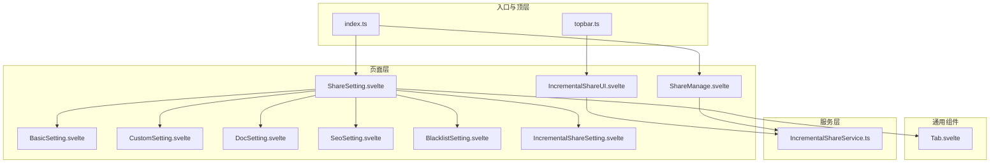
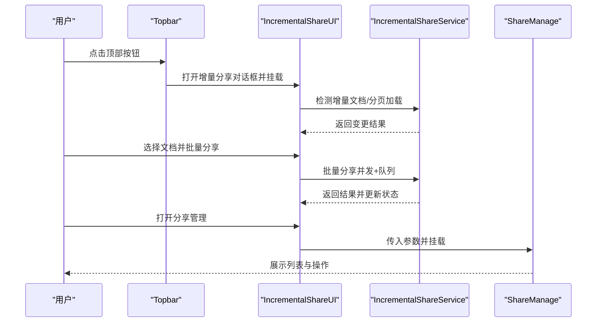
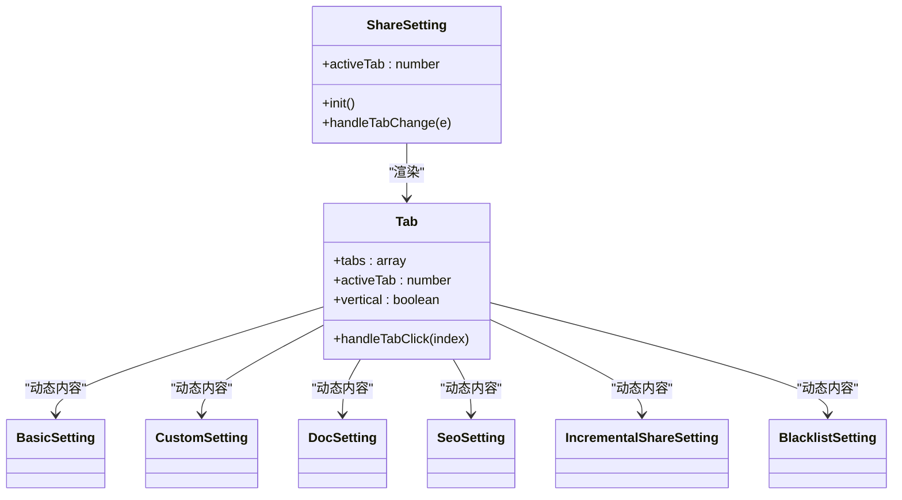
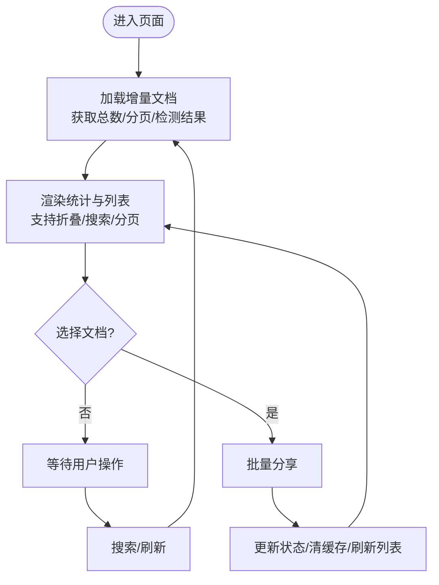
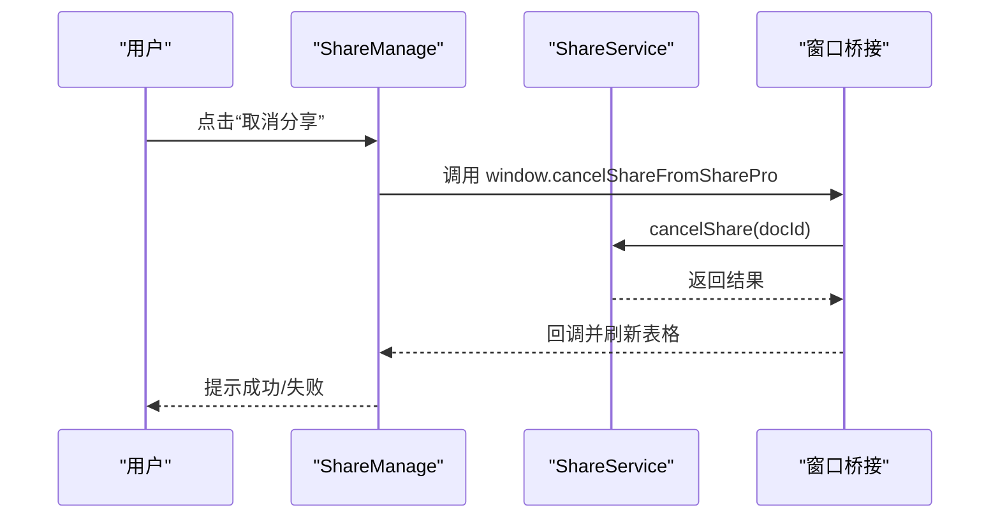
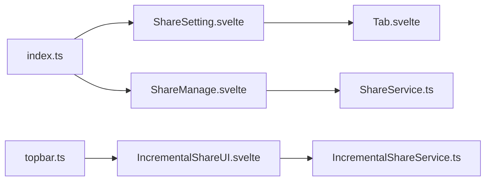

# 主要页面

<cite>
**本文引用的文件**
- [ShareSetting.svelte](file://src/libs/pages/ShareSetting.svelte)
- [Tab.svelte](file://src/libs/components/tab/Tab.svelte)
- [IncrementalShareUI.svelte](file://src/libs/pages/IncrementalShareUI.svelte)
- [ShareManage.svelte](file://src/libs/pages/ShareManage.svelte)
- [BasicSetting.svelte](file://src/libs/pages/setting/BasicSetting.svelte)
- [CustomSetting.svelte](file://src/libs/pages/setting/CustomSetting.svelte)
- [DocSetting.svelte](file://src/libs/pages/setting/DocSetting.svelte)
- [SeoSetting.svelte](file://src/libs/pages/setting/SeoSetting.svelte)
- [BlacklistSetting.svelte](file://src/libs/pages/setting/BlacklistSetting.svelte)
- [IncrementalShareSetting.svelte](file://src/libs/pages/setting/IncrementalShareSetting.svelte)
- [index.ts](file://src/index.ts)
- [topbar.ts](file://src/topbar.ts)
- [IncrementalShareService.ts](file://src/service/IncrementalShareService.ts)
</cite>

## 目录
1. [简介](#简介)
2. [项目结构](#项目结构)
3. [核心组件](#核心组件)
4. [架构总览](#架构总览)
5. [详细组件分析](#详细组件分析)
6. [依赖关系分析](#依赖关系分析)
7. [性能考量](#性能考量)
8. [故障排查指南](#故障排查指南)
9. [结论](#结论)
10. [附录](#附录)

## 简介
本文件聚焦“思源笔记分享专业版”的主要页面组件，系统性解析以下三类页面的架构与实现：
- ShareSetting 设置界面（多标签页架构与动态内容加载）
- IncrementalShareUI 增量分享界面（交互设计、状态管理与用户引导）
- ShareManage 分享管理界面（数据展示、操作控制与结果反馈）

文档还涵盖页面组件的生命周期管理、事件处理机制、与服务层的数据交互模式，以及页面初始化流程、状态同步机制与错误处理策略。

## 项目结构
主要页面位于 src/libs/pages 及其子目录，配合通用组件 src/libs/components 与服务层 src/service。入口与顶层交互由 src/index.ts 与 src/topbar.ts 提供。

图示来源
- [ShareSetting.svelte:10-119](file://src/libs/pages/ShareSetting.svelte#L10-L119)
- [Tab.svelte:10-46](file://src/libs/components/tab/Tab.svelte#L10-L46)
- [IncrementalShareUI.svelte:10-343](file://src/libs/pages/IncrementalShareUI.svelte#L10-L343)
- [ShareManage.svelte:9-352](file://src/libs/pages/ShareManage.svelte#L9-L352)
- [IncrementalShareService.ts:98-129](file://src/service/IncrementalShareService.ts#L98-L129)
- [index.ts:33-95](file://src/index.ts#L33-L95)
- [topbar.ts:26-98](file://src/topbar.ts#L26-L98)

章节来源
- [ShareSetting.svelte:10-119](file://src/libs/pages/ShareSetting.svelte#L10-L119)
- [Tab.svelte:10-46](file://src/libs/components/tab/Tab.svelte#L10-L46)
- [IncrementalShareUI.svelte:10-343](file://src/libs/pages/IncrementalShareUI.svelte#L10-L343)
- [ShareManage.svelte:9-352](file://src/libs/pages/ShareManage.svelte#L9-L352)
- [index.ts:33-95](file://src/index.ts#L33-L95)
- [topbar.ts:26-98](file://src/topbar.ts#L26-L98)

## 核心组件
- ShareSetting 设置界面：采用 Tab 组件实现多标签页，动态构建 tabs 数据，按需渲染对应设置子页面，支持垂直布局与标签切换事件。
- IncrementalShareUI 增量分享界面：负责增量文档检测、分页加载、选择与批量分享、统计面板与用户引导。
- ShareManage 分享管理界面：提供分享列表的表格展示、分页与排序、操作列（取消、设首页、查看、跳转、复制ID）、远程配置同步与状态反馈。
- Tab 组件：通用标签页容器，支持动态内容渲染与事件派发，作为 ShareSetting 的基础构件。
- IncrementalShareService：服务层核心，封装增量检测、分页检测、批量分享、并发与队列管理、重试策略与缓存清理等。

章节来源
- [ShareSetting.svelte:34-111](file://src/libs/pages/ShareSetting.svelte#L34-L111)
- [Tab.svelte:13-24](file://src/libs/components/tab/Tab.svelte#L13-L24)
- [IncrementalShareUI.svelte:32-343](file://src/libs/pages/IncrementalShareUI.svelte#L32-L343)
- [ShareManage.svelte:23-352](file://src/libs/pages/ShareManage.svelte#L23-L352)
- [IncrementalShareService.ts:98-129](file://src/service/IncrementalShareService.ts#L98-L129)

## 架构总览
整体采用“页面组件 + 通用组件 + 服务层”的分层架构。页面组件通过属性传递与事件通信与通用组件协作；服务层提供业务能力并与外部服务交互；入口与顶层交互负责页面装载与顶层行为。

图示来源
- [topbar.ts:264-293](file://src/topbar.ts#L264-L293)
- [IncrementalShareUI.svelte:125-187](file://src/libs/pages/IncrementalShareUI.svelte#L125-L187)
- [IncrementalShareService.ts:160-210](file://src/service/IncrementalShareService.ts#L160-L210)
- [ShareManage.svelte:346-349](file://src/libs/pages/ShareManage.svelte#L346-L349)

## 详细组件分析

### ShareSetting 设置界面（多标签页架构）
- 动态内容加载机制
  - 在 onMount 生命周期内构建 tabs 数组，每个标签项包含 label、content 组件构造器与 props。
  - 支持基础设置、个性化设置、文档设置、SEO 设置、增量分享设置、黑名单管理等标签页。
- 标签切换逻辑
  - Tab 组件内部维护 activeTab 索引，点击时派发 tabChange 事件，父组件响应并更新 activeTab。
- 属性传递模式
  - 通过 props 将 pluginInstance、dialog、vipInfo 传递给各子设置页面，确保子页面可访问上下文与服务。

图示来源
- [ShareSetting.svelte:34-111](file://src/libs/pages/ShareSetting.svelte#L34-L111)
- [Tab.svelte:13-24](file://src/libs/components/tab/Tab.svelte#L13-L24)
- [BasicSetting.svelte:22-69](file://src/libs/pages/setting/BasicSetting.svelte#L22-L69)
- [CustomSetting.svelte:23-119](file://src/libs/pages/setting/CustomSetting.svelte#L23-L119)
- [DocSetting.svelte:67-122](file://src/libs/pages/setting/DocSetting.svelte#L67-L122)
- [SeoSetting.svelte:38-76](file://src/libs/pages/setting/SeoSetting.svelte#L38-L76)
- [IncrementalShareSetting.svelte:30-94](file://src/libs/pages/setting/IncrementalShareSetting.svelte#L30-L94)
- [BlacklistSetting.svelte:20-106](file://src/libs/pages/setting/BlacklistSetting.svelte#L20-L106)

章节来源
- [ShareSetting.svelte:34-111](file://src/libs/pages/ShareSetting.svelte#L34-L111)
- [Tab.svelte:13-24](file://src/libs/components/tab/Tab.svelte#L13-L24)
- [BasicSetting.svelte:22-69](file://src/libs/pages/setting/BasicSetting.svelte#L22-L69)
- [CustomSetting.svelte:23-119](file://src/libs/pages/setting/CustomSetting.svelte#L23-L119)
- [DocSetting.svelte:67-122](file://src/libs/pages/setting/DocSetting.svelte#L67-L122)
- [SeoSetting.svelte:38-76](file://src/libs/pages/setting/SeoSetting.svelte#L38-L76)
- [IncrementalShareSetting.svelte:30-94](file://src/libs/pages/setting/IncrementalShareSetting.svelte#L30-L94)
- [BlacklistSetting.svelte:20-106](file://src/libs/pages/setting/BlacklistSetting.svelte#L20-L106)

### IncrementalShareUI 增量分享界面
- 交互设计
  - 顶部包含搜索、批量分享、刷新等操作区；中部为统计面板与文档列表；底部为分页控件。
  - 支持折叠统计面板、全选/反选、虚拟滚动列表、文档类型标识与最后分享时间展示。
- 状态管理
  - 内部状态包括：isLoading、changeDetectionResult、selectedDocs、searchTerm、keyInfo、isStatsCollapsed、分页状态 currentPage/pageSize/totalPages。
  - 通过 lastShareTime 与笔记本黑名单过滤参与增量检测。
- 用户引导流程
  - 首次进入加载文档，失败时提示错误；支持打开分享管理与黑名单管理对话框；刷新配置后重新加载。
- 生命周期与事件
  - onMount 中触发 loadDocuments；handleSearch 与 handleRefresh 触发重新加载；handleBulkShare 调用服务层批量分享并更新 UI。

图示来源
- [IncrementalShareUI.svelte:125-187](file://src/libs/pages/IncrementalShareUI.svelte#L125-L187)
- [IncrementalShareUI.svelte:189-245](file://src/libs/pages/IncrementalShareUI.svelte#L189-L245)
- [IncrementalShareUI.svelte:298-342](file://src/libs/pages/IncrementalShareUI.svelte#L298-L342)

章节来源
- [IncrementalShareUI.svelte:32-343](file://src/libs/pages/IncrementalShareUI.svelte#L32-L343)
- [IncrementalShareService.ts:160-210](file://src/service/IncrementalShareService.ts#L160-L210)
- [IncrementalShareService.ts:268-351](file://src/service/IncrementalShareService.ts#L268-L351)

### ShareManage 分享管理界面
- 数据展示
  - 使用 Bench 组件承载表格数据，columns 定义标题、媒体数、状态、操作等列；支持搜索、排序、分页。
- 操作控制
  - 取消分享、设为首页、查看文档、跳转原文档、复制文档ID等操作均通过 window.* 方法桥接调用服务层。
- 结果反馈
  - 操作后统一通过 showMessage 提示结果；加载时显示遮罩层与旋转指示器；远程配置同步失败时给出错误提示。

图示来源
- [ShareManage.svelte:289-300](file://src/libs/pages/ShareManage.svelte#L289-L300)
- [ShareManage.svelte:346-349](file://src/libs/pages/ShareManage.svelte#L346-L349)

章节来源
- [ShareManage.svelte:23-352](file://src/libs/pages/ShareManage.svelte#L23-L352)

## 依赖关系分析
- 页面到组件
  - ShareSetting 依赖 Tab 组件进行多标签页渲染与事件派发。
- 页面到服务
  - IncrementalShareUI 依赖 IncrementalShareService 进行增量检测、分页检测与批量分享。
  - ShareManage 依赖 ShareService 进行列表查询、取消分享、获取分享信息等。
- 入口与顶层交互
  - index.ts 提供 openSetting 与安全配置加载；topbar.ts 提供顶部按钮与菜单，负责打开增量分享 UI 与分享管理页。

图示来源
- [index.ts:73-95](file://src/index.ts#L73-L95)
- [topbar.ts:264-293](file://src/topbar.ts#L264-L293)
- [ShareSetting.svelte:10-119](file://src/libs/pages/ShareSetting.svelte#L10-L119)
- [Tab.svelte:10-46](file://src/libs/components/tab/Tab.svelte#L10-L46)
- [IncrementalShareUI.svelte:10-343](file://src/libs/pages/IncrementalShareUI.svelte#L10-L343)
- [IncrementalShareService.ts:98-129](file://src/service/IncrementalShareService.ts#L98-L129)
- [ShareManage.svelte:9-352](file://src/libs/pages/ShareManage.svelte#L9-L352)

章节来源
- [index.ts:73-95](file://src/index.ts#L73-L95)
- [topbar.ts:264-293](file://src/topbar.ts#L264-L293)
- [ShareSetting.svelte:10-119](file://src/libs/pages/ShareSetting.svelte#L10-L119)
- [Tab.svelte:10-46](file://src/libs/components/tab/Tab.svelte#L10-L46)
- [IncrementalShareUI.svelte:10-343](file://src/libs/pages/IncrementalShareUI.svelte#L10-L343)
- [IncrementalShareService.ts:98-129](file://src/service/IncrementalShareService.ts#L98-L129)
- [ShareManage.svelte:9-352](file://src/libs/pages/ShareManage.svelte#L9-L352)

## 性能考量
- 虚拟滚动：IncrementalShareUI 使用虚拟列表组件减少 DOM 节点数量，提升长列表渲染性能。
- 分页与缓存：IncrementalShareService 对增量检测结果与分享历史进行缓存，降低重复请求与计算成本。
- 并发控制：批量分享采用并发限制与队列管理，避免对服务端造成过大压力，同时支持暂停与恢复。
- 懒加载与事件驱动：Tab 组件仅在激活标签时渲染对应内容，减少初始渲染负担。

章节来源
- [IncrementalShareUI.svelte:41-43](file://src/libs/pages/IncrementalShareUI.svelte#L41-L43)
- [IncrementalShareService.ts:108-129](file://src/service/IncrementalShareService.ts#L108-L129)
- [IncrementalShareService.ts:268-351](file://src/service/IncrementalShareService.ts#L268-L351)

## 故障排查指南
- 增量分享加载失败
  - 现象：加载文档时报错并提示错误信息。
  - 排查：确认网络连通、VIP 信息有效性、笔记本黑名单配置；查看日志输出定位具体错误。
- 批量分享异常
  - 现象：部分文档失败或全部失败。
  - 排查：检查黑名单过滤、重试策略与并发限制；查看服务端状态码与错误信息；必要时清理缓存后重试。
- 分享管理无数据
  - 现象：表格为空或加载失败。
  - 排查：确认远程配置同步成功、搜索条件与分页参数正确；检查权限与令牌有效性。
- 设置页面保存失败
  - 现象：保存配置后同步失败。
  - 排查：检查网络与服务端响应；确认 VIP 信息与令牌有效；查看错误提示并重试。

章节来源
- [IncrementalShareUI.svelte:181-186](file://src/libs/pages/IncrementalShareUI.svelte#L181-L186)
- [IncrementalShareService.ts:585-659](file://src/service/IncrementalShareService.ts#L585-L659)
- [ShareManage.svelte:282-286](file://src/libs/pages/ShareManage.svelte#L282-L286)
- [BasicSetting.svelte:34-48](file://src/libs/pages/setting/BasicSetting.svelte#L34-L48)

## 结论
该页面体系通过清晰的分层设计与通用组件复用，实现了设置、增量分享与管理三大核心场景的高内聚低耦合。Tab 组件提供了灵活的多标签页动态渲染能力；IncrementalShareUI 以状态驱动与服务层协同，保障了交互流畅与性能稳定；ShareManage 则以表格与操作列形式提供完整的数据管理体验。整体具备良好的扩展性与可维护性。

## 附录
- 页面初始化流程
  - 顶层交互触发页面装载，设置页面通过 Dialog 挂载 ShareSetting；增量分享通过 Dialog 挂载 IncrementalShareUI；分享管理通过对话框挂载 ShareManage。
- 状态同步机制
  - 本地配置通过 safeLoad 与 saveData 管理；远程配置通过 SettingService 同步；增量分享的最后分享时间与配置变更通过服务层写回并同步。
- 错误处理策略
  - 统一使用 showMessage 输出用户可见提示；服务层对网络与服务端错误进行分类处理与重试；页面层对加载与交互错误进行降级与提示。

章节来源
- [topbar.ts:264-293](file://src/topbar.ts#L264-L293)
- [index.ts:126-148](file://src/index.ts#L126-L148)
- [IncrementalShareService.ts:368-389](file://src/service/IncrementalShareService.ts#L368-L389)
- [IncrementalShareUI.svelte:181-186](file://src/libs/pages/IncrementalShareUI.svelte#L181-L186)