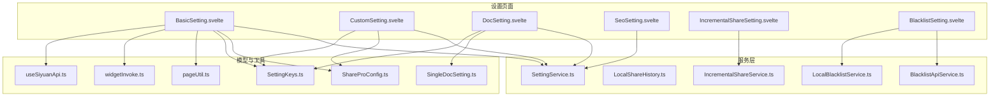
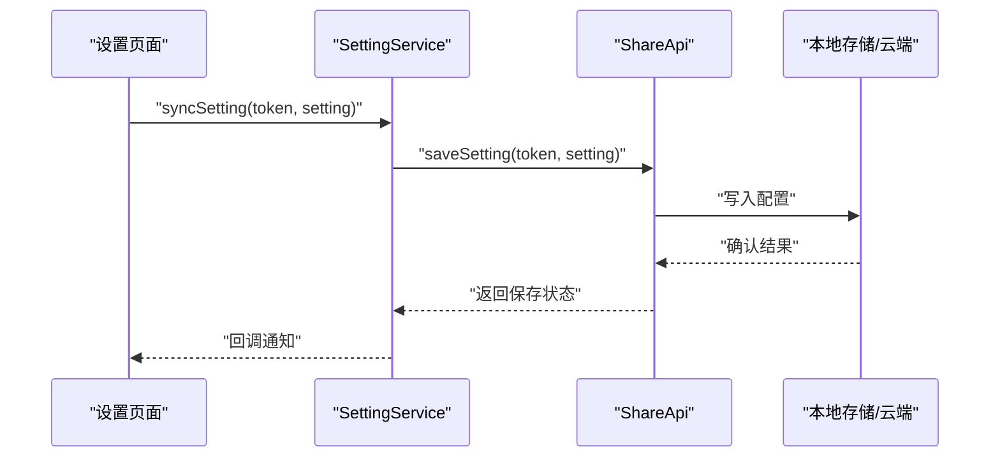
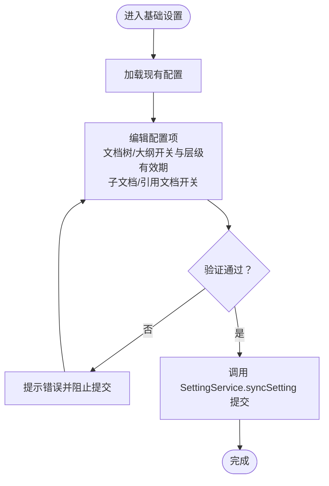
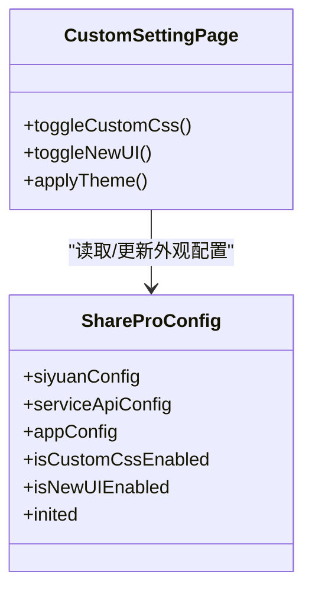
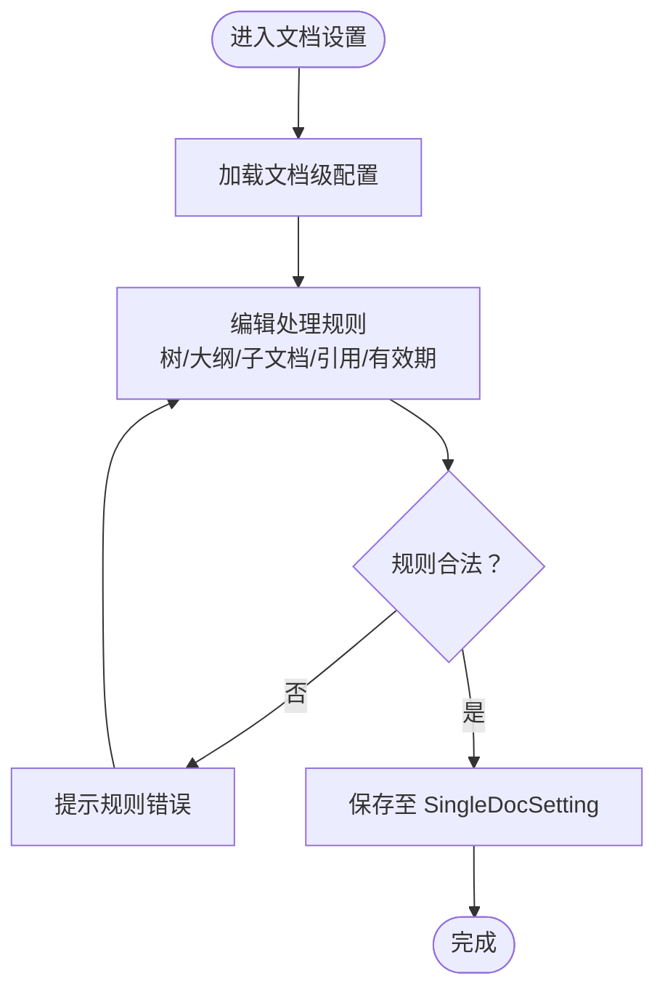
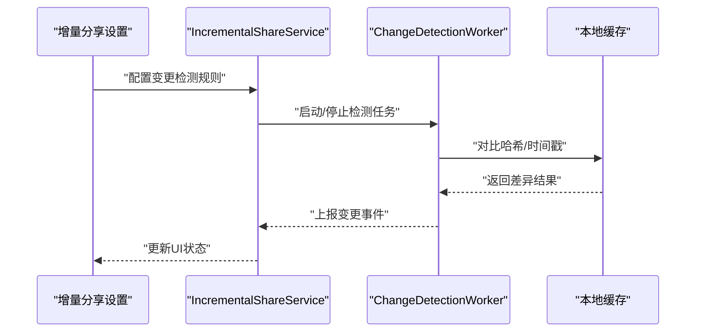
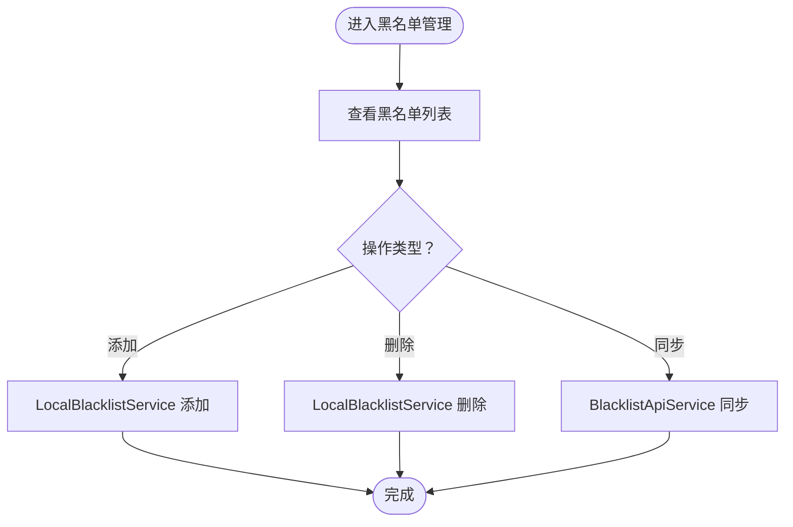
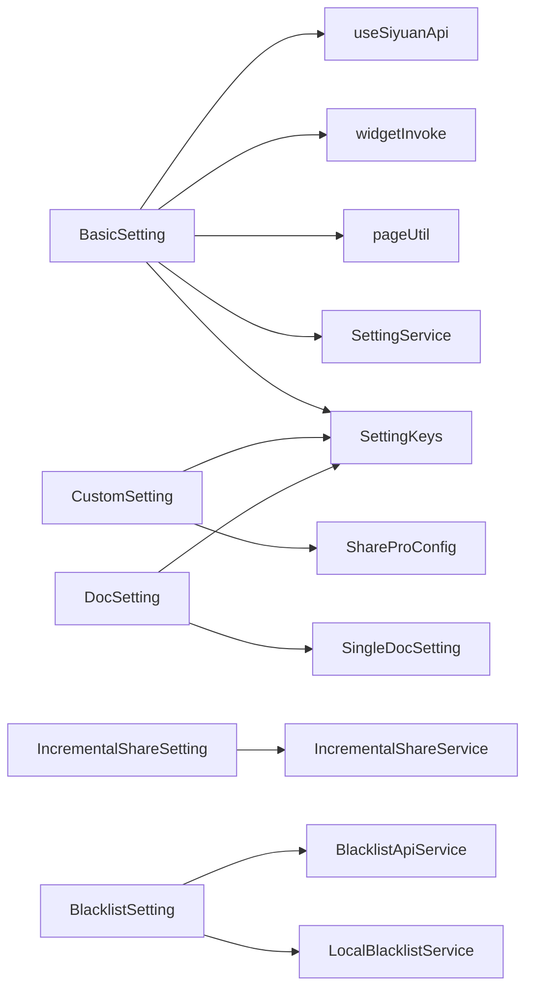

# 设置子页面

<cite>
**本文档引用的文件**
- [src/libs/pages/setting/BasicSetting.svelte](file://src/libs/pages/setting/BasicSetting.svelte)
- [src/libs/pages/setting/CustomSetting.svelte](file://src/libs/pages/setting/CustomSetting.svelte)
- [src/libs/pages/setting/DocSetting.svelte](file://src/libs/pages/setting/DocSetting.svelte)
- [src/libs/pages/setting/SeoSetting.svelte](file://src/libs/pages/setting/SeoSetting.svelte)
- [src/libs/pages/setting/IncrementalShareSetting.svelte](file://src/libs/pages/setting/IncrementalShareSetting.svelte)
- [src/libs/pages/setting/BlacklistSetting.svelte](file://src/libs/pages/setting/BlacklistSetting.svelte)
- [src/service/SettingService.ts](file://src/service/SettingService.ts)
- [src/models/ShareProConfig.ts](file://src/models/ShareProConfig.ts)
- [src/models/SingleDocSetting.ts](file://src/models/SingleDocSetting.ts)
- [src/utils/SettingKeys.ts](file://src/utils/SettingKeys.ts)
- [src/service/LocalShareHistory.ts](file://src/service/LocalShareHistory.ts)
- [src/service/BlacklistApiService.ts](file://src/service/BlacklistApiService.ts)
- [src/service/LocalBlacklistService.ts](file://src/service/LocalBlacklistService.ts)
- [src/service/IncrementalShareService.ts](file://src/service/IncrementalShareService.ts)
- [src/workers/change-detection.worker.ts](file://src/workers/change-detection.worker.ts)
- [src/api/share-api.ts](file://src/api/share-api.ts)
- [src/invoke/widgetInvoke.ts](file://src/invoke/widgetInvoke.ts)
- [src/composables/useSiyuanApi.ts](file://src/composables/useSiyuanApi.ts)
- [src/utils/pageUtil.ts](file://src/utils/pageUtil.ts)
</cite>

## 目录
1. [简介](#简介)
2. [项目结构](#项目结构)
3. [核心组件](#核心组件)
4. [架构总览](#架构总览)
5. [详细组件分析](#详细组件分析)
6. [依赖关系分析](#依赖关系分析)
7. [性能考虑](#性能考虑)
8. [故障排除指南](#故障排除指南)
9. [结论](#结论)

## 简介
本文件面向思源笔记分享专业版的设置子页面，系统性梳理并文档化以下六个设置页面的功能职责与实现要点：基础设置（BasicSetting）、个性化设置（CustomSetting）、文档设置（DocSetting）、SEO优化（SeoSetting）、增量分享配置（IncrementalShareSetting）以及黑名单管理（BlacklistSetting）。文档重点覆盖配置项管理、表单验证、数据持久化、主题与外观定制、文档处理规则、SEO元数据与URL优化策略、变更检测与性能优化、以及权限控制与安全策略。

## 项目结构
设置子页面位于 `src/libs/pages/setting/` 目录下，每个页面对应一个 Svelte 组件，负责渲染各自的配置界面并协调服务层完成数据读写。核心模型与服务包括：
- 配置模型：ShareProConfig（全局应用配置）、SingleDocSetting（文档级设置）
- 设置键值：SettingKeys（统一的配置键枚举）
- 设置服务：SettingService（云端同步与获取）
- 页面间通用工具：pageUtil、widgetInvoke、useSiyuanApi

**图表来源**
- [src/libs/pages/setting/BasicSetting.svelte](file://src/libs/pages/setting/BasicSetting.svelte)
- [src/libs/pages/setting/CustomSetting.svelte](file://src/libs/pages/setting/CustomSetting.svelte)
- [src/libs/pages/setting/DocSetting.svelte](file://src/libs/pages/setting/DocSetting.svelte)
- [src/libs/pages/setting/SeoSetting.svelte](file://src/libs/pages/setting/SeoSetting.svelte)
- [src/libs/pages/setting/IncrementalShareSetting.svelte](file://src/libs/pages/setting/IncrementalShareSetting.svelte)
- [src/libs/pages/setting/BlacklistSetting.svelte](file://src/libs/pages/setting/BlacklistSetting.svelte)
- [src/service/SettingService.ts](file://src/service/SettingService.ts)
- [src/models/ShareProConfig.ts](file://src/models/ShareProConfig.ts)
- [src/models/SingleDocSetting.ts](file://src/models/SingleDocSetting.ts)
- [src/utils/SettingKeys.ts](file://src/utils/SettingKeys.ts)
- [src/service/LocalShareHistory.ts](file://src/service/LocalShareHistory.ts)
- [src/service/BlacklistApiService.ts](file://src/service/BlacklistApiService.ts)
- [src/service/LocalBlacklistService.ts](file://src/service/LocalBlacklistService.ts)
- [src/service/IncrementalShareService.ts](file://src/service/IncrementalShareService.ts)
- [src/utils/pageUtil.ts](file://src/utils/pageUtil.ts)
- [src/invoke/widgetInvoke.ts](file://src/invoke/widgetInvoke.ts)
- [src/composables/useSiyuanApi.ts](file://src/composables/useSiyuanApi.ts)

**章节来源**
- [src/libs/pages/setting/BasicSetting.svelte](file://src/libs/pages/setting/BasicSetting.svelte)
- [src/libs/pages/setting/CustomSetting.svelte](file://src/libs/pages/setting/CustomSetting.svelte)
- [src/libs/pages/setting/DocSetting.svelte](file://src/libs/pages/setting/DocSetting.svelte)
- [src/libs/pages/setting/SeoSetting.svelte](file://src/libs/pages/setting/SeoSetting.svelte)
- [src/libs/pages/setting/IncrementalShareSetting.svelte](file://src/libs/pages/setting/IncrementalShareSetting.svelte)
- [src/libs/pages/setting/BlacklistSetting.svelte](file://src/libs/pages/setting/BlacklistSetting.svelte)

## 核心组件
- ShareProConfig：承载全局应用配置，包含思源环境参数、服务端API配置、是否启用新UI等开关字段，用于控制整体行为与外观。
- SingleDocSetting：承载单个文档分享时的个性化设置，如是否显示文档树/大纲、树层级、过期时间、是否分享子文档/引用文档等。
- SettingKeys：集中定义所有配置键，确保前后端一致的键名约定，便于持久化与迁移。
- SettingService：封装云端设置的保存与获取逻辑，提供异步接口供各设置页面调用。

**章节来源**
- [src/models/ShareProConfig.ts:13-37](file://src/models/ShareProConfig.ts#L13-L37)
- [src/models/SingleDocSetting.ts:18-82](file://src/models/SingleDocSetting.ts#L18-L82)
- [src/utils/SettingKeys.ts:13-72](file://src/utils/SettingKeys.ts#L13-L72)
- [src/service/SettingService.ts:18-36](file://src/service/SettingService.ts#L18-L36)

## 架构总览
设置子页面通过服务层与模型层解耦，页面仅负责UI与交互，数据持久化由服务层完成。页面间共享工具与组合式函数，保证一致性与可复用性。

**图表来源**
- [src/service/SettingService.ts:29-31](file://src/service/SettingService.ts#L29-L31)
- [src/api/share-api.ts](file://src/api/share-api.ts)
- [src/invoke/widgetInvoke.ts](file://src/invoke/widgetInvoke.ts)

## 详细组件分析

### 基础设置（BasicSetting）页面
职责与范围
- 负责全局基础配置项的展示与编辑，包括但不限于文档树与大纲的显示开关及层级设置、分享有效期、是否分享子文档与引用文档等。
- 通过 SettingKeys 提供的键名进行配置项映射，确保与云端/本地存储一致。
- 使用 pageUtil、widgetInvoke、useSiyuanApi 等工具与组合式函数，保障页面交互与API调用的一致性。

配置项管理
- 文档树显示开关与层级：控制分享页面中是否展示文档树及其最大层级。
- 大纲显示开关与层级：控制分享页面中是否展示大纲及其最大层级。
- 分享有效期：支持“永久有效”或指定秒数的有效期设置。
- 子文档与引用文档分享：控制是否包含子文档与被引用文档的分享范围。

表单验证
- 层级数值范围校验：确保层级在合理范围内（例如最小1，最大N）。
- 有效期数值校验：非负整数或“永久有效”的特殊值。
- 开关布尔值校验：确保开关项为布尔类型。

数据持久化
- 通过 SettingService.syncSetting 将当前设置提交到云端，使用 SettingKeys 中的键名进行序列化存储。
- 读取时通过 SettingService.getSettingByAuthor 获取作者维度的设置快照。

**图表来源**
- [src/libs/pages/setting/BasicSetting.svelte](file://src/libs/pages/setting/BasicSetting.svelte)
- [src/service/SettingService.ts:29-31](file://src/service/SettingService.ts#L29-L31)
- [src/utils/SettingKeys.ts:25-72](file://src/utils/SettingKeys.ts#L25-L72)

**章节来源**
- [src/libs/pages/setting/BasicSetting.svelte](file://src/libs/pages/setting/BasicSetting.svelte)
- [src/service/SettingService.ts:29-35](file://src/service/SettingService.ts#L29-L35)
- [src/utils/SettingKeys.ts:25-72](file://src/utils/SettingKeys.ts#L25-L72)
- [src/models/SingleDocSetting.ts:18-82](file://src/models/SingleDocSetting.ts#L18-L82)

### 个性化设置（CustomSetting）页面
职责与范围
- 主题配置：控制是否启用自定义CSS、是否启用新UI等全局外观开关。
- 外观定制：与 ShareProConfig 中的外观相关字段联动，影响分享页面的整体风格。
- 用户体验优化：通过开关项提升分享页面的可用性与可读性。

主题与外观
- 自定义CSS开关：决定是否加载额外的样式资源以增强视觉效果。
- 新UI开关：启用新的界面布局与交互模式，提升用户体验。

**图表来源**
- [src/models/ShareProConfig.ts:13-37](file://src/models/ShareProConfig.ts#L13-L37)
- [src/libs/pages/setting/CustomSetting.svelte](file://src/libs/pages/setting/CustomSetting.svelte)

**章节来源**
- [src/libs/pages/setting/CustomSetting.svelte](file://src/libs/pages/setting/CustomSetting.svelte)
- [src/models/ShareProConfig.ts:13-37](file://src/models/ShareProConfig.ts#L13-L37)

### 文档设置（DocSetting）页面
职责与范围
- 文档处理规则：定义分享时对文档树、大纲、子文档、引用文档的处理策略。
- 格式转换：控制分享输出的格式与内容结构，确保兼容不同阅读场景。
- 内容过滤：基于配置项过滤不希望公开的内容，保护隐私与版权。

配置项与流程
- 文档树与大纲：决定是否包含文档树与大纲，以及它们的最大层级。
- 子文档与引用文档：控制是否包含子文档与被引用文档，以及数量上限。
- 过期时间：控制分享链接的有效期，支持“永久有效”。

**图表来源**
- [src/libs/pages/setting/DocSetting.svelte](file://src/libs/pages/setting/DocSetting.svelte)
- [src/models/SingleDocSetting.ts:18-82](file://src/models/SingleDocSetting.ts#L18-L82)

**章节来源**
- [src/libs/pages/setting/DocSetting.svelte](file://src/libs/pages/setting/DocSetting.svelte)
- [src/models/SingleDocSetting.ts:18-82](file://src/models/SingleDocSetting.ts#L18-L82)

### SEO优化（SeoSetting）页面
职责与范围
- 搜索引擎优化配置：控制分享页面的标题、描述、关键词等元数据。
- 元数据管理：确保分享页面在搜索引擎中呈现准确的信息。
- URL优化策略：生成规范化的分享链接，提升SEO友好度与可访问性。

实现要点
- 元数据字段：标题、描述、关键词等，通过 SettingKeys 的键名进行持久化。
- URL策略：结合分享ID与路由规则，生成稳定的分享链接。

**章节来源**
- [src/libs/pages/setting/SeoSetting.svelte](file://src/libs/pages/setting/SeoSetting.svelte)
- [src/utils/SettingKeys.ts:13-72](file://src/utils/SettingKeys.ts#L13-L72)

### 增量分享配置（IncrementalShareSetting）页面
职责与范围
- 变更检测规则：定义如何识别文档的变更，选择性地重新分享更新部分。
- 处理策略：控制增量分享的触发条件、频率与批量大小。
- 性能优化设置：通过工作线程与缓存策略降低CPU与IO开销。

关键技术点
- 工作线程：使用 change-detection.worker.ts 执行变更检测任务，避免阻塞主线程。
- 服务层：IncrementalShareService 协调检测、队列与执行流程。
- 配置项：与 SettingKeys 对应的增量分享相关键进行读写。

**图表来源**
- [src/libs/pages/setting/IncrementalShareSetting.svelte](file://src/libs/pages/setting/IncrementalShareSetting.svelte)
- [src/service/IncrementalShareService.ts](file://src/service/IncrementalShareService.ts)
- [src/workers/change-detection.worker.ts](file://src/workers/change-detection.worker.ts)

**章节来源**
- [src/libs/pages/setting/IncrementalShareSetting.svelte](file://src/libs/pages/setting/IncrementalShareSetting.svelte)
- [src/service/IncrementalShareService.ts](file://src/service/IncrementalShareService.ts)
- [src/workers/change-detection.worker.ts](file://src/workers/change-detection.worker.ts)

### 黑名单管理（BlacklistSetting）页面
职责与范围
- 权限控制：限制特定文档或作者的分享权限，防止未授权分享。
- 访问限制：通过黑名单策略阻止某些文档被纳入分享范围。
- 安全策略：结合本地与云端黑名单服务，实现多层防护。

服务与流程
- 本地黑名单：LocalBlacklistService 管理本地黑名单列表，适合离线或快速匹配。
- 云端黑名单：BlacklistApiService 提供远程黑名单查询与同步能力。
- 历史记录：LocalShareHistory 管理分享历史，辅助审计与回溯。

**图表来源**
- [src/libs/pages/setting/BlacklistSetting.svelte](file://src/libs/pages/setting/BlacklistSetting.svelte)
- [src/service/LocalBlacklistService.ts](file://src/service/LocalBlacklistService.ts)
- [src/service/BlacklistApiService.ts](file://src/service/BlacklistApiService.ts)
- [src/service/LocalShareHistory.ts](file://src/service/LocalShareHistory.ts)

**章节来源**
- [src/libs/pages/setting/BlacklistSetting.svelte](file://src/libs/pages/setting/BlacklistSetting.svelte)
- [src/service/LocalBlacklistService.ts](file://src/service/LocalBlacklistService.ts)
- [src/service/BlacklistApiService.ts](file://src/service/BlacklistApiService.ts)
- [src/service/LocalShareHistory.ts](file://src/service/LocalShareHistory.ts)

## 依赖关系分析
- 页面到服务：各设置页面依赖 SettingService 进行云端配置同步；增量分享依赖 IncrementalShareService；黑名单依赖 LocalBlacklistService 与 BlacklistApiService。
- 页面到模型：基础设置与个性化设置依赖 ShareProConfig；文档设置依赖 SingleDocSetting。
- 页面到工具：页面广泛使用 pageUtil、widgetInvoke、useSiyuanApi 等工具与组合式函数，保证交互一致性与API调用便捷性。

**图表来源**
- [src/libs/pages/setting/BasicSetting.svelte](file://src/libs/pages/setting/BasicSetting.svelte)
- [src/libs/pages/setting/CustomSetting.svelte](file://src/libs/pages/setting/CustomSetting.svelte)
- [src/libs/pages/setting/DocSetting.svelte](file://src/libs/pages/setting/DocSetting.svelte)
- [src/libs/pages/setting/IncrementalShareSetting.svelte](file://src/libs/pages/setting/IncrementalShareSetting.svelte)
- [src/libs/pages/setting/BlacklistSetting.svelte](file://src/libs/pages/setting/BlacklistSetting.svelte)
- [src/service/SettingService.ts:18-36](file://src/service/SettingService.ts#L18-L36)
- [src/models/ShareProConfig.ts:13-37](file://src/models/ShareProConfig.ts#L13-L37)
- [src/models/SingleDocSetting.ts:18-82](file://src/models/SingleDocSetting.ts#L18-L82)
- [src/utils/SettingKeys.ts:13-72](file://src/utils/SettingKeys.ts#L13-L72)
- [src/service/IncrementalShareService.ts](file://src/service/IncrementalShareService.ts)
- [src/service/LocalBlacklistService.ts](file://src/service/LocalBlacklistService.ts)
- [src/service/BlacklistApiService.ts](file://src/service/BlacklistApiService.ts)
- [src/utils/pageUtil.ts](file://src/utils/pageUtil.ts)
- [src/invoke/widgetInvoke.ts](file://src/invoke/widgetInvoke.ts)
- [src/composables/useSiyuanApi.ts](file://src/composables/useSiyuanApi.ts)

**章节来源**
- [src/service/SettingService.ts:18-36](file://src/service/SettingService.ts#L18-L36)
- [src/utils/SettingKeys.ts:13-72](file://src/utils/SettingKeys.ts#L13-L72)

## 性能考虑
- 增量分享：通过工作线程执行变更检测，避免主线程阻塞；合理设置检测频率与批量大小，平衡实时性与性能。
- 云端同步：合并多次配置变更，减少网络请求次数；对无效或重复设置进行去重处理。
- UI渲染：使用响应式数据绑定与细粒度更新，避免不必要的重渲染。
- 缓存策略：利用本地缓存与历史记录，减少重复计算与网络往返。

## 故障排除指南
- 设置无法保存：检查 SettingService 的返回状态与网络连接；确认 SettingKeys 键名正确且未被修改。
- 增量分享无响应：确认工作线程已启动，检查变更检测规则与日志；验证本地缓存是否异常。
- 黑名单不生效：核对本地与云端黑名单服务的状态；检查文档ID或作者ID是否匹配。
- UI显示异常：确认 ShareProConfig 的开关项（如新UI、自定义CSS）与页面渲染逻辑一致。

**章节来源**
- [src/service/SettingService.ts:29-35](file://src/service/SettingService.ts#L29-L35)
- [src/workers/change-detection.worker.ts](file://src/workers/change-detection.worker.ts)
- [src/service/LocalBlacklistService.ts](file://src/service/LocalBlacklistService.ts)
- [src/service/BlacklistApiService.ts](file://src/service/BlacklistApiService.ts)

## 结论
设置子页面围绕“配置项管理—表单验证—数据持久化—服务协调—UI渲染”的完整链路构建，通过模型与服务的清晰分层，实现了基础设置、个性化设置、文档设置、SEO优化、增量分享配置与黑名单管理六大功能域的协同工作。建议在后续迭代中持续完善默认值策略、错误提示与审计日志，进一步提升易用性与可观测性。